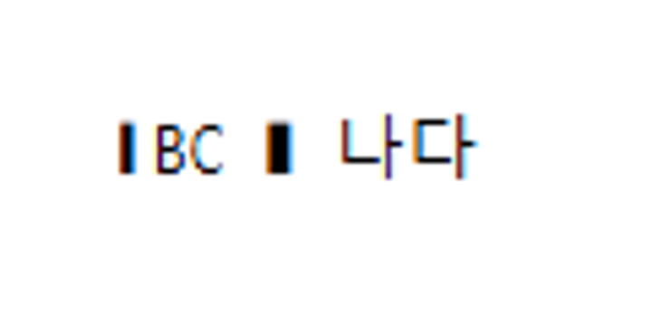

# 보안 패치 devel 통합 검증 — 2026-10-06

검증 code head `652057732e0efaaba522f11544c7e540c550efcc`, 고정 base `e8cc27778011ce8b54e823fa7edb446b979304a6`. 다섯 수정 commit을 순차 merge했으며 코드 충돌은 없었다. 같은 SVG 수정은 한 번만 포함한다. 이후 제출 commit은 검토 문서와 통제된 PNG만 추가하며 source·test 변경이 없다.

## 수정과 독립 검증 계약

| 범위 | 적용 경로와 검사 |
| --- | --- |
| SVG 글꼴 | IR face는 보존하고 CSS 문자열·XML text 경계에서 직렬화한다. 두 DocumentCore export 경로 → stylesheet wrapper → 최종 SVG를 검사한다. 실제 Chrome CSSOM에서 원 face 복원, script/marker 0, style/rule 각 1, descriptor 두 개만 확인한다. |
| IPv6 | Chrome/Firefox fetch·redirect, Safari 실제 handler의 Node VM, 공통 validator에서 private 16종/public 3종을 검사한다. 실제 내부망 요청은 보내지 않는다. |
| HWP3 | 큰 parser frame 전에 scoped 16-level 진입 guard를 둔다. root+15 허용/16 거절, 오류 뒤 1천 sibling, 2만 겹 오류 반환, 저장본 3종을 검사한다. |
| 썸네일 | 기존 크기 방어를 유지하며 표준 deflate-raw format으로 정상 raw DEFLATE를 연다. stored/deflate·declared/actual 크기·실패 뒤 재시도를 검사한다. 무제한 해제의 기존 방어와 호환성 보정을 구분한다. |
| 연결 그림/XML | 실제 지원 이미지 형식·최종 SVG basename 표시·정상 PNG를 검사한다. reader와 암호 prepass의 actual-read 512MiB XML 예산과 fatal 오류 전달을 평문/outer/inner Native 경로에서 확인한다. |

수정 전 검출 증거는 범위별 초기 검증에 보존했다: SVG 초기 정상 대조군 PASS/주입 경계 FAIL 2개, mapped IPv6 내부 주소 허용 FAIL, HWP3 20겹 허용 FAIL, raw DEFLATE 정상 스트림 FAIL, 비이미지 옆 파일과 XML 예산 경계 FAIL. 초기 source와 최종 source 검증은 구분한다. 최종 확장 cases 모두를 수정 전 실행했다고 주장하지 않는다.

## 최종 통합 head 결과

| 검사 | 결과 |
| --- | --- |
| fmt, Native/WASM/workspace Clippy, workspace build | PASS |
| 고정 base manifest/unit tier | PASS: 1,482 sources / 6,380 attrs / 48 targets; unit 4,199 / 298 modules |
| 전체 release-test nextest | 10,508 PASS / 0 FAIL / 50 skip, 497.656초 |
| 전용 Rust cases | SVG 6, HWP3 4, 연결 그림/XML 4, 암호 XML 3: 17/17 PASS |
| Native Skia | workspace lib 합계 4,109 PASS / 13 ignored; missing-picture 2/2, direct PDF 4/4 PASS |
| JS | IPv6 matrix·Safari handler VM·Chrome fetch-security·thumbnail 8개·변경 JS syntax PASS |
| fresh WASM/CDP | SVG Screen/Print CSSOM·12 geometry, HWP3 깊이 및 평문/암호 outer XML 오류, 정상 password/HWP3/표 렌더링 PASS |
| 동일 합성 입력 Native/WASM PNG | 두 profile 각 1,000×1,400, 차이 픽셀 0. 전체 PNG와 crop/overlay를 직접 판독했다. |

Native/fresh WASM의 글꼴·정상 password·password outer 초과 입력은 이번 Native focused에서 생성한 동일 바이트를 공급했다. HWP3 정상 저장본은 `samples/hwp3-sample.hwp`의 검토 commit과 byte identity를 확인했다. 입력 SHA-256:

- embedded-font-boundary.hwpx: `e9e028941cb4b0f2fe97436e28fbda64c6cc197fdc1da909786a965b71772b39`
- normal-password.hwpx: `ec2c67393c9df4b85c465cd9d1ae2a68b197b86721c13d2d244a77e9df9bc038`
- password-outer-xml-budget.hwpx: `7a10fbf959ecf8720e188c4351fdaf6be7b176d90f95d5a3b78626efc33d4927`
- samples/hwp3-sample.hwp: `645525c8cd5ec11b1742ba7cfc759f68622861916233b5e982385cdb12f0ced2`

합성 글꼴에서 A/가의 검은 직사각형 glyph는 시험용 TTF의 의도한 모양이다. Native/WASM 내용 bbox는 `(121,141)-(188,153)`이며, 아래 이미지는 `(100,120)-(220,180)` crop을 6배 확대했다.




루트 pkg·Studio public·실제 CDP 공급 package의 파일이 byte 일치한다. rhwp.js SHA-256 `70cde06a369fa7fd4fc8bc8f3d6acaee158596ba1a116a2c72159002b0b5654e`, rhwp_bg.wasm SHA-256 `002f5a1bd54bb33397468909fbcd2fccff66e0a78d6b0db88592be288878f225`.

## 적용 여부와 한계

조판 줄 구성·좌표·분할·golden·baseline·래칫 허용치는 변경하지 않았다. XML/CSS 직렬화 보안 계약과 정상 대조를 검증한 것이며 한컴 PDF 조판 일치 또는 90% Visual Sweep 통과를 주장하지 않는다. Source 테스트가 생성하는 통제된 입력의 최종 SVG/DOM을 검사하며 private corpus와 신고 원문은 포함하지 않는다.

Safari macOS 실기기, HWP3의 모든 악성 drawing/table/caption 조합, trusted 직접 IR 무제한 깊이, non-XML/BinData 전체 예산·총 RSS와 모든 backend 자리표시, inner password의 fresh WASM은 미검증이다. Native inner password 계약과 구분한다. nextest 0.9.137/권장 0.9.140 및 기본 skip 50개·Skia ignore 13개도 실행 환경의 한계다.

원시 로그·브라우저 관측·중간 JSON은 ignored `output/pr-review/`에 보존하고 Git에 포함하지 않는다. 재실행 명령은 아래와 같으며 Cargo 작업은 공유 target에서 순차 실행했다.

```bash
node scripts/rust-test-suite-manifest.mjs --prepare
cargo fmt --all
cargo fmt --all -- --check
cargo clippy --locked --target-dir target/pr-review -- -D warnings
cargo clippy --locked -p rhwp --lib --target wasm32-unknown-unknown --target-dir target/pr-review -- -D warnings
cargo build --locked --workspace --target-dir target/pr-review
cargo clippy --locked --workspace --all-targets --target-dir target/pr-review -- -D warnings
node scripts/rust-test-suite-manifest.mjs --check --base-ref e8cc27778011ce8b54e823fa7edb446b979304a6
node scripts/rust-unit-test-tiers.mjs --check --base-ref e8cc27778011ce8b54e823fa7edb446b979304a6
cargo nextest run --locked --cargo-profile release-test --target-dir target/pr-review --tests --test-threads 8 --no-fail-fast
cargo test --locked --profile release-test --target-dir target/pr-review --features native-skia --lib -- --test-threads 8
node scripts/run-rust-test.mjs issue_2225_missing_picture_placeholder -- --cargo-profile release-test --target-dir target/pr-review --features native-skia
node scripts/run-rust-test.mjs render_p37_direct_pdf_export -- --cargo-profile release-test --target-dir target/pr-review --features native-skia
CARGO_TARGET_DIR=target/pr-review scripts/wasm-pack-locked.sh --target web --out-dir pkg
node rhwp-shared/security/ipv6-boundary.test.mjs
node --test rhwp-chrome/sw/fetch-security.test.mjs rhwp-shared/sw/thumbnail-decompression.test.js
```

이 PR은 코드 통합이다. 공개 advisory 게시·CVE 번호 배정·릴리스·신고 종료는 별도 절차이며 수행 사실로 기록하지 않는다.
