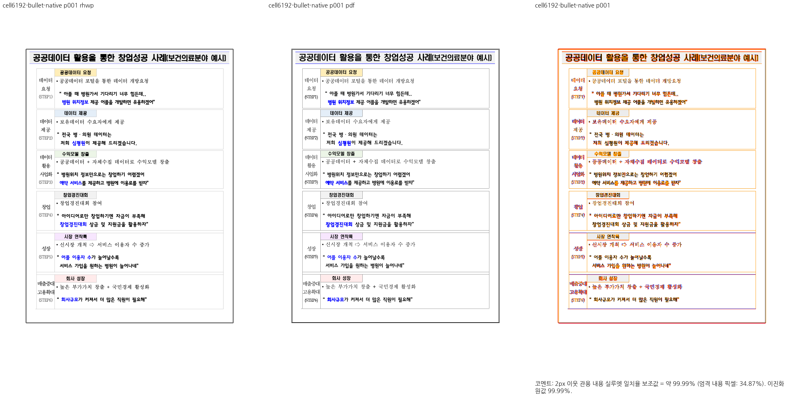
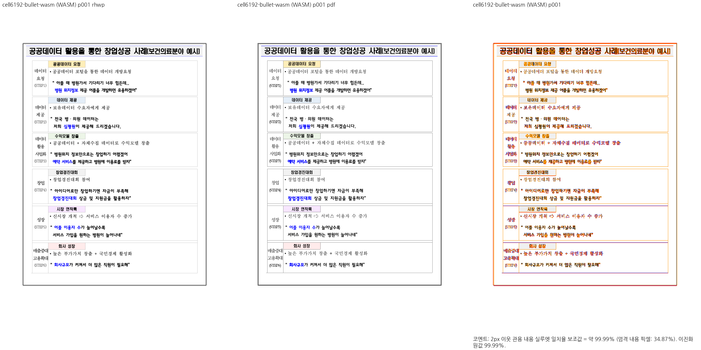
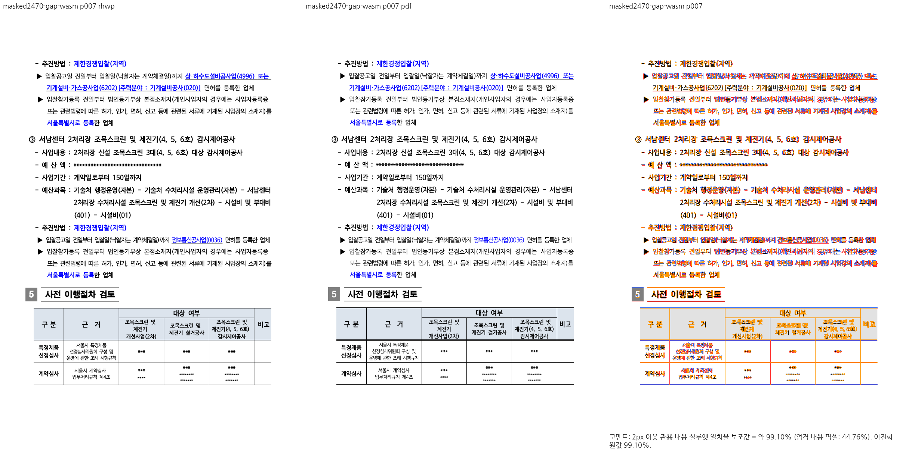

# PR #7423 검토 — 수정(조판): 쪽을 끝내는 조각의 마지막 행 상자를 배치 뒤에 접는다 (#6976, #7063)

## 최종 판정

**메인터너 보정 후 수용 가능.** 원 PR head `07ec370f2c035d81007efffd415e3b740e752e55`의 직접 병합 판정과 구분합니다. `review/planet6897-green-20261002`의 검증 head `859d1ddefc2f70180fd8009d7124804bdd9d76d8`는 최신 base `1d6bc70767fad365b07afe4ef57972d23b140f2b` 위에서 원 기여·중복 제거·메인터너 보정을 함께 검증했습니다. 원 source head는 접수 이후 바뀌지 않았으며 source CI에 실패·진행 중인 check가 없습니다. 현재 source PR 병합 상태는 `DIRTY`입니다.

- 수용 대상은 보정이 포함된 통합 head입니다. 새 통합 PR의 최신 required CI와 mergeability를 확인한 뒤 승인된 병합·후속처리를 수행합니다. 원 PR 자체를 직접 merge하지 않습니다.
- 대형/낮은 피델리티 입력의 기존 #7445 이관은 보존했습니다. 이 판정은 해당 문서 전체 피델리티 완료나 관련 issue 전체 해결을 뜻하지 않습니다.

## 기여자 중심 최종 검토 — 2026-10-04

### 기여 내용과 메인터너 보정

쪽을 끝내는 표 조각의 마지막 행을 실제 배치 경계에 맞게 접고, 조각 상자·내용·정렬 높이를 구분하신 기여입니다.

새 devel의 저장 열림 정렬과 접힘 상태를 함께 전달했습니다. issue2004의 후행 간격 소비와 기준축 역산을 일치시켰고 종료 행·이어받기·본문 소유의 의미 계약을 보존했습니다. 원본과 맞지 않는 과거 좌표 핀을 복구하지 않았습니다.

원 기여의 저자와 출처를 보존했습니다. 해당 PR의 원본 커밋과 현재 리베이스 후 적용 SHA는 [최종 적용 원장](../assets/planet6897_green_20261002/final_applied_provenance.json)에 기록했습니다. 누적 통합의 공통 보정 결과를 이 원 PR만의 단독 결과로 표기하지 않습니다.

### 최종 검증과 조판 원칙

- 검증 head `859d1ddefc2f70180fd8009d7124804bdd9d76d8`: 전체 nextest10,288PASS/0FAIL·50skip(9slow)·497.515초·exit0. release-test/target/pr-review/threads8/no-fail-fast로 수행했습니다.
- Native Skia 라이브러리4,109PASS/0FAIL·13ignored, 누락 그림2PASS, 직접 PDF4PASS이며 모든 명령exit0입니다. Native/WASM Clippy·fmt·workspace build·all-target Clippy·manifest도exit0입니다. fresh WASM은 Mac 로컬 no-opt 대체 빌드이며 Docker 최적화 검증으로 보고하지 않습니다.
- 측정→예약/컷→실제 배치·paint가 같은 원점/여백/내용 소유를 소비하도록 검토했습니다. 원본 저장 글줄 유효성·정상 반례·비겹침·누락/중복을 확인하고 문서ID 예외·좌표clamp·출력 숨김·임계값 변경을 보정으로 사용하지 않았습니다. 이전 픽셀 핀은 독립 시각 근거를 확보한 범위에서 기존 검사의 의미 관계로 교정했습니다.
- [개별 변경 관련 증거](../assets/planet6897_green_20261002/issue2004_stored_gap_evidence.json), [최종 공통 검증](../assets/planet6897_green_20261002/final_validation.json), [원 source head·CI 재조회](../assets/planet6897_green_20261002/final_source_metadata.json), [검증 입력 commit 일치](../assets/planet6897_green_20261002/final_input_commit_check.json).
- 정책연구 Native/fresh WASM215/PDF215쪽: 최저90.30307%·90% 미달0. 첫 조각 보정90쪽99.15148%·94쪽99.88068%, 종료 조각91쪽98.91458%·95쪽99.15957%를 직접 판독했으며 각주 참조와 소유를 유지했습니다. 전체 SVG215쪽 중 변경2쪽을 새 raster로 확인하고 동일 SVG213쪽은 기존 전쪽 PNG 비교를 재사용했습니다. 전215쪽을 새로 raster했다고 보고하지 않습니다.
- [Native 전쪽 TSV](../assets/planet6897_green_20261002/liver_p90_native_whole215.tsv), [fresh WASM 전쪽 TSV](../assets/planet6897_green_20261002/liver_p90_wasm_whole215.tsv), [90쪽 review](../assets/planet6897_green_20261002/liver_p90_native_review.png), [94쪽 review](../assets/planet6897_green_20261002/liver_p94_native_review.png). 정상5문서42쪽은 Native tree/fresh WASM SVG가 기존 승인 증적과 동일합니다. 모든 다른 문서의 전체 피델리티를 이215쪽 지표로 대신하지 않습니다.

### Merge 후 contributor PR comment 계획

통합 PR의 merge SHA와 최신 CI URL을 확정한 뒤 이 원 PR에 다음 내용으로 한국어 존댓말 comment를 게시하고, 통합 PR에서 대체 병합됐음을 링크한 뒤 close합니다. 원본 fork branch는 보존하고 관련 issue를 이 기록만으로 자동 종료하지 않습니다.

> 기여해 주신 변경을 통합 브랜치에서 검토했습니다. 쪽을 끝내는 표 조각의 마지막 행을 실제 배치 경계에 맞게 접고, 조각 상자·내용·정렬 높이를 구분하신 기여입니다. 새 devel의 저장 열림 정렬과 접힘 상태를 함께 전달했습니다. issue2004의 후행 간격 소비와 기준축 역산을 일치시켰고 종료 행·이어받기·본문 소유의 의미 계약을 보존했습니다. 원본과 맞지 않는 과거 좌표 핀을 복구하지 않았습니다. 보정된 후보의 전체 회귀10,288건과 Native Skia 검증이 통과했습니다. 수용 범위·잔여 #7445 과제·시각 증적은 개별 검토 문서에 남겼습니다. 통합 PR과 최종 merge SHA·CI 링크를 함께 안내드리겠습니다.

실제 게시에서는 통합 PR/merge SHA/CI URL을 확정 값으로 치환하고 [Visual Sweep 정본](../../manual/verification/visual_sweep_guide.md#github-merge-comment), 위 대표 PNG의 merge SHA 고정 raw URL, 남은 범위를 포함합니다. UTF-8 본문 파일의 `--body-file`로 게시하고 API 재조회로 한글·링크·게시 내용과 close 상태를 확인합니다.

이하 접수·단계 실행 기록은 과거 head별 이력입니다. 과거의 “보류/진행 중”은 위 최종 검증을 대체하지 않습니다.

## 통합 PR #7568 code candidate CI 완료

- 통합 PR: [#7568](https://github.com/edwardkim/rhwp/pull/7568). 정확한 code candidate `65b2163618e5367c29423c199a6f6810985bcdab`의 Full CI가 완료됐습니다. Build & Test와 Archive A/B/C/D·Native Skia·lint·frontend package, CodeQL 언어 분석, Render Diff, Adapter, Proptest 및 CI Impact Policy가 성공했습니다. 미해당 job의 skipped와 CodeQL의 허용 상태를 개별 원장에 구분했습니다.
- [CI run 37192651788](https://github.com/edwardkim/rhwp/actions/runs/37192651788) · [CI run 37192651818](https://github.com/edwardkim/rhwp/actions/runs/37192651818) · [CI run 37192651981](https://github.com/edwardkim/rhwp/actions/runs/37192651981) · [CI run 37192651982](https://github.com/edwardkim/rhwp/actions/runs/37192651982) · [CI run 37192652005](https://github.com/edwardkim/rhwp/actions/runs/37192652005) · [CI run 37192652006](https://github.com/edwardkim/rhwp/actions/runs/37192652006) · [CI run 37193719048](https://github.com/edwardkim/rhwp/actions/runs/37193719048)
- [정확한 candidate check 원장](../assets/planet6897_green_20261002/code_candidate_ci.json). PR은 현재 MERGEABLE/CLEAN입니다. 본 기록은 review-only trailing commit이며 생산 소스·테스트는 candidate 이후 동일합니다. 최신 trailing head의 check·재사용 출처·mergeability를 다시 확인한 뒤 병합합니다.

## 접수·기여자·출처

- 원 PR: https://github.com/edwardkim/rhwp/pull/7423, 작성자 planet6897, base `devel`, 정확한 head `07ec370f2c035d81007efffd415e3b740e752e55`.
- reviewer jangster77을 지정했습니다. 원 contributor 변경과 메인터너 충돌 보정을 구분해 기록합니다.
- 사전 선택: collaborator_external_pr 9.1.1 체리픽 통합 경로; intake/local_validation/visual_fixture_evidence/multi_pr_update_branch/post_merge 적용.
- source CI는 통합 head 검증을 대체하지 않습니다. 모든 renderer·페이지 변경은 직접 Native/fresh WASM 전쪽 TSV와 영향 경계 review/overlay를 검토합니다.

## 체리픽 계획

| source commit | 판정 | 변경 |
| --- | --- | --- |
| `3cb7daba69fc734879e672434f1547c4a7d24100` | candidate | 수정(조판): 자리차지 RowBreak 조각의 바깥 위 여백을 원본 HWPX 계보에도 연다 (#7063) |
| `040fa9b2bf9a343c6117a670235be1f518e06963` | candidate | 수정(조판): 쪽 중간 조각의 상자·내용·정렬 높이를 가른다 (#7063 레인②) |
| `e3a4456bd263884d73fe59f759421b1ce222baf6` | candidate | 수정(조판): 쪽을 끝내는 조각의 마지막 행 상자를 배치 뒤에 접는다 (#6976) |
| `07ec370f2c035d81007efffd415e3b740e752e55` | merge excluded | Merge branch 'devel' into work/7063-lane1 |

## 변경 범위와 검토 계획

- 원 PR 변경 823줄 추가·36줄 삭제·32파일입니다.
- 생산 경로: `src/document_core/queries/cursor_rect.rs`, `src/renderer/layout/table_partial.rs`, `src/wasm_api/tests.rs`.
- 실제 호출 경로의 측정→예약/컷→paint 소비를 추적하고 정상 대조군·원본 저장 정보의 유효성을 확인합니다. 문단·행·개체·각주 소유와 누락/중복을 기존 검사 의미로 판단하며 픽셀 핀을 승인 근거로 사용하지 않습니다.
- 원본·기준 PDF와 검토 commit의 실제 파일/해시 일치를 확인합니다. 통합 출력과 PDF의 전체 쪽수가 다르거나 미달쪽이 있으면 재검토합니다. 원 PR의 부분 개선 주장을 전체 피델리티 완료로 확대하지 않습니다.
- 합성/실물 경계 회귀·전체 nextest threads8·Native Skia3·필수 lint/정책·fresh WASM은 누적 후보에서 순차 수행합니다. 로그는 ignored output에만 저장합니다.

## 실행 결과

고유 source commit 63개 체리픽을 완료했습니다. 출처와 보정은 [적용 원장](../assets/planet6897_green_20261002/applied_commits.json)에 기록했습니다. 현재 후보 `ec5ca7c3057a89c9a82bb59a78956a4d5eee567d`의 Native Clippy는 exit0이며 전체 nextest는 실행 중입니다. 최종 회귀·시각 검증은 미완료입니다.

## 단계1 선행 commit 충돌 분석과 보정

- 원 선행3cb7daba는 issue4771의 과거 절대좌표 기대에 여백283HU 이동량을 더합니다. 최신 devel은 이미 문단/그림 소유·셀 관계 검사로 교정되어 이 좌표 지역변수가 없습니다. 최신 의미 회귀를 유지하고 사용하지 않는 픽셀 이동량을 다시 도입하지 않습니다.
- text_overlap baseline의 최신 PrEP 보정 주석과 source의 rowbreak-problem-pages 유보 주석이 충돌했습니다. #7505에서 제외한 실제 대형 차단 행을 독립 전쪽 검증 없이 다시 넣거나 상한을 완화하지 않고 현재 baseline을 유지합니다. 생산 경로의 HWPX 원본 여백 개방은 적용하고, paint·예산의 서로 다른 계보 조건과 분할 반례는 통합 검토에서 확인합니다. 적용 단계의 검증은 아직 미실행이며 최종 판정은 보류입니다.

## 단계2 이어받기 충돌 분석과 보정

- source040fa9b2는 #7505에서 실제 대형 미달 입력으로 보류한 issue6923의 절대좌표 함수를 다시 추가합니다. 최신 유지 검사·보류 범위를 보존하며 독립 전쪽 검증 없이 이 함수를 되살리지 않습니다. 같은 source의 off_canvas hwpx_sample2 행 재추가도 현재 baseline으로 유지합니다.
- 생산 코드의 상자 높이·내용 예산·정렬 높이 분리는 우선 누적 적용합니다. source의 `d7063_pin=true` 상수로 조건을 무조건 여는 부분은 일반성 검토 대상으로 남깁니다. 컷·행/내용 소유·예산/paint의 소비 일치와 정상 반례 검증 전에는 수용하지 않습니다.

## 단계3 셀 배치·테두리 충돌 분석과 보정

- sourcee3a4456b의 마지막 행 paint 접기 인자가 최신 devel의 첫 저장 프레임 정렬 인자와 같은 위치에 추가되어 충돌했습니다. 셀 함수와 호출에 세 인자를 함께 전달해 각 상태를 유지합니다.
- source 접기 후처리와 최신 어울림 표 이어받기 열린 윗변 처리가 같은 함수 말미에 있어 충돌했습니다. 접기 후처리와 열린 윗변 처리, 이어지는 종료 프레임 확장을 모두 보존하며 어느 쪽 코드도 통째 교체하지 않습니다. 실제 접기·마지막 행 소유·셀 내용 포함·후속 문단과 예산 예약 관계는 집중 검증에서 확인합니다. 아직 수용/전수 통과가 아닙니다.

### 통합 후 보정: 무조건 프레임 고정 분기 제거

- 원인: 원 PR의 `d7063_pin = true`가 조각 시작 위치·상단 정렬·저장 되감김 근거의 기존 조건을 항상 참으로 만들었습니다. 중간에서 시작하는 가운데 정렬 반례에서도 상자 크기가 바뀔 수 있어 조판 규칙 근거 없는 강제 고정입니다.
- 수정: 상수 우회를 제거하고 기존 쪽 상단/내용 상단 정렬 및 저장 되감김 조건을 유지합니다. 원 PR의 예산 높이와 그리는 상자 높이 분리·마지막 행 접기는 유지합니다. #7063 정상 사례와 가운데 정렬 반례를 현재 후보에서 검증합니다.
- 구문·diff 확인 후 커밋하며, 시각/회귀 통과 결과는 후속 검증에서 기록합니다.

### 누적 후보 검증 시작

- 검증 코드 head: `ec5ca7c3057a89c9a82bb59a78956a4d5eee567d`. Native Clippy exit0(34.38초). 전체 nextest release-test/threads8/no-fail-fast 실행 중이며 통합 시각 검증은 아직 미완료입니다. 원 PR의 green CI와 구분합니다.

### 메인터너 보정 사전 분석: 저장 높이로 정하는 중간 조각 상자

- 앞의 상수 우회 제거는 필요한 조판 근거를 복구했지만 쪽 상단 시작 조건까지 유지하여 원 PR의 중간 시작 가운데 정렬 조각 3개가 실패했습니다. 독립 한컴 PDF19쪽의 상자1081.39와 예산/내용 높이 분리 근거를 다시 확인했습니다.
- 저장 셀 높이가 현재 쪽 조각 상자를 포함하는 경우에는 시작 위치와 관계없이 그 상자가 프레임을 소유합니다. 반면 저장 높이가 작은 가운데 정렬 셀과 합성 그림 투영 줄은 내용이 높이를 정합니다. 이미 있는 `stored_cell_spans_page_box`와 `projected_content`가 이 두 경우를 구분하므로 상수 우회 대신 이 실제 계약으로 판정하고 중복 시작 위치 조건을 제거하겠습니다.
- 원 PR의 상자/내용 높이 분리는 유지하며 기존 가운데 정렬 반례와 새 상자 소유 검사로 검증합니다.

### 저장 높이 기반 상자 보정 결과

- 시작 위치의 중복 조건과 상수 우회 없이 저장 셀 높이/합성 투영 구분으로 조각 상자를 결정합니다.
- nextest release-test/threads8/no-fail-fast로 중간 조각2개, 마지막 행 접기3개, #6923 저장 프레임10개, #7095 쪽 상자10개를 실행해 총25PASS/0FAIL입니다. 합성 그림 투영·작은 저장 높이 가운데 정렬의 정상 대조군도 통과했습니다. 최초 상자 소유 실패3개는 focused에서 해결했습니다.
- 전체 재검증 및 다른 조각 예약/paint 불일치 분석은 남아 있습니다. 새 검사를 추가하거나 기대값을 현재 좌표로 바꾸지 않았습니다.

### 메인터너 보정 사전 분석: 유한 저장 프레임의 빈 공간

- 기존 #1749 회귀는 원본 개체 높이가 첫 조각 프레임을 소유하고 나머지 행합이 다음 빈 문단 원점을 정확히 닫는다는 독립 저장 계약입니다. 새 마지막 행 접기는 이 프레임의 빈 공간도 콘텐츠 여분으로 보고 줄일 수 있었습니다.
- 이미 계산된 `align_saved_opening_frame`은 원본 높이와 실제 조각 높이가 일치하는 유한 프레임의 소유 증거입니다. 이 프레임을 접기에서 제외하고, 접는 대상도 다음 쪽으로 이어지는 조각으로 한정하겠습니다. 선언 공간을 단순 콘텐츠 빈 공간으로 제거하지 않는 보정입니다.
- #1749·#7203 기존 회귀와 #6976 원 PR 정상 접기를 재실행하고, 실제 결과로 수용 여부를 판단합니다.

### 유한 저장 프레임 보정 결과

- 유한 저장 프레임은 접기에서 제외하고 실제 이어지는 조각만 대상으로 했습니다. 원본 프레임의 빈 공간을 지워 맞추는 처리를 제거했습니다.
- #1749 기존3개, #7203 기존6개, #6976 정상 접기3개는 nextest release-test/threads8/no-fail-fast에서 모두 PASS입니다. #1749의 빈 프레임 소유 실패1개와 #7203의 예약/paint·이어받기 실패2개를 기대값 변경 없이 해결했습니다. 원 PR이 개선한 정상 접기는 유지됩니다. 다른 통합 실패 및 최종 전체 검증은 남아 있습니다.

### 기존 표 조각 교차 검증 결과

- 유한 프레임·종료 조각 보정 후 #6950·RowBreak 그림 겹침·#7243 기존 검사 47개를 함께 실행하여 44PASS/3FAIL입니다. `issue_rowbreak_chart_overlap`의 13쪽 실패는 기대값 변경 없이 통과했습니다.
- 잔존 실패는 #6950의 축소 본문 경계 1개와 #7243의 후속 표 상대 원점 2개입니다. 이전 첫 전체 실행의 실패 33개 중 27개를 focused에서 해결하거나 잘못 재등록된 검사를 제거했으며, 6개와 최종 전체 검증이 남아 있습니다. 전체 통과나 승인 완료로 보고하지 않습니다.
- 실행 로그: `output/pr-review/planet6897-green-20261002/nextest-remaining-geometry.log`, nextest release-test/threads8/no-fail-fast, exit100.

### 누적 후보 검증 상태 갱신 (2026-10-02)

- GitHub를 다시 조회한 결과 선택 당시의 원 PR head와 CI green 상태가 유지됩니다. #7435는 현재도 non-green이며 선택에 포함하지 않았습니다. 누적 후보는 `review/planet6897-green-20261002`, source 고유 커밋63개입니다.
- 최초 전체 nextest는 10,283개 중10,250PASS/33FAIL/50SKIP, exit100으로 완료했습니다. 그 뒤 PR별 보정과 focused 재검증으로 최초 실패28개를 처리했으며 5개가 남았습니다. 전체 재실행 통과로 바꾸어 보고하지 않습니다.
- 각주 빈 번호·합성 사다리·다열 표 대조군·중첩 표 후속 원점의 잔존 5개와 whole fixture 시각 보류를 [현재 검증 기록](../assets/planet6897_green_20261002/review_progress.json)에 기록했습니다. 원 PR별 기존 분석·커밋 출처는 위 내용을 유지합니다.
- **현재 통합 승인/머지 보류**입니다. 원 PR의 green CI는 누적 후보의 실패 또는 미완료 Native/fresh WASM 시각 검증을 대체하지 않습니다. 새 통합 PR 생성·push·머지는 하지 않았습니다.

### 메인터너 보정 준비: 단일 TAC 저장 원점

- 원본 `samples/issue2004_cell_image_stack.hwpx`는 한컴 저장 줄을 가진 8쪽 문서입니다. 독립 `pdf/issue2004_cell_image_stack-hwpx-2020.pdf`의 3쪽 명단 표 상단은 약 225.19px입니다. 저장 vpos 10382HU와 바깥 위여백 283HU는 약 225.35px를 지시하지만 현재 출력은 약 220.5px입니다.
- 생산 결과 `composer::stored_tac_lines`는 줄 높이가 선언 표 높이와 위·아래 여백의 합과 정확히 같은지 확인한 뒤 단일 표라는 이유로 버립니다. 소비자인 `stored_tac::prepare`는 측정 높이 일치·쪽 수용을 검사하고 저장/현재 흐름의 큰 원점을 선택합니다. 확정 placement는 layout의 `inline_placements`에서 위여백을 한 번 더해 paint에 전달됩니다.
- 검토할 수정은 다른 줄이 없는 빈 host의 단일 저장 표에도 이 계약을 적용하는 것입니다. 글자가 있는 host, 편집/합성 줄, 측정 높이가 달라진 표, 수용되지 않는 표는 기존 재조판을 유지합니다. 각주 예약은 일반 경로에 남깁니다. 표 크기·문서 ID로 예외를 만들지 않습니다. 정상 TAC·공백 캐리어·분할 경계를 집중 검사하고 8쪽 Native/fresh WASM을 다시 비교합니다. 아직 결과 미확정입니다.

- 1차 진단: 단일 표 개방만 적용한 Native 3쪽은 58.48267%로 변화가 없었습니다. 기존 TAC·분할 검사 33개 중 32개 통과, #7312 후속 문단 저장 사다리 검사가 3.78px 차이로 실패했습니다. 이 후보는 수용하지 않으며, 실제 측정 수용과 원점 선택을 추가 추적합니다. 출력·로그는 `output/pr-review/planet6897-green-20261002/single-tac-*`에 남겼습니다.

- 실제 원인 재확인: 진단에서 명단 표의 측정·수용은 모두 참이었고 저장 원점 자체가 이미 낮았습니다. 첫 표 pi36은 `prepare_computed`의 양수 저장 단 상단 경로를 사용합니다. 원본 줄간격 720HU 중 절반만 소비한 뒤 `controls::try_place_stored_tac_paragraph`가 전량 포함 저장 끝으로 lazy 기준축을 역산하여 360HU의 잘못된 base를 기록했습니다. 이후 pi39 저장 vpos에서도 이 값이 차감되었습니다.
- 수정 범위 재설정: 단일 표 개방과 임시 진단 코드는 되돌립니다. 원본 저장 단 상단 줄은 저장 줄간격을 전량 소비하며, 저장 좌표 없는 합성 줄의 빈 후속 문단 간격 분배는 유지합니다. 생산 `prepare_computed.end` → 소비 `record_vpos_lazy_origin` → 다음 저장 원점과 paint가 같은 끝점을 쓰게 합니다. 절대 위치 clamp나 fixture별 예외는 없습니다.

- 보정 결과: Native 8/8쪽, PDF 8쪽으로 일치합니다. [전쪽 TSV](../assets/planet6897_green_20261002/issue2004_stored_gap_native.tsv)의 최저값은 95.85551%, 3쪽은 58.48267% → 97.64619%입니다. [3쪽 review PNG](../assets/planet6897_green_20261002/issue2004_p3_stored_gap_native.png)를 직접 확인했으며 명단 15명과 표의 모든 행·열이 보존됩니다. 원본 HWPX·기준 PDF는 변경하지 않았습니다.
- 정상 대조군: #7312 1개, #6737 2개, #6298 2개, #6950 28개, 총 33개 PASS(nextest release-test, threads8, no-fail-fast, exit0). 앞선 단일 표 개방 시 실패했던 #7312도 통과합니다. 기존 함수/fixture 추가·삭제는 없습니다.
- [출처·범위 기록](../assets/planet6897_green_20261002/issue2004_stored_gap_evidence.json)의 Native 증적을 커밋합니다. fresh WASM과 최종 전체 회귀는 아직 미완료이므로 PR 최종 판정은 보류를 유지합니다.

### 저장 간격 보정의 fresh WASM·기존 검사 완료

- 코드 commit `0305f8f22`의 fresh WASM 빌드 exit0입니다. 실제 WASM render tree·SVG로 원본 8쪽 전체를 비교한 [WASM TSV](../assets/planet6897_green_20261002/issue2004_stored_gap_wasm.tsv)도 최저 95.85551%, 3쪽 97.64619%로 Native와 같습니다. 8/8쪽이며 미달·측정 불가 쪽이 없습니다. Mac 로컬 대체 빌드이고 Docker 최적화 빌드는 수행하지 않았습니다.
- 기존 `issue_2004_projection_preserves_each_picture_identity_and_final_bounds` 안에 3쪽 두 표의 상대 원점 관계를 추가했습니다. 첫 표의 실제 높이로 물리 단위를 환산하여 원본 저장 줄·바깥여백의 상대 차이를 검사합니다. 절대 픽셀 좌표나 전체 SVG 해시는 고정하지 않습니다. 과거 출력 tree에서는 이 관계가 실패하고, 보정 출력 및 실제 기존 case nextest 6개는 통과합니다. 새 함수·fixture는 없습니다.
- unit tier/base 정책과 suite manifest 검사 exit0입니다. 이 8쪽 문서의 보류 사유는 해결됐으나, 별도 29쪽 다열 표와 누적 후보 최종 전체 검증은 아직 보류입니다. 최초 33개 실패 중 focused 처리32개·잔존1개라는 판정은 유지합니다.

### 마지막 실패 대조군의 메인터너 검토 준비

- `issue_7063_hwpx_multi_column_fragment_stays_outside_this_lane`는 함수 바로 위에 독립 한컴 기준 41.55px, 종전 출력 37.80px를 미해결 잔여라고 명시하면서 종전 값을 유지하도록 assert합니다. 최초 전체 nextest의 실제 41.56px는 기준 쪽 상단과 일치하지만 이 잘못된 동결 때문에 실패했습니다. 이 assertion을 통과시키려고 renderer를 원래 잘못된 좌표로 되돌릴 수 없습니다.
- 동일 원본 29쪽 문서는 다른 표 내용/줄 구성 차이로 전체 최저27.60393%, 28쪽50.63064%입니다. 이 결과를 정상 전체 렌더링으로 인정하거나 새 좌표 golden을 등록하지 않습니다. 이번 단계에서는 잘못된 출력 동결 함수 하나만 제거하고, 나머지 기존 세 검사와 원본 HWPX·PDF 및 시각 보류 기록을 유지합니다. 입력 전체 삭제·다른 회귀의 일괄 이관은 하지 않습니다.
- 기존 일반/분할 조판 반례는 #6950 28개를 이미 통과했습니다. 삭제 후 #7063의 남은 세 검사를 nextest로 실행하고, 실제 제거와 유지 범위를 기록한 뒤 커밋합니다. 29쪽 시각 보류 해결이나 최종 전체 통과로 확대 보고하지 않습니다.

- 실행 결과: 잘못된 종전 출력만 동결한 함수 1개를 제거했습니다. 동일 파일의 첫 조각·이어받음·0 위여백 기존 3개 검사 모두 PASS(nextest release-test threads8, exit0). 원본 `samples/hwpx_sample2.hwpx`, 기준 `pdf/hwpx_sample2-hwpx-2020.pdf`, 나머지 세 함수와 다른 회귀는 유지됩니다. 생산 코드는 이번 단계에서 변경하지 않았고, 독립 기준과 다른 동결값을 새로운 값으로 갈아 끼우지 않았습니다.
- 최초 33개 실패의 개별 처리는 끝났습니다(오류 검사 제외를 포함). 최종 전체 nextest는 아직 재실행 전이며 29쪽 문서의 실제 시각 보류는 남아 있습니다.

### 새 실패 보정 준비: 완료 조각의 쪽 상한과 줄간격 축소 분리

- 새 전체 실패 중 #7095 다행 쪽 상한과 #7379 그림11 좁은 본문 예산 반례를 검토합니다. 원본 `samples/issue7336/stored_frame_page_larger_rowbreak.hwpx`는7쪽, 독립 `pdf/issue7336/stored_frame_page_larger_rowbreak-2020.pdf`도7쪽이며 수정 전 Native 전쪽 최저97.38287%입니다. 5쪽은 표의 마지막 행까지 완료됐지만 테두리가 본문 하단 상한을 넘어갑니다. 독립 PDF는 이 테두리를 같은 물리 쪽 상한에서 끝냅니다.
- 원인: 이전 메인터너 보정은 완료 조각에서 잘못된 후행 줄간격 축소를 막으려고 `fold_last_row`를 실제 이어받음 조각으로 제한했습니다. 이 조건이 독립 규칙인 쪽 상한 초과분 처리까지 막았습니다. source의 기존 한컴 상한과 실제 모든 셀의 잔여 공간 계산은 유효하지만 호출이 차단됐습니다.
- 수정할 값 연결: 공통 쪽 상한과 현재 조각 하단의 차 → 셀 배치의 마지막 행 잔여 공간 수집 → 실제 여분 안에서 표·셀·grid 마지막 경계에 동일 축소를 적용합니다. 실제 이어받음의 저장 줄간격 축소와 쪽 밖 테두리의 물리 상한을 구분합니다. 완료 조각이 상한 안에서 끝나면 기존대로 유지하며, 셀 내용·아래여백은 잔여 공간 계산으로 보호합니다. 문서 ID·특정 좌표 예외는 넣지 않습니다. 기존2개 검사를 고치지 않고 renderer로 먼저 해결하며 정상 #7243/#6950도 검증합니다.

### 완료 조각 쪽 상한 보정 결과

- 완료 조각에도 독립 쪽 상한 초과분을 처리하되 실제 모든 칸의 잔여 공간 안에서만 접도록 수정했습니다. 후행 줄간격 축소의 실제 이어받음 조건은 유지했습니다. 기존 #7095의 두 기대값과 테스트 함수는 변경하지 않았습니다.
- 기존 관련 집중검사 46개는 45 PASS / 1 FAIL(exit100)입니다. #7095 두 검사는 PASS이며 #7243·#6950도 통과했습니다. #7379의 그림11 좁은 본문 예산 반례는 그대로 실패해 별도 보류로 남겼습니다. 새 전체 17개 실패 중 1개를 해결한 focused 결과이며 전체 통과로 보고하지 않습니다.
- 원본·독립 PDF·Native·fresh WASM 모두 7쪽, 전쪽 최저 일치율은 양쪽 97.74445%입니다. 5쪽은 99.79480%이며 review PNG를 직접 확인했습니다. Mac WASM --no-opt 빌드는 exit0이고 Docker 최적화 검증은 아닙니다. [Native TSV](../assets/planet6897_green_20261002/issue7336_terminal_cap_native.tsv), [WASM TSV](../assets/planet6897_green_20261002/issue7336_terminal_cap_wasm.tsv), [5쪽 비교](../assets/planet6897_green_20261002/issue7336_terminal_cap_p5_native.png), [증적](../assets/planet6897_green_20261002/issue7336_terminal_cap_evidence.json). 원본 문서·기준 PDF는 유지합니다.

### 이번 단계 종료 재검증 요약

- head `8927c6ccb`에서 이전 전체 실패17개 이름을 모두 확인했습니다. generated suite 재배정으로16개 실행15PASS/1FAIL과 별도 oracle partition7의1PASS를 합쳐16PASS/1FAIL입니다. 전체10,281개 재실행 결과가 아닙니다. [최종 집중 증적](../assets/planet6897_green_20261002/prior17_final_8927c6ccb.json).
- 잔존FAIL은29쪽 hwpx_sample2의8쪽표 용지밖1건입니다. h01의1쪽53.03132%와 큰문서 미달쪽, 최신215쪽전쪽Native/freshWASM·전체회귀 검증은 추가보류입니다. 이들을 완료로 간주하거나 blanket baseline 변경·새골든등록·원본삭제를 하지 않았습니다. PR 최종승인/머지준비는미완료입니다.

### 메인터너 보정 사전 분석: hwpx_sample2 8쪽 내용 컷

- 현재 head `359896c29` Native 재빌드로 8쪽을 비교했습니다. 원본/PDF는 모두 29쪽이며, 일치율은 50.15946%입니다. 독립 PDF에서 9쪽에 속하는 조회방법 표가 8쪽에도 배치됩니다.
- off-canvas의 903.87px 높이는 출력 표 프레임 857.1px와 다른 단순 프로필 값으로 단정할 수 없습니다. 실제 자식 중첩 표는 y1020.1에서 1129.9까지 이어집니다. 셀 내용 소유·저장 좌표와 예산 컷을 먼저 확인합니다.
- 원본 셀 첫 빈 문단은 저장 줄 높이300HU/간격180HU, 다음 문단은 vpos480HU입니다. 배치의 첫 문단은 생략되며, 첫 조각의 저장 좌표 보존은 표 바깥 앵커 offset141HU 이하에서만 열립니다. 이 바깥 offset 조건과 셀 내부 원점 계약의 관계를 검증합니다.
- 표 테두리 축소나 clip으로 내용 누출을 가리지 않습니다. 후보는 기존 컷 소유 검사 및 독립 PDF와 비교한 뒤 채택하며, 미달 결과를 새 회귀 골든으로 등록하지 않습니다.
- 첫 후보에서 저장 셀 원점을 보존하면 8쪽 일치율이 50.15946% → 62.05908%로 개선되지만 아직 미달입니다. 확정 보정으로 채택하지 않았습니다.
- 추가 추적: 컷 `0..34`의 마지막 문단21은 제목 글줄만 선택되고, 중첩 행 범위는 없습니다. 그러나 표 컨트롤 경로는 글줄이 보이면 가용 높이로 중첩 행0을 다시 그립니다. 그림과 달리 표에는 현재 컷의 컨트롤 소유 가드가 없어 다음 쪽 표가 노출되고, 가운데 정렬의 실제 내용 끝도 잘못 커집니다. 전체 원장에 중첩 행이 있는 문단은 선택된 행/재귀 컷이 있을 때만 그리는 후보를 검증합니다.
- 중첩 행 존재만으로 가르는 후보는 이 입력의 TAC 원자 줄을 판별하지 못했습니다. 관련 기존96개 중95PASS/1FAIL, 8쪽62.05908%로 여전히 보류입니다. 이 가드는 제거하고, 변경되지 않은 원본 저장 줄의 control 소유 줄과 현재 줄 범위를 직접 비교하는 후보로 좁혔습니다.
- 결과: 원본 저장 줄 소유 보정에서 29쪽 유지, off-canvas 1→0입니다. 선택된 기존 integration 검사95개 모두PASS(13.030s, exit0); 앞 후보96개 실행과 달리 이번에는 해당 integration binary를 명시해 lib unit 검사는 포함하지 않았습니다. 기존 테스트·기대값을 바꾸지 않았습니다.
- Native8쪽62.98797%/9쪽52.67182%는 아직 보류입니다. 다음 보정은 글줄과 TAC 표가 같은 문단에 있다는 이유만으로, 텍스트 뒤의 쪽 경계를 중첩 표 내부 컷으로 오인하는 가운데 정렬 제외 판정을 확인합니다. [증적](../assets/planet6897_green_20261002/sample2_source_line_owner_validation.json).

### 메인터너 보정 사전 분석: 8쪽 텍스트 끝 경계의 가운데 정렬

- 용지 밖 중복 배치는643913756에서 해결했습니다. 남은8쪽62.98797%는 원본 셀의 가운데 정렬 차이입니다.
- `centers_pinned_fragment`는 양쪽 유닛이 같은 문단이고 문단에 표가 하나라도 있으면 중첩 표 내부 컷으로 판정합니다. 문단21의 제목 글줄과 다음 쪽 TAC 표 줄은 같은 문단이지만, 현재 컷은 제목만 소유합니다.
- 배치에 사용한 원본 control 소유 줄 판정을 정렬 경계에서도 공유합니다. 실제 중첩 행/재귀 컷은 보존하며, 원본 저장 줄이 유효하지 않거나 수정·합성된 경우에는 기존 판정을 유지합니다.
- 텍스트/TAC 소유 줄을 정렬 경계와 공유한 후보만으로는8쪽62.98797%가 변하지 않았습니다. 보정 완료로 채택하지 않고 저장 쪽 프레임 reset 인식과 실제 정렬 경계의 진단을 이어갑니다.
- 실제 진단은 `cut=0..34 total=50 reset=false start_cross=false end_cross=false`입니다. 중첩 내부 컷 오인은 해소했지만, 원본 두 번째 줄의 쪽 재시작 신호가 mixed 중첩 유닛을 생성하는 경로에서 `page_frame_reset_before:false`로 버려지고 있었습니다. 원본 TAC 소유 줄의 검증된 저장 프레임 재시작을 첫 중첩 유닛에만 전달합니다.
- 기존 stored-frame 판정은 직접 HWPX에서 중첩 표가 있는 셀을 제외하므로, 전달만 한 후보에서도reset=false였습니다. 원본 TAC 소유 줄이vpos0으로 재시작하고 직전 저장 내용+패딩이 선언 첫 프레임 안에 들어가며, 셀 전체 선언 높이는 그보다 큰 형상을 별도로 확인합니다. hard-break 강제 분할은 추가하지 않고 실제 선택 컷의 프레임 소유 신호만 보존합니다.
- 선언 프레임 후보도reset=false여서 폐기했습니다. 실제 컷34는 중첩 fragment가 아니라 TAC를 품은 저장 글줄 유닛입니다. 이 mixed 글줄 경로는 이미 계산한 `hard_break_before`를 page-frame 신호에 옮기지 않고false를 넣습니다. 일반 글줄 경로와 같은 전달로 수정하며, 앞 후보의 선언 높이 추가 조건과 mixed fragment 승격은 제거했습니다.
- 결과:8쪽 Native/fresh WASM 모두98.91222%,원본/PDF/Native/WASM29쪽,off-canvas0입니다. 기존integration95개모두PASS(14.451s,exit0). 새검사/기대값/baseline변경없음. Mac fresh WASM은로컬대체--no-opt빌드exit0이며Docker검증으로보고하지않습니다.
- Native전29쪽완료,미달2·4·7·9·10·14·20·21·28쪽. freshWASM선택8·9쪽검사exit1은9쪽52.67182%때문이며8쪽은통과입니다. 전체문서의90%통과나최종전체검증완료로간주하지않습니다.
- 20쪽의종전92.01046%는none폰트공급,현재85.82574%는full공급으로조건이다릅니다. 보정전359896c29와현재20쪽렌더트리기하는동일하므로이번보정이20쪽기하를퇴행시켰다고단정하지않습니다. 실제full공급미달은추가검토합니다.
- [검증기록](../assets/planet6897_green_20261002/sample2_mixed_line_reset_validation.json), [Native29쪽TSV](../assets/planet6897_green_20261002/sample2_mixed_line_reset_native.tsv), [freshWASM선택TSV](../assets/planet6897_green_20261002/sample2_mixed_line_reset_wasm_selected.tsv), [8쪽PNG](../assets/planet6897_green_20261002/sample2_mixed_line_reset_p8_review.png).

### 메인터너 보정 사전 분석: 9·10쪽 종료 프레임

- 8쪽 확정 `875bac2f3` 후 9쪽 52.67182%를 개별 분석했습니다. 셀 높이 104143HU − 첫 개체 높이 64259HU = 39884HU이며, 다음 빈 문단75의 저장 vpos도 39884HU로 정확히 같습니다. 현재 종료 조각은 내용 높이 510.9px만 소비하므로 저장 종료 프레임 531.7867px보다 약 20.9px 짧습니다.
- 10쪽도 셀 높이 52646HU − 첫 개체 높이 34927HU = 후속 빈 문단78의 저장 vpos 17719HU로 같은 계약입니다. 문서 이름·쪽 번호로 분기하지 않고 이 원본 동일성을 공유합니다.
- 기존 닫힌 프레임 helper는 여러 행과 호스트 좌표 되감김만 받아 이 단일 셀 프레임을 처리하지 않습니다. 원본 단일 셀·빈 호스트·빈 후속 문단·선언 높이 동일성·검증된 시작 컷의 쪽 프레임에서만 종료 높이를 공유하고, 내용 유닛을 추가 소비하지 않습니다. 실제 내용 높이 이상이며 현재 예산 안에 들어가는 경우에만 예약과 배치에 같은 물리 높이를 전달합니다.
- 정렬 경계도 문단 전체가 아닌 양쪽 각 유닛의 실제 글줄/중첩 소유를 판정합니다. 제목→TAC 표 경계는 표 내부 컷이 아니며 실제 중첩 fragment 경계는 보존합니다.

### 9·10쪽 종료 프레임 보정 결과

- Native 및 새 WASM에서 8쪽 98.91222%, 9쪽 98.55869%, 10쪽 99.70891%입니다. 원본/PDF/Native/WASM 모두 29쪽이며 용지 밖 표는 0건입니다. 9쪽의 조회방법 표와 뒤 모바일 제목, 10쪽 표 외곽과 현장방문 내용이 함께 맞습니다. 원본과 기준 PDF는 변경하지 않았습니다.
- 기존 integration 95개 모두 PASS(13.943초, nextest release-test/threads8/no-fail-fast, exit0). 검사 추가·삭제나 기대값 변경은 없습니다. 새 WASM은 Mac 로컬 대체 `--no-opt` 빌드이며 Docker 검증은 아닙니다.
- Native 전29쪽 TSV를 직전 `875bac2f3`의 같은 full-font 조건과 비교하면 9·10쪽만 바뀌고 나머지 27쪽 값은 동일합니다. 미달 2·4·7·14·20·21·28쪽과 최종 전체 검증은 후속 보정 대상입니다. 선택 3쪽 WASM 통과를 전29쪽 시각 완료로 확대하지 않습니다.
- [증적](../assets/planet6897_green_20261002/sample2_closing_frame_validation.json), [Native 전쪽 TSV](../assets/planet6897_green_20261002/sample2_closing_frame_native.tsv), [새 WASM 선택 TSV](../assets/planet6897_green_20261002/sample2_closing_frame_wasm_selected.tsv), [9쪽 PNG](../assets/planet6897_green_20261002/sample2_closing_frame_p9_review.png), [10쪽 PNG](../assets/planet6897_green_20261002/sample2_closing_frame_p10_review.png).

### 메인터너 보정 사전 분석: 2쪽 저장 재시작과 빈 줄 소유

- `d1a3ae1f1`의 2쪽 58.06092%는 원본/PDF에 있는 입주자격 제목부터 이후 표까지 약 23.5px 내려간 차이입니다. 원본 셀 문단21은 vpos0에서 새 쪽을 시작하고, 직전 문단20의 공백 글줄은 앞 프레임 vpos51853HU에 있습니다.
- 현재 시작 컷31이 이 공백 줄을 새 조각에 소비하는지, 저장 재시작 원점을 배치에서도 일치시키는지 추적합니다. 다음 표까지 이동한 실제 원인을 확인한 뒤 수정하며, 고정 좌표 이동이나 기준값 완화는 하지 않습니다.

- 실행 진단에서 시작 컷31의 첫 유닛은 앞 프레임의 공백 문단20(23.4667px), 그다음이 새 프레임 제목 문단21이었습니다. 표 조각을 위로 옮기는 대신 원본 종료 빈 줄을 앞 프레임에 남기도록 컷을 바로잡습니다.
- 기존 HWPX 종료 빈 줄의 후행 간격 제외는 1×1 표로만 제한되어 있습니다. 여러 행에서도 앞 행 선언 높이와 마지막 빈 줄의 가시 끝·패딩이 첫 선언 프레임 안에 들어가는 저장본에 한해 같은 계약을 사용합니다. 가시 글줄 높이는 유지하고 쪽 끝에서 그리지 않는 후행 줄간격만 제외합니다. 2쪽과 앞1쪽 및 다행/저장 프레임 대조군을 확인하겠습니다.

- 첫 후보는 후행 간격 제외를 다행에도 적용했으나 시작 컷31이 그대로여서 2쪽 차이를 해결하지 못했습니다. 수용하지 않고 측정 높이·간격 제외량·실제 잔여 예산을 추가 진단합니다. 이 후보의 시각 검증 실패를 통과로 기록하지 않습니다.

- 원인 계층을 재확인했습니다. 첫 조각 중첩 표 문단7의 두 행 유닛 합은 71.3067px인데 저장 슬롯은 63.68px로 7.6267px 과다합니다. `resolve_row_heights_with_common_fit`의 비병합 행 성장 경로가 `hasMargin=false` 셀에 남은 567HU 여백을 다시 가산했습니다. 측정과 배치는 표 기본 141HU를 사용하므로 이 행 성장 경로만 서로 다른 여백을 소비했습니다.
- 앞의 후행 간격 확장 후보와 임시 진단 코드를 제거합니다. 병합 행과 같은 `effective_vertical_padding_hu` 공통 결과를 비병합 행 성장에도 사용하여 비활성 셀 여백을 되살리지 않겠습니다. 활성 셀 고유 여백과 표 기본 여백은 유지합니다. 이후 컷 소유와 첫 두 쪽, 기존 정상 여백·분할 대조군을 재검증합니다.

- 실효 여백 보정만으로는 시작 컷31이 그대로입니다. 원본 종료 줄의 후행 간격 제외도 함께 필요하므로 앞 후보의 저장 프레임 수용 계약을 결합해 검증합니다. 다행의 프레임 끝 검사 역시 보존 셀 여백이 아닌 공통 실효 여백을 사용합니다.

- 첫 결합 후보: Native 1쪽 97.95558%, 2쪽 99.75557%, 8·9·10쪽 기존 값 유지입니다. 기존 110개는 109 PASS / 1 FAIL이며 #1921 HWP의 용지 밖이 1→2건으로 증가했습니다. 이 광역 여백 치환 후보는 수용하지 않습니다. #1921의 실제 24쪽에서도 다음 쪽 문장이 아래로 누출되어 단순 기준값 문제가 아님을 확인했습니다.
- 수정 범위를 원본이 닫는 물리 프레임으로 재설정합니다. `개체 선언 높이 = 원시 행합 + 셀 간격`인 온전한 인라인 표, 편집되지 않은 제어 없는 저장 줄, 가시 줄과 실효 여백이 선언 셀 안에 들어가는 경우에만 비활성 여백으로 그 프레임을 재성장시키지 않습니다. 첫 쪽만 선언된 분할 표와 최소 높이 셀은 이 닫힌 프레임의 증거가 없으므로 기존 성장 계약을 유지합니다. HWP/HWPX 확장자나 문서 번호로 분기하지 않습니다.

### 2쪽 닫힌 인라인 프레임·종료 빈 줄 보정 결과

- Native 및 새 WASM에서 1쪽 97.95558%, 2쪽 99.75557%, 8쪽 98.91222%, 9쪽 98.55869%, 10쪽 99.70891%입니다. 원본/PDF/Native/WASM은 29쪽, 용지 밖은 0건입니다. 2쪽 제목·관할 사무소 표·다음 모집대상 표의 내용과 상대 배치를 직접 비교했습니다. 원본과 PDF는 변경하지 않았습니다.
- 기존 회귀 110개 모두 PASS(17.520초, nextest release-test/threads8/no-fail-fast, exit0). 광역 후보에서 실패했던 HWP 대조군의 용지 밖 증가도 해소했습니다. 기준값 변경과 검사 추가·삭제는 없습니다. 집중 검증·Native 출력 뒤 변경은 rustfmt 정리뿐이며 새 WASM은 정리된 최종 코드를 사용했습니다.
- Native 전29쪽 TSV의 미달은 4·7·14·20·21·28쪽입니다. 새 WASM은 영향 5쪽만 PNG로 비교했으며 전29쪽 비교 또는 최종 전체 회귀 완료로 확대하지 않습니다. Mac 로컬 대체 `--no-opt` 빌드이며 Docker 검증은 아닙니다.
- 9쪽 `h01`의 1쪽은 이번 보정 뒤에도 53.03132%로, 이 브랜치의 별도 보정 대상입니다. 다른 문서의 전쪽 시각과 최종 전체 검증도 보류를 유지합니다.
- [증적](../assets/planet6897_green_20261002/sample2_closed_inline_validation.json), [Native 전쪽 TSV](../assets/planet6897_green_20261002/sample2_closed_inline_native.tsv), [새 WASM 선택 TSV](../assets/planet6897_green_20261002/sample2_closed_inline_wasm_selected.tsv), [2쪽 PNG](../assets/planet6897_green_20261002/sample2_closed_inline_p2_review.png).

### 메인터너 보정 준비: 4쪽 종료 행과 바깥 여백

- 독립 PDF의 4쪽 종료 표 프레임은 약369px이나 현재335px입니다. 원본 pi32 행합49,504HU에서 첫 프레임21,804HU를 빼면 종료27,700HU이며, 후속 pi33 원점27,982HU는 종료 높이와 상·하 바깥여백141HU씩의 합과 정확히 일치합니다. 제목과 후속 문단이 각각 약16px·34px 위에 있습니다.
- 원인 경로: `stored_rowbreak_closing_frame_height`의 아래여백 거부 → emit의 종료 물리 높이 누락 → 마지막 행 override/예약 → paint에서 내용 높이로 상자 축소·Center를 Top으로 전환. 저장 상자 높이와 여백 소유를 분리하고, 같은 검증된 높이를 예약·paint·선택된 내용의 가운데 정렬에 사용합니다.
- 마지막 한 행의 종료 컷·온전한 저장 원점만 적용하며, 편집/재조판·중첩 개체 컷·불충분한 예산은 제외합니다. 원본 컷의 내용이나 기존 baseline을 바꾸지 않습니다. 3·4쪽 직접 비교와 보호 페이지, 기존 분할/정렬/용지 밖 반례 검증 후 결과를 기록합니다. 현재 구현 후보의 수용 여부는 미정입니다.

#### 4쪽 종료 프레임 보정 결과

- Native/fresh WASM 4쪽51.96358%→99.85457%; 보호3·8·9·10쪽99.05706%/98.91222%/98.55869%/99.70891%. 내용 컷·왼쪽 빈 칸 소유를 유지하며 오른쪽 내용을 실제 예약 프레임 안에서 가운데 정렬합니다. 다음 본문도 PDF 위치로 복원했습니다.
- 기존110/110 PASS(exit0,12.520초),29쪽 일치·용지 밖0건. HWP 반례37쪽·기존 용지 밖1건 유지. 새 테스트·baseline 완화 없음. Native 전29쪽에서4쪽만 변화했으며 미달7·14·20·21·28쪽은 남았습니다. fresh WASM은29쪽 export/선택5쪽 raster 검증이며 전29쪽검증을 대신하지 않습니다.
- 증적: [검증 원장](../assets/planet6897_green_20261002/sample2_terminal_margin_validation.json), [Native 전쪽 TSV](../assets/planet6897_green_20261002/sample2_terminal_margin_native.tsv), [fresh WASM 선택 TSV](../assets/planet6897_green_20261002/sample2_terminal_margin_wasm_selected.tsv), [4쪽 비교](../assets/planet6897_green_20261002/sample2_terminal_margin_p4_review.png). Mac WASM은 로컬 `--no-opt` 대체 빌드입니다. 최종 전체 검증·통합 PR 준비는 계속 보류입니다.

### 메인터너 보정 준비: 7쪽 문단 내부 저장 쪽 경계

- 독립 PDF7쪽은 입목 설명의 두 번째 줄에서 시작하지만 현재 출력은 첫 줄부터 이어받습니다. 원본 pi69/셀12/문단2는 첫 줄vpos5,400HU, 둘째 줄vpos0HU이며 현재 컷은[2,3]입니다. 전체29쪽은 동일합니다.
- 예산 진단: 첫 조각 가용1,039.1px, 실제 내용 소비1,006.4px이며 단순 용지 부족과 원본 저장 줄 경계를 구분해야 합니다. 현재 유닛의 문단/줄 소속과 scanner의 컷, paint에서 재사용하는 범위를 추적한 뒤 수정합니다. 출력 숨김·임의 위치 이동·baseline 완화는 사용하지 않습니다. 진단용 출력 조건 변경은 원인 확인 후 제거합니다.

- 실제 원장: 유닛3=문단2/첫 줄24px, 유닛4=동일 문단/둘째 줄20px·hard/stored reset=true. scanner가4에서 멈춘 뒤 `stored_paragraph_allows_orphan_split`의 HWP5 전용 게이트가 원본1+1줄 소유를 거부해3으로 되감았습니다. 유효한 원본 줄·첫 슬롯0·고아/문단 보호 비활성 조건은 유지하고 HWPX 저장 계보도 수용합니다. dirty 문단은 제외하고 임시 진단 조건은 제거했습니다.

- 쪽 소속만 보정한 후보는112/112PASS이나7쪽39.69340%로 미달입니다. 이어지는 걸침 라벨의 물리 프레임을 보존한 후보는6쪽99.84829%·7쪽93.08766%로 개선됐으나, 병합 없는20쪽까지 같은 선언 최소높이를 강제해30쪽이 되는 반례를 확인했습니다. 첫 조각에서 모든 내용이 완결된 걸침 라벨의 실제 물리 공간을 공유하는 경우에만 문단 내부 컷의 선언 프레임을 재사용하며, 일반 비병합 행은 기존 내용/최소높이 회계를 유지합니다. 후보 결과는 최종 수용 근거가 아닙니다.

- 추가 반례: 원시 행 잔여를 기존 문단 간 첫 조각에도 전달한 후보는2쪽 table bbox와 후속 표를 겹치게 했고, 기존 off-canvas partition14의113424_evaluation_guideline.hwpx를1→2건으로 악화시켰습니다(112개111PASS/1FAIL). 원시 잔여는 위에서 보존한 병합 공간·문단 내부 저장 컷에서만 소비하고, 기존 문단 간 이어받기 회계는 유지합니다. 이 후보는 수용하지 않으며 baseline 변경은 없습니다.

#### 7쪽 보정 최종 결과

- Native/fresh WASM 6쪽99.84829%·7쪽93.08766%; 7쪽50.34444%→93.08766%. 2쪽99.75557% 유지. 원본1+1줄 소속, 걸침 라벨의 첫 조각 소유, 실제 다음 프레임 높이와 정렬을 공유했습니다. 첫 프레임 높이는 내용 컷을 더 소비하지 않으며, 다음 시작 행의 원시 잔여는 검증한 문단 내부 컷만 소비합니다.
- 기존112/112 PASS(exit0,12.500초),29쪽 일치·용지 밖0건·표 겹침0건.113424_evaluation_guideline.hwpx46쪽·기존 용지 밖1건 복원. 새 검사·fixture·baseline 변경 없음.
- Native 전29쪽에서 변경된 점수는6·7·21쪽뿐입니다. 21쪽71.10302%→88.03303%이나 여전히 미달이며14·20·28쪽도 보류입니다. fresh WASM 선택4쪽 중21쪽이 미달이라visual exit1이며, 실행 실패나 전쪽 통과로 해석하지 않습니다. 전체29쪽 fresh WASM raster 및 최종 전체 회귀/lint는 후속 필수 게이트입니다.
- 증적: [검증 원장](../assets/planet6897_green_20261002/sample2_intra_frame_validation.json), [Native 전쪽 TSV](../assets/planet6897_green_20261002/sample2_intra_frame_native.tsv), [fresh WASM 선택 TSV](../assets/planet6897_green_20261002/sample2_intra_frame_wasm_selected.tsv), [6쪽](../assets/planet6897_green_20261002/sample2_intra_frame_p6_review.png), [7쪽](../assets/planet6897_green_20261002/sample2_intra_frame_p7_review.png).

### 메인터너 보정 준비: 14쪽 병합 블록의 완전한 행

- 현재 14쪽60.88908%. 원본 pi127/r10·r11의 선언 높이64.613px·47.280px가 이어받는 블록에서41.067px·17.067px로 줄었습니다. 이 행들의 내용은 이전 조각에서 소비되지 않았지만, `row_block_cut_uses_measured_height`의 HWP5 전용 게이트가 측정 행 높이 재사용을 거부하여 내용 높이로 재계산합니다. 이 판정은 scanner와 paint가 함께 사용합니다.
- HWPX의 편집되지 않고 실제 저장 줄을 유지한 텍스트 행에서만 같은 완전 소유 판정을 적용합니다. 부분 소유 행과 걸침 셀의 미소비 내용은 기존 컷 회계를 유지합니다. 선언 최소높이의 광역 강제나 절대 좌표 변경은 하지 않습니다. 13·14쪽 비교, 전29쪽·기존 회귀 반례·새 WASM 확인 후 수용 여부를 기록합니다.

- 첫 후보는 기존112/112PASS(11.584초)·29쪽·용지 밖0건이나14쪽58.34091%로 미달입니다. 완전 행64.613/47.280px는 복원했으나 부분 행38.6px가 남았습니다. 원본 r9/r10/r11 합29,906HU는 왼쪽 걸침 선언과 정확히 같으며, 첫 프레임40,685HU에서 선행 행24,937HU를 빼면 r9의 첫 공간15,748HU, 잔여5,766HU입니다. 내용 컷만 전달해 이 잔여를 잃고 가운데 정렬을 Top으로 바꾸는 경로를 추가 보정합니다. 첫 후보를 완료로 수용하지 않습니다.

- 임시 유닛 진단에서 r9/c1의 원본 p4 마지막 줄vpos13,884HU→p5 첫 줄0HU에도 `stored_frame_break_before=false`인 것을 확인했습니다. 플래그 완화 대신 dirty/합성 줄/개체를 제외한 실제 저장 줄의 양수→0 경계와 문단 소유를 확인합니다. 종료 줄간격은 다음 프레임 소유로 분리하며, 병합 라벨 전체 소비·뒤 행0소비·병합 선언과 원시 행합 일치까지 요구합니다. 임시 진단 코드는 제거했습니다.

#### 14쪽 보정 최종 결과

- 최종 코드 Native13쪽92.22927%,14쪽99.37435%. 전29쪽 TSV에서 변경은13쪽92.22423→92.22927 및14쪽60.88908→99.37435뿐입니다. 미달20/21/28쪽85.82574/88.03303/50.63333%는 후속 보정 대상입니다. 원본/PDF29쪽과 일치·용지 밖0건·표 겹침0건. 기존112/112PASS(exit0,14.561초), issue6551대조군46쪽·기존 용지 밖1건 유지. 새 검사와 baseline 변경은 없습니다.
- 14쪽 시작 행의 잔여38.6px를76.88px로 복원하고 완전 행64.613/47.280px를 유지했습니다. 가운데 정렬과 후속 감점 본문·노란 강조 줄 위치를 PNG로 대조했습니다.13쪽 라벨과 앞 조각의 내용 소유도 유지합니다. fresh WASM 선택4쪽은2쪽99.75557%·8쪽98.91222%·13쪽92.22927%·14쪽99.37435%로 Native와 같습니다(exit0). 전체29쪽 export/선택4쪽 raster이며 전쪽 WASM 또는 최종 전체 검증 완료로 판정하지 않습니다. Mac 로컬 `--no-opt` 대체 빌드이며 Docker 검증은 아닙니다.

- 증적: [검증 원장](../assets/planet6897_green_20261002/sample2_block_frame_validation.json), [Native 전쪽 TSV](../assets/planet6897_green_20261002/sample2_block_frame_native.tsv), [fresh WASM 선택 TSV](../assets/planet6897_green_20261002/sample2_block_frame_wasm_selected.tsv), [13쪽](../assets/planet6897_green_20261002/sample2_block_frame_p13_review.png), [14쪽](../assets/planet6897_green_20261002/sample2_block_frame_p14_review.png).

### 메인터너 보정 준비: 20쪽 단일 TAC 저장 상자

- Native20쪽85.82574%. pi184 제목 표 본체2,614HU+바깥여백141HU×2=저장 줄높이2,896HU이며, 줄간격440HU까지 더한3,336HU는 다음 pi185 원점22,440−19,104HU와 정확히 같습니다. 현재 제목 표와 후속 표가 PDF보다 각각 약1.88px·3.76px 위에 있습니다.
- 기존 완전 저장 TAC 단축은 여러 표 줄 또는 앞 공백 줄만 허용하고, 단일 원본 표는 computed/단 맨 위 양수 원점만 수용합니다. 실제 원본 줄·다음 원점이 닫고 측정 본체+바깥여백이 저장 줄높이와 같은 단일 표를 같은 배치 계획으로 수용합니다. edited/합성 줄/원본 좌표 변경/앞뒤 문단 간격/캡션·각주는 제외합니다. 원점·여백·뒤 간격을 한번씩 소비하고 source/PDF는 유지합니다. 19~21쪽과 전29쪽, 기존 TAC/분할/용지 밖 회귀·fresh WASM 확인 후 수용합니다.

- Native 선행 결과:20쪽85.82574→92.01064%,19쪽99.86666%,13·14쪽92.22927/99.37435% 유지.29쪽·용지밖0·표겹침0.21쪽88.03303%는 그대로이며,20쪽 마지막 행과21쪽 이어받는 물리 프레임의 잔존 차이는 별도 보정 대상입니다. 제목·후속 표 시작 위치 복원과 전체 프레임 완료를 구분하며, 기존 회귀·전29쪽TSV·freshWASM은 검증 중입니다.

- 보호 회귀 첫 실행116개115PASS/1FAIL(#7312). 실제 저장 상자를 수용한 뒤 합성 줄용 lazy 원점 역산을 적용해 마지막 본문이 저장 사다리보다3.78px 올라갔습니다. 측정·물리 여백과 함께 실제 저장 원점 소유를 유지하고, 합성 줄/기존 단 위 특례의 원점 확립만 역산합니다. 좌표 기대값 완화나 검사 삭제는 하지 않습니다.

- 원점 재설정 억제 후에도 #7312 마지막 본문 차이가 동일했습니다. 호출부의 `commit_deferred_table_anchor`가 저장 TAC 확정 직후 쪽/lazy 기준을 먼저 비우는 것을 확인했습니다. 실제 저장 줄은 기존 다중 TAC 계획과 같이 원점을 보존하고, 합성 줄 경로에서만 deferred 앵커 확정과 lazy 역산을 함께 수행하도록 보정합니다.

- 직전30bb77d6a의 #7312는1/1PASS(exit0). 동일 진단에서 조판 lazy 기준283HU와 paint의 단 첫 표 기준0HU가 다른 것을 확인했습니다. 새로운 확정 좌표 계획이 lazy 기준을 paint에 고정하면서 기존 정상 복원을 막았습니다. closed 저장 줄은 기존 computed 경로에서 공유하는 단 첫 완전 표 원점도 소비하며, 실제 쪽 기준이 있으면 그것을 우선합니다. 앞선 원점 재설정 추정만으로 원인 해결을 선언하지 않습니다.

#### 단일 TAC 보정 단계 결과

- Native/fresh WASM20쪽92.01064%,19쪽99.86666%,21쪽88.03303%. 전29쪽·용지 밖0건·표 겹침0건, 기존116/116PASS(exit0,15.333초), fmt exit0. #7312직전커밋PASS→첫후보FAIL→좌표축 공유 보정PASS, 독립 PDF Native/fresh WASM97.51354%. 검사 기대값·baseline 변경 없음.
- 전쪽 변화는1쪽97.95558→96.95128,2쪽99.75557→99.76191,20쪽85.82574→92.01064이며 나머지는 유지.1쪽 PNG를 직접 대조했고 내용 순서·쪽 소속을 유지합니다. fresh WASM 선택5쪽,29쪽export이며21쪽미달로visual exit1입니다. 전쪽WASM·최종전체검증 완료로 판정하지 않습니다. Mac로컬no-opt 대체빌드(exit0,3m42s), Docker검증은 아닙니다.
- 사용자가20쪽99%근접 개선을 요청했습니다. 마지막 기타사항 행의 물리 프레임/정렬은 후속 보정이며 제목 원점 단계 수용과 전체 승인 완료를 구분합니다.
- 증적: [검증 원장](../assets/planet6897_green_20261002/sample2_single_tac_validation.json), [Native 전쪽 TSV](../assets/planet6897_green_20261002/sample2_single_tac_native.tsv), [WASM 선택 TSV](../assets/planet6897_green_20261002/sample2_single_tac_wasm_selected.tsv), [20쪽](../assets/planet6897_green_20261002/sample2_single_tac_p20_review.png), [#7312](../assets/planet6897_green_20261002/sample2_single_tac_7312_review.png).

### 메인터너 보정 준비: 20쪽 기타사항 물리 프레임

- 사용자 재검토 요청. 마지막 행 현재121.5px의 상자가 PDF보다약19px 짧고 내용도 위로 이동합니다. 원본 표 첫 상자54,589HU에서 선행 세 행44,108HU를 빼면 첫 부분행10,481HU, 원본 r3 전체52,986HU의 잔여42,505HU입니다. 내용 컷[5,5]는 오른쪽 문단 안의 양수→0 저장 쪽 재시작이며 내용 소유와 빈 물리 밴드를 구분해야 합니다.
- 기존 첫 프레임 판정은 문단 내부 컷에 앞서 걸침 셀이 있어야만 선언 상자를 보존합니다. 비병합 행의 동일한 저장 쪽 계약과 선택 내용의 가운데 정렬을 검토합니다. 이전 광역 후보의30쪽 증가 반례를 재현해 종료 행의 fit 회계까지 확인하며,20·21쪽을 동시에 대조합니다. 절대좌표 기대값·PDF·비교기준 변경은 하지 않습니다.

- 첫 프레임 후보는30쪽·용지밖0·겹침0으로 재현됐습니다. 마지막 r4의 cut 결과는fully=true, 내용470.0px+패딩3.8px이며예산474.6px 안에 모두 들어갑니다. 선언높이479.9px만 넘지만 기존 terminal squeeze의잔여100px상한·12px여유하한으로 통행 전체를 다음 쪽에 넘깁니다. 임계값을 광역 완화하지 않고, 실제 저장 문단 내부 쪽 경계에서 물리 행 잔여를 전달받은 이어받기·온전한 원본 텍스트 종료 행에서 같은 내용 fit을 수용하고 현재 쪽의 유한 밴드로 닫습니다.

#### 20·21쪽 물리 프레임 최종 결과

- Native/fresh WASM20쪽92.01064→99.92951%,21쪽88.03303→94.47593%. 전29쪽 TSV에서 변경은20·21쪽뿐이며 남은미달은28쪽50.63333%입니다. 29쪽일치·용지밖0·표겹침0, 기존116/116PASS(exit0,11.767초), fmt exit0. 앞 후보의30쪽 증가를 배제하고 종료 행의 내용470.0px+패딩3.8px가현재밴드478.3px 안에 완결되는 것을 수용합니다. 일반 종료행 수치 허용치는 유지합니다.
- 두쪽 PNG를 직접 확인했고 기타사항 상자·가운데 정렬·다음쪽 내용소속을 대조했습니다.20쪽190개·21쪽101개TextRun의 내용·순서는 보정 전후 같으며 쪽 소속·누락·중복 변화가 없습니다. #6551대조군46쪽·기존용지밖1건·기존겹침1건 유지. 새검사·baseline·PDF·비교기준 변경은 없습니다.
- fresh WASM 선택2쪽은Native와동일(exit0),전29쪽export/선택2쪽raster입니다. Mac로컬no-opt 대체빌드(exit0,3m06s)이며Docker검증·전쪽WASM·최종전체검증 완료로 판정하지 않습니다.28쪽과 다른문서·최종전체검증은후속필수게이트입니다.
- 증적: [검증 원장](../assets/planet6897_green_20261002/sample2_plain_frame_validation.json), [Native 전쪽 TSV](../assets/planet6897_green_20261002/sample2_plain_frame_native.tsv), [WASM 선택 TSV](../assets/planet6897_green_20261002/sample2_plain_frame_wasm_selected.tsv), [20쪽](../assets/planet6897_green_20261002/sample2_plain_frame_p20_review.png), [21쪽](../assets/planet6897_green_20261002/sample2_plain_frame_p21_review.png).

### 메인터너 보정 준비: 28쪽 시작 병합 라벨의 물리 잔여

- 마지막 미달28쪽50.63333%. pi207/r14 원시높이23,607HU,첫상자74,405HU−선행행63,595HU=첫부분10,810HU,잔여12,797HU(170.627px)입니다. 현재 시작행은약한글줄 높이만큼짧아뒤행 전체가위로이동합니다. 내용컷[2,4,8,1]의우측본문은원본문단 내부vpos9,100→0쪽경계이고소유는변경하지않습니다.
- 총자산 라벨은컷행에서18행걸침으로시작하며 선언72,792HU가동일범위원시행합과일치하고 실제한줄내용은첫상자에완결됩니다. 첫프레임 helper가컷행에서시작한걸침셀을일괄거절해 물리잔여전달을막습니다. 원본병합선언=행합·유효범위·전체라벨내용의첫프레임포함을검증해같은저장프레임계약을공유하고,27·28쪽의내용순서/소속과전29쪽·기존회귀·freshWASM을대조합니다.

- 시작 병합 선언을 검증한 첫 후보는29쪽·용지밖0·겹침0이나28쪽50.63333%로변화없습니다. helper가현재첫프레임과교차하지않는뒤행의병합셀까지검사해거절하는 것을 추가확인했습니다. 뒤프레임에서시작하는셀은현재첫상자소유판정에서제외하고,실제경계를가로지르는라벨의선언/전체내용계약만대조합니다. 첫후보를수용하지않습니다.

#### 28쪽 보정과 현재 전체 검증 결과

- Native 전29쪽 비교 완료(exit0): 최저13쪽92.22927%, 90% 미만0쪽. 변경은27쪽98.26175→99.56009%,28쪽50.63333→99.91253%뿐입니다. 29쪽·용지 밖0건·표 겹침0건, 두 쪽의 TextRun 153개·93개 내용과 순서가 같습니다. 27·28쪽 PNG를 직접 대조했습니다.
- 현재 후보 전체 nextest:10,281개 중10,254PASS/27FAIL/50SKIP(exit100,556.165초). 셀/본문/개체 용지 밖·텍스트 겹침·시험지 및 중첩 표 쪽 소속 등이 실패했습니다. 직전7a71a3ee3을 실제 재빌드하여 실패 원본4종을 대조한 쪽수/용지 밖/표 겹침 수는 이번 후보와 같았습니다. 이는4종의 문제만 이번28쪽 변경 전에 있었다는 근거이며,27개 실패 전부의 원인을 배제한 결과는 아닙니다.
- #6551 대조군46쪽·기존 용지 밖1건·겹침1건 유지. fmt 및diff check exit0. 전체 문서 metadata는4문서 필수항목 누락16건(exit1)으로 별도 제출 차단입니다. 검사·baseline·PDF·비교 임계값은 변경하지 않았습니다. fresh WASM 전29쪽 비교는Native와모든점수가같고최저92.22927%,미달0쪽(exit0)입니다. Native root·workspace all-target·WASM32 Clippy와suite manifest 모두exit0입니다. Mac로컬no-opt대체빌드이며Docker검증은아닙니다. 전체회귀27FAIL/metadata16건및다른문서시각보류로통합PR준비는보류입니다.

- 증적: [검증 원장](../assets/planet6897_green_20261002/sample2_crossing_span_validation.json), [Native 전쪽 TSV](../assets/planet6897_green_20261002/sample2_crossing_span_native.tsv), [fresh WASM 전쪽 TSV](../assets/planet6897_green_20261002/sample2_crossing_span_wasm.tsv), [27쪽](../assets/planet6897_green_20261002/sample2_crossing_span_p27_review.png), [28쪽](../assets/planet6897_green_20261002/sample2_crossing_span_p28_review.png). 실루엣 수치는2px허용 보조값이며 엄밀한 픽셀 일치율로 해석하지 않습니다.

### 남은 전체 실패 보정 준비: 중첩 표 글자 캡션 문서

- 대상 `samples/issue5875/nested_table_text_caption.hwp`: 현재 11쪽·용지 밖 1건. 기존 검사는 12쪽, 7쪽 `<표 1~4>`, 8쪽 `<표 5~8>`의 내용 소속을 요구합니다. 같은 고시의 #5782/#6122 입력에서도 11쪽·용지 밖 1건이므로 내용 소유와 분할 높이를 함께 추적합니다. 검사 기대값의 적절성은 독립 한컴 PDF로 먼저 확인하며, 현재 출력에 맞춰 11쪽으로 바꾸지 않습니다.
- 저장 제품 `hancom-office-2020`(11.0.0.3524) 확인. 저장소/지정 Mac 수집 경로에서 대응 PDF를 찾지 못해 원본을 engine2020으로 비동기 변환합니다. 사용자 지정 비공개 환경은 값·URL·토큰을 기록하지 않습니다.
- 선행 진단: mixed 글줄의 `page_frame_reset_before` 신호만 종전 값으로 바꾼 Native를 일시 빌드하고 #5875/#5782 및 시험지 정상 대조군의 쪽수·용지 밖·표 겹침을 확인합니다. 원본 코드와 사용자 변경을 보존·복원하며 진단 후보를 수용 구현으로 취급하지 않습니다. 신호 생산 → 컷/예산 → 이어받는 물리 높이 → paint 내용 소속 순서로 원인을 확인한 뒤 한 보정씩 실행합니다.

- 독립 PDF는12쪽이며7쪽 표1~4·8쪽 표5~8의 캡션 소속을 확인했습니다. mixed 쪽 신호와 인라인 프레임 여백만의 진단은 중첩 문서를 복원하지 못했습니다. d2ef8693a renderer를 현행 HWP 파서와 대조한 Native는 #5875/#5782 모두12쪽·용지 밖0·표 겹침0으로 복원됐습니다. 변경 구간을 확인한 진단이며 수정 구현·90% 시각 통과로 판정하지 않습니다.
- 단일 TAC 변경 전 대조에서는 시험지4쪽·표 겹침0 복원, 중첩 문서는11쪽 유지로 원인이 분리됐습니다. 검사 기대값·baseline은 그대로 보존합니다. 사용자가 최신 `upstream/devel` 동기화와리베이스를 지시했으므로 이 분석·독립 PDF를 커밋한 후 리베이스하고, 최신 코드에서 실패와 원인을 다시 확인합니다. [선행 대조 증적](../assets/planet6897_green_20261002/remaining27_pre_rebase_diagnosis.json).

### 2026-10-03 최신 devel 리베이스와 잔존 실패 재확인

- 로컬 devel을 `ab4dcfaca`로 fast-forward하고 검토105개 커밋을 리베이스했습니다. 재적용 head `d877e753e`. 오늘할일 충돌1건은 upstream #7487 기록과 검토 기록을 모두 보존했습니다.105개 제목·순서 일치,104개 patch-id 동일입니다. 백업 브랜치를 유지합니다.
- 새 Native 빌드·최신 base suite manifest exit0. 기존 실패27건을 nextest threads8·locked·release-test·no-fail-fast로 모두 재실행했으며27FAIL/0PASS(exit100,72.091초), 실패 이름은 동일합니다. upstream Enter/빈 끝쪽 경계5건PASS(exit0). 이는 선택 검사 결과이며 최신 head 전체 회귀 완료가 아닙니다.
- #5875 첫 실제 차이는2쪽 행4: 정상 대조 renderer는 `[1,4,19]`에서 잘랐지만 현행은행 전체를 소비해본문1,009.1px에1,061.2px를 배치합니다. 같은분할 회귀가리베이스 후에도존재합니다. 검사/baseline은변경하지않고원인보정을계속합니다. 리베이스 전Native/WASM시각증적은역사적결과로보존하며최신전수통과로재사용하지않습니다. [리베이스검증기록](../assets/planet6897_green_20261002/rebase_20261003_validation.json).

### 브랜치 관련 고정 px 기대값 교정: #7063 위 여백 3건

- 사용자 지시에 따라 저장소 전수가 아니라 이 브랜치의 추가·수정 검사와 실제 차단만 먼저 다룹니다. #7063 첫/이어받기/위 여백0 대조의89.91·39.64·37.76px 정답 핀을 제거했습니다. 같은 세 함수에서 원본 PageDef·host LineSeg·outMargin.top을 독립 입력으로 읽고, 이어받는 쪽에 이전 host 거리를 반복하지 않는 관계를 검사합니다. HU/96DPI 환산과 기존 반올림 허용은 유지하며 구현 helper의 계산값을 정답으로 재인용하지 않습니다.
- 기존 검사3개만 교정, 신규0개·renderer/baseline 변경0건. nextest3PASS/0FAIL(exit0), 해당suite Clippy·fmt·diff check exit0입니다. sample2 리베이스 전Native/fresh WASM 전29쪽최저92.22927% 증적을 연결하며 최신전수재검증완료로쓰지않습니다. 나머지브랜치px후보는독립기대값·시각증적확인후한단계씩교정합니다. [교정검증기록과잔존후보](../assets/planet6897_green_20261002/branch_pixel_contract_7063_validation.json).

- #7095 기존2건의 절대 아래끝1022.99·1020.27·1007.63px 핀을 원본 용지/본문/표 바깥 아래 여백 관계로 교정했습니다. 넘친 조각은본문 경계 안에 가시 글줄을 담고, 짧은 조각은 경계까지 늘리지 않습니다. nextest2PASS/0FAIL·suite Clippy exit0, 신규검사0·renderer변경0. 독립7쪽 Native/fresh WASM 최저97.74445%의 이전증적을연결하며최신전수완료로쓰지않습니다. [교정기록](../assets/planet6897_green_20261002/branch_pixel_contract_7095_validation.json).

### 여러 저장 쪽 행의 물리 잔여 통배치 보정

- 원인: 시작행의 원시 잔여 높이 override를 소비한 scan은 행 전체를 완료합니다. #5875 행4의 추가 저장 쪽 컷을 건너뛰어 12쪽 원본을11쪽으로 줄였습니다. 일반 행/rowspan 블록 컷의 실제 셀 순서를 보존하고 현재행 잔여에 추가 hard/stored/page-frame 경계가 없을 때만 통배치를 허용합니다. 첫 재개 유닛의 경계는 새조각 소유입니다. 검사 기대값·baseline 변경·신규검사 추가0건입니다.
- 첫 후보는 블록 컷을 일반 행 컷으로 읽어 sample2 14쪽58.34091%로 기각했습니다. 정정 후보의 Native/fresh WASM 전29쪽 최저92.22927%·미달0쪽(exit0), 페이지별점수 모두같음. Native SVG·render tree도 이전정상29쪽과 모두같습니다.
- #5875/#5782 각각12쪽·용지밖0·표겹침0 복원. 직전실패27건 선택nextest는13PASS/14FAIL(exit100,85.485초), 기존px교정5건5PASS(exit0). threads8·locked·release-test·no-fail-fast이며 전체회귀완료가 아닙니다. Native/freshWASM빌드·필수Clippy3단계·workspace빌드·fmt·diff·base고정suite manifest exit0. Mac WASM은no-opt 로컬대체이며Docker검증이 아닙니다.
- 중첩HWP 전12쪽 Native 비교는7쪽미달·최저2쪽31.95012%(exit1). 새2쪽PNG를 직접확인했고 표높이·가운데정렬 차이가 남았습니다. 쪽수와기존회귀복원을 시각완료로 간주하지 않습니다. 잔존14건·다른문서전쪽비교·최종전체검증으로 통합PR은 보류합니다.
- [검증원장](../assets/planet6897_green_20261002/single_frame_tail_validation.json), [Native29쪽](../assets/planet6897_green_20261002/single_frame_tail_sample2_native.tsv), [freshWASM29쪽](../assets/planet6897_green_20261002/single_frame_tail_sample2_wasm.tsv), [중첩12쪽미달](../assets/planet6897_green_20261002/single_frame_tail_5875_native.tsv), [2쪽보류PNG](../assets/planet6897_green_20261002/single_frame_tail_5875_p2_hold.png).

### 닫힌 TAC 저장 줄의 좌표축 출처 보정

- 분석: 후속 저장 원점이 한 줄 상자를 닫는다는 사실만으로 쪽·단 좌표축이 확립되지는 않습니다. 사회 시험지의 기준 None에 0을 가정해 누적 원점을 적용하면서 4쪽 문서가 5쪽으로 이월됐습니다. 닫힌 줄의 통배치는 확립된 기준이 있을 때만 허용합니다.
- 생산→소비: `table_layout.rs`가 컷 유닛의 실제 저장 쪽 재시작 원점을 읽고, `continuation/fragment/emit.rs`가 새 단의 단일 셀 원점0과 저장 출처를 전달합니다. `section/post_flow.rs`는 이 검증된 기준을 보존하고 `controls/stored_tac.rs`의 측정·배치가 같은 기준을 소비합니다. 편집/재조판/다중 셀/각주/블록 및 중첩 컷은 이 출처 전달의 검증 범위에 포함하지 않습니다.
- 반례: 기준 존재 조건만 추가하거나 기준 미확립 시 흐름 원점을 대입한 후보는 sample2 20쪽을99.92951→91.99742%로 낮춰 기각했습니다. 선언 높이에서 기준을 추정하는 후보도 원본에 적용되지 않아 기각했습니다. 수용 후보는 실제 저장 쪽 재시작 유닛의 원점이0인 경우만 전달합니다.
- 결과: 직전 실패27건 선택 nextest22PASS/5FAIL(exit100,86.8초), 기존 px 교정5건 모두PASS(exit0). 검사 기대값·baseline 변경 및 신규 검사0건입니다. Native/fresh WASM 전29쪽 sample2 최저92.22927%, 전4쪽 사회 시험지 최저95.13497%, 미달0쪽이며 페이지별 점수가 모두 같습니다. 사회 시험지 1쪽 PNG를 직접 확인했습니다. Native/WASM32/workspace all-target Clippy와workspace 빌드, fmt/diff 및 base 고정 manifest exit0입니다. Mac no-opt WASM 대체 빌드이며 Docker 검증이 아닙니다.
- 다음 실제 차단의 독립 PDF를 생성해 진단했습니다: #5755 3쪽 최저73.9298%, #5723 1쪽77.28046%, task2137 1쪽68.6758%. 작은 문서는 현 브랜치에서 개선하며 실패를 기준값 갱신으로 숨기지 않습니다. 중첩 HWP 시각 미달·다른 문서 전쪽 검증·최종 전체 nextest가 남아 통합 PR은 보류합니다.
- [단계 검증 원장](../assets/planet6897_green_20261002/closed_tac_axis_validation.json), [sample2 Native](../assets/planet6897_green_20261002/closed_tac_axis_sample2_native.tsv), [sample2 fresh WASM](../assets/planet6897_green_20261002/closed_tac_axis_sample2_wasm.tsv), [사회 Native](../assets/planet6897_green_20261002/closed_tac_axis_exam_social_native.tsv), [사회 fresh WASM](../assets/planet6897_green_20261002/closed_tac_axis_exam_social_wasm.tsv), [사회 1쪽 review](../assets/planet6897_green_20261002/closed_tac_axis_exam_social_p1_review.png).

### 작은 시각 미달 문서 #5723 보정 분석

- 입력은 원본 14쪽 문단을 절단한 기존 1쪽 fixture `samples/issue5723/coanchored_square_pair_center_slack.hwpx`입니다. engine2020으로 생성한 독립 PDF도1쪽이며 정상 본문→두 표→문제점의 순서를 확인했습니다. Native77.28046%, 텍스트 겹침29건입니다.
- 생산→소비: typeset과 `build_single_column`의 HeightCursor는 첫 저장 원점15117HU를 단 기준으로 확립합니다. 그런데 `layout_composed_paragraph`의 첫 문단 fallback은 개체 없는 빈 첫 줄에도15117HU를 여백으로 다시 더합니다. 다음 본문은 약201.56px 내려가고, 확정 TAC 배치는 올바른 단 기준을 소비해 본문과 표가 겹칩니다. 빈 줄의17.1px 높이·간격 소비와 누적 저장 원점은 서로 다른 상태입니다.
- 수정 범위는 개체 없는 빈 시작 줄의 추가 원점 가산만입니다. 글자 또는 그림/도형/수식/표가 있는 첫 줄의 기존 변위 fallback은 유지합니다. 기존 #5723 검사·현재 실제 차단·표 및 그림 시작 대조군과 전체1쪽 Native/fresh WASM을 확인한 뒤 결과를 기록합니다. 새 검사와 baseline 완화는 하지 않습니다.

- 첫 후보 결과: 본문/표 겹침29→0건, 전체1쪽 일치율77.28046→89.23725%로 개선됐으나 미달입니다. 원점 보정만으로 완료하지 않습니다. 직접 PNG와 내장 폰트 이름 테이블을 대조했으며 ‘한컴 고딕’으로 등록된 실제 내장 face가 `Noto Sans KR ExtraLight`임을 확인했습니다. 정상 PDF는 `HancomGothicRegular/Bold`를 내장합니다. Mac에 직접 설치된 두 실제 파일(400/700)이 있음에도 파일명 후보 누락으로 폴백했습니다. 실제 Regular/Bold 이름을 파일 후보와 local 별칭에 연결한 뒤 새 출력으로 판정합니다.

- 가로 배치 근인: 한컴 고딕은 기존 폭 메트릭에 없어 숫자를0.5em 기본 폭으로 측정합니다. Native `2021`25.3px와 독립 PDF 약29.4px의 차이는 설치 TTF hmtx(583/1000em·원본 장평95%)로 설명됩니다. Regular/Bold hmtx와 Unicode cmap에서 ASCII/문장 부호/한글 폭을 추출해 measured overlay 뒤에 추가하며 기존 엔트리 순서와 폭은 변경하지 않습니다. 11,172개 한글은 두 face 모두932/1000em입니다. 원본 비공개 글꼴 파일은 커밋하지 않고 해시·추출값을 증적으로 보존합니다.

- 최종 시각 결과: Native/fresh WASM 각각 전체1쪽90.04699%(exit0), PDF와 쪽수 동일. 직접 review/overlay에서 앞 본문→두 표→문제점의 소속·순서와 누락 없는 출력을 확인했습니다. 텍스트 겹침29→0, 표 겹침/본문 넘침/용지 밖0건입니다. 2px 실루엣 보조값의90% 게이트 통과이며 엄격한 픽셀 일치나 차이0을 주장하지 않습니다. 원본 TTF와 동일한 메트릭/내장 face로 실제 출력이 개선됐고 임계값은 변경하지 않았습니다.
- 선택 nextest28건24PASS/4FAIL(exit100,77.404초): 직전 실패27건과 기존 #5723 검사1건입니다. 기대값·baseline 변경 및 신규검사0건. 다른 작은 문서 #5755 3쪽은73.9298%, task2137 1쪽은68.6758%로 미달이 유지됩니다. 작은 문서 이관이나 회귀 제거는 하지 않으며 다음 개별 보정으로 처리합니다. 전체 회귀와 다른 문서 전쪽 검증이 남아 통합 PR 준비는 보류입니다.
- [검증 원장](../assets/planet6897_green_20261002/blank_origin5723_validation.json), [Native TSV](../assets/planet6897_green_20261002/blank_origin5723_native.tsv), [fresh WASM TSV](../assets/planet6897_green_20261002/blank_origin5723_wasm.tsv), [review PNG](../assets/planet6897_green_20261002/blank_origin5723_review.png), [overlay PNG](../assets/planet6897_green_20261002/blank_origin5723_overlay.png), [독립 기준 PDF](../../../pdf/issue5723/coanchored_square_pair_center_slack-2020.pdf). 로그는 ignored output에만 보존합니다.

- 이 후보 Native/WASM32/workspace all-target Clippy, workspace 빌드, fmt/diff 및 base 고정 suite manifest 모두exit0입니다. generated harness는 재준비 후 검사했으며 커밋하지 않습니다. Mac fresh WASM은no-opt 대체 빌드이며 Docker 최적화 검증은 아닙니다.

### 작은 시각 미달 문서 #5755 보정 분석

- 기존3쪽 fixture와 대응 한컴 PDF의 쪽수는 같습니다. 현재 전쪽 Native95.63360/94.36369/73.92980%입니다. 3쪽 제목 표는 정상이나 ‘개요’부터 ‘진행순서’까지 본문이 약34.13px 위에 있고 표 이후 주석은 정상입니다. 글꼴 차이로 분류하지 않습니다.
- 생산→소비: pi17의 TAC 소유 첫 줄 끝4557HU 뒤 별도 빈 줄1600+960HU가 있습니다. typeset은 이를 PartialParagraph(lines1..2)로 소비하지만 `layout_page_item`은 공백뿐이라는 이유로 높이0을 반환합니다. 이후 본문만 위로 올라갔다가 다음 저장 표 앵커에서 재동기화됩니다. 원본 저장 줄의 독립된 소유와 줄높이를 확인해 표 밴드의 공백 캐리어와 구분합니다.
- 모든 TAC 소유 줄 뒤에서 시작하고 정상 저장 태그·양수 줄높이를 가진 빈 꼬리는 기존 문단 배치가 소비하도록 합니다. 같은 객체 줄·합성 캐리어는 기존 중복 소비 방지를 유지합니다. 독립3쪽 PDF·Native/fresh WASM 전쪽·현재 차단 및 기존#5755 검사를 확인합니다. 신규 검사와 baseline 완화는 하지 않습니다.

### 빈 저장 꼬리 #5755 단계 결과

- 독립3쪽 PDF와 Native/fresh WASM 모두95.63360/94.36369/99.70540%입니다. 3쪽73.92980→99.70540%로 본문34.13px 상승 차이를 해소했습니다. 표 뒤 별도 저장 빈 줄의 높이·간격 소비를 유지했고 같은 개체 줄의 공백 캐리어는 중복 소비하지 않습니다.
- 직접 Native/WASM review·overlay에서 제목→개요→진행순서→표→끝 문단 순서와 원점 개선을 확인했습니다. 일정표 세로 괘선 차이,2쪽 본문·표 텍스트 겹침1건,본문 오른쪽 넘침2건은 남아 있으며 점수 통과로 승인하지 않습니다. 다음 단계에서 원본/PDF와 대조합니다.
- 정상 대조 sample2 전29쪽 Native/fresh WASM 최저92.22927%,미달0쪽으로 이전 결과를 유지했습니다. 현재 차단27건+기존#5723/#5755/#5700 각1건의 nextest30건26PASS/4FAIL(exit100,실행63.237초). 기존3건PASS이고 실패4건 이름은 같습니다. 신규검사·assertion·baseline 변경0건입니다.
- Native/fresh WASM 빌드,3종Clippy,workspace빌드,fmt/diff,최신base 고정 suite manifest exit0입니다. Mac no-opt 대체 WASM이며 Docker최적화 검증이 아닙니다. 최종 전체 nextest와 다른 미달 문서 검증은 미완료이며 통합 PR은 계속 보류입니다.
- [검증 원장](../assets/planet6897_green_20261002/stored_blank5755_validation.json),[Native 전쪽 TSV](../assets/planet6897_green_20261002/stored_blank5755_native.tsv),[fresh WASM 전쪽 TSV](../assets/planet6897_green_20261002/stored_blank5755_wasm.tsv),[Native 3쪽 review](../assets/planet6897_green_20261002/stored_blank5755_p3_review.png),[fresh WASM 3쪽 review](../assets/planet6897_green_20261002/stored_blank5755_p3_wasm_review.png).

### 1쪽 통일부 보도자료 #2137 보정 분석

- 입력 `samples/task2137/156637323_unification_lecture.hwpx`,정상 engine2020 PDF1쪽,Native68.67580%입니다. 본문과 마지막 그림이약4.27px 함께 아래로 밀립니다. 본문 하단 Rect넘침4.12px도 같은 방향입니다.
- 첫 비-TAC1×3 표의 저장 host0→다음문단3614HU는 선언높이3048+위283+아래283과 정확히 같습니다. 한컴 PDF는 바깥 상자 원점에서 위여백을 소비합니다. 기존 빈-host 경로는 그림/1×1 특례 밖 다열 표를 배제해,paint 위여백을 놓치고 후행줄간격600HU를 흐름에 더합니다. 후속TAC/본문의lazy원점도그차이를고정합니다.
- 생산 empty_float::prepare의원점·예약→paragraph_float_placements→layout_table_control의원점·최종occupied_bottom을공유합니다. 원본저장사다리가전체여백상자높이와정확히일치하고내용실측이선언높이안에드는경우만같은계약으로수용합니다. 편집·합성줄·내용팽창·다른사다리는기존경로를유지합니다. Native1쪽방향검증을먼저하고기존차단검사·대조군·freshWASM을확인합니다. 신규회귀검사는추가하지않습니다.

- #2137의 새 바깥 상자는 raw 절대vpos 대신 현재 문단 흐름 원점에서 배치하도록 보정했습니다. Native/fresh WASM1쪽68.67580→96.60250%,문단/표/그림의순서및누락없음을Native review와WASM raster에서확인했습니다. 기존#2137 2함수PASS·확장63건56PASS/7FAIL,Mac대체WASM빌드와3종Clippy/workspace빌드exit0. 후속이관후corpus70건67PASS/3FAIL이며전체회귀와일반성완료로쓰지않습니다. 낮은피델리티문서의제외는renderer무회귀입증이아닙니다. 보정코드를중간커밋으로남기고#5755공통원점·남은문서·최종전체검증을이어확인합니다. [보정원장](../assets/planet6897_green_20261002/task2137_outer_box_validation.json).

### #5755 2쪽 겹침의 원점 불일치 분석

- 직전 전3쪽 Native/fresh WASM 최저94.36369%인 유지 문서입니다.2쪽 붙임제목/담당표의 텍스트겹침1건이 남았습니다. 독립PDF에서는 표가 제목 아래에 놓입니다.
- 첫 문단pi9의vpos1500HU는앞간격1500HU이며다음pi10저장사다리도앞간격1500HU를계상합니다. 측정vpos_snap_current_height는base1500,paint build_single_column은같은증거로base0을사용했습니다. 측정에서발행한TAC배치원점이정상paint원점을20px위로덮었습니다.
- 기존paint의저장앞간격판정을공통helper로이동하고측정의첫원점에도같이적용합니다. 명시적쪽나눔·합성줄·다음사다리불일치에는기존기준을유지합니다. 새테스트는추가하지않으며기존#5755/관련원점회귀와전3쪽시각·정상대조를확인합니다.

### #5755 앞 간격 원점 보정 결과

- 공통 원점으로 Native/fresh WASM 전3쪽95.63360/99.13619/99.70540%입니다.2쪽94.36369→99.13619%,텍스트겹침1→0·표겹침1→0건입니다. 직접review에서 붙임제목 뒤 담당표가 겹치지 않음을 확인했습니다. 본문 오른쪽 넘침2건은 유지되어 완전 일치로 표현하지 않습니다.
- 기존#5755 검사의 고정 본문바닥1028.6px를 실제 렌더트리 본문 경계와 글자기준선 관계로 수정했습니다. 새 테스트0건이며 기존1건PASS,관련56건53PASS/3FAIL입니다. 남은 실패는52쪽#1853,49쪽PDF/47쪽Native#5699,1쪽PC셧다운 결재문서의 corpus 검사입니다. 전체검증 통과로 쓰지 않습니다.
- 정상대조sample2 Native전29쪽최저92.22927%,미달0쪽입니다. fresh WASM도전29쪽최저92.22927%,미달0쪽으로동일하며exit0입니다. Native/fresh WASM 빌드,수정검사후3종Clippy/workspace빌드/fmt/base고정suite정책exit0입니다. WASM은Mac no-opt대체빌드입니다.
- [검증 원장](../assets/planet6897_green_20261002/stored_margin5755_validation.json),[Native 전3쪽 TSV](../assets/planet6897_green_20261002/stored_margin5755_native.tsv),[fresh WASM 전3쪽 TSV](../assets/planet6897_green_20261002/stored_margin5755_wasm.tsv),[2쪽 review](../assets/planet6897_green_20261002/stored_margin5755_p2_review.png),[정상 대조 Native 전29쪽 TSV](../assets/planet6897_green_20261002/stored_margin5755_sample2_native.tsv),[fresh WASM 전29쪽 TSV](../assets/planet6897_green_20261002/stored_margin5755_sample2_wasm.tsv).

### #1853 전체 피델리티 미달 회귀의 이관 분석

- 현재보정Native와같은원본의독립한컴PDF전52쪽을TSV로비교했습니다. 최저39.96802%(27쪽),90%미만31쪽입니다. 27쪽review에서표뒤본문의세로이동을직접확인했습니다. 페이지수52가같아도문서전체가정상조판이라는근거가되지않습니다.
- 현재차단text-overlap corpus5건을포함한이문서의렌더링/쪽수회귀를사용자지시에따라#7445로이관합니다. 기존body-overflow보류를유지하고해당text/off-canvas수집과전용2함수,쪽수원장2행만제거합니다. 원문·독립PDF·parser검사와다른#1853표분할구현은보존하며새검사는추가하지않습니다. 전체피델리티90%이상확인후의미관계검사로복원해야합니다.

- 이관후관련39건39PASS/0FAIL(52.626초),3종Clippy/workspace빌드/fmt/base고정suite정책exit0입니다. [전체TSV](../assets/planet6897_green_20261002/deferred_caption1853_native.tsv),[27쪽review](../assets/planet6897_green_20261002/deferred_caption1853_p27_review.png),[검증원장](../assets/planet6897_green_20261002/deferred_caption1853_validation.json),[#7445추가근거](https://github.com/edwardkim/rhwp/issues/7445#issuecomment-5967189734)를보존했습니다. 전체회귀는아직미실행입니다.

### #5699 49쪽 기준 문서의 쪽 소속·피델리티 이관 분석

- 같은fixture에서engine2020으로재출력한독립한컴PDF49쪽과Native47쪽이달라정식whole-sweep은쪽수gate에서실패했습니다. 누락Native48/49쪽은TSV에빈값으로남겼으며,기존export의공통47쪽을같은VisualSweep함수로비교한음성증거만사용합니다. 전체49쪽비교완료나90%통과로쓰지않습니다.
- 공통47쪽최저0.21803%(14쪽),37쪽90%미만입니다. PDF14쪽은쪽번호만있고같은규제개요표는15쪽에있는데Native는14쪽에그립니다. 직접review와PDF텍스트를대조해쪽소속차이를확인했습니다. 현재text-overlap4건차단과같은문서의기존렌더링회귀1함수·본문넘침원장1행을#7445로이관합니다.
- 입력·새정상PDF·IR필드parser검사를보존합니다. PDF는50MB미만으로함께커밋하며다른문서와표배치코드는변경하지않습니다. 전체쪽수/피델리티개선후Native/freshWASM90%이상근거로의미관계회귀를복원해야합니다.

- 이관후관련33건33PASS/0FAIL(72.923초),3종Clippy/workspace빌드/fmt/base고정suite정책exit0입니다. [공통47쪽TSV](../assets/planet6897_green_20261002/deferred_issue5699_native_partial.tsv),[14쪽review](../assets/planet6897_green_20261002/deferred_issue5699_p14_review.png),[검증원장](../assets/planet6897_green_20261002/deferred_issue5699_validation.json),[#7445추가근거](https://github.com/edwardkim/rhwp/issues/7445#issuecomment-5967219175)를보존했습니다. 전체49쪽과WASM검증통과를주장하지않습니다.

### 1쪽 PC 셧다운 결재문서의 메인터너 보정 분석

- 입력은`samples/hwpx/opengov/36398366_결재문서본문_PC 셧다운 제외 및 초과근무 인정 요청(데이터전략과).hwpx`이며같은fixture를engine2020으로직접재출력한PDF와Native모두1쪽입니다. Native55.15038%,text-overlap1건입니다. 10쪽미만문서는현브랜치에서개선하라는사용자지시에따라이관후보를철회했고기존검사·원장·corpus를모두복원했습니다. 이관커밋/원격등록은없습니다.
- 원문pi2의‘(서소문청사 1동 4층)’은파싱·렌더트리에존재하나TAC표pi4가약36.96px위로올라와가립니다. 측정lazy원점2772HU와paint원점0의불일치가확정TAC배치에전달됩니다. page-bound하단결재표는흐름을소비하지않아야하고,본문줄은헤더표뒤의공통원점을소비해야합니다. 측정/paint의첫헤더표뒤흐름소비와지연원점확립을추적한뒤공통결과를수정하며픽셀값을새로고정하지않습니다.

- 추가추적에서25.6px는헤더본문의추가줄이아니라하단고정표pi1의별도공백호스트줄로확인했습니다. 측정은표본체와호스트줄을함께가산한뒤전부롤백하지만paint는PartialParagraph줄을소비합니다. 하단절대표는처음부터본체높이0으로발행하고호스트줄의기존메트릭을유지합니다. 저장vpos에서제외하는누계는본체높이만입니다. 첫visiblefloat표의확정프레임없는흐름하단에도paint와같이outer-bottom을포함하며프레임소유경로에는중복가산하지않습니다.

- 첫후보Native1쪽55.15038→97.00756%,정상관악소방서1쪽99.54280%,문장가림과text-overlap1→0건입니다. 관련27건26PASS/1FAIL에서#2439의양수오프셋표아래여백중복소비를반례로확인했습니다. 실패후보의자체WASM/후속gate실행을중단했고성공근거로사용하지않습니다. 즉시흐름전진하는0/음수오프셋경로에만아래여백을소비하고양수오프셋배제밴드는기존재개소비를유지하도록수정합니다.
- 기존#1658함수수3개를유지하면서PC셧다운검사에청사위치문단→신청표의소속/겹침관계를포함하고관악소방서의고정px3개를실제본문안포함·표→끝문단순서로바꿉니다. 새테스트는추가하지않으며최신후보에서양수오프셋#2439·하단고정·작은문서대조와freshWASM을재검증합니다.

### 1쪽 PC 셧다운 호스트 줄·바깥 여백 보정 결과

- Native/fresh WASM 모두1쪽55.15038→97.00756%입니다. 직접 review에서 청사 위치 문구가 신청 표에 가려지지 않고 본문→표→끝 문단 순서와 하단 결재 틀이 보존됨을 확인했습니다. text-overlap1→0,용지밖0,표겹침0건이며 본문 오른쪽 넘침2건은 기준 PDF에도 있는 경계이므로 완전 일치로 표현하지 않습니다. 원문·기존 회귀3함수·corpus·원장을 보존했고 이 문서는#7445로 이관하지 않았습니다.
- 정상 관악소방서1쪽 Native/fresh WASM99.54280%,#5755전3쪽95.63360/99.13619/99.70540%,sample2전29쪽 Native/fresh WASM최저92.22927%·미달0쪽입니다. 양수 오프셋#2439 반례의텍스트겹침0·용지밖0·표겹침0건도 확인했습니다.
- 관련31건31PASS/0FAIL(70.343초),최종 문구 assertion 수정후 기존#1658 3건3PASS(0.023초),Native/fresh WASM빌드와3종Clippy/workspace빌드/fmt/base고정suite정책exit0입니다. 새 테스트0건이며 WASM은Mac no-opt대체빌드입니다. 현재 후보의 전체 nextest는 다음 단계에서 실행하며 통합PR은 아직 보류입니다.
- [검증 원장](../assets/planet6897_green_20261002/overtime_flow_validation.json),[Native TSV](../assets/planet6897_green_20261002/overtime_flow_native.tsv),[fresh WASM TSV](../assets/planet6897_green_20261002/overtime_flow_wasm.tsv),[Native review](../assets/planet6897_green_20261002/overtime_flow_native_review.png),[fresh WASM review](../assets/planet6897_green_20261002/overtime_flow_wasm_review.png),[정상 대조 Native 전29쪽 TSV](../assets/planet6897_green_20261002/overtime_flow_sample2_native.tsv),[fresh WASM 전29쪽 TSV](../assets/planet6897_green_20261002/overtime_flow_sample2_wasm.tsv).

### 하단 고정 표 보정 후 전체 회귀 결과

- 커밋`4df3f6e63`의 전체 nextest를8threads·no-fail-fast로 완료했습니다. Summary [ 576.984s] 10271 tests run: 10264 passed (9 slow), 7 failed, 50 skipped; exit100입니다. 총 소요903.567초에는 컴파일이 포함됩니다. 관련 집중 검사의 통과와 전체 통과를 구분하며 PR 준비는 보류합니다.
- 남은 실패는#7062,#6192,#2470,#5941,#7147,#6797,#1921의7건입니다. 작은 문서는 이 브랜치에서 실제 출력을 개선한 후 기존 검사를 의미관계로 수정합니다. 이 단계에서 일괄 삭제·기준값 완화는 하지 않았습니다. [전체 실행 증거](../assets/planet6897_green_20261002/overtime_flow_full_nextest.json).

### 2쪽 #6192 원 글꼴 공급과 기존 좌표 검사의 재검토 분석

- 현재 fixture와 대응 PDF는2쪽입니다. 기존 검사의291.36px 등은 발췌 이전 물리4쪽에서 측정한 절대값이며 현재 PDF와 달라 그대로 배치를 고정할 수 없습니다. Native 직접 review는1쪽89.65731%로 경계·문구 위치는 대부분 일치하나 윤고딕 문구 획과 제목 폭이 다릅니다. 최저90%미만이므로 검사만 변경하지 않습니다.
- SVG에‘한컴 윤고딕240’으로 내장된 face의 이름 테이블은Noto Sans KR ExtraLight였습니다. 검증호스트의HANYGO240.ttf는실제한글/영문family가‘한컴 윤고딕240’/‘Haan YGodic240’이며PDF의HaanYGodic24와대응합니다. Windows Fonts의HANYGO240.ttf와HY헤드라인M의H2HDRM.TTF를Mac Library/Fonts에직접복사했습니다. 설치본파일명과local별칭을연결해원face를공급하고전2쪽Native/freshWASM및정상대조를다시확인합니다. 글꼴파일은저장소에추가하지않습니다.

- 원face공급후Native/freshWASM전2쪽89.19602/100.00000%로동일합니다. 기존폴백89.65731%보다점수가낮아졌어도원글꼴공급과시각통과를구분합니다. 기존회귀를수정/제거하지않고90%미달로보류합니다. Native/freshWASM빌드·3종Clippy/workspace빌드/fmt/suite준비·최신base고정manifest검사exit0입니다. 중간글꼴연결을커밋하고후속배치보정을계속합니다. [검증원장](../assets/planet6897_green_20261002/cell6192_font_validation.json),[Native TSV](../assets/planet6897_green_20261002/cell6192_font_native.tsv),[WASM TSV](../assets/planet6897_green_20261002/cell6192_font_wasm.tsv),[1쪽review](../assets/planet6897_green_20261002/cell6192_font_native_p1_review.png).

### #6192 제목 여백의 사용자 지적 분석

- 제목 셀 좌우 안쪽여백은원본141HU=1.88px이고rhwp에도적용됩니다. 셀x89.93..698.49,가용폭604.8px입니다. 상단텍스트는rhwp132.2/한컴132.048로차이가작으나,제목시작x는rhwp91.81/한컴100.00,끝은rhwp696.61/한컴688.43입니다. 제목전체가중앙을유지하면서양쪽으로늘어나므로단순셀padding누락이아닙니다.
- 원문가운데정렬·자간−6%를`compute_line_extra_spacing`의음수자간underflow보정이칸가용폭까지양수보정하는경로와대조했습니다(`paragraph_layout.rs`2487..2545→effective_text_width→Center원점). 자연폭이칸보다크다는추정만으로작성된가운데정렬줄을칸폭까지다시채우는가정이여백을지웁니다. 셀margin값을늘리거나제목문구별예외를추가하지않고이폭보정계약을독립출력과반례로재검토할대상입니다. 이분석단계에서는해당조판코드를수정하지않았습니다.

### #6192 제목의 작성된 자간 보존 보정 계획

- 제목 셀padding은이미적용되지만가운데정렬·음수자간·자간없는자연폭초과를칸폭맞춤의증거로오인해양수여분자간을추가합니다. 작성된압축폭이칸안에들면가운데/오른쪽정렬은그폭을기준으로정렬해야합니다. 셀미달폭을분배하라는문서속성이없는경우음수자간을되늘리지않도록추론분기를제거합니다. 양쪽/배분정렬의명시적분배와실제overflow의기존수용계약은별도경로입니다.
- 생산compute_line_extra_spacing→effective_text_width→Center의x_start→run글자위치가같은작성폭을소비하는지전2쪽독립PDF와Native/freshWASM에서확인합니다. 문구/셀여백예외는추가하지않으며기존#6192검사는전쪽90%이상후셀의앞문단→공백호스트→말풍선/인용문포함관계로수정합니다. 새검사는추가하지않습니다.

### #6192 인용문 시작점·불릿 크기 재분석과 보정 계획

- 사용자께서 STEP4~6의 시작 위치와 불릿 크기 차이를 지적하셨습니다. 표·셀 원점은 일치하지만 불릿 뒤 글자는 PDF 181.6px, Native 174.1px로 약7.5px 빨랐습니다. U+2219가 한양신명조 측정표에서 결측이어서 반각 폴백을 소비한 결과입니다. 독립 PDF의 Type3 `/HFT8`은 전진폭1000/1000em이며 중심(500,352), 윤곽 가로 반지름123.75·세로123입니다. 대체 TTF의 작은 수학 점으로 그려지는 표시도 같은 원 윤곽으로 복원합니다.
- 인용문은 표시용 HANYGO240.ttf가 공급되지만 내장 측정표에는240 face가 없어 기본1em/반각 폭으로 측정되었습니다. 실제 hmtx는 한글11172음절 전부900/1000em, 왼쪽 큰따옴표410/1000em입니다. 원 글꼴을 추출한 측정표를 Native/WASM 공통으로 연결하고 문단의 원 공백·내어쓰기·자간은 유지합니다. 파일명·문구별 위치 보정은 추가하지 않습니다.
- 생산한 측정표→estimate_text_width/compute_char_positions→줄 정렬 원점→positioned glyph replay가 같은 전진폭을 사용합니다. HFT 불릿 측정표의 전각 폭과 SVG/Skia/WebCanvas 공통 원 윤곽을 연결하며, 다른 글꼴·기호 및 명시적인 TrueType face는 원 글리프를 유지합니다.
- 윤고딕 측정표만 적용한 중간 Native 전2쪽은96.42%/100%입니다. 최종 불릿 보정과 fresh WASM을 별도로 검증한 뒤에만 기존#6192 절대좌표 검사를 셀·호스트·인용문 포함관계로 갱신합니다. 신규 검사는 추가하지 않습니다.

### #6192 제목·인용문·불릿 보정 결과

- 제목 시작점은91.81→100.10px로 바뀌어 PDF의100.00px과 맞았습니다. 가운데·오른쪽 정렬의 작성된 음수 자간을 셀 폭까지 되늘리던 추정을 제거했으며, 명시적인 양쪽·배분 정렬과 실제 넘침 수렴 처리는 유지했습니다.
- 인용문 측정표를 연결한 중간1쪽은96.42%였고, 한양 HFT 불릿의 전각 폭·원 윤곽까지 복원한 최종 Native/fresh WASM 전2쪽은 **99.99263% / 100.00000%** 입니다. 2쪽은 원본·PDF 모두 빈 쪽입니다. 같은 기준 PDF·인쇄 프로필·96dpi·2px 관용을 유지했으며 비교 도구나 임계값을 바꾸지 않았습니다. [Native TSV](../assets/planet6897_green_20261002/cell6192_layout_native.tsv), [WASM TSV](../assets/planet6897_green_20261002/cell6192_layout_wasm.tsv).
- 정상 대조 #5755의 전3쪽 Native/WASM은99.32105/99.13619/99.76615%로 동일합니다. #7081의1쪽 `table-text.hwpx`는 두 경로 모두100%입니다. 관련 초기 집중 실행의54/55 통과·1실패는 #7081에서 원래 대상인 꼬리 공백 칸 외에 다른 문구의 절대 x까지 고정한 검사 때문이었습니다. 전쪽 독립 비교와 PNG 확인 후, 편집 API로 꼬리 공백만 삭제했을 때 해당 두 칸과 공백 없는 대조 두 칸의 위치가 모두 유지되는 의미 검사로 갱신했습니다.
- 기존 #6192 검사는 원문4쪽의 y좌표를2쪽 발췌본에 적용해 실패했습니다. 현재 동일 입력의 독립 시각 비교를 통과한 뒤, 여섯 STEP에서 설명→빈 호스트→인용문 순서, 그림의 호스트 소속, 인용문 포함 및 같은 셀 경계를 검사하도록 갱신했습니다. 기존 검사 수는 유지하며 신규 검사·fixture·PDF 추가나 회귀 삭제는 없습니다.
- 관련 집중55건은55PASS입니다. 마지막 전체 실행의7실패와 이번 집중 통과를 구분합니다. 이 단계 이후 전체 재실행과 다른 문서의 시각 보류 해결이 남아 있어 통합 PR 준비 완료로 판정하지 않습니다.

- 최종 Native/WASM 빌드, Native Skia feature 타입 검사, 3종 Clippy·workspace 빌드·fmt 및 최신 base 고정 suite 정책 검사를 통과했습니다. 마지막 정책 검사는 변경된 기존 검사에 맞춰 generated 메타데이터를 재준비하여 해결했습니다. 파생 harness는 커밋하지 않습니다. [단계 검증 원장](../assets/planet6897_green_20261002/cell6192_layout_validation.json).

### #7062 통제군 절대좌표 실패 분석과 보정 계획

- 현재0dc41b899의 기존3검사 중2PASS·1FAIL을 재현했습니다. 실패 검사는 과거 devel 바이너리의 제목 y137.9px를 고정하지만 현재141.7px입니다. 같은 입력·독립 한컴 PDF를 현재 Native/fresh WASM 전10쪽으로 다시 비교한 최저값은95.09873%이며 쪽수·누락 쪽 차이는 없습니다. 기존 기준 바이너리 좌표와 현재 독립 기준의 적합성을 구분합니다.
- 같은 문서의1쪽 제목·책임자는 동일한 머리 표의 별도 셀에 포함되고,2쪽 도해 뒤 안내 표는 그림 아래에 놓입니다. 생산 코드를 바꿀 근거는 없으며, 이 세 기존 검사의 절대 높이·좌표 선택을 의미 관계로 갱신합니다. 큰 도해 선택→같은 셀의 점유 줄→그림 높이 포함→뒤 안내 표의 겹침 없음,1쪽 제목/책임자 셀 포함·순서 및 독립 PDF의10쪽을 검사합니다. 새 검사나 픽스쳐는 추가하지 않습니다.
- 실제 위치·잉크는 전쪽 TSV와 영향1·2쪽 review PNG로 확인하며, PDF나 구현에 새 위치 보정·예외를 추가하지 않습니다. 이 단계 결과를 보고·커밋한 후 다음 차단을 검토합니다.

### #7062 기존 검사의 의미 관계 갱신 결과

- Native/fresh WASM 전10쪽은 동일하며 최저95.09873%, 미달·누락·쪽수 차이0건입니다. 1·2쪽 review PNG에서 머리 표의 제목→책임자 순서와 도해→안내 표의 겹침 없는 배치를 직접 확인했습니다. 생산 코드·입력·독립 PDF는 바꾸지 않았습니다.
- 기존3검사는 도해가 같은 셀의 점유 줄에 포함되는지, 뒤 안내 표가 그림을 침범하지 않는지, 제목·책임자가 머리 표의 해당 셀에 포함되고 순서가 보존되는지 검사합니다. 독립 PDF의10쪽은 유지하며 과거 절대좌표·고정 높이 선택을 제거했습니다. 신규 검사·회귀 삭제0건입니다. 수정 전2PASS/1FAIL에서 수정 후3PASS/0FAIL이며 exit0입니다.
- Native/WASM Clippy, workspace 빌드·all-target Clippy, fmt, 고정 base suite 정책 모두 exit0입니다. 검사·문서만 변경하여 동일 생산 소스의 Native/fresh WASM 산출물을 재사용했으며 새 WASM 빌드로 표현하지 않습니다. 최종 전체 재실행과 다른 시각 보류는 남아 있어 PR 준비는 보류합니다.
- [검증 원장](../assets/planet6897_green_20261002/tac7062_validation.json), [Native 전10쪽 TSV](../assets/planet6897_green_20261002/tac7062_native.tsv), [WASM 전10쪽 TSV](../assets/planet6897_green_20261002/tac7062_wasm.tsv), [Native 1쪽 review](../assets/planet6897_green_20261002/tac7062_native_p1_review.png), [Native 2쪽 review](../assets/planet6897_green_20261002/tac7062_native_p2_review.png), [WASM 1쪽 review](../assets/planet6897_green_20261002/tac7062_wasm_p1_review.png), [WASM 2쪽 review](../assets/planet6897_green_20261002/tac7062_wasm_p2_review.png).

### #2470 8쪽 문서의 잔존 시각 차이 분석

- 최신 base 리베이스 후 Native 전8쪽은 PDF와 쪽수가 같지만4/6/7/8쪽75.21083/86.75430/54.36525/62.46080%입니다. 기존9쪽 핀을8쪽으로 바꾸는 것만으로 차단을 해결할 수 없습니다.
- 7쪽 두 입찰 자격 문단(pi62/pi71)은 원문에 뒤 run 자간−11%와 명시적 줄바꿈이 있습니다. Native는‘소재지)를’의 마지막‘를’을 추가 줄로 보내며, 뒤 제목·표가 각각 한 줄씩 내려갑니다. 독립 PDF는 이 어절을 앞 줄에 보존합니다. 4쪽은 표 다음 문단부터 세로 원점 차이,6쪽은 도형/화살표 방향과 위치 차이도 있어 자간 한 축으로 전체 해결을 주장하지 않습니다.
- 먼저 글자별 style 선택·측정 폭→composer 줄 경계·LineSeg 발행→문단 높이→뒤 내용 원점을 추적합니다. 반각 공백의 기존 계약은 PDF와 대조하고 입력 문구별 보정은 추가하지 않습니다. 전8쪽 Native/fresh WASM 최저90% 이상 확인 전 기존 회귀 핀 수정·삭제를 보류하며 작은 문서는 이 브랜치에서 보정합니다.

- 추적 결과 run47의−11%는 토큰 측정에 정상 적용됩니다. 명시적 줄바꿈 전 문장 전체 전진폭598.98602px는 가용599.62667px에 담기지만 `FitWidthHwp::trimmed`가 마지막 음수 자간−1.90667px를 되돌려 글자를 거절합니다. 조판 경계의 일반 자동 줄바꿈은 유지하고, 작성된 명시적 줄바꿈 직전 압축 자간만 전진폭으로 검사하는 보정을 준비합니다. 실제 전진폭 초과는 계속 거절하며 보정 범위에 새 문구/글꼴 예외·허용폭 완화는 없습니다. 전쪽 비교와 기존 압축·공백·자동 줄바꿈 대조로 이 구분을 검증합니다.

- 명시적 줄바꿈 보정으로7쪽54.36525→89.96954%,8쪽62.46080→99.96707%입니다. 직접 PNG에서 두 문단·후속 내용은 복구했으나7쪽 표의‘비 고’가 두 줄로 갈라집니다. 원문14pt·장평88%·자간−32%의 전진폭은26.40px로 셀 가용31.81px에 담기지만, 문단 끝에도 원 자간을 되돌려 거절하는 같은 경계가 있습니다. 작성된 줄바꿈과 문단 끝을 같은 종료 계약으로 처리하고 일반 내부 자동 줄 경계를 유지하여 재검증합니다. 첫 보정의 기존 집중33건은33PASS이며 이후 변경에는 새 결과를 확인합니다.

### #2470 작성된 줄 끝 자간 보정 결과

- 마지막 음수 자간을 되돌려 가용폭 안의 글자를 거절하던 경계를 작성된 줄바꿈·문단 끝에서 보정했습니다. Native/fresh WASM 전8쪽은 동일하며 7쪽89.96954%, 8쪽99.03672%입니다. 4/6/7쪽 미달이 남아 기존 회귀 핀은 수정하지 않았습니다. 명시적 줄바꿈만 보정한 중간 8쪽99.96707%와 문단 끝까지 적용한 최종 결과를 구분합니다.
- 기존 집중33건33PASS, fresh WASM 및 Native/WASM/workspace Clippy, workspace 빌드, fmt, suite 준비·고정 base manifest 모두 exit0입니다. Mac no-opt WASM 대체 빌드이며 Docker 최적화 검증으로 표현하지 않습니다. 신규 검사·fixture 추가 및 회귀 삭제0건입니다.
- [검증 원장](../assets/planet6897_green_20261002/masked2470_terminal_validation.json), [Native TSV](../assets/planet6897_green_20261002/masked2470_terminal_native.tsv), [WASM TSV](../assets/planet6897_green_20261002/masked2470_terminal_wasm.tsv), [7쪽 review](../assets/planet6897_green_20261002/masked2470_terminal_native_p7_review.png). 표 앞 간격과 행/셀 위치 차이는 다음 보정 단계로 남기며 통합 PR 준비는 보류합니다.

### #2470 7쪽 제목 뒤 표 원점 차이 분석과 보정 계획

- 사용자 지적대로 표와 행 경계가 PDF보다 위에 있습니다. 재조판 pi73 제목 표의 줄 원점187726HU·높이2746HU·뒤 간격1360HU의 합은 다음 pi74 시작191832HU와 정확히 같습니다. 제목은 일치하지만 실제 배치가 뒤 간격을680HU로 반감하여 표가9.0667px 올라갑니다. 이 줄은 HWPX 재조판 태그가 붙어 기존 HWP5 저장 줄 전량 간격 경로에 들어가지 않습니다.
- 현재 개체 높이를 온전히 소유하는 TAC 줄과 다음 줄의 원점 연속성을 확인한 경우에도 전량 간격을 배치에 보존하도록 기존 판정을 공통화합니다. 원본 저장 줄은 기존 무편집·비합성 조건을 유지하고, 재조판 줄은 HWPX 개체 소유 프레임과 현재 생성된 다음 줄의 일치를 근거로 사용합니다. 문서 ID·임의 오프셋 예외는 추가하지 않습니다.
- 생산 LineSeg → composer 원점 연속성 판정 → layout y_offset → 후속 PartialTable 원점을 추적했습니다. typeset/controls/tac_reconcile은 분할 예산의 표 물리 점유를 별도로 계산하며, 다음 줄의 배치 간격을 그 예산에 다시 더하지 않는 기존 계약을 유지합니다. 전8쪽 Native/fresh WASM에서 행 분할·다음 쪽 내용과 정상 TAC 대조를 확인합니다.

### #2470 7쪽 표 원점 보정 결과

- 제목 표의 y739.2px는 유지하고 뒤 표는 y784.9→793.9px로 옮겼습니다. 작성된1360HU 간격을 전량 적용하여 표 상단·행 경계가 독립 PDF와 일치합니다. Native/fresh WASM 전8쪽은 동일하며7쪽89.96954→99.09872%, 다른7쪽 수치는 유지됩니다. 4쪽75.21083/6쪽86.75430%는 남아 기존9쪽 회귀 핀을 아직 변경하지 않습니다.
- 기존 집중8건8PASS, Native 빌드·fresh Mac no-opt WASM, 3종 Clippy·workspace 빌드·fmt·suite 준비·고정 base manifest 모두 exit0입니다. 정상 대조#5755 Native/fresh WASM 전3쪽은99.32105/99.13619/99.76615%로 이전과 동일합니다. 신규 검사·픽스쳐 추가 및 회귀 삭제0건입니다.
- 추가 대조 `36382471_masked.hwpx`의2쪽48.16693%는 보정 전 해시가 일치하는 WASM과 보정 후 Native의 두 쪽 PNG 픽셀이 모두 동일하여 기존 차이로 구분했습니다. 이를 시각 통과 근거로 사용하지 않습니다. 작은2쪽 자료의 보류도 기록하며 이번7쪽 보정 완료와 통합 PR 준비 완료를 구분합니다.
- [검증 원장](../assets/planet6897_green_20261002/masked2470_gap_validation.json), [Native 전8쪽 TSV](../assets/planet6897_green_20261002/masked2470_gap_native.tsv), [WASM 전8쪽 TSV](../assets/planet6897_green_20261002/masked2470_gap_wasm.tsv).

### #2470 4쪽 분할 표 뒤 빈 글줄 간격 재가산 분석과 보정 계획

- 이어받은 표 다음 pi15 빈 글줄은 실제 줄 높이12px와 후행9.6px를 소비합니다. pi16 진입 시 lazy 기준이 같은 후행720HU를 다시 빼서 본문이9.6px 아래로 밀립니다. 원본 pi15 시작28872HU+900HU+720HU=pi16 시작30492HU이며 재구성된 두 좌표도 같은 차이로 연속입니다.
- 유효한 원본 저장 두 줄이 연속되고 앞 빈 문단이 개체 없는 실제 한 글줄이면, 절대 쪽 원점 미확정 상태에서도 이미 수용한 순차 끝을 상대 원점으로 연결합니다. 표 렌더 끝과 원본 사다리 사이의 작은 차이를 강제 절대좌표로 덮지 않으며 후행 간격을 중복 소비하지 않습니다. 합성·편집·비연속·개체 앵커는 기존 bridge를 유지합니다.
- 원본 source_line_seg_vertical_pos 및 현재 LineSeg → HeightCursor lazy 기준 → typeset/section/vpos의 current_height와 layout의 y_offset → 다음 본문 원점 경로를 같은 계산으로 보정합니다. 기존 HeightCursor 대조 검사와 전8쪽 Native/fresh WASM에서 표 뒤 흐름·쪽수·내용을 확인하며 기존 회귀 핀은 전쪽90%까지 유지합니다.

### #2470 4쪽 분할 표 뒤 빈 줄 보정 결과

- 빈 줄이 소비한 간격을 lazy 원점에서 다시 더하던 경계를 보정하여4쪽75.21083→99.84525%입니다. Native/fresh WASM 전8쪽 수치는 동일하고 다른7쪽은 유지됩니다. 실제 수용한 표 뒤 흐름에 상대 원점을 연결하며 문서 ID·절대좌표 보정은 없습니다.
- 기존 HeightCursor와 관련 회귀63건63PASS, Native 빌드·fresh Mac no-opt WASM 및3종 Clippy/workspace 빌드/fmt/suite 준비·고정 base manifest exit0입니다. 정상#5755 Native/fresh WASM 전3쪽 최저99.13619%로 기존과 같습니다. 신규 검사·회귀 삭제0건이며 기존#2470 핀은 아직 유지합니다.
- [검증 원장](../assets/planet6897_green_20261002/masked2470_blank_validation.json), [Native TSV](../assets/planet6897_green_20261002/masked2470_blank_native.tsv), [WASM TSV](../assets/planet6897_green_20261002/masked2470_blank_wasm.tsv), [4쪽 review](../assets/planet6897_green_20261002/masked2470_blank_native_p4_review.png). 현재8쪽 중6쪽86.75430%만 미달입니다. 6쪽 및 추가2쪽 원문의 기존 결함과 다른 PR 차단·최종 전체 검증은 남아 있습니다.

### #2470 6쪽 도해 간격·화살표 방향 분석과 보정 계획

- pi52 도해 표는 현재 개체 소유 줄 높이15380HU와 간격800HU를 갖고 pi53 시작118966HU까지 정확히 이어집니다. 다음 줄이 원본 저장 태그라는 이유로 간격 전량 적용을 거절하여 이후 본문이5.333px 올라갑니다. 현재 소유 프레임에서 다음 저장/현재 줄까지 원점이 이어지면 동일하게 전량 간격을 적용합니다.
- 아래 두 화살표의 원본 rotMatrix는 대각−1/−1인180도 회전입니다. parser/hwpx/section::parse_rendering_info는 부호를 합성·보존하지만 shape_layout의 묶음 자식 AABB 생성 후 Polygon 좌표가 양수 폭/높이 배율만 소비하여 화살표 방향이 되돌아갑니다. 비대각 회전은 기존 affine 경로이고 이번 결함은 대각 음수 축입니다.
- AABB 원점은 유지하며 다각형·곡선·직선/연결선의 점 좌표만 같은 부호 있는 축 원점/배율로 변환합니다. 기존 도형 텍스트·이미지 채우기·문단/셀 소속 및 묶음 top-level 원점 전달 경로를 유지합니다. 새문구/도형ID 예외나 출력 숨김은 없습니다. 전8쪽 및 기존 묶음·연결선 대조를 검증한 뒤 기존#2470 회귀 갱신 여부를 판단합니다.

### #2470 묶음 화살표 방향 보정 결과

- 음수 대각 변환을 다각형·곡선·연결선의 점 좌표에 보존하여 아래 화살표가 PDF와 같은 왼쪽을 향합니다. Native/fresh WASM 전8쪽 동일,6쪽86.74937%로 본문 간격 차이는 남습니다. 기존 관련19검사19PASS·9종 필수 단계 exit0, 정상#5755 fresh WASM 전3쪽은 이전과 같은 최저99.13619%입니다. 신규 검사·회귀 삭제는 없습니다.
- 6쪽의 다음 빈 문단은 typeset의 확정 `advance_end`를 소비하여 일반 layout 간격 보정을 우회합니다. `stored_tac::prepare_computed`가 연속된 다음 줄도 빈 문단이면800HU 간격을 반감합니다. 실제 줄의 원점 연속성을 근거로 확정 계획도 같은 전량 간격을 소유하도록 다음 단계에서 보정합니다. 추가2쪽 자료의2쪽54.42807%는 여전히 보류합니다.
- [검증 원장](../assets/planet6897_green_20261002/masked2470_arrow_validation.json), [Native TSV](../assets/planet6897_green_20261002/masked2470_arrow_native.tsv), [WASM TSV](../assets/planet6897_green_20261002/masked2470_arrow_wasm.tsv), [6쪽 review](../assets/planet6897_green_20261002/masked2470_arrow_native_p6_review.png).

### #2470 6쪽 확정 조판 계획의 후행 간격 보정 계획

- 현재 표 소유 줄의 높이15380HU·뒤 간격800HU는 다음 빈 줄까지 연속하지만 `prepare_computed`의 가시 글자 조건이 이를 거절합니다. 반감한 계획 끝이 `advance_end`와 lazy 원점 재설정으로 전달되어 뒤 본문이5.333px 올라갑니다. 빈 줄도 실제 저장 시작을 가지므로 글자 유무 대신 유효한 다음 줄 원점의 정확한 연결을 판단합니다.
- HWPX 무편집·단일 TAC·측정 프레임 일치·가용 공간 검사는 유지합니다. 연속되지 않은 경계의 기존 반감도 유지하고 쪽수/영역·기존 저장 TAC 대조를 확인합니다. 전8쪽 Native/fresh WASM 및 기존 관련 검사를 실행하고 결과를 별도 커밋합니다.

### #2470 6쪽 확정 조판 간격 보정 결과

- 실제 다음 빈 줄까지 이어지는800HU 간격을 확정 계획 끝에 전량 보존하여6쪽86.74937→99.91741%입니다. Native/fresh WASM 전8쪽 동일, 최저97.99040%, 쪽수8/8·미달0쪽입니다. 도해 뒤 제목·본문 위치를 review PNG로 직접 확인했습니다. 기존 관련19검사19PASS입니다.
- Native/fresh Mac no-opt WASM 빌드·3종 Clippy·workspace 빌드·suite 준비를 통과했습니다. fmt의 줄바꿈1건을 정리한 뒤 fmt 재검사·고정 base manifest exit0입니다. 동일 의미의 서식 보정만이며 검증 실패를 숨기지 않습니다. 정상#5755 Native/fresh WASM 전3쪽 최저99.13619% 유지, 신규 검사·회귀 삭제0건입니다.
- [검증 원장](../assets/planet6897_green_20261002/masked2470_plan_validation.json), [Native TSV](../assets/planet6897_green_20261002/masked2470_plan_native.tsv), [WASM TSV](../assets/planet6897_green_20261002/masked2470_plan_wasm.tsv), [6쪽 review](../assets/planet6897_green_20261002/masked2470_plan_native_p6_review.png). 추가2쪽 자료의2쪽54.42807%는 별도 보정이 필요하고 통합 PR 준비·최종 전체 검증은 보류입니다.

### #2470 추가2쪽 자료의 낡은 선언 높이 재확장 분석과 보정 계획

- 사진 표 pi10은 셀 높이282HU·실제 글줄1000HU·안 여백282HU를 갖지만 개체 높이11565HU는 마스킹 전 사진 크기입니다. 독립 PDF의 실제 괘선424.336..441.437px(17.101px)과 현재424.7..578.9px(154.2px)가 다릅니다. 쪽수2개만 확인한 기존 회귀가 이 차이를 검증하지 못합니다.
- HeightMeasurer의 셀 측정→typeset의 stale-host 높이 회수까지는 작은 실제 표를 사용하지만 layout의 `resolve_row_heights_with_common_fit`가 측정값 뒤에 `fit_row_heights_to_common_height`를 적용해 다시154.2px로 늘립니다. TAC 표에 이미 측정된 행 결과가 있으면 그 결과를 paint도 소비하고 선언 최소 높이를 별도로 재적용하지 않습니다. 비TAC·측정 없는 fallback의 기존 선언 프레임 처리는 유지합니다. 특정 수치 배율이나 문서 예외는 추가하지 않습니다.
- Native/fresh WASM 전2쪽과8쪽, 정상#5755 전3쪽을 비교합니다. 미달 잔존은 추가 원인으로 나누어 보정하며 전쪽90% 확인 후에만 기존 회귀를 페이지 소속·내용 관계로 갱신합니다.

### #2470 추가2쪽 표 높이보정 결과

- 측정된 TAC 행 결과에 개체 선언 최소 높이를 다시 적용하던 paint를 보정했습니다. 사진 표는 글줄·안 여백이 만드는17.1px 높이를 유지하고 뒤 본문 원점도 독립 PDF와 맞습니다. 추가2쪽 Native/fresh WASM 동일,98.68570/96.09636%로 전쪽90% 이상입니다. 예산과목 줄의 가로 정렬 차이는 잔존하며96%를 완전 일치로 표현하지 않습니다.
- 8쪽 문서는 양 backend 최저97.99040%, 정상#5755 전3쪽은 양 backend 최저99.13619%로 유지됩니다. 기존19검사19PASS·9종 필수 단계 exit0입니다. Mac no-opt WASM 대체 빌드이며 신규 검사·fixture 추가/삭제0건입니다.
- [검증 원장](../assets/planet6897_green_20261002/masked2470_paint_validation.json), [2쪽 Native TSV](../assets/planet6897_green_20261002/masked2470_paint_counter_native.tsv), [2쪽 WASM TSV](../assets/planet6897_green_20261002/masked2470_paint_counter_wasm.tsv), [2쪽 review](../assets/planet6897_green_20261002/masked2470_paint_counter_native_p2_review.png). 사용자 요청의205쪽 #7445 분리를 다음 단계로 진행하며 기존#2470 회귀 갱신과 다른 차단·최종 전체 검증은 별도 미완료입니다.

### 사용자 요청:205쪽 자생생물 문서의 실패 검사만 #7445 분리

- 같은 원본61,810,688byte와 독립 PDF205쪽은 #7445의 기존 자산 해시와 일치합니다. 이번 Native 전205쪽 TSV에서102쪽이90% 미달이며 최저40쪽5.85215%, 관련54쪽62.73075%입니다. review40/54쪽에서 표·본문 쪽 소속과 경계 차이를 확인했습니다. 쪽수205/205 일치만으로 전체 피델리티 승인하지 않습니다.
- 현재6f5877861에서 해당2함수를 단독 재실행해2FAIL(exit100)을 확인했습니다. #5941은 과거204쪽 핀과 현재205쪽이 충돌하고 #7147은 고정한 쪽의 표를 찾지 못합니다. 표 paint 보정 전후의 전205쪽 렌더 트리가 바이트 동일함도 확인하여 저장된 TSV를 재사용합니다. fresh WASM 전205쪽은 미실행이며 Native 피델리티 이관 근거로만 사용합니다.
- 사용자 명시 요청에 따라2실패만 삭제하며 작은#5921 기존 함수와 다른 검사·원장·원본/PDF를 유지합니다. #7147 case는 이전396662b15에서 시장구조조사의 두 함수를 이미 이관하여 현재 이 문서의 실패1개만 남아 있습니다. 해당 case와 사용되지 않는 helper를 제거하되 다른 정상 검사를 이번에 삭제하지 않습니다. #5941 case는 작은 대조 함수만 유지합니다. 기대값204→205/쪽 위치 완화나 신규 검사 추가는 없습니다.
- suite 재준비→남은 작은 대조 nextest→workspace all-target Clippy→fmt·고정 base manifest·문서 링크를 검증하고 결과를 커밋한 뒤 #7445에 이번 근거를 게시합니다. 전체 렌더링 정상화나 통합 PR 준비 완료로 표현하지 않습니다.

### 205쪽 #7445 분리 결과와 게시 계획

- 해당2검사만 제거했습니다. 작은#5921 기존 검사1PASS/exit0, workspace all-target Clippy·fmt·최신base고정 manifest·문서 링크 모두exit0입니다. 기존 문서·PDF·다른 정상 검사와 baseline은 유지하고 신규 검사·skip/ignore·잠정 기대값 변경은 없습니다. 전체 회귀는 아직 재실행하지 않았습니다.
- [제외 범위·검증 원장](../assets/issue7445/neartop5941_green_batch_deferral_validation.json), [Native 전205쪽 TSV](../assets/issue7445/neartop5941_green_batch_native_all205.tsv), [40쪽 review](../assets/issue7445/neartop5941_green_batch_native_p40_review.png), [54쪽 review](../assets/issue7445/neartop5941_green_batch_native_p54_review.png).
- 커밋 뒤 #7445에 동일 원문/PDF 해시,102미달/205쪽, 실제2실패와 좁은 제외 범위·대조1PASS를 한국어 존댓말로 게시합니다. 전쪽 TSV는 펼침 영역에 포함하고 로컬 증적의 원격 공개는 준비 중인 통합 PR 이후임을 구분합니다. 다른 PR 차단·#2470 회귀 갱신·최종 전체 검증은 계속 미완료입니다.

- 게시 완료: [#7445 전205쪽·2검사 이관 기록](https://github.com/edwardkim/rhwp/issues/7445#issuecomment-5969476561). 서버에서 본문을 다시 읽어 UTF-8 원문·전쪽 TSV와 정확히 동일함을 확인했습니다. 검사 제외 커밋은 `770fb9f3c`이며 원본/PDF는 그대로 보존했습니다.

### #2470 기존 두 회귀 검사 갱신 계획

- 현재 생산 코드6f5877861의 같은 원본·독립 PDF 전쪽 Native/fresh WASM은8쪽 최저97.99040%, 추가2쪽 최저96.09636%로 모두90% 이상입니다. 검사 수정은 생산 코드·입력·기준 PDF를 변경하지 않습니다.
- 과거9쪽 중간값을 고정한 기존 함수는 독립8쪽과6~8쪽의 도해/자격 문단/향후 계획 소속을 검사하도록 갱신합니다. 기존2쪽 함수는 사진 제거 뒤 셀 높이가 실제 글줄과 원본 안 여백을 소유하는지, 마스킹 글자와 후속 제목 순서·같은 쪽 내용을 유지하는지 검사합니다. 고정 절대좌표·새 test 함수·fixture는 추가하지 않습니다.
- 이미 준비한 회귀 갱신안을 적용하고 현재 suite를 재준비한 뒤 기존 두 함수를 단독 nextest로 검증합니다. Clippy·fmt·고정 base manifest·문서 링크와 결과를 기록·커밋하고 다음 차단으로 진행합니다.

### #2470 기존 회귀 갱신 결과

- 기존 두 함수만 독립2/8쪽과 내용 소속·셀 글줄/여백·후속 제목 순서 관계로 갱신하여2PASS/exit0입니다. 신규 검사·fixture·생산 코드 변경은 없습니다. 동일 생산 소스의 Native/fresh WASM 전쪽 최소96.09636/97.99040% 증적을 재사용하며 새 빌드로 표현하지 않습니다.
- Clippy·fmt·suite 정책·문서 링크 exit0입니다. 첫 manifest 검사는 fmt 뒤 weight가 바뀌어 generated drift를 검출했습니다. suite를 다시 준비한 뒤 현재suite18에서 두 검사를 재실행하고 모든 게이트를 통과했습니다. 생성 harness는 커밋하지 않습니다. [검증 원장](../assets/planet6897_green_20261002/masked2470_regression_validation.json).
- 사용자 추가 지시에 따라 #6797의11쪽과 #1921의37쪽은 #7445로 이관하거나 검사를 제거하지 않고 이 브랜치에서 보정합니다. #6797부터 개별 분석·수정·결과·커밋 순으로 진행하며 최종 전체 회귀와 통합 PR 준비는 미완료입니다.

### #6797 기준 PDF 그림 누락 재산출

- 기존 PDF는 전11쪽에 작은 이미지1개만 포함해 사진·그래프가 모두 빠져 있었습니다. 사용자 요청에 따라 같은 원본(한컴2010 저장본)을 지정된2024 MCP client의 engine2020으로 재산출했습니다. 변환 성공·다운로드 검증을 확인했고 새 PDF는11쪽·533,249byte·이미지18항목입니다. 5쪽 돼지 사진과7쪽 그래프가 정상 포함됐음을 review에서 확인하여 정본 PDF를 교체합니다. 누락의 변환 서버 원인은 아직 확정하지 않습니다.
- 동일 Native raster를96dpi 새 PDF와 전11쪽 비교한 결과90% 미달은7→2쪽(1쪽86.12764%,7쪽62.56997%)입니다. 5쪽39.24193→95.80181%; 나머지9쪽은95.80181% 이상입니다. 그림을 숨기거나 비교 알고리즘을 완화하지 않았습니다. 1쪽 제목과7쪽 표 겹침은 실제 배치 차이로 계속 보정합니다.
- [PDF 재산출 원장](../assets/planet6897_green_20261002/social6797_refreshed_pdf_validation.json), [Native 전쪽 TSV](../assets/planet6897_green_20261002/social6797_refreshed_native.tsv), [5쪽 review](../assets/planet6897_green_20261002/social6797_refreshed_p5_review.png), [7쪽 review](../assets/planet6897_green_20261002/social6797_refreshed_p7_review.png). 생산 코드·기존 회귀 검사는 변경하지 않았으며 fresh WASM 및 전체 회귀는 이 PDF로 아직 재검증하지 않았습니다.

### #6797 7쪽 확정 배치 원점 보정 계획

- 그림 포함 새 PDF에서도7쪽62.56997%이며 수치 표 위에 후속 그래프 표가 겹칩니다. 빈 host pi71의 다음 저장 원점 차이12712HU는 표12430HU와 위/아래 여백141HU씩의 전체 상자를 증명합니다. 그러나 empty_float는 이 전체 상자의 원점을 현재 본문 커서에서 만들고, 확정 계획이 renderer의 뒤늦은 회피보다 우선하여 유효 저장 앵커를 잃습니다.
- 원본·미편집·단일 단·유효 전체 상자에서만 앞 문단 float 점유 끝과 저장 host가 일치하는지 확인합니다. 실제 현재 후보가 앞 밴드와 겹치고 저장 상자가 현재 단에 온전히 들어갈 때만 공유 계획을 저장 앵커로 옮깁니다. 범위 밖·합성·누락·offset과 글 있는 host는 기존 경로를 유지합니다. 새 검사나 샘플 식별 분기는 추가하지 않으며 기존5검사와 독립 새 PDF Native/fresh WASM 전11쪽으로 검증합니다.

- 첫 후보의 기존5검사는4PASS/1FAIL로7쪽 겹침이 남았습니다. typeset의 양수-offset 배제 밴드는 표의 아래 바깥여백을 포함하지 않으므로 host와 밴드의 수치 동등을 요구하면 원본을 거절합니다. 유효 저장 전체 상자가 앞 밴드 이후에 시작한다는 순서 관계로 판정하며, 합성/범위 밖 좌표는 여전히 거절합니다.
- 1쪽 제목 표는12px 위에 있고 그 앞 표 저장 후행 간격900HU가12px입니다. 앞 용지 고정 배너 그림을 문단 흐름 개체와 같이 취급하여 표 소유 저장 줄을 읽지 않는 경로가 원인입니다. 원본 표 소유 줄이 다음 저장 줄과 정확히 이어지고 앞 개체가 비인라인 용지 고정 그림뿐인 경우에만 줄 소유 간격을 소비합니다. 문단 상대 가시 개체의 기존 간격 면제는 유지합니다.

- 두 번째 후보는 기존19검사19PASS이고1쪽97.78534%로 통과했습니다. 7쪽 겹침은 해소됐지만80.99399%로 후속 문단이 아래로 밀립니다. 원본 전체 상자가 다음 저장 줄의 앞 간격을 이미 포함하는데 후속 흐름에서 다시 더했습니다. 복구한 저장 상자의 후속 줄 원점을 같은 확정 계획에 기록하여 기존 shared-spacing 소비자가 한 번만 간격을 적용하도록 보정합니다.

### #6797 현 브랜치 보정 완료

- Native·fresh WASM 전11쪽 수치가 같고 최저5쪽95.80181%·미달0입니다. 1쪽86.12764→97.78534%,7쪽62.56997→98.05666%입니다. 새 기준 PDF의 그림을 보존하고 비교 알고리즘·폰트·원문을 바꾸지 않았습니다.
- 기존5검사는 유지하고 절대 y 핀2개를 원본 offset 차이·앞 표/두 그래프/후속 제목의 같은 쪽 소속·순서·프레임 포함 관계로 갱신했습니다. 신규 검사·fixture·삭제/ignore는0건입니다. 최종 기존19검사19PASS, Native·WASM·workspace Clippy/build·fmt·최신base고정 manifest 모두exit0입니다. Clippy의 상태 기록 방식 지적은 map→inspect로 수정해 재검증했습니다.
- 최종 Native/WASM 재빌드 전11쪽 SVG·렌더 트리가 실제 전쪽 시각 검증본과 각각 바이트 동일함을 확인하여 TSV/review를 재사용합니다. Native/WASM 전11쪽 raster도 바이트 동일합니다. #2470 8/2쪽과 정상#5755 3쪽 Native 전쪽 렌더 트리는 이전 정상 검증본과 같고 #1921 전37쪽도 변화가 없습니다. Mac no-opt WASM 대체 검증이며 Docker 최적화 빌드나 최종 전체 회귀·Skia3 완료로 표현하지 않습니다.
- [검증 원장](../assets/planet6897_green_20261002/social6797_correction_validation.json), [Native 전11쪽 TSV](../assets/planet6897_green_20261002/social6797_corrected_native.tsv), [WASM 전11쪽 TSV](../assets/planet6897_green_20261002/social6797_corrected_wasm.tsv), [1쪽 review](../assets/planet6897_green_20261002/social6797_corrected_native_p1_review.png), [7쪽 review](../assets/planet6897_green_20261002/social6797_corrected_native_p7_review.png). 다음 단계는 사용자 지시대로 #1921의37쪽을 현 브랜치에서 보정하며 회귀를 유지합니다. 통합 PR 준비는 계속 보류입니다.

## 사용자 변경 지시: #1921 37쪽 보정을 #7445로 이관

- 앞선 현 브랜치 보정 계획은 최신 사용자 지시로 변경합니다. 원본 `samples/issue1921/59043_regulatory_analysis.hwp`와 독립 한컴 2022 PDF `pdf/issue1921/59043_regulatory_analysis-2022.pdf`는 보존합니다. 렌더러 추가 보정은 하지 않습니다.
- 현재 `d296e37d5`의 full-font print SVG 전37쪽이 기존 비교 출력과 바이트 동일함을 확인한 뒤 같은 PNG에서 TSV를 재산출했습니다. Native/PDF 37/37쪽, 19쪽 미달, 최저37쪽33.38675%입니다. 기존 PNG 재사용이며 fresh WASM 전37쪽은 미실행입니다.
- 36쪽 후속 ‘편익’ 제목이 앞 표 위에 겹치고, 37쪽 표·본문 시작이 PDF보다 아래로 밀리는 실제 결함을 이관합니다. 실패한 후속 제목 검사1건만 제외하고 통과한4건은 유지합니다. 다른 fixture·baseline·신규 검사 변경은 없습니다. 현재 통합 PR 준비 및 최종 전체 검증은 미완료입니다.

- [전37쪽 TSV](../assets/issue7445/regulatory1921_native_all37.tsv), [이관 원장](../assets/issue7445/regulatory1921_deferral_validation.json), [36쪽 review](../assets/issue7445/regulatory1921_p36_review.png), [37쪽 review](../assets/issue7445/regulatory1921_p37_review.png).

- 이관 변경 후 유지4건·정상#6797 5건, 총9건9PASS/exit0입니다. workspace all-target Clippy·fmt·최신base manifest·변경 문서 링크 exit0입니다. 전체 회귀는 별도 최종 검증이 필요하며 #7445에 전쪽 TSV와 실패 근거를 게시합니다.

- #1921 이관 증적을 [#7445 댓글](https://github.com/edwardkim/rhwp/issues/7445#issuecomment-5970120438)에 게시하고 API 재조회 본문 일치·한글 보존을 확인했습니다. 이관 커밋 `124c026c9`, 원본/PDF 보존·실패1건 제외·정상4건 유지입니다. 최종 전체 검증은 미완료입니다.

### 원 PR 최신 head·CI 재확인 — 통합 검증과 구분

- 2026-10-04 API 재조회: 원 PR은 OPEN, head `07ec370f2c035d81007efffd415e3b740e752e55`로 기존 접수 기록과 같습니다. 원본 저장소의 해당 SHA check 32건은 skipped 20건, success 12건이며 실패·진행 중인 check는 없습니다.
- 현재 통합 후보 `a73100f16`에서 form002는 Native/fresh WASM 전10쪽 최저92.96827%와 기존 관련42건·SVG 묶음7건의 통과를 확인했습니다. 원 PR CI 통과를 통합 후보 전체 통과로 대체하지 않습니다. 76076 실제 물리6쪽의 본문/쪽번호 겹침, 다른 시각 보류 및 최종 전체 회귀·Skia 검증이 남아 있어 최종 승인·PR 제출은 계속 보류합니다.
- [정확한 source SHA별 check 증적](../assets/planet6897_green_20261002/source_ci_refresh_after_form002.json). 원 PR mergeability와 통합 분기 충돌 여부는 별개이며, 원 PR의 직접 병합은 수행하지 않았습니다.
