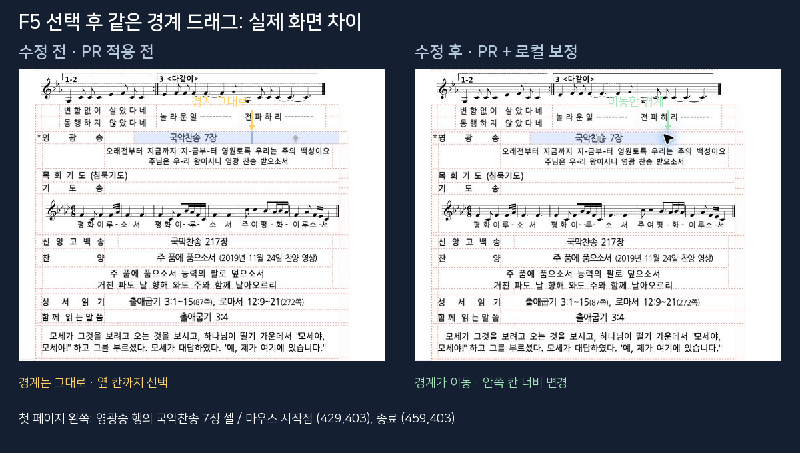

# PR #7443 리뷰 — 중첩 표 hitTest와 선택 상태 크기 조절

## 최종 판정

**승인 — 원 head 단독 검증을 통과했으며, 기존 동작의 보정과 검증 보강은 병합 후 후속 PR로 분리한다.**

승인 대상은 contributor 원 head `df0f400fa008008e39ec009da04e0be328166486`다.
collaborator 보정 `7af493cb68a6dd94f6dc087e723d44b0738b7939`는 로컬에만 있으며 원 PR에 포함되지 않는다.
section 경계와 cache identity 문제는 base에도 존재했으며 이번 PR이 도입한 회귀가 아니다.
원 head만 제공하는 로컬 서버에서 핵심 포인터 E2E를 별도로 통과했으므로 보정을 병합 선행 조건으로 보지 않는다.
사용자 지시로 원 PR 승인 → 원 PR 병합 → 보정 코드·추가 테스트·이 리뷰 문서를 포함한 후속 PR 순서를 선택했다.
2026-09-27 사용자 승인으로 원 PR을 merge commit
`013bc846fca3434ccb1e4167744bed9440c6da6a`에 병합했다. 두 contributor commit은 이력에 보존됐다.
연결 이슈 #7442는 devel push workflow에 의해 2026-09-27 11:44:53 UTC에 자동 종료됐다.
보정과 이 리뷰 문서는 [후속 PR #7446](https://github.com/edwardkim/rhwp/pull/7446)에 제출했다.
2026-09-27에 [APPROVE 리뷰](https://github.com/edwardkim/rhwp/pull/7443#pullrequestreview-5330133765)를 게시했고,
API 재조회로 대상 commit·APPROVED 상태·한글 본문·영상 URL이 일치함을 확인했다.

## 접수 정보

| 항목 | 값 |
| --- | --- |
| PR / 이슈 | [#7443](https://github.com/edwardkim/rhwp/pull/7443) / [#7442](https://github.com/edwardkim/rhwp/issues/7442) |
| Contributor | @lidge-jun, source repository `lidge-ai/rhwp` |
| Source branch / base | `fix/7442-nested-table-hit-select` / `devel` |
| 검증 base | `eb9142dd7c73297d555383d7d8434a470bdef26e` |
| 원 기여 | core `e8b0e864b6f1f4c1d65239b251f96712b3f7e65c`, Studio `df0f400fa008008e39ec009da04e0be328166486` |
| Reviewer / 날짜 | @postmelee / 2026-09-27 |
| 경로 | 조직 fork 직접 push 불가. 사용자 지시로 원 PR 승인·병합 후 별도 보정 PR에 코드·테스트·리뷰 문서 포함. 원 커밋 재작성 없음 |
| 메타데이터 | PR·이슈 assignee @lidge-jun, labels `bug`, `rhwp-studio`, `table`; reviewer @postmelee |

## 변경과 보정

기여자의 core 변경은 바깥 셀의 큰 텍스트 run 영역이 안쪽 표의 빈 영역을 가로채는 경우를 처리한다.
`cursor_rect.rs`의 `hit_test_native`에서 클릭된 셀이 run 경로의 자손일 때만 run 우선 반환을 건너뛴다.
같은 깊이와 무관한 경로에서는 기존 텍스트 선택 우선순위를 유지한다. 표의 레이아웃은 바꾸지 않는다.

Studio 변경은 F5 셀 선택 모드의 크기 조절, 키보드·비례 크기 조절, 셀 블록 선택과 개체 선택에
중첩 경로를 전달한다. 일반 상태의 경계 드래그는 기존에도 경로 API를 사용했으므로 전후 모두 정상이다.
이를 PR의 새 개선 증거로 세지 않는다.

후속 PR용으로 collaborator가 로컬에 준비한 보정은 다음과 같다. 원 PR 승인 근거와 분리한다.

- `hitTestCellRowCol`에서 section도 비교해, 다른 구역의 동일한 문단·표 번호를 같은 표로 취급하지 않는다.
- bbox 캐시의 표 식별자는 모든 조상 경로와 마지막 control을 보존하되 마지막 셀·문단은 제외한다.
  같은 표 내부 셀 이동과 실패 메모에서 재조회를 방지하고, 다른 조상 문단·형제 표는 계속 구분한다.
- Rust grid 검사는 다른 문단 결과를 건너뛰지 않고 각 bbox의 실제 페이지, 구역, 조상·안쪽 표 경로를 검사한다.
  알려진 빈 영역 좌표는 정확한 leaf cell 0도 확인한다.
- 실제 Chrome 포인터 E2E에 F5 선택 → 경계 30px 드래그 → 안쪽 셀 너비 변경 → 부모 모델 보존 → Undo를 추가했다.
  일반 hover·resize·블록 선택·외곽선 클릭은 대조군이다.
- E2E 목록에 새 검사와 기존에 누락된 `issue-6806-zero-shape-resize-undo.test.mjs`를 등록했다.
  후자의 테스트 구현은 변경하지 않았다.

세부 보정·검증 순서는 [보정 기록](pr_7443_review_impl.md)에 남겼다.

## 실행 입력과 직접 재현

입력은 저장소의 [issue1994 원본 HWP](../../../samples/basic/issue1994_behindtext_table_20200830.hwp)다.
원 head에 포함된 바이트와 실행한 파일의 SHA-256이
`8e7a95cf591944bff56050879fa90251921ec57e28eac66d40c6fb8ad103016f`로 같다. 보정 커밋에서도 입력은 변경하지 않았다.
입력 커밋 보존 요건은 **충족**이다. 별도 한컴 PDF를 이 검토의 정답지로 사용하지 않았다.

1. 첫 페이지, 100% 배율에서 보기 → **투명 선**을 켠다.
2. 왼쪽 본문의 **영광송 행 ‘국악찬송 7장’** 글자를 클릭하고 F5를 한 번 누른다.
3. 선택한 셀의 오른쪽 세로 경계를 오른쪽으로 끈다.
4. 수정 전에는 경계가 움직이지 않고 옆 칸까지 선택된다. 수정 후에는 안쪽 칸 너비가 바뀌며 Undo로 복원된다.

대상은 section 0 / parent paragraph 5 / outer control 0 / outer cell 10 / cell paragraph 0 안의
18×9 중첩표다. 해당 안쪽 셀은 model cell 3, row 0, col 5(사람 기준 1행 6열)다.
영상 viewport에서는 (429,403) → (459,403)으로 드래그했다. 다른 배율·스크롤에서는 화면 좌표를 재사용하지 않는다.
사용자도 영상을 따라 같은 전후 차이와 일반 드래그 대조군을 직접 확인했다.

[**전후 비교 영상 보기 — 22초 MP4**](../assets/pr7443_review/f5-resize-before-after.mp4)

영상은 실제 Chrome 연속 화면 캡처를 단계별 시작에 맞춰 좌우 배치하고 마지막 프레임을 유지한 무음 영상이다.
합성된 UI 동작이 아니다. before는 base `eb9142dd7`, after는 원 head와 위 두 Studio 보정을 적용한 상태다.
영상 촬영 후 제품 소스 변경은 없으며 로컬 보정 commit과 제품 소스 해시가 일치한다.
보정 없는 원 head도 별도 서버(7702)에서 같은 F5 드래그·Undo E2E를 통과했다.
[GitHub에 첨부한 비교 영상](https://github.com/user-attachments/assets/fc6da07f-cf41-443b-9e14-135c3e2ad912)도 승인 리뷰에 연결한다.
영상 SHA-256은 `71667b44da4ca5b9afda2af068ba67ec808b9983e16163180e9567d0b31fb86d`다.

fresh WASM은 각 checkout 루트에서 `CARGO_TARGET_DIR=target/pr-review scripts/wasm-pack-locked.sh --target web --out-dir pkg`로
빌드했다. `pkg/`와 Studio `public/` 해시 일치 및 실제 서버 응답을 확인했다.

- before WASM: `2986216f2e885c964423fae068ab2ffa8fff3a48ccb14b115a5a63d7443691f5`
- after WASM: `91d8dfb9e44560338b1915fe1e6554b15278fe819b11ebe58feb8fdcc052909a`

공유 target의 mtime으로 before 산출물이 재사용된 최초 after 빌드는 폐기했다.
현재 source를 다시 빌드해 서로 다른 해시와 브라우저 결과를 확인한 뒤 영상과 판정에 사용했다.

## 검증 결과

### 원 PR 승인 근거

| 검사 | 결과·대상 |
| --- | --- |
| 원 head Studio `npm test` | 1,800/1,800 PASS (`studio-test.log`) |
| 원 head 단독 포인터 E2E, `VITE_URL=http://127.0.0.1:7702` | PASS: F5 선택·경계 드래그·부모 모델 보존·Undo·빈 영역 hit·일반 resize·블록 선택·외곽선 개체 선택 |
| 원 head [Full CI](https://github.com/edwardkim/rhwp/actions/runs/36260680798) | Build & Test, Rust A/B/C/D, Lint, Frontend package gates 성공. 게시 전 동일 head와 mergeable 재확인 |

별도 원 head 서버의 제품 소스 해시를 Git 원본과 비교했다. 보정은 적용하지 않았다.
`original-head-verification.json`과 `e2e-original-head.log`에 기록했다. Rust source와 Cargo 입력이 원 head와
보정 commit 사이에 같으므로 검증된 fresh WASM을 재사용했다. 추가 E2E 검사 코드는 로컬 검증 harness이며
원 PR의 커밋에 포함됐다고 주장하지 않는다. 초기 서버 설정의 WASM 파일 접근 실패는 설정 수정 후 재실행했고
결함 재현으로 세지 않았다.

### 로컬 후속 보정 후보 검증

아래 결과는 보정 commit의 검증이다. 원 head에 추가 보정 테스트 3개가 통과했다고 해석하지 않는다.

명령은 repository root 기준이며 Studio 명령은 `rhwp-studio/`에서 실행했다.
로컬 환경은 macOS arm64 / Node 24.15.0 / Rust 1.93.1이다. 로그는 ignored
`output/pr-review/7443/logs/`에 보존하며 로그 파일은 커밋하지 않는다.

| 검사 | 결과·입증 범위 |
| --- | --- |
| `cargo fmt --all -- --check` | PASS |
| native / wasm32 lib / workspace all-targets Clippy, 각각 `--locked --target-dir target/pr-review` 및 `-D warnings` | 3종 PASS; `cargo build --locked --workspace --target-dir target/pr-review`도 PASS |
| `node scripts/rust-test-suite-manifest.mjs --check --base-ref eb9142dd7c73297d555383d7d8434a470bdef26e` | PASS; 파생 suite 재생성, source PR에는 stage하지 않음 |
| `node scripts/run-rust-test.mjs issue_7442_nested_cell_hit_test -- --cargo-profile release-test --target-dir target/pr-review` | Native 7/7 PASS |
| 같은 wrapper의 `issue_2212_nested_cell_path_bbox` | Native 1/1 PASS |
| `cargo nextest run --locked --cargo-profile release-test --target-dir target/pr-review --tests --no-fail-fast` | 10,252 PASS / 17 FAIL / 50 skipped. 17건은 아래 로컬 파일명 문제였으며 해당 2개 검사군 32/32 재검사 PASS |
| 실제 WASM 동일 grid 432점 전후 비교 | 잘못된 바깥 표 경로 20 → 0; 나머지 동일 깊이 텍스트 우선 10점의 경로·charOffset은 전후 동일 |
| 보정 전후 Studio 집중 검사 | 새 검사 3개가 원 head에서 FAIL, 보정 후 관련 21개 PASS |
| `npm test`, `npx tsc --noEmit`, `npm run build` | 1,803/1,803 PASS / PASS / PASS |
| `CHROME_PATH=… VITE_URL=http://127.0.0.1:770{0,1} node e2e/issue-7442-nested-table-pointer.test.mjs --mode=headless` | before: F5 경계 이동 assertion에서 FAIL; after: 전체 PASS. 빌드·환경 실패가 아닌 실제 UI 음성 대조 |
| `python3 scripts/check_e2e_manifest.py`, `git diff --check` | PASS |
| 보정 code head GitHub Full CI | 미실행: contributor fork push dry-run이 HTTP 403으로 거부됨 |

전체 회귀에서 `samples/3-09월_교육_통합_2022.hwp`의 로컬 파일명 한 개가 NFD(자모 분리)로 저장돼,
NFC(합친 글자) baseline과 다른 경로로 처리됐다. off-canvas 1건은 신규 파일로, body-overflow 16개 partition은
baseline 파일 누락으로 실패했다. Git HEAD 바이트와 SHA-256
`d451ffbc72e8c84433f380c0cbcc8472f23286d53dce4b793a4bbb82f8715108`의 동일성을 먼저 확인하고
로컬 파일명만 Git의 NFC 표기로 바꿨다. 입력 내용·baseline 수치·소스는 변경하지 않았다.
동일 nextest 명령에 `-E 'test(off_canvas_baseline::) | test(body_overflow_baseline::)'`를 추가한
재검사는 32/32 PASS였다. 최초 전체 실행을 무실패 실행으로 표기하지 않는다.

432점 검사는 **같은 안쪽 표 경로**의 보존을 검사한다. 셀 bbox 안의 모든 점이 반드시 그 leaf cell을
가리킨다는 더 강한 가정은 동일 깊이 텍스트 run 우선 계약과 다르므로 적용하지 않았다. 기존 10점의
leaf 불일치를 새로 해결한 것으로 보고하지 않는다. 알려진 빈 영역·텍스트 대조군은 별도 검사한다.

## 미검증 범위와 수용 범위

**작성자가 말한 두 번째 문서는 특정하지 못해 검증하지 못했다.** PR·이슈에는 “다른 문서의 중첩 7×4 표”라는
설명만 있고 파일명·첨부·링크가 없다. 이슈의 14셀은 전체 셀 수인지 표본 수인지 확정할 수 없다.
저장소 HWP/HWPX 1,152개 중 1,149개 구조를 조사해 7×4 후보 9개를 찾았으나 동일 문서라고 확인하지 못했다.
암호 문서 3개는 열지 못했다. 후보를 원본 문서의 검증으로 대체하지 않는다.

원 PR 수용 근거는 첫 문서의 실제 F5 드래그 전후 재현, 원 head 단독 E2E·Studio 검사·CI 및 core 빈 영역 경로 확인이다.
추가 보정 회귀 검사는 후속 PR의 근거로 분리한다.
모든 빈 영역 클릭·모든 문서·저장 후 한컴 재열기를 직접 검증했다는 의미가 아니다.
일반 resize 후 바깥 소유 셀의 rendered bbox 폭은 455.5 → 471.5로 달라졌지만 부모 표·셀의 문서 속성은
보존됐다. 재조판 결과의 한컴 일치까지 검증한 것은 아니다.

조판 원칙·분할·이어받기·LineSeg·측정/배치 공유·Native Skia 3종·Visual Sweep은 **비해당**이다.
변경 경로는 이미 생성된 render tree의 hit 해석 및 기존 resize API 호출 대상이며 레이아웃·paint 생산자를
변경하지 않는다. UI 직접 비교를 렌더링의 한컴 PDF 일치 증거로 승격하지 않는다.
contributor의 `mutation-routing-guard` 8 → 10 변경은 새 flat/path 분기가 동일 snapshot 안에서 상호 배타적으로
실행되는 코드 위치와 대조했다. 조판 golden이나 시각 허용치 완화는 없다.

## 원격 처리

2026-09-27에 source SHA와 remote ref가 원 head로 일치함을 확인했다. 변경 6파일은 LFS 대상이 없고
`git lfs status`에도 새 object가 없어 `GIT_LFS_SKIP_PUSH=1 git push --dry-run`을 사용했다.
GitHub가 `Permission to lidge-ai/rhwp.git denied to postmelee`(HTTP 403)를 반환했다.
API에서는 원본 저장소 `push=true`, 조직 fork `push=false`, PR `maintainer_can_modify=true`로 확인됐다.
[GitHub 조직 fork 권한 설명](https://docs.github.com/en/pull-requests/reference/forks)에 해당한다.
원 PR head에 대한 push는 수행하지 않았다. `maintainerCanModify=true`만으로 실제 쓰기 권한이 있다고 판단하지 않는다.

사용자는 원 PR을 먼저 승인·병합하고, collaborator가 후속 PR에 보정 코드·추가 테스트·리뷰 문서를 함께
제출하는 경로를 선택했다. 이 경로는 원 기여자의 PR과 commit credit을 그대로 보존한다.
승인 리뷰에는 원 head의 독립 검증, 영상의 촬영 범위, 두 번째 문서 미검증, fork 쓰기 권한 제약과 후속 PR 계획을 명시한다.
후속 PR은 원 PR 병합 이후 최신 `upstream/devel`에서 준비하며 코드·테스트 commit과 리뷰 문서 commit을 분리한다.
병합 후 base `013bc846fca3434ccb1e4167744bed9440c6da6a` 위에 보정만 cherry-pick하여
`9e1cffccf`를 만들었다. 전체 Git tree는 기존 보정 commit `7af493cb6`와 동일하다.
후속 PR에서는 새 base/head의 검증·CI를 별도로 기록하고 원 PR에 링크를 연결한다.

## 원 PR 병합 후 처리

- 원 PR은 2026-09-27 11:44:39 UTC에 `013bc846fca3434ccb1e4167744bed9440c6da6a`로 병합됐다.
- #7442는 devel push workflow가 자동 종료했으며 수동 close는 실행하지 않았다.
- [duration 갱신](https://github.com/edwardkim/rhwp/actions/runs/36316719193)과
  [이슈 자동 종료](https://github.com/edwardkim/rhwp/actions/runs/36316719123) workflow가 성공했다.
  병합 후 검증 CI를 새로 시작하거나 재실행하지 않았다.
- 로컬 devel을 병합 SHA로 fast-forward한 뒤 후속 보정 branch를 만들었다. contributor fork branch는 삭제하지 않는다.
- 상세 리뷰·영상은 이 후속 보정 PR에 포함한다. 원 PR 최종 코멘트에는 감사, merge SHA, 검증 범위,
  후속 PR 링크와 두 번째 문서 미검증을 남긴다. UI 영상은 승인 리뷰에 업로드한 GitHub 첨부 URL을 사용한다.
- 기존 검토 branch와 before worktree, 원 head 서버 및 ignored 로그는 아직 진행 중인 후속 PR의 재현 자료이므로
  유지한다. 후속 PR 종료 시 정리하며 공유 `target/pr-review`와 다른 작업의 worktree는 보존한다.

## 후속 보정 제출 전 재검증

병합 후 code candidate `9e1cffccfc9401262fff806f16b388180d5a663c`에서 fmt·native/WASM32/workspace
all-target Clippy·workspace build·base 비교 manifest, Rust focused 7/7, Studio 1,803/1,803 및
TypeScript 포함 build, E2E manifest와 실제 Chrome 포인터 E2E를 모두 통과했다.
[명령별 결과 및 source/WASM/fixture 해시](../assets/pr7443_review/followup-validation.json)에 기록했다.

기존 `7af493cb6`와 전체 tree `98aee4a4a45a1b4d9e11582fb644845f9f9f6d77`가 같아 기존 광범위 회귀를
중복 실행하지 않았다. 후속 diff는 Studio 제품 코드와 Rust test helper이며 Rust 제품 소스·snapshot·baseline은
변경하지 않았다. 원 PR의 CI와 후속 PR의 CI는 별도로 판단한다.

후속 PR의 현재 판정은 [#7446 개별 리뷰](pr_7446_review.md)에 분리했다.
[원 PR 최종 코멘트](https://github.com/edwardkim/rhwp/pull/7443#issuecomment-5855597661)와
[이슈 종료 확인 코멘트](https://github.com/edwardkim/rhwp/issues/7442#issuecomment-5855597818)를 게시했고,
API 재조회로 한글 본문과 후속 PR 링크를 확인했다.
