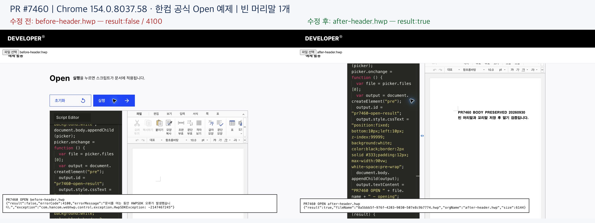
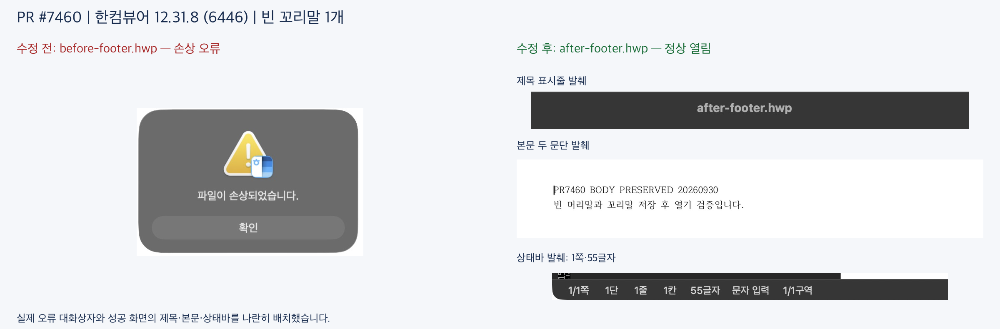
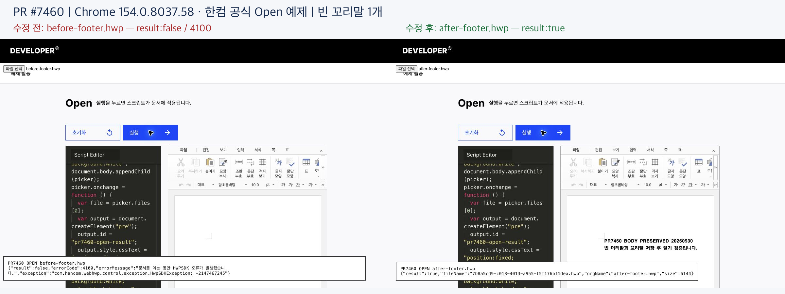
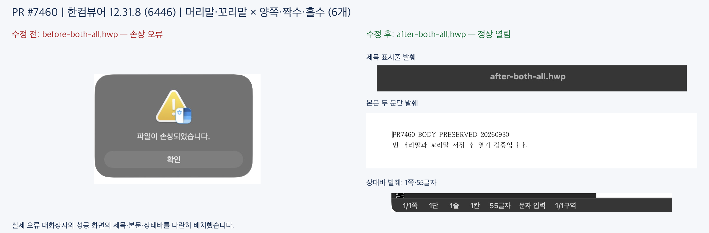
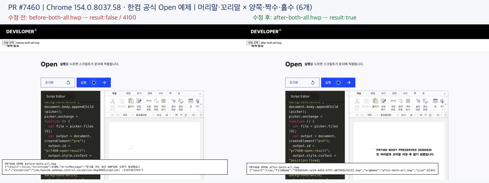
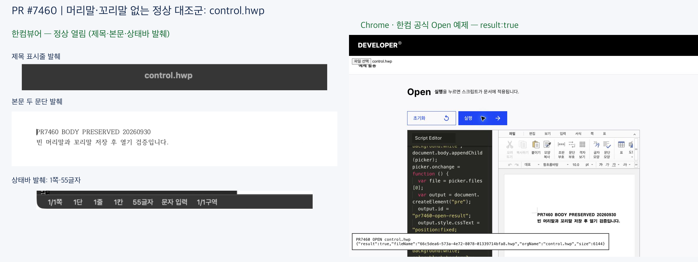

# PR #7460 리뷰 — 빈 머리말·꼬리말의 HWP5 저장 호환성

## 최종 판정

**승인.** 검토한 원 code head의 HWP5 serializer 변경 범위에서 차단 결함을 찾지 못했습니다.
한컴뷰어와 Chrome 웹한글기안기의 수정 전 실패·수정 후 열기 성공을 직접 확인했습니다.

이 판정은 원 code head와 아래 증거에 대한 검토 결과입니다. 원격 Approve 게시와 merge는
별도 조치입니다. 문서 push 후에는 정확한 새 head의 CI/preflight·mergeability를 확인하고,
사용자가 확인한 Approve 본문을 게시해야 합니다. merge는 별도 승인이 필요합니다.

## 접수 정보

| 항목 | 값 |
| --- | --- |
| PR·작성자 | [#7460](https://github.com/edwardkim/rhwp/pull/7460) / jeong-sik |
| 관련 이슈 | [#7459](https://github.com/edwardkim/rhwp/issues/7459), PR 본문의 `Closes #7459`; 작성 시점 OPEN |
| reviewer·확인일 | postmelee / 2026-10-01 KST |
| 원 code head | `bf50bc7df46ff9df566e407291fddad0155a9bd6` |
| 최신 devel 비교 기준 | `9954daf7ee04adb8f7dbd5a66df371f5fd8d4040` |
| 실제 로컬 실행 head | `7e47b085e5f744fa6bf632c84f68b47391342aed`: 당시 devel `b19eb36c48dcc58ed293b0fcf1989e879b52936d` 위의 검증용 체리픽 |
| 원격 상태 | OPEN / non-draft / MERGEABLE / CLEAN / `maintainerCanModify=true` |
| 통합 경로 | collaborator Route A: `jeong-sik/rhwp:fix/empty-header-hwp5-pr`의 원 PR에 검토 문서만 추가 |
| 메타데이터 | assignee jeong-sik, reviewer postmelee, bug·serialization·hwp5, milestone v1.0.0; 기존 설정 확인 |

첫 외부 기여가 아닙니다. 기존 병합 PR #6578·#6564·#6562를 확인했습니다.
원 기여자의 네 커밋을 그대로 보존하며, 로컬 검증용 체리픽 이력은 contributor branch로 보내지 않습니다.
구체적인 게시·통합 조건은 [사전 판정 보고서](pr_7460_report.md)를 참조해 주세요.

## 변경과 검토 범위

원 PR 변경은 `src/serializer/body_text.rs`, `src/serializer/cfb_writer.rs`,
`src/serializer/cfb_writer/tests.rs`, `tests/cases/hwp5_empty_header_footer_save.rs`,
`tests/fixtures/ir_field_sweep_baseline.tsv`의 5개 파일입니다.
로컬 실행 head에서 이 5개 파일이 원 code head와 바이트 단위로 같은 것을 확인했습니다.

원인은 새 빈 HF 문단의 PARA_TEXT가 없는데도 헤더 문자 수가 0으로 저장되고,
5.0.3.2 이상 파일에 필요한 변경추적 UINT16이 빠진 22바이트 헤더가 생성되는 것입니다.
[한컴 공식 문단 헤더 표](https://tech.hancom.com/python-hwp-parsing-2/)의 버전 경계와
실제 한컴 열기 결과를 독립 근거로 대조했습니다.

| 구현 주장·실제 경로 | 독립 기대값·검사 | 관측·판정 |
| --- | --- | --- |
| `body_text.rs:serialize_paragraph_with_msb` → `serialize_para_header_with_mask`: PARA_TEXT 없는 문단의 저장 문자 수만 보완 | 빈 문단의 암묵적 문단 끝을 포함한 1, 모델 값 보존; `empty_header_footer_counts_the_implicit_paragraph_end` | 수정 전 0으로 FAIL → 수정 후 1로 PASS; 충족 |
| `cfb_writer.rs:output_version`은 출력 FileHeader[32..36]을 읽고 일반·분할 구역에서 `serialize_section_for_version`으로 전달 | 보존 FileHeader와 모델 version이 다르면 실제 출력 버전 우선; 5.0.3.2 미만/이상 경계 | version 우선순위·경계 테스트는 수정 전 FAIL → 수정 후 PASS; 두 호출 분기는 코드로 대조 |
| 재귀 문단 생성 뒤 `body_text.rs:serialize_section_inner`의 모든 PARA_HEADER에 동일한 처리 적용 | 22바이트인 경우에만 24바이트로 보완, 본문·HF·셀에 같은 출력 버전 적용 | 신규 HF 저장·기존 공개 샘플의 본문/셀 정규화 및 IR sweep PASS; 충족 |
| 기존 24바이트 이상 헤더의 instanceId·변경추적·확장 바이트 보존 | 기존 바이트를 덮어쓰지 않음; `existing_instance_and_change_tracking_bytes_survive` | 수정 전·후 모두 PASS; 보존 대조군이며 결함 검출 증거로 세지 않음 |
| `actual_char_count`는 헤더뿐 아니라 `line_segs_within_text`의 축 경계에도 전달 | 끝 위치와 같은 LineSeg는 보존하는 기존 `>` 계약; 빈 축의 끝은 1 | 메모리 계약 입력 `[]`, `[0]`, `[0,1]`, `[0,1,2]`를 실제 저장 레코드로 판독해 4개 PASS; 자세한 코드·결과는 증적 README |
| `raw_provenance_permits_reuse`가 허용한 무편집 raw stream은 앞에서 반환 | 무편집 원본은 재생성 정규화 대상이 아님 | 기존 조기 반환 유지 확인; 기존 손상 파일의 자동 복구는 해결 주장·실행 범위 밖 |

`serialize_section`의 version 없는 내부 호출과 CFB 출력 호출을 구분했습니다.
일반·분할 CFB 구역은 모두 실제 output_version을 소비합니다. split 구역 자체의 UI 열기 시험은
별도로 실행하지 않았으며, 공통 함수 이름만으로 UI 검증 완료를 주장하지 않습니다.

### 조판 원칙 준수 검토

| 원칙 | 판정·근거 |
| --- | --- |
| 독립 근거·일반 조건 | 충족: 출력 형식 버전·레코드 길이·PARA_TEXT 유무가 조건이며 문서 ID 예외가 아닙니다. 버전 경계와 확장 바이트 반례를 검사했습니다. |
| 측정·배치의 공통 줄/좌표·높이 | 비해당: 측정, layout, paint, 줄 소속·높이 생산/소비를 변경하지 않습니다. |
| 저장 LineSeg 수용·편집 후 재조판 | 저장 축 소비는 충족: `actual_char_count=1`이 기존 LineSeg 범위 필터에도 전달되는 것을 추적하고 끝 경계를 추가 검사했습니다. 필터의 `>` 조건과 layout의 캐시 수용·재조판 규칙 변경은 비해당입니다. 가짜 LineSeg 생성·HF 개체 삭제는 없습니다. |
| pagination·rowspan·clipping·continuation | 비해당: 컷·소유 유닛·예약 높이·배치 경로 변경이 없습니다. |
| 기준값 변경의 근거 | 충족: 아래 원본 CFB와 103개 헤더의 필드 보완을 확인했습니다. 기존 baseline 행 삭제·허용치 완화는 없습니다. |
| Native/fresh WASM Visual Sweep | 비해당: serializer 형식 보완이며 renderer/WASM binding 변경이 없습니다. 앱 열기 화면을 PDF 조판 일치나 실루엣 점수의 증거로 바꾸지 않았습니다. |

## 검증 입력과 결과

### 파일 입력 커밋 게이트

[intake 2.8](../../manual/pr_review/intake_and_review.md#28-검증-입력-커밋-확인)의
실행 입력 포함·동일성 확인은 **충족**입니다.
생성 HWPX 1개와 실제 한컴에서 연 HWP 7개를 증적 commit
`f21bac8051852f7417d917e9acb5e6de1c2a95d9`에 포함하고,
`git show <commit>:<path>`의 실제 blob이 실행한 입력과 동일한 것을 확인했습니다.
아래 표의 기존 샘플도 원 code head의 blob SHA-256과 실제 판독 입력을 대조했습니다.
저장 회귀 테스트의 메모리 내 합성 입력에는 별도 파일이 없습니다.

새 입력 8개의 경로·SHA-256, 바이너리 출처, 생성 순서, 실제 웹 실행 스크립트와 캡처 해시는
[검증 증적 README](../assets/pr_7460/README.md)에 기록했습니다.
IR field sweep의 수집 규칙에 따른 기존 파일 후보 688개의 경로·SHA-256도
[코퍼스 입력 목록](../assets/pr_7460/corpus_inputs.md)에 열거했습니다.
원 code head·실제 실행 head의 blob 및 저장소 파일의 동일성을 대조했고 기존 경로를 재사용했습니다.
공개 증적은 총 7개 비교 PNG와 8개 입력이며 원시 로그·실행 바이너리·생성 중간 파일은 포함하지 않았습니다.

### 로컬 focused·음성 대조

실행 head는 위 `7e47b085…`이며, 공유 `target/pr-review`를 재사용했습니다.

```sh
node scripts/rust-test-suite-manifest.mjs --prepare
cargo nextest run --locked --test regression_suite_021 -E 'test(/(^|::)hwp5_empty_header_footer_save::/)' --cargo-profile release-test --target-dir target/pr-review
cargo nextest run --locked --test regression_suite_016 -E 'test(/(^|::)ir_field_sweep_baseline::/)' --cargo-profile release-test --target-dir target/pr-review
```

빈 HF·출력 버전 우선순위·5.0.3.2 경계·바이트 보존의 **5개 저장 회귀 PASS**, **IR field sweep 4개 PASS**입니다.
같은 저장 회귀를 과거 devel `b19eb36c…`의 두 serializer 파일만 복원한 음성 대조에서 실행하면
**4개 FAIL·1개 PASS**였습니다. 실패는 빌드 문제가 아니라 문자 수 0/1 및 헤더 길이 22/24바이트
assertion에서 발생했습니다. 진단 후 원 검토 source를 정확히 복원했습니다.

추가로 같은 새 빌드의 library를 사용한 메모리 계약 검사에서 빈 문단의 저장 문자 수가 1이고,
LineSeg 시작 `[0,1,2]` 중 `[0,1]`을 실제 PARA_LINE_SEG로 보존함을 판독했습니다.
빈 목록·`[0]`·`[0,1]`도 포함해 4개 통과했습니다. 기대값은 #5563의 기존
“축 끝과 같은 위치는 보존” 계약에서 정했고 검사 코드·명령을 증적 README에 보존했습니다.
이 합성 계약을 정상 한컴 원본의 LineSeg 출력 일치나 수정 전 결함 검출 실행으로 세지 않았습니다.

최신 devel `9954daf7…`은 #7485의 검색 결과 개수·Studio IME 변경을 포함합니다.
관련 Rust/test diff를 읽었고 HF serializer 호출 계약에 영향이 없음을 확인했습니다.
로컬 검증 head 위에서 이 최신 base SHA를 고정한 다음 정책 검사를 다시 통과했습니다.
전체 Rust tree가 최신 devel과 같거나 최신 merge tree의 Cargo 실행을 완료했다는 뜻은 아닙니다.

```sh
node scripts/rust-test-suite-manifest.mjs --check --base-ref 9954daf7ee04adb8f7dbd5a66df371f5fd8d4040
node scripts/rust-unit-test-tiers.mjs --check --base-ref 9954daf7ee04adb8f7dbd5a66df371f5fd8d4040
```

### Baseline 5행의 원본 CFB 대조

아래 파일은 원 code head에 이미 포함된 공개 샘플입니다.
별도 CFB reader로 실제 FileHeader와 문단 레코드를 읽었습니다.

| 입력 | 버전·원본 22바이트 헤더 | SHA-256 |
| --- | --- | --- |
| [issue1510](../../../samples/issue1510_coanchored_float_tables.hwp) | 5.1.0.1; 본문 32 + 셀 9 | `66399b3ff7fbe8410a1996788702208be3b732b8ec96aff6b0ec8160a66e2d55` |
| [issue5800](../../../samples/issue5800-hancom-symbol.hwp) | 5.1.0.1; 본문 2 | `e09951a7ac179344a9f9c3dd9625a6de757a5d5cc5cee2fcb7c76c040959476d` |
| [issue6639](../../../samples/issue6639/rhwp-table-cell-minimal-repro.hwp) | 5.1.1.0; 셀 42 | `983df661a2316881457ee4604c3084895bd4f6b350df4953c6c53cca8c162801` |
| [pua-test](../../../samples/pua-test.hwp) | 5.1.0.1; 본문 18 | `592e00e3e8bc72afef829fd71a13cbc340bff3770425b9d1ee025afc1e1649fa` |
| [footnote-01 대조군](../../../samples/footnote-01.hwp) | 5.0.3.0; 본문/셀/내부 문단 58 | `5bbc8a8fd23415aad59dd91d1eb261050946d9c64635933fcd49609ec2cc94e5` |

5개 baseline 행은 4개 샘플의 **103개(32+9+2+42+18)** 헤더 필드 보완과 대응합니다.
버전 미만 대조군은 22바이트 헤더를 유지해야 합니다. baseline의 원인별 증가분을 확인했으며,
수정 전 구현의 값을 새로운 독립 기대값으로 재인용하지 않았습니다.

### 정확한 원 code head의 CI 재사용

[Full CI 36383380930](https://github.com/edwardkim/rhwp/actions/runs/36383380930),
[CodeQL](https://github.com/edwardkim/rhwp/actions/runs/36383380874),
[Adapter inter-diff](https://github.com/edwardkim/rhwp/actions/runs/36383380817),
[Proptest](https://github.com/edwardkim/rhwp/actions/runs/36383380942)의 성공을 확인했습니다.
CI Impact Policy도 성공했습니다. Full CI의 전체 Archive A–D 상태와 실제 관련 job 로그를 확인했습니다.

| 실제 읽은 job | 결과 |
| --- | --- |
| [Lint: native·WASM·workspace](https://github.com/edwardkim/rhwp/actions/runs/36383380930/job/108803654259) | 포맷·세 Clippy 단계·WASM check 성공 |
| [Archive A](https://github.com/edwardkim/rhwp/actions/runs/36383380930/job/108804719605) | 3873 PASS / 13 skip |
| [Archive C](https://github.com/edwardkim/rhwp/actions/runs/36383380930/job/108805650899) | 2041 PASS / 13 skip |
| [Archive D](https://github.com/edwardkim/rhwp/actions/runs/36383380930/job/108805611870) | 2178 PASS / 20 skip; 새 저장 회귀 5개·IR field sweep PASS |

[local validation 4.3](../../manual/pr_review/local_validation.md)의 동일 source CI 재사용 조건으로
로컬 전체 Cargo 회귀·lint의 중복 실행을 생략했습니다. 검토 문서 tail은 single-parent이고 `mydocs/`에
한정하므로 [review-only fast-pass](../../manual/pr_review/review_only_fast_pass.md)의 후보입니다.
**아직 push되지 않은 새 head에 fast-pass가 성공했다고 기록하지 않습니다.**
push 후 trusted CI가 exact 새 head에서 판정해야 하며, 실패·누락이면 Approve 게시를 보류합니다.

## 시각 증적과 남은 차이

한컴뷰어 12.31.8(6446)와 Chrome 154.0.8037.58의 공식 Open 예제에서 같은 7개 HWP를 열었습니다.
공개 CLI `edit insert-header-footer` → 코어 `create_header_footer_native` 경로로 파일을 생성했습니다.
수정 전 바이너리는 두 serializer 파일만 과거 devel로 복원한 대조이며,
수정 후 바이너리는 source 복원 뒤 새로 빌드했습니다. 자세한 SHA는 증적 README에 있습니다.

| 사례 | 한컴뷰어: 수정 전 → 수정 후 | 웹한글기안기: 수정 전 → 수정 후 |
| --- | --- | --- |
| 빈 머리말 1개 | 손상 오류 → 정상 열림 | HWPSDK 4100 → `result:true` |
| 빈 꼬리말 1개 | 손상 오류 → 정상 열림 | HWPSDK 4100 → `result:true` |
| 머리말·꼬리말 × 양쪽·짝수·홀수, 6개 | 손상 오류 → 정상 열림 | HWPSDK 4100 → `result:true` |
| HF 없는 정상 대조군 | 정상 열림 | `result:true` |

독립 CFB 비교에서 세 전후 쌍의 차이는 Section0 HF 문단 헤더뿐입니다.
수정 후 세 파일의 영문·한글 본문 두 문단과 Viewer의 1쪽·55글자를 직접 판독했습니다.
웹 시험은 각각 새 페이지에서 File/Blob을 전달하고 실제 callback·파일명·6144바이트 크기를 대조했습니다.

### 빈 머리말




### 빈 꼬리말





### 빈 머리말·꼬리말의 적용 대상 6개





### 정상 대조군



스크린샷은 실제 실패/성공 화면을 조합했습니다. Viewer 성공 화면은 제목·본문·상태바 발췌이고,
웹 화면은 전체 캡처입니다. 원 캡처 해시·발췌 좌표·비교 PNG 해시는 증적 README에 공개했습니다.

여러 쪽의 짝수·홀수 적용, 한컴 기준 PDF와의 조판 일치, 기존 손상 raw stream 자동 복구,
Studio UI E2E는 미검증입니다. 인앱 브라우저의 파일 열기 미완료와 Firefox의 공식 데모 지원 제한도
Chrome의 실행 성공과 구분했습니다. 한컴 2014 직접 실행은 하지 않았습니다.

## Merge 후 contributor PR comment 계획

원 PR을 실제 merge한 뒤 별도 승인된 후속 처리에서만 감사·검증 범위를 댓글로 남깁니다.
최종 merge SHA와 CI URL을 재조회하고, 위 대표 Viewer/Web 비교 PNG를
`edwardkim/rhwp/<실제 merge SHA>/mydocs/pr/assets/pr_7460/…`의 raw URL로 고정해 표시합니다.
[Visual Sweep 정본](../../manual/verification/visual_sweep_guide.md)을 연결하되 이번 serializer 변경에는
비해당임을 명시하고, 여러 쪽 표시·PDF 일치는 미검증으로 유지합니다.
한국어 존댓말 본문을 UTF-8 파일의 `--body-file`로 게시한 뒤 API로 한글·줄바꿈·이미지 링크를 재확인합니다.
#7459 종료 여부와 PR 본문의 자동 종료 연결도 실제 merge 후 확인하며, 닫히지 않았다면 별도 승인 없이
수동 종료하지 않습니다. 현재 merge·후속 댓글·이슈 종료는 완료되지 않았습니다.
