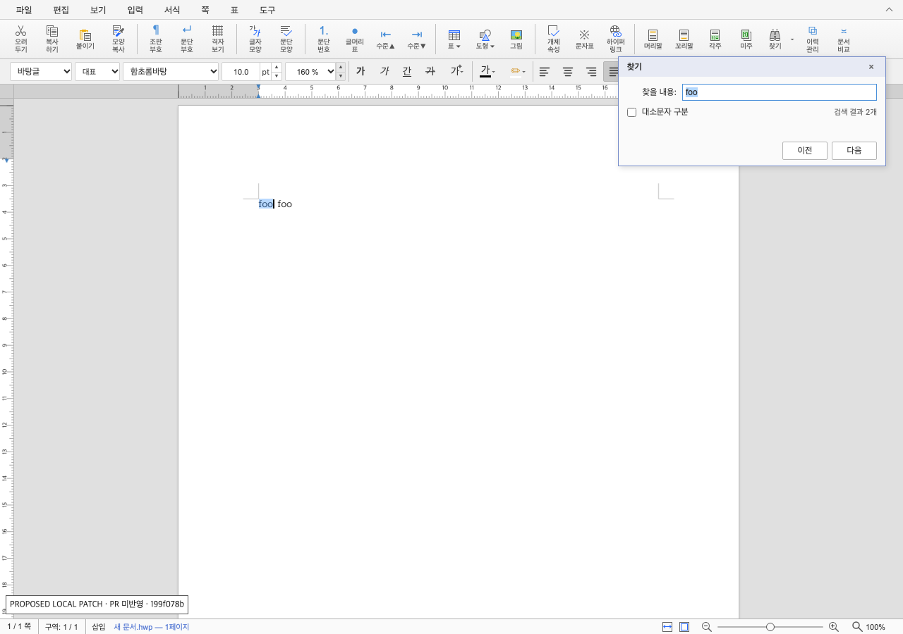
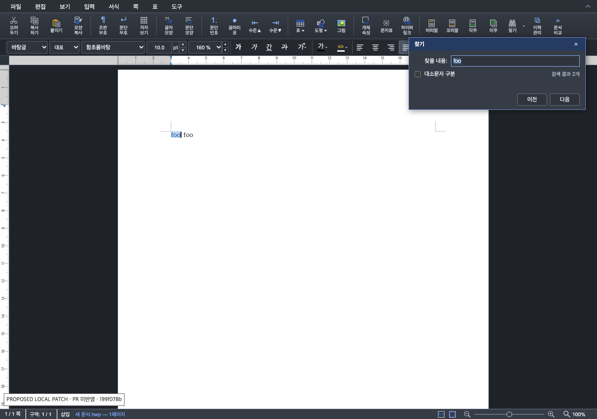

# PR #7485 리뷰 — 찾기 결과 개수와 로컬 보정 검증

## 최종 판정

**승인 — collaborator 보정 code candidate의 로컬 검증을 완료했다.** 원 contributor head의 개수 갱신 결함을 보정한 아래 commit을 검토 대상으로 삼는다. 원 head 자체를 승인하지 않는다. GitHub Approval 게시와 merge 가능 여부는 최신 PR head의 관련 CI가 성공한 뒤 확정한다.

- 원 기여 head: `7da9c6ca3ee48f26c16e6b882e7cc9353bf541f6`
- 검증한 로컬 patch SHA-256: `199f078b7b6e91d27e36e7604383571e969e1f44b6428e8cedd2cc1c030c8341`
- 보정 code commit: `73f27d3fa70b2a00bdf014eec814dbb52f7edc0c`. 최종 trailing documentation head는 GitHub Approval 본문에 정확한 SHA로 기록한다. patch hash는 Git commit SHA가 아니다.
- merge 전 조건: 최신 PR head의 관련 CI 성공, remote/PR SHA 일치와 mergeability 재확인, 작업지시자 승인. 2026-10-01(KST) 작업지시자가 병합과 후속 처리를 승인했다. 아래 최초 검토의 캡처·측정 범위는 유지한다.
- 후속 검토 시점: `603d8e9bb0d8bb086314bbbc08b3c1042095f856`의 Full CI와 GitHub Approval이 완료됐다. 이번 review·오늘할일 보완은 제품 변경 없는 single-parent trailing 기록이며, push 뒤 새 head의 preflight·필수 집계를 확인하기 전에는 병합하지 않는다.

### 2026-10-01 병합 준비 확인

- 동일 head `603d8e9bb0d8bb086314bbbc08b3c1042095f856`의 [CI / Build & Test](https://github.com/edwardkim/rhwp/actions/runs/36730234327), [CodeQL](https://github.com/edwardkim/rhwp/actions/runs/36730234101), [Render Diff](https://github.com/edwardkim/rhwp/actions/runs/36730233300), [Adapter inter-diff](https://github.com/edwardkim/rhwp/actions/runs/36730234016), [Proptest roundtrip](https://github.com/edwardkim/rhwp/actions/runs/36730234178), [CI Impact Policy](https://github.com/edwardkim/rhwp/actions/runs/36734194407)가 성공했다. code candidate의 Full 검증을 이번 문서 commit의 결과로 혼동하지 않는다.
- [Approval 리뷰](https://github.com/edwardkim/rhwp/pull/7485#pullrequestreview-5368189384)의 본문·APPROVED 상태·검토 SHA를 API로 재확인했다. 최신 조회에서 non-draft·MERGEABLE·CLEAN이며, 원격 ref와 PR head가 일치했다.
- rhwp의 `author:z0rimo is:pr` 전체 검색은 이번 PR 1건이며 incomplete=false였다. 이전 PR·병합 PR은 없고 GitHub association도 FIRST_TIME_CONTRIBUTOR였다. main 반영 여부만으로 첫 기여를 판단하지 않았다.
- [오늘할일](../../orders/20261001.md)에 실제 검증과 남은 병합 gate를 기록했다. contributor 원본과 보정 commit을 보존하는 merge commit 방식을 사용하고, fork branch는 유지한다. merge 뒤 duration 갱신 결과, devel 포함, 이슈와 맞춤 환영 comment, 검토 작업공간 정리를 확인한다.

## 접수 정보

| 항목 | 값 |
| --- | --- |
| PR·작성자·base | [#7485](https://github.com/edwardkim/rhwp/pull/7485) / @z0rimo / devel |
| source repository·branch | z0rimo/rhwp · feat/7477-find-hit-count |
| 관련 이슈 | Closes #7477. 실제 close·merge는 미실행 |
| reviewer·작성 시점 상태 | @postmelee; 2026-09-30 API 조회 시 open·non-draft·mergeable, source SHA 동일. merge 전 재확인 필요 |
| 경로 | collaborator 외부 PR의 현재 source head 직접 보정(정본 9.3.1). maintainerCanModify=true를 확인했으며 push 직전에 다시 확인 |

## 변경과 검토 범위

원 기여는 기존 Find/F3 탐색 결과의 길이를 `totalMatchCount`로 반환하고 Studio에 표시했다. 새 전체 검색을 도입하지 않았으며 탐색 대상과 집계 대상을 맞춘 의도를 보존한다.

원 head의 신규 결함은 일반 문서 편집 뒤 표시 숫자의 갱신 누락이다. `foo foo`에서 검색 2개 → 한 항목 삭제 후 실제 1개, 표시 2개 → 다음 검색 후 1개로 확인했다. history 이동 시 숫자를 지우는 원 PR 동작은 PR 본문과 일치하므로 별도 신규 회귀로 분류하지 않았다.

collaborator 로컬 보정은 열린 창의 문서 변경에서 탐색 가능한 개수를 갱신하고, undo/redo의 중복 검색을 제거했다. 기존 고정 상태 색상, 첫 결과의 잘못된 순환 안내, 개수 행 이동, macOS 한글 조합 직후 첫 활성화와 반복 버튼 문구도 함께 보완했다. 이들을 모두 원 PR의 신규 회귀라고 주장하지 않는다. 코드·테스트 보정과 검토 문서는 별도 commit으로 유지할 계획이다.

## 검증 입력과 결과

- 정확한 source head와 별도의 로컬 수정 복사본을 사용했다. 사용자 활성 checkout과 원본 review 복사본은 변경하지 않았다.
- 소형 UI 입력: 새 문서에 실제 키보드로 `foo foo` 입력. 합성 입력이며 저장소 sample이나 한컴 기준 출력으로 분류하지 않는다.
- production 성능의 실제 sample: `samples/basic/english.hwp`, 29,184bytes, SHA-256 `ee72c16067013e110528375f04b2d123a8c4b0eaa9fee35fb39983614791e7e9`. 본문 1,143자·17문단·9개 일치는 측정용 query marker 추가 상태다.
- production 스트레스 입력: 합성 1,026,076bytes, SHA-256 `e40c3d1b4a45e2e155031d97f10df9feefe581b1d60c81b010d0e7560058d83e`, 본문 960,004자·2,000문단·240,001개 일치. 전체 앱 성능의 대표 표준으로 간주하지 않는다.
- 문서 parser/layout/render를 변경하지 않아 한컴 PDF 비교와 조판 Visual Sweep은 비해당이다. 실제 대화상자 UI와 computed CSS를 시각 검증했다. 본문 조판·PDF 차이 지표를 측정했다고 주장하지 않는다.
- 최적화 release WASM SHA-256: `0534af7ba417a07b2514911daeb8ad2de15ca09adc8b7f20d94121dd5bc9490c`. 원본·보정 동일 파일 사용.

| 검사 | 실행 결과와 경계 |
| --- | --- |
| focused Node 검사 | 32개 통과. 전체 repository suite 통과로 표현하지 않는다 |
| `npx tsc --noEmit` | 통과 |
| `npm run build` | 통과. Vite production frontend; chunk size 경고 존재 |
| `node e2e/find-count-edit-refresh.test.mjs --mode=headless` | 실제 키 이벤트, 현재 개수·커서 보존·편집당 검색 1회·닫힌 창 추가 검색 0회 확인. Node assertion 방식이며 HTML helper의 assertion 집계와 구분 |
| `node e2e/find-first-click-ime.test.mjs --mode=headless` | 양방향 클릭, Chrome IME, 실제 이벤트 순서의 통제된 재현, 늦은 input·중복 click·Enter·드래그 취소 검사 통과 |
| 실제 사용자 Mac 한글 입력 | 보정 전 첫 동작 실패 이벤트를 수집했고, 보정 뒤 사용자가 ‘첫 클릭에 선택됨’으로 확인. 네이티브 수동 확인은 다음 방향이며 이전은 E2E 범위 |
| UI 캡처 | 기본 스킨·1280x900·Vite DEV+최적화 WASM, 라이트·다크 0/1/2개, 2→삭제1→undo2→redo1와 순환 안내 확인 |

제출 전 `npm test`도 실행해 1,812 passed·2 skipped·0 failed를 확인했다. 첫 실행은 sparse checkout에서 fixture/font/tool 파일이 빠져 실패했으며, 같은 source commit의 누락 파일 복원 뒤 통과했다. E2E MANIFEST에 신규 검사 두 개를 등록했고 `python3 scripts/check_e2e_manifest.py`가 145개 tracked 파일/145행으로 통과했다. 변경 문서 링크와 `git diff --check`, 최신 base `b19eb36c48dcc58ed293b0fcf1989e879b52936d`와의 source merge-tree 시뮬레이션도 통과했다. code/문서 commit 뒤 최종 merge tree는 push 직전에 다시 확인한다.

### 성능 검증의 제한

Apple M4 Pro/24GiB/macOS26.5.2, Chrome154, Rust1.93.1 release LTO/codegen-units=1 + wasm-opt117 -O 및 Vite production frontend에서 원본과 중복 제거 patch `9fc538a8202aaa3e03a863a92d3a0c80c93be49f396457150aa2becbfc270131`을 비교했다. 동작별 warmup3·반복20, AB/BA 순서와 열린/닫힌 창 대조를 사용했다. 관측용 adapter는 handler·검색 동작을 교체하지 않았다.

실제 영어 sample에서 동기 검색 p95는 0.1ms였다. 합성 96만 자에서 typing/deletion 검색 중앙값 10.45/10.6ms, p95 11.2/10.9ms; undo/redo 중앙값 10.0/10.05ms, p95 10.2/10.2ms였다. 최초 보정안의 undo/redo 검색2회·약20ms는 보정안 비효율이며 1회·약10ms로 줄였다. 원본은 일반 편집 시 개수가 stale하므로 count 갱신 지연의 정상 비교 대상으로 삼을 수 없다.

동기 검색 시간에는 WASM 호출과 JSON parse가 포함된다. 0.0ms는 타이머 분해능 아래를 포함하고, DOM count 변경 및 두 번째 rAF는 실제 물리적 페인트와 다르다. 최종 `199f078b…`의 이후 IME·문구·배치 변경은 동일 production 재벤치마크 미실행이다. 최종 patch의 모든 문서·기기 성능을 보장하지 않는다.

## 시각 증적과 남은 차이

원 PR 최초 검토의 PNG 5장은 그대로 보존했고, 최종 로컬 보정의 PNG 8장은 ‘PR 미반영’ 표시와 함께 새로 캡처했다. 같은 합성 본문 `foo foo`의 2개 상태를 라이트·다크에서 비교했다. 결과 없음의 query는 서로 다른 부재 문자열로 동일한 0개 상태다.

원 count는 이미 `--color-text-muted`를 사용한다. 기존 순환 안내 `#0066cc`와 결과 없음 `#c00`은 다크 `#363c45`에서 2.00:1·1.89:1이었다. 보정은 순환 안내에 `--color-primary-dark`, 일반 no-result에 `--color-text-secondary`를 사용했다. 측정한 11px UI 텍스트에서 count 라이트/다크 5.50/6.03, 순환 안내 7.39/6.32, no-result 7.14/7.98이었다. 전체 앱·모든 스킨의 접근성 판정은 아니다.

이미지 13장과 computed-color 관측값을 `mydocs/pr/assets/pr7485/20260930/`에 보존했다. `image-manifest.json`에 파일 SHA와 보정 전/후 검증 시점을 기록했다. 보정 commit의 제품 source는 캡처한 최종 patch와 동일하며 E2E MANIFEST 등록만 추가했다. 원본 PNG는 최초 검토의 증거, 새 PNG는 로컬 patch 검증 시점의 증거이며 캡처 때는 PR 미반영 상태였다. 공개 첨부 링크는 승인된 documentation commit SHA로 고정한다.

## Merge 후 contributor PR comment 계획

merge·issue close·최종 CI는 작성 시점에 미완료다. 보정 전과 후의 Conversation 코멘트는 별도 준비했다. 승인된 source push 뒤 실제 asset commit SHA를 넣은 raw 이미지 URL로 게시하고 API로 결과를 재조회한다. 최신 head의 CI를 확인한 뒤에만 승인된 Approval을 게시한다.

문서 조판 Visual Sweep은 비해당(UI만 변경). 추후 merge 뒤 최종 merge SHA·CI URL·원 기여와 보정 범위·검토 문서 및 대표 이미지 `https://raw.githubusercontent.com/edwardkim/rhwp/<merge-commit-sha>/mydocs/pr/assets/pr7485/20260930/after-dark-two.png`를 포함한 한국어 존댓말 후속 문안을 준비한다. 별도 게시 승인 뒤 `--body-file` 또는 구조화된 comment body로 게시하고 API 재조회한다. 이 계획은 merge/후속 게시 승인이 아니다.

## 대표 UI 캡처

최종 제품 source와 동일한 로컬 patch를 실행한 캡처이며, 화면 표시는 캡처 당시의 PR 미반영 상태다.

