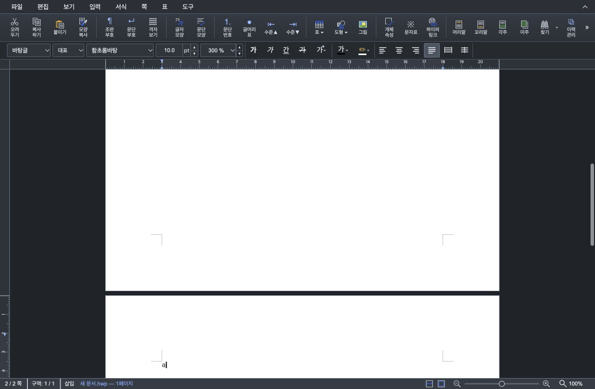
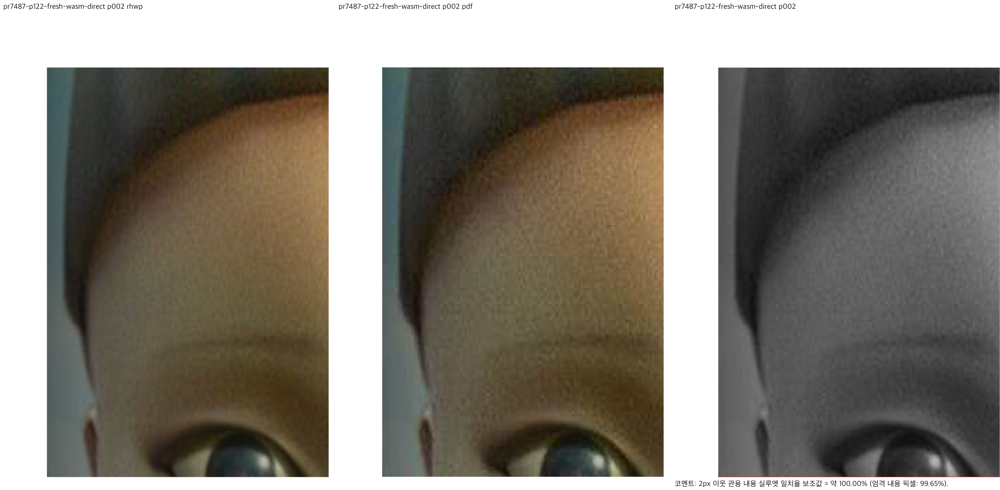
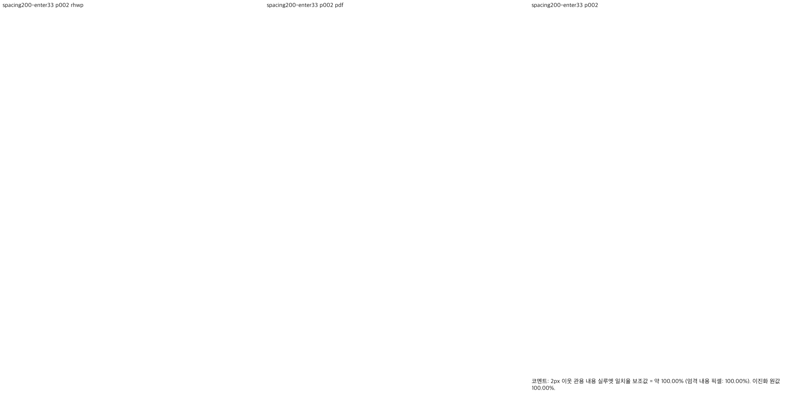
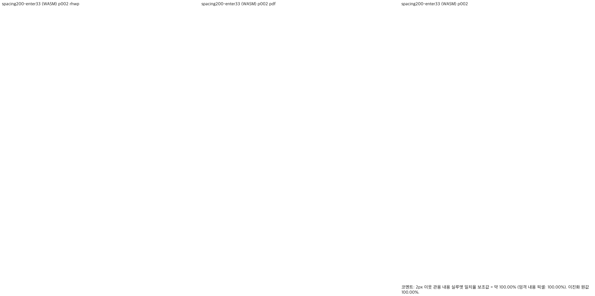
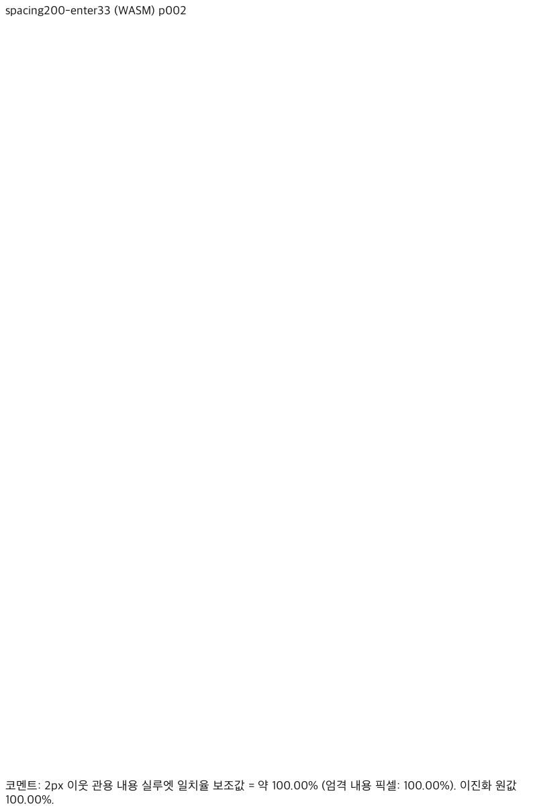
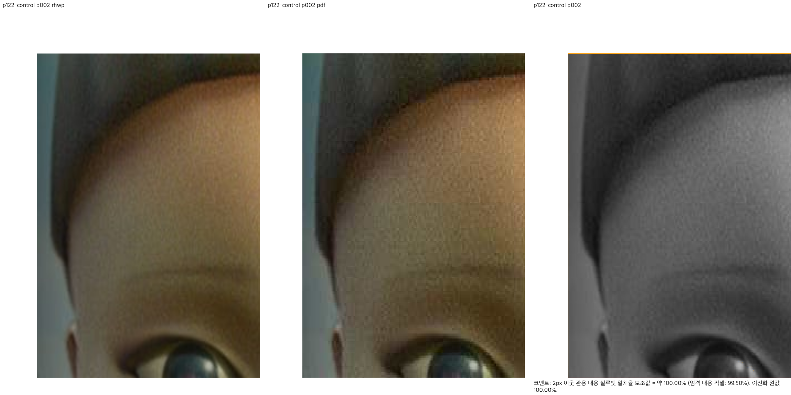
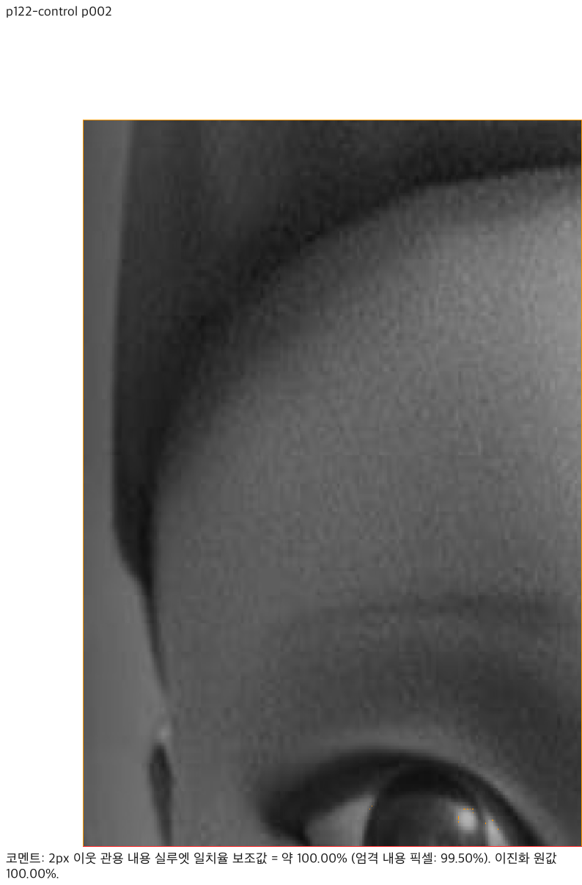
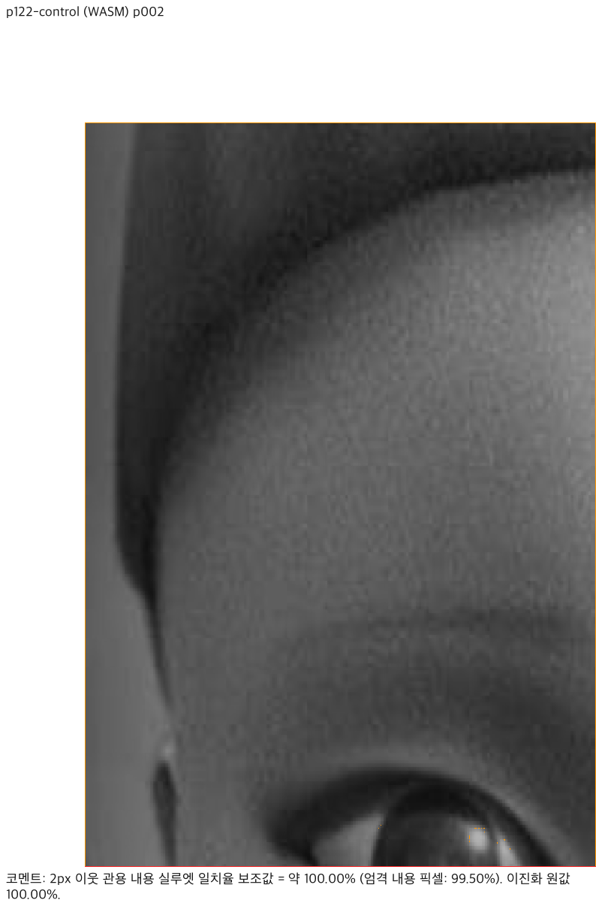

# PR #7487 리뷰 — Enter로 넘친 빈 문단의 쪽 소유 보존

## 최종 판정

**승인.** 빈 문단 엔진의 새 쪽·문단 소유 보존 범위로 수용한다. source `c741f24135d03470588440d1bb67dff3defd3024`의 동일 Enter 입력 9개·한컴 기준 PDF 9개와 Native/fresh WASM 각각 전체 24쪽을 대조했고, 증적 head `2d26931d`의 Full CI는 10,053 PASS / 0 FAIL / 50 skipped다. 검토 head `ebedf92e9b36438b27a8fcacb188f5544e482368`의 필수 Build & Test와 CI·CodeQL·Render Diff가 성공했으며, 정책 Controller `36979324636` attempt 2는 `audit:stage3-5-truth-table`로 SUCCESS를 게시했다. 최초 수집 누락의 원인은 미확정이다.

사용자는 대표 시각 증적과 부분 해결 범위를 수용하고 Approve·merge를 명시 승인했다. 원 기여자의 PR 본문을 수정하지 말라는 지시에 따라 기본 본문 임베드 절차의 게시 위치만 예외로 두고, 정확한 head로 고정한 대표 이미지 8장·검증 결과를 [COMMENT 리뷰](https://github.com/edwardkim/rhwp/pull/7487#pullrequestreview-5389416480)에 제공했다. 실제 Chrome에서 모든 이미지 로드를 확인했다. 문서-only 최종 head의 필수 체크·정책·mergeability를 다시 확인한 뒤 Approve·merge한다. 빈 출력 점수는 한컴 캐럿 좌표 정확성의 근거가 아니며, Studio 캐럿·스크롤과 표 뒤 Enter는 남은 범위로서 #7486을 열어 둔다.

원 contributor `b28130e1...`와 보정 `45863eb2...`를 유지했다. 최초 code candidate `38c0af21...`의 Full CI가 통과했고, 기여자 devel 병합 `f2f96733...`와 문서 보완 `c741f241...`는 검증된 CI를 재사용한 gate가 통과했다. 새 자료를 그 당시의 검증으로 소급하지 않는다. Studio 캐럿·스크롤과 표 뒤 Enter는 이번 해결 범위에 포함하지 않으며 #7486은 OPEN을 유지한다.

## 접수 정보

| 항목 | 값 |
| --- | --- |
| PR | [#7487](https://github.com/edwardkim/rhwp/pull/7487), devel 대상 |
| 기여자 | @semanticist21, 원 commit author semanticist |
| 원격 source | `semanticist21/rhwp`, `fix/issue-7486-enter-overflow-page` |
| 원 head | `b28130e1bcea509d9969088c7e75a0e23e4974b2` |
| 원 parent | `0e8fd49fb868da0d47ac1294dcbbda81f0211233` |
| 보정 commit | `45863eb2b238929c22ecc606af801b6273dc8482`, 원 head 위 single-parent 추가 commit |
| 최초 로컬 정책·실제 CI merge base | `02530b9ed567a44663edb26c65fb565c4a79f00d` |
| 최초 GitHub PR API·impact policy base | `0e8fd49fb868da0d47ac1294dcbbda81f0211233`; 실제 checkout merge 부모와 구분 |
| 최초 CI 검토 head / merge commit | `38c0af21a4370876da2fa34178f25d0ce0a782e0` / `5836f2b03f7c31d1d91d9b2c11c35a94dd9c4582` |
| 관련 이슈 | [#7486](https://github.com/edwardkim/rhwp/issues/7486), 부분 해결이므로 참조만 하고 종료하지 않음 |
| reviewer | @postmelee; bug/layout, v1.0.0, assignee @semanticist21 |
| 현재 시각 검증 source | `c741f24135d03470588440d1bb67dff3defd3024`; contributor merge `f2f96733...` 위 문서 tail, Rust/Studio source 동일 |
| 새 증적 head / 실제 CI checkout | `2d26931dd0cdb8037310f2a236d56d49c7d9af31` / `5d926c85caf2d501ec3ef76590df2c179865fcf5` |
| 현재 병합 시뮬레이션 base | `4a7cf61c8652586ffe86158344771029714f3681` |
| 최초 Full CI 확인 | 2026-10-01 17:34 UTC / 2026-10-02 02:34 KST |
| 현재 metadata | 작성 시점 OPEN, non-draft, maintainerCanModify=true, MERGEABLE/CLEAN; 게시 직전 재확인 |

base route: `collaborator_external_pr.md` 9.3.1의 contributor source 직접 보정.
modifiers: `intake_and_review.md`, `local_validation.md`, `visual_fixture_evidence.md`.
loaded documents: `pr_review_workflow.md`, `pr_review/README.md`, 위 기본·보조 가이드, `review_template.md`, `visual_verification_governance.md`, `visual_sweep_guide.md`, `object_visual_regression.md`, `docs_and_git_workflow.md`, `dev_environment_guide.md`.

초기 검토 당시 devel과 원 source의 정책 차이를 확인했다. 이후 기준선과 지침 변경은 기여자의 devel merge 및 아래 동일 입력 전쪽 시각 검증으로 구분하여 대응했다. 초기 최신-base 체리픽 검토 후보 `d10a64a0c9d4f85e1cad726feb7158585aa277a9`는 로컬 `refs/codex/review/pr7487/integration-d10`으로 보존했다. 보정은 같은 가시성 branch `codex/pr7487-review-20261001`를 원 source로 정렬한 뒤 계속했다. 체리픽 통합 PR을 만들거나 contributor 이력을 rewrite하지 않는다.

## 변경과 검토 범위

기여자의 변경은 끝 쪽의 빈 문단 제거가 Enter로 실제 넘친 줄까지 버리지 않도록 저장 LineSeg의 `vertical_pos + line_height`와 본문 높이를 대조한다. 기본 160%의 60회 Enter 회귀가 이 변경에 포함돼 있다.

추가 보정은 그보다 앞선 마지막 빈 문단 흡수 경로에도 같은 판별 결과를 적용한다. 이전에는 Task #676의 `Hidden` 또는 `Unadvanced` 처리에서 문단이 먼저 사라져, 끝 쪽 보존 코드까지 도달하지 못했다.

| 변경 파일 | 역할 |
| --- | --- |
| [paragraph.rs](../../../src/renderer/typeset/paragraph.rs) | `stored_line_overflows_body` 공통 판별을 만들고, 본문 밖 유효 줄을 마지막 빈 문단 흡수에서 제외 |
| [finalize.rs](../../../src/renderer/typeset/state/finalize.rs) | 기여자의 끝 쪽 보존 조건을 같은 판별로 공유 |
| [정식 회귀 원본](../../../tests/cases/issue_7486_enter_overflow_opens_page.rs) | 200%/300% 경계, 저장·재열기, 여섯 줄간격의 90회 연속 Enter 검사 추가 |

문서 번호·특정 줄간격 값으로 production 분기를 만들지 않았다. 명시적인 `hide_empty_line` 숨김 경로는 기존 순서대로 먼저 실행한다. Studio TypeScript와 표 분할 코드는 변경하지 않았다.

### 조판 원칙 준수 검토

| 항목 | 판정·근거 |
| --- | --- |
| 글자 가시성과 줄 점유 구분 | **충족(검증 범위)**. 글자가 없는 줄도 본문 밖이면 새 쪽과 cursor owner를 가진다. 빈 문자열을 줄 높이 0의 대용으로 사용하지 않는다. |
| 생산→소비→최종 원점 | **충족(일반 단일 본문 경로)**. 편집 재조판 LineSeg → `paragraph/flow.rs:62` 흡수 판별 → `flow.rs:99` whole-fit 및 실패 시 일반 배치 → PageItem/레이아웃 → `getCursorRect`. `section.rs:449`의 최종 제거도 같은 overflow 판별을 사용한다. 실제 경계의 cursor pageIndex·x·y·height를 검사했다. |
| 내용 컷·예약 높이·예산·배치 | 이번 보정은 일반 문단의 기존 fit/이월을 다시 사용하며 새로운 컷이나 높이 계산을 추가하지 않는다. rowspan/PartialTable continuation 알고리즘 변경은 **비해당**. 다단 경로는 이 helper 전에 조기 반환하므로 추가 보정 효과를 주장하지 않는다. |
| 저장 정보와 편집 재조판 | **충족(합성 계약)**. 같은 API로 생성한 문서를 HWPX 저장·재열기해 전 문단 owner를 검사한다. 저장 메타데이터를 손으로 고치거나 수용 조건을 완화하지 않았다. |
| 독립 기대값 | A4·기본 여백·10pt 줄 상자와 Percent 전진으로 설정. 본문 높이 약 65,760 HU, 200%×33 및 300%×22는 66,000 HU이므로 다음 쪽. 새 쪽 본문 시작은 x=30mm, y=20mm+15mm. 구현이 반환한 높이를 기대값으로 재인용하지 않았다. |
| 수정 전 실패 / 후 통과 | 원 head에서 두 신규 경계 테스트가 cursor owner 오류로 FAIL, 보정 뒤 PASS. 환경·컴파일 실패를 재현으로 세지 않았다. |
| 저장 문서 대조군 | p122의 저장 vpos 되감기·그림·끝 빈 쪽, #6087의 13쪽 보존 통과. p122 그림 geometry 변경 0건. |
| 동일 합성 원문의 한컴 대조 | **충족(검증 범위)**. 아래 같은 HWPX 9개의 독립 MCP PDF와 전체 쪽수·Native/fresh WASM 24쪽씩을 대조했다. 빈 출력 점수는 캐럿 좌표 증거가 아니며 의미 소유 검사와 구분했다. |
| 전체 Enter 사용자 여정 | **미충족(기존 Studio 결함 재현)**. 쪽은 만들어져도 캐럿·스크롤 갱신은 늦다. 아래 별도 후속 범위로 남긴다. |

## 검증 입력과 실행 결과

합성 빈 문서는 정식 테스트의 `create_blank_document_native` / `apply_para_format_native` / `split_paragraph_native`로 생성했다. 200%/300% 저장본은 테스트 내 동일 byte buffer를 재열기했다. 외부 수동 LineSeg 입력이나 한컴 생성본으로 분류하지 않는다.

| 실제 파일 | 출처·commit 포함 확인 |
| --- | --- |
| [samples/p122.hwp](../../../samples/p122.hwp) | 기존 저장 문서, 보정 commit blob과 실제 실행 byte 일치 |
| [pdf/p122-2022.pdf](../../../pdf/p122-2022.pdf) | 저장소의 대응 한컴 기준 PDF 재사용, 동일 byte 확인; 형식/연도만으로 제외하지 않음 |
| [#6087 대조 입력](../../../samples/issue6060/30307_local_service_reform.hwp) | 기존 정상 저장 입력, commit byte 일치 |
| [blank2010.hwp](../../../saved/blank2010.hwp) | 이전 기본 빈 문서 진단의 기존 입력, commit byte 일치 |

네 입력의 SHA-256·크기와 산출물 해시는 [provenance.json](../assets/pr_7487/provenance.json)에 고정했다.

아래 로컬 검증 source SHA는 보정 `45863eb2b238929c22ecc606af801b6273dc8482`다. 원 head의 과거 CI를 새 보정의 검증으로 재사용하지 않았다. 그 뒤 최초 문서 commit `38c0af21...`을 push하고 새 원격 CI도 실제 실행했다.

| 검증 | 실행 결과 |
| --- | --- |
| 변경 경계 focused | 4 PASS. 기본 Enter, 200%/300% owner·본문 시작 좌표, 저장 재열기, 6개 줄간격×90 Enter 줄 상자 검사 |
| 저장 vpos p122 | 3 PASS |
| #6087 top collision | 1 PASS, 13쪽 유지 |
| fmt·native Clippy·WASM32 Clippy·workspace build·workspace all-target Clippy | 순차 실행 모두 PASS, `--locked --target-dir target/pr-review`, Clippy `-D warnings` |
| integration manifest | `--prepare` 후 `--check --base-ref 02530b9ed567a44663edb26c65fb565c4a79f00d` PASS; 파생 suite/manifest 커밋 제외 |
| 전체 default-feature 회귀 | `cargo nextest run --locked --cargo-profile release-test --target-dir target/pr-review --tests --no-fail-fast`: 10,273 PASS / 50 skipped |
| Native Skia lib | `cargo test --locked --profile release-test --target-dir target/pr-review --features native-skia --lib`: rhwp 3,930 PASS / 13 ignored, workspace 부속 lib 182 PASS |
| Native Skia placeholder / direct PDF | 각각 2 PASS / 4 PASS |
| fresh WASM | 루트에서 `CARGO_TARGET_DIR=target/pr-review scripts/wasm-pack-locked.sh --target web --out-dir pkg --no-opt` 성공; root pkg·Studio public·실제 HTTP 제공 JS/WASM SHA-256 일치 |
| 실제 Chrome Studio | 새 문서 로딩 완료 뒤 160% Enter41, 200% Enter33, 300% Enter22에서 두 쪽 생성. 100% 한 쪽 / 66% 두 쪽 보기에서 남은 캐럿 지연 재현 |

[명령·exit·시간 원장](../assets/pr_7487/validation.json), [수정 전후 및 전체 검사 발췌](../assets/pr_7487/test-results.txt), [엔진 before](../assets/pr_7487/engine-before.json), [엔진 after](../assets/pr_7487/engine-after.json), [Chrome DOM 관측](../assets/pr_7487/chrome-dom-observations.json), [실행 확인한 WASM 재현 스크립트](../assets/pr_7487/reproduce-wasm.mjs).

Native Skia 첫 시도는 sandbox DNS 제한으로 의존성 다운로드 전에 실패했다. 허용된 네트워크로 재실행해 위 결과를 얻었다. Docker daemon 미실행으로 host wrapper의 `--no-opt` WASM을 사용했다. 최적화된 배포 패키지의 직접 브라우저 확인은 미검증이며 이번 host 검증과 구분한다.

Chrome 첫 예비 시도에서는 새 문서 로딩 중 입력해 횟수를 신뢰할 수 없었고, 이전 문단 번호에 서식을 적용하는 경고가 발생했다. 그 시도는 폐기하고 로딩 완료 후 새 문서에서 다시 센 위 기록만 수용했다. 결함의 전후 증거에 예비 시도를 섞지 않았다.

## push 뒤 원격 CI 확인

정상 push로 원 contributor commit을 유지한 채 code `45863eb2...`와 최초 docs `38c0af21...` 두 commit을 추가했다. 원격 branch ref·PR head·27개 변경 파일·3개 commit 계보가 local 후보와 일치했다. force-push하지 않았다.

fork 실행 승인 대기(`action_required`)는 사용자에게 6개 workflow 목록을 제시한 뒤 명시 승인을 받아 해제했다. PR Approve 리뷰와 다른 작업이다. `fast_pass=false`, Rust/render/Native Skia 필요로 분류되어 새 코드의 회귀를 실행했다.

실제 checkout `5836f2b03f7c31d1d91d9b2c11c35a94dd9c4582`의 부모는 최신 devel `02530b9e...`와 head `38c0af21...`다. PR API·trusted classifier에 남은 base `0e8fd49f...`와 이 checkout을 구분한다.

| 검증 | 실제 결과·URL |
| --- | --- |
| CI / required Build & Test | [run 36896647961](https://github.com/edwardkim/rhwp/actions/runs/36896647961) 성공; Archive A 3,873 / B 1,884 / C 2,235 / D 2,095 PASS, 합계 10,087 PASS / 50 skipped. 위 로컬 실행과 다른 CI 구성의 실제 수치다. |
| 추가한 경계 회귀 | Archive C 로그에서 기본 Enter, 200% Enter33, 300% Enter22, 6개 줄간격 반복 Enter 4건 모두 실제 PASS 확인 |
| 필수 lint / Native Skia | 동일 CI run에서 fmt·native/WASM32/workspace Clippy와 Native Skia 성공 |
| CodeQL | [run 36896647907](https://github.com/edwardkim/rhwp/actions/runs/36896647907) 성공; Rust 분석·결과 업로드 완료. Code scanning 요약 check는 NEUTRAL. |
| Render Diff | [run 36896647641](https://github.com/edwardkim/rhwp/actions/runs/36896647641) 성공; Canvas 3 PASS, Direct PDF compatibility 3 PASS. PDF report-only 경고 4건은 원 head run 36633643139의 요약 보고서와 byte 단위로 동일. 경고가 없다는 뜻이 아니다. |
| Adapter / Proptest | [Adapter](https://github.com/edwardkim/rhwp/actions/runs/36896647983), [Proptest](https://github.com/edwardkim/rhwp/actions/runs/36896647872) 성공 |
| 최종 gate | CI Impact Policy SUCCESS, pending/failure 없음, OPEN/non-draft, MERGEABLE/CLEAN. review·merge·이슈 종료는 미수행. |

[실제 head·check·회귀 수치·경계 PASS 원문](../assets/pr_7487/ci-validation.json). Frontend unit/package는 변경 범위 `none`으로 skip, CI의 release용 WASM Build도 skip이다. 로컬 fresh WASM과 Render Diff의 실제 WASM 빌드는 별도 실행 증거이며 release용 package 검증으로 확대하지 않는다.

### 기여자의 기준선 갱신과 기록 정렬

문서 보완 push 직전 contributor가 `38c0af21...` 위에 devel `e5098bc91be44a49367a7f2895a14fcd4f4c2c7f`를 병합한 `f2f96733...`을 확인했다. 원 contributor merge와 오늘할일의 다른 PR 기록을 보존하고, 미게시 collaborator 문서 commit 하나만 `multi_pr_update_branch.md` 2.6.1에 따라 같은 visibility branch에서 새 source 위로 replay했다. 추가 source/test 수정이나 force-push는 하지 않는다.

현재 source의 [CI 36953426308](https://github.com/edwardkim/rhwp/actions/runs/36953426308) preflight는 candidate `38c0af21...`에 대해 `current-base-merge-resolution-mydocs-only`를 검증하여 재사용했다. heavy worker skip과 최종 Build & Test 성공을 구분했다. [CodeQL 36953426304](https://github.com/edwardkim/rhwp/actions/runs/36953426304)·[Render Diff 36953426029](https://github.com/edwardkim/rhwp/actions/runs/36953426029) 등도 완료 성공했다. 아래 Full CI 수치는 이전 candidate의 실제 실행이며 `f2f96733...`에서 새로 실행한 수치로 바꾸지 않는다.

저장 문서 p122 PNG와 Chrome 캡처는 보정 source `45863eb2...`의 검증 당시 증적이다. 이 절의 작성 시점에는 새 기준선의 Native/fresh WASM 재출력·직접 시각 비교가 미실행이었다. 아래 한컴 대조 보완에서 source `c741f241...`를 새로 출력했다. 최신 지침의 신규 조판 회귀 추가 선행 조건(동일 입력의 독립 한컴 PDF·Native/fresh WASM 전체 영향 쪽 최저 90% 이상)을 이 Enter 합성 입력은 입증하지 못했다. 이미 추가된 검사를 자동 삭제하거나 p122 대조군으로 대신하지 않으며, 당시의 증거 부족 판단을 보존하고 아래 신규 검증 결과로 갱신한다.

## 시각 증적과 남은 차이

### 엔진 경계와 별도 Studio 결함

엔진 직접 WASM API에서 보정 전에는 Enter33/22의 split이 성공해도 1쪽이고 cursor 조회가 실패했다. 보정 후에는 즉시 2쪽, pageIndex=1, x≈113.4px·y≈132.3px·height≈13.3px다. Chrome에서도 Enter 한 번으로 페이지 canvas가 둘이 됐다.

100%에서 새 쪽이 생성된 직후 상태줄은 `1 / 2 쪽`이고 DOM caret은 `top:132.3px`, `left:530.4px`에 남았다. 실제 두 번째 canvas의 top은 `1142.5px`라 새 쪽 원점을 반영하지 못한 상태다. 다음 `a` 입력 뒤 `2 / 2 쪽`, caret top≈1275.4px와 화면 스크롤이 갱신됐다. 66% 두 쪽 보기에서도 생성 직후 caret top≈87.3px가 추가 입력 뒤≈94.3px로 보정됐다.




[200% 직후](../assets/pr_7487/chrome-200-enter33.png) · [200% 추가 입력 뒤](../assets/pr_7487/chrome-200-after-input.png) · [66% 직후](../assets/pr_7487/chrome-300-zoom66-enter22.png) · [66% 추가 입력 뒤](../assets/pr_7487/chrome-300-zoom66-after-input.png).

사용자 첨부 [이전 경계 화면](../assets/pr_7487/user-before-300-enter.png)과 [이전 새 쪽 캐럿 화면](../assets/pr_7487/user-before-new-page-caret.png)은 관측 참고다. 그 화면의 정확한 빌드 SHA·입력 원문이 없으므로 동일 source의 독립 oracle로 승격하지 않는다.

Studio 원인 경로는 `InputHandler.executeOperation(command)` → `afterEdit`의 document-changed와 즉시 updateCaret → 비동기 `CanvasView.refreshPagesForMutation`의 VirtualScroll 확정이다. 완료 이벤트의 listener는 `CaretLayoutReveal.consume()`이 true일 때만 재투영한다. 현재 허용 operation은 pageBreak/columnBreak이며 command Enter에는 예약이 없다. 관련 TypeScript 파일은 원 PR과 최신 base에서 동일하여 새로 도입된 회귀로 분류하지 않는다. 화면 위치 clamp나 숨김으로 우회하지 않고 별도 Studio 작업에서 갱신 완료와 caret reveal을 연결해야 한다.

### 기존 저장 문서 대조군: Native / fresh WASM

`p122.hwp`의 2쪽을 동일 `p122-2022.pdf`의 2쪽과 96 DPI로 비교했다. Native는 아래 Visual Sweep 명령, fresh WASM은 직접 Node API의 SVG/render tree를 librsvg로 래스터한 뒤 같은 sweep helper로 compare/standalone overlay/review를 만들었다. 후자는 브라우저 렌더라고 보고하지 않는다.

```sh
venv/bin/python scripts/visual_sweep.py --hwp samples/p122.hwp \
  --pdf pdf/p122-2022.pdf --key pr7487-p122-control --pages 2 --dpi 96 \
  --rhwp-bin target/pr-review/release-test/rhwp --svg-rasterizer rsvg \
  --out output/pr-review/pr7487-review-20261001/p122-native-sweep
```


코멘트: 내용 픽셀 중심 자동 일치율 보조값 = 약 99.65%.<br>
높을수록 좋음: 기준 PDF와 rhwp PNG가 더 비슷함<br>
낮을수록 나쁨/검토 필요: 잉크 위치나 형태 차이가 큼<br>
단, 사람 판정 정확도가 아니라 내용 픽셀 중심 자동 일치율 보조값입니다



코멘트: 내용 픽셀 중심 자동 일치율 보조값 = 약 99.65%.<br>
높을수록 좋음: 기준 PDF와 rhwp PNG가 더 비슷함<br>
낮을수록 나쁨/검토 필요: 잉크 위치나 형태 차이가 큼<br>
단, 사람 판정 정확도가 아니라 내용 픽셀 중심 자동 일치율 보조값입니다

[Native standalone overlay](../assets/pr_7487/native-p122-overlay-p002.png) · [WASM standalone overlay](../assets/pr_7487/wasm-p122-overlay-p002.png) · [지표·gate](../assets/pr_7487/wasm-p122-summary.json) · [OVR geometry](../assets/pr_7487/p122-ovr-summary.json).

양 backend 모두 픽셀 일치율 99.73420%, 엄격 내용 일치율 99.64882%, 2px 관용 내용 실루엣 일치율 100.0%, gate=passed다. review와 standalone overlay를 직접 열어 그림 외곽·원점·크롭이 겹치는 것을 판독했다. 미세한 이미지 가장자리/리샘플링 차이가 남는다. 글꼴 예외는 사용하지 않았다.

OVR는 보존한 보정 전 WASM `d10a64a...`와 보정 후 Native render tree를 `rhwp_objects`/`compare_objects`로 대조하고 x/y도 별도 검사했다. 3→3쪽, 그림 1→1개, page/x/y/w/h delta=0이다. 대상은 p122의 그림 한 개이며 ovr5 전수 검사로 확대 해석하지 않는다. 새로운 빈 Enter 페이지의 한컴 기준 출력 일치를 뜻하지 않는다.

## 동일 Enter 입력의 한컴 대조 보완 — 2026-10-02

[메인테이너 요구](https://github.com/edwardkim/rhwp/pull/7487#issuecomment-5944034528)의 동일 입력 PDF와 시각 증거를 보완했다. 오늘할일 add/add 충돌은 기여자의 `f2f96733...`에서 양쪽을 보존해 해결했으며, 증적 commit 전 최신 base `4a7cf61c...`의 merge tree `5f17599df5aa97a808d5a13dc145496e5b7c5929`도 충돌 없이 생성됐다.

### 입력·출처·빌드

- **검증 source**: `c741f24135d03470588440d1bb67dff3defd3024`. 증적 추가는 Rust·Studio code/test를 바꾸지 않는다.
- **입력**: [samples/issue7486/README.md](../../../samples/issue7486/README.md)의 합성 HWPX 9개. fresh WASM의 실제 편집 API로 만들었고 XML·LineSeg는 수동 수정하지 않았다. 동일 bytes를 두 backend와 MCP에 사용했다. README에 입력/PDF SHA-256·job id·쪽수를 고정했다.
- **MCP 선택**: `rhwp info --json`은 `hwpx`, `hancom-office-2020`, `11.0.0.3524`를 반환했다. 이는 기본 빈 template의 저장 메타데이터다. 원문을 한컴에서 생성했다는 출처로 바꾸지 않는다. npx client 0.9.0에서 `--engine 2020`을 명시해 비동기 `start → succeeded → download success`를 확인했다.
- **실제 한컴 변환**: 서비스 profile `2020`, Hancom `11.0.0.9136`, 32bit direct DLL backend, 전처리 none, PDF one-up. 로컬 수신 bytes·SHA-256은 server/client와 일치했다. PDF 1.4, Creator `Hwp 2020 0.0.0.0`, Producer `Hancom PDF 1.3.0.550`을 확인했다. 서비스 URL/IP/token은 기록하지 않는다.
- **fresh build**: Native `cargo build --locked --profile release-test --bin rhwp`; WASM 루트 `CARGO_TARGET_DIR=target/pr-review scripts/wasm-pack-locked.sh --target web --out-dir pkg --no-opt`. JS `2b7e7bb01cbbff0cb0d3c9a3222c6cb187f9d9710045013bcfb077d7abef4133`, WASM `3c4854430292e17c4b9943203dacfa59865eef60bb6b9207b4f172f11861d855`; root pkg와 Studio public SHA-256 일치. host `--no-opt` 진단 출력이며 최적화 배포·새 Studio 브라우저 입력 시험으로 보고하지 않는다.
- **실제 sweep**: `scripts/visual_sweep.py --silhouette-only --file-target <key> <동일 HWPX> <한컴 PDF> --rhwp-bin target/pr-review/release-test/rhwp --dpi 96`; WASM에 `--wasm-pkg pkg` 추가. 두 backend 모두 인쇄 프로필, Chrome raster. 대표 경계와 p122는 별도 output에서 일반 모드 `--pages 2`로 compare·standalone overlay·review를 생성했다.
- **중간 산출물**: `output/pr-review/pr7487-hancom-20261002/{native,wasm}-{scores,range-scores,review}`. 원본·PDF·대표 PNG와 [전쪽 TSV](../assets/pr_7487/hancom-enter-silhouette.tsv)만 제출하며 원격 응답/로그·render tree·raster 전수는 commit하지 않는다.
- **재현 해시**: [한컴 대조 provenance](../assets/pr_7487/hancom-enter-provenance.json) (`b69308be1bd1337f43b3b9ab40e04c9170a48fa615e1f729a2c6b143af180818`)에 9개 입력/PDF·18개 silhouette manifest·12개 PNG의 SHA-256을 고정했다. 전쪽 TSV SHA-256은 `5978d8e5fcc08e16865b52fd89d5a9db95a9991eed4f90c2b8f4bbb3b294105d`다.

### 주장과 실제 검사

| 입력 / 주장 | 독립 기대값·관측 | Native/fresh WASM 실제 검사 | 판정·한계 |
| --- | --- | --- | --- |
| 200% Enter33 | 같은 파일의 한컴 PDF 2쪽 | 두 backend 2쪽, 문단 0..33 순서·정확히 한 번, 마지막 owner index 1 | 충족: 쪽 구성·owner 계약. 빈 문단의 한컴 캐럿 좌표는 PDF로 측정하지 않음 |
| 300% Enter22 | 같은 파일의 한컴 PDF 2쪽 | 두 backend 2쪽, 문단 0..22 순서·정확히 한 번, 마지막 owner index 1 | 충족: 쪽 구성·owner 계약, 위와 같은 PDF 한계 |
| 기본 160% Enter60 | 한컴 2쪽 | 두 backend 2쪽, 61문단 누락·중복 없음, 같은 byte 재열기 owner 일치 | 충족: 원 기여 범위 |
| 90회 Enter, 100/130/160/180/200/300% | 한컴 쪽수 2/2/3/3/3/5 | 두 backend 같은 쪽수, 각각 91문단 순서 보존, 모든 owner 일치 | 충족: 반복·저장 입력 계약 |
| 모든 합성 입력의 전쪽 출력 | Native/fresh WASM 각각 24쪽, 90% 미만·누락 0 | 최저 2px 관용 실루엣 100%, content_union_pixels=0 | 흰 페이지 비교값. 단독으로 줄 위치·Studio 캐럿·스크롤 또는 한컴의 전체 편집 동작 일치를 입증하지 않음 |
| 현재 source의 p122 p2 대조군 | 기존 독립 한컴 PDF의 그림 원점·외곽·crop | 양 backend 관용 100%, 엄격 잉크 99.50139%, 픽셀 99.62261%; 직접 review/overlay 판독 | 그림 배치 유지, 미세 resampling 잔차. Enter의 기준 PDF를 대신하지 않음 |

새 한컴 파일 9개를 `pdf/`에 포함했다. Native dump의 문단 소속과 fresh WASM 재열기 cursor owner를 대조했고, 전 문단이 순서대로 한 번씩 등장하는 것을 확인했다. 기존 회귀의 수정 전 FAIL/후 PASS 기록은 위 source별 결과를 유지한다. 이번에는 새로운 Rust 회귀·baseline·golden을 추가하거나 기존 검사를 삭제하지 않았다.

### 대표 직접 판독 자료

빈 두 쪽은 양쪽에 인쇄 내용이 없다. 아래 PNG의 100%는 **흰 출력 비교**이며, 위 독립 전체 쪽수와 의미 소유 검사에 결합해서 읽는다.

#### 200% Enter33




2px 관용 실루엣 100%; 잉크 합집합 0. 빈 출력의 일치이며 캐럿 정확성 점수가 아니다.





2px 관용 실루엣 100%; 잉크 합집합 0. 빈 출력의 일치이며 캐럿 정확성 점수가 아니다.

#### 300% Enter22


2px 관용 실루엣 100%; 잉크 합집합 0. 빈 출력의 일치이며 캐럿 정확성 점수가 아니다.


2px 관용 실루엣 100%; 잉크 합집합 0. 빈 출력의 일치이며 캐럿 정확성 점수가 아니다.

#### p122 p2 대조군





2px 관용 실루엣 100%; 엄격 잉크 보조값 99.50139%. 직접 그림 배치를 확인했으며 resampling 잔차를 남긴다.




2px 관용 실루엣 100%; 엄격 잉크 보조값 99.50139%. 직접 그림 배치를 확인했으며 resampling 잔차를 남긴다.

### 동일 입력 증적 head의 새 Full CI

32개 입력·PDF·대표 PNG·TSV/README를 `2d26931dd0cdb8037310f2a236d56d49c7d9af31`로 정상 push했다. 원 source/test는 그대로이며 신규 HWPX는 review-only로 취급하지 않아 **Full CI를 실제 실행**했다. 실제 checkout은 `5d926c85caf2d501ec3ef76590df2c179865fcf5`(부모 base `4a7cf61c8652586ffe86158344771029714f3681`와 head `2d26931d...`)다. API의 baseRefOid `e5098bc91...`와 구분한다.

| 확인 | 새 head 실제 실행 결과 |
| --- | --- |
| [CI / required Build & Test](https://github.com/edwardkim/rhwp/actions/runs/36976613881) | SUCCESS; Archive A 3,870 / B 2,078 / C 2,079 / D 2,026 PASS, 합계 **10,053 PASS / 0 FAIL / 50 skipped** |
| #7486 회귀 4개 | Archive C 로그에서 기본 Enter·200% Enter33·300% Enter22·여섯 줄간격 반복 Enter가 모두 실제 PASS |
| lint·Skia | fmt, native/WASM32/workspace all-target Clippy, suite 정책·agent 계약 및 Native Skia job SUCCESS; release용 WASM Build는 영향 정책상 skip이며 로컬 fresh host WASM 검증과 구분 |
| [CodeQL](https://github.com/edwardkim/rhwp/actions/runs/36976613820) | javascript-typescript·python·rust job 모두 SUCCESS; code scanning 요약의 NEUTRAL은 별도 상태 |
| [Render Diff](https://github.com/edwardkim/rhwp/actions/runs/36976613461) | SUCCESS; PDF report-only 4 warnings / 0 errors, Direct PDF compatibility 3쪽 PASS |
| [Adapter](https://github.com/edwardkim/rhwp/actions/runs/36976613779) / [Proptest](https://github.com/edwardkim/rhwp/actions/runs/36976613846) | 모두 실제 실행 SUCCESS |
| head·권한·병합 gate | postmelee, OPEN/non-draft, maintainerCanModify=true, 정확한 head `2d26931d...`, CI Impact Policy SUCCESS, pending/failure 없음, MERGEABLE/CLEAN |

Render Diff 보고용 경고의 대상 4개는 같지만 이전 `38c0af21` 실행과 byte 동일한 보고서는 아니다. KTX는 diff ratio 0.58328941→0.58316941, biz_plan은 0.02171899→0.02207339, tac-case는 0.00399927, kps-ai는 0.05833713이다. direct/compatibility gate는 각각 0.01162939·0.00343940·0.00817405로 제한 0.02 이내다. 서로 다른 CI merge 기준선/실행의 변동 원인은 확정하지 않았으며 경고 없음·전체 fidelity 무회귀로 확대하지 않는다. 이번 Enter source/test는 추가 증적 commit에서 바뀌지 않았고 같은 입력의 별도 한컴 대조와 p122 직접 결과를 위에 기록했다. baseline/golden/허용치는 변경하지 않았다.

완료 로그는 `output/pr-review/pr7487-hancom-20261002/ci-{archive-a,archive-b,archive-c,archive-d,lint,skia}.log`, `oracle-ci-archive-results.json`, `oracle-ci-final.json`, `ci-render-pdf-summary.md`에 남겼다. 후속 기록 commit은 이 녹색 head 위 single-parent로 만들고 허용된 review 문서·asset provenance·오늘할일만 포함한다. push 전 최신 base의 오늘할일 228개 중 이번 날짜 파일 외 227개가 merge tree에서 동일함을 확인했고, 같은 날짜 다른 PR section은 그대로 보존한다. 최종 문서 head의 CI candidate identity·required aggregate·정책·mergeability를 다시 확인한 뒤 본문과 COMMENT 재검토를 게시한다.

### 별도 Studio PR 준비와 merge 뒤 comment 계획

Studio 후속은 최신 devel에서 별도 PR로 진행한다. 범위는 `document-layout-refreshed` 완료 후 Enter로 변경된 캐럿 좌표를 다시 투영하고 화면에 드러내는 것까지다. `CaretLayoutReveal`의 Enter·undo/redo 예약과 실제 비동기 `CanvasView → VirtualScroll → updateCaret` 완료 경로를 추적한다. 좌표 clamp·추가 입력·배율 변경으로 우회하지 않는다. 기존 쪽/단 나누기 추종은 대조군으로 보존한다. 실제 브라우저 회귀는 100%/66% 배율·160/200/300% 줄간격에서 Enter 한 번 후 새 쪽 owner, DOM 위치, viewport 포함을 검사하고 수정 전 FAIL/후 PASS를 확인한다. 이번 PR source에 Studio 변경을 섞지 않았다. #7487 병합 후 최신 devel에서 최종 통합 검증·별도 PR 제출을 진행한다.

merge가 승인되고 완료되면 실제 merge SHA와 CI를 API로 재조회한다. contributor comment에 이 검증 범위(9개 입력, 24쪽/backend, 대표 Enter 경계 2쪽 및 p122 p2), 빈 출력 점수의 한계, Studio·표 뒤 Enter 잔여 범위를 존댓말로 남긴다. 대표 review/overlay는 `https://raw.githubusercontent.com/edwardkim/rhwp/<merge-commit-sha>/mydocs/pr/assets/pr_7487/hancom-<key>-<backend>-<review|overlay>-p002.png`로 표시하고 [Visual Sweep 정본](https://github.com/edwardkim/rhwp/blob/devel/mydocs/manual/verification/visual_sweep_guide.md#github-merge-comment)을 연결한다. asset이 merge SHA에 존재한 뒤 UTF-8 body-file로 게시하고 API 본문·이미지 로드를 다시 확인한다. 이 계획은 merge/comment 게시 승인이 아니며, #7486은 전체 해결로 종료하지 않는다.

## 원격·후속 처리 조건

- 보정 code/test commit과 archive review/report·asset·오늘할일 commit을 분리한다.
- 최초 code/docs와 한컴 증적 `2d26931d...`는 사용자 승인 뒤 정확한 contributor ref로 정상 push 완료. 한컴 대조와 새 Full CI 보완 기록의 trailing push·CI 확인·PR 본문·COMMENT 재검토 게시는 이번 진행 승인 범위이며, 최종 source와 게이트를 확인한 뒤 수행한다. force-push는 사용하지 않는다.
- code/test를 포함한 head `38c0af21...`은 새 Full CI 확인 완료. 이후 문서만 바꾸면 이 정확한 녹색 code tree의 review-only 재사용 조건을 다시 확인한다.
- 승인된 PR 본문 갱신에서 대표 review/overlay PNG를 source repository와 새 head SHA 고정 raw URL로 실제 임베드한다. 아직 존재하지 않는 URL을 검증 완료로 보고하지 않는다.
- 기존 문서 `c741f241...` push·본문 갱신·[COMMENT 리뷰](https://github.com/edwardkim/rhwp/pull/7487#pullrequestreview-5388862642)는 완료했다. 새 동일 입력 증적과 기록 게시·재검토 요청은 이번 후속 진행 범위다. Approve·Request changes·merge는 별도 확인 없이 제출하지 않는다.
- merge는 별도 승인 뒤 수행한다. 그 뒤 contributor comment에 merge SHA 고정 동일 asset·CI URL·남은 차이를 한국어 존댓말로 남긴다.
- #7486은 표 뒤 Enter와 Studio 캐럿·스크롤 문제가 남으므로 종료하지 않는다. 배포 전 전체 Enter 사용자 여정 해결을 주장하지 않는다.
