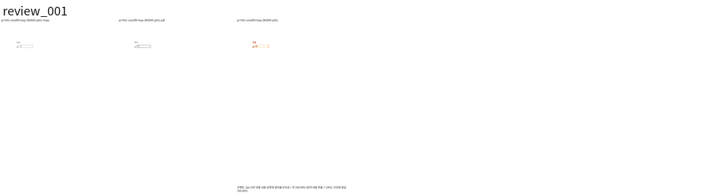
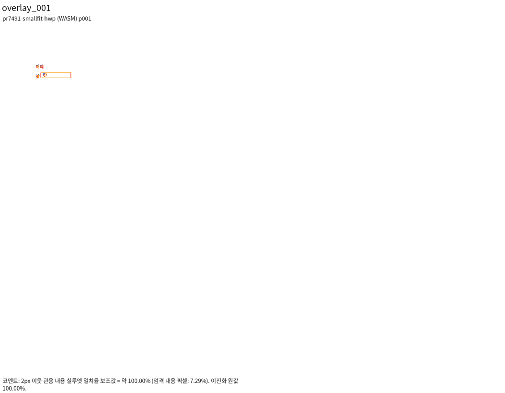
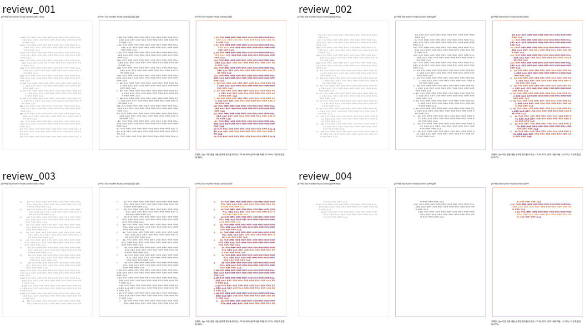
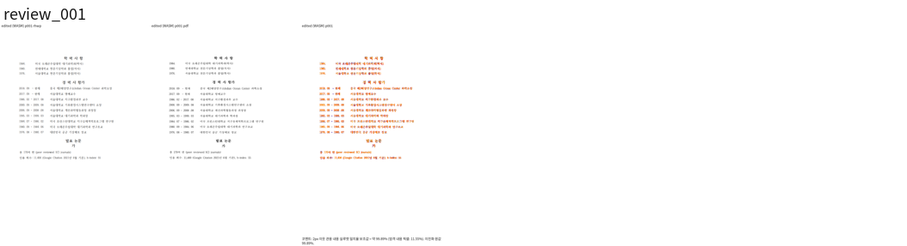
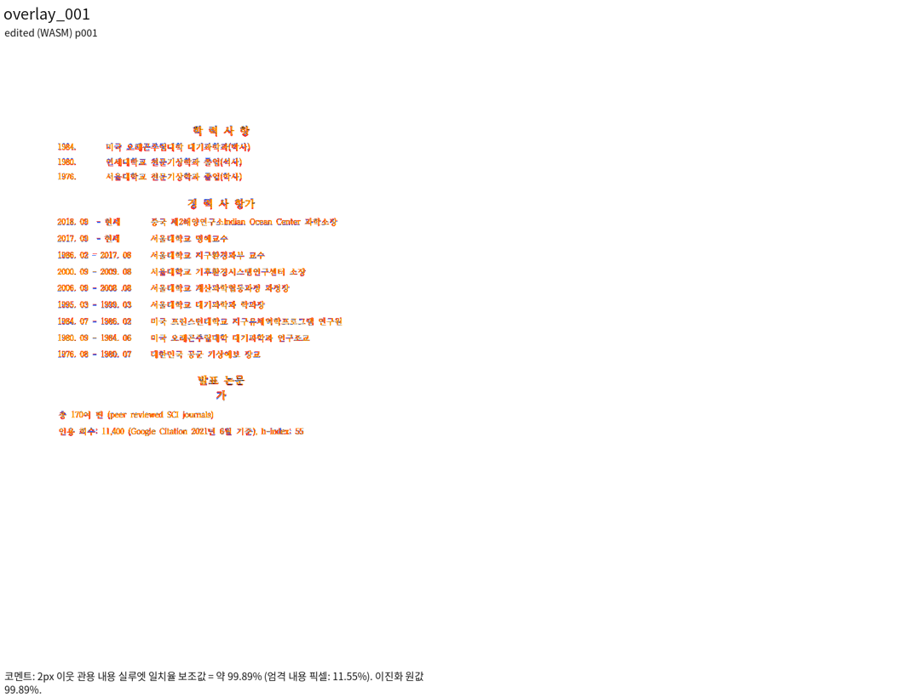
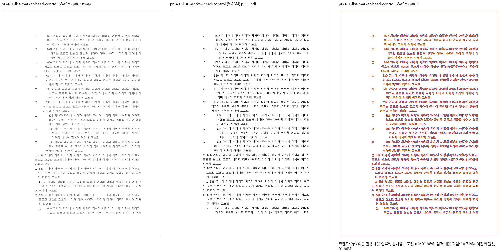
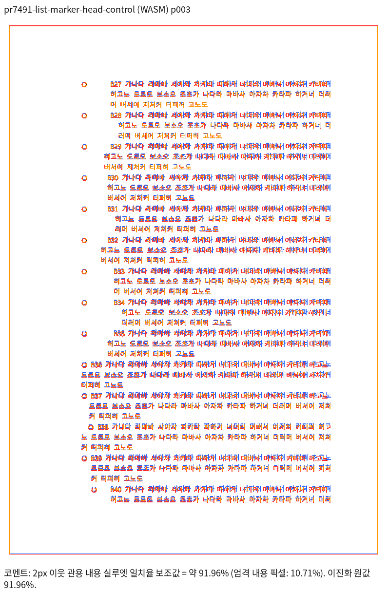

# PR #7491 리뷰 — 메인터너 인계 보정

## 최종 판정

메인터너 보정 후 수용 가능 — #7490 해결 범위의 로컬 검증 완료. #7490 들여쓰기 문제와 그 편집 경로의 TAC prefix 처리에
해결 범위를 한정한 별도 integration [PR #7599](https://github.com/edwardkim/rhwp/pull/7599)를
사용자 승인 후 push·등록했다. 통합 PR은 최종 head CI 성공을 확인하고 사용자 승인으로 병합했다.
실제 merge SHA는 `bdda980b7e266d821171ed08b7604e21e6f3b7fa`다. 원 PR 자체를 merge하지 않으며, 원 PR은 영구 기록 반영과 한국어 안내 후 대체 통합으로 CLOSED 처리했다.
작업지시자의 #7491 인계 지시에 따라 semanticist21의 네 commit을 author와 원 SHA를
보존해 cherry-pick했다. 기여자 보류를 일반 reviewer가 임의로 해제한 경로가 아니다.

- 기준 devel: `cdba77b609c399fdef26a6c9e637716aa32c2177` (최종 fetch에서도 동일).
- 원 PR head: `c4367ec03a28369cc6f26b17eca46553ac61514c`, OPEN / DIRTY / mergeable=false.
- 작업 branch: `integration/pr7491-maintainer-20261005`.
- 통합 PR: [#7599](https://github.com/edwardkim/rhwp/pull/7599), OPEN / devel / 작성자 edwardkim.
  최초 등록 head `e97473e7f34a771dc6716963d5f44d62a5fd2b2a`;
  [통합 PR 검토 기록](pr_7599_review.md)의 후행 문서 commit을 포함한 최신 원격 head CI도 아래 기록처럼 완료했다.
- 최종 production: `c3e99c204133f661534e837aa8bb00b16e4bb99a`.
- Rust 21개 계약: `183db042f8a2e81735d6a03b8566f76763dfd052`; E2E 등록·명명은 이후 `dbe8431cb`.
- 전체 회귀: 10,379 PASS / 0 FAIL / 50 SKIP. Native Skia 3단계 PASS. 원 PR CI와 로컬 integration 검증은 별개다.

## 해결 범위와 독립 근거

편집 재조판의 첫 줄/후속 줄에 들여쓰기 bit20을 유지하며, 명시적 문단 모양 변경은 기록을
새로 단다. 한컴 원본의 bit20이 모두 꺼진 줄과 번호 문단의 후속 줄 기록은 보존한다.
본문·셀·머리말/꼬리말·각주·외부 붙여넣기·문단 병합 undo를 실제 명령과 최종 X 좌표로 검사한다.
보조 영역은 Native 좌표 계약이며 실제 Studio UI/한컴 PDF 통과로 확대하지 않는다.

#6190 표 앞 입력은 텍스트+표 바깥 여백을 남은 폭으로 검사한다. 들어가는 작은 표는 같은 줄,
너비 부족/명시적 개행 뒤 표는 다음 줄이다. 표 줄 높이는 본체+위/아래 바깥 여백이다.
공백 두 칸·빈 개행·`.\n`도 실제 입력으로 생성했으며, 빈 줄의 점유 상자를 공통 ComposedLine에
보존한다. 표 앞줄의 국소 원점과 저장 줄 사이 거리로 표 Y를 정하고 절대 vpos로 덮어쓰지 않는다.

일반 prefix는 `lh==th`인 앞줄들과 같은 저장 fragment의 단조 vpos로 구분한다. 최대 개체 높이를
반복 저장한 빈 밴드, vpos reset continuation, PUA 필러는 다른 소유 계약을 유지한다.
원점 이월은 이미 소비한 prefix 높이를 다음 쪽에 다시 예약하지 않고 실제 새 단의
InlineBoxPlacement를 paint에 전달한다. 컷/rowspan 내부 알고리즘 변경은 없다.

원 #6190에는 본문 ColumnDef가 없다. 저장 25mm 여백과 달리 한컴은 30mm로 열었다.
원본·보정 전 실패 자료를 보존한다. 실제 1단 명령 대조군은 25mm를 유지하므로 재구성 저장은
기본 1단을 명시한다. raw 스트림 재사용과 live 모델은 보존하고, 실제 1단 명령 저장본과
보정 저장본의 바이트도 같다. 11개 public input의 모든 painted box/내용/용지 보존을 검사했다.

[생성기](../assets/pr7491/generate_inputs.rs), [입력/PDF 해시와 변환 출처](../assets/pr7491/input-provenance.json),
[fixture 설명](../../../tests/fixtures/pr7491_edited_indent/README.md)에 실제 명령과 한컴 2020 기준을
연결한다. 수동 LineSeg로 수용 조건을 완화하지 않았다.

## 값의 생산과 최종 소비

| 값/경로 | 생산 → 측정 → 실제 배치·최종 소비 |
| --- | --- |
| 들여쓰기와 개체 폭 | `composer/line_breaking.rs:2993` 점유 크기 → `inline_control_requires_own_line` / `mark_indented_lines:3098` → 실제 paragraph_layout의 bit20과 줄 원점 |
| 점유 높이·빈 prefix | 폭 줄바꿈/명시적 개행이 같은 점유 helper 소비; `composer.rs:764` 일반 prefix 판별 → format/HeightMeasurer의 ComposedLine → prefix PartialParagraph + Table |
| TAC 같은 쪽 Y | `layout.rs` pre-text 원점 → `host_text_content_bottom`/`para_start_y` → `tac_paragraph_tail_stored_line_top:2205`; 확정 inline placement에는 저장 vpos를 덮어쓰지 않음 |
| 페이지 경계 | `tac_fit.rs:203` prefix fit이면 전체 pre-flush 연기 → `typeset.rs:4393` 실제 성장 band+prefix로 fit → `4478` 앞줄 수용·예약 높이 소비 → 새 단 이월 → `4532` 새 단 기준 metadata → layout의 최종 table 원점 |
| 이월 중복 방지 | pre-emitted host 기록 → `typeset.rs:4746` prefix 재발행/재예약 제외; inline flow bottom에서도 소비 prefix 제외 → 앞쪽 1개/다음 쪽 0개 최종 줄 검사 |
| 저장 구조 | `serializer/body_text.rs` raw 재사용 이후 재구성 구역 기본 1단 → 8-unit control offset 구조 이동 → 재개방 geometry/모든 painted box 대조 |

source-owner만 바꾸었던 중간 보정은 32건 회귀를 만들어 제거했다. 최종 구현은 기존 소유
조회에 점유 메트릭을 공급한다. 문서 ID 분기, 좌표 clamp, 출력 은폐, 렌더 golden 완화는 없다.

## 회귀·기준값과 실행 증거

원 devel은 기존 focused 10건 모두 FAIL, 원 PR 네 commit만 적용하면 9 PASS / 1 FAIL이었다.
최종 계약 21건 모두 PASS다. 앞의 세 prefix 반례는 `41e1be0cf`에서 0 PASS / 3 FAIL, 보정 뒤 3 PASS다.
추가 페이지 경계 계약은 정확한 `41e1be0cf` checkout을 다시 빌드해 실제 이전 쪽 표 배치로
FAIL을 재확인했다. 수정 후에는 앞줄 1/0개, 표 2쪽 y=69.92px, 본문 끝 내부가 PASS다.
한컴 2020의 독립 표 상단 69.844px와 대조했으며 fresh WASM CDP도 69.9px로 PASS다.
[경계의 전후 값·로그·제한](../assets/pr7491/tac-page-handoff-evidence.json)을 참조한다.

이전 최종 whole(final4)는 10,378건 중 4건 FAIL이었다. 최종 보정의 구분은 아래와 같다.

| 실패 | 원인과 처리 | 테스트 조건 |
| --- | --- | --- |
| #7408 TAC stored cuts | 실제 blank prefix가 추가되어 visible-text collector에 빈 줄이 섞임. 공백뿐인 문단 제외 | 기존 24/25/75 cuts·최소 74 기준 유지; 빈 점유는 별도 최종 좌표 검사 |
| #2164 Enter 8 / 20 | 기존 저장 높이만 fit하던 wide TAC 성장 경로를 실제 band 높이로 검사하고 object row만 이월 | 독립 한컴 3/4쪽 확인; 기존 assertions 그대로 |
| overflow partition 3 | vpos-reset fragment를 일반 prefix로 재발행해 2→3건 증가 | 공통 monotonic-fragment 소유 구분 수정; baseline 그대로 |

IR sweep의 51행 추가는 기본 ColumnDef의 정확한 8-unit 구조 이동이며 기존 583행은 그대로다.
[개별 노드와 해시 대조](../assets/pr7491/serializer-default-column-normalization.json)에 근거를 남겼다.
렌더링 baseline/overflow 허용치 변경이 아니며, 11개 public input의 모든 painted box 보존도 PASS다.

- fmt / Native·WASM·workspace all-targets Clippy / workspace build / 고정 base manifest: PASS.
  case 편집 후 파생 harness drift가 발생해 `--prepare`를 다시 실행하고 전체 lint 묶음을 재실행했다.
  최종 로그는 `output/pr-review/pr7491-20261005/logs/final8-*.log`다. 파생 파일은 PR에 넣지 않는다.
- source-side unit policy, E2E manifest 149개, TypeScript: PASS.
- Native/fresh WASM: 9개 입력 14쪽씩, **28쪽 모두 gate PASS**, 최저 **93.42616%**(biz 4쪽).
  새 prefix 세 사례는 약 99.9042%. [수치·source/산출 SHA·대표 이미지 해시](../assets/pr7491/visual-validation.json).
  최종 review/standalone overlay를 직접 확인했다. biz 4쪽에는 작은 글자·괘선 차이가 남지만
  검사한 영역에 큰 외곽선/문단/뒤 내용 이동이나 누락은 관측하지 않았다. 글꼴 예외는 쓰지 않았다.
- root wrapper fresh WASM exit 0; root pkg와 Studio public SHA 동일한 상태로 CDP 실행 PASS.
  실제 대화상자·입력·반복 undo/redo·병합 undo·저장 재개방·TAC page/top/body 검사다.
  generated public JS는 검증 후 원상복원했으며 PR에 stage하지 않는다.
- 생성기 재실행: 현재 12개 HWP 모두 commit fixture와 바이트 동일.
- 전체 nextest: **10,379 PASS / 0 FAIL / 50 SKIP**(425.186초). focused 21건과 이전 4개 실패 모두 PASS. Native Skia: lib/workspace 4,109 PASS / 13 IGNORE, placeholder 2 PASS, direct PDF 4 PASS. 최종 source가 다른 이전 통과를 대체 증거로 쓰지 않는다.

## 미해결 범위

추가 성장 표본의 전체 출력 일치를 주장하지 않는다. Enter 20의 표 높이 997.48px는
이전 `41e1be0cf`에서도 동일했고, 최종 원점 개선 뒤에도 본문을 약 14.8px 넘는다.
Enter 8/20 저장본의 rhwp 재개방은 이전/이후 모두 2쪽이며 한컴의 3/4쪽과 다르다.
Enter 8의 첫 표 원점·본문 안 배치는 개선됐으나 뒤 각주/rowbreak 표에는 한컴과 차이가 남는다.
이 범위는 **미충족(실행으로 확인한 기존 결함)**이며 full-page visual PASS로 보고하지 않는다.
#6882 전체 해결이나 저장 셀 높이 보존으로 이슈를 닫는 표현을 쓰지 않는다.

## 조판 원칙 판정

| 항목 | 판정 | 근거/제한 |
| --- | --- | --- |
| 근거·일반성 / 줄 소속 | 충족 | 실제 생성 명령, 저장 메트릭, 같은 바이트 한컴 출력, 작은 표/개행/빈 줄/필러 대조 |
| 측정·배치 공통 결과 | 충족(해결 범위) | 공통 점유 helper와 실제 prefix 원점, 성장 band fit→새 단 metadata→paint 좌표 |
| 분할·이어받기 | 충족(단일 TAC prefix 이월) | 앞줄 단독 fit/표 fit 실패, 실제 새 쪽 원점과 prefix 중복/누락 검사; 내부 컷/rowspan 알고리즘은 비해당 |
| 성장 셀 저장·전체 출력 | 미충족 | 위 실행 결함. Enter 20 높이와 후속 내용까지 해결했다는 주장 제외 |
| 증거 독립성 / 기준값 | 충족 | 독립 PDF/저장 메트릭, 구조 51행만 추가, 기존 렌더 기준 유지 |
| 원 PR 그대로 수용 | 미충족 | 원 head의 보류와 충돌 상태는 유지; 메인터너 integration 보정과 분리 |
| 최종 전체 회귀·Skia | 충족 | 최종 code/test head 전체 10,379 PASS와 Native Skia 3단계 PASS |
| remote CI / approve·merge | 미검증 | 새 PR 미등록; exact-head CI와 별도 승인 필요 |

1000줄 초과 PR이므로 즉시 admin merge 경로를 사용하지 않는다. 별도 code review·simulation·
시각 증거·작업지시자 판단 cycle을 거치며, integration merge 뒤에만 원 #7491 종료를 제안한다.

## 2026-10-02 최초 보류 기록

머지 보류 — 실패 assertion의 독립 기대값 및 편집 후 시각 증거를 확인해야 한다. 새 코드 회귀로 단정하지 않는다.

검토일: 2026-10-02. 작성자: semanticist21. 대상: devel.
기준 devel: `e5098bc91be44a49367a7f2895a14fcd4f4c2c7f`.
누적 진단 head: `c6ef30ea943308c37e5d68c8304dfdabdd7b8f74`.

누적 실행 명령·로그·제한은 [일괄 검토 기록](../pr_semanticist21_20261002_review_impl.md#누적-검증-결과)에 연결한다.
원 PR의 exact-head 녹색 CI와 누적 진단 head의 결과는 별개다. 누적 head는 7건을 포함하며
원 PR 또는 최종 수용 그룹의 전체 CI 통과로 간주하지 않는다. 메인터너 source/test 보정은 없다.

원 PR code head: `c4367ec03a28369cc6f26b17eca46553ac61514c`.
[원 PR](https://github.com/edwardkim/rhwp/pull/7491) · [exact-head Build & Test](https://github.com/edwardkim/rhwp/actions/runs/36738946303/job/110182439149).
CI 집계 실패·진행 중 없음(확인 당시). 원 PR head는 최초 접수 이후 바뀌지 않았다.
Reviewer edwardkim 지정. 원격 GitHub 승인 이벤트는 아직 게시하지 않았다.

## 범위와 호출 경로

#7490 종료를 제안하는 PR이다. 기능 commit 4개를 적용했다.
`mark_indented_lines`는 문단 속성과 저장 LineSeg 기록으로 재조판 bit20을 정한다.
`restamp_indentation`은 명시적인 들여쓰기 변경을 본문·셀·머리말/꼬리말·각주·복원/외부 붙여넣기에 반영한다.
저장 기록상 들여쓰기 없는 #6190 표 호스트 예외는 원 저장본의 플래그를 근거로 보존한다.

## 실행 관측과 실패 분류

focused 10개 중 9 PASS, 1 FAIL. 별도 #6190 원 저장본 대조군 1/1 PASS.
실패는 `editing_keeps_hancom_record_of_unindented_line`의 편집 후 표 우변 검사다.
`samples/issue6190/center_align_first_line_indent.hwp`를 실제 API로 읽고 같은 두 편집을 실행했다.

| 경계 | devel e509 | 누적 c6ef | 판정 |
| --- | --- | --- | --- |
| 편집 전 대상 표 x / 우변 | 98.2933 / 695.4133px | 동일 | 차이 없음 |
| 제목 편집 후 대상 표 | 98.2933 / 695.4133px | 동일 | 차이 없음 |
| 표 호스트 맨 앞 글자 입력 후 | 113.48 / 710.6px | 동일 | 기존 동작 재현 |
| 본문 우변 | 699.2px | 동일 | 실패 기준 |

LineSeg flag는 393216(0x60000)으로 들여쓰기 bit20이 꺼져 있다. 따라서 ‘bit20이 다시 켜져
표가 밀렸다’거나 ‘이번 PR이 처음 만든 회귀’라고 보고하지 않는다. 이 입력은 원래 표 앞에
글자를 새로 넣는 편집이다. 독립적인 한컴 편집 후 출력 없이는 해당 우변 assertion이
편집 의도를 정확히 나타내는지 확정할 수 없다. 테스트·baseline·허용치를 변경하지 않았다.

## 시각·해제 조건

원본 SVG 불변/코퍼스 해시는 편집 후 출력의 정답지가 아니다. 편집 사례의 독립 PDF와
Native/fresh WASM 시각 게이트는 미검증이다. 기여자가 이를 마련하고 실패 계약의 근거를
확인해야 한다. 판정 수정과 코드 수정 필요 여부는 그 증거로 결정한다. merge 미실행.

## 승인 후 게시 기록

2026-10-02 작업지시자의 댓글 게시 승인 후 [보류 사유 comment](https://github.com/edwardkim/rhwp/pull/7491#issuecomment-5944041501)를 게시했다.
게시 직전 원 head가 그대로 OPEN임을 확인하고 API 재조회로 한글 본문·BOM/치환 없음 및
작성 문안과의 일치를 확인했다(파일 끝 개행만 정규화). 코드 변경·push·GitHub 승인·merge 없음.

## 최신 원격 CI와 병합 확인 — 2026-10-05

- 검증한 원격 head `6f7cfcc50c94baf196095e9e3d968d055374c84c`, base `cdba77b609c399fdef26a6c9e637716aa32c2177`입니다.
- [Full CI37307314810](https://github.com/edwardkim/rhwp/actions/runs/37307314810), [CodeQL37307314712](https://github.com/edwardkim/rhwp/actions/runs/37307314712), [Render Diff37307314551](https://github.com/edwardkim/rhwp/actions/runs/37307314551), [Proptest37307314777](https://github.com/edwardkim/rhwp/actions/runs/37307314777), Adapter 및 CI Impact Policy workflow가 success입니다. required Build & Test success이며35개 check가 모두 완료했습니다.
- preflight는 취소된 최초 등록 head를 재사용하지 않고 `fast_pass=false / workflow-not-success:cancelled`로 Full을 실행했습니다. Archive A/B/C/D의3,870/2,140/2,292/1,883건, 총 **10,185 PASS /0 FAIL /50 SKIP**을 실제 로그에서 확인했습니다. 로컬10,379 PASS와 별개입니다. Adapter worker는 정책상 skipped로 신규 worker 실행을 주장하지 않습니다.
- CI tested merge `0a37718110218ddd4bbcda9d9a501551dd646342`, tree `a8e76fba3acababf13045f342d1858a58e3b83b7`의 parent를 확인하고 최신 base의 자동 merge tree와 일치함을 대조했습니다. source diff·실제 restamp/측정/예약/이월/paint 호출과21개 독립 좌표 계약도 다시 읽었습니다.
- [영구 CI 증거와 로그 해시](../assets/pr7491/ci_candidate_6f7cfcc50.json). 사용자 승인 후 exact head를 지정해 [#7599](https://github.com/edwardkim/rhwp/pull/7599)를 merge commit 방식으로 병합했습니다: `bdda980b7e266d821171ed08b7604e21e6f3b7fa`.
- #7490은 자동 종료를 실제 조회로 확인했습니다. 검토 기록은 maintainer 운영 문서로 archive·직접 반영하며, 최종 merge SHA 고정 PNG를 포함한 한국어 PR/이슈 후속 안내를 준비했습니다. 이미 공개한 셀 성장 잔여와 보조 영역 미검증 범위는 유지합니다.

- 병합 후 [duration 갱신37311340327](https://github.com/edwardkim/rhwp/actions/runs/37311340327)은 completed/success입니다. `ready=true / successful-pr-worker-measurements`와 metrics branch 반영을 확인했고 로그 해시는 CI 증거 JSON에 보존하며 검증 CI를 재실행하지 않았습니다.

## 후속 처리 완료 — 2026-10-05

- 실제 merge `bdda980b7e266d821171ed08b7604e21e6f3b7fa`와 archive/CI 증적의 devel 반영을 확인했습니다.
- [원 #7491 한국어 안내](https://github.com/edwardkim/rhwp/pull/7491#issuecomment-5994750934), [#7490 종료·후속 안내](https://github.com/edwardkim/rhwp/issues/7490#issuecomment-5994747591)를 UTF-8 본문 파일로 게시하고 API로 본문·한글·merge SHA 고정 이미지의 일치를 확인했습니다. #7491은 CLOSED/merged=false로 대체 통합 종료, #7490은 자동 CLOSED입니다.
- 작업 전용 Vite7719를 종료했습니다. `/tmp/rhwp-pr7491-review-20261005`와 수정 전 대조군 `/tmp/rhwp-pr7491-before-20261005`, 전용 local/remote integration branch를 제거했습니다. contributor fork branch는 건드리지 않았습니다. 기본 작업공간은 devel로 동기화하고 다른 worktree와 shared `target/pr-review`의 동일 inode 보존을 확인했습니다.
- [실제 상태·안내 permalink·정리 결과](../assets/pr7491/post_merge_completion.json). 필수 로그 요약·해시·시각/입력 증거는 추적 asset에 보존한 뒤 검토 전용 임시 output을 worktree와 함께 정리했습니다.

## 누적 검토 브랜치의 후속 보정 — 2026-10-05

`review/semanticist21-20261005`는 최신 base `c167dc6abbebf69546575e2d16d06223791bab82`에서
위 #7599 병합과 원 #7491 종료를 확인했다. 원 PR의 병합·종료 판정은 유지한다.
별도 누적 후보의 표 점유 높이 보정과 검증은 [개별 구현 기록](pr_7491_review_impl.md)에 연결한다.

- #7599의 실제 prefix 줄 소속·페이지 이월·기본 단 정의 정규화를 통합한다.
- 누적 후보의 실제 셀 내용 측정 높이와 바깥 여백은 줄 폭 판정·줄 높이 발행·표 배치가 함께 소비한다.
- 기존 공통 10개 검사의 절대 위치 조건은 누락/중복·부모 소속·앞뒤 순서·원점 보존 관계로 유지하고,
  upstream의 추가 11개 검사는 보존한다.
- `112f069f6563edcfd48546b8dbf9aecdc5fb1423`의 작은 같은 줄 표는 Native/fresh WASM 100%였으나,
  새 base를 병합한 코드의 시각·전체 회귀 결과는 아직 미검증이다. 이전 성공을 최종 후보 승인으로 승계하지 않는다.
- 이 통합 전에 작성된 누적 보류 기록은 `4e816a79899a181b31638359e764574ff310b062`의 같은 경로에 보존돼 있다.
  원 #7491의 종료와 나머지 23개 원 PR의 통합 검토를 구분한다.

## 누적 체리픽 적용 및 이전 검토 기록 복원

아래는 `review/semanticist21-20261005`에서 수행한 원 PR별 체리픽·보정·검증 기록이다.
#7599의 별도 병합 기록과 함께 보존한다. 과거의 보류·진행 상태는 당시 source의 판정이며
원 #7491의 현재 종료 상태나 최종 누적 후보 검증 결과를 대신하지 않는다.

### 접수 정보 (누적 검토 시작 시점)

- 원 PR: [#7491](https://github.com/edwardkim/rhwp/pull/7491), semanticist21, devel 대상, non-draft.
- 원 head: `c4367ec03a28369cc6f26b17eca46553ac61514c`; 접수 시점 `CONFLICTING` / `DIRTY`. 원 head의 상태이며 누적 후보 판정이 아니다.
- 누적 branch: `review/semanticist21-20261005`; 고정 base `cdba77b609c399fdef26a6c9e637716aa32c2177`; 누적 code candidate `1d809afe7b965c9ea6137012d59d139d63b038d0`.
- Reviewer: jangster77 지정. 기본 maintainer_general; intake_and_review, local_validation, multi_pr_update_branch, 렌더 영향 시 visual_fixture_evidence를 적용.
- 관련 이슈: #7490.
- 사용자 지시: non-draft 19건을 번호 순으로 누적 체리픽; 충돌은 메인터너 보정; 원 PR별 리뷰 기록을 개별 작성.

### 적용 이력

| 원 commit SHA | 상태 | 로컬 적용 SHA | 메인터너 보정 |
| --- | --- | --- | --- |
| `9e073420e46ad77301fcdb66a54aeb016445fb46` | applied | `9c71a0b86fff848ced50602101d46d53b9f21810` | — |
| `d3e32c68357245639a94762e7c774d28cbd2cb96` | maintainer-conflict-resolved | `05e3b935251fabd821e39638b9e7b2f04ffb3a07` | SpaceMetric와 HeadType import를 함께 유지; 최신 space metric 재조판 경로 보존 |
| `8ec046774129ea2350b66a2ec6cd3f88624440a7` | applied | `f4f8075216b9d5d3eafb1967885a9a35bf5e61c8` | — |
| `c4367ec03a28369cc6f26b17eca46553ac61514c` | applied | `c2ba3a348a4b3e0ef3eb82f85faf62e76e0cce22` | — |

원 저자와 `cherry-pick -x` 출처를 보존했다. 이미 patch-id가 같은 원 commit은 중복 적용하지 않았다. 원 contributor branch는 수정하지 않았다.

### 변경·소비 경로 검토

- `src/document_core/commands/footnote_ops.rs`
- `src/document_core/commands/foreign_paste.rs`
- `src/document_core/commands/formatting.rs`
- `src/document_core/commands/header_footer_ops.rs`
- `src/document_core/commands/text_editing.rs`
- `src/renderer/composer.rs`
- `src/renderer/composer/line_breaking.rs`
- `src/wasm_api.rs`

reflow_line_segs → 행별 bit 20 → paragraph layout 들여쓰기 소비. restore_para_meta와 본문/셀/머리말/각주 편집 경로가 같은 restamp를 사용한다. 기존 SpaceMetric 경로와 HeadType 경로를 함께 보존했다.

저장본 bit가 모두 꺼진 문단은 편집 전 기록을 유지한다. HWP3 bit 해석 및 한컴 편집 후 출력의 일치는 별도 증거가 필요하다. 합성 입력의 계약 결과를 한컴 출력과의 일치 증거로 바꾸지 않는다.

### 검증 입력·결과

- `tests/cases/issue_7490_edited_paragraph_indent.rs` (10개 테스트): 누적 head 실행 9 PASS / 1 FAIL

- 로컬 Cargo는 공유 `target/pr-review`에서 순차 실행한다. 같은 원 head의 CI를 19건 누적 후보의 전체 검증으로 재사용하지 않는다.
- 필수 fmt·Native/WASM/workspace-all-targets Clippy·workspace build·manifest/base 정책·source unit tier 검사: PASS. 전체 Rust·Native Skia·fresh WASM 및 직접 시각 검증은 진행 중.
- focused: `output/pr-review/semanticist21-20261005/run-records/focused-command.json`의 20 case 필터, 전체 74건 중 73 PASS / 1 FAIL. PR별 결과는 위 case 항목에서 구분한다. 실행 증거: `output/pr-review/semanticist21-20261005/logs/focused.log`.
- 실제 HWP/HWPX/PDF 입력과 commit의 해시, 독립 기준, source/build provenance: 입력 사용 시 기록한다.
- source 교정 또는 검사 실패가 생기면 이 PR의 보정과 재실행을 별도로 기록한다. Golden/baseline/래칫을 완화하지 않는다.

### 원 head CI 참고값

- Lint (fmt, clippy, WASM check): SUCCESS
- Build & Test: SUCCESS
- CI Impact Policy: SUCCESS

### 조판·시각 판정

적용 여부와 필요한 직접 증거를 확인 중이다. 원 PR 제공 before/after·수치를 누적 head의 Visual Sweep 통과로 간주하지 않는다. 자료 부족과 실제 회귀를 구분하여 미검증/미충족으로 판정한다.

### 남은 범위·후속 처리

원 PR 전체 해결 여부와 이슈 종료 표현은 직접 검증한 범위로 제한한다. 이 기록은 로컬 누적 검토이며 원격 approve/comment/merge를 의미하지 않는다. 통합 결과는 같은 누적 branch에 두고 원 PR별 판정이 확정된 뒤 게시 범위를 결정한다.

### 검출된 실패

`editing_keeps_hancom_record_of_unindented_line`가 `tests/cases/issue_7490_edited_paragraph_indent.rs:111`에서 실패했다. `samples/issue6190/center_align_first_line_indent.hwp` 문단 4 offset 7, 문단 7 offset 0에 각각 `가` 삽입 후 표 `x=113.5`, 우변 `710.6px`; 테스트의 본문 우단 `699.2px`을 초과한다. 기대값 완화 없이 고정 base 대조 실행과 fresh WASM 화면을 확인한다. 이 실패의 원인 범위를 확정하기 전에는 신규 회귀로 단정하지 않는다.

#### 고정 base 대조 결과

base `cdba77b609c399fdef26a6c9e637716aa32c2177`의 동일 입력/삽입 순서에서 table x `113.48`, width `597.12`, 우변 `710.60`을 직접 관측했다. 변경 전 table x `98.29333`, width `597.12`이다. 따라서 누적 후보에서 관측한 우변 초과는 최신 devel의 기존 결함이며 이번 들여쓰기 변경의 신규 회귀라고 판정하지 않는다. 새 회귀 검사가 현재 base 위에서 실패하는 사실은 유지하며 기대값을 완화하지 않았다. 증거: base probe (`output/pr-review/semanticist21-20261005/run-records/base-probes.txt`). 최초 잘못 고정한 suite target에서 0 tests가 실행된 결과는 검증에 세지 않았고, manifest에서 실제 `regression_suite_020`을 다시 resolve하여 2개 diagnostic을 실행했다.

fresh WASM Canvas에서 새 문단 indent 0/3000/-3000의 첫 3줄 원점을 관측했다: 0은 모두 x 113.4, +3000은 첫 줄 x 133.4/나머지 113.4, -3000은 첫 줄 113.4/나머지 133.4. 이는 현재 좌표 계약의 관측이며 저장 문단 들여쓰기의 한컴 fidelity 완료를 의미하지 않는다. 사용자 PDF의 누름틀 안내문 제외 지시는 본 표 좌표 검사를 면제하지 않는다.

### 추가 검증·개선 계획 (2026-10-05)

사용자가 #7491의 실패 입력 `center_align_first_line_indent.hwp`를 우선 개선하고 나머지는 대조군으로 유지하도록 지정했다. 한컴 MCP로 원본·입력/삭제 뒤 저장본·기존 실패 검사와 동일한 삽입 뒤 저장본의 PDF를 각각 재산출한다. 기존 #6275 PDF는 전체 출력 크기가 달라 현재 1-up 비교의 기준으로 그대로 사용할 수 없었다. 새 MCP 원본 기준 Native73.57805%로 gate가 실제 종료코드1/re_review_required를 반환했다. 한컴 글꼴은 시스템 경로에 등록했으며 과거 한컴바탕→HCR 강제 alias와 RHWP SVG의 글꼴 파일 탐색을 구분해 확인한다. 정확한 font 공급만으로도 남는 표/본문 좌표 차이의 생산→측정→배치 소비 경로와 원인을 추적한다.

절대 px 기대값을 완화하여 실패를 숨기지 않는다. 독립 PDF의 같은 페이지/영역에서 Native/fresh WASM 시각 일치율90% 이상과 직접 review/overlay를 확인한 뒤, 사용자 지시에 따라 고정 px 위치 대신 독립 시각 비율과 정규화된 배치 계약으로 회귀 검사를 연결한다. 원본 파일·기존 PDF는 보존한다. 정상 대조군은 실제 영향 페이지 biz_plan3쪽, tac-img-02 7쪽과 붙여넣기1쪽/나머지 문서이며 전체 문서 개선으로 확대하지 않는다.

### 최종 공통 회귀 결과 (폼 source cf2336295)

Rust source `cf2336295540ea8ce3e94eb6517cb406fca8d28f`, 정책 base `cdba77b609c399fdef26a6c9e637716aa32c2177`에서 fmt·Clippy Native/WASM/workspace-all-targets·workspace build·manifest/unit tier 정책 PASS. 전체 nextest10,437건 중10,436 PASS/1 FAIL/50 SKIP이며 실패는 #7491의 편집 뒤 표 우변 assertion1건이다. 이 실패는 고정 base에서도 관측했다. Native Skia lib·missing picture2개·direct PDF4개·ComboBox4개·암호4개는 모두 PASS다. 명령/exit/시간은 검증 정본 (`output/pr-review/semanticist21-20261005/run-records/appearance-final-validation.json`), 요약과 원 로그 SHA는 실행 요약 (`output/pr-review/semanticist21-20261005/run-records/appearance-final-validation-summary.txt`)에 보존했다.

#7491은 사용자가 지정한 실패 입력에서 MCP 재산출 PDF·90% 시각 gate와 독립 기대값을 추가 검증 중이며, #7521의 loose inline 길이 제한 우회도 보류 사유로 남는다. 전체 회귀 통과 또는 통합 merge를 선언하지 않는다. 이후 Rust source/test 변경에는 이 결과를 그대로 승계하지 않고 해당 검증을 다시 수행한다.

## upstream/devel 위 rebase 적용 위치 — 2026-10-05

기준 `c167dc6abbebf69546575e2d16d06223791bab82`. 아래는 현재 이력의 실제 적용 위치이며 위의 이전 검증 SHA는 당시 이력으로 보존한다.

| 원 commit SHA | rebase 전 로컬 SHA | 현재 적용 SHA | 상태 |
| --- | --- | --- | --- |
| `9e073420e46ad77301fcdb66a54aeb016445fb46` | `9c71a0b86fff848ced50602101d46d53b9f21810` | `b2f46c739264d7e0aada4a607195e3224bf6688b` | already_integrated_upstream |
| `d3e32c68357245639a94762e7c774d28cbd2cb96` | `05e3b935251fabd821e39638b9e7b2f04ffb3a07` | `a6a0661970858c1deca83683f7e91d9f7ed849df` | already_integrated_upstream |
| `8ec046774129ea2350b66a2ec6cd3f88624440a7` | `f4f8075216b9d5d3eafb1967885a9a35bf5e61c8` | `c27dddc61209a93048cc078785fea575a61f9480` | already_integrated_upstream |
| `c4367ec03a28369cc6f26b17eca46553ac61514c` | `c2ba3a348a4b3e0ef3eb82f85faf62e76e0cce22` | `1d1c325ac04fabaf563ec4549011adce8c0d3073` | already_integrated_upstream |

원 저자와 cherry-pick 출처를 유지했다. #7491의 원4개는 #7599를 통해 이미 base에 포함되어 중복 적용하지 않았다. 메인터너 보정과 개별 리뷰 기록은 재배치했다. 최종 후보의 시각·전체 회귀 및 CI는 별도 확인한다.

## 누적 후속: 선언보다 큰 실제 표 높이의 독립 검증

공개 편집 API로 만든 작은 표 입력 `tests/fixtures/issue7491/smallfit-measured.hwp`와 Windows MCP engine2020의 Print(method0/one-up, 한컴11.0.0.9136, job `44a226c7-de02-440d-be07-9289a3c64e69`) 기준 `pdf/semanticist21-20261005/pr7491/mcp/issue6190-smallfit-measured-2020.pdf`를 보존했다. 같은 입력의 Native/fresh WASM 전체1쪽 TSV 모두100%이고 누락/90% 미만 쪽은0이다. 같은 소스의 두 raster는 SHA-256까지 동일하며 Native/WASM 대표 review PNG도 직접 열었다. 원문/표·접두 글자·다음 빈 문단의 소속과 기준선 순서를 확인했다.

- 구현 source `85f3d021ab67328e4c8f5e77670125a2c3ab0fe8`과 현재 후보의 production byte는 같다. WASM package SHA-256 `51141da77d73e54dc6bfef4b16a1049f22905cd315441e9c743f53e57114f43b`, JS `70cde06a369fa7fd4fc8bc8f3d6acaee158596ba1a116a2c72159002b0b5654e`; Studio public 산출물과 각각 동일하다. 재캡처는 ignored `rebased-smallfit-wasm-{scores,review}`, `bridge-smallfit-native-{scores,review}`에 보존했다.
- 정식 원본 검사 `tests/cases/issue_7491_measured_inline_table_band.rs`는 절대 px를 기대값으로 고정하지 않는다. 독립 Print와 원본 저장 줄에서 확인한 바깥여백/본문 높이 비율, 표·접두 소속, 글자 중복/누락, 셀 내부 포함, 기준선 순서, 뒤 문단 점유를 검사한다.
- 보정 전 `c167dc6abbebf69546575e2d16d06223791bab82`를 별도 worktree에서 실제 빌드했다. 같은 정식 검사 compile0/test101: 외곽 위 여백 비율0.4461778471 ≠ 저장0.2207488300으로 실패한다. 같은 입력의 직접 Native Visual Sweep도53.47826%로 실패했다. 보정 후 재빌드의 정식 원본 rustc 실행1 PASS; 파생 integration suite와 전체 필수 게이트를 이어서 확인한다. 단순 존재/기준선 순서만 검사한 초기 진단은 before에서도 통과해 결함 검출 증거에서 제외하고 여백 관계를 추가했다.
- 두 checkout이 공유하는 cdylib 파일명은 동일해 Cargo의 다른 fingerprint가 오래된 artifact를 재사용할 수 있다. 현재 source 파일 mtime을 갱신해 candidate Native lib/bin을 다시 빌드(3m21s)했고 before artifact를 후보 증거로 쓰지 않았다. 원 로그·명령 JSON·TSV는 ignored output에만 둔다.
- 대표 증적: `../assets/semanticist21-20261005/pr7491-smallfit/`의 before-native/native/wasm review·overlay PNG. 원 #7491의 #7599 병합·후속 완료는 그대로 유지하며 이 후속 회귀는 누적 후보에만 추가했다.

정식 파생 integration 실행도 `node scripts/run-rust-test.mjs issue_7491_measured_inline_table_band -- --cargo-profile release-test --target-dir target/pr-review --no-fail-fast`에서1 PASS/0 FAIL(같은 suite의215개 필터 제외)로 확인했다. 로그 `output/pr-review/semanticist21-20261005/logs/rebased-smallfit-nextest.log`를 보존했다.

## rebase 후 lint 경고 보정

세 Clippy 중 workspace/all-targets에서 `body_node`의 불필요한 `find_map`이 검출되었다. Page의 직접 자식 Body를 `.find()`로 선택하도록 바꾸고 호출5곳이 Page root임을 확인했다. 변경 파일1000줄. 재실행 workspace/all-targets Clippy PASS, 고정 base `c167dc6abbebf69546575e2d16d06223791bab82` 대비 manifest·source unit tier PASS, #7490/#7491 집중21개 nextest PASS/0 FAIL. 나머지 Native·WASM Clippy와 workspace build는 같은 source의 선행 단계에서 PASS다. 원 로그 `logs/rebased-lint-*`, 보정 후 `logs/rebased-lint-retry-*`, `logs/rebased-7491-clippy-correction-nextest.log`는 ignored output에 둔다.

## 2026-10-06 최종 후보의 Print·Native/fresh WASM 재검증

정책 base `c167dc6abbebf69546575e2d16d06223791bab82`, production source `2b1f21ef1ab35a13ebcae11f562a3ebf3a998e4d`, 회귀 source `9af7586586587fa0aa617a9e57fd6acd0d4e3ba6`. 두 head 사이에는 #7527의 Native 전용 회귀와 리뷰/PNG만 추가됐고 production source는 동일하다. 최종 fresh WASM SHA-256 `24565cae976b3c6929c858f13c52785a4651a26dc61c0fd566f5a8f801d631f7`, JS `70cde06a369fa7fd4fc8bc8f3d6acaee158596ba1a116a2c72159002b0b5654e`; root pkg/Studio public 해시를 대조했다.

| 검증 입력 | 출력 경로 | 전체 쪽별 실루엣(%) | Gate |
| --- | --- | --- | --- |
| `pr7491-smallfit-hwp` | native | p1 100.00000 | passed / 누락0 |
| `original` | native | p1 99.87872 | passed / 누락0 |
| `edited` | native | p1 99.89242 | passed / 누락0 |
| `smallfit` | native | p1 100.00000 | passed / 누락0 |
| `pr7491-smallfit-hwp` | wasm | p1 100.00000 | passed / 누락0 |
| `original` | wasm | p1 99.87872 | passed / 누락0 |
| `edited` | wasm | p1 99.89242 | passed / 누락0 |
| `smallfit` | wasm | p1 100.00000 | passed / 누락0 |

- [pr7491-smallfit.hwp](../../../mydocs/pr/assets/semanticist21-20261005/pr7491/pr7491-smallfit.hwp), SHA-256 `fcea9cf34b58719bc21c3ab7b637852f7386d81e950d42a91cc8c5483ab52bdd` → [독립 Print PDF](../../../pdf/semanticist21-20261005/pr7491/mcp/pr7491-smallfit-2020.pdf), SHA-256 `522d93ff7775b94d87bbc06a422da121386f70db20d8eaf746248116c3097191`.
- [center_align_first_line_indent.hwp](../../../samples/issue6190/center_align_first_line_indent.hwp), SHA-256 `d40b42d1e22237d931a1970ead577ec9c8119611dd73176ac335de5a848f90a7` → [독립 Print PDF](../../../pdf/semanticist21-20261005/pr7491/mcp/issue6190-column-probe-2020.pdf), SHA-256 `f4ad4ec484e5ffac82eea2daadcfe4631cad4eba840290706082749a29593676`.
- [center_align_first_line_indent_edited.hwp](../../../tests/fixtures/issue7491/center_align_first_line_indent_edited.hwp), SHA-256 `358a8f6bfa4aaf5728f4be1050e363fa195c0ab6966ac10a5deee68f3fbe38c0` → [독립 Print PDF](../../../pdf/semanticist21-20261005/pr7491/mcp/issue6190-column-insert-outer-2020.pdf), SHA-256 `6c7688b984ee73ad08978c23a6c7224cae4ffdd949427dca658e0197221dd011`.
- [smallfit-measured.hwp](../../../tests/fixtures/issue7491/smallfit-measured.hwp), SHA-256 `fcea9cf34b58719bc21c3ab7b637852f7386d81e950d42a91cc8c5483ab52bdd` → [독립 Print PDF](../../../pdf/semanticist21-20261005/pr7491/mcp/issue6190-smallfit-measured-2020.pdf), SHA-256 `522d93ff7775b94d87bbc06a422da121386f70db20d8eaf746248116c3097191`.

각 명령·TSV·manifest·runtime 원시는 ignored `output/pr-review/semanticist21-20261005`에 보존했다. 렌더는 같은 입력/Print 전체 페이지와 `--embed-fonts=full`을 사용했고 WASM은 `--wasm-pkg pkg`를 추가했다(#7504는 실제 등록 API replay adapter). 최종 전체 Rust 회귀와 GitHub CI는 별도 진행 중이다.

최종 페이지별 TSV: `output/pr-review/semanticist21-20261005/final-tsv/native/<key>/silhouette.tsv` 및 `wasm/<key>/silhouette.tsv`. 최신 full Sweep PNG 쌍에서 canonical `--silhouette-only --png-pair`로 산출하고 PNG SHA를 manifest에 고정했다. 해당 입력 전체 쪽수도 독립 PDF·원문 exporter에서 별도로 대조했으며 90% 미만/누락0이다.

## Merge 후 contributor PR comment 계획

원 기여에 감사한 뒤 실제 통합 PR 링크·merge SHA·정확한 최종 head CI와 이 PR의 회귀 실행 결과를 한국어 존댓말로 게시한다. 원 head는 merge 직전에 다시 확인하고 동일할 때만 통합으로 대체된 원 PR을 닫는다. 원 contributor fork branch는 삭제하지 않는다.

#7599로 먼저 병합된 원4개와 이번 실제 표 높이 관계 검사를 구분한다. 이미 닫힌 원 PR/이슈를 다시 닫지 않는다.

- 실제 비교 `smallfit`의 p1 100.00000%를 페이지별 실루엣 보조값으로 적는다. 같은 입력 Native/fresh WASM 전체 쪽 TSV·누락0·직접 구조 판정을 함께 설명한다.
- merge SHA에서 존재를 확인한 `mydocs/pr/assets/semanticist21-20261005/pr7491-smallfit/wasm-review-all-pages.png` / `mydocs/pr/assets/semanticist21-20261005/pr7491-smallfit/wasm-overlay-all-pages.png`를 `raw.githubusercontent.com/edwardkim/rhwp/<merge-SHA>/...`의 실제 Markdown 이미지로 표시한다. 임시 output 링크로 대신하지 않는다.
- 이슈는 확인된 해결 범위만 다루고, 남은 조판·입력 축은 `Refs`와 원 이슈 링크로 유지한다. 게시 뒤 API로 실제 줄바꿈·한글·이미지 URL을 다시 확인한다.

## 2026-10-06 누적 후보의 추가 회귀 보정 — 기존 #7599 병합 판정과 구분

누적 후보 `9af758658`의 전체 회귀는10,452 PASS/37 FAIL/50 SKIP이며 승인 후보가 아니다. 목록 마커가 만든 첫 줄/후속 줄의 폭 차이까지 저장 bit20의 들여쓰기 없음으로 지운 경우를 #7418의 기존 정식 회귀에서 확인했다. 문단 들여쓰기의 저장 기록을 먼저 해석한 뒤 `ListMarkerGeometry::breaker_box`가 마커의 줄별 차감량을 계산하도록 생산 순서를 바로잡는다. frame 채움과 cell 재조판 두 소비 경로를 함께 적용한다. 기존 한컴 줄 경계 기대값은 유지한다.

기존 cell indent 단위 테스트의 `Document::default()`는 문단 모양0·글자 모양0을 참조하면서 실제 정의가 없다. 새 문단 모양도 ID0을 받아 이전/새 indent 조회가 같은 값으로 alias됐다. 실제 빈 문서의 기본 서식표와 `set_document`로 합성 입력의 가정을 보정하고 기존의 전체 줄 수 증가 가정은 첫 줄 내용 경계 감소와 전체 내용 보존 관계로 바로잡는다. 유효한 서식표의 같은200자는 첫 줄28→14자로 줄면서도 전체8줄을 유지했다. 테스트의 들여쓰기19000·셀 폭20000을 녹색에 맞춰 조절하지 않는다. 신규 fixture/golden을 추가하거나 무효 메타데이터에 맞춰 production 수용 조건을 풀지 않는다.

별도 진단의 공개 API 셀 들여쓰기 HWP 3개는 MCP2020 Print로 출력했으나, 들여쓰기19000 출력의 첫 줄·줄 수가 rhwp와 다르다. 실루엣100%만으로 통과시키지 않으며 이 자료를 새 fixture나 시각 개선의 정답지로 채택하지 않는다. 생성 입력·Print·PNG는 ignored `output/pr-review/semanticist21-20261005/indent-unit-*`에 보존한다. 기존 #7491 목표 입력 및 대조군의 독립 Print 검증과 이 추가 진단의 저장 출력 미일치 범위는 구분한다.

## 2026-10-06 목록 대조군의 임시 사다리 오용 보정

기존 합성 입력 `samples/issue7418/list_marker_head_synthetic.hwpx`(SHA-256 `d96b5f57d88e1241229c2862c077034381de6b91595b82fe2a3bec240a968a65`)을 MCP2024 한컴13.0.0.3901의 Print(method0/one-up, job `7f7a5e93-dbc1-4dab-906a-d7dea09687aa`)로 출력했다. 독립 PDF SHA-256 `3a5a873ecd7c251449cf8ce06cf486e2a4387bed8dd6936efe6966a4ff0eaa4a`, 전체4쪽. source `d0b8fb5a5` Native의3쪽80.83486%,4쪽65.92557%와 B26/B40 문단의 쪽 소속 불일치를 직접 확인했으므로 통과하지 않는다. 원문에는 첫 빈 문단만 저장 LineSeg가 있고 목록43문단에는 없다. 독립 Print가 원문을 직접 조판한 결과이며 생성 HWPX를 기준으로 대체하지 않았다.

`DocumentCore::from_bytes`의 재조판 생성(TAG31) 줄 → `section::heading::keep_heading_with_following_block`의 원점/끝 좌표 판정 → `advance_column_or_new_page` → 실제 문단 배치 경로에서, 생성 좌표를 저장된 쪽의 근거로 읽었다. 2쪽 첫 항목은 B13의 후반 조각인데 원점은 그 문단의 앞 쪽 첫 줄에서 추측했다. B26은 현재 흐름+전체 높이로 들어가도 이 잘못된 원점의 넘침 조건 때문에 통째로3쪽에 밀렸다. 저장 사다리의 제목/다음 블록 보호는 실제 저장 좌표가 있는 경우만 사용하고, 임시/혼합 사다리는 공통 흐름의 fit·줄 분할에 맡긴다. 픽셀 여유 상수나 줄 경계 기대값을 조절하지 않는다.

새 전체 Print 대조의 시각 실패가 발견되어 `d0b8fb5a5` 전체 nextest를 의도적으로 중단했다. 출력 공백 때문이 아니다. 마지막 완료 결과는 잔여 집중 검사 PASS이며, 중단한 전체 실행을 통과로 보고하지 않는다. source 보정 뒤 Native/fresh WASM 전체4쪽을 다시 확인하기 전 새 회귀 fixture/검사를 추가하지 않는다.

### 임시 사다리 보정의 독립 Print 전쪽 검증 완료

Production source `5d4e478456ffc7142d5ab553f38bdede06719491`에서 Native와 fresh WASM 전체4쪽 모두 p1 93.46115%, p2 94.66618%, p3 91.96451%, p4 96.36554%다. 최저91.96451%, 누락0, gate `passed`; 원시 실루엣과 보조 일치율이 같고 경계 재조정 픽셀0이다. canonical TSV는 ignored `head-guard-tsv/{native,wasm}/pr7491-list-marker-head-control/silhouette.tsv`에 보존했다. Fresh WASM SHA-256 `e2ed6a692825240c7b034e10981a7625d0ca52d32473990a730d9badc9edc94d`, JS `70cde06a369fa7fd4fc8bc8f3d6acaee158596ba1a116a2c72159002b0b5654e`; pkg/Studio public이 동일하다.

[독립 Print PDF](../../../pdf/semanticist21-20261005/pr7491/mcp/list-marker-head-2024.pdf)를 포함했다. 직접 판독에서 B26 전체가2쪽에 있고 B40은3/4쪽, B41·B42는4쪽에 보존됨을 확인했다. 새 정식 `tests/cases/issue_7491_reflowed_list_page_ownership.rs`는 원문43문단·129줄의 최종 페이지 소속과 전체 순서를 독립 Print에서 정한다. 절대 px나 구현 계산값을 기대값으로 쓰지 않는다. 동일 검사 d0b8 source FAIL(exit101), 수정 source PASS(1/0), 기존 저장 제목/분할 대조군8 PASS다. 파생 suite와 전체 lint/회귀는 다음 후보에서 다시 실행한다.

이 완료는 목록 보정 범위의 판정이다. 전체 대조군 재캡처에서 #7504 등록 Arial 표 외곽의 동일 프레임 원점 회귀(57.53754%)가 추가 검출되어 누적 후보의 통합은 계속 보류하며 공통 흐름/paint 원점을 보정한다.

## 최종 production 전쪽 재검증 — 2026-10-06

Production·검증 source `8569f49ce051ee343d58866a4f1e20a642d9e7fa`, 정책 base `c167dc6abbebf69546575e2d16d06223791bab82`를 검증했다. fresh WASM SHA-256 `410f8f3540f2856fcd7200a115f191a87aed4b2e726267bc54d960b35948735a`, JS `70cde06a369fa7fd4fc8bc8f3d6acaee158596ba1a116a2c72159002b0b5654e`; root `pkg`와 Studio public의 실제 바이트가 같다. Native binary SHA-256 `d4ff621918e81070809efe96555f9e484905f12c20d77f9a78f81ce4095fbe46`. 아래 결과는 원점 리셋 보정까지 포함한 최신 source의 재출력이다.

Native/fresh WASM 각각30항목·37쪽(합계74쪽 대응) 최신 재출력, 최저91.96451%, 90% 미만/누락/측정 불가/글꼴 예외0이다. canonical TSV: ignored `output/pr-review/semanticist21-20261005/ladder-reset-tsv/<native|wasm>/<key>/silhouette.tsv`. 입력·Print 출처와 직접 판독은 위 개별 증거를 따르며, [공통 렌더/TSV 명령·재출력 검증](../assets/semanticist21-20261005/README.md#문단-원점-리셋-보정의-최종-nativefresh-wasm-검증)에 연결한다. 전체 Rust 및 원격 CI 완료 여부는 다음 최종 판정에서 별도로 기록한다.

| 이 PR의 검증 입력 | 경로 | 독립 Print 전체 쪽 실루엣(%) | 판정 |
| --- | --- | --- | --- |
| `edited` | native | p1 99.89242 | passed / 누락0 |
| `original` | native | p1 99.87872 | passed / 누락0 |
| `pr7491-list-marker-head-control` | native | p1 93.46115 / p2 94.66618 / p3 91.96451 / p4 96.36554 | passed / 누락0 |
| `smallfit` | native | p1 100.00000 | passed / 누락0 |
| `pr7491-smallfit-hwp` | native | p1 100.00000 | passed / 누락0 |
| `edited` | wasm | p1 99.89242 | passed / 누락0 |
| `original` | wasm | p1 99.87872 | passed / 누락0 |
| `pr7491-list-marker-head-control` | wasm | p1 93.46115 / p2 94.66618 / p3 91.96451 / p4 96.36554 | passed / 누락0 |
| `smallfit` | wasm | p1 100.00000 | passed / 누락0 |
| `pr7491-smallfit-hwp` | wasm | p1 100.00000 | passed / 누락0 |

- 최신 source의 실제 브라우저3종 PASS(화면/질의/폼), source registry·fmt·Native/WASM/workspace-all-targets Clippy·workspace build·base manifest/unit-tier 정책 PASS. Native 선행33건 및 Cargo 집중32건은 각각 모두 PASS이며 최종 전체 nextest/Native Skia 결과는 다음 판정에 기록한다. 원시 로그·중간 JSON·TSV는 ignored `output/pr-review/semanticist21-20261005`에 보존한다.

최저3쪽의 최신 fresh WASM 직접 증거를 아래에 보존한다. B27–B39 전체와 B40의 앞2줄은3쪽, B40의 마지막 줄은4쪽으로 Print와 같은 소속이다.

## 최종 로컬 게이트 — production8569f49ce

정책 base `c167dc6abbebf69546575e2d16d06223791bab82`, 검증 source `8569f49ce051ee343d58866a4f1e20a642d9e7fa`. fmt·Native/WASM32/workspace-all-targets Clippy `-D warnings`·workspace build·manifest 및 source unit tier `--check --base-ref <base>` 모두PASS다. 파생 suite를 준비한 동일 review checkout의 `target/pr-review`에서 Cargo를 순차 실행했다.

- 전체 `cargo nextest run --locked --cargo-profile release-test --target-dir target/pr-review --tests --test-threads 12 --no-fail-fast`:10,491 PASS/0 FAIL/50 SKIP,706.118초, exit0.
- Native 선행33/ Cargo 집중32 모두PASS; 겹침16 partition 전체를 포함한다. 기존 fixture/baseline/래칫을 완화하지 않았다.
- Native Skia lib·missing picture·direct PDF·ComboBox·password 모두PASS. optional backend 검사를 원 head CI 또는 SVG 점수로 대신하지 않았다.
- fresh WASM/Studio 동기화·실제 화면/질의/폼3종·최신 Native/fresh WASM74쪽 대응/TSV 모두PASS(최저91.96451%, 미달/누락/측정 불가0, font exception0).

실제 명령·exit·시간은 ignored `output/pr-review/semanticist21-20261005/oct06-ladder-reset-validation-progress.json`, 원 출력은 `logs/oct06-ladder-reset-*.log`에만 보존한다. 각 단계의 마지막 summary는 아래 공통 증거 README에 기록한다. source가 바뀌면 이 실행 결과를 그대로 승계하지 않는다. 원 PR의 별도 CI와 누적 후보의 최신 원격 CI를 구분하며 통합 PR의 최종 head CI를 확인한 뒤 merge한다.

이 판정은 이미 merge된 #7599/#7491의 후속 누적 보정 범위다. 기존 머지 판정을 소급 변경하지 않으며 원 PR의 재머지로 보고하지 않는다.

## 통합 PR #7601 code candidate CI와 후행 기록

[통합 PR #7601](https://github.com/edwardkim/rhwp/pull/7601), code candidate `774fe407160598bd029cbb13a3545ee30ca057df`의 [최신 head CI](https://github.com/edwardkim/rhwp/pull/7601/checks)가 모두 종료되어 성공/정상 생략을 확인했다. 정확한 run URL·결론은 [공통 CI 증거](../assets/semanticist21-20261005/README.md#통합-pr-7601-code-candidate-ci)에 기록했다. 원 PR의 별도 CI를 이 결과로 바꾸지 않는다.

Production source `8569f49ce051ee343d58866a4f1e20a642d9e7fa`의 최종 전체 nextest 로그에서 이 PR의 실제 검사 결과를 확인했다. 아래 PASS는 같은 source의 전체 실행이며 이전 원 PR의 보고를 승계한 값이 아니다.

| 원본 검사 | 실제 PASS | FAIL |
| --- | --- | --- |
| `tests/cases/issue_7490_edited_paragraph_indent.rs` | 21 | 0 |
| `tests/cases/issue_7491_measured_inline_table_band.rs` | 1 | 0 |
| `tests/cases/issue_7491_reflowed_list_page_ownership.rs` | 1 | 0 |

이 commit은 개별 archive 기록·오늘할일·CI 증거만 보완한다. Rust source/tests와 fresh WASM은 위 검증 source와 같으며, 같은 PR의 후행 head 최신 aggregate를 확인한 뒤 일반 merge commit으로 통합한다. merge 뒤 확정되는 SHA·이슈 상태·원 PR별 코멘트는 GitHub 후속 기록으로 남긴다. 위 접수·중간 실패·진행 중 문구는 당시 source의 역사 기록이며 이 절의 최신 판정과 구분한다.
