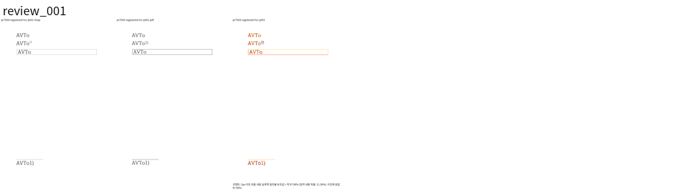
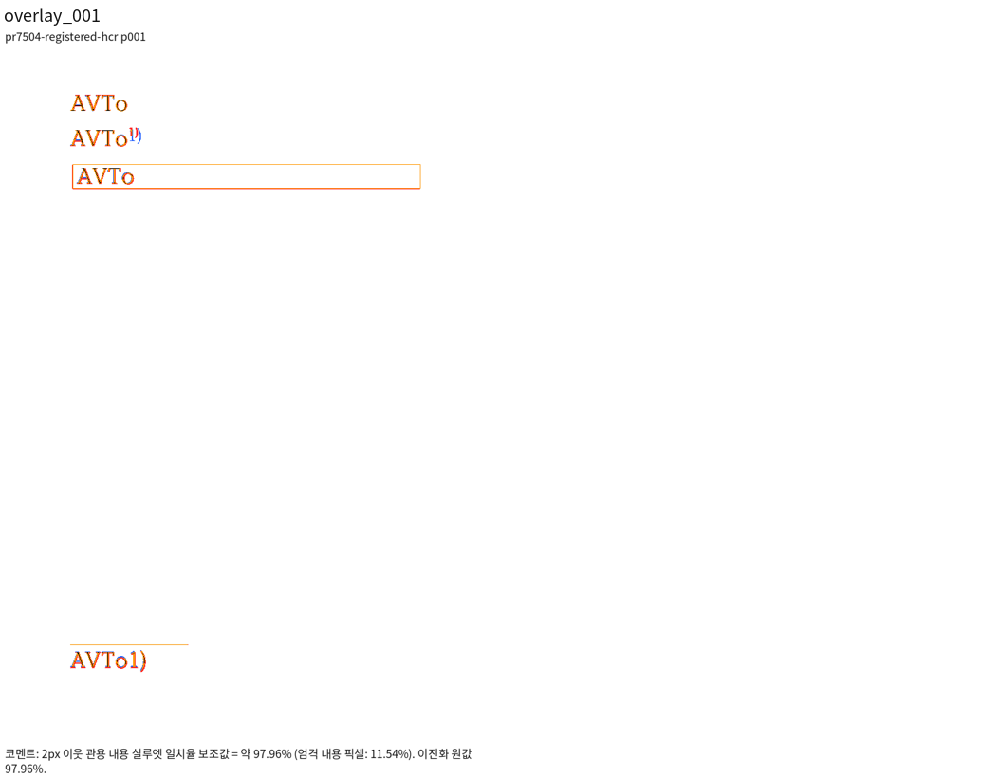
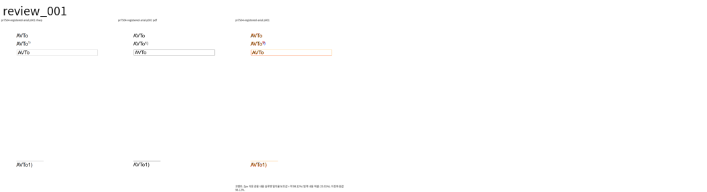
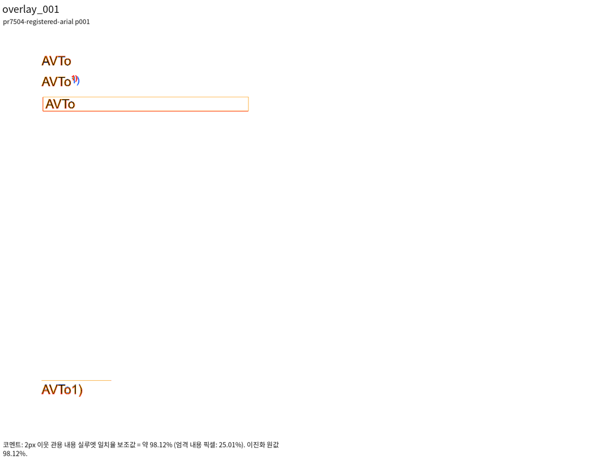

# PR #7504 리뷰 — 수정: #7503 커닝한 글자를 커닝 전 폭으로 그리고, 셀 캐럿과 입력 비용을 바로잡는다

## 최종 판정

**통합 후보 검토 충족 — code candidate CI 성공, 동일 PR 후행 기록의 최신 aggregate 확인 후 통합.** 전용 HJCT의 일반 SFNT pair 계약은 미검증이며 #7503은 유지한다. 원 head 자체의 approve/merge와 구분하며, 누적 source8569f49ce와 통합 [PR #7601](https://github.com/edwardkim/rhwp/pull/7601)의 code candidate774fe4071 최신 원격 CI가 성공했다. 후행 기록 head의 aggregate와 merge 가능 상태까지 확인한 뒤 통합한다.

## 접수 정보

- 원 PR: [#7504](https://github.com/edwardkim/rhwp/pull/7504), semanticist21, devel 대상, non-draft.
- 원 head: `7dc340284bd84e2ee475da3b577146005b989500`; 접수 시점 `MERGEABLE` / `CLEAN`. 원 head의 상태이며 누적 후보 판정이 아니다.
- 누적 branch: `review/semanticist21-20261005`; 고정 base `cdba77b609c399fdef26a6c9e637716aa32c2177`; 누적 code candidate `1d809afe7b965c9ea6137012d59d139d63b038d0`.
- Reviewer: jangster77 지정. 기본 maintainer_general; intake_and_review, local_validation, multi_pr_update_branch, 렌더 영향 시 visual_fixture_evidence를 적용.
- 관련 이슈: #7503.
- 사용자 지시: non-draft 19건을 번호 순으로 누적 체리픽; 충돌은 메인터너 보정; 원 PR별 리뷰 기록을 개별 작성.

## 적용 이력

| 원 commit SHA | 상태 | 로컬 적용 SHA | 메인터너 보정 |
| --- | --- | --- | --- |
| `38ce705edd33c656faf7f5831a19ed8da3864370` | applied | `993f4bc14af375c8abd59d902ace954c775d39d8` | — |
| `8345ad79ab4334198ae195b417ef53c09bd09e54` | applied | `00c42120cc779e9f2855346ec5c3593cdccb763f` | — |
| `71fd3348ffb2125176cbf9ac8b7e38243f6cc285` | applied | `bcc5efc1142f65d9d712cf31654d803561b2e4d2` | — |
| `e9f38a16b24c59151c2f721a02172f9329b86675` | applied | `279607f753e44d9c0cc7fae12540d1a279f02558` | — |
| `7dc340284bd84e2ee475da3b577146005b989500` | applied | `d66a26cdcb09a58b9b341cd8f0b5b8166519749b` | — |

원 저자와 `cherry-pick -x` 출처를 보존했다. 이미 patch-id가 같은 원 commit은 중복 적용하지 않았다. 원 contributor branch는 수정하지 않았다.

## 변경·소비 경로 검토

- `src/document_core/commands/text_editing.rs`
- `src/renderer/kerning.rs`
- `src/renderer/mod.rs`
- `src/renderer/svg.rs`
- `src/renderer/web_canvas.rs`

ExactFontSourceRegistry의 불변 Arc와 등록 hash → kerning source session → layout 위치. SVG textLength와 Canvas scaleX는 glyph_fit_positions의 커닝 전 advance를 소비하고 글자 원점은 커닝 후 위치를 사용한다. 등록 글꼴 셀의 입력 직후 캐럿은 exact query로 폴백한다.

등록 TTF의 AV/To 독립 메트릭과 실제 FontFace 등록 출력이 필요하다. 등록하지 않은 CLI 렌더로 이 경로를 대체할 수 없다. 합성 입력의 계약 결과를 한컴 출력과의 일치 증거로 바꾸지 않는다.

## 검증 입력·결과

- `tests/cases/issue_7503_kerning_glyph_caret_cost.rs` (5개 테스트): 누적 head 실행 5 PASS / 0 FAIL

- 로컬 Cargo는 공유 `target/pr-review`에서 순차 실행한다. 같은 원 head의 CI를 19건 누적 후보의 전체 검증으로 재사용하지 않는다.
- 필수 fmt·Native/WASM/workspace-all-targets Clippy·workspace build·manifest/base 정책·source unit tier 검사: PASS. 전체 Rust·Native Skia·fresh WASM 및 직접 시각 검증은 진행 중.
- focused: `output/pr-review/semanticist21-20261005/run-records/focused-command.json`의 20 case 필터, 전체 74건 중 73 PASS / 1 FAIL. PR별 결과는 위 case 항목에서 구분한다. 실행 증거: `output/pr-review/semanticist21-20261005/logs/focused.log`.
- 실제 HWP/HWPX/PDF 입력과 commit의 해시, 독립 기준, source/build provenance: 입력 사용 시 기록한다.
- source 교정 또는 검사 실패가 생기면 이 PR의 보정과 재실행을 별도로 기록한다. Golden/baseline/래칫을 완화하지 않는다.

## 원 head CI 참고값

- Lint (fmt, clippy, WASM check): SUCCESS
- Build & Test: SUCCESS
- CI Impact Policy: SUCCESS

## 조판·시각 판정

적용 여부와 필요한 직접 증거를 확인 중이다. 원 PR 제공 before/after·수치를 누적 head의 Visual Sweep 통과로 간주하지 않는다. 자료 부족과 실제 회귀를 구분하여 미검증/미충족으로 판정한다.

## 남은 범위·후속 처리

원 PR 전체 해결 여부와 이슈 종료 표현은 직접 검증한 범위로 제한한다. 이 기록은 로컬 누적 검토이며 원격 approve/comment/merge를 의미하지 않는다. 통합 결과는 같은 누적 branch에 두고 원 PR별 판정이 확정된 뒤 게시 범위를 결정한다.

## fresh WASM 실제 등록 글꼴/Canvas 경로

fresh web package `rhwp_bg.wasm` SHA-256 `5c66e27f13dc1699a18aabcc1397c530e1bec05f2567b5a0414e9dabe714dd06`를 Chromium에서 실행했다. 새 문서 26pt `AVTo`, 저장소 TTF를 실제 FontFace로 올리고 charShapeId의 영문 slot 1에 registerExactFontSource를 호출했다. 2x Canvas fillText의 A/V/T/o 가로 배율은 각각 등록 전후 동일하다. V 원점 차이는 `-5.546661px / 2 = -2.77333px`, o는 누적 `-8.319977px / 2 = -4.15999px`로 TTF의 AV -80·To -40 / 1000 em, 26pt 기대값과 일치한다. 글리프 폭을 압축하지 않고 원점만 커닝하는 계약을 실제 renderer 호출에서 확인했다. 실행 로그 `output/pr-review/semanticist21-20261005/logs/kerning-browser.log`·`output/pr-review/semanticist21-20261005/historical-browser-raw/kerning-results.json`. 동일 글꼴 조건의 한컴 PDF는 확보하지 않았으며 한컴 fidelity 판정과 구분한다.

## 최종 공통 회귀 결과 (폼 source cf2336295)

Rust source `cf2336295540ea8ce3e94eb6517cb406fca8d28f`, 정책 base `cdba77b609c399fdef26a6c9e637716aa32c2177`에서 fmt·Clippy Native/WASM/workspace-all-targets·workspace build·manifest/unit tier 정책 PASS. 전체 nextest10,437건 중10,436 PASS/1 FAIL/50 SKIP이며 실패는 #7491의 편집 뒤 표 우변 assertion1건이다. 이 실패는 고정 base에서도 관측했다. Native Skia lib·missing picture2개·direct PDF4개·ComboBox4개·암호4개는 모두 PASS다. 명령/exit/시간은 검증 정본 (`output/pr-review/semanticist21-20261005/run-records/appearance-final-validation.json`), 요약과 원 로그 SHA는 실행 요약 (`output/pr-review/semanticist21-20261005/run-records/appearance-final-validation-summary.txt`)에 보존했다.

#7491은 사용자가 지정한 실패 입력에서 MCP 재산출 PDF·90% 시각 gate와 독립 기대값을 추가 검증 중이며, #7521의 loose inline 길이 제한 우회도 보류 사유로 남는다. 전체 회귀 통과 또는 통합 merge를 선언하지 않는다. 이후 Rust source/test 변경에는 이 결과를 그대로 승계하지 않고 해당 검증을 다시 수행한다.

## upstream/devel 위 rebase 적용 위치 — 2026-10-05

기준 `c167dc6abbebf69546575e2d16d06223791bab82`. 아래는 현재 이력의 실제 적용 위치이며 위의 이전 검증 SHA는 당시 이력으로 보존한다.

| 원 commit SHA | rebase 전 로컬 SHA | 현재 적용 SHA | 상태 |
| --- | --- | --- | --- |
| `38ce705edd33c656faf7f5831a19ed8da3864370` | `993f4bc14af375c8abd59d902ace954c775d39d8` | `7be49957acb3c28e30f33e695f9fd981aec0d7fb` | rebased |
| `8345ad79ab4334198ae195b417ef53c09bd09e54` | `00c42120cc779e9f2855346ec5c3593cdccb763f` | `f8402d2b5732250ee9db9f9b14ef407410f339c4` | rebased |
| `71fd3348ffb2125176cbf9ac8b7e38243f6cc285` | `bcc5efc1142f65d9d712cf31654d803561b2e4d2` | `73eca5df2c9196bf1f3782ab23d3f519475b5bb4` | rebased |
| `e9f38a16b24c59151c2f721a02172f9329b86675` | `279607f753e44d9c0cc7fae12540d1a279f02558` | `7df834ac5a584350934b6368499a146076addd56` | rebased |
| `7dc340284bd84e2ee475da3b577146005b989500` | `d66a26cdcb09a58b9b341cd8f0b5b8166519749b` | `4cdf97adcdbdb0fa987ab5b08efdf52cfdf978cf` | rebased |

원 저자와 cherry-pick 출처를 유지했다. #7491의 원4개는 #7599를 통해 이미 base에 포함되어 중복 적용하지 않았다. 메인터너 보정과 개별 리뷰 기록은 재배치했다. 최종 후보의 시각·전체 회귀 및 CI는 별도 확인한다.

## 메인터너 재검토: 실제 등록 글꼴의 한컴 커닝 계약 — 2026-10-06

source `693b63b26`에서 실제 시스템 글꼴 bytes를 charShape의 영문 slot 1에 등록했다. 동일 입력을 한컴2020 MCP Print(method0/one-up,11.0.0.9136)로 출력한 결과는 아래와 같다. 원본 글꼴 bytes·TSV·진단 JSON은 ignored output에 보존하고 글꼴 파일은 Git에 넣지 않는다.

- 함초롬바탕: job `e619a8ce-c03d-46f1-9815-31a67df679c4`, 입력 SHA `193c88808e14c0f2dd0125a59f0820f2a535ebb63fb07d46c25ce3a5a00464c8`, PDF SHA `6132393ee4bee6c2805f172b82e6af2cafdb4beac5932aec13698894694caa0a`, Native **82.34445%**. 같은 이름이라는 추정 대신 PDF subset의 A/V/T/o/1/) 외곽 좌표와 hmtx advance를 source TTF와 대조해 모두 같은 글리프임을 확인했다(`registered-hcr-pdf-glyph-identity.json`). 실제 글꼴이 다르다는 예외를 사용하지 않는다.
- 한컴 PDF는 AV/To를 기본 advance로 출력하지만, 등록 source의 GPOS/kern을 적용한 rhwp는 각 쌍을 -90/1000 em 줄인다. 함초롬바탕의 `use_font_space`를 켠 별도 Print도 같은 차이·82.34445%다(job `940099c5-f354-45b2-bac7-687b53e7b538`). 보이는 글·표 외곽·본문 소속이 같은 직접 review/overlay에서 간격 차이를 판독했다.
- Arial 정상 대조군: job `9a399f41-83ca-49f9-8328-d2cb5cb5c6e0`, 입력 SHA `cb41e057d776d0f264f187de29fe72579389c15473c6b3bcbb5920e368520c34`, PDF SHA `cbc901b068ece0cea0d9492f4c1f401f1a21f422d4f2f6dca1f39e7cca5aea2b`, Native **98.11853%**. 한컴이 실제 적용한 커닝과 등록 source가 일치한다. [한컴 공식 도움말](https://help.hancom.com/hoffice/multi/ko_kr/show/format/font_properties.htm)은 지원 영문 글꼴의 커닝과 Arial 예시를 설명한다.

이 관측은 `HJCT`의 내부 의미나 모든 한컴 전용 글꼴의 커닝 규칙을 해독했다는 증거가 아니다. **exact bytes와 GPOS/kern 존재만으로 한컴에서도 같은 pair 계약이라고 판단한 가정**을 제거한다. 한컴 전용 `HJCT`가 있는 source는 일반 SFNT pair 계약이 아직 검증되지 않은 capability로 분류하고 기존 기본 위치로 닫는다. 명시적 `hancom-font-pair-contract-unverified` trace를 남기며 요청 속성·source hash를 바꾸지 않는다. 검증된 일반 SFNT/Arial 경로는 계속 커닝한다. 이 보수적 지원 경계의 한컴 일치는 같은 원본 HCR Print와 Arial 대조군의 Native/fresh WASM으로 확인한다. 지원되지 않은 전용 규칙은 완전 구현으로 보고하지 않는다.

실제 소비 경로는 `inspect_verified_exact_font_kerning` → source session의 capability → `decide_kerning_run_gate` → 기존 positions 유지 → SVG/Canvas의 glyph_fit_positions다. 등록 자체는 유지하고, capability를 측정·paint에서 따로 추측하지 않는다. 새 회귀는 보정 후 Native/fresh WASM이90% 이상일 때 추가한다.

### 보정 후 실제 등록 source 검증

동일 font bytes를 Native SVG와 실제 WASM Canvas 및 별도 SVG 래스터 브라우저에 공급했다. 위치·폭은 실제 renderer 출력을 유지하고 `@font-face`의 공급원만 등록 source로 고정했다. Arial의 시스템 선택 경로(`Install/arial.ttf`)와 등록 source(`525979822591...`)가 달라, local family fallback만으로 exact source 일치를 주장하지 않았다.

| 원본·2020 Print | Native | fresh WASM | 직접 판독 |
| --- | ---: | ---: | --- |
| 함초롬바탕 본문·셀·머리말·각주 |97.96159%|97.96159%|4개 영역의 AV/To 간격·표 외곽·각주 소속 일치|
| Arial 정상 대조군 |98.11853%|98.11853%|일반 SFNT pair 커닝 유지|
| 함초롬바탕 use_font_space 대조군 |97.96159%|97.96159%|같은 기본 위치 보존|

세 입력 모두 한쪽, 누락 없음/gate passed, font exception 미사용. 실제 Canvas의 19회 fillText에서 함초롬바탕 등록 전후 원점/scale 동일, Arial은 V/o 원점 이동과 모든 glyph scale 보존을 확인했다. `x/y`만 기록했던 이전 진단과 달리 transform의 e/f까지 대조했다.

위 Native/fresh WASM 선행 검증 후 `unverified_dedicated_font_preserves_rendered_positions_and_widths`를 추가했다. GPOS·glyph·advance는 보존하고 합성 SFNT의 선택 name 디렉터리만 전용 table 항목으로 바꿔, DocCore의 본문·셀·머리말·각주 최종 SVG 원점/자연 폭이 기본 배치를 유지하는지 검사한다. source693 라이브러리에서 실제 assertion FAIL(exit101), 보정 라이브러리에서 PASS. 이 합성 지원 계약을 실제 한컴 font 내부 규칙의 해독으로 보고하지 않는다. 첫 직접 rustc 시도는 sha2 extern 누락으로 빌드 실패했고 결함 검출에 세지 않았다. 필요한 extern을 지정한 재실행의 실제 실패만 before 증거다.

[원본·Native/WASM review·overlay·공개 API 재현기](../assets/semanticist21-20261005/pr7504/)와 [2020 Print PDF](../../../pdf/semanticist21-20261005/pr7504/mcp/)를 보존한다. 글꼴 source SHA·Canvas 원문·TSV·직접 테스트 로그는 ignored `output/pr-review/semanticist21-20261005/font-contract-*`에 유지한다. 후속 #7527 저장 경계 보정이 포함된 최종 pkg에서 재캡처하고 최종 lint·전체 회귀·CI를 확인한 뒤 누적 판정을 확정한다.

## 2026-10-06 최종 후보의 Print·Native/fresh WASM 재검증

정책 base `c167dc6abbebf69546575e2d16d06223791bab82`, production source `2b1f21ef1ab35a13ebcae11f562a3ebf3a998e4d`, 회귀 source `9af7586586587fa0aa617a9e57fd6acd0d4e3ba6`. 두 head 사이에는 #7527의 Native 전용 회귀와 리뷰/PNG만 추가됐고 production source는 동일하다. 최종 fresh WASM SHA-256 `24565cae976b3c6929c858f13c52785a4651a26dc61c0fd566f5a8f801d631f7`, JS `70cde06a369fa7fd4fc8bc8f3d6acaee158596ba1a116a2c72159002b0b5654e`; root pkg/Studio public 해시를 대조했다.

| 검증 입력 | 출력 경로 | 전체 쪽별 실루엣(%) | Gate |
| --- | --- | --- | --- |
| `pr7504-registered-hcr` | native | p1 97.96159 | passed / 누락0 |
| `pr7504-registered-arial` | native | p1 98.11853 | passed / 누락0 |
| `pr7504-registered-hcr-fontspace` | native | p1 97.96159 | passed / 누락0 |
| `pr7504-registered-hcr` | wasm | p1 97.96159 | passed / 누락0 |
| `pr7504-registered-arial` | wasm | p1 98.11853 | passed / 누락0 |
| `pr7504-registered-hcr-fontspace` | wasm | p1 97.96159 | passed / 누락0 |

실제 동일 TTF 바이트를 Native 등록·SVG font source·WASM exact-font API·Canvas FontFace에 공급한 3개 입력의 재캡처다. Arial의 시스템 alias가 다른 파일을 선택할 수 있으므로 가족 이름만으로 source 동일성을 판정하지 않았다. Font mismatch exception은 사용하지 않았다.

각 명령·TSV·manifest·runtime 원시는 ignored `output/pr-review/semanticist21-20261005`에 보존했다. 렌더는 같은 입력/Print 전체 페이지와 `--embed-fonts=full`을 사용했고 WASM은 `--wasm-pkg pkg`를 추가했다(#7504는 실제 등록 API replay adapter). 최종 전체 Rust 회귀와 GitHub CI는 별도 진행 중이다.

최종 페이지별 TSV: `output/pr-review/semanticist21-20261005/final-tsv/native/<key>/silhouette.tsv` 및 `wasm/<key>/silhouette.tsv`. 최신 full Sweep PNG 쌍에서 canonical `--silhouette-only --png-pair`로 산출하고 PNG SHA를 manifest에 고정했다. 해당 입력 전체 쪽수도 독립 PDF·원문 exporter에서 별도로 대조했으며 90% 미만/누락0이다.

## Merge 후 contributor PR comment 계획

원 기여에 감사한 뒤 실제 통합 PR 링크·merge SHA·정확한 최종 head CI와 이 PR의 회귀 실행 결과를 한국어 존댓말로 게시한다. 원 head는 merge 직전에 다시 확인하고 동일할 때만 통합으로 대체된 원 PR을 닫는다. 원 contributor fork branch는 삭제하지 않는다.

실제 HCR 동일 glyph/기본 위치 계약과 Arial 커닝 대조군을 구분하고 HJCT pair 계약 미검증 제한을 설명한다.

- 실제 비교 `pr7504-registered-hcr`의 p1 97.96159%를 페이지별 실루엣 보조값으로 적는다. 같은 입력 Native/fresh WASM 전체 쪽 TSV·누락0·직접 구조 판정을 함께 설명한다.
- merge SHA에서 존재를 확인한 `mydocs/pr/assets/semanticist21-20261005/pr7504/registered-hcr-wasm-review-p1.png` / `mydocs/pr/assets/semanticist21-20261005/pr7504/registered-hcr-wasm-overlay-p1.png`를 `raw.githubusercontent.com/edwardkim/rhwp/<merge-SHA>/...`의 실제 Markdown 이미지로 표시한다. 임시 output 링크로 대신하지 않는다.
- 이슈는 확인된 해결 범위만 다루고, 남은 조판·입력 축은 `Refs`와 원 이슈 링크로 유지한다. 게시 뒤 API로 실제 줄바꿈·한글·이미지 URL을 다시 확인한다.

### 입증된 원점 보정 후 Native 전체 검증

Production `0a305d51a898cedbe2af75e65726aee463b2b197`의 Native30항목·37쪽 대응 모두90% 이상(최저91.96451%), 미달/누락0이다. canonical TSV `output/pr-review/semanticist21-20261005/proven-origin-tsv/native/<key>/silhouette.tsv`와 full gate를 대조했다. 등록 Arial98.11853%, 함초롬97.96159%, use_font_space97.96159%; 원본 입력·Print PDF·실제 등록 TTF 바이트는 유지했다. 표 외곽/셀 내용·머리말·각주 위치를 같은 쪽 review PNG에서 직접 확인했다.

기존 저장/분할 및 #7491/#7571 관계 검사16 PASS, 글자 겹침partition13 PASS(신규 겹침0). `hwpspec.hwp` 16·17·21쪽 render tree는 기존 정상 `5d4e47845`와 바이트 동일함을 확인했고 중간 trial의6건을 승인하지 않았다. 정상 대조군을 낮춘 baseline 변경은 없다. 별도의 같은 프레임 저장 앵커 비율 검사는 수정 전1.6 ≠ 독립 저장/Print 관계1.708846153846154로 FAIL(exit101), 수정 후1 PASS다. 아직 ignored 진단이며 fresh WASM 같은 원문/Print의90% 선행 조건 뒤에 정식으로 추가한다.

fresh WASM과 최종 전체 lint·회귀·GitHub CI는 진행 중이므로 이 Native 결과만으로 누적 후보를 승인/merge하지 않는다.

## 최종 production 전쪽 재검증 — 2026-10-06

Production·검증 source `8569f49ce051ee343d58866a4f1e20a642d9e7fa`, 정책 base `c167dc6abbebf69546575e2d16d06223791bab82`를 검증했다. fresh WASM SHA-256 `410f8f3540f2856fcd7200a115f191a87aed4b2e726267bc54d960b35948735a`, JS `70cde06a369fa7fd4fc8bc8f3d6acaee158596ba1a116a2c72159002b0b5654e`; root `pkg`와 Studio public의 실제 바이트가 같다. Native binary SHA-256 `d4ff621918e81070809efe96555f9e484905f12c20d77f9a78f81ce4095fbe46`. 아래 결과는 원점 리셋 보정까지 포함한 최신 source의 재출력이다.

Native/fresh WASM 각각30항목·37쪽(합계74쪽 대응) 최신 재출력, 최저91.96451%, 90% 미만/누락/측정 불가/글꼴 예외0이다. canonical TSV: ignored `output/pr-review/semanticist21-20261005/ladder-reset-tsv/<native|wasm>/<key>/silhouette.tsv`. 입력·Print 출처와 직접 판독은 위 개별 증거를 따르며, [공통 렌더/TSV 명령·재출력 검증](../assets/semanticist21-20261005/README.md#문단-원점-리셋-보정의-최종-nativefresh-wasm-검증)에 연결한다. 전체 Rust 및 원격 CI 완료 여부는 다음 최종 판정에서 별도로 기록한다.

| 이 PR의 검증 입력 | 경로 | 독립 Print 전체 쪽 실루엣(%) | 판정 |
| --- | --- | --- | --- |
| `pr7504-registered-arial` | native | p1 98.11853 | passed / 누락0 |
| `pr7504-registered-hcr` | native | p1 97.96159 | passed / 누락0 |
| `pr7504-registered-hcr-fontspace` | native | p1 97.96159 | passed / 누락0 |
| `pr7504-registered-arial` | wasm | p1 98.11853 | passed / 누락0 |
| `pr7504-registered-hcr` | wasm | p1 97.96159 | passed / 누락0 |
| `pr7504-registered-hcr-fontspace` | wasm | p1 97.96159 | passed / 누락0 |

- 최신 source의 실제 브라우저3종 PASS(화면/질의/폼), source registry·fmt·Native/WASM/workspace-all-targets Clippy·workspace build·base manifest/unit-tier 정책 PASS. Native 선행33건 및 Cargo 집중32건은 각각 모두 PASS이며 최종 전체 nextest/Native Skia 결과는 다음 판정에 기록한다. 원시 로그·중간 JSON·TSV는 ignored `output/pr-review/semanticist21-20261005`에 보존한다.

## 최종 로컬 게이트 — production8569f49ce

정책 base `c167dc6abbebf69546575e2d16d06223791bab82`, 검증 source `8569f49ce051ee343d58866a4f1e20a642d9e7fa`. fmt·Native/WASM32/workspace-all-targets Clippy `-D warnings`·workspace build·manifest 및 source unit tier `--check --base-ref <base>` 모두PASS다. 파생 suite를 준비한 동일 review checkout의 `target/pr-review`에서 Cargo를 순차 실행했다.

- 전체 `cargo nextest run --locked --cargo-profile release-test --target-dir target/pr-review --tests --test-threads 12 --no-fail-fast`:10,491 PASS/0 FAIL/50 SKIP,706.118초, exit0.
- Native 선행33/ Cargo 집중32 모두PASS; 겹침16 partition 전체를 포함한다. 기존 fixture/baseline/래칫을 완화하지 않았다.
- Native Skia lib·missing picture·direct PDF·ComboBox·password 모두PASS. optional backend 검사를 원 head CI 또는 SVG 점수로 대신하지 않았다.
- fresh WASM/Studio 동기화·실제 화면/질의/폼3종·최신 Native/fresh WASM74쪽 대응/TSV 모두PASS(최저91.96451%, 미달/누락/측정 불가0, font exception0).

실제 명령·exit·시간은 ignored `output/pr-review/semanticist21-20261005/oct06-ladder-reset-validation-progress.json`, 원 출력은 `logs/oct06-ladder-reset-*.log`에만 보존한다. 각 단계의 마지막 summary는 아래 공통 증거 README에 기록한다. source가 바뀌면 이 실행 결과를 그대로 승계하지 않는다. 원 PR의 별도 CI와 누적 후보의 최신 원격 CI를 구분하며 통합 PR의 최종 head CI를 확인한 뒤 merge한다.

## 통합 PR #7601 code candidate CI와 후행 기록

[통합 PR #7601](https://github.com/edwardkim/rhwp/pull/7601), code candidate `774fe407160598bd029cbb13a3545ee30ca057df`의 [최신 head CI](https://github.com/edwardkim/rhwp/pull/7601/checks)가 모두 종료되어 성공/정상 생략을 확인했다. 정확한 run URL·결론은 [공통 CI 증거](../assets/semanticist21-20261005/README.md#통합-pr-7601-code-candidate-ci)에 기록했다. 원 PR의 별도 CI를 이 결과로 바꾸지 않는다.

Production source `8569f49ce051ee343d58866a4f1e20a642d9e7fa`의 최종 전체 nextest 로그에서 이 PR의 실제 검사 결과를 확인했다. 아래 PASS는 같은 source의 전체 실행이며 이전 원 PR의 보고를 승계한 값이 아니다.

| 원본 검사 | 실제 PASS | FAIL |
| --- | --- | --- |
| `tests/cases/issue_7503_kerning_glyph_caret_cost.rs` | 6 | 0 |

이 commit은 개별 archive 기록·오늘할일·CI 증거만 보완한다. Rust source/tests와 fresh WASM은 위 검증 source와 같으며, 같은 PR의 후행 head 최신 aggregate를 확인한 뒤 일반 merge commit으로 통합한다. merge 뒤 확정되는 SHA·이슈 상태·원 PR별 코멘트는 GitHub 후속 기록으로 남긴다. 위 접수·중간 실패·진행 중 문구는 당시 source의 역사 기록이며 이 절의 최신 판정과 구분한다.
