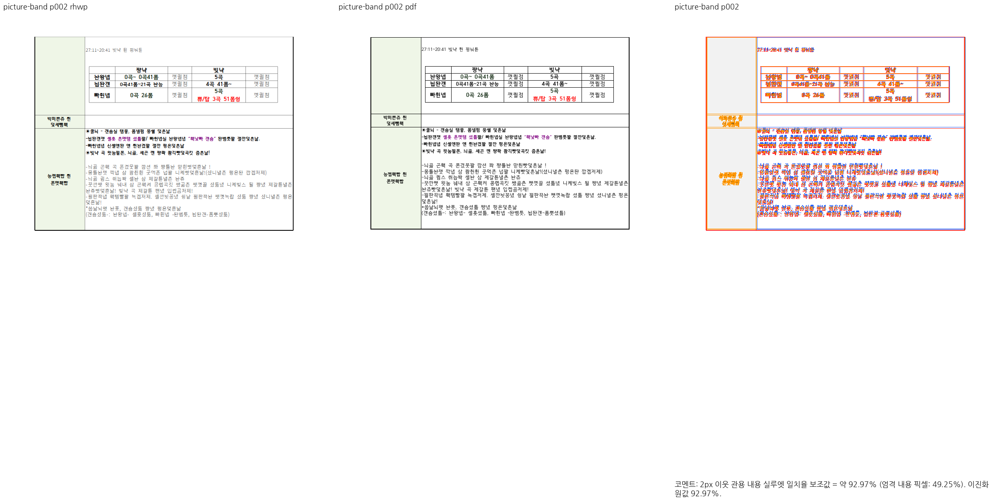
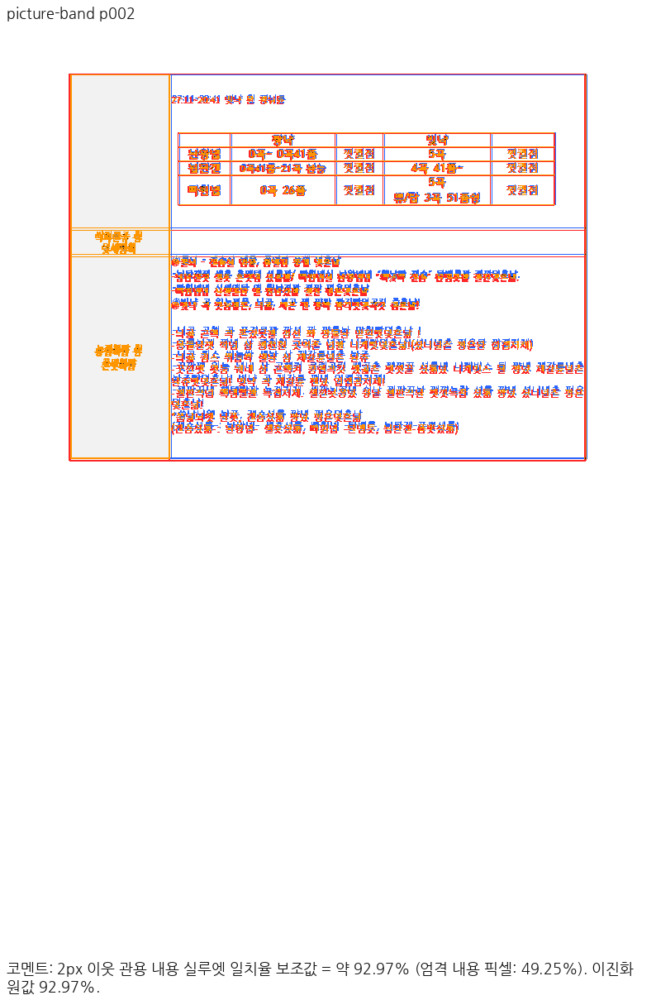
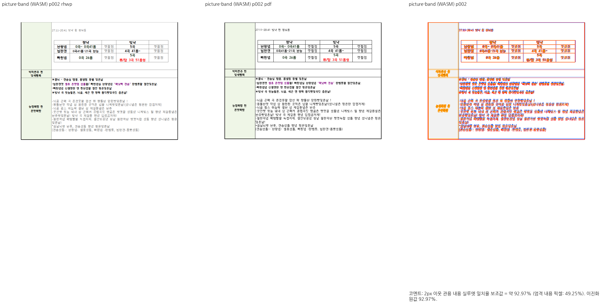
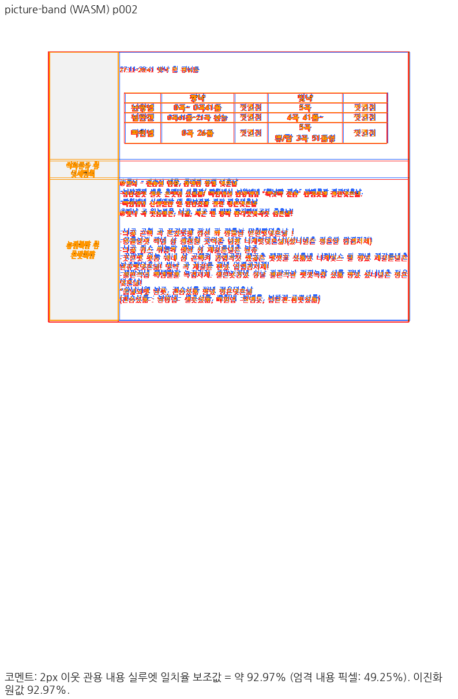
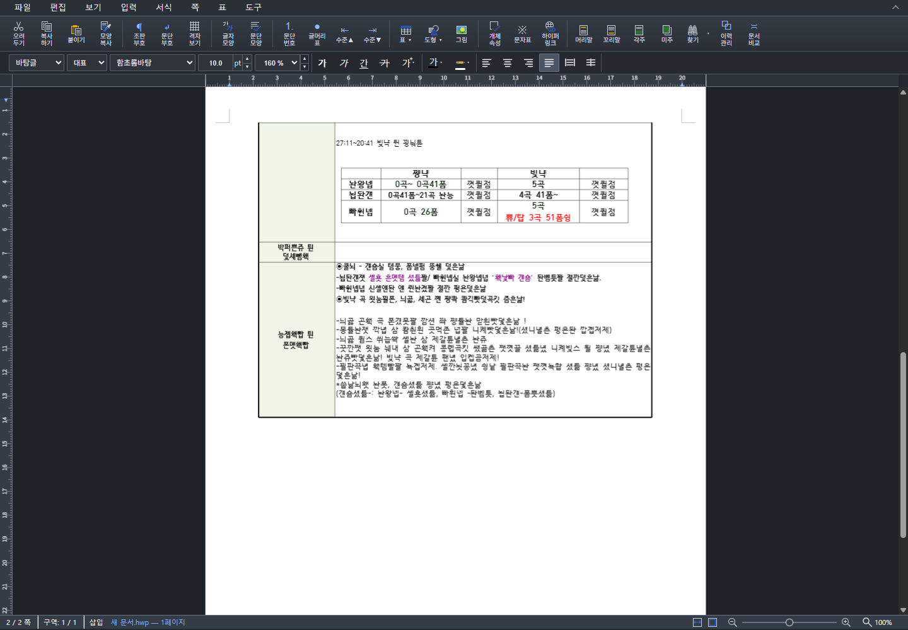
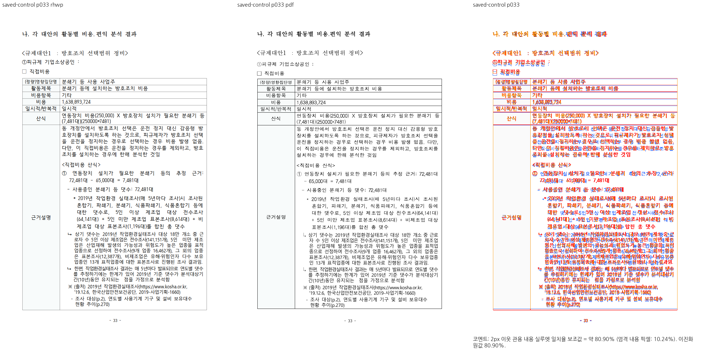
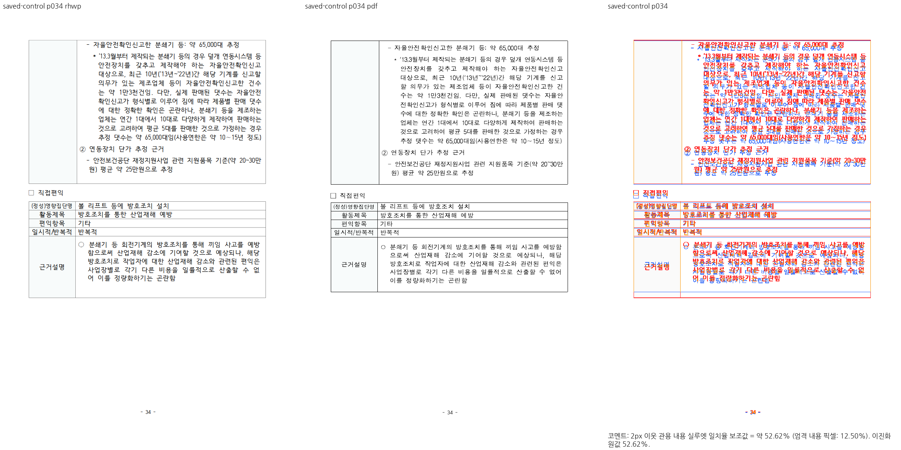
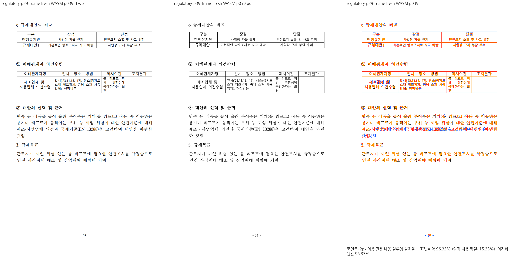

# PR #7518 리뷰 — 끝 공백 처리와 그림 띠 셀의 이어받기 보정

## 최종 판정

### 최신 검증 결과 — 2026-10-05

메인터너 통합 PR [#7570](https://github.com/edwardkim/rhwp/pull/7570)의 source
`1871ba72a7b3c2dbd84d354343fdf20d6a1bc387` / base `df7d0076ad01a36c8fa1a0226727653904b67dd9`에서 이전 공개 CI·분할 실패와 후속 전체 검사
실패를 처리했다. 최신#7518 검사는23 PASS /0 FAIL, 전체10,353 PASS /0 FAIL /
기존50 skipped다. 세 Clippy·정책 검사·workspace build·fresh WASM·Native Skia까지
순차19단계가 통과했고 CDP103/103도 PASS다.

주요55페이지씩의 Native/fresh WASM 대조 최저86.45382%에 이번 사용자의85%
수용 기준을 적용한다. 자동90% raw gate와 잔차는 그대로 보존한다.
[실제 호출 경로·최종 검사와 범위](pr_7518_review_impl.md#실패-전수-처리와-최종-검증--1871ba72a-2026-10-05),
[SHA/명령/독립 glyph·수정 전후·PNG manifest](../assets/pr7518_recursive_fragment_fix_20261005/validation.json)에 연결한다.

원본 NO_LS의 본문/후속 빈 줄 계약은 통과하지만 별도80168 HWPX의 전체 PDF 일치는
미검증이다. p102의 기존 넘침은13.44→20.9867px로 증가한 차이를 공개하며,
기준 PDF 대응과p137/138의 조판 잔차를 완료 주장에 포함하지 않는다.
공식 spec 전체71쪽 일치와 특수 caption/footnote/rowspan 개선도 미검증이다.
공개 code candidate `2d3ddade935f25e56bad404a5dd1d8f113c34b39`의 Full CI·CodeQL·Render Diff·Adapter·Proptest·CI Impact Policy와 필수 Build & Test가 모두 성공했다. tested merge/tree와 종전 실패 검사의 실제 PASS를 [공개 Full CI 증적](../assets/pr7518_recursive_fragment_fix_20261005/ci_candidate_2d3ddade9.json)에 보존했다. 후행 기록의 최신 head CI를 재확인하며 merge 완료를 뜻하지 않는다.

## 이전 판정 기록

아래 source와 실행 결과는 각 당시 기록이다. 최신 source의 통과 증거로 대체하지 않는다.

2026-10-05 추가 보정 source `2869859ee38461645235978f6c05604013c05430`에서
39쪽 제목·빈 문단·표의 겹침 및 제시의견 셀의 안여백/줄바꿈을 수정했다.
Native/fresh WASM2px 관용 실루엣은96.33024%, PNG 동일, CDP10/10 및
새 실제 좌표 회귀3개 수정 전 FAIL/수정 후 PASS를 확인했다. 사용자가22·38쪽을
해결로 판정했고, 2026-10-05에는 “39쪽 시각 판정 통과입니다.”라고 승인했다.
이 판정은 해당 source의 76076 문서 39쪽에 적용하며 전체 PR 검증 완료로 확대하지 않는다.
같은 source로 새로 내보낸 33쪽도 2026-10-05 사용자 시각 판정 통과다.
2px 관용 실루엣 85.78689%에 대해 “85% 이상이면 통과로 처리합니다.”라는
이번 검토의 수용 기준을 적용했다. [33쪽 판정과 증적](pr_7518_review_impl.md#33쪽-사용자-시각-판정--2026-10-05)에 연결한다.
2026-10-05 기대값 재검토에서 분할 검사 1개와 33쪽 좌표 검사의 잘못된 조건을 교정했다.
같은 renderer에서 7518은 18 PASS / 3 FAIL, 2308은 5 PASS / 0 FAIL / 1 기존 ignored다.
남은 3개는 실제 페이지 소속·마지막 내용의 차이가 확인돼 조건을 완화하지 않았다.
[검사 조건 재검토](pr_7518_review_impl.md#실패한-검사-조건의-재검토--2026-10-05)에 근거를 연결한다.
상세 source/호출 경로·원인·이전 회차 실패 증적은 [최신 구현 기록](pr_7518_review_impl.md)과
[검증 manifest](../assets/pr7518_p39_wrapper_flow_20261005/validation.json)에 연결한다.

**메인터너 보정 후 수용 가능.** 2026-10-04 사용자는 이번 76076 비교 결과를
“85% 수준에서 픽셀 일치시키는 수준이면 조판 허용치로는 수용”하며 “시각 판정 통과로 진행”하도록 지시했다.
이 명시 판정을 현재 검토 source의 33·34쪽 수용 근거로 적용한다.
최신 devel `731de9e1b` 통합은 완료했다. 남은 정식 대조 검사·필수 제출 검증은 계속 수행한다.
720ebcd60의 결과와 미검증 범위는 과거 검증 기록이며 이후 코드의 통과 증거로 재사용하지 않는다.

이전 통합 source `3d23545846942137256bc95afbdd8c6390fade42`의 `nested-split` 전체 1–6쪽은
사용자가 직접 비교 PNG를 판독하고 페이지 분리가 한컴과 거의 동일하다고 수용했다.
이 샘플의 페이지 분리는 해결 범위로 기록한다. 실제 대조 출력과 판정 범위는
[전쪽 판독 기록](pr_7518_review_impl.md#사용자-전쪽-판독--nested-split-페이지-분리-수용)에 연결한다.
다른 대조군·focused 검사 실패·필수 제출 검증은 남아 있으며 이 판정으로 전체 PR 통과를 선언하지 않는다.

원점 보정 source `3d9239eeec32fc60ee188c3f3bc0d9ec5094ec3a`는 사용자가 지정한 76076 문서
33쪽의 빈 재조판 host 표에서 예약한 바깥 위 여백이 실제 원점에 빠지는 문제를 보정한다.
Native에서 두 작은 표의 글자 baseline 오차는 7.64/7.69px에서 0.09/0.15px로 줄었다.
큰 표의 시작 괘선도 PDF 240.217px / Native 240.4px로 가까워졌다.
같은 코드에서 nested-split 6쪽의 배치 트리는 승인본과 동일하며 1–4쪽을 새로 PNG로 비교했다.
76076 Native/fresh WASM p33/p34의 2px 관용 실루엣은 85.07562%/84.06333%다.
자동 gate의 `re_review_required`와 원 측정값은 보존하고, 사용자 직접 판독의 시각 통과를 별도로 기록한다.
전역 임계값이나 golden/래칫을 변경하지 않는다. 상세 원점·소비 경로와 증적은
[이번 보정 기록](pr_7518_review_impl.md#76076-빈-host-표-원점-보정--3d9239eee)에 연결한다.

현재 통합 code `d76cd8075c5e98f10da1b48f3af72155d9f3d40d`의 새 Native/fresh WASM
p33/p34는 모두 85.78689%/86.67962%다. review와 standalone overlay를 직접 확인하여
위 사용자 시각 수용 범위의 표 원점 보존을 확인했다. Studio CDP는 8/8 PASS이며
새 정식 여백 소유 검사는 수정 전 FAIL / 수정 후 PASS다. 최신 devel의 관련 검사 8개와
원 기여 검사 4개도 PASS했다. `nested-split` 1–4쪽은 두 backend 모두 최저 97.68812%다.
현재 7518 focused 전체는 13 PASS / 기존 4 FAIL이며 사용자 시각 수용과 구분한다.
현재 SHA·통합 경로·검증 명령은 [최신 통합 검증](pr_7518_review_impl.md#최신-devel-통합과-사용자-시각-판정-적용)에 연결한다.

2026-10-04 사용자는 위 남은 검사 4건을 보고받은 뒤 “메인테이너의 PR 로 등록해서 처리를 진행”하도록
명시 지시했다. 이에 현재 후보를 메인터너 Open PR로 공개하고 같은 PR에서 후속 보정을 진행한다.
이는 현재 전체 회귀 통과·merge 완료 판정이 아니다. 원 #7518은 통합 PR의 실제 병합 뒤에 연결하여 닫는다.
최신 제출 증거는 [Native/fresh WASM 측정과 미완료 검사](../assets/pr7518_integration_20261004/validation.json)에
분리하여 기록했다. 이전 asset은 과거 source의 증거로 보존한다.

메인터너 [PR #7570](https://github.com/edwardkim/rhwp/pull/7570)의 공개 head
`d26a301d188dda000a23b59b6cb9adf155bef2fb` CI는 2026-10-04 종료되어
27 success / 3 skipped / 3 failure다. 독립 실패는 76076 p33 중첩 표 원점 검사와
같은 문서의 신규 text-overlap 4건이며, 나머지 실패 하나는 이 둘의 aggregate다.
두 검사 모두 로컬에서 재현했다. 신규 글자 상자 겹침은 실제 22·38·39쪽에 있으며
이번 p33/p34 시각 수용과 구분한다. 원점 검사와 겹침의 전후 source 증거는
[CI 실패 확인](pr_7518_review_impl.md#pr-7570-ci-실패-확인)에 연결한다.

원 contributor head `02845752f76d5539c74df135d950ba5757bd1792`에는 그림 띠 문서 2쪽의 행 높이·중첩 표 위치 결함이 남았다.
사용자의 “메인테이너쪽에서 해당 문제도 해결해서 처리” 지시에 따라 원 기여를 유지하고 별도 보정했다.
#7482/#7563의 과거 예외를 자동 확대하지 않았으며, 위 수용은 이번 사용자의 새 명시 지시에 따른다.
게시할 통합 branch/PR은 `edwardkim/rhwp`의 `devel` 대상이며, contributor fork의 source history를 바꾸지 않는다.
원 PR의 CI 성공은 보정된 통합 head의 CI를 대신하지 않는다. 원격 push·PR 생성·comment·close·merge는 각각 승인 범위를 확인한다.

22쪽 후속 보정 source `28f4cbbe5799f76a28e3c22ada96b6ee54cea218`는 저장 LineSeg가 없는
본문의 앞 간격을 flow에서 누락하던 가정을 삭제한다. 제목 다음 표의 y는 751.8→785.1px이며
빈 문단과 표 뒤 문단을 보존한다. Native/fresh WASM PNG 일치, CDP 7/7 및 관련 기존 검사
32개와 필수 lint 묶음이 통과했다. 22쪽 점수는 79.94394→86.84069%, 한컴 대비 원점 잔차 약
3.13px이고 자동 gate는 재검토 상태다. 39쪽 겹침 2건과 기존 정식 실패는 남아 있다.
이번 결과는 local 검증이며 공개 PR의 새 head CI 성공이나 merge 판정이 아니다.
[수정 후 증거와 검증 범위](pr_7518_review_impl.md#22쪽-수정-후-검증--28f4cbbe5)에 연결한다.

## 접수 정보

| 항목 | 값 |
| --- | --- |
| 원 PR·작성자 | [#7518](https://github.com/edwardkim/rhwp/pull/7518), davindev / `kidsnote/rhwp:fix/trailing-space-line` |
| 원 head | `02845752f76d5539c74df135d950ba5757bd1792` |
| 실제 검토 base | `8497729b4fb0e071c484fc5740f9bb2400bed437`, `upstream/devel` |
| 원 변경 통합 후보 | `55a2800aadc32fc85ed4aa3e8e17f6b169f3b0b0`; code tree `40c2a2d91e2b2023c3110f5635ac95cca2e53820` |
| 메인터너 보정 | `b75336bca9c30c8ae760746a50a71563aafa3ade`, `80346fd764d607662434ecf85aa99c5b64bfa8c5`, `1f43720229e3a8fc8916d2ea86099d9a86e9a513`, `9078c98bc4281edeb8103173ab697f59b209b450`, `720ebcd6005f330fa5d7aa22ab7fa9c816965e81` |
| 검증한 code head | `720ebcd6005f330fa5d7aa22ab7fa9c816965e81` |
| 관련 이슈 | [#7500](https://github.com/edwardkim/rhwp/issues/7500), 현재 OPEN; 통합 PR에서 해결 범위를 연결 |
| 접수 상태 | OPEN, non-draft, reviewer `edwardkim`; 원 head CI 성공, mergeable/CLEAN은 재조회 참고값 |
| 처리 문서 | maintainer_general + intake_and_review + local_validation + visual_fixture_evidence; [보정 계획](pr_7518_review_impl.md) |

PR의 선행 #7482 세 commit은 #7563에 포함돼 있다. 실제 새 원 변경은 `b2bb249bcc00b0a8301075b62a8810d500f11de2`와 시각 asset commit이다.
GitHub PR API의 `base.sha=4a7cf61...`는 옛 base snapshot이며 현재 `upstream/devel`과 구분했다.
주 작업공간의 #7494 branch와 #7353 worktree를 보존하기 위해 격리한 `/tmp/rhwp-pr7518-review-20261004`에서 검토했다.

## 변경과 검토 범위

기여자 수정은 저장 LineSeg가 없는 문단의 마지막 공백만 따로 줄바꿈되는 문제와, 병렬 그림 세 장의 높이를 세로로 합산하던 문제를 해결한다.
TAC 문서는 2→1쪽, 그림 띠 문서는 3→2쪽으로 바뀌고 기존 focused 네 검사가 통과했다.

추가로 그림 띠 2쪽에는 실제 결함이 있었다. 바깥 row 5의 선언 높이는 22194 HU(96dpi에서 295.92px)이지만,
원 통합 후보의 앞·뒤 조각 합은 230.1px이었다. 남은 물리 공간이 사라지면서 다음 행과 표 외곽이 약 66px 앞당겨졌다.
내부 표는 Column/LEFT 오프셋·바깥여백을 잃었고, 문단의 1203 HU(16.04px) 세로 리드가 분할 유닛의 점유에 없었다.
단순히 paint에서 리드를 더하면 Center 정렬이 어긋났으므로, 첫 소유 유닛의 예약 높이와 배치에 같은 리드를 반영했다.

보정은 저장 프레임이 없는 일반 행의 선언 최소 높이를 내용 컷과 별도로 이어받는다. 모든 걸친 셀이 `row_span=1`이고
저장 LineSeg가 없거나 table reflow 상태인 행이 대상이다. 내용이 만든 높이를 빈 물리 tail로 다시 이월하지 않는다.
rowspan 블록과 유효 저장 프레임 경로는 이 새 판정에 들어가지 않는다.
전체 셀의 NO_LS 중첩 표 정렬도 synthetic vpos가 아니라 측정·컷과 같은 `cell_units_content_height`를 소비한다.
마지막 내용 뒤 약 20px의 실제 물리 밴드를 empty sliver로 버리지 않고, 뒤 문단을 그 밴드 아래에 배치한다.

### 실제 생산·소비 경로

아래 경로는 검증한 code head의 코드 위치다. 공통 helper 호출 이후 최종 덮어쓰기까지 확인했다.

| 값·경로 | 생산 → 요구/예약 → 이월 → 최종 배치 |
| --- | --- |
| 일반 재조판 행의 물리 최소 높이 | `table_layout.rs:18866` 적용 판정, `:18895` 선언 높이와 complete cut 점유 비교 → `typeset/table/scan/row.rs:82` 남은 내용 높이와 carried 높이 max → `scan/runner/row_step.rs:563` 내용이 끝나도 예산만 수용, `:1076` 수용 조각을 end override로 확정 → `continuation/fragment/emit.rs:706` 실제 수용 높이를 빼 tail 이월 → `table_partial.rs:1314,1723,1766` 남은 조각의 원 정렬과 cut-unit 점유 → 실제 Cell bbox |
| 첫 nested unit의 세로 리드 | `table_layout.rs:12232,12389,12618` per-row / 첫 row fragment / mixed fragment의 최초 소유에만 리드 예약 → 같은 cut 높이를 scanner와 Center가 소비 → `table_partial.rs:3393` 현재 조각이 첫 unit을 소유할 때만 리드 배치 → 두 번째 이후 nested 조각은 0 |
| 전체/부분 nested 원점 | `table_layout.rs:5133` Column/Para 수평 anchor·outer top 결정 → 전체 `:7961`, 부분 `table_partial.rs:3718` → `layout_table`에 명시 원점 tuple 전달; 이전 stored_float_frame 선택이 있으면 그 저장 경로 우선 |
| 전체 NO_LS 셀 Center | `table_layout.rs:8631` 저장 anchor가 없는 nested 셀의 shared unit 점유 → 전체 Cell alignment; 합성 vpos 최대값으로 다시 대체하지 않음 |
| 재귀 child 물리 높이·원점 | `table_layout.rs:18343` 같은 projected unit의 child RowCut → `:18424` 실제 child 높이+first/last source margin → `:19346` 예산 부족분 예약·컷 재시도 → `:18959` 같은 cut의 paint 높이, `:10433/:13488` 부분/전체 점유 → `table_partial.rs:3637` 명시 resolved top → `:4243` 이중 offset 방지, `:4626` child RowCut 높이 → 실제 Cell frame / stroke bbox |
| scratch 컷의 본문 높이 | `typeset/table/block/prepare.rs:79`, `block/whole_fit.rs:453`에서 실제 `PageLayoutInfo`를 캐시 준비 전에 공급 → `nested_table_mixed_fragment_heights`가 같은 본문 높이로 child ledger를 선택 → 실제 부분 배치; NO_LS만으로 canonical 투영을 강제하지 않음 |
| 종료·뒤 문단 | `continuation/fragment/emit.rs:346` 새 reflow 물리 override가 있는 tail은 empty sliver 생략 대상에서 제외 → 최종 fragment 예약·paint → 이후 문단의 flow origin |

재귀 내부 표는 실제 child RowCut 높이와 첫/끝 소유의 문단 간격·바깥여백을 대조해 패딩 부족분을 상위 컷 예약에 반영한다.
`advance_row_cut_with_mixed_nested_reserve`가 이 값을 뺀 예산에서 컷을 다시 선택하고, `row_cut_content_height`와 전체/부분 Center 점유도 같은 값을 소비한다.
재귀 partial 호출의 `resolved_table_top`에도 같은 원점을 전달하며 뒤 단계에서 Para 오프셋을 다시 더하지 않는다.
연속 조각에는 outer top을 다시 넣지 않는다. 기존 nested-split 검사의 반복 outer top 기대값은 원 유닛의 최초 소유와 맞지 않아 수정했으며, golden/래칫 조정과 구분한다.
부모 패딩은 자식 셀 프레임에서 측정하며, 반 stroke를 포함한 Table paint bbox가 부모 셀 안에 남는지도 별도 검사했다. 테두리 bbox와 셀 프레임을 같은 경계로 취급하지 않았다.

각주·rowspan 전용 분할 회계를 새로 바꾸지 않았다. 캡션이 있는 경로는 소유 간격을 예약하는 계산에 포함되지만 새 경계의 실행 증거가 없으므로 미검증으로 남긴다. terminal 검사의 입력은 캡션이 없고, 기존 sliver 생략 분기는
caption_overhead≤0.5 조건을 유지한다. 새 minimum 경로 밖의 특수 분기를 이번 보정의 새 계약으로 주장하지 않는다.

## 검증 입력과 결과

원 HWP 두 개는 contributor의 공개 익명화 sample이며, 대응 PDF는 한컴 2020 정상 출력이다.
PDF Creator `Hwp 2020 0.0.0.0`/PDF 1.4 표기만으로 배제하지 않았다. 원문 대응·기존 변환 job을 확인했고 재생성하지 않았다.
그림 띠는 2쪽, TAC는 1쪽이다. 기준 PDF commit은 `5eb671068d74e2757daf12925017f5f6cdbdd38a`다.

| 입력 | SHA-256 |
| --- | --- |
| [TAC HWP](../../../samples/issue7500/tac_table_host_spaces.hwp) | `401167ad369e1f15f9ee05ae6a22f36dd36878d0b6da9fa8acf7af24f665b93e` |
| [그림 띠 HWP](../../../samples/issue7500/picture_band_cell_spaces.hwp) | `70c76b83f86a9d5ee4bd619c32f60c22d16ae406fb7bed452b766e8838d207bb` |
| [TAC 한컴 PDF](../../../pdf/tac_table_host_spaces-2020.pdf) | `a5fafb93187518791a346b832037fb38563c3a0d46a89f21cf3367de84d898f0` |
| [그림 띠 한컴 PDF](../../../pdf/picture_band_cell_spaces-2020.pdf) | `06e7eb041bdd3be9fe61f3175dfd9d4ff0c7cf7dfce917ec28d0954199878754` |

합성 HWP 13개는 [fixture 생성 절차](../../../tests/fixtures/pr7518_review_page_budget/README.md)에 보존했다.
용지 높이 대조군 7개, unsplit, nested-split, terminal-tail, terminal-follower는 독립 한컴 PDF가 없는 계약 진단이다. 자동 높이 내부 행과 1×1 mixed 셀의 65문단 대조군 두 개도 같은 분류다.
저장 정보의 수용 기준을 완화하거나 정상 한컴 저장본으로 주장하는 근거로 사용하지 않았다.
추가 공개 대조 문서와 PDF를 포함한 입력 파일 19개 모두 disk bytes와 `git show <code-head>:<path>`를 대조했다. 전체 해시·소유 commit은 증적 JSON에 있다.

### 구현 주장과 반례의 대조

정식 회귀 후보 검사 위치는 [issue_7518_reflow_row_physical_frame.rs](../../../tests/cases/issue_7518_reflow_row_physical_frame.rs)다.
같은 최종 9개 test binary가 실제 CLI를 호출하도록 runtime `CARGO_BIN_EXE_rhwp`만 바꿔 직접 실행했다.
Nextest가 CLI 환경을 다시 지정하는 점을 피한 부정 대조이며, 빌드 실패를 재현으로 세지 않았다.

| 주장·반례 / 독립 기대값 | 원 통합 55a2800a | 중간 보정 1f4372022 | 최종 code head |
| --- | --- | --- | --- |
| row 5 조각 합 22194 HU, 다음 행·표 외곽 연속 | FAIL: 230.1px | PASS | PASS |
| 남은 글줄+내부 표 Center; PDF 글줄→표 45.33px | FAIL: 리드 누락 | PASS | PASS |
| Column/LEFT x=owner+(141+283+341)/75; PDF p2 y≈128.34 | FAIL: anchor 손실 | PASS | PASS |
| 270000 HU tail: 페이지 예산 안, 유한 종료, 이미 소비한 표·후속 행 각 1회 | FAIL: 물리 높이 손실 | PASS | PASS |
| 용지 3000px의 unsplit: 같은 원점·열 줄 점유+리드, 셀 내부 | FAIL: anchor/점유 | PASS | PASS |
| nested 행 각 120px/용지 500px: lead·outer top 최초만, 20셀 소유 보존, 페이지 내부 | FAIL: 리드 누락 | FAIL: outer top 반복 | PASS |
| 자동 높이 child row 65문단: 최초 lead/top, 매 조각 child padding, 본문 예산/소유 보존 | FAIL | FAIL: 예산/재귀 원점 | PASS |
| 1×1 mixed child 65문단: 실제 본문 높이를 준비해 같은 child ledger, 재귀 원점/패딩 | FAIL | FAIL: 예산/재귀 원점 | PASS |
| 최종 약 20px tail+후속 문단: 총 선언 공간, 표 한 번, 빈 마지막 쪽 없음 | FAIL: 물리 tail 손실 | PASS | PASS |

수치는 원 HWP 선언·한컴 PDF 관측·Center 불변식에서 정했다. 합성 마지막 20px는 종료 경계를 재현하는 입력 값이며
생산 코드에 문서 ID나 85147 같은 수치 분기가 없다. 원 기여자의 focused 네 검사도 유지했다.
기여자가 새 TAC 입력에 등록한 textbox overflow baseline `3`은 유지했다. 메인터너 보정에서 기존 golden·래칫 허용치를 완화하지 않았다. 새 입력의 warning count 등록과 물리 배치 검사를 구분했다.

중간 `9078c98bc`의 전체 검사는 10,276 PASS / 2 FAIL이었다. 기존 #3128 p34 아래끝이 459.4px(독립 PDF 기준 463px),
#2308 p33 내부 조각 높이가 632.1867px(기존 PDF 기준 636.8px)로 줄었다. 두 사례의 실제 HWP 내부 표도 저장 LineSeg가 없었다.
NO_LS만으로 canonical 투영을 강제하는 가정을 제거하고, `block/prepare.rs`와 `block/whole_fit.rs`의 scratch LayoutEngine에
실제 `PageLayoutInfo`를 먼저 공급했다. 측정의 900px fallback과 paint의 실제 본문이 다른 원장을 고르는 원인을 해결했다.
기존 PDF 검사와 source 값은 바꾸지 않았다. 최종 context 보정 뒤 기존 두 검사를 포함한 focused 21개가 모두 통과했다. 재검증 전의 결과를 최종 통과로 재사용하지 않는다.

### 최종 검증 명령과 결과

실행 cwd는 review worktree 루트다. 모든 Cargo 작업은 기존 공유 `target/pr-review`를 순차 사용했다.
base는 `8497729b4fb0e071c484fc5740f9bb2400bed437`로 고정했다. 실제 명령·exit·시간·head/base는 검증 JSON에 기록한다.

| 검증 | 결과 |
| --- | --- |
| Focused 원 기여+새 경계+기존 기하/성능 | 21 PASS |
| 최종 전체 nextest release-test `--tests` | 10,278 PASS / 0 FAIL / 50 skip |
| integration 파생 suite 준비 | PASS |
| fmt check | PASS |
| Native Clippy -D warnings | PASS |
| WASM lib Clippy -D warnings | PASS |
| 루트 locked WASM wrapper / Studio 동기화 | PASS |
| Native Skia lib | 4109 PASS / 0 FAIL / 13 ignored |
| Native Skia missing-picture | 2 PASS / 0 FAIL |
| Native Skia PDF p37 | 4 PASS / 0 FAIL |
| locked workspace build | PASS |
| workspace/all-targets Clippy -D warnings | PASS |
| manifest fixed-base check | PASS |
| unit tiers fixed-base check | PASS |
| CDP 최초 + 요청에 따른 캐시 비활성화 재검증 | 각각 11/11 PASS; fresh WASM 응답 SHA 일치, page error 0 |

[공개 검증 기록](../assets/pr7518_maintainer_20261004/validation.json)에 명령·head/base·exit·소요 시간·입력/로그/이미지 해시를 연결했다. 상세 로컬 로그는 `output/pr-review/pr7518-20261004/logs/`에 보존한다. 원 #7518 head check 33개는 success 또는 skip이며, 통합 후보 CI는 아직 없다. 마지막 fetch에서도 base는 같고 `git merge-tree --write-tree upstream/devel HEAD`는 exit 0이었다.

중간 공간 부족은 Skia 빌드 환경 실패로 구분했다. 실패 로그를 보존한 뒤 공간을 확보해 같은 code head에서 Skia를 다시 실행했다. 이를 렌더링 결함 재현으로 세지 않았다.

### 조판 원칙 준수 검토

| 검토 항목 | 실제 근거·검증 범위 | 판정 |
| --- | --- | --- |
| 구현 근거와 일반성 | 원 HWP 22194 HU·PDF p2·Center 관계; 일반 행/최초 소유 조건. 샘플 ID/특정 높이 예외와 좌표 clamp 없음 | 충족 |
| 측정·배치 일관성 | 위 생산/소비 경로와 실제 PageLayoutInfo 준비. 원본 세 쪽 Native/WASM render tree 동일. 추가 대조 전체 시각 차이는 별도 보류 | 충족 |
| 분할·이어받기 계약 | 9개 실제 최종 좌표 계약, 내용/물리 tail 구분, recursive child 예산·padding, 소유 누락/중복·뒤 문단·빈 마지막 쪽. 캡션/각주 새 경계는 미실행 | 미검증 |
| 줄 소속과 점유 높이 | 원 기여 공백 host·그림 띠, 빈 줄·lead·outer margin을 소유에 포함. 저장 프레임 수용 조건 변경 없음; 여러 TAC의 새 줄 구성은 이번 수정 대상 아님 | 충족 |
| 사례와 증거의 독립성 | PDF/선언 높이·독립 정렬 불변식, 최종 같은 검사로 원 코드 0/9와 보정 9/9. 13개 합성 입력은 Hancom 기준 출력 부족 | 미검증 |
| 기준값 변경 | 메인터너 golden/래칫 완화 없음. 기여자의 신규 TAC warning baseline 3 유지; count와 실제 기하를 구분. 중간 기하 회귀 두 기대값 변경 없음 | 미검증 |
| 주장과 검증 범위 | 정확한 720ebcd60의 full/lint/Skia/fresh WASM/CDP. 원본 3쪽 gate PASS; 추가 p33/p34 gate FAIL; 합성 후보의 정식 제출 조건 부족 | 미충족 |

실행으로 확인한 `9078c98bc`의 기존 두 기하 회귀는 code 수정으로 복원됐으며 기대값을 바꾸지 않았다. 최종 추가 문서의 전체 페이지 차이는 기존 출력과 같지만 정상 출력으로 승인하지 않는다. 신규 합성 검사 후보는 계약 진단 통과와 정식 제출 충족을 구분해 보존한다.

## 시각 증적과 남은 차이

96dpi·같은 입력/PDF·같은 공급 글꼴로 비교했다. Native/fresh WASM 원본 세 페이지의 render-tree JSON은 바이트 단위로 동일했다.

| 입력/쪽 | Native 2px 실루엣 | fresh WASM 2px 실루엣 | 직접 판독과 gate |
| --- | --- | --- | --- |
| TAC p1 | 98.65641% | 98.65641% | 표 앞 공백·오른쪽 anchor, 뒤 큰 표 같은 쪽. PASS |
| 그림 띠 p1 | 98.12095% | 98.12095% | 그림 3장 같은 띠·원 조각 안. PASS |
| 그림 띠 p2 | 92.96635% | 92.96635% | 내부 표/이어받기 행·다음 행·외곽 복원. PASS |

원 통합 후보의 그림 띠 p2 62.05279%에서 개선됐다. review 3쪽과 standalone p2 overlay를 backend별로 직접 확인했다.
표 아래끝은 기준 521.67px에 대해 약 525.9px로 약 4px 차이가 남고, 글자 색·폭·일부 줄바꿈의 소폭 차이도 남는다.
90% 실루엣은 완전한 픽셀 일치가 아니다. 각쪽 strict ink 수치도 공개 JSON에 함께 기록했다. 글꼴 예외는 사용하지 않았다.

대표 외 원본 모든 review PNG와 추가 대조 Native review/overlay도 같은 asset 디렉터리에 보존했다. 공개 asset은 PNG/검증 JSON이며 검증 글꼴·글꼴 임베딩 SVG는 포함하지 않는다.

CDP는 문서를 실제 Studio로 열고 WASM 응답 해시, TAC 1쪽, 큰 표 순서/오른쪽 위치, 그림 3장 같은 띠, 이어받은 행 합·Column/LEFT·PDF lead·Center 관계를 검사했다. 재실행에서 캐시 응답 본문이 없어 첫 hash 확인은 실패했다. 캐시 비활성화 새 탭의 재실행에서는 11개 모두 통과했고 브라우저 page error는 없었다. 그 화면을 직접 확인했다. CDP 화면 글꼴은 행동 검사이며, Hancom pixel 비교는 위 공급 글꼴의 정식 sweep으로 구분한다.

## Merge 후 contributor PR comment 계획

원 PR을 바로 merge하지 않는다. 게시 승인 뒤 메인터너 저장소의 통합 branch/PR을 만들고 정확한 최신 head CI를 확인한다.
그 통합 PR의 merge가 승인·완료되면 실제 merge SHA·CI URL을 확인하고 원 #7518에 다음 내용을 한국어 존댓말로 게시한다.

> 끝 공백과 병렬 그림 띠 처리 개선을 확인했습니다. TAC 1쪽 배치와 그림 3장의 같은 띠 배치가 개선됐습니다.
> 그림 띠 문서 2쪽에는 선언 행 높이의 남은 공간과 내부 표 원점·세로 리드가 이어받기에 반영되지 않는 문제가 있어
> 메인터너 보정을 더했습니다. 마지막 물리 공간과 뒤 문단까지 포함한 회귀 검사 및 Native/fresh WASM/CDP 검증 결과를
> 통합 PR에 남겼습니다. 실제 통합 PR·merge SHA·CI 링크와 같은 merge SHA로 고정한 대표 review/overlay 이미지를 안내드립니다.
> 표 아래끝의 소폭 차이와 일부 글자 색·폭 차이는 남아 있으며 완전한 픽셀 일치로 보고하지 않았습니다.

게시 문안에 [Visual Sweep 정본](../../manual/verification/visual_sweep_guide.md#github-merge-comment)을 연결하고,
`https://raw.githubusercontent.com/edwardkim/rhwp/<실제-merge-SHA>/mydocs/pr/assets/pr7518_maintainer_20261004/<image>.png`
형식의 Native와 WASM Markdown 이미지를 넣는다. UTF-8 without BOM 파일을 `gh --body-file`로 전달하고
API로 본문 한글·선두 BOM·`??` 치환 여부를 재조회한다. 통합 PR을 링크한 원 PR close도 별도 승인 범위에 포함돼야 한다.
실제 issue close 및 branch/worktree 정리는 [post_merge](../../manual/pr_review/post_merge.md) 절차로 그때 확인한다.

## 보류 해제 조건과 추가 대조 문서

`samples/76076_regulatory_analysis.hwp`와 대응 `samples/issue1891/76076_regulatory_analysis-2024.pdf`의 33·34쪽도 Native로 직접 비교했다. 추가 fresh WASM은 전체 문서의 반복 임베딩 SVG 저장 중 공간 부족으로 완료되지 않았다. 해당 실패 로그를 보존했고, 작성한 실패 SVG만 정리했으며 이 실행을 시각 gate 결과로 세지 않았다.
컷 기하 회귀는 복원됐지만 전체 페이지 시각 점수는 각각 80.90046%, 52.62315%로 `re_review_required`다.
글줄 위치/폭과 뒤 직접편익 표의 아래끝 차이를 직접 확인했다. 이 전체 페이지 차이를 해결한 것으로 보고하지 않는다.
같은 폰트 bytes로 실행한 중간 `1f4372022`의 33·34쪽 render-tree JSON은 최종 `720ebcd60`과 바이트 단위로 동일했다.
이는 추가 보정의 회귀 복원을 보여주지만 한컴 PDF와의 일치나 gate 예외를 입증하지 않는다.
추가 문서 차이의 이번 PR 포함/별도 이슈 처리 범위를 사용자에게 비동기로 확인했으나 아직 답변은 없다. 이전 출력과 같다는 이유로 gate를 예외 처리하지 않으며, 이번 검토의 최종 판정은 머지 보류다.

새 합성 렌더링 회귀 후보의 기준 PDF 부족도 **미검증**이다. [시각 선행 조건](../../manual/pr_review/visual_fixture_evidence.md#렌더링-회귀-테스트-신규-추가의-시각-검증-선행-조건)은 합성 입력에도 Native/fresh WASM 최저 90%를 요구한다. 실제 좌표·점유 계약 9개가 통과했더라도 독립 PDF 없는 합성 경계를 정식 제출 완료로 보고하지 않는다. 기존 두 실물 문서의 기대값은 바꾸지 않았다.

보류 해제에는 추가 대조 문서의 실제 배치 차이를 해결하고 같은 좌표계의 Native/fresh WASM을 재검증하는 작업, 합성 신규 회귀 후보에 대응하는 독립 기준 출력과 필수 backend 증거가 필요하다. 이번 PR에 추가 문서를 포함할지에 대한 범위 답변은 별개이며, 범위를 정했다는 이유로 시각 gate를 면제하지 않는다. 다음 원격 조치를 요청하기 전에 이 증거를 갖춘 후보를 다시 제시한다.

### 대형 통합 후보 경로

기여자 원 변경은 1,000줄 미만이었지만 메인터너 보정·계약 후보·문서를 포함한 통합 후보는 1,000줄을 넘는다. [대형 PR 절차](../../manual/pr_review/rework_and_exceptions.md#113-대형-pr-1000-라인)를 추가로 적용했다. 코드 검토·merge simulation·필수 시각 증거와 작업지시자 판단을 별도 cycle로 진행하며 즉시 admin merge하지 않는다.

### 39쪽 추가 시각 증적 (2026-10-05)

사용자는 2026-10-05 “39쪽 시각 판정 통과입니다.”라고 판정했다.
대상은 `samples/76076_regulatory_analysis.hwp`의 39쪽이며, source
`2869859ee38461645235978f6c05604013c05430`의 아래 Native/fresh WASM
review PNG와 연결한다. 시각 판정 통과와 남은 분할 검사 4개·33쪽 좌표 검사 1개의
실패 및 미실행 제출 검증은 별도로 기록한다.

39쪽 Native/fresh WASM 자동 gate는90% 기준을 통과했다. 별도 빈 문단과 표의 외곽
물리 점유, 양수 오프셋과 제시의견의 네 줄을 보존한다. 원본 PDF의 줄·표 경계와
실제 출력의 같은 영역을 직접 비교했다. 아직 남은 기존 focused 실패와 전체 제출
검증은 계속 구분한다. 코드·테스트 수정은 로컬 integration branch에 커밋했고
이번39쪽 처리에서는 원격 PR을 갱신하거나 통합하지 않았다.

향후 merge 뒤 원 contributor comment에는 이번39쪽의 개선 범위와 남은 글꼴/간격
차이도 포함한다. 실제 merge SHA로 고정한
`https://raw.githubusercontent.com/edwardkim/rhwp/<실제-merge-SHA>/mydocs/pr/assets/pr7518_p39_wrapper_flow_20261005/native_review_039.png`
및 같은 폴더의 `wasm_review_039.png`/`wasm_overlay_039.png`를 Markdown 이미지로
표시하고, UTF-8 body-file 게시 후 API로 source/asset 및 한글 보존을 확인한다.
