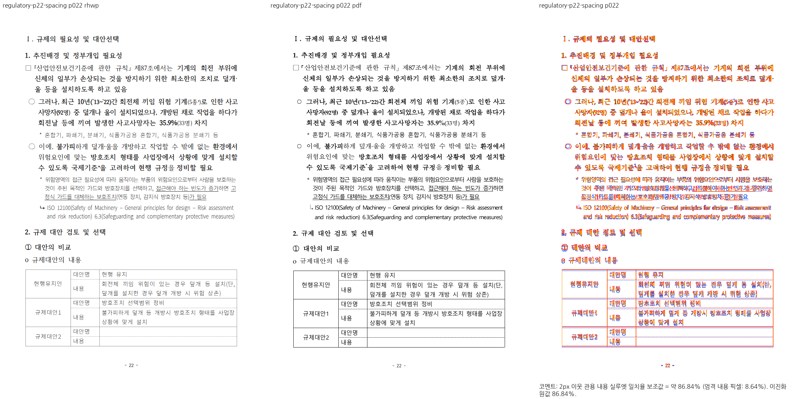
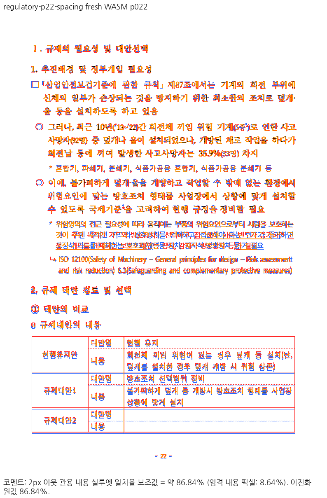
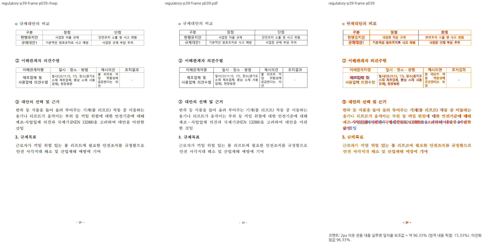
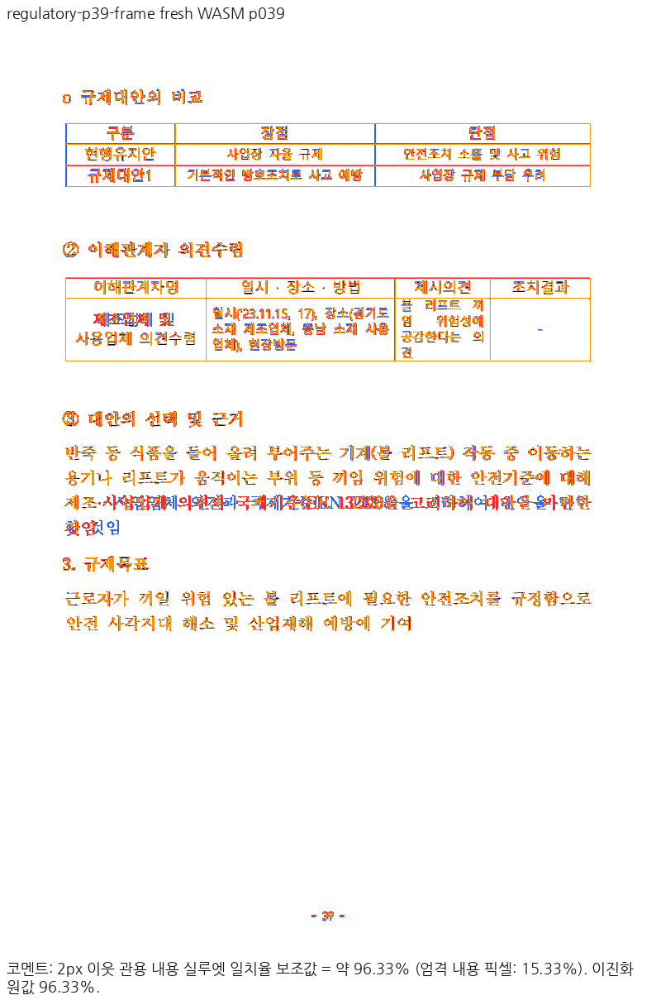
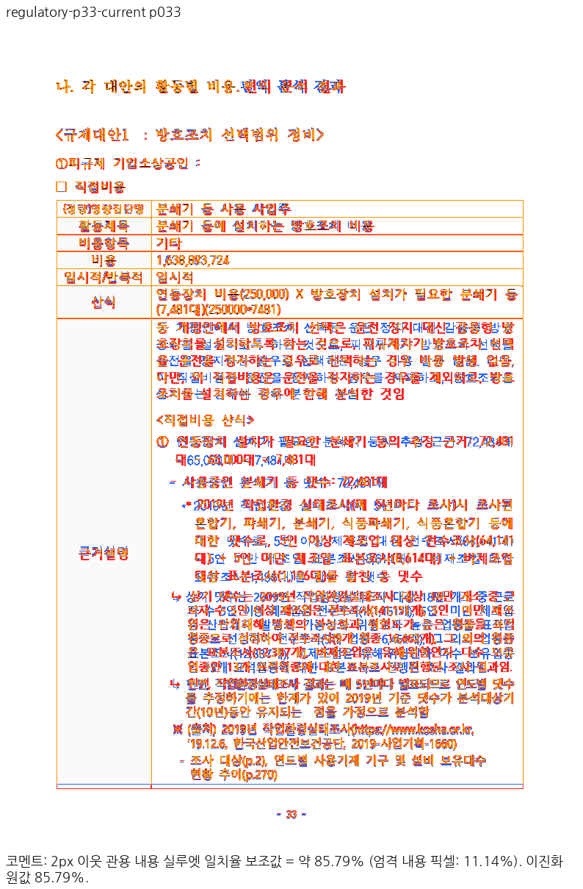
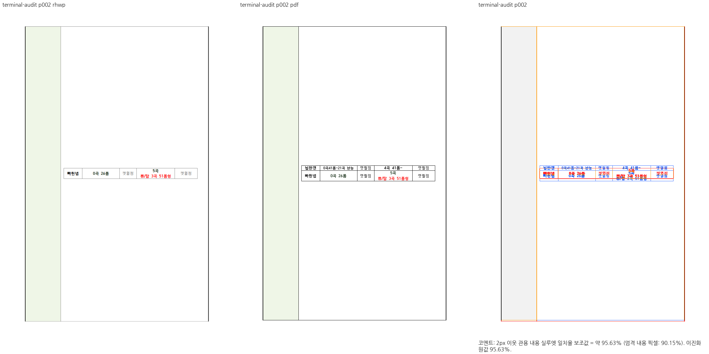
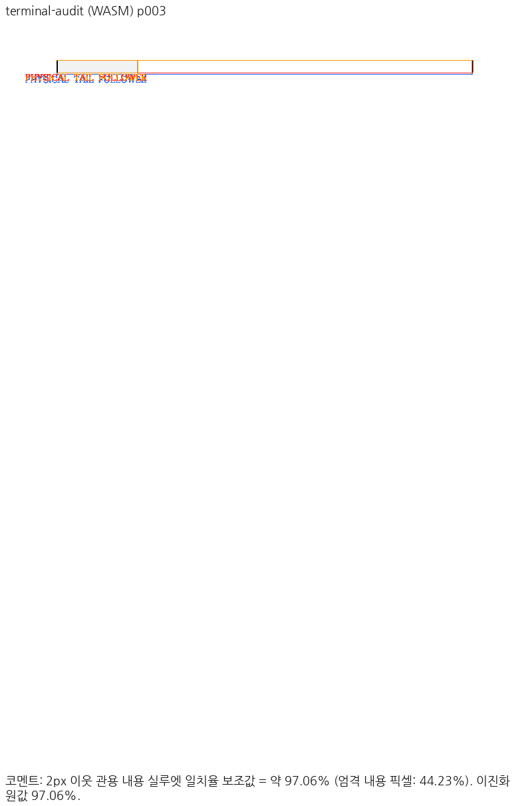
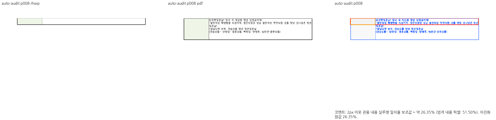
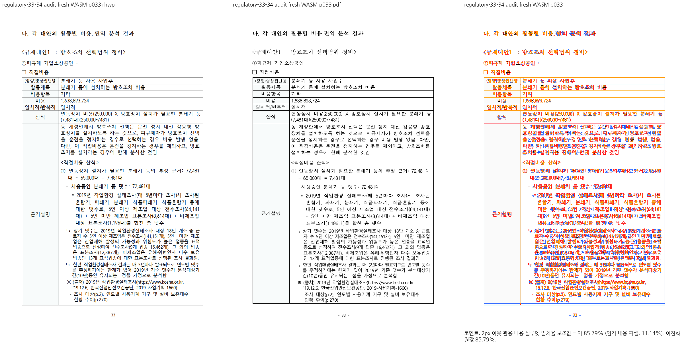

# PR #7518 메인터너 보정 계획

사용자는 2026-10-04에 그림 띠 2쪽의 잔여 문제도 메인터너가 해결하는 경로를 지시했습니다.
`re_review_required`에서 기여자 재작업만 요청하는 일반 절차 대신 이 명시 지시를 적용합니다.
초기에는 90% 예외 없이 검증했고, 이후 아래 사용자 시각 판정에 따라 76076 33·34쪽의
85% 수준 출력을 수용합니다. 자동 측정값과 전역 기준은 바꾸지 않습니다.

- 원 기여자 head: `02845752f76d5539c74df135d950ba5757bd1792` (`kidsnote/rhwp`, `fix/trailing-space-line`).
- 현재 통합 base: `731de9e1b4bb946d76f35108ed7e186ebe4ebecb` (`upstream/devel`).
  이전 `1d6bc70767fad365b07afe4ef57972d23b140f2b` 통합 및 아래 회차별 검증은 보존한다.
  아래 이전 회차의 `8497729b4fb0e071c484fc5740f9bb2400bed437` 검증은 역사 기록입니다.
- 현재 코드 통합 후보: `2869859ee38461645235978f6c05604013c05430`.
  이전 `3d9239eeec32fc60ee188c3f3bc0d9ec5094ec3a` 후보의 결과는 이전 회차 기록이다.
  이전 통합 코드 `3d23545846942137256bc95afbdd8c6390fade42`의 결과는 아래 회차별로 구분한다.
  최초 후보 `55a2800aadc32fc85ed4aa3e8e17f6b169f3b0b0`, tree `40c2a2d91e2b2023c3110f5635ac95cca2e53820`는 보존합니다.
- 검토 PDF·진단 입력·대표 PNG 보존: `5eb671068d74e2757daf12925017f5f6cdbdd38a`, `d8b98bd325a8233b40430e36a5c3db10283e9889`.
- 유지할 작업공간: `/tmp/rhwp-pr7518-review-20261004`, 현재 `integration/pr7518-maintainer-20261004`.
  이전 `review/pr7518-20261004`는 checkpoint `44ca6f0f9`로 보존합니다. 주 작업공간의 기존 #7494 branch와 #7353 worktree는 보존합니다.
- 처리 경로: [`collaborator_external_pr.md` 9.1.1](../../manual/pr_review/collaborator_external_pr.md#911-기본-작업공간-devel-기반-체리픽-통합-검토)의 별도 통합 PR입니다. 원 기여자 이력은 재작성하지 않습니다.
  현재 통합 후보에는 devel의 추가 보정과 독립 자료가 있으므로 이 이력을 기여자 fork에 그대로 push하지 않습니다.
  사용자가 명시한 경로에 따라 본 저장소에 통합 PR을 만들고, 그 PR이 merge된 뒤 원 PR #7518에
  통합 링크를 남겨 close합니다. 지금은 local 수정·검증 단계이며 원 PR을 먼저 닫지 않습니다.

## 보정 전 증거와 가설

원래 수정은 focused 4/4 PASS입니다. 현재 devel 코드(최종 #7563 code와 동일)에서는 같은 실제 출력 조건이
4/4 FAIL이며, TAC 문서 2→1쪽·그림 띠 3→2쪽의 개선을 확인했습니다.
Native 전쪽 실루엣은 TAC 98.65641%, 그림 띠 p1 98.12095%, p2 62.05279%입니다.
그림 띠 두 쪽의 render tree는 이전 원 #7518 exact-head 결과와 동일합니다.

한컴 2020 PDF의 그림 띠 p2는 바깥 표 y=58.50, 행 5 아래끝=243.41, 내부 표 x=216.84/y=128.34,
다음 행 아래끝=275.54, 전체 아래끝=521.67px입니다(96dpi).
보정 전 rhwp는 바깥 표 y=56.7, 행 5 아래끝=180.6, 내부 표 x=230.9/y=87.9,
다음 행 아래끝=212.7, 전체 아래끝≈460.1px입니다.

현재 가설은 내용 컷으로 표현하지 않은 선언 행의 남은 물리 공간과 마지막 문단 기준 floating 표의
오프셋·여백을 continuation이 같은 원장으로 소비하지 않는다는 것입니다. 좌표 이동 상수를 추가하지 않습니다.

## 구현·검증 순서

1. 원본 row 5의 선언 높이·실제 유닛·첫 조각 예약 높이·다음 조각 요구 높이와 부분 배치의 최종 정렬을 추적합니다.
2. 측정/컷/예약/배치가 공통 물리 높이와 표 원점을 소비하도록 승인된 범위의 보정 commit을 만듭니다.
3. 원본 `tests/cases`에 실제 마지막 경계·내부 표·다음 행 좌표 검사를 추가합니다. 보정 전 FAIL / 보정 후 PASS와
   정상 대조군을 확인합니다. 합성 페이지 예산 입력은 독립 한컴 출력이 없는 계약 진단과 구분합니다.
4. 영향 페이지 Native 직접 sweep으로 먼저 방향을 확인합니다. 이후 필요한 lint·회귀·fresh WASM·CDP를 순차 실행합니다.
5. 검증한 head의 review·본문·대표 이미지·남은 차이를 준비한 뒤 승인된 원격 작업을 수행합니다.

## 이전 검증 결과 — 720ebcd60

검증한 code head는 `720ebcd6005f330fa5d7aa22ab7fa9c816965e81`입니다.
일반 행의 선언 물리 tail, 최초 소유의 문단 lead/바깥여백, 전체·부분·재귀 내부 표의 공통 원점과
child cut의 실제 패딩을 보정했습니다. scratch LayoutEngine에도 실제 PageLayoutInfo를 캐시 준비 전에
공급했습니다. NO_LS만으로 canonical 투영을 강제하던 중간 가정은 제거했습니다.

- Focused 21개와 전체 nextest 10,278개가 통과했습니다(전체 50 skip).
- fmt, Native/WASM/workspace-all-targets Clippy, workspace build, Skia 세 검증과 고정 base 정책 검사도 통과했습니다.
- 원본 세 쪽의 Native/fresh WASM 실루엣은 각각 98.65641%, 98.12095%, 92.96635%로 정상 90% gate를 통과했습니다.
- 요청에 따른 CDP 재검증은 캐시를 끈 새 탭에서 11/11 PASS였습니다. 응답 WASM과 pkg/Studio 파일 해시가 일치했습니다.
- 최종 같은 검사로 원 통합은 0/9 PASS, 중간 보정은 6/9 PASS, 최종 보정은 9/9 PASS였습니다.

당시에는 통합 조건이 미충족이었다. 이후 사용자의 지시에 따라 추가 보정을 계속한다.
추가 공개 대조 문서 p33/p34의 Native 점수는 80.90046%/52.62315%이며,
합성 신규 렌더링 회귀 후보에는 독립 기준 PDF와 필수 Native/fresh WASM 시각 증거가 부족합니다.
추가 대조 WASM은 반복 글꼴 임베딩 저장 중 공간 부족으로 미완료입니다. 같은 원인으로 중단된 Skia 빌드는
제가 만든 실패 SVG만 정리한 뒤 재실행해 통과했습니다. 상세 실패 로그도 보존했습니다.
코드·검사 후보를 유지하고, 부족한 증거를 계약 검사 통과로 대신하지 않습니다.

[최종 리뷰](pr_7518_review.md)에 실제 생산/소비 경로·입력 해시·검증 결과·직접 확인한 PNG와 보류 해제 조건을 연결했습니다.
원격 push·PR 생성·comment·merge는 수행하지 않았습니다. 보류 해제 뒤 검토 가능한 후보로 다시 제시합니다.

## 추가 보정 착수 — 사용자 지시 이후

보류 판정을 종료점으로 삼지 않고 추가 대조 문서와 합성 경계의 독립 출력까지 해결한다.
공식 비동기 한컴 client 0.9.0의 `start → status → download`로 합성 원본 13개를
engine 2020에서 변환했고 입력·PDF 해시와 job ID를 로컬 증적에 보존했다.
원격 endpoint·토큰과 글꼴 파일은 공개 증적에 포함하지 않는다.

- 용지 높이만 500~700px로 줄인 입력은 portrait 방향과 저장 폭/높이가 모순된다.
  한컴 PDF가 가로·세로를 바꾼 실패 원본과 PDF를 보존하고, 여섯 대조군을 별도
  `valid_orientation/`에 생성한다. 저장 폭/높이를 교환하고 landscape/attr bit 0을 켜며,
  rhwp의 유효 용지와 본문 크기는 동일함을 검사한다. 원문/줄/개체 속성은 바꾸지 않는다.
- p34 첫 가시 문단은 원래 child 문단 9이며 앞 간격 1000 HU를 가진다. CellUnit은
  이 간격을 첫 줄에 예약하지만 1×1 continuation 배치는 column-top에서 버린다.
  컷이 첫 줄을 소유한 재조판 문단의 간격을 측정과 배치가 함께 소비하게 한다.
  문단 중간의 continuation, 원 셀 첫 문단, 유효 저장 줄 경로는 별도로 대조한다.
- 2024 기준의 한양중고딕은 Type 3이고 현재 SVG 임베더는 HCR Dotum을 우선한다.
  H2GTRM.TTF를 실제 공급해도 기존 선택 정책은 HCR을 유지했다. 파일 부재만으로
  설명하지 않고 PDF 프로그램/선택 정책과 줄·표 위치 차이를 구분해 검증한다.

진행 중 결과는 최종 통과로 승격하지 않는다. 코드 변경 뒤에는 최종 head에서 필수
회귀·lint·fresh WASM·CDP와 Native/WASM 직접 시각 검증을 다시 실행한다.

### 문단 간격과 빈 host 점유 보정

빈 재조판 block-table host는 글줄과 표의 합이 아니라 같은 원점의 점유 합집합을
사용한다. 별도의 실제 빈 문단은 보존한다. `reflow_block_table_host_occupied_height`
생산 결과를 HeightMeasurer의 행/rowspan/MeasuredCell 높이와 전체 셀 배치가 소비하며,
MeasuredCell의 줄 메트릭은 재귀 CellUnit 원장과 구분해 유지한다. 조정 가능한 다중
재조판 행은 캐시 object 높이를 최소 행 높이로 확대하지 않는다.

기존 generic fit이 내용 하한 때문에 균일 축소를 거부한 경우에도 기존 tail-only fit을
소비해야 한다. `fit_measured_table_to_declared_height_with_outcome`이 이 거부 이유를
반환하고 typeset이 원래 fit 범위 안에서 tail-only 경로를 호출한다. paint가 사용하는
같은 tail fit과 예약 높이를 맞췄으며 fit 범위나 회귀 기대값은 완화하지 않았다.

독립적인 원본 HWP의 fresh Hancom 2024 PDF에서 p34 마지막 행은 147.6784px이다.
기존 165.5px가 새 배치에서 147.9px가 되었고 별도 13pt 빈 문단은 유지된다.
첫 문단 간격 및 host 회귀는 기존 720ebcd 코드에서 각각 의도한 좌표 원인으로
실패했다(`spacing-negative-720.log`, `host-negative-720.log`). 수정 후 11개 경계와
기존 #2308 5개/#3128 2개를 합친 18개가 모두 통과했다.
증적: `output/pr-review/pr7518-20261004/logs/host-occupancy-fit-outcome.log`.
다음 단계는 내용 완료 컷과 남은 물리 tail의 정렬, 유효한 follower 흐름 입력 검증이다.

### 완료 내용 컷의 정렬

끝 컷 벡터의 유무 대신 배치에서 사용하는 `cell_cut_window`와 실제 CellUnit 수로
남은 내용이 완전히 소비됐는지 확인한다. 선언 물리 tail이 다음 쪽에 남아도 이 조각에
남은 내용 전체가 들어가면 원래 세로 정렬을 보존하고, 실제 내용 컷은 Top을 유지한다.
독립 Hancom 2020 `terminal-tail` p2 내부 표 top=537.17px와 가운데 점유 불변식을
정식 회귀에 추가했다. 기존 720ebcd에서는 이 좌표 검사로 FAIL, 수정 후 19개
경계/정상 대조군이 PASS다. Native 직접 review p2에서 외곽과 내부 표의 정렬을
확인했으며 3쪽 모두 gate PASS(최저 90.87076%, p2 99.12%)다. 아직 최종 head의
WASM 증적이 아니며 다음 단계에 다시 검증한다.

### nested-split 2쪽 공백 셀과 3쪽 그림 이어받기

사용자가 제공한 한컴 화면과 독립 2020 PDF를 기준으로 먼저 이 경계를 보정했다.
입력은 `valid_generated/nested-split.hwp`이며 원래 `valid_orientation`의 NO_LS
대조군도 같은 정식 검사를 실행했다. 원 입력의 저장 줄이 무효였다는 가정은 하지 않는다.
Hancom 저장본에서 행 5 및 재귀 자식의 LineSeg만 제거한 입력의 생성·변환 출처는
`tests/fixtures/pr7518_review_page_budget/valid_generated/provenance.json`에 연결했다.

실제 원문 행 4 / 열 1은 문단 공백 51개와 세 개의 **non-TAC Square 그림**이다.
그림은 Para/Top, flow_with_text이며 두 개는 유효한 signed 음수 오프셋을 가진다.
저장 줄이 있는 경우 이 음수 오프셋을 근거로 공통 띠를 해체해 높이를 합산하던
가정을 제거했다. 실제 약 247px인 띠를 분할 장부가 약 729px로 예약하던 결함이다.

생산·소비 경로는 다음과 같다.

| 단계 | 실제 경로와 계약 |
| --- | --- |
| 공통 그림 띠 | `float_placement::parallel_cell_float_band_height` / `parallel_cell_picture_band_height`: signed 구간이 겹치는 동일 문단의 띠. 명시 개행·가시 글자·TAC·다른 세로 띠는 이 단일 host 계약에 들어가지 않는다. |
| 전체 측정 | HeightMeasurer와 layout의 셀 visual bottom이 같은 picture band를 소비한다. |
| 내용 컷 | `cell_units_uncached`: host 줄 소유와 모든 그림 control을 소유한 불가분 띠를 분리한다. 둘이 공유하는 줄 전진량을 그림 띠로 옮겨 전체 점유를 중복하지 않는다. |
| 앞 조각 예약 | `parallel_picture_row_opening_height`를 rowspan ordinary scanner가 조회한다. 줄만 소비하고 그림이 남은 컷에 원본 셀 최소 높이 7026 HU를 보존하며 실제 잔여 예산을 검사한다. |
| 이월 | continuation `fragment/emit.rs`가 같은 컷을 조회하고 남은 그림 유닛 높이 전체를 이월한다. 내용 상자에서 빈 물리 opening을 빼던 후속 덮어쓰기를 적용하지 않는다. |
| 실제 배치 | partial table은 같은 parallel picture owner의 문단 시작 원점을 사용한다. 그림을 문단 조판 완료 후의 원점에서 시작하지 않는다. |

독립 PDF의 p2 blank rules는 326.97/420.48px, p3 picture-cell rule은 304.63px,
그림의 실제 보이는 상단은 60.32px이다. Native는 각각 326.1/419.8px,
303.7px, 58.6px이다. p3의 다음 행은 timeline 문단 9개를 소유하고 p4에 반복하지 않는다.
`a_deferred_picture_band_keeps_the_blank_cell_and_the_next_row_on_its_page`는
이 최종 좌표·소유·그림 하단·그림 전체 1회 배치를 검사한다. 이전 immutable CLI는
p2 셀 부재로 FAIL, 보정 CLI는 원래 NO_LS/저장 주변 프레임 두 입력에서 PASS다.

### 마지막 실제 빈 줄의 물리 셀 윤곽

p6의 빈 셀도 실제 원본 문단 두 개의 소유다. GDB로 기존 코드의 실제 CellUnit
14/15를 확인했다: p12는 17.06667px, p13은 10.66667px, 둘 다 vis=0..1이고
empty_spacer=true다. 이어받기 walker가 글자가 없다는 이유로 이 양수 공간을
무높이로 소비해 기존 p6 윤곽을 없앴다. 진단 로그는 `nested-gdb-tail-units.log`에 보존했다.

`empty_unit_owns_flow_line_box`는 실제 재조판한 빈 줄과, 다음 문단이 NO_LS일 때
정확한 직전 저장 슬롯으로 원점이 입증된 빈 줄을 보존한다. ordinary/block walker와
예약 패딩이 같은 소유 판정을 소비한다. 원래의 저장 overlay 판정은 별도로 유지한다.
두 줄과 안 여백의 합 `(800+480+800+282)/75=31.49333px`가 p6에 남으며
독립 PDF의 31.44px과 일치한다. 새 정식 검사 `trailing_empty_paragraphs_keep_their_continued_cell_outline`은
이전 CLI에서 5쪽으로 FAIL, 수정 후 6쪽과 실제 셀 높이로 PASS다.

위의 code는 `c90bc800d` 이후 **미커밋 보정**이다. renderer diff SHA와 입력·PDF·CLI SHA,
명령 및 판정은 `output/pr-review/pr7518-20261004/nested-tail-p1-p6/capture-provenance.json`에 고정했다.
정식 전후 로그는 같은 output의 `logs/picture-current-{positive,negative}.log`와
`logs/empty-tail-current-{positive,negative}.log`다. 이전 Native 네 쪽 직접 판독은
p2 99.72190%, p3 98.78619%, p4 97.68812%로 개선됐지만 최종 새 코드에서 전쪽을 다시 캡처했다.

**현재 범위의 결과와 남은 문제를 구분한다.** p2 공백 셀/p3 그림 및 다음 문단/p6 빈 줄
경계는 정식 검사 PASS다. 전쪽 Native 직접 비교에는 p4 자식 표 아래 물리 경계와
p5 이어받기 시작/후속 행의 약 5px 차이가 남고 p5는 89.20899%다. 전체 gate는
`re_review_required`이며 90% 예외·허용치 완화는 적용하지 않았다. 추가 focused 집합은
12 PASS / 4 FAIL이다: auto-row/mixed-cell의 조각 소유와 page budget,
valid follower의 nested replay 주장까지 독립 출력과 추가 대조가 필요하다.
이는 통합 완료·승인 증거가 아니다.

저장소 루트에서 `CARGO_TARGET_DIR=/home/edward/mygithub/rhwp/target/pr-review scripts/wasm-pack-locked.sh --target web --out-dir pkg`로 fresh WASM을 만들었다.
`pkg/`, Studio `public/`, 캐시를 끈 CDP 브라우저의 실제 응답 SHA-256은 모두
`493b7c110cff3e11397e4eff739ab112be8f6986b883f94554c9054d7c3ff023`이다.
현재 renderer diff SHA는 `b7ee00e7736a10de57321c7b48aa9283d23655e874ed89a8c087961c98148673`다.

fresh WASM Visual Sweep의 1–6쪽 export/compare/standalone overlay/review를 다시 생성했다.
`nested-tail-wasm-p1-p6/summary.json`과 그 아래 `run_manifest.json`에 명령·입력·PDF·source를 연결했다.
p2/p3/p6 review와 p3 standalone overlay를 직접 확인했다. Native와 같은 p2 99.72190%,
p3 98.78619%, p5 89.20899%, p6 100%이며 전쪽 gate는 여전히 `re_review_required`다.

사용자가 준비한 Chrome CDP에서 별도 작업용 Studio 7718과 새 탭을 사용했다.
`valid_orientation`/`valid_generated` 두 입력의 실제 browser render tree로
p2 빈 opening, p3 전체 그림 및 다음 9문단, p4 문단 재등장 부재, p6 빈 셀을 검사했다.
결과는 **16/16 PASS**이며 `cdp-nested-picture/result.json`과 `*-trees.json`에 남겼다.
실제 페이지 오프셋으로 이동한 `valid_generated-page-2.png`/`valid_generated-page-3.png`도
직접 확인했다. 이 CDP 통과는 위 추가 focused 4 FAIL을 해소하는 증거가 아니다.
현재 코드의 `cargo fmt --all -- --check`, Native Clippy `-D warnings`, `git diff --check`는 PASS다.
WASM Clippy·workspace/all-targets·최종 전체 회귀 등 제출 전 검증은 아직 완료되지 않았다.

### 사용자 재검토: 3쪽 그림 상단 여백

사용자 재검토에서 3쪽 그림의 top padding 차이가 지적되어 셀 테두리와 본문 원점을
각각 추적했다. 앞선 약 2px 절대좌표 검사는 이 원점 차이를 검출하지 못했다.
원본 outer table의 바깥 위 여백과 기본 셀 top padding은 각각 141 HU다.
기존 최종 좌표는 본문/셀 상단 56.7px, 그림 상단 58.6px였고, 그림과 셀 사이에는
실제로 약 1.88px 안여백이 있었다. 독립 PDF는 셀 상단 58.40px, 그림 상단 60.32px다.
빠진 값은 공백 host 조각 뒤에서 그림 띠를 이어받는 **표 프레임의 바깥 위 여백**이다.

`parallel_picture_row_opening_height`의 소유 컷을 budget과 partial paint가 함께 조회한다.
본문 최상단에서 이어받는 ordinary cut이며 실제 그림 continuation 높이가 전달된 경우
새 바깥 프레임을 열고, 기존 셀 top padding을 이어서 적용한다. 기존 top margin 경로와
중복 예약하지 않는다. 첫 조각·block cut·중첩 셀·쪽 중간 조각은 이 새 프레임 경로에
포함하지 않는다.

생산·소비 경로: `table_layout.rs::parallel_picture_row_opening_height`의 host/band 소유 컷
→ `fragment/budget.rs`의 `host_before_overhead`와 행 예산
→ `fragment/emit.rs`의 실제 흐름 전진
→ `table_partial.rs`의 table `y_start`
→ 기존 `cell_y + pad_top` 및 `para_y_before_compose`
→ 최종 `fragment_owned_square_flow` picture anchor. 셀 padding을 두 번 더하지 않는다.

진단 CLI `rhwp-picture-top-frame-probe`의 Native 직접 review/overlay에서
셀 상단 58.6px, 그림 상단 60.5px을 확인했다. 두 독립 입력
`valid_orientation`/`valid_generated`의 p2/p3 sweep은 각각 최저 99.65660%다.
p2 render tree JSON은 수정 전 `nested-tail-p1-p6`와 바이트까지 동일하다.
증적은 `picture-top-frame-native`/`picture-top-frame-original-native`이며, fresh WASM과
정식 상대 여백 검사 결과는 아래에 이어 기록한다. 이는 앞서 남은 p4/p5 차이와
추가 focused 4 FAIL을 해결했다는 판정이 아니다.

현재 보정의 fresh WASM 및 회귀 결과를 다음과 같이 고정한다.

- renderer diff SHA: `f0ea459498b8494dc6e53bbabedf9ffcb817abbb36b98fc205a1d9b11b92faa7`
- fresh WASM SHA: `15e9fe49972759bf0049621c9cb4aae0e428fc1fbfde139ec5d74ace49d7548d`.
  root wrapper 성공 후 pkg/public/CDP 실제 응답이 모두 일치한다.
- `picture-top-frame-wasm` 및 `picture-top-frame-original-wasm`: 두 입력의 p2/p3
  Native/fresh WASM 범위 모두 gate PASS, p2 99.72190%, p3 99.65660%.
  p3 review/standalone overlay와 실제 CDP p3 캡처를 직접 판독했다.
- `cdp-picture-top-frame/result.json`: **20/20 PASS**. 각 입력에서 본문→표 프레임의
  원본 바깥 위 여백과 셀→세 그림의 원본 안여백을 각각 검사했다.
- 이 시각 선행 조건을 확인한 뒤 기존 정식 picture case를 보강했다. HWP parser로
  읽은 실제 source table/cell padding을 사용해 두 상대 간격을 검사한다.
  보정 전 immutable `rhwp-nested-tail-frame-probe`에서 outer-top 관계로 FAIL,
  새 `rhwp-picture-top-frame-probe`에서 두 입력 모두 PASS다.
  로그: `picture-top-frame-formal-{negative,positive}.log`.
- 새 source로 prepare한 `regression_suite_020`의 focused 16개는 **12 PASS / 기존 4 FAIL**.
  이외의 실패를 해결했다고 보고하지 않는다. `picture-top-frame-focused-formal.log`에 보존했다.
- fmt/Native Clippy/diff check PASS. 최종 제출용 세 Clippy·전체 회귀 등은 여전히 남아 있다.

입력/PDF/source/CLI/WASM 해시, 명령·manifest 및 테스트 전후 결과는
`output/pr-review/pr7518-20261004/picture-top-frame-provenance.json`에 연결했다.
전체 Native render tree를 대조하면 p3만 달라지고 p1/p2/p4/p5/p6는 이전 산출물과
바이트까지 동일하다. 따라서 이전 p5 gate 미달과 추가 4 FAIL은 남은 문제다.
이번 수정의 판정은 **3쪽 그림 원점의 빠진 바깥 위 여백 복원과 셀 안여백 유지 충족**,
PR 전체 승인·통합은 미완료다.

### 별도 통합 PR 준비 — 사용자 판정

2026-10-04 사용자가 수정 후 3쪽 그림과 2쪽 공백 셀의 **시각 판정: 통과**를
확정하고 이전과 같은 별도 PR 준비를 지시했다. 이 판정은
`picture-top-frame-provenance.json`의 두 입력 p2/p3 Native/fresh WASM 및
CDP 20/20 결과에 연결한다. p4/p5, 다른 fixture와 추가 focused 4 FAIL의
통과 판정으로 확대하지 않는다. 원 contributor head를 보존하고 최신 devel 기반
통합 후보에서 필요한 제출 검증과 최종 PR 본문·head 고정 시각 asset을 준비한다.
원격 push/PR 생성/원 PR close/merge는 아직 수행하지 않았다.

### 별도 통합 경로 확정과 최신 base 재검증

사용자는 권한 문제로 기존 PR에 메인터너 작업을 직접 반영하는 대신, **기여자 변경과
메인터너 보정을 담은 별도 PR을 merge한 후 원 PR #7518을 닫는 방법**이라고 명시했다.
통합 PR은 `edwardkim/rhwp`의 `devel`을 대상으로 한다. 원 PR은 통합 완료 전까지 열어 두고,
완료 후 merge된 통합 PR·기여자 credit·merge SHA로 고정한 증적 링크를 남겨 close한다.
원 #7518의 archive 검토 기록은 같은 통합 PR에 포함하고 통합 PR 번호용 중복 review 문서는 만들지 않는다.

최신 base `1d6bc70767fad365b07afe4ef57972d23b140f2b`에는 #7567의 RowBreak 변경이 포함되어 있다.
이 base에서 기여자 `b2bb249bcc00b0a8301075b62a8810d500f11de2`와
`02845752f76d5539c74df135d950ba5757bd1792`를 순서대로 cherry-pick했다.
각 결과는 `38fa6d211`, `ff732a5a6`이며 원 author를 보존했다.
이전 checkpoint `44ca6f0f9`와 최신 base의 `git merge-tree --write-tree`는 충돌 없이
tree `783c47a9cb7668b72f2e93821870ac88633cd225`를 만들었다. 같은 최종 tree의 추가 보정을
별도 commit `3d23545846942137256bc95afbdd8c6390fade42`로 통합했다.

해당 source의 Native 빌드·Native Clippy·WASM Clippy는 PASS다.
immutable CLI `output/pr-review/pr7518-20261004/rhwp-integration-3d2354584`로
`valid_generated/nested-split.hwp` 전쪽 Native 실루엣을 재실행했다.
p2 99.72190%, p3 99.65660%로 승인된 영역의 결과는 유지되며, p5는 89.20899%다.
focused probe는 12 PASS / 4 FAIL이고 최종 suite 재링크·전체 회귀·최신 source의 fresh WASM 검증은 남아 있다.
따라서 통합 브랜치 생성 완료를 PR 제출 준비 완료로 판정하지 않는다.

후속 진단에서 `nested-auto-row`와 `nested-mixed-cell`의 Native UNIT 소유는 p4 19개,
p5/p6 각각 20개였다. 같은 입력의 독립 PDF는 p4 18개, p5/p6 각각 19개다.
continuation 첫 UNIT의 Native 원점 60.5px과 PDF 66.24px도 다르다.
내용 줄 간격보다 실제 조각의 프레임·여백 예약을 먼저 추적할 근거로 기록한다.
`terminal-follower`는 자식 행 0–2와 행 3이 각각 다른 쪽에 있으므로 자식 fragment 수 2개만으로
재방출을 단정하지 않는다. 다만 전쪽 Native 실루엣에서 p3 74.08920%가 남아 있어,
기존 기대값 변경이나 전체 통과 판정의 근거로 사용하지 않는다.
증적은 `output/pr-review/pr7518-20261004/integration-*-tree`,
`integration-nested-split-native`, `integration-follower-native`와 `logs/integration-*.log`다.

### 사용자 전쪽 판독 — nested-split 페이지 분리 수용

2026-10-04 사용자가 현재 통합 후보 `3d23545846942137256bc95afbdd8c6390fade42`의
`valid_generated/nested-split.hwp` 전체 1–6쪽 PNG를 확인한 뒤,
“페이지 분리 처리는 한컴과 거의 동일하게 되어 있습니다. 앞쪽 페이지네이션 버그를 수정하면서
자연스럽게 해결되었네요”라고 판정했다. 해당 샘플의 페이지 분리는 사용자 시각 판정으로 수용한다.
앞선 브리핑의 4→5쪽 차이를 이 샘플의 페이지 분할 미해결 판정으로 계속 사용하지 않는다.

대조한 출력은 `output/pr-review/pr7518-20261004/all-pages-user-review/nested-split`의
`rhwp_png`, `pdf_png`, `review`, `overlay`이며 각각 6쪽을 새로 생성했다.
source SHA·입력/PDF hash·실행 조건은 같은 디렉터리의 `run_manifest.json`에 고정되어 있다.
사용자 판정은 페이지 분리의 수용이며 완전한 픽셀 일치 주장과 구분한다.
p5 실루엣 89.20899% 및 자동 `re_review_required`는 원래 측정값으로 보존한다.
자동 높이·단일 셀·terminal-follower 대조군의 결과 및 focused 4 FAIL을 이 판정으로
통과 처리하지 않으며, 다른 샘플의 실제 분할 차이와 검사 가정의 오류를 별도로 확인한다.

### 다음 보정: 76076 33쪽의 빈 host 표 원점

사용자가 지정한 원본 `samples/76076_regulatory_analysis.hwp`와 동일 대응 PDF
`samples/issue1891/76076_regulatory_analysis-2024.pdf`의 33·34쪽을 source `3d2354584`로
다시 출력했다. `regulatory-spacing-current-native/regulatory-spacing-current`에 Native
compare/overlay/review·render tree·입력/PDF hash를 보존했다. nested-split 1–4쪽도
같은 source의 `all-pages-user-review`로 다시 직접 확인했다.

원본 323·324번 문단은 저장 LineSeg가 없는 빈 host의 비-TAC TopAndBottom, Para/Top,
offset 0 표다. 두 표의 위·아래 바깥여백은 각각 566HU, 선언 본체 높이는 1300HU다.
325번 문단의 뒤 큰 표도 같은 host 계약이며 바깥 위 여백은 141HU다.
앞 일반 문단의 baseline은 Native 158.6px / PDF 158.72px로 일치하지만,
323·324 표 문자의 PDF baseline 196.00/228.48px에 비해 Native는 각각 약 7.55px 이르다.
큰 표의 PDF 상단 괘선은 240.217px, Native 상단은 238.5px다.
PDF font bbox의 yMin은 실제 glyph top과 다르므로 이 진단에는 PDF text origin과
괘선 path를 96dpi 좌표로 변환해 사용했다.

원인 경로는 `table/host_spacing.rs::resolve`가 outer-top을 before로 예약하고,
`format_table`·block fit이 본체+before+after를 소비하지만 빈 NO_LS host에는 확정
`ParagraphFloatPlacement`가 없어 full paint의 문단 기준 원점이 outer-top을 생략하는 것이다.
partial 경로도 확정 원점이 없으면 다른 프레임 술어로 재해석한다.
기존 `layout.rs`의 1×1 RowBreak 흐름 끝 보정은 표를 실제로 옮긴 뒤 top을 다시 더할 수 있다.

보정 범위는 단일 표만 가진 빈 NO_LS host의 비-TAC, Para/Top, TopAndBottom, offset 0
블록 표다. 예약된 before·본체·after로 하나의 확정 원점/점유 끝을 만들고 whole fit,
첫 fragment, paint 및 뒤 흐름이 소비하게 한다. 일반 텍스트·공백 host, TAC, Square,
Page/Paper 기준, 저장 LineSeg host는 이 경로로 승격하지 않는다.
선행 입력 그대로 수정 전후 최종 원점·흐름 끝·뒤 표 소유 및 33·34쪽 직접 출력을 확인한다.

### 76076 빈 host 표 원점 보정 — 3d9239eee

입력은 위 실제 원본과 기존 한컴 2024 PDF 그대로이며 수동 LineSeg나 좌표를 추가하지 않았다.
보정 코드 SHA는 `3d9239eeec32fc60ee188c3f3bc0d9ec5094ec3a`다.
`from_empty_reflow_host`가 기존 `host_spacing`의 before·측정 본체·after로 표 원점과
점유 끝을 만든다. text가 빈 sole-table host의 재조판, Para/Top, 자리차지, offset 0에 적용한다.
공백을 가진 host는 빈 host로 합치지 않고, 저장 앵커·TAC·어울림·절대 기준·명시 offset의
기존 계약도 이 분기에 포함하지 않는다.

| 실제 경로 | 확정 결과의 소비와 후속 분기 |
| --- | --- |
| whole fit | `block/entry.rs`는 formatted before/body/after의 placement를 fit 하단과 함께 기록하고 `typeset.rs::place_table_with_text`는 그 occupied_bottom을 전진시킨다. |
| 첫 RowBreak 조각 | `block/prepare.rs`는 빈 host의 원점을 텍스트 줄 앵커로 다시 환산하지 않고 첫 top을 중복 열지 않는다. 별도 host 글줄도 예약하지 않는다. |
| 이월·이어받기 | `continuation/fragment/budget.rs`는 같은 frame에서는 확정 top을 소비하고 새 frame에서는 현재 높이와 해당 조각 overhead로 옮긴다. 같은 첫 조각의 1×1 top을 다시 더하지 않는다. `fragment/emit.rs`가 실제 수용한 조각 높이로 점유 끝을 확정한다. |
| 전체·부분 paint | `layout_table`/`layout_partial_table`에 확정 원점을 전달한다. `layout.rs`의 이전 빈 1×1 RowBreak 끝점 공식 대신 확정 occupied_bottom을 소비하여 top을 재가산하지 않는다. 위 캡션은 확정 외곽 상자의 내부로 배치한다. |

다음 값은 96dpi 좌표다. PDF의 text origin과 괘선 path를 기준으로 사용했으며,
font bbox yMin을 글자 기준선으로 대신하지 않았다.

| 실제 출력 검사 | 수정 전 Native | 수정 후 Native | 독립 PDF |
| --- | ---: | ---: | ---: |
| 323 표 문자 baseline | 188.360 | 195.907 | 196.000 |
| 324 표 문자 baseline | 220.787 | 228.333 | 228.480 |
| 325 큰 표 시작 괘선 | 238.5 | 240.4 | 240.217 |

두 작은 표의 baseline은 PDF 대비 0.25px 이내 검사를 수정 전 FAIL / 수정 후 PASS했다.
실제 표 사이 진행량은 `(566 + 1300 + 566) / 75`px로 유지하며,
빈 325번 host의 별도 TextLine은 생성하지 않는다. 일반 앞 문단 원점은 바뀌지 않았다.
이는 `output/pr-review/pr7518-20261004/regulatory-spacing-diagnosis.json`의 실제 출력 진단이며
정식 회귀 테스트 통과나 전체 한컴 일치 증거로 승격하지 않는다.

immutable Native CLI `rhwp-regulatory-empty-host-probe2`의 SHA-256은
`8827ee3867e3b5c0cb7aaada30321ed5dce89e298f56139e9f28416c098c4220`다.
`regulatory-spacing-fixed-native/regulatory-spacing-fixed`에 33·34쪽의
compare/standalone overlay/review와 exact-source `run_manifest.json`을 새로 산출했다.
33쪽 review와 overlay를 직접 확인했다. Native p33 85.07562%, p34 84.06333%로
자동 gate는 아직 `re_review_required`다. 아래 긴 셀의 글꼴·가로폭·줄바꿈과 표 하단 차이는 남아 있다.
90% 예외·golden/래칫 갱신을 적용하지 않으며 새 정식 렌더링 회귀도 추가하지 않는다.

`nested-split-spacing-control-native/nested-split-fixed`의 1–4쪽 review를 모두 직접 확인했다.
2쪽 빈 셀 윤곽, 3쪽 그림 패딩·그림 뒤의 다음 행 소유, 4쪽 이어받기 위치가 유지되며
gate는 PASS다. Native 1–6쪽 render tree는 앞서 사용자 수용한 `3d2354584` 출력과 모두 동일하다.
현재 CLI를 소비하는 기존 focused 실제 출력 probe는 12 PASS / 4 FAIL로 이전과 동일하다.
이 실행은 library를 새로 링크한 정식 전체 회귀로 대신하지 않는다.

같은 source의 fresh WASM wrapper는 성공했고, 루트 pkg/Studio public/실제 CDP 응답 WASM의
SHA-256은 모두 `ad03963e38cd85939f14eaa9c80099f5060d8642a77c4359ee582487b0091f40`이다.
`regulatory-spacing-fixed-wasm/regulatory-spacing-fixed`의 33·34쪽 review와 33쪽 overlay를
직접 확인했다. Native와 같은 85.07562%/84.06333%이며 90% gate는 미충족으로 보존한다.
`nested-split-spacing-control-wasm/nested-split-fixed`의 1–4쪽 review와 3쪽 overlay도
직접 확인했다. 두 backend 모두 각 쪽 97.84546%, 99.72190%, 99.65660%, 97.68812%로 PASS다.
CDP는 캐시를 끈 새 탭에서 실제 새 WASM을 받은 해시와 33·34쪽 표 좌표, source 여백과
한 번의 흐름 전진, 빈 split-host 글줄 비생성을 확인해 8/8 PASS했다.
명령과 출력은 `logs/regulatory-spacing-fixed-{native,wasm}.log`,
`logs/nested-split-spacing-control-{native,wasm}.log`, `cdp-regulatory-spacing/result.json`에 연결한다.

원 기여의 `issue_7500_no_lineseg_trailing_whitespace_line`을 현재 source로 새로 링크해 4/4 PASS했다.
`logs/regulatory-spacing-7500-current.log`에 원 TAC 표의 쪽 소속·앞 공백 뒤 위치·다음 큰 표와의
앞뒤 관계 및 그림 세 장의 첫 쪽 소속을 보존한 결과가 있다.
기존 `issue_7518_reflow_row_physical_frame`도 현재 source로 새로 링크해 실행했다.
`logs/regulatory-spacing-7518-current.log`의 결과는 12 PASS / 4 FAIL이며,
자동 높이·단일 셀·terminal-follower의 앞선 실패 네 가지가 그대로 남아 있다.
이번 76076 원점 보정으로 이 대조군까지 해결했다고 보고하지 않는다. 전체 회귀는 아직 재실행하지 않았다.
fmt, Native/WASM/workspace-all-targets 세 Clippy, workspace build는 순차로 PASS다.
policy는 현재 통합 base `1d6bc70767fad365b07afe4ef57972d23b140f2b` 대비 PASS다.

검증 중 fetch에서 최신 devel이 `731de9e1b4bb946d76f35108ed7e186ebe4ebecb`(#7568)로
전진한 것을 확인했다. 최신 base 대비 manifest check는 이 base가 옮긴 옛 integration source
네 파일을 새 루트 source로 판단해 FAIL했다. 파일을 삭제하거나 정책을 완화하지 않았다.
`git merge-tree --write-tree upstream/devel HEAD`의 read-only 시험은 height_measurer,
table_layout, table_partial, block/prepare, fragment/emit의 다섯 content conflict를 검출했다.
이 base는 아직 작업 branch에 통합하지 않았으며 현재 출력 증거는 기존 base 위의 위 SHA에 한정된다.
최신 base 통합·충돌 해결·필수 재검증을 PR 제출 준비 완료와 혼동하지 않는다.

### 사용자 시각 판정 — 76076 33·34쪽 수용

2026-10-04 사용자는 위 Native/fresh WASM PNG를 제시한 뒤 다음과 같이 판정했다.

> 가이드레일 기준 90%에 미치지 못하지만 85% 수준에서 픽셀 일치시키는 수준이면 조판 허용치로는 수용할 수 있습니다.
> 시각 판정 통과로 진행시킵니다.

검토 source는 `3d9239eeec32fc60ee188c3f3bc0d9ec5094ec3a`이며 판정 대상은 위 76076
33·34쪽의 표 원점 보정과 그 비교 출력이다. Native/fresh WASM 모두 p33 85.07562%,
p34 84.06333%의 원 점수를 유지한다. 이 지표는 엄격 픽셀 일치율이 아니라 2px 이웃 관용
내용 실루엣 일치율이며 사용자 직접 판독에 따른 이번 수용과 구분해 기록한다.
자동 `re_review_required`를 PASS로 편집하거나 global threshold·golden·래칫을 완화하지 않는다.
사용자 지시가 이 작업의 일반 90% 시각 게이트보다 우선하므로 같은 수용을 재확인하지 않고
최신 base 통합과 정식 회귀·lint·새 head 출력 검증을 계속한다.
다른 대조군의 누락·중복·불필요한 빈 쪽이나 기존 검사 실패까지 이 판정으로 통과 처리하지 않는다.

### 최신 devel 통합과 사용자 시각 판정 적용

최신 base `731de9e1b4bb946d76f35108ed7e186ebe4ebecb`(#7568)를 실제 작업 branch에
통합했다. 위 다섯 conflict는 merge commit `d76cd8075c5e98f10da1b48f3af72155d9f3d40d`에서
해결했다. contributor의 원 code·asset commit과 이전 메인터너 보정 history를 유지했다.
`checkpoint/pr7518-before-7568-20261004`에 통합 전 상태도 보존했다.

| 충돌 경로 | 최종 소비 계약 |
| --- | --- |
| `height_measurer.rs`, `table_layout.rs` | 재조판 nested host는 cut과 같은 cell-unit 원장을 측정한다. 최신 devel의 NO_LS TAC host 뒤 간격도 그 원장에 포함한다. 그 밖의 collapsed/all-NO_LS 경로는 최신 처리를 유지한다. |
| `table_partial.rs` | 최신 저장 block-reset opening과 재조판 complete-content/physical-tail의 정렬 소유를 각 실제 cut 경로에서 유지한다. |
| `block/prepare.rs` | 저장 body-filling frame의 새 outer-top은 유지하고 확정 빈 재조판 host의 top은 중복 열지 않는다. |
| `fragment/emit.rs` | 빈 그림 띠의 물리 높이, 재조판 행의 physical tail, 저장 frame의 남은 높이는 각각의 실제 호출 분기로 이월한다. |

같은 원본 HWP/PDF·글꼴 경로로 Native와 fresh WASM의 76076 33·34쪽을 다시 산출했다.
source SHA는 위 merge code이며 renderer diff는 없다. 이후 test-only commit
`f961b773935d823859efca682c6b2f1b926b6acb`는 renderer·WASM을 변경하지 않는다.
Native CLI SHA-256은 `200ada66a6f0e582d58d4f28fd41acb308bd94716db78c98eea195a63b38d33d`,
pkg/Studio public/캐시를 끈 CDP 실제 응답 WASM은 모두
`7353d24cde4f554b6bef0bb14e5053e5c9004db093058ac974290642f221b6f8`다.

| 새 직접 출력 | Native | fresh WASM | 판독 |
| --- | ---: | ---: | --- |
| 76076 p33 | 85.78689% | 85.78689% | 작은 두 표·다음 표의 보정 원점 유지, 사용자 시각 수용 범위 |
| 76076 p34 | 86.67962% | 86.67962% | 최신 outer-top 보존으로 기준 괘선에 가까워짐, 사용자 시각 수용 범위 |
| nested-split p1–p4 최저 | 97.68812% | 97.68812% | 2쪽 빈 셀 윤곽·3쪽 그림 안여백과 다음 행·4쪽 이어받기 유지 |

각 backend의 해당 review PNG를 모두 열어 직접 비교했고, 76076 p33과 nested-split p3의
standalone overlay도 직접 확인했다. 76076 자동 gate의 `re_review_required`는 그대로 보존한다.
일반 90% 조건을 코드로 낮추지 않고 이번 사용자 명시 수용을 해당 비교 범위에 적용한다.
증적 root는 `output/pr-review/pr7518-20261004/` 아래
`integration-7568-regulatory-{native,wasm}/regulatory-integration`과
`integration-7568-nested-{native,wasm}/nested-integration`다.
각 `run_manifest.json`에 source·입력·PDF hash와 실행 인수를 고정했다.
명령 원문과 점수는 `logs/integration-7568-{regulatory,nested}-{native,wasm}.log` 및
각 root의 `summary.json`에 있다.

CDP `cdp-regulatory-integration/result.json`은 새 WASM 제공 해시, source outer-top,
작은 표 사이 before/body/after 한 번 소비, 뒤 큰 표의 인접 여백, 빈 split-host 글줄
비생성, p33/p34 Native/WASM 표 좌표 일치, 브라우저 오류 부재를 확인하여 8/8 PASS다.
실행은 `VITE_URL=http://localhost:7718 CHROME_CDP=http://localhost:19222 node
output/pr-review/pr7518-20261004/cdp-regulatory-integration.mjs`이며 새 탭만 사용했다.

정식 source `tests/cases/issue_7518_reflow_row_physical_frame.rs`에
`empty_reflow_table_hosts_consume_the_source_margins_once`를 추가했다. 실제 source 속성으로
앞 subtitle의 줄 점유·첫 표 outer-top·인접 표의 bottom/top 여백 관계와 325 host 글줄
비생성을 검사하며 절대 픽셀 원점을 고정하지 않는다. 같은 compiled formal harness에서
수정 전 immutable CLI `rhwp-integration-3d2354584`는 첫 host 위 여백 누락으로 FAIL,
현재 `rhwp-integration-d76cd8075`는 PASS다. 이는 환경·빌드 실패가 아니다.
증거는 `logs/integration-7568-empty-host-{before,after}.log`다.

현재 source를 새로 링크한 focused 결과는 아래와 같다. 실행 명령은
`node scripts/run-rust-test.mjs --cargo-test <case> -- --target-dir
/home/edward/mygithub/rhwp/target/pr-review`이며 case별 로그를 보존했다.

| 실제 검사 | 결과 | 증적 |
| --- | --- | --- |
| `issue_7418_host_text_and_split_row_geometry` | 7/7 PASS: stored/synthesized host·TAC 간격·continuation outer-top 등 정상 대조 | `logs/integration-7568-focused-7418.log` |
| `issue_7422_recomposed_cell_frame_uses_paragraph_margins` | 1/1 PASS: 재조판 셀의 본래 문단 프레임 | `logs/integration-7568-focused-7422.log` |
| `issue_7500_no_lineseg_trailing_whitespace_line` | 4/4 PASS: 원 TAC 줄·그림 소속 | `logs/integration-7568-focused-7500.log` |
| `issue_7518_reflow_row_physical_frame` | 13 PASS / 기존 4 FAIL; 새 여백 검사는 PASS | `logs/integration-7568-focused-7518.log` |

기존 실패 중 auto/mixed의 마지막 outer-row fragment 개수와 follower의 nested-table
fragment 개수는 그 자체로 내용 중복을 입증하지 않는다. 실제 유닛 소유로 대조할 대상이다.
한편 auto 대조군은 현재 Native 7쪽 / 동일 입력 한컴 PDF 8쪽이며 4·5·7쪽 직접 비교에서
UNIT의 쪽 소속과 프레임 여백 차이가 확인된다. `integration-7568-auto-native/auto-integration`
및 `integration-7568-auto-tree`에 현재 출력과 원본을 보존했다. p5 88.51980%, p7 73.02188%를
76076 사용자 수용으로 통과 처리하지 않는다. mixed의 마지막 빈 쪽도 별도 원인 대상으로 남긴다.
작은 영향 경계가 아직 해결되지 않아 비용이 큰 전체 회귀를 먼저 반복하지 않았다.

최신 base 대비 manifest check는 통합 전의 옛 네 source 이동 문제를 해소하여 PASS했다.
test-only commit의 필수 fmt·Native/WASM/workspace-all-targets 세 Clippy·workspace build·manifest
순차 검증은 모두 PASS했다. `integration-7568-lint.sh` 및 `logs/integration-7568-lint.log`에
명령과 완료 결과가 있다. 같은 base의 source-unit tier check도 PASS다.
이 결과를 전체 회귀·최종 PR 제출·remote 통합의 완료로 대신하지 않는다.

### 메인터너 Open PR 등록 지시

위 13 PASS / 4 FAIL 상태를 전달한 뒤 사용자가 메인터너 PR 등록·계속 처리를 명시 지시했다.
2026-10-04 현재 후보를 Open PR로 공개하되 실패와 미완료 검증을 본문에서 공개한다.
Draft나 전체 검증 통과로 바꾸어 표시하지 않으며 남은 보정은 같은 PR source branch에서 이어간다.
등록 직전 최신 base는 여전히 `731de9e1b`였고 `git merge-tree --write-tree upstream/devel HEAD`는
exit 0이었다. 별도 통합 절차에 따라 두 원 PR 문서를 archive로 옮겼으며 fixture README 상대 링크도
함께 갱신했다. 현재 source의 대표 PNG 16개와 점수·실패 범위 JSON을
`mydocs/pr/assets/pr7518_integration_20261004/`에 추가했다. 현재 PR 본문은 이 새 asset을
정확한 head SHA의 raw URL로 고정한다. 과거 asset을 현재 출력처럼 사용하지 않는다.

### PR #7570 CI 실패 확인

2026-10-04 사용자 요청으로 [PR #7570](https://github.com/edwardkim/rhwp/pull/7570)의
정확한 공개 head `d26a301d188dda000a23b59b6cb9adf155bef2fb`를 재조회했다.
base는 여전히 `731de9e1b4bb946d76f35108ed7e186ebe4ebecb`다.
최종 check는 27 success / 3 skipped / 3 failure이며 실행 중인 검사는 없다.
lint·네 archive build·Archive A/B·Native Skia·frontend package는 통과했다.
실패는 환경 설치나 빌드 오류가 아닌 실행된 Rust assertion이다.

| 실패 job | 직접 원인 | 로컬 대조 |
| --- | --- | --- |
| [Archive C](https://github.com/edwardkim/rhwp/actions/runs/37199449976/job/111429147180) | `issue_2308_saved_nested_width_keeps_fragment_geometry`: p33 expected y=400.4 / h=636.8, actual y=402.3267 / h=636.9733. 허용 0.2px 중 높이는 통과하고 원점은 1.9267px 차이로 실패한다. | 현재 source를 새로 링크해 case 6개 실행: 4 PASS / 해당 1 FAIL / 기존 1 ignored. CI와 같은 실제 값이다. |
| [Archive D](https://github.com/edwardkim/rhwp/actions/runs/37199449976/job/111429617130) | `text_overlaps_do_not_grow_partition_9`: 76076에 baseline 없는 글자 상자 겹침 4건. | 같은 partition의 정식 검사도 실제 신규 4건으로 FAIL했다. |
| [Build & Test aggregate](https://github.com/edwardkim/rhwp/actions/runs/37199449976/job/111430787591) | Archive C/D 결과가 failure이므로 집계 실패. | 별도의 세 번째 조판 결함으로 세지 않는다. |

겹침의 JSON `page`는 0-based다. 사용자에게 안내하는 쪽 번호는 여기에 1을 더했다.
현재 immutable Native CLI의 `layout-anomaly`와 실제 render tree에서 다음을 대조했다.

| 실제 쪽 | 소유 문단·내용 | 겹침 수 / 세로 상자 교차 |
| --- | --- | --- |
| 22 | 본문 pi191 `규제대안의 내용`과 pi193 표의 `대안명` | 1 / 7.3867px |
| 38 | 본문 pi364 `규제대안의 내용`과 pi366 표의 `대안명` | 1 / 14.0533px |
| 39 | 본문 pi373 `이해관계자 의견수렴`과 pi375 표의 `이해관계자명`, `일시 · 장소 · 방법` | 2 / 각각 17.1133px |

세 문단의 표는 Para/Top, offset 0, TopAndBottom이다. 22쪽 본문 줄 y=745.2 / h=20.0인데
뒤 표 문자는 y=757.8133으로 앞 제목의 줄 상자와 교차한다. 38쪽 본문 y=817.1467 / h=20.0,
표 문자 y=823.0933, 39쪽 본문 y=224.1867 / h=20.0, 표 문자 y=227.0733이다.
이는 실제 좌표 검사 재현이며 추가 페이지의 fresh Native/WASM Visual Sweep 판독을 대신하지 않는다.

같은 원본에 보존한 immutable CLI를 대조했다. 원점 보정 전 source `3d2354584`는
82쪽 / text-overlap 0건, 원점 보정 `3d9239eee`는 82쪽 / 5건,
최신 통합 `d76cd8075`는 82쪽 / 4건이다. 따라서 최신 devel 통합만의 환경 실패가 아니라
이번 빈 host 원점 보정 이후 생긴 앞 본문과 표 배치의 회귀로 범위를 좁혔다.
정확한 생산·소비 분기의 원인 보정은 다음 단계이며, 값 clamp·baseline 허용치 갱신으로 숨기지 않는다.
p33 원점 검사는 독립 PDF·source 관계와 대조할 대상이며 이번 직접 시각 수용만으로
절대 좌표 assertion을 자동 이동하지 않았다. 기존 페이지 분할 검사 4건도 별도로 남아 있다.

Archive C는 547/1986, Archive D는 37/2041 검사를 실행하고 fail-fast로 중단했다.
따라서 이번 CI에서 보고된 독립 실패 2개가 모든 남은 실패의 전부라는 의미는 아니다.
특히 앞서 로컬에서 확인한 페이지 분할 4 FAIL을 CI 전체 통과로 바꾸어 보고하지 않는다.

로컬 명령·증거는 `output/pr-review/pr7518-20261004/`에 보존했다.

- CI 로그: `logs/ci-7570-archive-{c,d}.log`, `logs/ci-7570-build-test-aggregate.log`.
- 원점 정식 검사: `node scripts/run-rust-test.mjs --cargo-test issue_2308_render_normalized_derived_state -- --target-dir /home/edward/mygithub/rhwp/target/pr-review`; `logs/ci-7570-local-2308.log`.
- 겹침 정식 검사: `RHWP_TEXT_OVERLAP_DUMP=<증적 TSV> cargo test --locked --target-dir /home/edward/mygithub/rhwp/target/pr-review --test regression_suite_010 text_overlap_baseline::text_overlaps_do_not_grow_partition_9`; `logs/ci-7570-local-text-overlap-partition9.log`.
- 동일 원본 before/after: `ci-7570-regulatory-before-spacing-anomaly.json`, `ci-7570-regulatory-before-merge-anomaly.json`, `ci-7570-regulatory-anomaly.json`.
- 실제 소유·좌표: `ci-7570-overlap-trees/render_tree_{022,038,039}.json`; source control은 `ci-7570-regulatory-source.txt`.

이번 단계는 실패 조사 기록이며 code·assertion·baseline 변경이나 원격 재실행을 수행하지 않았다.

### 22쪽 보정 착수 — 재조판 본문 앞 간격의 흐름 누락

사용자는 22쪽 `o 규제대안의 내용` 다음 표의 위치부터 수정하도록 지시했다.
기존 integration branch에서 진행한다. 기본 경로는 collaborator self-merge이며
`pr_review_workflow`, 선택표, `collaborator_self_merge`, `intake_and_review`,
`local_validation`, `visual_fixture_evidence`, 개발 환경과 시각 검증 정본을 적용했다.
원본과 독립 PDF는 기존 tracked 76076 HWP/2024 PDF 그대로 사용한다.

수정 전 `98b9ac359`의 renderer는 `d76cd8075`와 동일하다. Native 출력에서
pi191 줄 상단은 745.2px, 다음 별도 빈 문단 pi192는 775.2px이지만
pi193 표 상단은 751.8px이었다. `RHWP_DIAG_FLOW`와 `RHWP_TABLE_DRIFT`로
표 진입 흐름은 본문 기준 674.3px임을 확인했다. 출력 흐름과의 차이는
앞의 NO_LS 문단 다섯 개에 지정된 앞 간격 6.6667px씩, 합계 33.3333px이다.

`paragraph/format.rs::format_paragraph_for_flow`는 텍스트가 있는 NO_LS 문단의
`spacing_before`를 0으로 바꾸는 과거 실험 조건을 가지고 있었다. 반면
`paragraph_layout.rs::layout_composed_paragraph`는 실제 ParaShape 간격을 적용한다.
따라서 입력 간격 → formatted total/fit/flow → `st.current_height` →
`block/entry.rs::from_empty_reflow_host`의 `table_top`/`occupied_bottom` →
`layout.rs`의 확정 원점 소비에서 표만 앞선 본문 내부로 돌아왔다.
독립 PDF의 제목 기준선은 766.24px, 표 상단 괘선은 788.257px이다.

본문 앞 간격을 제거하는 가정을 삭제하고 resolved style의 간격을 그대로
format 결과에 포함한다. 저장 사다리의 별도 trim/column-top 처리는 유지한다.
특정 쪽·문단·문서 ID나 픽셀 상수로 표를 밀지 않는다. pi192의 독립 빈 줄,
표 자체의 위·아래 여백과 pi194 이후 문단을 각각 확인한다.
저장 LineSeg, 간격 0, 빈 문단과 visible host의 기존 검사를 대조하고
22쪽 Native/fresh WASM 직접 비교부터 진행한다. 38·39쪽에 별도 수정은
추가하지 않으며 공통 원인의 파급 결과만 관찰한다.

### 22쪽 수정 후 검증 — 28f4cbbe5

업데이트로 `/tmp` 작업트리와 ignored 출력이 소실되었으나 branch와 커밋은 남았다.
같은 경로에 `integration/pr7518-maintainer-20261004`를 복구했다. source는
`28f4cbbe5799f76a28e3c22ada96b6ee54cea218`, 검증 base는 fetch 뒤 고정한
`731de9e1b4bb946d76f35108ed7e186ebe4ebecb`다. 공유 target/pr-review와 주 작업공간을 보존했다.
이전 immutable Native CLI는 SHA-256으로 확인해 회수했고 현재 Native와 WASM은 다시 빌드했다.
글꼴 49개를 Windows Fonts에서 다시 공급했으므로 이전 환경의 점수와 섞지 않고
같은 복구 환경에서 수정 전후를 새로 비교했다. 입력·PDF·글꼴·binary 해시는
[이번 증적](../assets/pr7518_p22_spacing_20261004/validation.json)에 고정한다.

| 22쪽 실제 배치 | 수정 전 Native | 수정 후 Native / portable WASM | 독립 기준·검사 |
| --- | --- | --- | --- |
| 제목 pi191 | y745.2 / h20.0 | 동일 | 한컴 PDF glyph baseline 766.24px |
| 별도 빈 문단 pi192 | y775.2 / h5.3 | 동일 | 원본 4pt 빈 문단 보존 |
| 뒤 표 pi193 | y751.8 / h231.9 | y785.1 / h231.9 | 한컴 상단 괘선 788.257px, 잔차 약 3.13px |
| 표 뒤 빈 문단 pi194 | y985.6 / h5.3 | y1018.9 / h5.3 | 표 점유 끝 뒤에 배치 |

최종 좌표의 `제목 → 빈 줄 → 표 → 뒤 문단` 검사는 수정 전 표가 빈 줄보다 앞서 FAIL,
수정 후 PASS다. 이는 실제 최종 배치의 진단 실행이며 새 정식 회귀 추가와 구분한다.
Native와 fresh WASM 22쪽 PNG의 SHA-256이 같고 48개 TextLine/Table의
최종 bbox도 일치했다. Native CLI Visual Sweep과 CDP portable print SVG의
canonical font-policy/raster/compare/overlay/review helper 경로를 각각 기록한다.
WASM에서 Native의 내용을 복사하지 않으며 같은 embedded font 정책만 적용한다.
82쪽 전체 WASM SVG를 내보낸 결과로 보고하지 않는다.

22쪽 2px 관용 실루엣은 수정 전 79.94394%, 수정 후 Native/fresh WASM 모두 86.84069%다.
review와 standalone overlay를 직접 확인하여 제목 겹침 해소·빈 줄·표 외곽과 뒤 문단을 확인했다.
한컴과 약 3.13px 원점 차이 및 글꼴/괘선 차이는 남는다. 자동 `re_review_required`를 보존하고
기존 33·34쪽 사용자 판정을 이번 22쪽의 새 시각 승인으로 확대하지 않았다.
[새 회귀 추가 정책](../../manual/pr_review/visual_fixture_evidence.md#렌더링-회귀-테스트-신규-추가의-시각-검증-선행-조건)에
따라 이번 점수에서 tests/cases·golden·baseline을 새로 추가하거나 변경하지 않았다.

Studio CDP는 새 WASM 실제 응답 해시 = pkg = public, 제목/빈 줄/표/뒤 문단 순서,
82쪽 유지, Native/portable WASM 좌표와 browser error 0을 확인해 7/7 PASS다.
기존 간격·저장 host·문단 끝 표 anchor 대조 검사는 6267 2/2, 6950 28/28, 7196 2/2 PASS다.
fmt, Native/WASM/전체 workspace all-targets Clippy, workspace build, base 고정 manifest와
unit-tier 정책 검사는 모두 PASS다. Rust source는 빌드·검증 뒤 바뀌지 않았다.

82쪽 Native 전수 진단은 text-overlap 4→2, 일반 overlap 3→1이다. 22·38쪽 text-overlap은
각각 1→0이고 39쪽 2건은 유지된다. 82쪽·빈 쪽 0·off-canvas 0·overflow 12도 유지된다.
33·34쪽의 모든 본문 표 bbox는 수정 전후 동일하며, 이는 전쪽 시각 무회귀 판정이 아닌 좌표 대조다.
38·39쪽의 새 시각 판독과 남은 독립 문제를 해결 완료로 보고하지 않는다.

기존 실패 검사도 source 28f4cbbe5에서 재실행했다: 7518은 13 PASS / 4 FAIL,
2308은 4 PASS / 1 FAIL / 1 ignored로 이전과 같은 assertion에 실패한다.
text-overlap partition 9는 76076 신규 2건으로 FAIL하며 39쪽의 실제 좌표 신호와 대응한다.
검사 실패를 숨기기 위한 pin·baseline 변경은 하지 않았다. 전체 회귀와 Native Skia는
이번 source에서 재실행하지 않았으며 공개 head의 CI 상태도 이번 로컬 검사로 대체하지 않는다.
예제 PNG·manifest·진단 스크립트와 핵심 로그는 위 tracked asset에 보존한다.

### 39쪽 보정 계획 — 펼친 표 내용과 외곽 물리 프레임

사용자는 22쪽과 38쪽을 해결로 판정했다. source 28f4cbbe5의 38쪽 Native
한컴 비교는 94.06826%다. 39쪽 새 Native 비교는 36.71634%이고, 사용자가 제공한
한컴 편집 화면에도 제목 뒤 독립 빈 문단과 중첩 표의 순서가 확인된다. 같은 tracked
76076 원본과 2024 PDF를 독립 기준으로 재사용한다. 두 표 host 모두 실제 저장 LineSeg가 없다.

39쪽 pi370은 1×1 외곽 셀 안에 3×3 표 하나를 가진다. 선언 외곽 높이는 9062HU,
안쪽 표 측정 높이는 76.28px다. 측정·format은 안쪽 행만 반환하는 반면
`table_layout.rs`의 unwrap은 셀/안쪽 바깥 여백과 외곽 선언 최소 높이를 소비한다.
그 결과 표 이후 흐름은 typeset 110.1px, paint 154.6px로 약 44.6px 갈라진다.
뒤 제목 pi373·빈 문단 pi374는 paint 위치를 따르지만 표 pi375의 새 공유 원점은
뒤처진 typeset 커서를 사용해 제목 안으로 돌아온다.

생산·소비 경로는 `HeightMeasurer::measure_table_impl`의 안쪽 행 메트릭 →
`table::format`의 whole 높이/fit → `block/entry.rs`의 flow 예약·확정 원점 →
`layout.rs`의 원점 소비와 `table_layout.rs`의 외곽 반환 높이다. 펼친 안쪽 행의
높이와 외곽 물리 점유를 구분한 공통 query를 format과 실제 wrapper 배치가 소비하도록
수정한다. 외곽 선언값을 안쪽 행에 비례 배분하거나 뒤 표 원점을 clamp하지 않는다.
외곽 최소 높이보다 내용이 큰 경우, Center/Bottom 외곽 정렬, 저장·HWPX 대조군을
기존 검사로 확인한다. split의 안쪽 행/내용 컷은 이번 whole-frame 조정과 구분해
실제 호출 경로와 물리 잔여 공간의 반례를 대조한다.

39쪽 추가 진단에서 외곽 점유 외에 두 원인을 확인했다. pi370의 양수 문단 오프셋
448HU(5.973333px)는 paint 원점에 적용되지만 NO_LS 빈 host의 흐름 끝에는 예약되지
않았다. 독립 PDF의 ②/③ 기준선은 277.280/481.760px, 외곽 높이 보정만 적용한
SVG는 271.213/475.667px다. `from_empty_reflow_host`에서 오프셋을 포함한
`table_top → occupied_bottom → whole fit/actual layout`을 같은 결과로 전달한다.
문자·공백 host, 저장 LineSeg, 음수/절대 앵커는 이 재조판 빈 host 조건에 포함되지 않는다.
첫 조각은 같은 원점을 보존하고 이어받기는 이미 소비한 앵커를 반복하지 않는
`block/prepare`와 `continuation/fragment/budget` 경로를 함께 대조한다.

pi375 안쪽 표의 제시의견 셀은 원본 좌우 안여백 510HU(각 6.8px)와 네 줄 내용의 높이가
안높이에 정확히 들어간다. `RHWP_DIAG_SHRINK`로 실제 높이를 15자리 기록하면 안높이는
71.946666666666658px, 줄 피치 합에서 마지막 줄간격을 뺀 높이는
71.946666666666673px다. 차이는 f64 한 단계(1.4210854715202004e-14px)인데
엄격한 비교가 넘침으로 판단해 안여백을 1px로 줄였다. 같은 물리 높이의 연산 순서에
따른 인접 표현값만 동등하게 비교하고 실제 넘침·저장 줄 수 조건은 유지한다.
한컴 PDF와 사용자 화면은 원래 안여백 및 네 줄을 독립적으로 확인해 준다.

복구한 글꼴 목록의 맑은 고딕·휴먼명조 누락도 발견했다. SVG의 실제 font name은
각각 Noto Sans KR ExtraLight/HCR Batang으로 fallback했고 PDF의 실제 face와 달랐다.
Windows의 Malgun Gothic과 한컴 private TTF의 실제 Human MyeongJo 등을 보충한
캐시 59파일(TTF/TTC 등 사용 가능한 파일 49개) 환경에서 수정 전후를 다시 캡처한다. 글꼴은 로컬 검증 전용으로 커밋하지 않으며 기존 49파일
환경의 점수와 구분한다. 글꼴 예외로 배치 결함이나 gate를 면제하지 않는다.

실제 font name 재검사로 HMFMMUEX.TTC는 휴먼모음T/휴먼엑스포임을 확인했다.
한컴 설치 폴더 `Shared/TTF/Hwp/HMKMM.TTF`의 name table이 휴먼명조인 것을 확인해
공급했다. 맑은 고딕과 일반 휴먼명조는 실제 face로 출력되고 휴먼명조 bold의
HCR Batang fallback은 아직 남는다. 이 차이를 숨기거나 글꼴 예외로 처리하지 않는다.

### 39쪽 보정 완료 — 2869859ee (2026-10-05)

사용자가 제공한 한컴 편집 화면과 기존 tracked 76076 HWP/2024 PDF를 기준으로
39쪽의 whole-table 배치를 수정했다. code/test source는
`2869859ee38461645235978f6c05604013c05430`, fetch 뒤 고정한 base는
`731de9e1b4bb946d76f35108ed7e186ebe4ebecb`다. [검증 manifest](../assets/pr7518_p39_wrapper_flow_20261005/validation.json)에
입력/PDF·source file·Native CLI·WASM·글꼴 공급과 asset 해시를 연결한다.

| 원인·생산 결과 | 실제 소비 경로 | 검증 의미·판정 |
| --- | --- | --- |
| 안쪽 행 높이와 외곽 프레임을 분리한 `TableWrapperVerticalFrame` | `height_measurer::unwrapped_table_whole_height` → `typeset/table::format` effective height/whole fit → `block/entry` occupied bottom → `layout/table_layout` 같은 frame의 child top/반환 높이 | 원본9062HU 물리 최소와 padding/child margin을 뒤 흐름까지 보존. 정식 source 관계 검사 PASS: 충족 |
| NO_LS 빈 host의 양수 문단 오프셋 | `float_placement::from_empty_reflow_host` table top/occupied bottom → `block/entry` whole-frame budget·확정 → `layout.rs` 확정 원점/흐름 끝 | offset448HU 및 outer/padding을 한 번 소비. 음수·저장 host·문자/공백·절대 앵커는 재조판 빈 host의 비적용 경로: 충족 |
| 실제 줄 피치 합과 안높이의 f64 인접값 비교 | `composer::shrunk_cell_horizontal_padding` → 같은 셀 줄 재조판 → 실제 TextLine x/너비·내용·높이 | 좌우510HU 보존·네 줄·셀 내부 표시·내용 무누락/중복. 실제 넘침 대조#7413도 PASS: 충족 |
| 첫/이어받기 조각의 원점과 물리 공간 | `block/prepare` first fragment placement/host line 소유 → `continuation/fragment/budget` 첫 outer top 소유·예산 → row cut·이월 → partial layout | 실제 기존 continuation 검사와 대조. 7518의 아래4실패는 계속 남으며 전체 pagination 충족 판정으로 확대하지 않음: 미충족/미검증을 별도 기록 |

두 whole 표의 child row 메트릭을 외곽 선언값에 비례 확대하지 않는다. Native wrapper의
whole 높이는 padding·안쪽 바깥여백·외곽 최소를 포함한 scalar로 예약하며 actual unwrap도
같은 frame을 소비한다. Center/Bottom의 정렬 공간이 있는 wrapper는 투명 wrapper에서
제외한다. 기존 stored/HWPX/visible host·float 여백·진짜 넘침 대조 검사는 통과했다.
새 분기는 문서 번호·쪽 번호·화면 맞춤 상수를 사용하지 않는다.

| 39쪽 실제 최종 배치 | 수정 전28f4cbbe5 | 수정 후2869859ee Native/portable WASM | 독립 기준·의미 |
| --- | --- | --- | --- |
| 첫 비교표 pi370 | y115.4 / h76.3 | y117.2 / h76.3 | PDF 상단 괘선117.152px; source 양수 offset와 안쪽 inset |
| 제목 pi373 → 빈 문단 pi374 | y254.2 → y284.2 | y260.2 → y290.2 | PDF 제목② baseline277.280px; source의 독립 빈 문단 유지 |
| 의견수렴 표 pi375 | y253.3 / h100.6 | y303.9 / h100.6 | PDF 상단303.668px; 제목/빈 줄 뒤에 배치 |
| 제시의견 셀 row1,col2 | x479.1, 안여백1px, 3줄 | x484.9, 좌우6.8px, 4줄 | 원본510HU, 한컴 네 줄의 마지막 ‘견’ 및 전체 내용 보존 |
| 표 뒤 빈 문단 pi376 | y368.1 | y418.6 | visible child뿐 아니라 whole wrapper 점유 끝 뒤 배치 |

위 bbox는 CLI JSON의0.1px 표시값이며 PDF 잉크 경계와 TextLine top을 같은 값으로
취급하지 않는다. 전체 겹침 진단은82쪽·빈 쪽0·off-canvas0·overflow12를 유지했고
text-overlap2→0, 일반 overlap1→0이다. 22·33·34·38쪽의 본문 문단/표 bbox는
28f4cbbe5와 최종 code에서 동일하다. 전쪽 시각 통과의 증거로 확대하지 않는다.

같은59파일 캐시/usable49font 환경에서39쪽2px 관용 내용 실루엣은
수정 전36.64904%, 수정 후 Native/fresh WASM 모두96.33024%다. 두 PNG 해시가 같고
자동 `pr_review_gate`는 모두 `passed`다. Native review·standalone overlay와
fresh WASM review·standalone overlay를 직접 판독해 외곽·빈 줄·앞뒤 본문·셀 네 줄을
확인했다. 글자 폭/굵기·괘선 두께와 후반 본문의 일부 간격 차이는 남는다.
일반 휴먼명조는 실제 HMKMM.TTF로 공급되지만 bold face는 HCR Batang fallback이
남는다. 임계값·baseline·golden·글꼴 예외는 변경하지 않았다.

22·38쪽도 같은 최종 code/font의 Native/fresh WASM으로 새로 비교했다. 각각
86.44203%/93.41579%이고 backend별 PNG는 각각 동일하다. 사용자는 이전에22·38쪽을
해결로 판정했고 이번 본문 좌표 대조도 동일하다. 22쪽의 raw `re_review_required`는
그대로 보존한다. 이 추가 대조의 낮은 수치를39쪽 새 회귀의 기대값으로 사용하지 않는다.

새 정식 회귀3개는 Native/fresh WASM의 검사 관련39쪽 최저96.33024% 및 직접 판독을
확인한 뒤 기존 `tests/cases/issue_7518_reflow_row_physical_frame.rs`에 추가했다.
외곽 물리 점유/offset·의도된 빈 줄, 제목→빈 줄→표→뒤 문단, 셀 안여백/네 줄/
내용 완전성을 실제 최종 좌표로 검사한다. 독립 기대값은 원본 속성과 한컴 PDF/
편집 화면이며 구현 helper 반환값을 기대값으로 복사하지 않는다. 같은 compiled 검사에
`CARGO_BIN_EXE_rhwp`로 immutable28f4 CLI를 주면 의도한 원인으로3FAIL,
최종2869859ee CLI를 주면3PASS다. 환경/빌드 실패를 수정 전 FAIL로 세지 않는다.

필수 fmt, root Native Clippy, WASM32 lib Clippy, workspace build, workspace all-targets
Clippy, base 고정 suite policy는 모두 PASS다. 처음의 question_mark lint는 source를
고쳤고, 테스트 포맷 이후 파생 harness weight drift는 `--prepare`로 다시 준비한 뒤
all-targets Clippy와 base check를 재실행해 해소했다. 초기 실패 로그도 보존한다.
source-side cfg(test)는 바뀌지 않았다. 파생 harness/manifest는 PR에 포함하지 않는다.

focused nextest는68개 중64PASS/4FAIL이며 text-overlap partition9(73문서)는
이전76076 신규2건 실패에서 PASS가 됐다. 남은4개는 이전과 같은
`terminal_physical_tail_is_drawn_after_the_last_content_unit`,
`auto_height_nested_row_shares_its_reserved_origin_and_child_cut`,
`one_cell_nested_fragments_reuse_the_child_unit_ledger`,
`independently_regenerated_reflow_context_preserves_units_and_following_rows`다.
별도로2308 derived state는4PASS/1FAIL/1ignored로 p33의 기존
expected y400.4/h636.8 대 actual y402.326667/h636.973333 실패를 유지한다.
현재 head의 전체 release-test 및 Native Skia3종은 미실행이며 이번 focused 결과로
대체하지 않는다. PR 제출 준비·전체 CI 성공·merge 완료로 보고하지 않는다.

짧은 종이 예산의 추가 진단은 원본369..378 문단을 수동 IR 축소·raw seal 해제·
본문140/160/162/220px로 바꾸고 직렬화/재파싱하여 실행했다. 출력은 유한하고
셀 소유별 내용은 수정 전후 동일했지만 대응 한컴 PDF가 없으므로 조각의 물리
잔여 공간·끝 컷·후속 빈 밴드의 정확한 배치는 미검증이다. 새 fixture/정식 기대값으로
고정하지 않으며 원본과 임시 진단은 `output/pr-review/pr7518-20261004/p39-budget-probe-*`에
보존한다. 위 실제 호출 경로 대조와 기존 검사 통과를 모든 split 분기의 충족으로
대신하지 않는다.

CDP는 루트 wrapper로 새 빌드한 WASM 실제 응답 = pkg = Studio public 해시
`cba97aa8b5322cd4a533631a658ef3cbcc154eb7f47a1ae9a77aecaa8d2806a1`을
캐시 비활성화 새 탭에서 확인했다. 실제 Studio의 문단/표 순서, portable WASM의
39쪽 셀 안여백/네 줄, Native와39·22·38쪽 최종 bbox, 원82쪽 및 browser error0을
검사하여10/10PASS다. WASM print SVG는 선택한 쪽만 CDP에서 내보내
canonical Visual Sweep font-policy/raster/compare/overlay/review helper로 비교했다.
Native geometry를 복사하지 않으며 같은 font-face CSS만 적용한다.
전82쪽 WASM PNG 또는 모든 페이지의 시각 일치를 검증했다고 보고하지 않는다.

임시39쪽 출력: `output/pr-review/pr7518-20261004/p39-frame-native/regulatory-p39-frame/`
및 `p39-frame-wasm/regulatory-p39-frame/`. 대표 PNG·JSON·명령·로그는
[안정 asset](../assets/pr7518_p39_wrapper_flow_20261005/validation.json)에 보존한다.
2026-10-05 사용자는 “39쪽 시각 판정 통과입니다.”라고 승인했다. 이 판정은
source `2869859ee38461645235978f6c05604013c05430`의 76076 문서 39쪽과
아래 비교 PNG에 적용한다. 남은 분할 검사 4개·33쪽 좌표 검사 1개의 실패와
미실행 제출 검증은 이 시각 승인으로 해소하지 않는다. 이후 PR 갱신 시 검증/asset을
정확한 public head로 고정해 본문에 실제 Markdown 이미지로 표시한다. 원격 게시·push·
merge·원PR close는 이번39쪽 구현 실행에서 수행하지 않았다.

### 33쪽 사용자 시각 판정 — 2026-10-05

사용자는 새로 내보낸 76076 문서 33쪽을 직접 확인한 뒤
“33쪽도 시각적 판정 통과로 처리합니다. 85% 이상이면 통과로 처리합니다.”라고 지시했다.
이번 PR 검토의 수용 기준은 85% 이상이며, 이번 Native 33쪽의 2px 관용 내용
실루엣 일치율 85.78689%와 사용자 직접 판독을 근거로 시각 판정 통과를 기록한다.
기존 34쪽 등의 과거 판정을 이번 33쪽 재출력의 검증 결과로 대신하지 않는다.

실행 시 checkout은 `6128274f9`이고, 사용한 Native 바이너리의 검증된 source는
`2869859ee38461645235978f6c05604013c05430`이다. 두 head 사이의 Rust·테스트·
스크립트 변경은 없다. 입력은 `samples/76076_regulatory_analysis.hwp`, 기준은
`samples/issue1891/76076_regulatory_analysis-2024.pdf`이며 print 프로필·96dpi·
`/tmp/rhwp-pr7518-font-cache`의 동일 글꼴 공급으로 새로 실행했다.
해시·명령·측정값은 [실행 manifest](../assets/pr7518_p33_acceptance_20261005/run_manifest.json)와
[summary](../assets/pr7518_p33_acceptance_20261005/summary.json)에 보존한다.

원 실행은 `output/pr-review/pr7518-20261004/p33-current-native-20261005/`에 있다.
기존 자동 gate의 90% 기준과 `re_review_required` 원 결과는 보존하며, 이번 사용자
지시에 따른 시각 통과를 별도로 기록한다. 공통 gate·baseline·golden은 변경하지 않았다.
33쪽 좌표 검사 1개와 분할 검사 4개의 실패 및 미실행 제출 검증은 별도 항목으로 유지한다.
이번 기록은 Native 33쪽의 승인으로, 새 33쪽 WASM 시각 실행이나 전체 PR 검증 완료를 주장하지 않는다.

### 실패한 검사 조건의 재검토 — 2026-10-05

사용자가 기존 검사 조건의 적절성을 검증하도록 지시했다. 검토 범위는 남은 분할 검사 4개와
33쪽 좌표 검사 1개다. 입력·독립 PDF를 유지하고 renderer는 변경하지 않았다.
Native와 WASM은 검증된 source `2869859ee38461645235978f6c05604013c05430`의
동일 바이너리·web package를 재사용해 새로 캡처했다. 이번 변경은 아래 두 Rust test source다.
실행 당시 checkout은 `cb2e1b076`이며 최종 test 파일의 SHA-256, 고정 base
`731de9e1b4bb946d76f35108ed7e186ebe4ebecb`, 입력·PDF·산출물 해시는
[검증 manifest](../assets/pr7518_test_oracle_audit_20261005/validation.json)에 연결한다.

| 검사 | 독립 근거·관측 | 판정·조치 |
| --- | --- | --- |
| `terminal_physical_tail_is_drawn_after_the_last_content_unit` | 같은 입력의 한컴 PDF도 자식 표를 p1/p2로 나눈다. Native의 Table 노드 2개는 4×5 원본 셀을 나누어 소유하며 내용 중복이 아니다. 마지막 p3에는 빈 셀 외곽과 후속 문단이 있다. | **기대값 오류**: Table 개수 1 조건을 원본 셀 `(row,col)`별 내용의 완전 보존으로 교정. 3쪽·최소 물리 높이·후속 문단 1회·빈 마지막 셀 검사는 유지하고, 마지막 셀의 Table 부재도 검사한다. 같은 CLI에서 기존 FAIL / 교정 후 PASS. |
| `auto_height_nested_row_shares_its_reserved_origin_and_child_cut` | 마지막 바깥 행의 조각 수 2 자체는 내용 중복을 뜻하지 않는다. UNIT 000–064는 각 1회다. 그러나 rhwp p4/p5/p6/p7의 시작 UNIT은 000/019/039/059, PDF는 000/018/037/056이다. p8의 rhwp 조각에는 빈 줄만 있고 PDF에는 후속 행의 내용이 있다. | **조건의 가정 오류와 실제 배치 결함이 공존**: 정상 분할을 단일 행 노드로 제한하는 조건은 재설계 대상이나, 낮은 일치율·내용의 쪽 소속 차이가 남아 이번에는 수정하지 않는다. |
| `one_cell_nested_fragments_reuse_the_child_unit_ledger` | rhwp p8에는 Column·Table·TextRun이 없지만 PDF p8에는 후속 행 내용이 있다. UNIT 총량 보존만으로 마지막 쪽의 정확성을 증명할 수 없다. | **실제 배치 결함**: 빈 p8을 건너뛰거나 `unwrap` 실패를 통과로 바꾸지 않는다. |
| `independently_regenerated_reflow_context_preserves_units_and_following_rows` | 해시로 대응한 `valid_generated/nested-auto-row.hwp`의 독립 PDF는 8쪽, Native/WASM은 7쪽. 두 sweep 모두 SVG/tree 7 vs PDF 8로 실패한다. | **유효한 기대값**: 8→7로 변경하지 않는다. 원본 주변 저장 프레임·자식 재조판 입력과 실패 출력은 보존한다. |
| `issue_2308_saved_nested_width_keeps_fragment_geometry` | 원본 row6/col1의 세로 정렬은 Center. p33 owner y=400.840000/h=639.946667, child y=402.326667/h=636.973333로 중심은 모두 720.813333이다. 기존 y=400.4는 앞 host 간격 보정 이전의 배치 핀이다. | **기대값 오류**: p33 절대 y를 원본 Center 관계로 교정. PDF 높이 636.8/388.3, p34 y=79.0과 0.2px 허용치는 유지한다. 저장 너비와 source owner의 왼쪽 여백 보존을 추가하며 해당 셀의 자식 표를 지정해 검사한다. 기존 FAIL / 교정 후 PASS. |

두 조건을 현재 관측 좌표·조각 개수로 바꾸지 않았다. terminal 검사는 실제 출력에서 내용 있는
셀을 제거·복제한 부정 대조를 정식 `terminal_cell_ownership_rejects_replayed_or_missing_content`로
실행해 둘 다 검출했다. 합성 fixture의 계약 검증과 원본 실물 문서의 시각 수용은 구분한다.
`tests/cases/issue_7518_reflow_row_physical_frame.rs`와
`tests/issue_2308_render_normalized_derived_state.rs`만 수정했으며 baseline·golden·공통 gate는 유지한다.

| 새 Native/WASM 대조 범위 | 2px 관용 실루엣 | 직접 확인·한계 |
| --- | --- | --- |
| terminal-follower 1–3쪽 | 양쪽 최저 95.62887% | 전쪽 review와 마지막 빈 셀 overlay 확인. 표가 p1/p2로 나뉘고 p3 외곽·후속 문단을 보존한다. 세부 행 컷·글꼴·그림 위치 차이는 남으며 완전 일치로 보고하지 않는다. |
| valid_orientation auto 1–8쪽 | p7 73.02188%, p8 26.35442% | p7/p8 review에서 UNIT 소속과 후속 행의 분리 차이를 직접 확인. 이번 85% 수용 기준에도 미달한다. |
| valid_orientation mixed 1–8쪽 | p7 72.98104%, p8 0% | 실제 빈 마지막 쪽과 PDF의 내용 차이 확인. |
| valid_generated auto 전쪽 | 7 vs 8, 비교 완료 불가 | Native/WASM 모두 페이지 수 불일치. 실패 로그·PDF를 보존한다. |
| 76076 33·34쪽 | 양쪽 85.78689% / 86.67962% | backend별 PNG 동일, review와 standalone overlay 직접 확인. 사용자의 이번 PR 85% 이상 수용 지시를 적용하며 raw 90% gate 결과는 보존한다. |

원 증적은 `output/pr-review/pr7518-20261004/test-oracle-audit-20261005/`다.
WASM 33·34쪽의 첫 래스터 실행은 30초 navigation timeout으로 실패했으며 이를 조판 실패로 세지 않는다.
같은 SVG·글꼴·DPI와 canonical raster/compare/overlay/review helper를 120초 timeout으로 재실행해
위 측정값과 PNG를 산출했다. 새 엔진 빌드를 했다고 보고하지 않는다.

필수 fmt, Native Clippy, WASM32 lib Clippy, workspace build, workspace all-targets Clippy,
고정 base manifest check가 모두 통과했다. 첫 lint 묶음 프로세스가 exit143으로 끝나 all-targets를
명시적으로 재실행하고 exit0을 확인했다. helper 변경에 따른 shard 재배정 중 2308 검사 0건 실행은
통과 증거에서 제외했고, 파생 suite를 다시 준비한 실제 실행에서 수정 전 4 PASS / 1 FAIL / 1 ignored,
수정 후 5 PASS / 0 FAIL / 1 ignored를 확인했다. 최종 7518은 18 PASS / 기존 3 FAIL이다.
파생 harness는 stage하지 않는다. renderer/source-side unit test를 바꾸지 않아 새 WASM 빌드·unit-tier
검사는 비해당이며 전체 PR CI 성공·merge 완료는 주장하지 않는다.

### 남은 재귀 분할 실패 3건의 수정 — 2026-10-05

사용자가 남은 실패를 모두 해결하도록 지시했다. `valid_orientation`과
`valid_generated`의 원본 HWP·독립 한컴 2020 PDF는 그대로 사용한다. 새 재귀
테스트의 기대값은 구현 높이가 아니라 PDF의 쪽별 UNIT 소속(4쪽 000–017,
5쪽 018–036, 6쪽 037–055, 7쪽 056–064)과 8쪽의 후속 행 본문이다.

원인은 내용의 시작·끝 유닛을 물리 조각의 시작·끝으로 사용한 것이었다.
`cell_units_uncached`의 auto-row / mixed recursive producer는 첫 유닛에만
child 위 바깥여백·Para 오프셋, 마지막 유닛에만 아래 바깥여백을 넣는다.
이 내용 원장은 유지하고 `reflow_recursive_run_extra`가 실제 child RowCut마다
다시 열리는 바깥 위·아래 여백을 추가 예약한다. Para 오프셋과 문단 간격은
해당 source edge에서만 유지한다. `reflow_nested_table_has_outer_frame`의 같은
조건을 `reflow_nested_table_origin`의 실제 원점과 물리 예약이 소비한다.
재귀 paint의 `resolved_table_top`은 그 원점으로 확정하며, 그 뒤의 별도
outer-top 가산은 기존 resolved-origin guard가 막는다.

실제 호출 연결은 `nested_table_fragment` / `mixed_nested_recursive` producer →
`reflow_recursive_run_extra` → `row_cut_mixed_nested_reserve` →
`advance_row_cut_with_mixed_nested_reserve`의 예산 재시도 →
`row_cut_content_height`의 동일 child RowCut →
`layout_partial_table_resolved`의 재귀 child cursor다. parent의 문단 추종
`InFrontOfText` 프레임은 `reflow_recursive_overlay_frame`의 동일 source-unit
판정으로 fragment budget의 위·아래 여백과 실제 parent 원점을 함께 예약한다.
고정 overlay·글 뒤 배경·TAC는 이 overlay 프레임의 비적용 경로다.

선언 높이가 있는 중첩 행을 통째로 소비하는 atomic 경로는 기존 물리 원장을
유지한다. 첫 시도의 광범위한 overlay 여백 적용은 `nested-split`의 p4 세 번째
행을 p5로 밀어 p6의 빈 셀을 본문 셀로 바꿨으므로 채택하지 않았다. 재귀
내용 원장과 atomic 물리 원장의 차이를 실제 소비 지점에서 구분한 뒤 기존
원본·nested-split·terminal·그림 opening 대조 검사가 모두 통과했다. 이 수정은
기존 atomic 경로의 한컴 픽셀 차이까지 새로 해결했다고 주장하지 않는다.

`following_rows == 1`은 정상 분할을 내용 중복으로 오인하므로, 원본 바깥
행 7의 각 열별 내용을 실제 조각들에서 합쳐 원문과 대조하도록 바꿨다.
쪽 수 8은 유지하고 UNIT의 정확한 쪽 소속, continuation 바깥 위여백,
각 페이지의 owner/child 물리 끝, 마지막 쪽의 후속 본문 존재를 강화했다.
공백 줄과 빈 물리 셀을 삭제하거나 빈 마지막 쪽을 검사에서 건너뛰지 않았다.

수정한 동일 검사 binary를 source `2869859ee`의 해시 고정 CLI로 직접 실행하면
18 PASS / 의도한 3 FAIL, 수정 CLI에서는 **21 PASS / 0 FAIL**이다.
2308 geometry 검사는 **5 PASS / 0 FAIL / 기존 1 ignored**다. 최초 후보의
Native auto/mixed 전쪽 최저 실루엣은 모두 96.81315%이며 최종 source의
Native/fresh WASM 전쪽·기존 영향 페이지·전체 회귀·lint 증적은 아래에 이어 기록한다.
진단 경로: `output/pr-review/pr7518-20261004/nested-fix-20261005/`.

최신 base `df7d0076ad01a36c8fa1a0226727653904b67dd9`에 실제 조판 변경이 들어와
merge simulation에서 5개 파일의 충돌을 확인했다. 양쪽 코드를 대조해 최신
full-width 저장 프레임 정렬과 reflow의 완료 내용 컷 정렬을 함께 보존했고,
`layout_table`의 physical paint inset 인자 변경(`bool` → `f64`)을 반영했다.
continuation은 최신 공통 물리 높이 예약을 사용하며, 별도 reflow 물리 tail과
stored-row frame을 중복 이월하지 않게 emit의 두 소유 조건을 함께 유지했다.
2308의 원본 정렬 검사는 보존했다. 통합 뒤 #7518 **21/21 PASS**를 확인했다.
base 전진에서 제거된 source를 가리키는 예전 generated harness의 fmt 실패는
prepare 후 재실행으로 해소했으며 조판 결함 재현으로 세지 않는다.

최종 예약 분기도 다시 대조해 기존 source-cut / picture-opening 의 위쪽
여백 예약과 새 recursive overlay frame 을 중복하지 않도록 했다. paint도
같은 열린 프레임을 사용하며 뒤 opening 분기에서 다시 가산하지 않는다.
이 변경 뒤에도 #7518 21/21 PASS다. 중간에 중단한 lint 로그를 보존하고
다음 source SHA에서 최종 필수 검증을 처음부터 실행한다.

### 전체 실패 검사와 독립 기대값 재검토 — 2026-10-05

`191b18d4f` / base `df7d0076a`의 전체 nextest는 10,351건 중
10,344 PASS / 7 FAIL / 기존 50 skipped였다. fail-fast를 끄고 마지막
거대 문서 검사까지 실행했다. 공개 CI가 실제 보고한 독립 실패 2개
(2308 원점, 76076 text-overlap)와 이 새 로컬 실패 7개를 구분한다.
원본 source/PDF·baseline·90% gate는 변경하지 않는다. 사용자가 명시한
이번 PR의 85% 시각 수용 예외도 raw gate 결과와 분리한다.

| 실패 | 원인과 수정 범위 | 독립 기대값·반례 |
| --- | --- | --- |
| 5929 두 검사 / 7379 한 검사 | `reflow_empty_table_host`가 구현 태그의 줄 상자를 저장 앵커 부재로 지웠다. 실제 줄 상자 부재는 `line_segs.is_empty()`로 확인한다. | 5929의 합성 줄도 빈 그림 host의 줄 공간을 소유한다. 7379의 증명되지 않은 picture frame은 기존 측정 흐름 원점을 유지한다. |
| body-overflow partition 12 | 원본 NO_LS 셀의 완전한 행에서 컷 내용 높이만 예약하고 실제 측정 프레임을 그렸다. `row_uses_reflow_physical_frame` / `whole_fragment_row_uses_measured_height`의 같은 소유 판정을 prepare의 예약과 partial paint가 소비한다. | 80168의 남은 예산 84.6px에서 컷 20.3px 네 행은 fit하지만 실제 23.28px 네 행은 fit하지 않는다. 실제 본문·셀 끝과 후속 빈 문단의 순서를 검사한다. |
| spec5128 세 검사 | 69쪽 핀은 과거 rhwp의 결과이며 독립 한컴 정답지가 아니다. 현재 공식 한컴 PDF는 71쪽이다. 이번 오류 검사는 HWP→HWPX 왕복 보존 계약으로 다시 구성했다. | source/round-trip 쪽 수 동등성, 각 구역의 마지막 본문 문단, 모든 페이지의 kind/문단/개체/행·줄·유닛 컷을 대조한다. source가 70쪽인 것을 한컴 71쪽과 일치한다고 주장하지 않는다. |

spec의 69→70 변화는 최신 #5585의 bottom-caption 표 바깥 아래 여백
26.4533px를 흐름에서 계상하면서 table64 뒤 문단이 그만큼 전진한 결과다.
이 독립 source margin을 다시 삭제해 역사적 쪽 수를 복구하지 않는다.
공식 PDF와의 전체 조판 일치는 별도 미검증이며 왕복 보존 통과와 구분한다.

완전한 재조판 중첩 셀의 scalar projection은 내용 컷과 실제 child의
물리 높이를 구분해야 한다. 최초 후보 `a9dfc4e66`의 광범위한 canonical
유닛 교체는 2308의 34쪽 child 프레임을 388.3px에서 363.2px로 줄이는
실제 회귀를 일으켰으므로 제거했다. 기존 부분 scalar 컷의 viewport 계약은
보존하고, 전체 scalar run을 소비할 때만 완전한 child RowCut으로 물리
프레임을 조회한다. `reflow_recursive_run_extra`는 온전한 child 행에서
paint와 같은 `resolve_row_heights` 결과를 소비한다. 마지막 child 뒤 빈
문단도 유지하며 parent 원점을 clamp하거나 뒤 문단을 임의로 밀지 않는다.
원본 80168 HWPX에는 HWP5-origin marker가 있어 직접 HWPX 입력 조건이나
NO_LS만으로 저장 계약을 바꾸지 않는다. 실제 source/부분 컷의 보존 검사는
2308의 기존 좌표 기대값을 그대로 사용한다. 수정 후보의 #7518 23건과
2308 5건은 통과했고 기존 ignored 1건은 유지했다.

처음 추가한 회귀의 후속 문단 검사가 child 프레임과 빈 줄의 차이를
검출했다. 잘못된 `all(line_segs.is_empty())` 원본 가정은 구현 태그의 무효
저장 줄까지 포함하는 실제 parser 계약으로 교정했다. 이 사전 가정 실패와
중간 0건 실행은 결함 검출/통과 증거에서 제외한다.

최신 base의 22쪽 strict-width 줄 나누기에서는 가운뎃점을 한글/기호 슬롯으로
재면서 실제 글꼴 출력을 다르게 골랐다. source U+00B7의 한컴 PDF는
PalatinoLinotype Bold/Roman, 15pt에서 3.75pt(0.25em) 전진폭이다.
기존 legacy-Latin 슬롯 조건 아래에서 재조판 composer의
`char_lang_slot`이 영문 슬롯을 결정하고 측정·배치가 그 run을 소비한다. source 단어 `덮개·`의 줄 소속과
다음 줄 `울`을 검사한다. U+2018/U+2019도 같은 source PDF의 영문
슬롯이며, 12.96pt에서 약 3.59pt 전진폭이다. 다음 문단의 `사고` / `하다가` /
`회전날` 줄 소속을 독립 PDF와 대조한다. 원본 HFT U+2024 리더(#5906)는 별개 문자·슬롯이며
전각/전체 행 보존 검사를 정상 대조군으로 유지한다. 원 문자를 U+2024로
오인한 초기 진단은 채택하지 않았다.

로컬 원 증적은 `output/pr-review/pr7518-20261004/nested-fix-20261005/`에
보존한다. 변경 전 전체 로그는 `full-release-test.log`, 수정 후 최종 lint·전체
회귀·Skia·fresh WASM 로그와 실행 SHA/명령/exit는 `final-checks/`에 기록한다.
최종 source 검증 완료 뒤 아래에 실제 수치와 공개 PNG를 연결한다.

`646aa19ed`의 전수 실행은 10,353건 중 10,351 PASS / 2 FAIL / 기존 50 skipped였다.
앞서 발견한 7건은 모두 통과했으며, 새 실패 2건을 추가로 검토했다.
6797의 누락 LineSeg와 합성 LineSeg의 y 동등성은 줄 상자 존재까지 같은 것으로
가정했다. 같은 합성 줄 상자에서 좌표만 원본값/1,000,000으로 바꾸는 대조로
저장 앵커의 무효성을 검사하고, 누락 경로에는 앞 float 뒤 배치·본문 경계를
직접 검사한다. 표본·줄 높이·좌표 허용치는 완화하지 않았다.
7092 후보는 저장 `휴먼명조` run의 표시는 그대로 두고 U+00B7의 폭만
영문 슬롯 0.25em으로 덮어쓰는 경로 불일치도 드러냈다. 별도 폭 덮어쓰기는
삭제했고, 실제 재조판의 `ParagraphMetricScope`와 composed run이 같은
`reflow_punctuation_slot` 결과를 소비한다. 저장 run은 그대로 두고 shaping
projection도 composed run의 실제 슬롯을 읽는다. 빈 run과 비적용 글꼴은 보존한다.

독립 PDF를 실제 glyph 단위로 재측정하자 7092의 종전 기대값 자체도 잘못됐다.
80168의 8/12/22/24쪽 U+00B7 네 개는 2022·2024 PDF 모두 실제 Palatino
Roman/Bold 15pt, 0.25em이다. 휴먼명조 font dictionary의 폭 1.001em을 그
glyph의 사용 증거로 삼을 수 없다. 업데이트한 기존 검사에서는 실제 표시
face와 0.25em을 검사하고, 같은 PDF의 Haansoft Batang 0.3331em·맑은 고딕
0.2181em을 정상 대조군으로 추가한다. HFT 자체 메트릭 검사는 유지하며
baseline·golden·래칫은 변경하지 않는다.

### 실패 전수 처리와 최종 검증 — 1871ba72a (2026-10-05)

검증 source는 `1871ba72a7b3c2dbd84d354343fdf20d6a1bc387`, 고정 base는 `df7d0076ad01a36c8fa1a0226727653904b67dd9`다. 공개 CI가 보고한
2308 원점·76076 text-overlap 실패, 최초 전체 실행의 7 FAIL 및 후속2 FAIL을
실제 경로/독립 기대값으로 대조하고 수정했다. 종전 분할 실패도 최신23개 검사에서
통과한다. 검사 건수 baseline·golden·래칫·전역90% gate는 완화하지 않았다.
검사 조건을 교정한 spec/6797/7092의 근거와 실제 glyph PDF 실측은 위 원인 기록과
[최종 manifest](../assets/pr7518_recursive_fragment_fix_20261005/validation.json)에 연결한다.

최종 source의 실제 생산·소비 연결은 다음과 같다. 공통 helper 뒤 실제 높이 선택도 대조했다.

| 값 | 생산 → 측정/예약 → 예산 실패·이월 → 배치 |
| --- | --- |
| 빈 host의 줄 상자 소유 | `float_placement.rs:3164` 실제 LineSeg 부재 → `:2323` float 원점 / `block/prepare.rs:433,476` host 점유 → `fragment/budget.rs:495` 같은 소유 → 실제 문단/표 흐름 원점; synthetic 줄 존재를 저장 anchor 부재로 삭제하지 않음 |
| 원본 NO_LS whole-row 프레임 | `table_layout.rs:4922,4937` 공유 owner → `block/prepare.rs:202` cut와 measured row 높이 max / `whole_fit.rs:492` → row scanner가 실제 높이를 수용한 뒤 carry → `table_partial.rs:4932` 같은 owner이면 다시 content 높이로 덮지 않고 `:1322` 실제 Cell 높이로 padding을 결정 |
| complete recursive child 물리 높이 | `table_layout.rs:19604,19673` 현재 컷/유닛 소유의 complete child RowCut → `:19703,19706` content와 실제 `resolve_row_heights` frame max → `:19829` 같은 mixed-run 추가 예약 / `:20691,20725` 예산에서 extra를 빼 컷 재시도 → `row_step.rs:457,1136` 수용 컷 / `:1231` 실제 consumed override → `fragment/emit.rs:1020,1033` 남은 물리 밴드 carry → `table_partial.rs:3687,3726,4932` 동일 child 컷·측정 프레임으로 실제 Cell/Table 표시 |
| neutral 구두점의 실제 슬롯 | `composer.rs:1801` 공유 슬롯 → `line_breaking.rs:399,2972` token/prefix 폭 / `supplemental_clusters.rs:68` 실제 scalar style → `composer.rs:401` 같은 슬롯의 composed run → `line_breaking.rs:903,1068` 저장/재조판 actual run을 읽은 shaping projection → 표시 TextRun의 face/size/width; `text_measurement.rs:1364`의 Unicode 폭-only 덮어쓰기 없음 |

원본/일반 재조판 singlespan complete row에 새 measured-frame 판정을 적용한다.
유효 저장 프레임·partial scalar viewport 및 rowspan 전용 분기는 같은 것으로 추정해 바꾸지 않았다.
작은 예산에서 원래 cut만 fit하는 반례와 실제 follower·종료를23개 formal 검사에 연결한다.

최종 순차 실행의19단계가 모두 PASS다. Native/WASM/전체타깃 세 Clippy,
workspace build, base 고정 manifest·unit-tier 검사, fresh WASM wrapper 및 다음 검사를 포함한다.
공유 Cargo target은 `/home/edward/mygithub/rhwp/target/pr-review`다.

- full-release-test:      Summary [ 506.141s] 10353 tests run: 10353 passed (8 slow), 50 skipped
- skia-lib: test result: ok. 3927 passed; 0 failed; 13 ignored; 0 measured; 0 filtered out; finished in 50.14s / test result: ok. 15 passed; 0 failed; 0 ignored; 0 measured; 0 filtered out; finished in 0.01s / test result: ok. 165 passed; 0 failed; 0 ignored; 0 measured; 0 filtered out; finished in 0.01s / test result: ok. 2 passed; 0 failed; 0 ignored; 0 measured; 0 filtered out; finished in 0.00s
- skia-placeholder:      Summary [   0.143s] 2 tests run: 2 passed, 209 skipped
- skia-p37:      Summary [   0.058s] 4 tests run: 4 passed, 213 skipped
- focused-7518: test result: ok. 23 passed; 0 failed; 0 ignored; 0 measured; 193 filtered out; finished in 6.51s
- focused-spec: test result: ok. 5 passed; 0 failed; 0 ignored; 0 measured; 211 filtered out; finished in 4.68s
- focused-5906: test result: ok. 1 passed; 0 failed; 0 ignored; 0 measured; 199 filtered out; finished in 0.10s
- focused-7092: test result: ok. 4 passed; 0 failed; 0 ignored; 0 measured; 237 filtered out; finished in 8.75s
- focused-6797: test result: ok. 5 passed; 0 failed; 0 ignored; 0 measured; 214 filtered out; finished in 1.43s
- focused-2308: test result: ok. 5 passed; 0 failed; 1 ignored; 0 measured; 211 filtered out; finished in 2.11s

전체 nextest는 `cargo nextest run --locked --cargo-profile release-test --target-dir
/home/edward/mygithub/rhwp/target/pr-review --tests --test-threads 8 --no-fail-fast`로 실행했다.
실행 명령/소요시간/exit/source/base SHA와 로그 해시는 manifest에 보존한다.
새 원본 NO_LS 본문·후속 빈 문단 검사와22쪽 source 단어 경계 검사는 수정 전
`191b18d4f`의 실제 해시 고정 CLI에서 각각1 FAIL, 최종 source에서 PASS다.
U+2018/U+2019 단어 경계도 `a9dfc4e66`에서 의도한 FAIL / 최종PASS다.
기존 oracle 교정 자체를 새 결함 검출 증거로 계산하지 않는다.

| 시각 입력/범위 | Native/fresh WASM 최저2px 관용 실루엣 | 실제 확인 |
| --- | --- | --- |
| 두 정상 생성 계열 auto/mixed 전쪽32페이지 |96.81315%|UNIT000..064의 정확한 쪽 소속·마지막 child 행·p8 후속 본문 보존|
| 두 정상 생성 계열 nested-split 전쪽12페이지 |89.20899%|p2 빈 셀 외곽·p3 그림 top padding·뒤 행·p6 잔여 셀 보존; p5 선/텍스트 잔차 남음|
| terminal 전3페이지 |95.62887%|마지막 물리 밴드와 뒤 문단, 내용 중복/누락 없음|
| 원 그림 띠2페이지 / TAC1페이지 |92.96635% /98.65641%|원 기여의 개선과 표 윤곽·다음 내용 보존|
|76076 p22/33/34/38/39|86.45382/92.94738/96.22204/93.41579/96.33024%|표 원점·제목/빈 문단·그림·의견 셀4줄, 직접 review/standalone overlay 판독|

주요 대조는55페이지씩 새로 캡처했다. fresh portable WASM의 실제 Studio/CDP
103/103 검사도 PASS이며, 별도 진단3페이지까지 총58페이지의 Table/Cell/TextLine/
TextRun/Image 좌표를 Native와0.2px 이내로 대조했다. 브라우저 cache를 끄고
pkg/public/실제 응답 WASM SHA-256 `203dcae5e9737a73bd6223ec78fa7330150dc55368db8f11a133efa9a0744672`의 일치를 확인했다.
Native/fresh WASM review와 standalone overlay를 직접 확인했으며 대표 PNG48개를
[증적 폴더](../assets/pr7518_recursive_fragment_fix_20261005/)에 보존한다.
사용자가 이번 PR에 지정한85% 기준을 적용한다. raw90% gate의
`re_review_required`와 원 점수는 유지하며 전역 정책/폰트 예외로 바꾸지 않는다.

76076은82쪽·text-overlap0·새 수직 넘침0이다. 기존 수평 넘침12건을 해결했다고
주장하지 않는다. 별도80168 HWPX는156쪽·overflow48건이며 p137의 새 Table
본문 넘침은 해소되고 원본5행/뒤 빈 문단 보존 계약이 PASS다. 그러나 p102의
기존 TextLine 넘침은 base13.44→20.9867px로 증가했고, 기준 PDF의 페이지 대응과
p137/138 조판 차이가 남는다. 진단3쪽의2.01375/69.96947/52.80205%를 주요55쪽
통과 수치와 섞지 않으며 문서 전체 PDF 일치나 해당 기존 차이 해결을 주장하지 않는다.
기준 PDF/원본과 실패 증적은 보존했고 baseline 건수로 증가 크기를 숨기지 않았다.
이 문서 전체는 기존[#7445](https://github.com/edwardkim/rhwp/issues/7445)의 코퍼스
피델리티 범위다. 이번 새 차이를 기존과 같다고 간주하지 않고 실제 증가량을 공개한다.
공식 spec의 source/roundtrip70쪽 대 한컴71쪽 전체 조판과 caption/footnote/
rowspan 특수 경계의 새 개선도 미검증으로 남긴다.

[검토 최종 범위](pr_7518_review.md#최신-검증-결과--2026-10-05)에 연결한다.
통합 PR#7570의 원격 head/CI는 승인된 push 후 별도로 조회한다. 로컬 PASS를 원격CI
성공이나 merge 완료로 대체하지 않는다. 원#7518과 이슈 전체를 먼저 종료하지 않는다.

### 공개 CI 완료 — 2d3ddade9 (2026-10-05)

code candidate `2d3ddade935f25e56bad404a5dd1d8f113c34b39`에서 CI37259603454·CodeQL37259603453·Render Diff37259603333·Adapter37259603476·Proptest37259603520와 CI Impact Policy가 모두 success다. Full 실행(rfp=0)이며 같은 repository·branch·PR event·exact SHA를 확인했다. Archive A/B/C/D는 합계10,159 PASS /0 FAIL이고 필수 Build & Test도 success다.

종전2308 좌표5검사는 C1에서 PASS, `text_overlaps_do_not_grow_partition_9`는 현재 B1에서 PASS다. 최신 manifest의 worker 재배분을 옛D1과 혼동하지 않았다. 실제 tested merge `0977f5b6d8a0cc1ff976dab94b6b5a36016f8465`의 parents는 candidate/base와 일치하고 tree `7025dc9c3238e1be5e20c6f3da038a74f8cc776b`는 candidate tree와 같다. [공개 Full CI 증적](../assets/pr7518_recursive_fragment_fix_20261005/ci_candidate_2d3ddade9.json)에 job/run·로그 해시·실제 PASS 줄을 연결한다.

후행 변경은 이 CI 증적·검토 기록뿐이며 renderer/test/Cargo는 바꾸지 않는다. 공개 PNG는 동일 asset을 후행 head의 SHA 고정 URL로 연결한다. 후행 head의 required check/fast-pass·mergeability는 다시 확인한다. 이 기록은 실제 merge 완료나 원#7518/이슈 종료를 의미하지 않는다.
