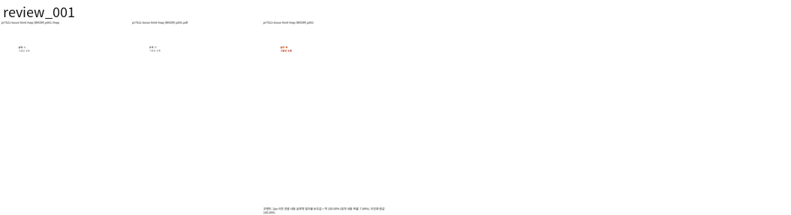
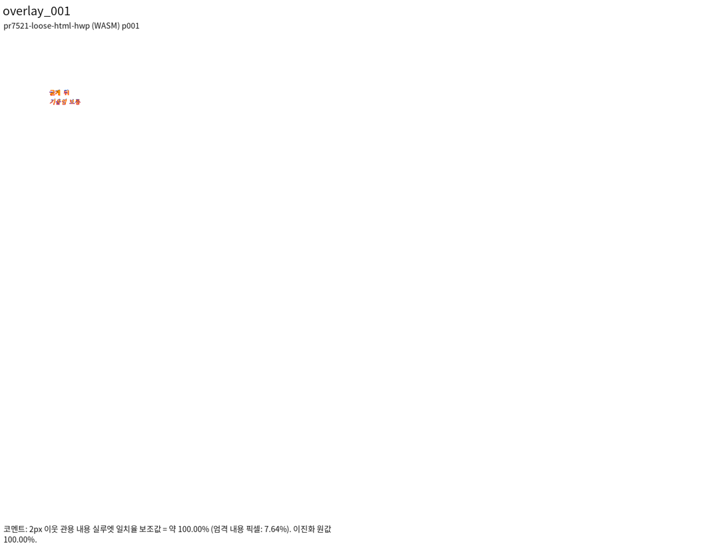

# PR #7521 리뷰 — 수정: #7516 HTML 붙여넣기가 
 밖 인라인 서식을 한 문단으로 살린다

## 최종 판정

**통합 후보 검토 충족 — code candidate CI 성공, 동일 PR 후행 기록의 최신 aggregate 확인 후 통합.** 실제 변경·회귀·독립 Print/직접 시각 확인 및 비조판 계약을 이 PR의 기록 범위에서 충족했다. 원 head 자체의 approve/merge와 구분하며, 누적 source8569f49ce와 통합 [PR #7601](https://github.com/edwardkim/rhwp/pull/7601)의 code candidate774fe4071 최신 원격 CI가 성공했다. 후행 기록 head의 aggregate와 merge 가능 상태까지 확인한 뒤 통합한다.

## 접수 정보

- 원 PR: [#7521](https://github.com/edwardkim/rhwp/pull/7521), semanticist21, devel 대상, non-draft.
- 원 head: `6f0df1ae38d6830128916c4e5f773da23a6be804`; 접수 시점 `MERGEABLE` / `CLEAN`. 원 head의 상태이며 누적 후보 판정이 아니다.
- 누적 branch: `review/semanticist21-20261005`; 고정 base `cdba77b609c399fdef26a6c9e637716aa32c2177`; 누적 code candidate `1d809afe7b965c9ea6137012d59d139d63b038d0`.
- Reviewer: jangster77 지정. 기본 maintainer_general; intake_and_review, local_validation, multi_pr_update_branch, 렌더 영향 시 visual_fixture_evidence를 적용.
- 관련 이슈: #7516.
- 사용자 지시: non-draft 19건을 번호 순으로 누적 체리픽; 충돌은 메인터너 보정; 원 PR별 리뷰 기록을 개별 작성.

## 적용 이력

| 원 commit SHA | 상태 | 로컬 적용 SHA | 메인터너 보정 |
| --- | --- | --- | --- |
| `37f754d514fa944d428fac5a1754eb07ed49d0f5` | applied | `381c4b1b5cda885f665b864db342570b028df27e` | — |
| `6f0df1ae38d6830128916c4e5f773da23a6be804` | applied | `a0b0989ef5a026b8381acbe6e6921b73eceaf18b` | — |

원 저자와 `cherry-pick -x` 출처를 보존했다. 이미 patch-id가 같은 원 commit은 중복 적용하지 않았다. 원 contributor branch는 수정하지 않았다.

## 변경·소비 경로 검토

- `src/document_core/commands/html_import.rs`

loose inline을 flush_inline_run에 모아 parse_inline_content의 style stack으로 읽는다. 안쪽 weight가 우선하며 br 뒤에는 열린 서식을 다시 연다. span 내부의 그림도 실제 parse 경로로 소비한다.

새 loose b/i 경로가 기존 4000자 강제 절단을 우회하는지 경계 검증이 필요하다. 기존 source 테스트 6개에는 긴 입력 경계가 없다. 합성 입력의 계약 결과를 한컴 출력과의 일치 증거로 바꾸지 않는다.

## 검증 입력·결과

- `tests/cases/issue_7516_html_paste_loose_inline_format.rs` (6개 테스트): 누적 head 실행 6 PASS / 0 FAIL

- 로컬 Cargo는 공유 `target/pr-review`에서 순차 실행한다. 같은 원 head의 CI를 19건 누적 후보의 전체 검증으로 재사용하지 않는다.
- 필수 fmt·Native/WASM/workspace-all-targets Clippy·workspace build·manifest/base 정책·source unit tier 검사: PASS. 전체 Rust·Native Skia·fresh WASM 및 직접 시각 검증은 진행 중.
- focused: `output/pr-review/semanticist21-20261005/run-records/focused-command.json`의 20 case 필터, 전체 74건 중 73 PASS / 1 FAIL. PR별 결과는 위 case 항목에서 구분한다. 실행 증거: `output/pr-review/semanticist21-20261005/logs/focused.log`.
- 실제 HWP/HWPX/PDF 입력과 commit의 해시, 독립 기준, source/build provenance: 입력 사용 시 기록한다.
- source 교정 또는 검사 실패가 생기면 이 PR의 보정과 재실행을 별도로 기록한다. Golden/baseline/래칫을 완화하지 않는다.

## 원 head CI 참고값

- Lint (fmt, clippy, WASM check): SUCCESS
- Build & Test: SUCCESS
- CI Impact Policy: SUCCESS

## 조판·시각 판정

적용 여부와 필요한 직접 증거를 확인 중이다. 원 PR 제공 before/after·수치를 누적 head의 Visual Sweep 통과로 간주하지 않는다. 자료 부족과 실제 회귀를 구분하여 미검증/미충족으로 판정한다.

## 남은 범위·후속 처리

원 PR 전체 해결 여부와 이슈 종료 표현은 직접 검증한 범위로 제한한다. 이 기록은 로컬 누적 검토이며 원격 approve/comment/merge를 의미하지 않는다. 통합 결과는 같은 누적 branch에 두고 원 PR별 판정이 확정된 뒤 게시 범위를 결정한다.

## 신규 회귀: 긴 loose inline 입력의 제한 우회

public API `pasteHtml(0,0,0,...)`로 ASCII `x` 8,001자를 실행했다. 최신 base의 Native 결과는 plain과 `<b>...</b>` 모두 문단 길이 `[4000,4000,1]`; 누적 fresh WASM은 plain `[4000,4000,1]`, bold `[8001]`이다. 새 `flush_inline_run`의 태그 포함 분기가 `FLUSH_LINE_CHAR_CAP=4000`을 적용하지 않고 parse_inline_content 한 문단을 발행한다. 기존 source 주석이 길이 제한을 명시하고 있으며 이 PR의 6개 회귀에는 해당 경계가 없다. 문단 수·길이의 신규 계약 회귀를 검출한 것이며 실제 overlap/전체 브라우저 정지까지 실행했다고 주장하지 않는다.

base 실행 (`output/pr-review/semanticist21-20261005/run-records/base-probes.txt`), `output/pr-review/semanticist21-20261005/historical-browser-raw/browser-observations.json`, `output/pr-review/semanticist21-20261005/historical-browser-raw/browser-observations.json`. Native base와 WASM 누적의 runtime 차이는 이후 같은 Native 경로에서도 확인하여 구분한다. source 회귀 추가와 스타일·그림·명시적 줄바꿈을 보존하는 제한 처리가 필요하다.

## 최종 공통 회귀 결과 (폼 source cf2336295)

Rust source `cf2336295540ea8ce3e94eb6517cb406fca8d28f`, 정책 base `cdba77b609c399fdef26a6c9e637716aa32c2177`에서 fmt·Clippy Native/WASM/workspace-all-targets·workspace build·manifest/unit tier 정책 PASS. 전체 nextest10,437건 중10,436 PASS/1 FAIL/50 SKIP이며 실패는 #7491의 편집 뒤 표 우변 assertion1건이다. 이 실패는 고정 base에서도 관측했다. Native Skia lib·missing picture2개·direct PDF4개·ComboBox4개·암호4개는 모두 PASS다. 명령/exit/시간은 검증 정본 (`output/pr-review/semanticist21-20261005/run-records/appearance-final-validation.json`), 요약과 원 로그 SHA는 실행 요약 (`output/pr-review/semanticist21-20261005/run-records/appearance-final-validation-summary.txt`)에 보존했다.

#7491은 사용자가 지정한 실패 입력에서 MCP 재산출 PDF·90% 시각 gate와 독립 기대값을 추가 검증 중이며, #7521의 loose inline 길이 제한 우회도 보류 사유로 남는다. 전체 회귀 통과 또는 통합 merge를 선언하지 않는다. 이후 Rust source/test 변경에는 이 결과를 그대로 승계하지 않고 해당 검증을 다시 수행한다.

## 승인된 메인터너 보정 진행

긴 loose inline을 기존4,000 Unicode scalar 문자 제한으로 분할하고 경계 그림의 선행 stream 공간을 보존했다. 동일 Native API 수정 전6 PASS/1 FAIL → 수정 후8 PASS. 인라인 파싱/CSS는 자식 module로 분리해 각 수정 파일을1000줄 이내로 유지했다. [개별 보정 기록](pr_7521_review_impl.md). 최종 lint/fresh WASM 및 누적 검증 전이므로 원격 승인/merge를 의미하지 않는다.

## upstream/devel 위 rebase 적용 위치 — 2026-10-05

기준 `c167dc6abbebf69546575e2d16d06223791bab82`. 아래는 현재 이력의 실제 적용 위치이며 위의 이전 검증 SHA는 당시 이력으로 보존한다.

| 원 commit SHA | rebase 전 로컬 SHA | 현재 적용 SHA | 상태 |
| --- | --- | --- | --- |
| `37f754d514fa944d428fac5a1754eb07ed49d0f5` | `381c4b1b5cda885f665b864db342570b028df27e` | `5bb3a1ae3eacc04a16e06e4fdfe9b3e554ae8812` | rebased |
| `6f0df1ae38d6830128916c4e5f773da23a6be804` | `a0b0989ef5a026b8381acbe6e6921b73eceaf18b` | `cb2bd912d5afc28e01015d79caf839664c942e63` | rebased |

원 저자와 cherry-pick 출처를 유지했다. #7491의 원4개는 #7599를 통해 이미 base에 포함되어 중복 적용하지 않았다. 메인터너 보정과 개별 리뷰 기록은 재배치했다. 최종 후보의 시각·전체 회귀 및 CI는 별도 확인한다.

## 2026-10-06 최종 후보의 Print·Native/fresh WASM 재검증

정책 base `c167dc6abbebf69546575e2d16d06223791bab82`, production source `2b1f21ef1ab35a13ebcae11f562a3ebf3a998e4d`, 회귀 source `9af7586586587fa0aa617a9e57fd6acd0d4e3ba6`. 두 head 사이에는 #7527의 Native 전용 회귀와 리뷰/PNG만 추가됐고 production source는 동일하다. 최종 fresh WASM SHA-256 `24565cae976b3c6929c858f13c52785a4651a26dc61c0fd566f5a8f801d631f7`, JS `70cde06a369fa7fd4fc8bc8f3d6acaee158596ba1a116a2c72159002b0b5654e`; root pkg/Studio public 해시를 대조했다.

| 검증 입력 | 출력 경로 | 전체 쪽별 실루엣(%) | Gate |
| --- | --- | --- | --- |
| `pr7521-loose-html-hwp` | native | p1 100.00000 | passed / 누락0 |
| `pr7521-loose-html-hwp` | wasm | p1 100.00000 | passed / 누락0 |

- [pr7521-loose-html.hwp](../../../mydocs/pr/assets/semanticist21-20261005/pr7521/pr7521-loose-html.hwp), SHA-256 `f10647b363c5431f68c2422be08d761b36b7b00b7581e58b837b9c3abf05b1fd` → [독립 Print PDF](../../../pdf/semanticist21-20261005/pr7521/mcp/pr7521-loose-html-2020.pdf), SHA-256 `e57e06422ea4ee6c1bf2abb6c8437a02bf9f7a96d165956bada80df141845c78`.

각 명령·TSV·manifest·runtime 원시는 ignored `output/pr-review/semanticist21-20261005`에 보존했다. 렌더는 같은 입력/Print 전체 페이지와 `--embed-fonts=full`을 사용했고 WASM은 `--wasm-pkg pkg`를 추가했다(#7504는 실제 등록 API replay adapter). 최종 전체 Rust 회귀와 GitHub CI는 별도 진행 중이다.

최종 페이지별 TSV: `output/pr-review/semanticist21-20261005/final-tsv/native/<key>/silhouette.tsv` 및 `wasm/<key>/silhouette.tsv`. 최신 full Sweep PNG 쌍에서 canonical `--silhouette-only --png-pair`로 산출하고 PNG SHA를 manifest에 고정했다. 해당 입력 전체 쪽수도 독립 PDF·원문 exporter에서 별도로 대조했으며 90% 미만/누락0이다.

## Merge 후 contributor PR comment 계획

원 기여에 감사한 뒤 실제 통합 PR 링크·merge SHA·정확한 최종 head CI와 이 PR의 회귀 실행 결과를 한국어 존댓말로 게시한다. 원 head는 merge 직전에 다시 확인하고 동일할 때만 통합으로 대체된 원 PR을 닫는다. 원 contributor fork branch는 삭제하지 않는다.

loose inline 서식 보존의 기여와 메인터너의4,000 Unicode scalar 분할 보정을 구분한다.

- 실제 비교 `pr7521-loose-html-hwp`의 p1 100.00000%를 페이지별 실루엣 보조값으로 적는다. 같은 입력 Native/fresh WASM 전체 쪽 TSV·누락0·직접 구조 판정을 함께 설명한다.
- merge SHA에서 존재를 확인한 `mydocs/pr/assets/semanticist21-20261005/pr7521/pr7521-loose-html-hwp-wasm-review-all-pages.png` / `mydocs/pr/assets/semanticist21-20261005/pr7521/pr7521-loose-html-hwp-wasm-overlay-all-pages.png`를 `raw.githubusercontent.com/edwardkim/rhwp/<merge-SHA>/...`의 실제 Markdown 이미지로 표시한다. 임시 output 링크로 대신하지 않는다.
- 이슈는 확인된 해결 범위만 다루고, 남은 조판·입력 축은 `Refs`와 원 이슈 링크로 유지한다. 게시 뒤 API로 실제 줄바꿈·한글·이미지 URL을 다시 확인한다.

## 2026-10-06 무효화 원장의 모듈 이동 추적

전체 회귀의 #2724 density 실패는 `html_import.rs`의5개 무효화 사이트 중2개가 `html_import/inline_content.rs`로 옮겨졌는데 파일별 원장에 반영되지 않은 결과다. 원 `css_to_char_shape_id`·`css_to_para_shape_id`의 새 서식표 추가 뒤 `doc_info.raw_stream_dirty = true`를 자식 모듈에서 확인했다. 원장의 parent3+child2로 합계5곳의 의무를 유지한다. 무효화 사이트 삭제나 기준 허용치 완화가 아니며 함수 분류·위임 검사와 density를 다시 실행한다.

## 최종 production 전쪽 재검증 — 2026-10-06

Production·검증 source `8569f49ce051ee343d58866a4f1e20a642d9e7fa`, 정책 base `c167dc6abbebf69546575e2d16d06223791bab82`를 검증했다. fresh WASM SHA-256 `410f8f3540f2856fcd7200a115f191a87aed4b2e726267bc54d960b35948735a`, JS `70cde06a369fa7fd4fc8bc8f3d6acaee158596ba1a116a2c72159002b0b5654e`; root `pkg`와 Studio public의 실제 바이트가 같다. Native binary SHA-256 `d4ff621918e81070809efe96555f9e484905f12c20d77f9a78f81ce4095fbe46`. 아래 결과는 원점 리셋 보정까지 포함한 최신 source의 재출력이다.

Native/fresh WASM 각각30항목·37쪽(합계74쪽 대응) 최신 재출력, 최저91.96451%, 90% 미만/누락/측정 불가/글꼴 예외0이다. canonical TSV: ignored `output/pr-review/semanticist21-20261005/ladder-reset-tsv/<native|wasm>/<key>/silhouette.tsv`. 입력·Print 출처와 직접 판독은 위 개별 증거를 따르며, [공통 렌더/TSV 명령·재출력 검증](../assets/semanticist21-20261005/README.md#문단-원점-리셋-보정의-최종-nativefresh-wasm-검증)에 연결한다. 전체 Rust 및 원격 CI 완료 여부는 다음 최종 판정에서 별도로 기록한다.

| 이 PR의 검증 입력 | 경로 | 독립 Print 전체 쪽 실루엣(%) | 판정 |
| --- | --- | --- | --- |
| `pr7521-loose-html-hwp` | native | p1 100.00000 | passed / 누락0 |
| `pr7521-loose-html-hwp` | wasm | p1 100.00000 | passed / 누락0 |

- 최신 source의 실제 브라우저3종 PASS(화면/질의/폼), source registry·fmt·Native/WASM/workspace-all-targets Clippy·workspace build·base manifest/unit-tier 정책 PASS. Native 선행33건 및 Cargo 집중32건은 각각 모두 PASS이며 최종 전체 nextest/Native Skia 결과는 다음 판정에 기록한다. 원시 로그·중간 JSON·TSV는 ignored `output/pr-review/semanticist21-20261005`에 보존한다.

## 최종 로컬 게이트 — production8569f49ce

정책 base `c167dc6abbebf69546575e2d16d06223791bab82`, 검증 source `8569f49ce051ee343d58866a4f1e20a642d9e7fa`. fmt·Native/WASM32/workspace-all-targets Clippy `-D warnings`·workspace build·manifest 및 source unit tier `--check --base-ref <base>` 모두PASS다. 파생 suite를 준비한 동일 review checkout의 `target/pr-review`에서 Cargo를 순차 실행했다.

- 전체 `cargo nextest run --locked --cargo-profile release-test --target-dir target/pr-review --tests --test-threads 12 --no-fail-fast`:10,491 PASS/0 FAIL/50 SKIP,706.118초, exit0.
- Native 선행33/ Cargo 집중32 모두PASS; 겹침16 partition 전체를 포함한다. 기존 fixture/baseline/래칫을 완화하지 않았다.
- Native Skia lib·missing picture·direct PDF·ComboBox·password 모두PASS. optional backend 검사를 원 head CI 또는 SVG 점수로 대신하지 않았다.
- fresh WASM/Studio 동기화·실제 화면/질의/폼3종·최신 Native/fresh WASM74쪽 대응/TSV 모두PASS(최저91.96451%, 미달/누락/측정 불가0, font exception0).

실제 명령·exit·시간은 ignored `output/pr-review/semanticist21-20261005/oct06-ladder-reset-validation-progress.json`, 원 출력은 `logs/oct06-ladder-reset-*.log`에만 보존한다. 각 단계의 마지막 summary는 아래 공통 증거 README에 기록한다. source가 바뀌면 이 실행 결과를 그대로 승계하지 않는다. 원 PR의 별도 CI와 누적 후보의 최신 원격 CI를 구분하며 통합 PR의 최종 head CI를 확인한 뒤 merge한다.

## 통합 PR #7601 code candidate CI와 후행 기록

[통합 PR #7601](https://github.com/edwardkim/rhwp/pull/7601), code candidate `774fe407160598bd029cbb13a3545ee30ca057df`의 [최신 head CI](https://github.com/edwardkim/rhwp/pull/7601/checks)가 모두 종료되어 성공/정상 생략을 확인했다. 정확한 run URL·결론은 [공통 CI 증거](../assets/semanticist21-20261005/README.md#통합-pr-7601-code-candidate-ci)에 기록했다. 원 PR의 별도 CI를 이 결과로 바꾸지 않는다.

Production source `8569f49ce051ee343d58866a4f1e20a642d9e7fa`의 최종 전체 nextest 로그에서 이 PR의 실제 검사 결과를 확인했다. 아래 PASS는 같은 source의 전체 실행이며 이전 원 PR의 보고를 승계한 값이 아니다.

| 원본 검사 | 실제 PASS | FAIL |
| --- | --- | --- |
| `tests/cases/issue_7516_html_paste_loose_inline_format.rs` | 8 | 0 |

이 commit은 개별 archive 기록·오늘할일·CI 증거만 보완한다. Rust source/tests와 fresh WASM은 위 검증 source와 같으며, 같은 PR의 후행 head 최신 aggregate를 확인한 뒤 일반 merge commit으로 통합한다. merge 뒤 확정되는 SHA·이슈 상태·원 PR별 코멘트는 GitHub 후속 기록으로 남긴다. 위 접수·중간 실패·진행 중 문구는 당시 source의 역사 기록이며 이 절의 최신 판정과 구분한다.
