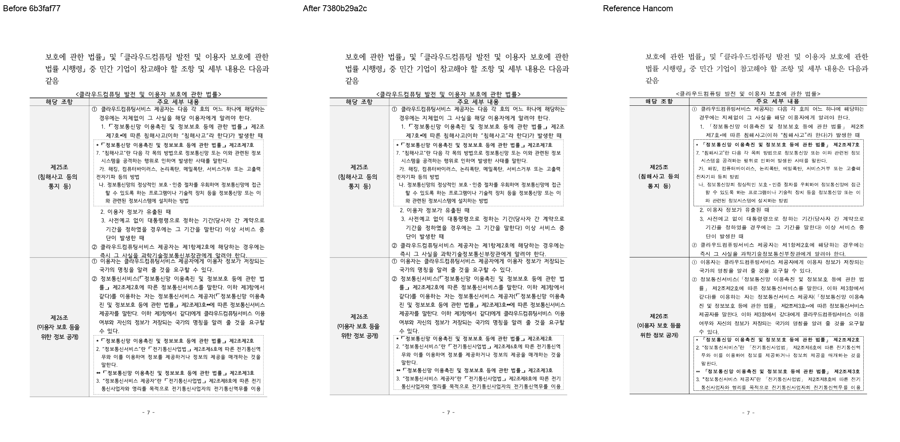
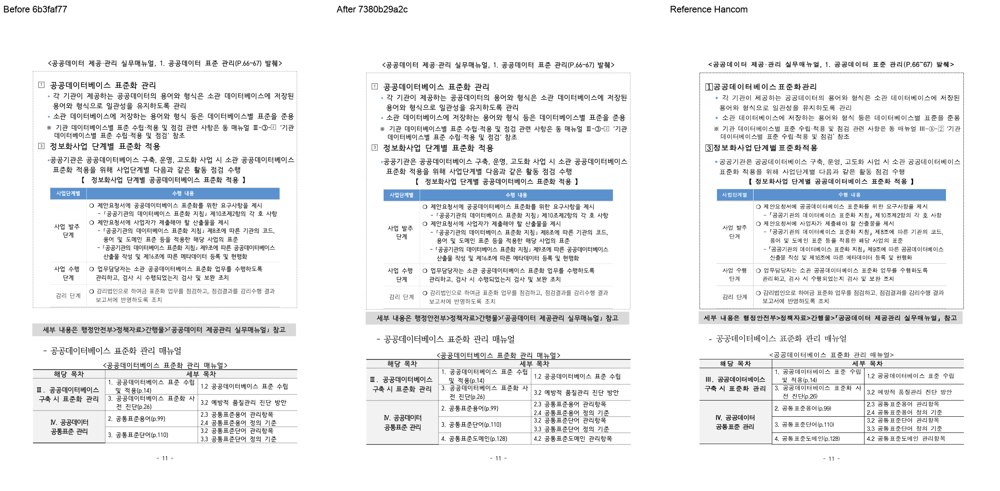

# PR #7567 리뷰 — RowBreak 조각의 물리 공간·내용 소유 복원

## 최종 판정

**승인 — 검증한 code head의 제한된 RowBreak 보정 범위를 수용한다.** 작성자 `postmelee`의
self-review 기록이며 GitHub Approve 제출이나 merge 승인을 뜻하지 않는다. 작업지시자는
2026-10-04 대표 이미지와 잔여 차이를 수용하고 push·PR 생성을 승인했다.
merge 전에는 문서 후행 head의 최신 required checks·mergeability와 별도 작업지시자 승인을 확인한다.

## 접수 정보

| 항목 | 값 |
| --- | --- |
| PR·작성자·base | [#7567](https://github.com/edwardkim/rhwp/pull/7567) / `postmelee` / `devel` |
| 검증 code SHA | `7380b29a2ce94be692e44e70cc65868cf87bc835` |
| 제출 시 문서 포함 head | `5b24c9ad8b56ccf9e581fe58db21186354a3f439`; code SHA 이후 문서·PNG만 추가 |
| 통합·정책 비교 base | `8497729b4fb0e071c484fc5740f9bb2400bed437` |
| 최초 수정 전 비교 코드 | `6b3faf77d8085441f9f26d88d65a49791e910352`; 최종 base와 구분 |
| 관련 이슈 | [#7470](https://github.com/edwardkim/rhwp/issues/7470) 참조. 부분 보정이므로 전체 종료하지 않음 |
| metadata | labels `layout`, `rendering`, `table`; assignee `postmelee`; milestone 없음; self-review이므로 review request 없음 |
| 접수 시점 상태 | Open·non-draft·MERGEABLE. 최초 CI 실행 중에는 BLOCKED였다. 최신 상태는 merge 직전에 다시 조회 |
| 규모 | 제출 시 75파일, +2,655/-184줄, 10 commit. 이미지·기록 포함. 1,000줄 초과 보조 경로 적용 |

## 변경과 검토 범위

실제 저장 RowBreak 원본에서 중첩 표의 끝 줄, 첫 조각의 빈 물리 밴드, 앞뒤 문단·표의
저장 원점을 측정·예약·실제 배치가 같은 결과로 소비하도록 복원했다. 선행 PR에는 사용자 승인에
따라 필요한 최소 공통 공백 메트릭 기초 11개 소스 파일을 포함한다. 나머지 공백·지도 보정 후보
`bac75f50ee4e57839f4c0ac7a259165acf0e3509`는 별도로 보존했고 이 PR 병합 뒤 재검증·제출한다.
기존 #7544의 본문이나 원 기여자 설명은 수정하지 않았다.

대형 PR의 self-review cycle에서는 아래 실제 호출 경로와 새 정식 검사 의미를 다시 대조했다.
local merge simulation·직접 시각 판독·작업지시자 판단을 별도로 수행했다.
전체 성능 수치는 미측정이며 표마다 원본 행 높이를 조회하는 추가 비용이 있을 수 있다.

## 조판 원칙 준수 검토

구체적인 일반/특수 호출 경로, 독립 HU 닫힘과 실패 후보의 반례는
[기존 작업 기록](../../working/task_m100_7470_stage1.md#실제-호출-경로와-반례)에 연결한다.

| 검토 항목 | 확인한 근거 | 판정 |
| --- | --- | --- |
| 구현 근거와 일반성 | 실제 저장본·대응 한컴 PDF와 원본 줄/셀 높이의 닫힘을 사용. 문서 ID·픽셀 맞춤 조건이나 새 clamp로 출력을 숨기지 않는다. 첫 선언 프레임을 소유하지 않는 교육과정 후반 행의 반례에서 413쪽을 보존한다. | 충족 |
| 측정·배치 일관성 | `SpaceMetric`을 `RowSegment`→LineSeg와 함께 발행하고 `ParagraphMetricScope`/compose run이 같은 규칙을 소비한다. `native_saved_two_line_row_frame`→cell units/strict cut/whole fit→fragment reservation→partial paint를 실제 코드로 대조했다. | 충족 |
| 분할·이어받기 계약 | 7→8·11→12쪽의 컷·소유, 선언 높이의 빈 밴드, 실제 수용 높이·예약·paint, 다음 내용 보존을 정식 출력 검사와 PDF로 대조. 단일 행은 두 프레임·후속 원점 전체 닫힘을 요구하며 원래 작은 높이를 수용한 뒤 paint만 확대하지 않는다. | 충족 |
| 줄 소속과 점유 높이 | 두 로컬 0 원점만으로 물리 분할을 추정하지 않는다. `14535 < 16840 < 17457HU`처럼 해당 행이 첫 선언 프레임 끝을 포함해야 한다. 저장 줄 출처와 편집 후 재조판 메트릭은 함께 교체·무효화한다. | 충족 |
| 사례와 독립성 | 수정하지 않은 저장 원본과 기준 PDF의 쪽·테두리·내용 순서가 기대값이다. 소유·셀 포함·앞뒤 순서는 실제 CLI render tree로 검사한다. 정상 소형/긴 표와 HWPX 반례도 전체 회귀에 포함했다. | 충족 |
| 기준값 변경 | 이 PR 자체의 기존 fixture/golden/baseline/허용치 변경 없음. 최신 base가 이미 포함한 변경을 이 PR의 변경으로 세지 않는다. | 비해당 |
| 주장과 검증 범위 | 아래 final code SHA의 회귀·lint·fresh WASM·직접 PNG와 사용자 수용을 확인했다. 편집 후 모든 문서의 한컴 시각 일치와 성능은 주장하지 않는다. | 제한된 제출 범위 충족; 확대 범위 미검증 |

원본 row frame 생산은 `src/renderer/layout/table_layout.rs:14237`, 원점 증거는
`src/renderer/typeset/table/continuation/fragment/budget.rs`, 컷·physical height 확정은
동일 디렉터리 `emit.rs:315`, 통표 수용 제외는 `table/block/whole_fit.rs:36`,
중첩 실제 하단 소비는 `src/renderer/layout/table_partial.rs:3700`에서 확인했다.
새 정식 검사 [6개](../../../tests/cases/issue_7470_rowbreak_source_frame_ownership.rs)는
쪽수·4.2/4.3 쪽 소유·중첩 끝 문장 한 번 소유·셀 내부 포함·빈 밴드·후속 원점·TAC/float 순서를 검사한다.
줄 자체의 존재만 검사하여 테두리 정확성을 주장하지 않는다.

## 검증 입력과 결과

검증 입력 커밋 확인은 **충족**이다. 아래 두 파일은 실제 실행 파일과 검토 head의 Git blob이
같고, 원본·PDF를 수정하지 않았다. [커밋 동일성 기록](../assets/issue7470_rowbreak_stage1/input-commit-verification.json).

| 입력·역할 | SHA-256 |
| --- | --- |
| `samples/rowbreak-problem-pages.hwp` — 실제 저장 원본 | `10b6ab6548610e18c82ba78a1c844a00107fedbb28c195cb05e6fd20626d33ed` |
| `pdf/rowbreak-problem-pages-hwp-2024.pdf` — 동일 원문 한컴 기준 18쪽 | `2c49bda9cc21dc8b93b554d2607da241dd7e894657eb308ed823e7d44654e85c` |

| 검증 | 실행 결과 |
| --- | --- |
| 정식 출력 소유 검사 6개 | 수정 전 5 FAIL/1 PASS, 최종 code 6 PASS. 실행 가능한 동일 CLI 기준이며 환경/빌드 실패를 FAIL 근거로 세지 않음 |
| 전체 nextest | `cargo nextest run --locked --cargo-profile release-test --target-dir target/pr-review --tests --test-threads 12 --no-fail-fast`: 10,270 PASS, 0 FAIL, 50 skip |
| fmt·필수 lint·workspace | fmt check, Native/WASM32/workspace all-target Clippy 세 단계, workspace build 모두 통과 |
| 정책 검사 | suite manifest/unit-tier `--check --base-ref 8497729b4fb0e071c484fc5740f9bb2400bed437` 통과. 파생 inventory/suite는 제출하지 않음 |
| Native Skia | library 3,927 PASS/13 ignored; placeholder 2 PASS; direct PDF 4 PASS |
| fresh WASM | 저장소 루트 locked wrapper 빌드 및 새 브라우저 출력 확인. pkg/Studio public JS·WASM SHA 동일. Docker daemon이 없어 표준 Docker 경로는 미실행이며 macOS 대체 검증 |
| OVR | 추적 개체가 있는 정상 대조군 5종의 쪽·x/y/w/h 변화 0건(2px 기준). `biz_plan`은 개체 0→0이므로 개체 무회귀 근거로 쓰지 않고 6쪽 유지 확인만 사용. RowBreak 개체 4건의 의도한 변화는 직접 PNG로 별도 확인 |
| GitHub CI | 제출 head의 [CI](https://github.com/edwardkim/rhwp/actions/runs/37179456333), [CodeQL](https://github.com/edwardkim/rhwp/actions/runs/37179456364), [Render Diff](https://github.com/edwardkim/rhwp/actions/runs/37179456208), [Adapter](https://github.com/edwardkim/rhwp/actions/runs/37179456327), [Proptest](https://github.com/edwardkim/rhwp/actions/runs/37179456343) 모두 success. 제출 head check 29 success/5 skipped, 실패·대기 0. [exact head 결과](../assets/issue7470_rowbreak_stage1/ci-code-candidate.json) |

명령·종료 코드: [순차 로컬 검증](../assets/issue7470_rowbreak_stage1/local-validation.json).
현재 검증 코드와 source/test가 같은 문서 후행 commit에는 Cargo 중복 실행을 생략한다.
code가 바뀌면 해당 검증을 다시 수행한다. 문서 push 전 실제 merge tree의 공백·링크·오늘할일
기록 보존을 검사하며 이후 PR 최신 head CI의 실제 재사용/Full 판정을 확인한다.

## 시각 증적과 남은 차이

Native·fresh WASM 각각 전체 18쪽, 최저 2쪽 **90.53132%**, 90% 미만·누락 0쪽이다.
정합 전 최저도 90.52231%다. 각 출력은 2px 이웃 관용 내용 실루엣과 경계 정합 7,117픽셀을
사용했다. 신규 정식 검사 추가 전 후보도 Native/fresh WASM 전체 18쪽이 90% 이상이었다.
최종 code에서 영향 페이지 2–8·11–16쪽 13개를 새로 캡처했고 두 출력의 PNG가 동일했다.
대표 review gate는 `passed`, 자동 flagged page는 0개이며 낮은 점수·누락 쪽은 없다.
TSV 통과만으로 시각 판정을 대신하지 않았고 compare/review/standalone overlay를 직접 열었다.

[전쪽 TSV·출처 설명](../assets/issue7470_rowbreak_stage1/README.md),
[빌드/입력 provenance](../assets/issue7470_rowbreak_stage1/provenance.json),
[픽셀·proxy·내용 실루엣/manifest 식별](../assets/issue7470_rowbreak_stage1/visual-metrics-summary.json),
[OVR 변화](../assets/issue7470_rowbreak_stage1/geometry-summary.json).
실행한 Visual Sweep 명령은 아래 형태다. 검증한 Native binary/fresh package는 provenance의 해시로
고정했고, 비공개 로컬 글꼴 공급 위치만 변수로 대체해 표시한다. 출력 위치는 임시 캡처 디렉터리다.

```sh
python scripts/visual_sweep.py --hwp samples/rowbreak-problem-pages.hwp \
  --pdf pdf/rowbreak-problem-pages-hwp-2024.pdf --key rowbreak-7380b29a2c-native \
  --rhwp-bin "${RHWP_BINARY}" --dpi 96 --embed-fonts full \
  --font-path "${LOCAL_TEST_FONTS}" --silhouette-only --out "${CAPTURE_DIR}/native-tsv"
python scripts/visual_sweep.py --hwp samples/rowbreak-problem-pages.hwp \
  --pdf pdf/rowbreak-problem-pages-hwp-2024.pdf --key rowbreak-7380b29a2c-native \
  --rhwp-bin "${RHWP_BINARY}" --dpi 96 --embed-fonts full \
  --font-path "${LOCAL_TEST_FONTS}" --pages 2-8,11-16 --out "${CAPTURE_DIR}/native-review"
```

fresh WASM는 같은 두 명령에 `--wasm-pkg "${FRESH_WASM_PACKAGE}"`를 추가하고
key/output을 WASM으로 구분했다. `export-wasm-for-sweep.mjs`가 새 package에서 원본 SVG·render tree를
출력했고 Native·WASM을 같은 PNG/PDF 좌표계에서 판독했다. 로컬 raw manifest는 공개하지 않으며
sanitized 요약에 manifest/TSV 식별과 측정값을 연결했다.

`visual_accuracy_proxy_percent`는 배경을 제외한 색상 픽셀 차이 보조값이며 내용 실루엣과 다르다.
13쪽 지표의 pixel match는 88.41074–93.78688%, visual proxy는 15.75488–65.78369%다.
낮은 proxy를 전체 충실도 통과로 표시하지 않는다.

7쪽 마지막 글줄의 셀 내부 표시와 8쪽 이어받기, 11쪽 4.2와 12쪽 4.3의 한 번 소유,
5쪽 뒤 문단, 14쪽 두 프레임 원점, 16쪽 TAC/float 순서를 확인했다.
글리프 굵기·가로 간격·일부 표 배경색·열 폭·작은 괘선 차이는 남는다. 예를 들어 4쪽 하단에는
약 13px, 12쪽 첫 행에는 약 3px의 기준 배치 차이가 남아 완전한 출력 일치를 주장하지 않는다.
글꼴 예외를 사용하지 않았다. 작업지시자가 이 제한을 포함한 대표 결과를 수용했다.





[대표 Native/fresh WASM review·overlay 전체](../assets/issue7470_rowbreak_stage1/gallery.html).
PR 본문에는 실행한 두 출력의 대표 review·overlay를 head SHA 고정 raw URL의 실제 Markdown 이미지로
표시했다. API 재조회로 한글/BOM/치환 문제를 확인하고 대표 raw PNG의 실제 바이트도 대조했다.
비공개 글꼴 원본·경로·글꼴을 포함한 SVG/중간 JSON은 공개하지 않는다.

## 후속 순서와 Merge 후 comment 계획

1. 완료: 제출 code 후보의 CI·CodeQL·Render Diff·Adapter·Proptest 통과. 다음: 이 self-review·오늘할일의 single-parent 문서 commit push → 최신 head CI 확인.
2. 작업지시자의 별도 merge 승인과 latest head match 확인 뒤 merge 가능 여부를 판단한다. self Approve나 admin 우회는 하지 않는다.
3. merge 후 같은 asset을 merge SHA 고정 URL로 한국어 존댓말 comment에 연결하고 API 재조회로 검증한다.
   이는 현재 comment/merge/issue close 승인이나 완료 보고가 아니다.
4. #7470은 부분 해결 범위를 유지한다. 보존한 공백·지도 후보를 최신 devel에서 재검증해 후속 PR로 제출한다.

후속 comment는 “RowBreak 분할 조각의 내용·빈 물리 공간과 앞뒤 배치를 보정했습니다.
Native/fresh WASM 전체 18쪽을 비교했고 최저 90.53%였습니다. 남은 글자·열 폭 차이와 공백·지도
후속 범위를 기록했으며 #7470 전체 종료는 보류합니다.”로 준비한다. 게시 시에는 최종 merge SHA·CI URL과
[Visual Sweep 정본](../../manual/verification/visual_sweep_guide.md#github-merge-comment),
`https://raw.githubusercontent.com/edwardkim/rhwp/<merge-sha>/mydocs/pr/assets/issue7470_rowbreak_stage1/native_review_p007.png`
등 merge SHA 고정 대표 review/overlay 이미지를 실제로 포함하고 `--body-file` 뒤 재조회한다.

문서 후행 push 전 simulation은 최신 base `8497729b4fb0e071c484fc5740f9bb2400bed437`에서
충돌 없이 종료했고 실제 merge tree의 공백·4개 Markdown 링크·기존 오늘할일 230개 보존을 확인했다.
원격 base와 제출 head가 같은지도 재조회했다. 후행 head의 CI는 push 뒤 별도로 확인한다.
