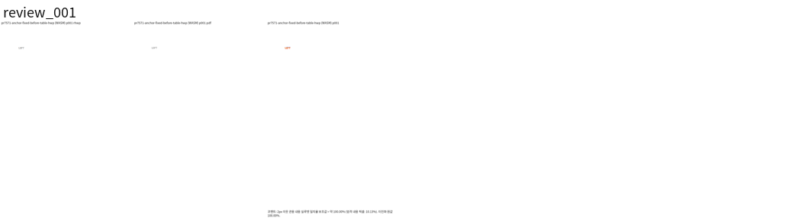
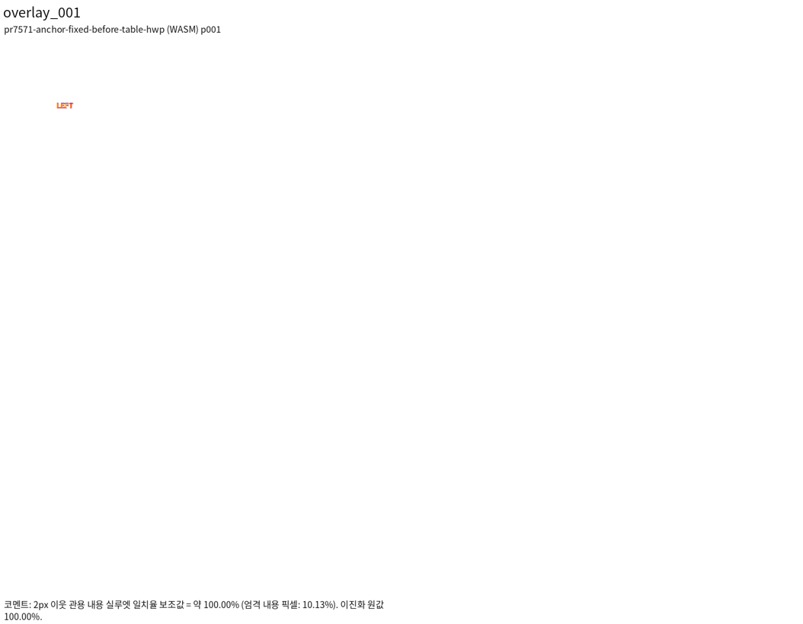
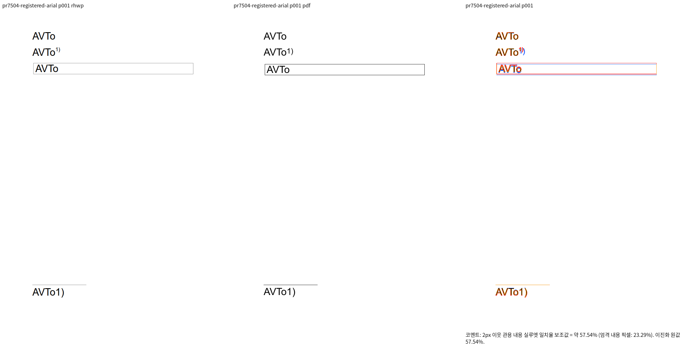
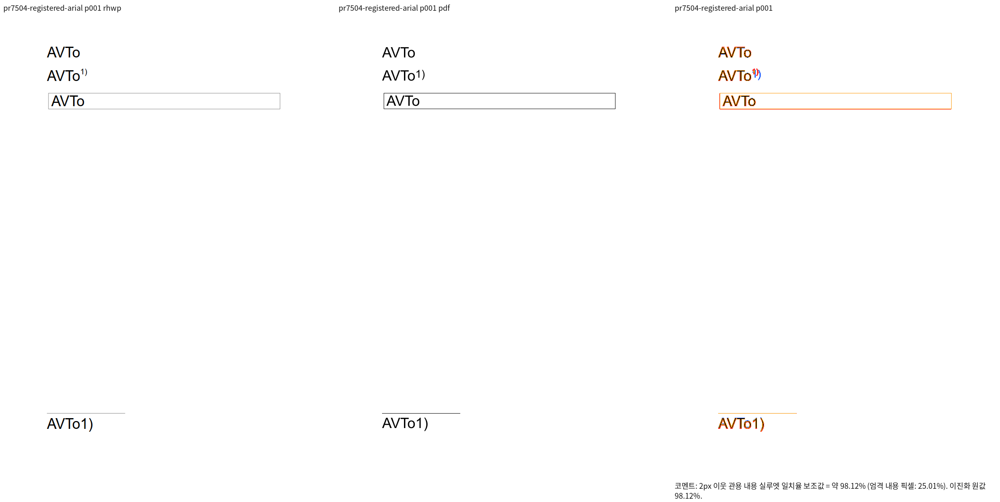
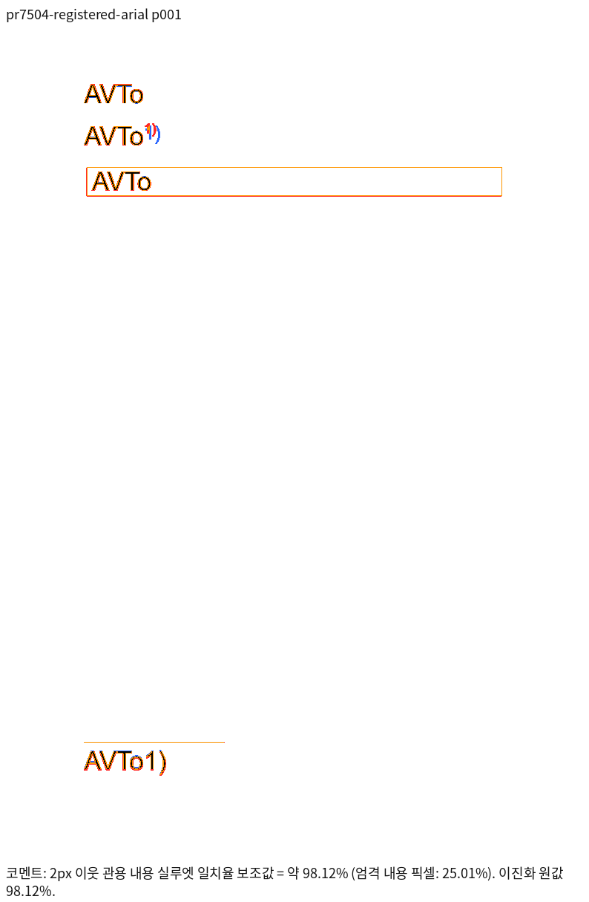

# PR #7571 리뷰 — fix: preserve paragraph breaks when creating tables in empty hosts

## 최종 판정

**통합 후보 검토 충족 — code candidate CI 성공, 동일 PR 후행 기록의 최신 aggregate 확인 후 통합.** 실제 변경·회귀·독립 Print/직접 시각 확인 및 비조판 계약을 이 PR의 기록 범위에서 충족했다. 원 head 자체의 approve/merge와 구분하며, 누적 source8569f49ce와 통합 [PR #7601](https://github.com/edwardkim/rhwp/pull/7601)의 code candidate774fe4071 최신 원격 CI가 성공했다. 후행 기록 head의 aggregate와 merge 가능 상태까지 확인한 뒤 통합한다.

## 접수 정보

- 원 PR: [#7571](https://github.com/edwardkim/rhwp/pull/7571), semanticist21, devel 대상, non-draft.
- 원 head: `989e0881e5a2e7ff7d69d2249d914d9597db0bfb`; 접수 시점 `MERGEABLE` / `CLEAN`. 원 head의 상태이며 누적 후보 판정이 아니다.
- 누적 branch: `review/semanticist21-20261005`; 고정 base `cdba77b609c399fdef26a6c9e637716aa32c2177`; 누적 code candidate `1d809afe7b965c9ea6137012d59d139d63b038d0`.
- Reviewer: jangster77 지정. 기본 maintainer_general; intake_and_review, local_validation, multi_pr_update_branch, 렌더 영향 시 visual_fixture_evidence를 적용.
- 관련 이슈: PR 본문과 실제 변경 범위에서 추가 확인 필요.
- 사용자 지시: non-draft 19건을 번호 순으로 누적 체리픽; 충돌은 메인터너 보정; 원 PR별 리뷰 기록을 개별 작성.

## 적용 이력

| 원 commit SHA | 상태 | 로컬 적용 SHA | 메인터너 보정 |
| --- | --- | --- | --- |
| `dec4e1880f1392c3bbc3bb55998a0c4f4dd3727c` | applied | `ef5b522d44373303dbd82a771a72f1ca95734827` | — |
| `5e2047e256372a081b2634928d3866c544d736c7` | applied | `37e6bfbdcbf97d7d1c8a2d17ef44373dc5dccafd` | — |
| `95820ef52bee3d74dcbccce15cdeb0bb31fa29dd` | applied | `0f76e8953dde8f93a7ee04a7998165a56e011755` | — |
| `989e0881e5a2e7ff7d69d2249d914d9597db0bfb` | applied | `b2e0bad8c83c164c5c8345849951bae7370a0128` | — |

원 저자와 `cherry-pick -x` 출처를 보존했다. 이미 patch-id가 같은 원 commit은 중복 적용하지 않았다. 원 contributor branch는 수정하지 않았다.

## 변경·소비 경로 검토

- `src/document_core/commands/object_ops/table.rs`

create_table의 빈 host 교체에서 column_type·raw_break_type·page_break_synthesized를 유지한다. 비어 있지 않은 host split은 기존 경로를 따른다.

분단/분쪽 host, 정상 empty host와 split 대조군, snapshot undo 및 저장 provenance를 검사한다. 합성 입력의 계약 결과를 한컴 출력과의 일치 증거로 바꾸지 않는다.

## 검증 입력·결과

- `tests/cases/table_creation_preserves_host_break.rs` (4개 테스트): 누적 head 실행 4 PASS / 0 FAIL

- 로컬 Cargo는 공유 `target/pr-review`에서 순차 실행한다. 같은 원 head의 CI를 19건 누적 후보의 전체 검증으로 재사용하지 않는다.
- 필수 fmt·Native/WASM/workspace-all-targets Clippy·workspace build·manifest/base 정책·source unit tier 검사: PASS. 전체 Rust·Native Skia·fresh WASM 및 직접 시각 검증은 진행 중.
- focused: `output/pr-review/semanticist21-20261005/run-records/focused-command.json`의 20 case 필터, 전체 74건 중 73 PASS / 1 FAIL. PR별 결과는 위 case 항목에서 구분한다. 실행 증거: `output/pr-review/semanticist21-20261005/logs/focused.log`.
- 실제 HWP/HWPX/PDF 입력과 commit의 해시, 독립 기준, source/build provenance: 입력 사용 시 기록한다.
- source 교정 또는 검사 실패가 생기면 이 PR의 보정과 재실행을 별도로 기록한다. Golden/baseline/래칫을 완화하지 않는다.

## 원 head CI 참고값

- Lint (fmt, clippy, WASM check): SUCCESS
- Build & Test: SUCCESS
- CI Impact Policy: SUCCESS

## 조판·시각 판정

적용 여부와 필요한 직접 증거를 확인 중이다. 원 PR 제공 before/after·수치를 누적 head의 Visual Sweep 통과로 간주하지 않는다. 자료 부족과 실제 회귀를 구분하여 미검증/미충족으로 판정한다.

## 남은 범위·후속 처리

원 PR 전체 해결 여부와 이슈 종료 표현은 직접 검증한 범위로 제한한다. 이 기록은 로컬 누적 검토이며 원격 approve/comment/merge를 의미하지 않는다. 통합 결과는 같은 누적 branch에 두고 원 PR별 판정이 확정된 뒤 게시 범위를 결정한다.

## 최종 공통 회귀 결과 (폼 source cf2336295)

Rust source `cf2336295540ea8ce3e94eb6517cb406fca8d28f`, 정책 base `cdba77b609c399fdef26a6c9e637716aa32c2177`에서 fmt·Clippy Native/WASM/workspace-all-targets·workspace build·manifest/unit tier 정책 PASS. 전체 nextest10,437건 중10,436 PASS/1 FAIL/50 SKIP이며 실패는 #7491의 편집 뒤 표 우변 assertion1건이다. 이 실패는 고정 base에서도 관측했다. Native Skia lib·missing picture2개·direct PDF4개·ComboBox4개·암호4개는 모두 PASS다. 명령/exit/시간은 검증 정본 (`output/pr-review/semanticist21-20261005/run-records/appearance-final-validation.json`), 요약과 원 로그 SHA는 실행 요약 (`output/pr-review/semanticist21-20261005/run-records/appearance-final-validation-summary.txt`)에 보존했다.

#7491은 사용자가 지정한 실패 입력에서 MCP 재산출 PDF·90% 시각 gate와 독립 기대값을 추가 검증 중이며, #7521의 loose inline 길이 제한 우회도 보류 사유로 남는다. 전체 회귀 통과 또는 통합 merge를 선언하지 않는다. 이후 Rust source/test 변경에는 이 결과를 그대로 승계하지 않고 해당 검증을 다시 수행한다.

## upstream/devel 위 rebase 적용 위치 — 2026-10-05

기준 `c167dc6abbebf69546575e2d16d06223791bab82`. 아래는 현재 이력의 실제 적용 위치이며 위의 이전 검증 SHA는 당시 이력으로 보존한다.

| 원 commit SHA | rebase 전 로컬 SHA | 현재 적용 SHA | 상태 |
| --- | --- | --- | --- |
| `dec4e1880f1392c3bbc3bb55998a0c4f4dd3727c` | `ef5b522d44373303dbd82a771a72f1ca95734827` | `a8f4062310e3d0e4fa3aa5c4603ad214c94ea69b` | rebased |
| `5e2047e256372a081b2634928d3866c544d736c7` | `37e6bfbdcbf97d7d1c8a2d17ef44373dc5dccafd` | `a7e07c3ad47c78b828a3030832e8fadd498ccacd` | rebased |
| `95820ef52bee3d74dcbccce15cdeb0bb31fa29dd` | `0f76e8953dde8f93a7ee04a7998165a56e011755` | `cdf43a352b4b291bcd2125969ed796178949e862` | rebased |
| `989e0881e5a2e7ff7d69d2249d914d9597db0bfb` | `b2e0bad8c83c164c5c8345849951bae7370a0128` | `34a4eede3de7ba4b712be5ef3d7a0e4e13604dfa` | rebased |

원 저자와 cherry-pick 출처를 유지했다. #7491의 원4개는 #7599를 통해 이미 base에 포함되어 중복 적용하지 않았다. 메인터너 보정과 개별 리뷰 기록은 재배치했다. 최종 후보의 시각·전체 회귀 및 CI는 별도 확인한다.

## rebase 후 MCP 직접 출력 검토 — 2026-10-05

원 회귀와 같은 공개 API 경로(빈 문서2단→HWPX 재개방→LEFT 입력→단 나누기→빈 host 표 삽입)를 HWP로 저장한 입력은 MCP job `e7d73495-9ed6-48ce-926a-0691f1be3b2c`에서 300초 시간 초과다. Print PDF가 없으므로 시각 미검증이다. 표 삽입 전의 단 나누기 HWP 및 삽입 후 HWPX/한 단 쪽나누기 대조군을 별도 MCP 진단으로 원인 분리 중이다. 시간 초과를 회귀 PASS나 font 예외로 대체하지 않는다.

## 실제 저장 경로의 재검증 — 2026-10-06

앞의 시간 초과 입력은 진단 생성기가 `DocumentCore.export_hwp_native()`로 production adapter를 우회했다. 시간 초과·줄 캐시 제거·instance ID 변경·노트 레코드 대조 결과는 그 저수준 입력의 진단으로 유지하고 실제 저장 경로의 실패 증거에서 제외한다. `export_hwp_with_adapter_snapshot()`으로 다시 만든 단 나누기/표 입력 HWP·HWPX는 모두 한컴2020 Print 성공이다. Native 전쪽은 표 전 HWP100%, 표 후 HWP60.90026%/HWPX100%. 표 후 HWP의 대표 PNG를 직접 판독해 단 소속·내용은 보존되지만 위 바깥여백만큼 표 상단이 어긋남을 확인했다. 미달이므로 보정을 계속하며 승인으로 판정하지 않는다.

원인 생산 경로는 표 생성의 폭0 개체 앵커 LineSeg → `reflow_paragraph` → `reflow_line_segs_impl`의 빈 문단 분기에서 본문 단 폭으로 덮어쓰기 → 실제 HWP snapshot 저장 → `object_only_saved_table_anchor`/바깥 프레임 예약 → table paint다. 독립 한컴 저장본은 폭0 앵커를 사용한다. 이미 폭0인 단일 floating table의 빈 호스트를 재조판할 때 같은 개체 앵커 의미를 보존하는 보정으로 확인한다. TAC·본문 텍스트·일반 빈 문단을 이 개체 앵커로 바꾸지 않는다. 새 저장본의 독립 Print와 Native/fresh WASM90%를 확인한 뒤 관계 회귀를 추가한다.

### 2026-10-06 메인터너 보정의 독립 근거와 실제 소비 경로

- 실제 사용자 저장 API와 같은 `export_hwp_with_adapter_snapshot`으로 저장한 2단 입력을 한컴 2020 MCP Print로 출력했다. 빈 호스트의 표는 새 단의 원점에서 바깥 위여백을 가진다. 저수준 `export_hwp_native`만 호출한 이전 변환 실패는 제품 저장 경로의 증거에서 제외했다.
- 편집 reflow가 단일 floating table의 폭 0 개체 앵커를 본문 폭으로 바꾼다. 폭 0 보존 후에도 Native 일치율은 **60.90026%**다. `column-anchor-fixed-inputs/`와 `column-anchor-fixed-native-scores/`에 입력·실패 출력·MCP Print PDF를 보존했다.
- 실제 원점 소비 연결: `composer/line_breaking.rs`의 빈 문단 줄 생산 → `typeset/table/host_spacing.rs::resolve`의 이미 계상된 바깥 앞/뒤 간격 → `block/entry.rs`의 공통 `ParagraphFloatPlacement` 및 `occupied_bottom` fit → `layout/table_layout.rs`의 확정 `table_top` 소비. 기존 빈 reflow 경로는 저장 줄이 없어야 하고, 저장 글 경로는 보이는 글이 있어야 해서 폭 0 개체 앵커가 둘 모두에서 빠졌다. 출력 폴백은 새 단에서 바깥 위여백을 다시 더하지 않는다.
- 보정 범위: 글줄이 없는 빈 호스트와 유효한 폭 0 개체 앵커의 문단 기준·상단·비음수 오프셋 표에 포맷된 바깥 상자를 공유한다. 보이는 글·공백 글줄, 절대 좌표, 음수 오프셋, 다른 개체와 혼재한 호스트는 기존 계약을 유지한다. 기존 닫힌 저장 프레임·캡션 경로가 우선한다. 표의 실제 높이와 호스트 간격을 중복 계상하지 않는다.
- 현재 회귀 후보는 ignored output에만 두었다. 수정 전 실제 저장 후 앵커 폭 검사는 FAIL, 폭 보존 후 PASS지만, 이것만으로 시각 결함 해결을 판정하지 않는다. Native/fresh WASM의 관련 모든 페이지가 90% 이상이고 직접 판독한 뒤에만 정식 회귀 검사를 추가한다.

- 바깥 상자 공유 보정 후 Native 재출력: 표 삽입 전 HWP / 삽입 후 HWP / 삽입 후 HWPX **각 100%**, 각 1쪽, 누락 쪽 없음. 입력과 Print 기준은 보정 전의 같은 바이트를 유지했고 `column-outer-box-native-scores/`에 새 TSV를 산출했다. fresh WASM과 직접 PNG 판독 및 최종 회귀는 아직 완료하지 않았다.

## 전쪽 선행 시각 검증과 정식 회귀 — 2026-10-06

production source `693b63b26`의 Native/fresh WASM 24개 입력·28쪽을 같은 Print PDF로 재출력했다. 누락 쪽 없이 두 경로 모두 최저93.40356%다. 해당 PR의 상세 입력은 아래에 고정한다. raw TSV·실행 JSON은 ignored `output/pr-review/semanticist21-20261005/final-693-{native,wasm}-scores/`에 보존했다. 이 수치는 2px 이웃 관용 내용 실루엣이며 엄격 픽셀 동일률과 구분한다. 최종 전체 회귀·lint·CI 및 개별 직접 판독은 완료하지 않았다.

| 입력 | 입력 SHA-256 | Print PDF | PDF SHA-256 | MCP job |
| --- | --- | --- | --- | --- |
| `mydocs/pr/assets/semanticist21-20261005/pr7571/pr7571-anchor-fixed-before-table.hwp` | `985a147122d1bc2ef15efe89b74e0ad5fd3bee724f42d465f46ef2ea8ec0e378` | `pdf/semanticist21-20261005/pr7571/mcp/pr7571-anchor-fixed-before-table-hwp-2020.pdf` | `0c4668dd5652be95103eed30e41c232d5611e9b23e9dcb0d97526f1138db3f56` | `dd087a86-c1a0-4132-aa7d-95f1147551b1` |
| `tests/fixtures/issue7571/column-table-outer-box.hwp` | `528175185005c0ec6096ae3a96b782b2e90883a95a4849b614f9e1f8446c18b7` | `pdf/semanticist21-20261005/pr7571/mcp/pr7571-anchor-fixed-column-table-hwp-2020.pdf` | `d3db38c9094a8327fb2d9804fc69ca088a613a2d7d0be81d2a1b4b5de872a68a` | `ba5778c6-8da6-49da-9547-16b1df0d5943` |
| `mydocs/pr/assets/semanticist21-20261005/pr7571/pr7571-anchor-fixed-column-table.hwpx` | `b6ec31d4d6f4db2480fa2e2212ee7de69ed29102525de701b4b9ddb771c7c979` | `pdf/semanticist21-20261005/pr7571/mcp/pr7571-anchor-fixed-column-table-hwpx-2020.pdf` | `8a834248e4535c790ec78404488b14fc1345cd31c934959268d291ffffe9ff1d` | `d2764c0d-1f61-474b-b121-9afe689d192e` |

- 모든3개 입력은 Native/fresh WASM 전쪽100%다. 단 나누기 기존4개 + 실제 저장의 폭 0 보존/새 단 바깥 상자 소유2개, **nextest6 PASS**. 새2개는 source `c20ffb351` 라이브러리에 연결하면 의도한 원인으로 FAIL(폭20124≠0, 여백비율0≠0.00665569), 보정 라이브러리에서는 모두 PASS다. 실제 배치는 본문 폭·원본 HWPUNIT의 무차원 비율과 단/셀 소속으로 검사하며 절대 픽셀이나 SVG 해시로 고정하지 않았다.

## 2026-10-06 최종 후보의 Print·Native/fresh WASM 재검증

정책 base `c167dc6abbebf69546575e2d16d06223791bab82`, production source `2b1f21ef1ab35a13ebcae11f562a3ebf3a998e4d`, 회귀 source `9af7586586587fa0aa617a9e57fd6acd0d4e3ba6`. 두 head 사이에는 #7527의 Native 전용 회귀와 리뷰/PNG만 추가됐고 production source는 동일하다. 최종 fresh WASM SHA-256 `24565cae976b3c6929c858f13c52785a4651a26dc61c0fd566f5a8f801d631f7`, JS `70cde06a369fa7fd4fc8bc8f3d6acaee158596ba1a116a2c72159002b0b5654e`; root pkg/Studio public 해시를 대조했다.

| 검증 입력 | 출력 경로 | 전체 쪽별 실루엣(%) | Gate |
| --- | --- | --- | --- |
| `pr7571-anchor-fixed-before-table-hwp` | native | p1 100.00000 | passed / 누락0 |
| `pr7571-anchor-fixed-column-table-hwp` | native | p1 100.00000 | passed / 누락0 |
| `pr7571-anchor-fixed-column-table-hwpx` | native | p1 100.00000 | passed / 누락0 |
| `pr7571-anchor-fixed-before-table-hwp` | wasm | p1 100.00000 | passed / 누락0 |
| `pr7571-anchor-fixed-column-table-hwp` | wasm | p1 100.00000 | passed / 누락0 |
| `pr7571-anchor-fixed-column-table-hwpx` | wasm | p1 100.00000 | passed / 누락0 |

- [pr7571-anchor-fixed-before-table.hwp](../../../mydocs/pr/assets/semanticist21-20261005/pr7571/pr7571-anchor-fixed-before-table.hwp), SHA-256 `985a147122d1bc2ef15efe89b74e0ad5fd3bee724f42d465f46ef2ea8ec0e378` → [독립 Print PDF](../../../pdf/semanticist21-20261005/pr7571/mcp/pr7571-anchor-fixed-before-table-hwp-2020.pdf), SHA-256 `0c4668dd5652be95103eed30e41c232d5611e9b23e9dcb0d97526f1138db3f56`.
- [column-table-outer-box.hwp](../../../tests/fixtures/issue7571/column-table-outer-box.hwp), SHA-256 `528175185005c0ec6096ae3a96b782b2e90883a95a4849b614f9e1f8446c18b7` → [독립 Print PDF](../../../pdf/semanticist21-20261005/pr7571/mcp/pr7571-anchor-fixed-column-table-hwp-2020.pdf), SHA-256 `d3db38c9094a8327fb2d9804fc69ca088a613a2d7d0be81d2a1b4b5de872a68a`.
- [pr7571-anchor-fixed-column-table.hwpx](../../../mydocs/pr/assets/semanticist21-20261005/pr7571/pr7571-anchor-fixed-column-table.hwpx), SHA-256 `b6ec31d4d6f4db2480fa2e2212ee7de69ed29102525de701b4b9ddb771c7c979` → [독립 Print PDF](../../../pdf/semanticist21-20261005/pr7571/mcp/pr7571-anchor-fixed-column-table-hwpx-2020.pdf), SHA-256 `8a834248e4535c790ec78404488b14fc1345cd31c934959268d291ffffe9ff1d`.

각 명령·TSV·manifest·runtime 원시는 ignored `output/pr-review/semanticist21-20261005`에 보존했다. 렌더는 같은 입력/Print 전체 페이지와 `--embed-fonts=full`을 사용했고 WASM은 `--wasm-pkg pkg`를 추가했다(#7504는 실제 등록 API replay adapter). 최종 전체 Rust 회귀와 GitHub CI는 별도 진행 중이다.

최종 페이지별 TSV: `output/pr-review/semanticist21-20261005/final-tsv/native/<key>/silhouette.tsv` 및 `wasm/<key>/silhouette.tsv`. 최신 full Sweep PNG 쌍에서 canonical `--silhouette-only --png-pair`로 산출하고 PNG SHA를 manifest에 고정했다. 해당 입력 전체 쪽수도 독립 PDF·원문 exporter에서 별도로 대조했으며 90% 미만/누락0이다.

## Merge 후 contributor PR comment 계획

원 기여에 감사한 뒤 실제 통합 PR 링크·merge SHA·정확한 최종 head CI와 이 PR의 회귀 실행 결과를 한국어 존댓말로 게시한다. 원 head는 merge 직전에 다시 확인하고 동일할 때만 통합으로 대체된 원 PR을 닫는다. 원 contributor fork branch는 삭제하지 않는다.

production adapter를 우회한 초기 입력은 결함 증거에서 제외하고 실제 저장 Print60.90→100%, 폭0 앵커/바깥 상자 보정을 설명한다.

- 실제 비교 `pr7571-anchor-fixed-before-table-hwp`의 p1 100.00000%를 페이지별 실루엣 보조값으로 적는다. 같은 입력 Native/fresh WASM 전체 쪽 TSV·누락0·직접 구조 판정을 함께 설명한다.
- merge SHA에서 존재를 확인한 `mydocs/pr/assets/semanticist21-20261005/pr7571/pr7571-anchor-fixed-before-table-hwp-wasm-review-all-pages.png` / `mydocs/pr/assets/semanticist21-20261005/pr7571/pr7571-anchor-fixed-before-table-hwp-wasm-overlay-all-pages.png`를 `raw.githubusercontent.com/edwardkim/rhwp/<merge-SHA>/...`의 실제 Markdown 이미지로 표시한다. 임시 output 링크로 대신하지 않는다.
- 이슈는 확인된 해결 범위만 다루고, 남은 조판·입력 축은 `Refs`와 원 이슈 링크로 유지한다. 게시 뒤 API로 실제 줄바꿈·한글·이미지 URL을 다시 확인한다.

## 2026-10-06 전체 회귀 실패와 저장 조각 소유 보정

`9af758658`의 전체 nextest는 10,489 실행 / 10,452 PASS / 37 FAIL / 50 SKIP, exit100이다. 앞의 대상 문서 시각 통과를 전체 회귀 통과로 확대하지 않는다. 단계별로 보존한 실제 라이브러리에서 #7062 3개+#6761 5개를 같은 입력으로 실행했다: `c20ffb351` 이전 보정은8 PASS, `693b63b26` 이후에는4 PASS/4 FAIL이다. 무효화나 글꼴 보정이 아닌 이 PR의 바깥 상자 확대가 원인이다.

잘못된 가정은 폭0 저장 표 앵커를 모두 통째 표의 포맷 상자로 취급한 것이다. #7571 입력은 `TablePageBreak::None`, 기존 #7062 입력은 `RowBreak`이고 원본 조각의 줄 원점·높이·단 소유를 갖는다. 새 저장 앵커 경로는 분할되지 않는 표만 통째 상자로 다루고, 분할 표는 기존 source-control-frame/첫 조각 변환을 유지한다. 저장 줄 없는 재조판 경로는 기존 계약을 따른다. 공통 판정의 소비 위치는 `ParagraphFloatPlacement::from_empty_reflow_host` → block entry의 fit/예약 → prepare의 첫 조각 변환·host 줄 점유 → 실제 표 배치다.

보정 후 같은8건은8 PASS/0 FAIL이다. 로그는 `output/pr-review/semanticist21-20261005/fragment-owner-corrected-tests.log`, 전후 분리 실행은 `failure-isolation-*-tests.log`에 보존했다. 전체 실패37건과 #7571 관계 회귀를 묶어 재실행하며 새 Native/fresh WASM 결과를 확인하기 전에는 통합 판정을 갱신하지 않는다. 기존 회귀 assertion·overflow/overlap baseline은 유지했다.

분할 표를 구분한 첫 보정의 focused 실행은59건 중57 PASS/2 FAIL이다. 남은 `hwpspec.hwp`의 겹침9건은 분할되지 않는 표에서도 같은 프레임의 원본 앵커를 통째 포맷 상자로 바꾼 결과였다. 실제 frozen library 분리 실행에서 바깥 상자 확대 전0건/확대 뒤9건/분할 표만 제외한 뒤9건임을 확인했다(`hwpspec-overlap-*.log`). 새 쪽·단을 여는 명시적 flow break에서만 통째 표의 새 프레임 상자를 소비하도록 원점 소유를 바로잡는다. 같은 프레임의 저장 표는 기존 원본 앵커를 유지하며, 분할 표도 원본 조각 계약을 유지한다. 단순 폭0은 원본 프레임을 버리는 근거가 아니다. 이 보정의 재검증은 진행 중이다.

## 2026-10-06 동일 프레임 표의 공통 원점 보정

등록 Arial의 독립 Print 대조군에서 표 외곽이57.53754%로 퇴행했다. 명시적 Page/Column에만 상자 공유를 제한하면 일반 프레임의 바깥 위 여백이 빠졌다. `flow_with_text`는 본문 영역의 세로 제한 속성이므로 이를 문서별 예외 조건으로 사용하지 않는다. RowBreak/CellBreak의 조각 소유는 별도로 유지한다.

원점 생산·소비 경로는 `section::flow`의 표 진입 → `section::vpos::vpos_snap_current_height`/`HeightCursor` → `table::block::entry`의 `from_empty_reflow_host` → 전체 fit·예약 → `prepare`의 첫 조각 계획 → `layout`의 공유 placement다. 기존 표 진입은 저장 좌표 보정을 생략하고 공유 상자를 원시 흐름에 고정했다. 또한 인라인 제목 도형으로 시작하는 저장 쪽의 paint는 page_base0인데 측정은 제목 vpos를 base로 빼고 있었다. `hwpspec.hwp`의15/16/20번0-based 쪽에서 제목 원점1200/1200/200HU가 이 경로로 갈린다.

보정은 기존 paint의 저장 제목 원점 판정을 `height_cursor_stored_origin.rs`로 추출해 측정과 공유한다. 동일 프레임의 유효한 폭0·통째 표는 같은 HeightCursor 보정 후의 원점에서 before/body/after 상자를 만든다. 새 프레임·분할 표·합성/편집된 사다리는 각 기존 원점 계약을 유지한다. 절대 px 기준값·래칫 허용치를 변경하지 않는다. Native 직접 출력과 기존 저장/분할 대조군부터 확인한 뒤 fresh WASM·전체 게이트를 재실행한다.

### 중간 보정의 실패와 원점 근거 정정

`2a2e3d8dc`의 직접 Native 진단은 기존/관련 관계 검사16 PASS지만 겹침partition13 FAIL(6건)이다. `RHWP_VPOS_DEBUG`에서 일반 제목 쪽의 측정/paint 모두 base1200임을 확인하여 앞선 base0 추정을 정정한다. 첫 문단 앞 간격과 후행 줄 간격의 트림 뒤 측정 흐름과 paint 흐름이 달랐고 같은 helper의 스냅만 추가해도 이 차이는 복원되지 않았다. 중간 후보를 승인/완료로 보고하지 않는다.

임의로 모든 저장 폭0 호스트를 현재 흐름에 고정한 가정을 제거한다. 기존 `source_text_origin`이 실제 단 시작 원점0·편집되지 않은 연속 저장 줄·단일 단·온전한 소유를 확인한 경우에만 그 저장 원점을 빈 통째 표의 before/body/after 상자에 공유한다. 새 프레임은 현재 원점을, 입증되지 않은 동일 프레임과 분할 표는 기존 저장/조각 계약을 유지한다. 예약에서 선택한 원점을 placement에 보존하고 첫 조각도 그 증거를 소비하므로, paint에서 다른 원점을 추측하거나 덮어쓰지 않는다. 등록 글꼴의 입력/Print 바이트는 유지한다.

### 입증된 원점 보정 후 Native 전체 검증

Production `0a305d51a898cedbe2af75e65726aee463b2b197`의 Native30항목·37쪽 대응 모두90% 이상(최저91.96451%), 미달/누락0이다. canonical TSV `output/pr-review/semanticist21-20261005/proven-origin-tsv/native/<key>/silhouette.tsv`와 full gate를 대조했다. 등록 Arial98.11853%, 함초롬97.96159%, use_font_space97.96159%; 원본 입력·Print PDF·실제 등록 TTF 바이트는 유지했다. 표 외곽/셀 내용·머리말·각주 위치를 같은 쪽 review PNG에서 직접 확인했다.

기존 저장/분할 및 #7491/#7571 관계 검사16 PASS, 글자 겹침partition13 PASS(신규 겹침0). `hwpspec.hwp` 16·17·21쪽 render tree는 기존 정상 `5d4e47845`와 바이트 동일함을 확인했고 중간 trial의6건을 승인하지 않았다. 정상 대조군을 낮춘 baseline 변경은 없다. 별도의 같은 프레임 저장 앵커 비율 검사는 수정 전1.6 ≠ 독립 저장/Print 관계1.708846153846154로 FAIL(exit101), 수정 후1 PASS다. 아직 ignored 진단이며 fresh WASM 같은 원문/Print의90% 선행 조건 뒤에 정식으로 추가한다.

fresh WASM과 최종 전체 lint·회귀·GitHub CI는 진행 중이므로 이 Native 결과만으로 누적 후보를 승인/merge하지 않는다.

### Native/fresh WASM 선행 검증 뒤 동일 프레임 정식 회귀 추가

실제 등록 Arial의 동일 입력/Print 전체1쪽은 Native/fresh WASM98.11853%, HCR 기본/use_font_space도 각각97.96159%로 모두 gate `passed`다. fresh WASM `7b91e79d0b160429d723b8c24669bc6fdbe5b0940fbbcc32885751122d8a50c7`, JS `70cde06a369fa7fd4fc8bc8f3d6acaee158596ba1a116a2c72159002b0b5654e`; pkg/Studio public의 해시가 같다. WASM review와 standalone overlay를 직접 판독해 표 외곽·셀 내용·머리말/각주의 정상 소속을 확인했다.

`tests/cases/issue_7571_saved_empty_anchor_same_frame.rs`를 정식 추가한다. 실제 저장 입력의 원점0→개체 앵커→바깥 위 여백을 첫 줄 높이에 대한 비율로 검사하고, 표의 문단 소유·셀 내용 내부 포함·뒤 문단 순서를 함께 확인한다. 공식 설치 글꼴 경로나 절대 px를 기대값으로 사용하지 않는다. 동일 검사 수정 전5d4 source는 비율1.6으로 FAIL(exit101), 수정 후0a305d51a는 독립 저장/Print 관계1.708846153846154로1 PASS다. Raw 실행은 ignored `logs/font-gap-contract-{before,after}.log`에 보존했다. 파생 integration·전체 lint/회귀는 이 Native 전용 검사까지 포함해 실행한다.

## 최종 production 전쪽 재검증 — 2026-10-06

Production·검증 source `8569f49ce051ee343d58866a4f1e20a642d9e7fa`, 정책 base `c167dc6abbebf69546575e2d16d06223791bab82`를 검증했다. fresh WASM SHA-256 `410f8f3540f2856fcd7200a115f191a87aed4b2e726267bc54d960b35948735a`, JS `70cde06a369fa7fd4fc8bc8f3d6acaee158596ba1a116a2c72159002b0b5654e`; root `pkg`와 Studio public의 실제 바이트가 같다. Native binary SHA-256 `d4ff621918e81070809efe96555f9e484905f12c20d77f9a78f81ce4095fbe46`. 아래 결과는 원점 리셋 보정까지 포함한 최신 source의 재출력이다.

Native/fresh WASM 각각30항목·37쪽(합계74쪽 대응) 최신 재출력, 최저91.96451%, 90% 미만/누락/측정 불가/글꼴 예외0이다. canonical TSV: ignored `output/pr-review/semanticist21-20261005/ladder-reset-tsv/<native|wasm>/<key>/silhouette.tsv`. 입력·Print 출처와 직접 판독은 위 개별 증거를 따르며, [공통 렌더/TSV 명령·재출력 검증](../assets/semanticist21-20261005/README.md#문단-원점-리셋-보정의-최종-nativefresh-wasm-검증)에 연결한다. 전체 Rust 및 원격 CI 완료 여부는 다음 최종 판정에서 별도로 기록한다.

| 이 PR의 검증 입력 | 경로 | 독립 Print 전체 쪽 실루엣(%) | 판정 |
| --- | --- | --- | --- |
| `pr7571-anchor-fixed-before-table-hwp` | native | p1 100.00000 | passed / 누락0 |
| `pr7571-anchor-fixed-column-table-hwp` | native | p1 100.00000 | passed / 누락0 |
| `pr7571-anchor-fixed-column-table-hwpx` | native | p1 100.00000 | passed / 누락0 |
| `pr7504-registered-arial` | native | p1 98.11853 | passed / 누락0 |
| `pr7504-registered-hcr` | native | p1 97.96159 | passed / 누락0 |
| `pr7571-anchor-fixed-before-table-hwp` | wasm | p1 100.00000 | passed / 누락0 |
| `pr7571-anchor-fixed-column-table-hwp` | wasm | p1 100.00000 | passed / 누락0 |
| `pr7571-anchor-fixed-column-table-hwpx` | wasm | p1 100.00000 | passed / 누락0 |
| `pr7504-registered-arial` | wasm | p1 98.11853 | passed / 누락0 |
| `pr7504-registered-hcr` | wasm | p1 97.96159 | passed / 누락0 |

### 전체 회귀에서 확인한 생성본의 문단별 원점 리셋

`173b74fd7` 전체 회귀 중 기존 text-overlap partition6/11이 실패했다. 입력 `samples/issue7216/{short,tall}_table_before.hwpx`는 scaffold 생성본이며, 글자 있는 앞 문단 둘과 폭0 표 앵커가 각각 `vertical_pos=0`, 높이1000인 별도 저장 줄을 가진다. 이 값들은 같은 단의 전역 좌표 사다리가 아니다. 기존 Print/생성 출처는 [#7233 기록](pr_7233_review.md)에 있다. 단조 비감소만으로 저장 원점을 입증한 가정을 제거하고, 동일 원점은 같은 문단 안의 수평 분할(다른 `column_start`)에서만 연속 줄로 인정한다. 문단 원점 리셋은 기존 재조판을 유지하며, 기존 래칫·fixture를 완화하지 않는다. 정상 실제 저장 Arial/함초롬과 새 단 표, `hwpspec.hwp` 저장·분할 대조군을 다시 확인한다. 실행 중인 전체 검사는 최종 summary까지 보존하며 수정본 결과로 바꾸어 보고하지 않는다.

- 위 수정 전 전체 실행 최종 결과:10,491 실행,10,489 PASS/2 FAIL/50 SKIP, exit100,709.942초. 실패는 기존 text-overlap partition6/11의 scaffold 원점 리셋 입력뿐이다. 로그는 ignored `output/pr-review/semanticist21-20261005/logs/oct06-proven-origin-full-nextest.log`이며 수정본 검증과 구분한다.

- 수정본 production `8569f49ce051ee343d58866a4f1e20a642d9e7fa`의 겹침16 partition 포함 선행33건은33 PASS/0 FAIL이다. 동일 프레임·새 단·목록 쪽 소속·기존 저장/분할 관계를 함께 실행했다. `hwpspec.hwp`16·17·21쪽과 원점 리셋 입력 short1쪽/tall2쪽의 전체 render tree는 정상 `5d4e47845`와 바이트 동일하다. 이전 입력의 전체 피델리티를90% 이상으로 개선했다고 주장하지 않고 기존 재조판의 무회귀로 구분한다. 최신 Native30항목·37쪽 capture/TSV 최저91.96451%, 미달/누락0이며 contact-sheet60개가 이전 정상 캡처와 같음을 새 재출력에서 확인했다. Native binary SHA-256 `d4ff621918e81070809efe96555f9e484905f12c20d77f9a78f81ce4095fbe46`. fresh WASM과 최종 전체 게이트는 별도 진행 중이다.

- 최신 source의 실제 브라우저3종 PASS(화면/질의/폼), source registry·fmt·Native/WASM/workspace-all-targets Clippy·workspace build·base manifest/unit-tier 정책 PASS. Native 선행33건 및 Cargo 집중32건은 각각 모두 PASS이며 최종 전체 nextest/Native Skia 결과는 다음 판정에 기록한다. 원시 로그·중간 JSON·TSV는 ignored `output/pr-review/semanticist21-20261005`에 보존한다.

## 최종 로컬 게이트 — production8569f49ce

정책 base `c167dc6abbebf69546575e2d16d06223791bab82`, 검증 source `8569f49ce051ee343d58866a4f1e20a642d9e7fa`. fmt·Native/WASM32/workspace-all-targets Clippy `-D warnings`·workspace build·manifest 및 source unit tier `--check --base-ref <base>` 모두PASS다. 파생 suite를 준비한 동일 review checkout의 `target/pr-review`에서 Cargo를 순차 실행했다.

- 전체 `cargo nextest run --locked --cargo-profile release-test --target-dir target/pr-review --tests --test-threads 12 --no-fail-fast`:10,491 PASS/0 FAIL/50 SKIP,706.118초, exit0.
- Native 선행33/ Cargo 집중32 모두PASS; 겹침16 partition 전체를 포함한다. 기존 fixture/baseline/래칫을 완화하지 않았다.
- Native Skia lib·missing picture·direct PDF·ComboBox·password 모두PASS. optional backend 검사를 원 head CI 또는 SVG 점수로 대신하지 않았다.
- fresh WASM/Studio 동기화·실제 화면/질의/폼3종·최신 Native/fresh WASM74쪽 대응/TSV 모두PASS(최저91.96451%, 미달/누락/측정 불가0, font exception0).

실제 명령·exit·시간은 ignored `output/pr-review/semanticist21-20261005/oct06-ladder-reset-validation-progress.json`, 원 출력은 `logs/oct06-ladder-reset-*.log`에만 보존한다. 각 단계의 마지막 summary는 아래 공통 증거 README에 기록한다. source가 바뀌면 이 실행 결과를 그대로 승계하지 않는다. 원 PR의 별도 CI와 누적 후보의 최신 원격 CI를 구분하며 통합 PR의 최종 head CI를 확인한 뒤 merge한다.

## 통합 PR #7601 code candidate CI와 후행 기록

[통합 PR #7601](https://github.com/edwardkim/rhwp/pull/7601), code candidate `774fe407160598bd029cbb13a3545ee30ca057df`의 [최신 head CI](https://github.com/edwardkim/rhwp/pull/7601/checks)가 모두 종료되어 성공/정상 생략을 확인했다. 정확한 run URL·결론은 [공통 CI 증거](../assets/semanticist21-20261005/README.md#통합-pr-7601-code-candidate-ci)에 기록했다. 원 PR의 별도 CI를 이 결과로 바꾸지 않는다.

Production source `8569f49ce051ee343d58866a4f1e20a642d9e7fa`의 최종 전체 nextest 로그에서 이 PR의 실제 검사 결과를 확인했다. 아래 PASS는 같은 source의 전체 실행이며 이전 원 PR의 보고를 승계한 값이 아니다.

| 원본 검사 | 실제 PASS | FAIL |
| --- | --- | --- |
| `tests/cases/issue_7571_saved_empty_anchor_same_frame.rs` | 1 | 0 |
| `tests/cases/table_creation_preserves_host_break.rs` | 6 | 0 |

이 commit은 개별 archive 기록·오늘할일·CI 증거만 보완한다. Rust source/tests와 fresh WASM은 위 검증 source와 같으며, 같은 PR의 후행 head 최신 aggregate를 확인한 뒤 일반 merge commit으로 통합한다. merge 뒤 확정되는 SHA·이슈 상태·원 PR별 코멘트는 GitHub 후속 기록으로 남긴다. 위 접수·중간 실패·진행 중 문구는 당시 source의 역사 기록이며 이 절의 최신 판정과 구분한다.
