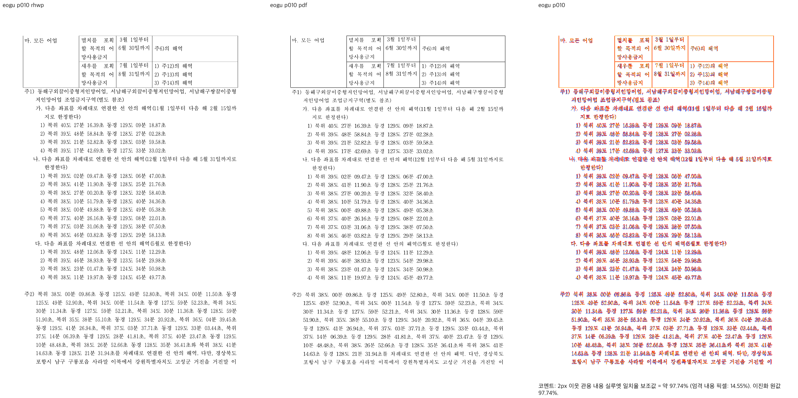
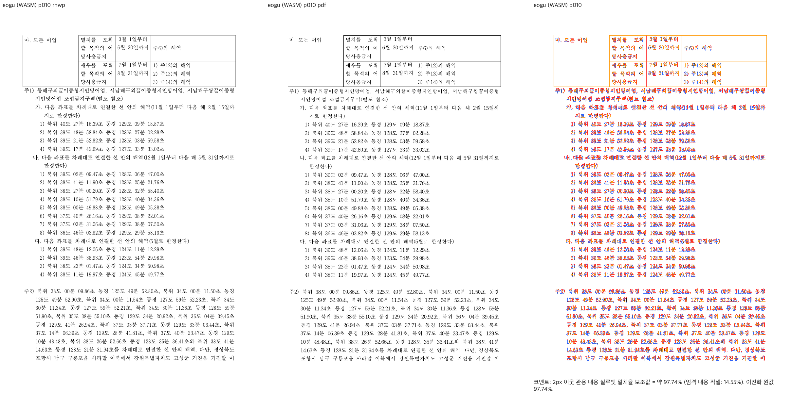
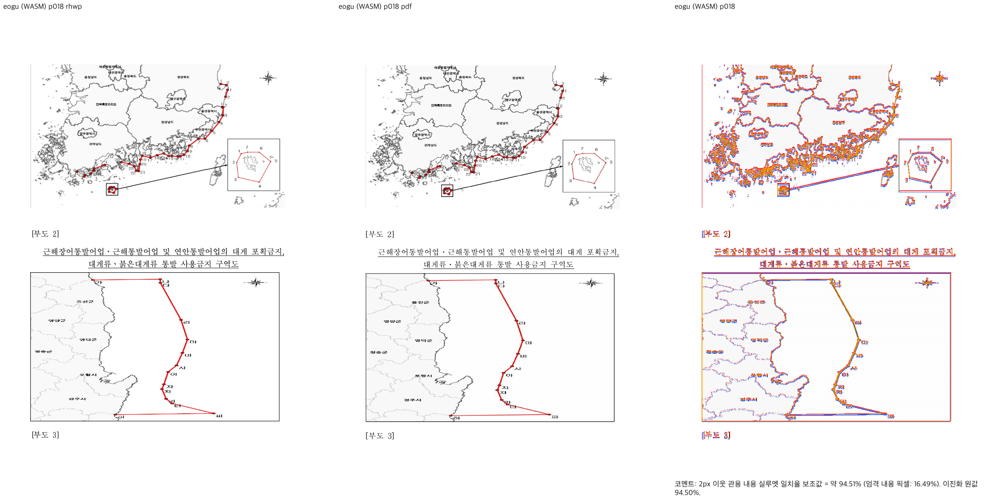

# PR #7574 — 어구 저장 프레임·주석·지도 소속 보정 self-review

[PR #7574](https://github.com/edwardkim/rhwp/pull/7574)의 작성자 `postmelee`가 collaborator 본인 PR 절차로 기록한 self-review다. 외부 reviewer의 독립 승인 또는 GitHub Approve 리뷰를 의미하지 않는다. reviewer는 지정하지 않았다.

## 최종 판정

**승인 — 명시한 저장 프레임·주석·지도 소속 보정 범위가 코드와 검증 증거에 부합한다.**
검토 head `a6f5fa05163a03f552b5fa499b2420418692e62a`의 코드에서 이번 저장 프레임·주석·지도
소속 보정 범위를 차단하는 새 결함은 확인하지 않았다. 작업지시자가 후행 반영을 승인했으며,
다음 두 기록 결함은 이번 문서·증적 정리에서 보완했다.

1. **P2 — 중간 검증 산출물 포함:** 제출 asset 73개 중 중간 JSON·TSV와 최종 댓글에 쓰지 않는
   중복 캡처가 포함됐다. [최종 증적 보존 규칙](../../manual/pr_review/visual_fixture_evidence.md#커밋할-최종-증적과-제외할-중간-산출물)에 따라
   원장 수치·명령·해시는 stage Markdown으로 옮기고 필요한 대표 이미지 24개만 남겼다.
2. **P2 — 필수 판정·후속 댓글 계획 누락:** 기존 self-review의 첫 최종 판정과
   `Merge 후 contributor PR comment 계획`을 현행 양식에 맞춰 보완했다.

### 병합 전 조건

이 후행 보완을 원격에 반영하고, 본문의 검증 문서 링크·head 고정 이미지 URL을 새 head로
정렬한 뒤 새 head의 CI/preflight·mergeability를 확인한다. 아래 CI 수치는 검토 시점의
`a6f5fa05` 결과이며 아직 생성되지 않은 후행 head의 결과를 대신하지 않는다.
병합은 작업지시자의 별도 승인 대상이며 본인 PR에 GitHub Approve를 제출하지 않는다.

### 2026-10-05 검토 결과

- 실제 source/test는 `4fc0862d` 이후 동일하다. 입력 5개·기존 공개 raster 67개의 해시를 원장과 대조했다.
- 고정 base `731de9e1`는 최신 `upstream/devel`과 같고 현재 head의 조상이다. 원격 mergeability는 clean.
- 정확한 검토 head의 check는 **13 success / 20 skipped**, 실패·대기 없음.
  [후행 head CI](https://github.com/edwardkim/rhwp/actions/runs/37209535532)의 preflight가
  `fast_pass=true`, `build-and-test-green:success`, candidate `6f8b20006efa4bf8ec2a88a0dc461c03705e5dbe`를 실제 출력했다.
  heavy job의 skipped는 성공한 같은 PR 후보의 결과 재사용이다. 새 source 결과로 오인하지 않는다.
- 원문 회귀 3개를 해시 고정한 기준/최종 바이너리로 다시 실행했다: 기준 **3 FAIL**, 후보 **3 PASS**.
  기존 전체 회귀·lint·fresh WASM은 source 변경이 없고 exact 후보 CI도 완료되어 중복 실행하지 않았다.
- emit 뒤 높이 덮어쓰기, cursor 누적, 시작 행 요구 높이, scan 및 PartialTable 정렬을 실제 호출 지점에서 대조했다.
  빈 밴드를 내용 유닛으로 소비하지 않으며 경쟁 rowspan·블록 컷·일반 tail 경로와 적용 조건이 구별된다.
- 10쪽 주석, 18쪽 지도, RowBreak 12쪽 및 어구 7·19쪽의 실제 review PNG를 다시 판독했다.
  소속·순서·포함 주장은 증거와 맞으며 잔여 표 하단·범례선 차이는 그대로 기록한다.
- 1,000줄 초과 PR의 별도 검토 cycle로 코드·병합 관계·시각 증적을 대조했다. 이 검토를 admin merge 승인으로 해석하지 않는다.

## 대상과 범위

- 원본/PR head 저장소: `edwardkim/rhwp`, branch `codex/stored-frame-map-followup`, base `devel`.
- 검증 source: `4fc0862df1b1cb6155c3745052dfb3c76e432e49`.
- 고정 정책·전후 비교 base: `731de9e1b4bb946d76f35108ed7e186ebe4ebecb` (#7568 통합 포함).
- 최초 제출 head: `6f8b20006efa4bf8ec2a88a0dc461c03705e5dbe`. source 뒤에는 문서·raster 증적만 추가됐다. 기존 `a6f5fa05` 후행 commit은 review·오늘할일·stage 문서만 바꿨으며, 이번 후행 보완은 두 Markdown 문서와 공개 증적 정리만 포함한다.
- 관련 이슈: Refs #7207, #2097. #7567의 RowBreak·최소 공통 메트릭 선행 보정 이후 잔여 작업이다.
- 변경: production 6개 파일과 `tests/cases/issue_7207_stored_frame_map_ownership.rs`의 원문 기반 회귀 3개. Studio·editor command·workflow·baseline/golden·허용치 변경 없음.

원본 저장 표의 내용 컷과 빈 물리 공간을 구분해 예산 수용, 이어받기 cursor, scan, PartialTable의 실제 정렬을 연결한다. 문단 안 rewind를 경쟁 rowspan의 물리 높이 근거로 사용하지 않으며 최신 base의 병합 셀 계약을 보존한다. 실제 충돌 통합 후 86712의 배치 변화가 검출되어 소유 가정을 수정했고, 최종 10개 대조군 전쪽을 다시 확인했다.

## 실행 결과

| 검사 | 최종 source 결과 |
| --- | --- |
| 전체 release-test nextest | 10,291 PASS / 50 skipped, exit 0 |
| Native Skia | lib·missing picture placeholder·p37 direct PDF export 모두 PASS |
| Rust lint/build | fmt, Native·WASM32·workspace all-target Clippy, workspace build 모두 PASS |
| base 고정 정책 | manifest·unit policy 모두 PASS, generated suite·manifest는 제출 diff에 없음 |
| 신규 정식 원문 회귀 3개 | 최신 base binary에서 원인에 대응하는 3 FAIL → 최종 binary 및 전체 nextest에서 3 PASS |
| 정상 대조군 10개·891쪽 | 쪽수·전쪽 render-tree JSON이 최신 base와 동일 |
| Native/fresh WASM 전쪽 TSV | 어구 21쪽 최저 93.22327%(7쪽), RowBreak 18쪽 최저 92.47763%(12쪽), 양 backend 동일; 미달·누락 없음 |
| 대표 시각 gate | 양 backend `passed`, 글꼴 불일치 예외 없음 |
| 직접 판독 | 어구 2·4·7·10·14·17–21, RowBreak 7·8·11·12의 review 및 어구 2·18/RowBreak 7 overlay; 추가 어구 1·9/RowBreak 2 전쪽 PNG와 같은 PDF 대조 |

Native와 fresh WASM의 전39쪽 PNG는 서로 바이트 동일했다. locked wrapper 호스트 `--no-opt` 빌드를 사용했고 pkg와 Studio public의 JS/WASM 해시는 각각 같다. Docker daemon을 사용할 수 없어 표준 Docker 배포 빌드는 미실행이며 Studio UI·일반 브라우저 성능을 검증했다고 주장하지 않는다.

명령·입력/산출 SHA-256·쪽별 수치와 실제 생산·소비 코드 위치·컷·예산·종료 경계는 [stage 기록](../../working/task_m100_7207_stage5.md)에 연결한다. 코드 검토와 실행 결과를 구분했으며 이전 source의 검사 결과를 최종 source로 승계하지 않았다.

최초 제출 head `6f8b20006e`의 GitHub CI도 29 success / 4 skipped / 1 neutral로 완료했다. 실패·대기 check는 없고 CI Impact Policy도 success였다. [코드 후보 CI](https://github.com/edwardkim/rhwp/actions/runs/37208020748). 이 결과와 문서 후행 head의 CI는 구분한다.

## 조판 원칙 준수 검토

| 검토 항목 | 확인 근거 | 판정 |
| --- | --- | --- |
| 구현 근거와 일반성 | 실제 저장 원문의 최소 높이·원본 LineSeg, 같은 원문 독립 PDF. 전폭 단일 소유 원본 행만 적용; 편집·투영·경쟁 소유자는 제외. 문서 ID·임의 좌표 clamp 없음 | 충족 |
| 측정·배치 일관성 | stage 표의 `stored_full_width_row_source_height` → emit 예산 수용/누적 → 시작 행 override → scan → PartialTable → 동일 저장 컷 정렬; 두 backend의 같은 소속·이미지 | 충족 |
| 분할·이어받기 계약 | 시작/끝 컷과 빈 밴드를 분리, 실제 수용한 높이를 누적. 원본의 첫 frame·후속 업종·10쪽 주석·17–21쪽 지도/캡션·마지막 종료를 검사. 최신 base 특수 병합 셀 경로와 일반 tail/sliver는 유지 | 충족(원문 적용 범위); 여러 rowspan 동시 종료와 별도 각주 예산을 조합한 새 합성 독립 PDF 계약은 미검증 |
| 줄 소속과 점유 높이 | 원본 저장 줄 재사용 경로. nested 첫 유닛에 저장 frame 경계를 한 번 투영. 편집·재조판/투영 줄에는 저장 소유 완화 미적용; 기존 관련 회귀·HWPX 대조군 유지 | 충족(저장본); 편집 후 새 줄 구성 보정은 비해당 |
| 사례와 증거의 독립성 | 수동 metadata 변형 없는 실제 원문·PDF. 회귀의 첫 선언 frame 공간, PDF 쪽 소속·셀 포함·앞뒤 순서·누락/중복 검사를 수정 전후 실행; 전39쪽 최저≥90 뒤 회귀 유지 | 충족 |
| 기준값 변경 | 최신 base 대비 새 baseline/golden·허용치 변경 없음. base 자체의 변경은 이번 후보 diff에 재포함하지 않음 | 비해당 |
| 주장과 검증 범위 | exact source, 11개 로컬 gate, 재캡처와 Markdown 검증 기록. 기존 9쪽 셀 정렬·표 경계와 다른 두 문서/교육과정은 해결로 보고하지 않음 | 충족(기록); 아래 잔여 출력 차이는 미충족 |

## 검증 입력 commit 확인

검증에 사용한 `samples/task2097/18095317_eogu_geumji.hwp`, `pdf/18095317_eogu_geumji-2020.pdf`, `samples/rowbreak-problem-pages.hwp`, `pdf/rowbreak-problem-pages-hwp-2024.pdf`와 신규 test source가 모두 검증 commit `4fc0862df1b1cb6155c3745052dfb3c76e432e49`에 포함됨을 파일 내용·SHA-256으로 대조했다. 경로·해시는 stage 기록의 「입력과 바이너리 식별」에 기록한다. 새 PDF/raster는 LFS 비대상이고 입력도 저장소 경로로 실행했다. **판정: 충족.**

사용자 제공 글꼴 파일·식별 자료·글꼴 포함 SVG/HTML/로그는 공개하지 않는다. 공개 증적은 검토한 raster와 수치·저장소 입력 정보로 한정했다.

## 대표 직접 증적

| 출력 | 10쪽 주석 review | 18쪽 지도 review |
| --- | --- | --- |
| Native |  |  |
| fresh WASM |  |  |

PR 본문에는 같은 최종 asset의 review·standalone overlay를 PR head SHA 고정 raw URL로 실제 표시한다.

## 남은 문제와 판정

- 어구 9쪽 다열 분할 셀 문구는 PDF y107px, base y80px, 최종 y82px(96dpi)다. 동일 쪽·셀의 기존 약25px 수직 차이는 이 전폭 단일 소유 보정에서 해결하지 않았다.
- 어구 7쪽 표 아래 경계선은 PDF y1081px, 후보 y1066–1067px로 약15px 차이가 남는다. 1·4쪽 분할 표 닫는 선, 19쪽 범례선·획 차이도 남아 있다. 점수 통과를 완전한 형상 일치로 해석하지 않는다.
- #7207의 다른 두 문서, 교육과정의 기존 413/415쪽 차이는 별도 작업이다. #7544 본문·source는 변경하지 않았으며 #7207 전체 종료 표현을 쓰지 않는다.
- 일반 브라우저 성능 및 별도 전후 벤치마크는 미측정이다. 공개 성능 회귀는 전체 nextest에서 통과했고 대형 HWP/HWPX 115쪽 대조군의 배치는 유지했다.

코드의 해결 범위는 저장 프레임·주석·지도 소속으로 제한한다. 위 잔여 출력 결함은 별도 후속으로 유지한다. 이번 보완을 포함한 self-review 판정과 병합 전 조건은 문서 첫 「최종 판정」을 따른다.


## Merge 후 contributor PR comment 계획

본인 PR이므로 원 기여자에게 별도 Approve를 제출하지 않고, 병합 승인·완료 후 #7574에
검증 결과 댓글을 남긴다. [Visual Sweep 정본](../../manual/verification/visual_sweep_guide.md#github-merge-comment)을
직접 연결하고 검토 head·실제 merge SHA·최종 CI URL을 구분한다.

실제 확인 범위는 어구 21쪽과 RowBreak 18쪽, 각 Native/fresh WASM 전체이며
직접 review 후보는 backend별 어구 10쪽·RowBreak 4쪽이다. 전39쪽 최저는 각각
93.22327%(어구 7쪽), 92.47763%(RowBreak 12쪽), 90% 미만·누락은 0이다.
업종·10쪽 주석·17–21쪽 지도 6개와 캡션의 쪽/셀 소속·순서를 확인했다.
7쪽 표 하단, 9쪽 다열 셀 문구와 분할 표 닫는 선·19쪽 범례선 차이 및 다른 문서의
미해결 범위는 댓글에도 명시하며 #7207 전체를 닫았다고 쓰지 않는다.

최종 공개 이미지는 아래 24개로 한정한다. 기본 댓글에는 전후/주석/지도 10개를 표시하고,
나머지 14개는 경계·대조군·잔여 차이 설명을 담은 접힌 상세 구역에서 직접 표시한다.
임시 로그·JSON·TSV와 중복 캡처는 링크하지 않는다.

| 댓글에서 확인할 의미 | asset 파일 |
| --- | --- |
| 기준 devel 주석/지도 소속 | `base-native-eogu-p010.png`, `base-native-eogu-p017.png` |
| Native/fresh WASM 10쪽 주석 | `{native,wasm}-eogu-p010-{review,overlay}.png` (4개) |
| Native/fresh WASM 18쪽 지도/캡션 | `{native,wasm}-eogu-p018-{review,overlay}.png` (4개) |
| 시작 업종의 이어받기/마지막 지도 종료 | `{native,wasm}-eogu-p{002,021}-review.png` (4개) |
| 분할 표 아래 경계와 범례선의 잔여 차이 | `{native,wasm}-eogu-p{004,007,019}-review.png` (6개) |
| 기존 다열 셀 문구의 같은 쪽 위치 차이 | `native-eogu-p009-full.png`, `pdf-eogu-p009-full.png` |
| 정상 RowBreak 최저 페이지 | `{native,wasm}-rowbreak-p012-review.png` (2개) |

모든 파일의 안정 경로는 `mydocs/pr/assets/issue7207_stored_frame_stage5/`다.
게시용 URL은 아래처럼 실제 merge SHA로 고정한다.

```markdown
문서 비교는 [Visual Sweep 정본](https://github.com/edwardkim/rhwp/blob/devel/mydocs/manual/verification/visual_sweep_guide.md#github-merge-comment)을 따랐습니다.
어구·RowBreak의 Native/fresh WASM 전39쪽 검증과 소속 회귀를 확인했습니다.
기존 세부 정렬·표 경계 차이와 #7207의 다른 문서는 후속으로 남아 있습니다.


```

실제 댓글은 위 24개 경로를 펼쳐 UTF-8 임시 Markdown 파일에 작성하고 `gh pr comment 7574
--repo edwardkim/rhwp --body-file <문안>`으로 게시한다. 게시 뒤 API로 본문·한글·선두 BOM·`??`
치환 유무와 모든 image URL의 merge SHA/응답 bytes를 재확인한다. PR 본문은 병합 전
승인된 후행 보완의 새 head로 이미지·검증 문서 링크를 정렬하고 같은 방식으로 확인한다.
이 절은 병합 승인 후의 댓글 게시 계획이며 실행 증거와 구분한다.
