# PR #7578 리뷰 — fix: respect explicit PasswordChar when rendering Edit forms

## 최종 판정

**통합 후보 검토 충족 — code candidate CI 성공, 동일 PR 후행 기록의 최신 aggregate 확인 후 통합.** 실제 변경·회귀·독립 Print/직접 시각 확인 및 비조판 계약을 이 PR의 기록 범위에서 충족했다. 원 head 자체의 approve/merge와 구분하며, 누적 source8569f49ce와 통합 [PR #7601](https://github.com/edwardkim/rhwp/pull/7601)의 code candidate774fe4071 최신 원격 CI가 성공했다. 후행 기록 head의 aggregate와 merge 가능 상태까지 확인한 뒤 통합한다.

## 접수 정보

- 원 PR: [#7578](https://github.com/edwardkim/rhwp/pull/7578), semanticist21, devel 대상, non-draft.
- 원 head: `e3268b9bc5aba217e51b3104a87b7a5f19f6491d`; 접수 시점 `MERGEABLE` / `CLEAN`. 원 head의 상태이며 누적 후보 판정이 아니다.
- 누적 branch: `review/semanticist21-20261005`; 고정 base `cdba77b609c399fdef26a6c9e637716aa32c2177`; 누적 code candidate `1d809afe7b965c9ea6137012d59d139d63b038d0`.
- Reviewer: jangster77 지정. 기본 maintainer_general; intake_and_review, local_validation, multi_pr_update_branch, 렌더 영향 시 visual_fixture_evidence를 적용.
- 관련 이슈: PR 본문과 실제 변경 범위에서 추가 확인 필요.
- 사용자 지시: non-draft 19건을 번호 순으로 누적 체리픽; 충돌은 메인터너 보정; 원 PR별 리뷰 기록을 개별 작성.

## 적용 이력

| 원 commit SHA | 상태 | 로컬 적용 SHA | 메인터너 보정 |
| --- | --- | --- | --- |
| `c3bb8a72cdd1dc933b35c141b9033692a48dc8a2` | applied | `86ed33a8f50c6b36693cc091bb872ea62829e201` | — |
| `6bf112ac0d53ce9d958ea571cf3822e571102553` | applied | `58582b7f94cef0d432ae77bd4de059f06ab84fa3` | — |
| `350852e1139eaa8a1f9135b2c05521edc44ea6db` | applied | `0084c8a7330760959f247c0e6c3f1cb9c391da41` | — |
| `30817e498364ec61ee3c43c9c2a88a1ed4c471be` | applied | `eb49764d6292967a659ecb474b000368b160933c` | — |
| `e3268b9bc5aba217e51b3104a87b7a5f19f6491d` | applied | `1d809afe7b965c9ea6137012d59d139d63b038d0` | — |

원 저자와 `cherry-pick -x` 출처를 보존했다. 이미 patch-id가 같은 원 commit은 중복 적용하지 않았다. 원 contributor branch는 수정하지 않았다.

## 변경·소비 경로 검토

- `src/paint/builder.rs`
- `src/paint/json.rs`
- `src/render_backend/scenes.rs`
- `src/renderer/canvas.rs`
- `src/renderer/canvaskit_policy.rs`
- `src/renderer/layout/paragraph_layout.rs`
- `src/renderer/layout/shape_layout.rs`
- `src/renderer/render_tree.rs`
- `src/renderer/skia/renderer.rs`
- `src/renderer/svg.rs`
- `src/renderer/web_canvas.rs`

FormObjectNode::password_display_text는 Edit의 명시된 PasswordChar 첫 문자만 사용한다. inline 두 경로와 floating 경로가 display_text를 생산하며 Paint JSON·SVG·WebCanvas·Skia가 display_or_text를 소비한다. payload 예산도 새 문자열 길이를 포함한다.

원문 조회/저장은 유지한다. 암호 미지정 및 비-Edit 대조군, inline/floating 배치를 검사한다. 한컴 fixture PDF 변환은 opening_document 단계 worker 종료로 실패했으므로 기준 출력 일치는 미검증이다. 합성 입력의 계약 결과를 한컴 출력과의 일치 증거로 바꾸지 않는다.

## 검증 입력·결과

- `tests/cases/form_password_rendering.rs` (4개 테스트): 누적 head 실행 4 PASS / 0 FAIL

- 로컬 Cargo는 공유 `target/pr-review`에서 순차 실행한다. 같은 원 head의 CI를 19건 누적 후보의 전체 검증으로 재사용하지 않는다.
- 필수 fmt·Native/WASM/workspace-all-targets Clippy·workspace build·manifest/base 정책·source unit tier 검사: PASS. 전체 Rust·Native Skia·fresh WASM 및 직접 시각 검증은 진행 중.
- focused: `output/pr-review/semanticist21-20261005/run-records/focused-command.json`의 20 case 필터, 전체 74건 중 73 PASS / 1 FAIL. PR별 결과는 위 case 항목에서 구분한다. 실행 증거: `output/pr-review/semanticist21-20261005/logs/focused.log`.
- 실제 HWP/HWPX/PDF 입력과 commit의 해시, 독립 기준, source/build provenance: 입력 사용 시 기록한다.
- source 교정 또는 검사 실패가 생기면 이 PR의 보정과 재실행을 별도로 기록한다. Golden/baseline/래칫을 완화하지 않는다.

## 원 head CI 참고값

- Lint (fmt, clippy, WASM check): SUCCESS
- Build & Test: SUCCESS
- CI Impact Policy: SUCCESS

## 조판·시각 판정

적용 여부와 필요한 직접 증거를 확인 중이다. 원 PR 제공 before/after·수치를 누적 head의 Visual Sweep 통과로 간주하지 않는다. 자료 부족과 실제 회귀를 구분하여 미검증/미충족으로 판정한다.

## 남은 범위·후속 처리

원 PR 전체 해결 여부와 이슈 종료 표현은 직접 검증한 범위로 제한한다. 이 기록은 로컬 누적 검토이며 원격 approve/comment/merge를 의미하지 않는다. 통합 결과는 같은 누적 branch에 두고 원 PR별 판정이 확정된 뒤 게시 범위를 결정한다.

## 한컴 기준 출력 확보 상태

- 수정 입력: `tests/fixtures/form-password/edit-password.hwpx`, SHA-256 `e8161c8dfac0aaef054da0a4d5e704e3a54b3c5cfbbbf47955c6650ab74dd0ae`. engine 2020, job `29056013-2487-4bd5-b3f4-ff601f90e6d2`: opening_document에서 worker exit 3221225477.
- 정상 원본 대조 입력: `samples/hwpx/form-01.hwpx`, SHA-256 `3bbd207b88fe61e802706de3ccf98abdb8b450493164eec657c9ee88a5aba87e`. engine 2020, job `17a1df81-895b-41c1-86a3-f0675c17be1a`: creating_document_frame에서 같은 worker exit. 원본에서도 실패하므로 수정 fixture 손상이라고 단정하지 않는다.
- 사용자가 수동 변환하기로 했다. HWP 보조 입력은 `pdf/semanticist21-20261005/manual-input/edit-password.hwp`, SHA-256 `4a2e02e4bd44cbf604789052f62131eb92779e2bb63e879eb8bcd07d243d2c24`. 누적 Native debug CLI `convert --verify --verify-pages`에서 IR 차이 없음/1쪽을 확인했다. 원 HWPX 직접 변환 PDF를 우선 기준으로 사용한다.

## 사용자 수동 기준 PDF와 Native 직접 비교

사용자가 추가한 `tests/fixtures/form-password/edit-password-2024.pdf`(SHA-256 `84d6582ebc3e99d25008c39d42eb8a974cd2efa2952fdd6e8ede5c8ad9a05d2a`)와 `samples/hwpx/form-01-2024.pdf`(SHA-256 `d1117657d92c789295d73af1bebd11b241eb352254b328d95c07f0efb87b18ee`)를 사용한다. 두 파일 모두 Creator `Hwp 2024 13.0.0.3901`, A4 1쪽이다. 자동 engine 2020 작업의 실패와 별도로 실제 수동 PDF 증거를 확보했다.

Native command: `python3 scripts/visual_sweep.py --key pr7578-password --hwp tests/fixtures/form-password/edit-password.hwpx --pdf tests/fixtures/form-password/edit-password-2024.pdf --page 1 --rhwp-bin target/pr-review/release-test/rhwp --out output/pr-review/semanticist21-20261005/visual-native`. Binary는 집중 회귀와 함께 만든 누적 code `1d809afe7b965c9ea6137012d59d139d63b038d0` 산출물이다. 이후 `04f6b3eef`까지 Rust/Cargo/test/script diff가 없음을 확인했다.

대표 `visual-native/pr7578-password/review/review_001.png`를 직접 판독했다. 암호 표시 영역에서 양쪽 모두 13개 마스킹 문자를 표시하며 원문을 표시하지 않는다. 전체 페이지에는 콤보박스의 `계절 선택` 누락, button/check/radio 외형 및 글자 크기 차이가 남는다. 이를 새 암호 마스킹 회귀라고 단정하지 않고 정상 원본 대조 Sweep으로 분리한다. 2px 관용 내용 실루엣 `80.02964%`, gate `re_review_required`이므로 전체 시각 통과나 승인을 선언하지 않는다. font exception을 적용하지 않았다.

사용자 지시에 따라 누름틀 안내문은 print PDF 비교에서 제외한다. #7565의 안내문은 screen profile에서만 확인한다. 이 페이지의 폼 개체 차이를 누름틀 안내문 차이로 취급하지 않는다.

정상 원본 대조 `form01-control`도 `78.99718%`이며, 대표 review PNG를 직접 판독했을 때 같은 콤보박스 글자 누락과 폼 외형 차이가 있다. 원본을 수정하지 않고 사용자 PDF를 그대로 사용했다. 신규 마스킹 구현의 검증과 기존 폼 전체 일치의 미충족을 구분한다.

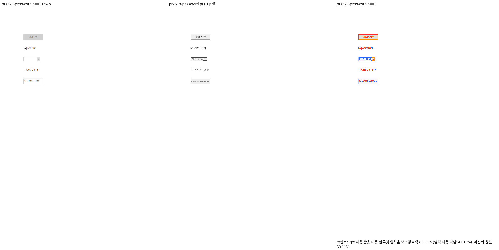

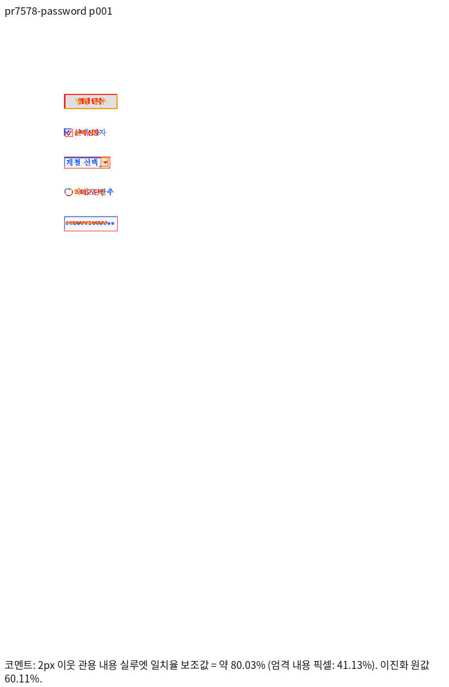

## fresh WASM와 실제 Chromium Canvas

fresh WASM SHA-256 `5c66e27f13dc1699a18aabcc1397c530e1bec05f2567b5a0414e9dabe714dd06`, Studio public과 동일. 실제 Canvas fillText에서 13개 마스킹 문자는 표시되고 `MASK_SENTINEL`은 표시되지 않으며 getFormValue는 원문을 유지한다. screen 안내문은 정상적으로 보이고 사용자 지시에 따라 PDF의 미표시와 비교하지 않았다.

WASM Visual Sweep도 동일 PDF/1쪽에서 `80.02964%`, gate `re_review_required`이다. 대표 review/standalone overlay를 직접 판독하여 Native와 같은 마스킹 및 기존 폼 차이를 확인한다. formatter·CI·자동 점수로 시각 gate를 대체하지 않는다.

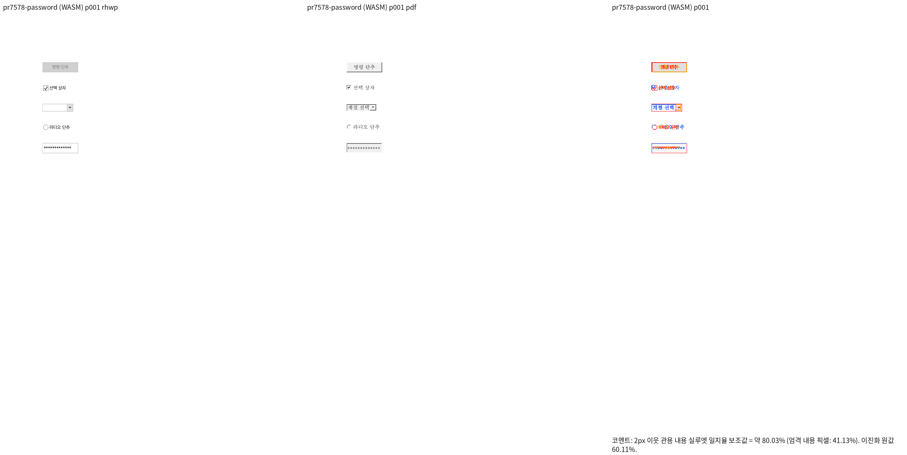

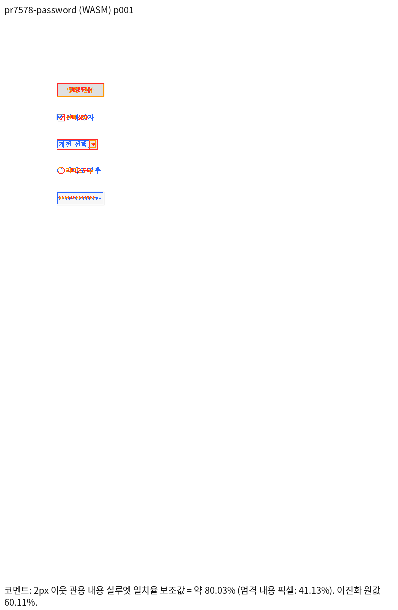

## 추가 개선 계획: 콤보박스 초기 목록 표시

사용자가 한컴 화면의 `계절 선택` 누락 개선을 요청했다. 정상 생성본 `samples/hwpx/form-01.hwpx`는 ComboBox의 `selectedValue`가 빈 문자열이며 첫 `listItem.value`가 `계절 선택`이다. 사용자가 제공한 한컴 PDF에서도 이 문자열이 보인다. 기존 HWP serializer `src/serializer/control.rs`의 ComboBox Text 작성도 선택값이 비어 있으면 `listItem0`을 사용한다.

원인 경로는 parser의 `listItem0` 보존 → layout의 FormObjectNode 생성에서 `.text`만 사용 → SVG/Canvas/Skia의 공통 표시 문자열 소비다. 세 layout 생성 위치에 같은 표시 결과를 공급하고, 빈 ComboBox 선택값에서 첫 목록 값을 표시한다. 비어 있지 않은 선택값·자유 입력은 유지하고, 목록 없는 ComboBox와 Edit 암호 마스킹은 바꾸지 않는다. 표시 결과로 모델 선택값을 덮어쓰지 않는다. 서로 다른 value/displayText 대응의 새 동작은 이번 개선에 포함하지 않는다.

정상 원본에서 수정 전 FAIL / 수정 후 PASS, 빈 목록·명시 선택·자유 입력, inline/텍스트 동반/floating 배치와 HWPX 재열기의 원문 보존을 검사한다. 새 source에서 lint·회귀·fresh WASM 및 두 사용자 PDF의 Native/WASM Sweep을 다시 수행한다. 이전 전체 회귀는 base 작업트리가 공유 library를 덮어쓴 뒤 링크하여 유효하지 않았다. 캐시를 삭제하지 않고 현재 source library를 재빌드하고 `display_text` 필드의 metadata compile 성공을 확인했다. 해당 실행의 41건 실패는 후보 head 회귀로 집계하지 않는다.

## 콤보박스 추가 개선: Native 선행 검증

`tests/cases/form_combobox_display.rs`의 정상 원본/배치 2건은 수정 전 빈 표시 때문에 FAIL, 명시 선택값·빈 목록 2건은 PASS였다. 수정 후 원본의 HWPX/HWP 재열기, 세 layout 배치, SVG 및 paint JSON 대조군까지 총 4건 PASS다. fmt 뒤 suite 배정이 바뀌어 최초 수정 후 실행은 0 tests(검증 제외)였고, manifest를 다시 prepare한 `output/pr-review/semanticist21-20261005/run-records/combobox-after-prepared.txt`에서 4건을 실제 실행했다. 모델의 선택값과 query text는 원래 빈 값 그대로다. 기존 HWP 저장 경로는 Text를 첫 항목으로 저장하며 재열기 후에도 같은 문자열을 표시한다.

새 Native CLI로 사용자 PDF 두 개를 재비교하고 review/standalone overlay를 직접 판독했다. `계절 선택`이 이제 표시되고 기존 암호 마스킹이 유지된다. 정상 원본 78.99718% → 82.89242%, 암호 fixture 80.02964% → 83.59530%. 폼 글자 크기·check/radio/frame 차이가 남아 gate는 여전히 `re_review_required`이며 승인·통합하지 않는다. 새 source의 fresh WASM 및 전체 회귀/lint/Skia는 다음 검증 단계다. 두 사용자 기준 PDF도 변경 commit에 포함한다.

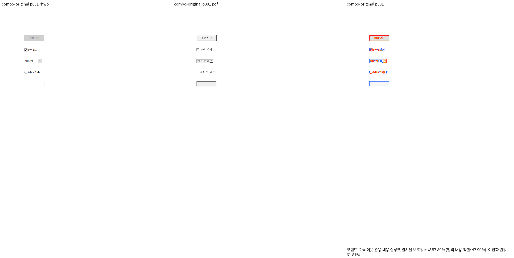

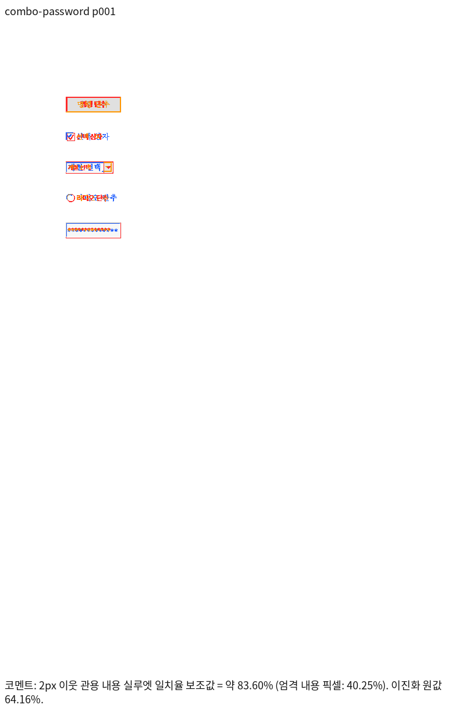

## 추가 개선 범위: 폼 입체 외형과 글자 위치

사용자는 버튼·라디오·텍스트 박스의 3D 표현 누락과 ComboBox 표시 위치 차이를 추가로 지적했다. 한컴 PDF에는 밝은/어두운 테두리와 Marlett으로 그린 check/radio 표시가 있으며, 캡션은 Haansoft Batang 10pt이다. 저장 CharShape 0도 height=1000(10pt)이다. 기존 SVG/Canvas/Skia는 서로 다른 크기·여백과 임의의 sans-serif 크기를 사용하고, enabled 버튼도 회색 비활성처럼 그린다. 이 경로의 실제 차이는 font exception으로 면제하지 않는다.

공통 폼 표시 geometry를 마련하여 솟은 버튼·들어간 입력 프레임·check/radio 표시 및 글자 원점/크기를 같은 결과로 공급한다. 원래 개체 bbox와 편집용 원문은 유지한다. 폼 CharShape/FollowContext·DrawFrame·enabled 속성을 읽어 폼 글자와 테두리를 결정하고, 명시한 속성이 다른 대조군을 검사한다. 실제 Native 및 fresh WASM 출력에서 한컴 PDF의 해당 영역을 재비교한다. 추가 source 변경이 필요하므로 진행 중이던 이전 WASM 빌드를 종료했고 그 결과를 최종 증거로 재사용하지 않는다. 사용자는 Studio public/rhwp.js도 최종 커밋에 포함하도록 요청했다.

## 폼 공통 외형 구현과 집중 검사

`src/renderer/form_appearance.rs`에서 폼 CharShape/FollowContext/DrawFrame과 dpi를 해소하고 글자 원점·기준선·크기, 2겹 명암 프레임과 check/radio geometry를 만든다. 세 layout 생성 위치 → FormObjectNode.appearance → SVG/WebCanvas/Native Skia 및 paint JSON drawing → CanvasKit의 실제 소비 경로가 같은 결과를 사용한다. 기존 개체 bbox/본문 흐름과 편집용 text는 유지한다. enabled 버튼도 원래 foreground를 사용하며 입력 상자는 document back_color를 그린다. SVG의 폼 글꼴도 embedding codepoint 수집에 포함한다.

기존 renderer의 입체 프레임/10pt 검사 3건은 모두 수정 전 FAIL이었다. 최종 집중 검사는 외형6·초기 표시4·기존 암호4 총14 PASS다. ComboBox 좌표 기대값은 한컴 PDF에서 읽은 실제 origin `(87.36,193.68)pt`를 96dpi로 변환한 `(116.48,258.24)px`이고, 실제 SVG `(116.387,258.173)`가 0.4px 이내다. FollowContext 대조군은 DocInfo를 추가하는 합성 계약이며, 기존 직접 document_mut 경로의 style snapshot을 새 글자 속성으로 갱신하지 못해 최초 검사만 실패했다. 저장 후 parser로 다시 연 정상 style snapshot에서 10pt/16pt 기대값을 바꾸지 않고 PASS다. 이 대조군을 한컴 화면의 실제 편집 후 출력 증거로 승격하지 않는다.

Studio TypeScript/production build PASS, npm tests1817건 중1815 PASS/2 SKIP/0 FAIL. 시각 비교에 실제 설치된 `/opt/hnc/hoffice11/Shared/TTF/All/HBATANG.TTF`를 공급한다. fc-scan의 face는 한컴 PDF와 같은 `Haansoft Batang`/`한컴바탕`, SHA-256 `35f84328500fc2c3ee0b148aa75de0ed384bf9eee8dee9148c01b0a11a27fe05`이다. 이전 작은 sans-serif 캡처와 새 글꼴/geometry 캡처를 구분하고, 정확한 새 source에서 Native/fresh WASM 비교를 다시 만든다.

## 새 source Native 시각 결과

source `cf2336295540ea8ce3e94eb6517cb406fca8d28f`, `RHWP_FONT_PATH=/opt/hnc/hoffice11/Shared/TTF/All`, `--embed-fonts full`. 정상 원본과 암호 fixture의 사용자 PDF/1쪽을 각각 재비교했다. 실제 font 공급 디렉터리/face/hash를 확인한 뒤 full cmap을 보존하는 embedding을 사용했으며 font exception은 쓰지 않았다. 2px 관용 내용 실루엣은 원본99.88501%, 암호99.90053%, 두 gate PASS다. review와 standalone overlay에서 솟은 버튼, 들어간 ComboBox/Edit 프레임, check/radio, 10pt 글자와 ComboBox 시작/기준선, 암호 마스킹을 직접 판독했다. 좁은 glyph/테두리의 subpixel 차이와 Marlett 원형 표시를 vector로 재현한 미세 차이는 남으며 pixel-perfect를 주장하지 않는다. 엄격 ink match는37.25565%/35.14589%이고 승인 지표와 혼동하지 않는다.

Native 재현 명령은 `RHWP_FONT_PATH=/opt/hnc/hoffice11/Shared/TTF/All python3 scripts/visual_sweep.py --key form-original --hwp samples/hwpx/form-01.hwpx --pdf samples/hwpx/form-01-2024.pdf --page 1 --rhwp-bin target/pr-review/release-test/rhwp --embed-fonts full --out output/pr-review/semanticist21-20261005/appearance-visual-native`; 암호 fixture는 key=form-password, hwp=`tests/fixtures/form-password/edit-password.hwpx`, pdf=`tests/fixtures/form-password/edit-password-2024.pdf`다. run_manifest.json에 source SHA·binary SHA·입력/PDF/공급 font 해시를 보존한다.

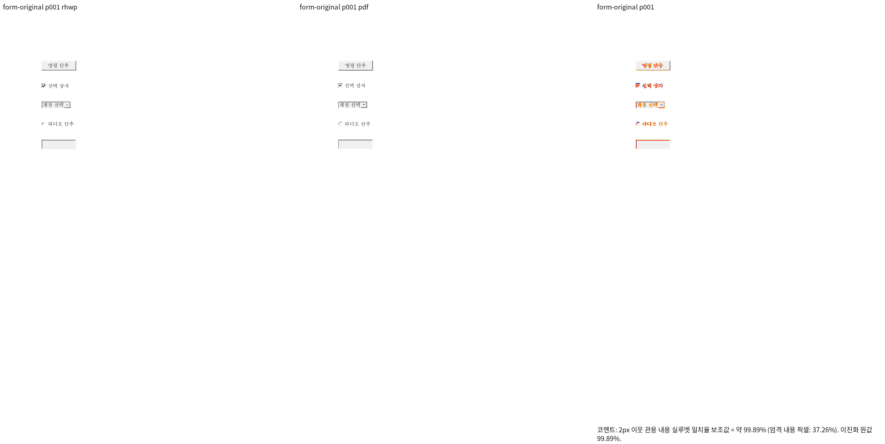

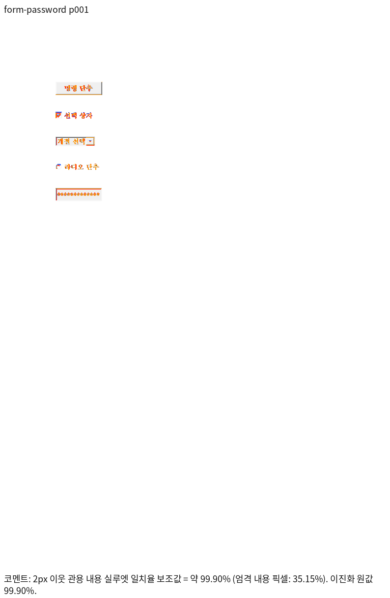

## fresh WASM·실제 화면·기본 글꼴 대조 완료

source `cf2336295540ea8ce3e94eb6517cb406fca8d28f`, JS 반영 head `7ca40721f`의 fresh WASM은 pkg/Studio public의 해시가 일치한다. Native/fresh WASM 모두 같은 사용자 PDF1쪽에서 동일 font face 지정 시 원본99.88501%, 암호99.90053%로 gate PASS다. fresh WASM review/standalone overlay를 직접 판독했고 프레임·글자 시작/기준선·마스킹의 적용을 확인했다. 이전80%대 gate는 추가 보정 전 기록이며 현재 시각 판정을 대신하지 않는다. 실제 WebCanvas 및 Studio CanvasKit에서도 ComboBox title·원문 저장 보존·13개 암호 표시·공통 drawing 소비를 확인했다. CanvasKit 완료/error null/미등록 font fallback0의 관측은 `output/pr-review/semanticist21-20261005/historical-browser-raw/appearance-browser-results.json`에 있다.

사용자 지적에 따라 `RHWP_FONT_PATH`를 제거하고 두 입력을 Native/fresh WASM에서 다시 비교했다. 원본99.34142%, 암호98.81531%로 네 gate 모두 PASS다. 한컴 설치본은 이미 있으며, 지정 이유는 PDF와 같은 `Haansoft Batang / 한컴바탕` face 공급이다. 현재 Linux fontconfig의 한컴바탕 선택은 다른 `HCR Batang / 함초롬바탕` face이고 RHWP 기본 디렉터리는 한컴 app 내부 All 경로를 포함하지 않는다. 기본 SVG는 local alias를 사용한다. 설치가 없다고 주장하거나 환경변수를 실행 필수 조건으로 삼지 않는다. [글꼴 대조 증거](../assets/semanticist21-20261005/font-path-verification.json)에 실제 family/path를 기록했고 두 조건의 원시 실행 결과는 ignored `output/pr-review/semanticist21-20261005/historical-visual-raw/font-path-verification.json`에 보존했다.

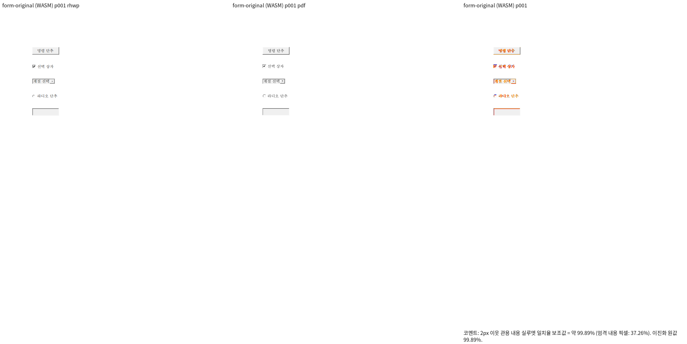

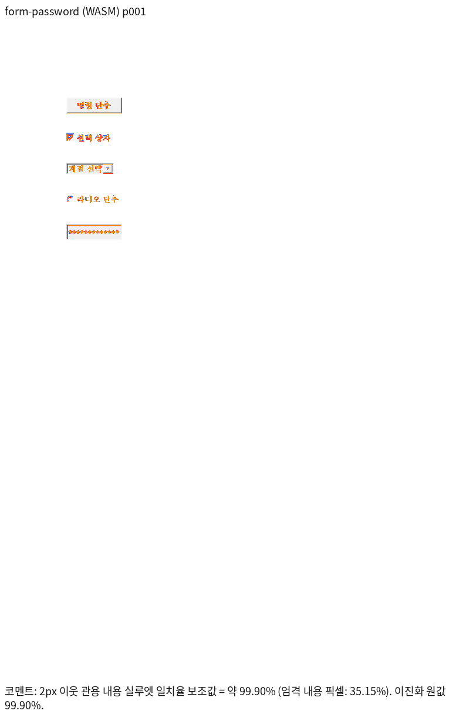

최종 fmt·Native/WASM/workspace Clippy·workspace build·base 고정 manifest/unit tier는 PASS다. 전체 nextest와 optional Native Skia는 실행 중이며 최종 판정을 아직 대신하지 않는다.

## 최종 공통 회귀 결과 (폼 source cf2336295)

Rust source `cf2336295540ea8ce3e94eb6517cb406fca8d28f`, 정책 base `cdba77b609c399fdef26a6c9e637716aa32c2177`에서 fmt·Clippy Native/WASM/workspace-all-targets·workspace build·manifest/unit tier 정책 PASS. 전체 nextest10,437건 중10,436 PASS/1 FAIL/50 SKIP이며 실패는 #7491의 편집 뒤 표 우변 assertion1건이다. 이 실패는 고정 base에서도 관측했다. Native Skia lib·missing picture2개·direct PDF4개·ComboBox4개·암호4개는 모두 PASS다. 명령/exit/시간은 검증 정본 (`output/pr-review/semanticist21-20261005/run-records/appearance-final-validation.json`), 요약과 원 로그 SHA는 실행 요약 (`output/pr-review/semanticist21-20261005/run-records/appearance-final-validation-summary.txt`)에 보존했다.

#7491은 사용자가 지정한 실패 입력에서 MCP 재산출 PDF·90% 시각 gate와 독립 기대값을 추가 검증 중이며, #7521의 loose inline 길이 제한 우회도 보류 사유로 남는다. 전체 회귀 통과 또는 통합 merge를 선언하지 않는다. 이후 Rust source/test 변경에는 이 결과를 그대로 승계하지 않고 해당 검증을 다시 수행한다.

## upstream/devel 위 rebase 적용 위치 — 2026-10-05

기준 `c167dc6abbebf69546575e2d16d06223791bab82`. 아래는 현재 이력의 실제 적용 위치이며 위의 이전 검증 SHA는 당시 이력으로 보존한다.

| 원 commit SHA | rebase 전 로컬 SHA | 현재 적용 SHA | 상태 |
| --- | --- | --- | --- |
| `c3bb8a72cdd1dc933b35c141b9033692a48dc8a2` | `86ed33a8f50c6b36693cc091bb872ea62829e201` | `7cacb796d755ce1870b156c112afd1c8c277ee45` | rebased |
| `6bf112ac0d53ce9d958ea571cf3822e571102553` | `58582b7f94cef0d432ae77bd4de059f06ab84fa3` | `79c4be9c321064d3241a26754d014b73eb1ff1fc` | rebased |
| `350852e1139eaa8a1f9135b2c05521edc44ea6db` | `0084c8a7330760959f247c0e6c3f1cb9c391da41` | `a9718e3ff481c41dd1b06c6862a31f8af97e563c` | rebased |
| `30817e498364ec61ee3c43c9c2a88a1ed4c471be` | `eb49764d6292967a659ecb474b000368b160933c` | `dd1f092d38d16be18e4f885352eed65ff685d56d` | rebased |
| `e3268b9bc5aba217e51b3104a87b7a5f19f6491d` | `1d809afe7b965c9ea6137012d59d139d63b038d0` | `1f3127ae1265543b700e48ef81109efebe51f6f4` | rebased |

원 저자와 cherry-pick 출처를 유지했다. #7491의 원4개는 #7599를 통해 이미 base에 포함되어 중복 적용하지 않았다. 메인터너 보정과 개별 리뷰 기록은 재배치했다. 최종 후보의 시각·전체 회귀 및 CI는 별도 확인한다.

## 수동 기준 PDF의 Print 출처 확인 — 2026-10-05

사용자가 아래 두 PDF 모두 한컴 파일 → 인쇄(Print) → PDF 출력본이라고 확인했다. MCP는 원본의 매크로/스크립트 때문에 무인 변환을 거절했으며 거절을 우회하지 않았다. 이미 제공된 수동 인쇄본을 같은 원문 기준으로 사용한다.

- `samples/hwpx/form-01-2024.pdf` SHA-256 `d1117657d92c789295d73af1bebd11b241eb352254b328d95c07f0efb87b18ee`.
- `tests/fixtures/form-password/edit-password-2024.pdf` SHA-256 `84d6582ebc3e99d25008c39d42eb8a974cd2efa2952fdd6e8ede5c8ad9a05d2a`.

최신 동일 production의 Native TSV는 양식99.34142%/암호98.81531%이며, fresh WASM 및 대표 PNG 직접 판독은 이어서 기록한다. 원 TSV/실행 로그는 ignored output에만 보존한다.

## fresh WASM의 수동 Print PDF 대조

동일 production의 Native와 fresh WASM 전체1쪽 TSV는 양식99.34142%/암호98.81531%로 각각 같고 90% 미만·누락 쪽은0이다. Native/WASM 대표 review PNG를 직접 열어 버튼과 콤보박스의 입체 테두리·선택 문구의 시작 위치, 라디오 외곽·텍스트 박스의 입체 테두리, 암호 마스크를 대조했다. 누름틀 guide는 사용자 지시에 따라 Print에 나타나지 않는 화면 안내로 구분한다.

- 입력/기준 PDF는 기존 commit 파일과 동일하고 사용자 확인한 Print 인쇄본이다.
- 출력: ignored `output/pr-review/semanticist21-20261005/rebased-{forms,password}-wasm-{scores,review}` 및 `bridge-{forms,password}-native-{scores,review}`. 원 TSV·로그는 커밋하지 않는다.
- WASM SHA-256 `51141da77d73e54dc6bfef4b16a1049f22905cd315441e9c743f53e57114f43b`, Studio public과 동일; JS도 root pkg/public 간 동일이다. 빌드 production source `85f3d021ab67328e4c8f5e77670125a2c3ab0fe8`이며 rebase 이후 문서/회귀 입력 추가는 production byte를 바꾸지 않았다.
- 정확한 최종 후보의 전체 Rust·lint·CI 및 통합은 별도 게이트다. 이 시각 확인을 전체 후보 승인으로 바꾸지 않는다.

## 2026-10-06 최종 후보의 Print·Native/fresh WASM 재검증

정책 base `c167dc6abbebf69546575e2d16d06223791bab82`, production source `2b1f21ef1ab35a13ebcae11f562a3ebf3a998e4d`, 회귀 source `9af7586586587fa0aa617a9e57fd6acd0d4e3ba6`. 두 head 사이에는 #7527의 Native 전용 회귀와 리뷰/PNG만 추가됐고 production source는 동일하다. 최종 fresh WASM SHA-256 `24565cae976b3c6929c858f13c52785a4651a26dc61c0fd566f5a8f801d631f7`, JS `70cde06a369fa7fd4fc8bc8f3d6acaee158596ba1a116a2c72159002b0b5654e`; root pkg/Studio public 해시를 대조했다.

| 검증 입력 | 출력 경로 | 전체 쪽별 실루엣(%) | Gate |
| --- | --- | --- | --- |
| `forms` | native | p1 99.34142 | passed / 누락0 |
| `password` | native | p1 98.81531 | passed / 누락0 |
| `forms` | wasm | p1 99.34142 | passed / 누락0 |
| `password` | wasm | p1 98.81531 | passed / 누락0 |

- [form-01.hwpx](../../../samples/hwpx/form-01.hwpx), SHA-256 `3bbd207b88fe61e802706de3ccf98abdb8b450493164eec657c9ee88a5aba87e` → [독립 Print PDF](../../../samples/hwpx/form-01-2024.pdf), SHA-256 `d1117657d92c789295d73af1bebd11b241eb352254b328d95c07f0efb87b18ee`.
- [edit-password.hwpx](../../../tests/fixtures/form-password/edit-password.hwpx), SHA-256 `e8161c8dfac0aaef054da0a4d5e704e3a54b3c5cfbbbf47955c6650ab74dd0ae` → [독립 Print PDF](../../../tests/fixtures/form-password/edit-password-2024.pdf), SHA-256 `84d6582ebc3e99d25008c39d42eb8a974cd2efa2952fdd6e8ede5c8ad9a05d2a`.

두 기준 PDF는 사용자가 해당 한컴의 Print 출력임을 확인했다. WebCanvas/Studio CanvasKit의 ComboBox title·HWPX 재열기·원문 값 보존·암호13자 마스킹을 실제 실행했다. CanvasKit 완료=true/error=null/미등록 글꼴 fallback0. 프레임/라벨 위치를 직접 PDF와 대조했고 누름틀 안내는 screen에서만 검사했다.

각 명령·TSV·manifest·runtime 원시는 ignored `output/pr-review/semanticist21-20261005`에 보존했다. 렌더는 같은 입력/Print 전체 페이지와 `--embed-fonts=full`을 사용했고 WASM은 `--wasm-pkg pkg`를 추가했다(#7504는 실제 등록 API replay adapter). 최종 전체 Rust 회귀와 GitHub CI는 별도 진행 중이다.

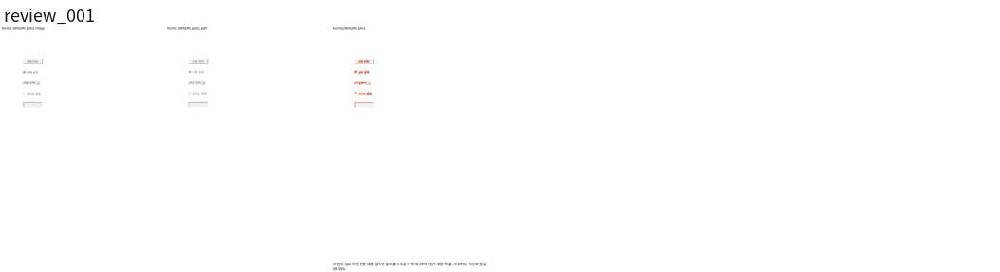
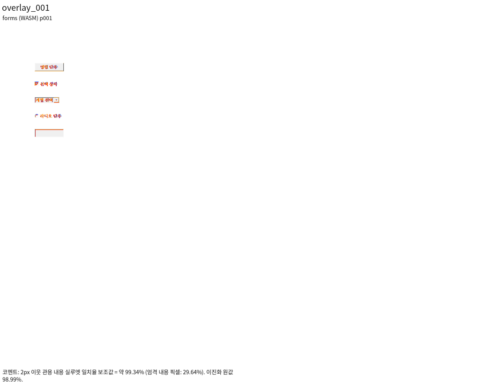

최종 페이지별 TSV: `output/pr-review/semanticist21-20261005/final-tsv/native/<key>/silhouette.tsv` 및 `wasm/<key>/silhouette.tsv`. 최신 full Sweep PNG 쌍에서 canonical `--silhouette-only --png-pair`로 산출하고 PNG SHA를 manifest에 고정했다. 해당 입력 전체 쪽수도 독립 PDF·원문 exporter에서 별도로 대조했으며 90% 미만/누락0이다.

## Merge 후 contributor PR comment 계획

원 기여에 감사한 뒤 실제 통합 PR 링크·merge SHA·정확한 최종 head CI와 이 PR의 회귀 실행 결과를 한국어 존댓말로 게시한다. 원 head는 merge 직전에 다시 확인하고 동일할 때만 통합으로 대체된 원 PR을 닫는다. 원 contributor fork branch는 삭제하지 않는다.

사용자가 두 PDF의 Print 출력을 확인했음을 밝히고 ComboBox title 위치·3D 프레임·암호 마스킹의 추가 보정을 설명한다.

- 실제 비교 `password`의 p1 98.81531%를 페이지별 실루엣 보조값으로 적는다. 같은 입력 Native/fresh WASM 전체 쪽 TSV·누락0·직접 구조 판정을 함께 설명한다.
- merge SHA에서 존재를 확인한 `mydocs/pr/assets/semanticist21-20261005/pr7578/password-wasm-review-all-pages.png` / `mydocs/pr/assets/semanticist21-20261005/pr7578/password-wasm-overlay-all-pages.png`를 `raw.githubusercontent.com/edwardkim/rhwp/<merge-SHA>/...`의 실제 Markdown 이미지로 표시한다. 임시 output 링크로 대신하지 않는다.
- 이슈는 확인된 해결 범위만 다루고, 남은 조판·입력 축은 `Refs`와 원 이슈 링크로 유지한다. 게시 뒤 API로 실제 줄바꿈·한글·이미지 URL을 다시 확인한다.

## 최종 production 전쪽 재검증 — 2026-10-06

Production·검증 source `8569f49ce051ee343d58866a4f1e20a642d9e7fa`, 정책 base `c167dc6abbebf69546575e2d16d06223791bab82`를 검증했다. fresh WASM SHA-256 `410f8f3540f2856fcd7200a115f191a87aed4b2e726267bc54d960b35948735a`, JS `70cde06a369fa7fd4fc8bc8f3d6acaee158596ba1a116a2c72159002b0b5654e`; root `pkg`와 Studio public의 실제 바이트가 같다. Native binary SHA-256 `d4ff621918e81070809efe96555f9e484905f12c20d77f9a78f81ce4095fbe46`. 아래 결과는 원점 리셋 보정까지 포함한 최신 source의 재출력이다.

Native/fresh WASM 각각30항목·37쪽(합계74쪽 대응) 최신 재출력, 최저91.96451%, 90% 미만/누락/측정 불가/글꼴 예외0이다. canonical TSV: ignored `output/pr-review/semanticist21-20261005/ladder-reset-tsv/<native|wasm>/<key>/silhouette.tsv`. 입력·Print 출처와 직접 판독은 위 개별 증거를 따르며, [공통 렌더/TSV 명령·재출력 검증](../assets/semanticist21-20261005/README.md#문단-원점-리셋-보정의-최종-nativefresh-wasm-검증)에 연결한다. 전체 Rust 및 원격 CI 완료 여부는 다음 최종 판정에서 별도로 기록한다.

| 이 PR의 검증 입력 | 경로 | 독립 Print 전체 쪽 실루엣(%) | 판정 |
| --- | --- | --- | --- |
| `forms` | native | p1 99.34142 | passed / 누락0 |
| `password` | native | p1 98.81531 | passed / 누락0 |
| `forms` | wasm | p1 99.34142 | passed / 누락0 |
| `password` | wasm | p1 98.81531 | passed / 누락0 |

- 최신 source의 실제 브라우저3종 PASS(화면/질의/폼), source registry·fmt·Native/WASM/workspace-all-targets Clippy·workspace build·base manifest/unit-tier 정책 PASS. Native 선행33건 및 Cargo 집중32건은 각각 모두 PASS이며 최종 전체 nextest/Native Skia 결과는 다음 판정에 기록한다. 원시 로그·중간 JSON·TSV는 ignored `output/pr-review/semanticist21-20261005`에 보존한다.

## 최종 로컬 게이트 — production8569f49ce

정책 base `c167dc6abbebf69546575e2d16d06223791bab82`, 검증 source `8569f49ce051ee343d58866a4f1e20a642d9e7fa`. fmt·Native/WASM32/workspace-all-targets Clippy `-D warnings`·workspace build·manifest 및 source unit tier `--check --base-ref <base>` 모두PASS다. 파생 suite를 준비한 동일 review checkout의 `target/pr-review`에서 Cargo를 순차 실행했다.

- 전체 `cargo nextest run --locked --cargo-profile release-test --target-dir target/pr-review --tests --test-threads 12 --no-fail-fast`:10,491 PASS/0 FAIL/50 SKIP,706.118초, exit0.
- Native 선행33/ Cargo 집중32 모두PASS; 겹침16 partition 전체를 포함한다. 기존 fixture/baseline/래칫을 완화하지 않았다.
- Native Skia lib·missing picture·direct PDF·ComboBox·password 모두PASS. optional backend 검사를 원 head CI 또는 SVG 점수로 대신하지 않았다.
- fresh WASM/Studio 동기화·실제 화면/질의/폼3종·최신 Native/fresh WASM74쪽 대응/TSV 모두PASS(최저91.96451%, 미달/누락/측정 불가0, font exception0).

실제 명령·exit·시간은 ignored `output/pr-review/semanticist21-20261005/oct06-ladder-reset-validation-progress.json`, 원 출력은 `logs/oct06-ladder-reset-*.log`에만 보존한다. 각 단계의 마지막 summary는 아래 공통 증거 README에 기록한다. source가 바뀌면 이 실행 결과를 그대로 승계하지 않는다. 원 PR의 별도 CI와 누적 후보의 최신 원격 CI를 구분하며 통합 PR의 최종 head CI를 확인한 뒤 merge한다.

## 통합 PR #7601 code candidate CI와 후행 기록

[통합 PR #7601](https://github.com/edwardkim/rhwp/pull/7601), code candidate `774fe407160598bd029cbb13a3545ee30ca057df`의 [최신 head CI](https://github.com/edwardkim/rhwp/pull/7601/checks)가 모두 종료되어 성공/정상 생략을 확인했다. 정확한 run URL·결론은 [공통 CI 증거](../assets/semanticist21-20261005/README.md#통합-pr-7601-code-candidate-ci)에 기록했다. 원 PR의 별도 CI를 이 결과로 바꾸지 않는다.

Production source `8569f49ce051ee343d58866a4f1e20a642d9e7fa`의 최종 전체 nextest 로그에서 이 PR의 실제 검사 결과를 확인했다. 아래 PASS는 같은 source의 전체 실행이며 이전 원 PR의 보고를 승계한 값이 아니다.

| 원본 검사 | 실제 PASS | FAIL |
| --- | --- | --- |
| `tests/cases/form_combobox_display.rs` | 4 | 0 |
| `tests/cases/form_password_rendering.rs` | 4 | 0 |

이 commit은 개별 archive 기록·오늘할일·CI 증거만 보완한다. Rust source/tests와 fresh WASM은 위 검증 source와 같으며, 같은 PR의 후행 head 최신 aggregate를 확인한 뒤 일반 merge commit으로 통합한다. merge 뒤 확정되는 SHA·이슈 상태·원 PR별 코멘트는 GitHub 후속 기록으로 남긴다. 위 접수·중간 실패·진행 중 문구는 당시 source의 역사 기록이며 이 절의 최신 판정과 구분한다.
