# #7445 전체 피델리티 개선용 재현 자료

> **현재 제외 범위 정정(보정105·106)**: PR#7382를 실제 막는 실패만 처리합니다. 같은문서의 정상검사를 동반 제외했던 처리를 철회했습니다. 전체원문19함수 및 추가 기존102함수/혼합assertion을 복원했고 현재110단독검사94PASS/16FAIL입니다.16개 실패 및 공통원장/manifest 동반제외 범위는 추가 처리 중입니다. 아래 기존 제거 서술은 당시 기록이며 [최신 복원·미해결 근거](scope_restore_validation.json)와 [등록 댓글](https://github.com/edwardkim/rhwp/issues/7445#issuecomment-5872059905)을 함께 읽습니다. 원문90%미달 증거는 유지하지만 정상검사 일괄제외 근거로 쓰지 않습니다.


[이슈 #7445](https://github.com/edwardkim/rhwp/issues/7445)는 80250 규제영향분석서 전체의 한컴 출력 피델리티를 추적합니다. 사용자는 현재 문서 검사 항목을 제거하고, 원본은 이슈 재현 자산으로 이동해 보존하는 방식을 승인했습니다.

- [원본 HWP](80250_regulatory_analysis.hwp): 과거 `samples/80250_regulatory_analysis.hwp`의 한컴2024 저장본입니다.
- [파생 HWPX](80250_regulatory_analysis.hwpx): 과거 `samples/issue1891/80250_regulatory_analysis.hwpx`의 파생 입력입니다. 원본 생성 출처와 구분합니다.
- [한컴2024 독립 기준 PDF17쪽](../../../../pdf/80250_regulatory_analysis-hwp-2024.pdf)는 같은 원본 HWP의 engine2024 출력입니다. 파생 HWPX 자체의 독립 기준으로 승격하지 않습니다.
- [입력 해시·정확한 제거 행·승인 범위](MANIFEST.json), [보정53 전수 비교와 제품 해시](../pr7382_20260926/stage53_rowbreak_outer_top_validation.json).

원본 HWP의 Native/fresh WASM 전수 비교에서10쪽47.42712%,11쪽74.22791%,13쪽69.30824%,15쪽80.78939%가 남습니다. 글꼴 예외를 사용하지 않았고, 파생 HWPX의 전체 독립 비교는 미실행입니다.

#1891의 두17쪽/왕복 행과 이 문서의 baseline3행을 제거했습니다. 두 입력은 samples 밖에 바이트 동일하게 보존돼 corpus 자동 수집에 들어가지 않습니다. 별도 제외 로직이나 ignore 속성·공차 완화는 추가하지 않았습니다. 다른 문서의 검사·baseline 값은 그대로입니다. 제거를 결함 해결 또는 피델리티 승인으로 보고하지 않습니다.

처음 이동 뒤 사용자가 문서 보존을 강조해 원래 위치로 복원했다가, 이슈 자산으로 보존하는 이동은 괜찮다고 명시적으로 확인하여 위 최종 경로로 정리했습니다. 중간 상태의 두 검증은 중단·무효화했고, 최종 검증은 이 상태에서 다시 실행합니다. 역사적 실행 기록과 oracle corpus 보고서의 과거 samples 경로는 당시 출처로 보존합니다.

```bash
venv/bin/python scripts/visual_sweep.py \
  --hwp mydocs/pr/assets/issue7445/80250_regulatory_analysis.hwp \
  --pdf pdf/80250_regulatory_analysis-hwp-2024.pdf \
  --key regulatory80250-full --pages 1-17 --dpi 96 \
  --rhwp-bin target/pr-review/release-test/rhwp \
  --out output/fidelity80250/native
```

나중에 원본 전체의 Native/fresh WASM 각 페이지90% 이상과 실제 표 경계·글줄·내용 소유를 확인하고, 독립 기대값과 수정 전FAIL/수정 후PASS를 입증한 뒤 유효한 정식 회귀 검사를 다시 추가합니다.

## 추가: 생물독 연구 `1480000-201900698`

- [이관 등록 댓글](https://github.com/edwardkim/rhwp/issues/7445#issuecomment-5868460165), [원본 HWP](1480000-201900698-native-neartop-reset.hwp), [독립 한컴2020 PDF205쪽](../../../../pdf/issue5941-1480000-201900698-2020.pdf), [이동·제거 범위와 검증](neartop5941_test_removal_validation.json).
- 61,810,688byte 원본을 `samples/issue5941/`에서 바이트 동일하게 이동했습니다. 현재203/정상205쪽, Native39쪽47.03148%·53쪽58.70083%로 페이지 내용 소유와 제목/표 헤더 겹침이 남아 있습니다. fresh WASM 재실행과 전체205쪽 비교는 완료하지 않았습니다.
- 사용자 지시로 해당 문서의 잠정203쪽 함수와 #7147 반례 함수를 제거하고, body-overflow/off-canvas/text-overlap 세 원장 행만 제거합니다. 작은 #5921 함수와 #7147의 나머지 두 함수, generic corpus partition 검사는 유지합니다. corpus 소속은 이동 뒤 다시 계산합니다.
- 시작했던 렌더러 후보는 철회했고 이관을 피델리티 해결로 세지 않습니다. 다른 원문/PDF·기존 검사를 제거하지 않습니다.

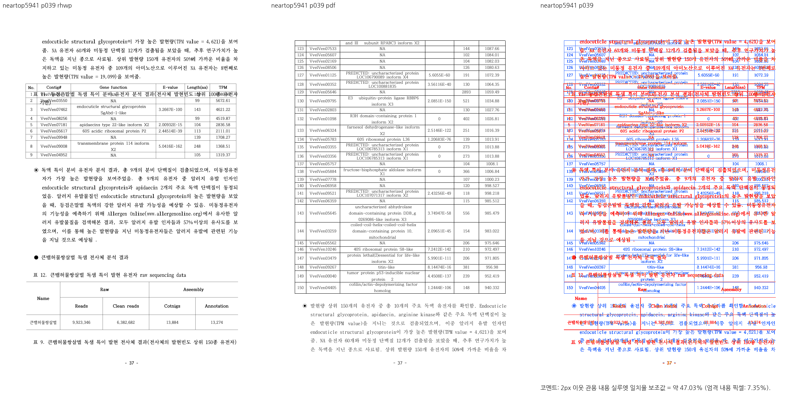

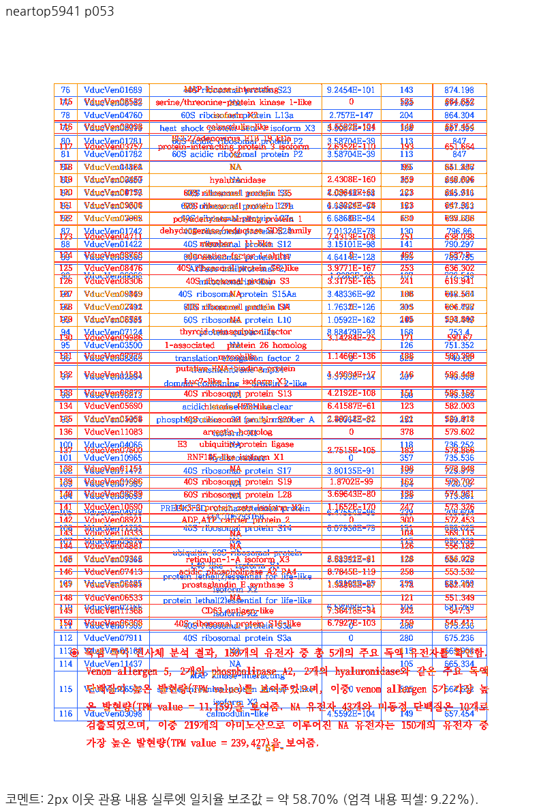

## 추가: 자산관리규정 `3249937`

- [이관 등록 댓글](https://github.com/edwardkim/rhwp/issues/7445#issuecomment-5868575524), [원본 HWPX](3249937_asset_management_rules.hwpx), [기존 독립 PDF60쪽](../../../../pdf/3249937_asset_management_rules-2020.pdf), [선택6쪽 실제 비교·이동·검사 제거 검증](assets6031_test_removal_validation.json).
- 현재59/기준60쪽이며Native3·4·6·15·41·42쪽은모두90%미만(최저41쪽25.22086%)입니다. 본문초과15건과페이지내용소유차이가남습니다. 전체60쪽/fresh WASM비교통과를주장하지않습니다.
- 문서전용#6031/#6409두함수와세원장행을제거하고#7080의자산관리규정입력한개만matrix에서제거합니다. #7080기존5함수·다른두원문·최소20개관측과공차는유지합니다. 원본423,622byte를바이트동일하게보존하고렌더러는바꾸지않습니다.

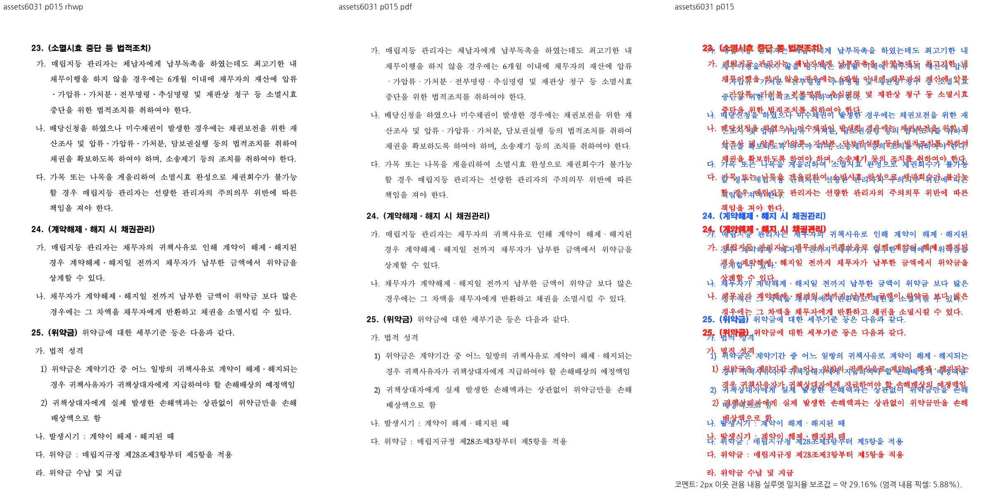


## 추가: 개인정보 분석 편람 `75544`

- [이관 등록 댓글](https://github.com/edwardkim/rhwp/issues/7445#issuecomment-5868672890), [보존 원본HWPX](75544_pii_bunseok.hwpx), [한컴PDF66쪽](../../../../pdf/task2097/75544_pii_bunseok-hwpx-2020.pdf), [선택쪽 비교·검사 제거 검증](pii75544_test_removal_validation.json).
- 현재70/한컴66쪽. Native22쪽93.59725%,46쪽65.56940%,59쪽30.66565%,60쪽30.63875%입니다. 46쪽 표높이/본문흐름과59쪽 내용소유차이를직접확인했습니다. 기존이름2020.pdf는cairo출력이므로이번독립기준으로사용하지않고보존합니다. 전체/fresh WASM통과는주장하지않습니다.
- 문서전용#5846함수와본문초과/캔버스/글자겹침/셀초과/쪽수oracle/render-page의해당원문행만제거합니다. generic함수와다른원문·공차는유지하고, 정적IR추출자료·직렬화계약은보존합니다. 렌더링결함해결로세지않습니다.

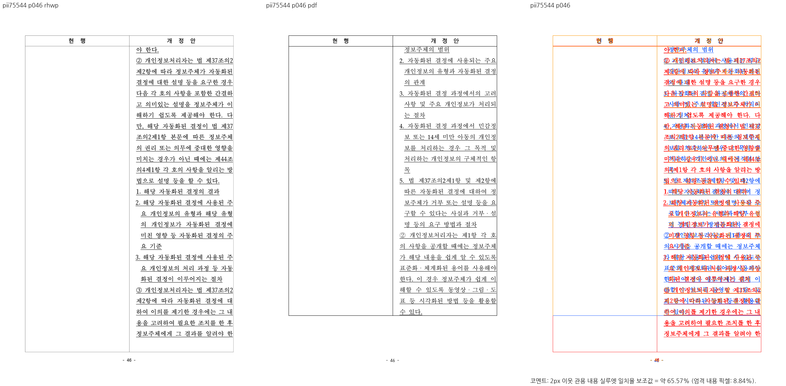


## 추가: 한컴 HWP5 변환본 `hwp3-sample16-hwp5.hwp`

- [보존 원문](hwp3-sample16-hwp5.hwp), [저장제품에 대응한 한컴2024 PDF64쪽](../../../../pdf/hwp3-sample16-hwp5-hwp-2024.pdf), [이관·실제 비교·검사 결과](sample16_test_removal_validation.json). [이관 등록 댓글](https://github.com/edwardkim/rhwp/issues/7445#issuecomment-5868738187).
- 현재65/정상64쪽, Native23쪽26.53989%·24쪽7.09794%·64쪽15.52702%입니다. 23쪽본문하한초과최대97.5467px와24쪽내용소유차이를직접확인했습니다. 전체64쪽/fresh WASM비교는미실행이며전체통과로세지않습니다.
- 이원문의본문초과/쪽수oracle/render-page원장3행과전용렌더링/쪽수11함수·관련helper를제거하고원문을바이트동일하게이동했습니다. #2158/source-side matrix의해당입력만제거합니다. #4680/#3693/#3695/#3744/#4155의파서/구조/문자음영계약과진단입력은유지하고보존경로로수정합니다. HWP3원본과다른연도변환본·정적IR자료·다른원문·공차는유지합니다. 피델리티해결로세지않습니다.

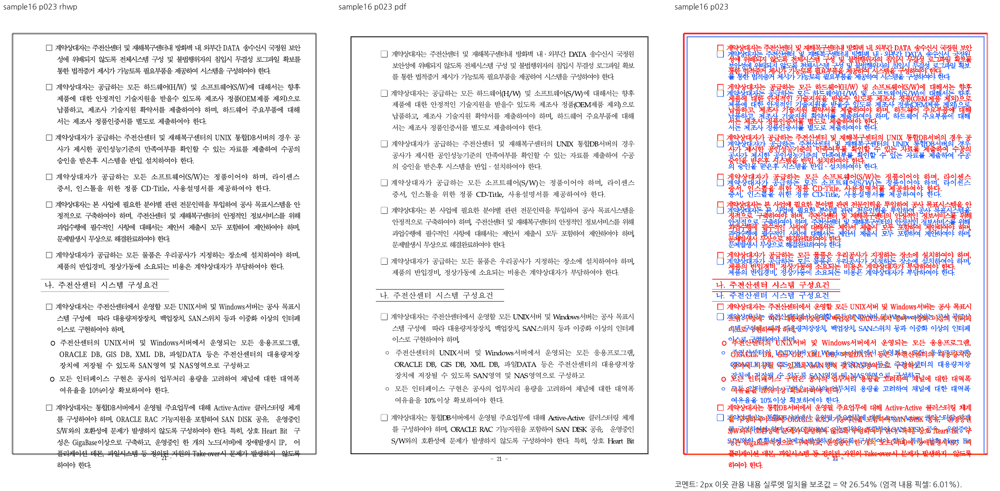


## 추가: HWP3 변환 HWPX sample16

- [이관 등록 댓글](https://github.com/edwardkim/rhwp/issues/7445#issuecomment-5869485533), [보존 원문 HWPX](hwp3-sample16-hwp5.hwpx), [독립 한컴2024 PDF64쪽](../../../../pdf/hwp3-sample16-hwp5-hwpx-2024.pdf), [이동·제거·검증 근거](sample16hwpx_test_removal_validation.json). 기존 HWP5와 별도 입력입니다.
- 현재65/기준64쪽이며 선택7쪽 모두90% 미만입니다. 최저64쪽11.02735%; 6쪽22.67417%에서 본문·표·수식의 세로 위치 차이,64쪽에서 합의각서의 쪽 소유 차이를 직접 확인했습니다. 전체/fresh WASM 통과를 주장하지 않습니다.
- 전용 렌더링/쪽수4함수와 corpus3행만 제거했습니다. 다른 입력의 온새미로 쪽수·HWP3 수식 검사 및 gradient IR 파싱 검사는 유지합니다. 유지 집중7PASS, 필수 lint/정책 exit0이며 생산 코드는 바꾸지 않았습니다. 제외를 피델리티 개선으로 세지 않습니다.

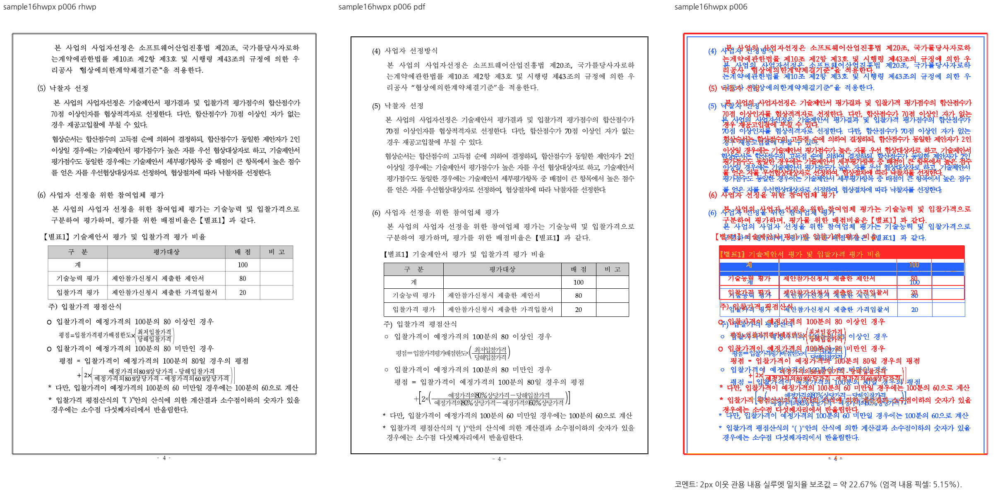

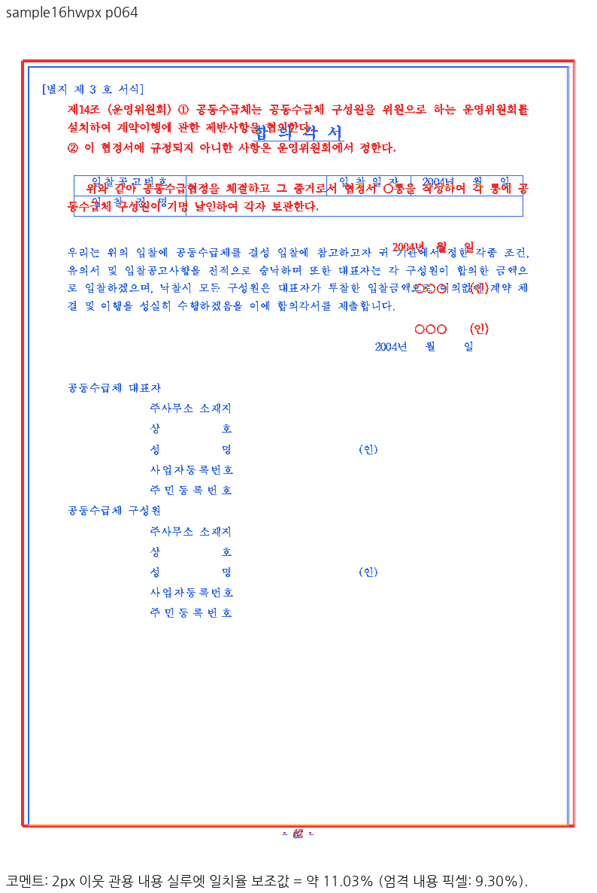

## 추가: sample16의 2010 이름 HWP 저장본

- [이관 등록 댓글](https://github.com/edwardkim/rhwp/issues/7445#issuecomment-5869562651), [보존 원문](hwp3-sample16-hwp5-2010.hwp), [독립 한컴2024 PDF64쪽](../../../../pdf/hwp3-sample16-hwp5-2010-hwp-2024.pdf), [개별 근거와 검증](sample16_2010_test_removal_validation.json). 실제 저장 metadata는 한컴2024이며 다른 버전 입력과 구분합니다.
- 현재65/기준64쪽, 선택7·22·23·24·64쪽 모두90% 미만(최저24쪽7.09794%). 본문 넘침과 페이지 내용 소유 차이를 직접 확인했습니다. 기존2020 이름 PDF는 cairo 출력으로 이번 독립 기준에서 제외하고 보존합니다. 전체/fresh WASM 통과는 주장하지 않습니다.
- #1105 전용2함수와 corpus2행만 제거했습니다. 다른 입력의 함수·공차·기대값과 IR 진단은 유지합니다. 집중8PASS, 필수 lint/정책 exit0. 재배정된 body partition15 통과를 보도자료·rowbreak 문서의 해결로 세지 않습니다.


## 추가: sample16의2022 HWP 저장본

- [이관 등록 댓글](https://github.com/edwardkim/rhwp/issues/7445#issuecomment-5869647971), [보존 원문](hwp3-sample16-hwp5-2022.hwp), [독립 한컴2022 PDF64쪽](../../../../pdf/hwp3-sample16-hwp5-2022-hwp-2020.pdf), [근거·검증](sample16_2022_test_removal_validation.json).
- 현재65/기준64쪽, 선택3·6·23·24·64쪽 모두90% 미만(최저24쪽7.09794%). 3쪽 문단·도형 간격과24쪽 내용 소유 차이를 직접 확인했습니다. 전체/fresh WASM 통과를 주장하지 않습니다.
- 전용6함수와 corpus2행만 제거하고 다른 입력·기대값·공차와 저장 제품/IR 검사는 유지했습니다. 유지8PASS, body partition2의다른3원문은1FAIL이며 필수 lint/정책 exit0입니다. 다른 실패나 원문 피델리티 해결로 세지 않습니다.


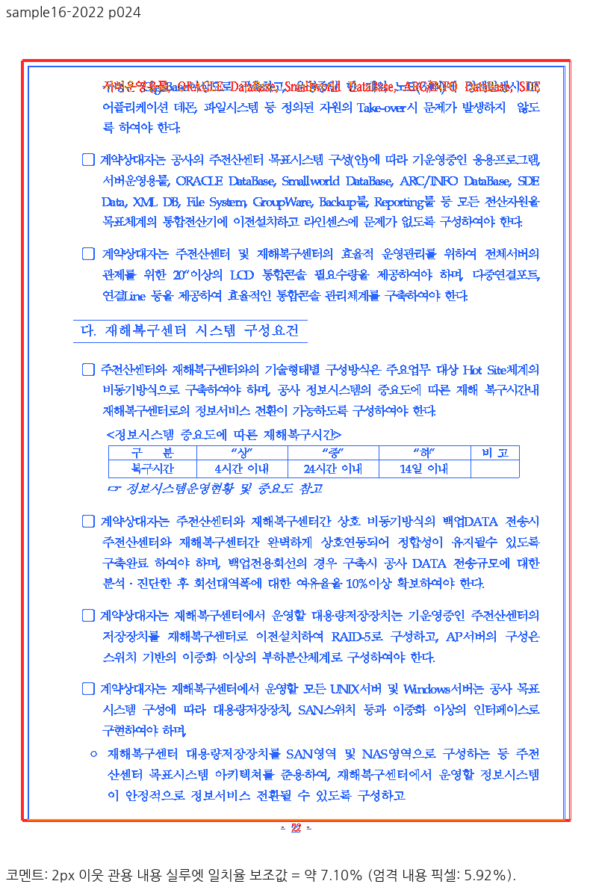

## 추가: 보도자료의 분할 셀·중첩 표 HWPX

- [이관 등록 댓글](https://github.com/edwardkim/rhwp/issues/7445#issuecomment-5869729786), [보존 원문](press_release_split_cell_nested_table.hwpx), [독립 한컴PDF12쪽](../../../../pdf/issue3637/press_release_split_cell_nested_table-hwpx-2020.pdf), [검사 제거와 유지 검증](press3637_test_removal_validation.json). 기존 cairo 출력은 독립 기준으로 쓰지 않고 보존합니다.
- 현재13/기준12쪽, 선택4·5·7·8·12쪽은97.23437/95.89646/91.68111/83.85004/36.41033%. 8쪽 중첩 상자/글줄·배경 차이와12쪽 향후계획 표 및 마지막 내용의 이월을 직접 확인했습니다. 전체/fresh WASM은 미실행입니다.
- 해당 입력의 전용4함수와 corpus3행을 제거했고 원문/PDF를 유지했습니다. 다른 입력·합성 계약·공차는 유지합니다. 유지5PASS/별도 입력2FAIL, 필수 lint/정책 exit0입니다. 제외를 원문 피델리티 개선이나 다른 실패의 해결로 세지 않습니다.

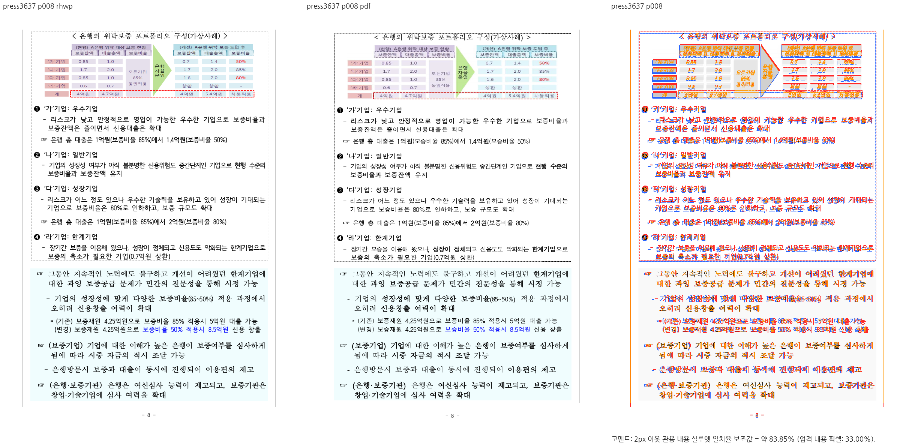


## 추가: rowbreak HWP의 표 분할과 내용 소유

- [이관 등록 댓글](https://github.com/edwardkim/rhwp/issues/7445#issuecomment-5869840624), [보존 HWP](rowbreak-problem-pages.hwp), [같은 원문의 독립 한컴2024 PDF18쪽](../../../../pdf/rowbreak-problem-pages-hwp-2024.pdf), [검사 제외·보존과 검증](rowbreak_hwp_test_removal_validation.json).
- 실제/기준 모두18쪽이지만 선택 Native3·8·12·13·17·18쪽은96.83411/49.39444/80.05503/71.99775/99.82183/88.25163%입니다. 8쪽 이전 내용 이어받기와 제27조 셀 경계/후속 항목 소유 차이를 직접 확인했습니다. 전체18쪽/fresh WASM 통과를 주장하지 않습니다.
- HWP 전용5함수와 공용4함수의 HWP matrix 입력, corpus3행만 제거했습니다. HWPX와 다른 matrix·기대값·공차는 유지하며, 순수 #1770 origin-marker 파서 계약은 보존 경로만 수정했습니다. #4967 cache-key 함수는 실제 page tree를 검증하므로 HWP 렌더링 검사 제외에 포함합니다. 정적 IR 자료는 보존합니다. 새 함수/ignore/skip/생산 변경은 없습니다.


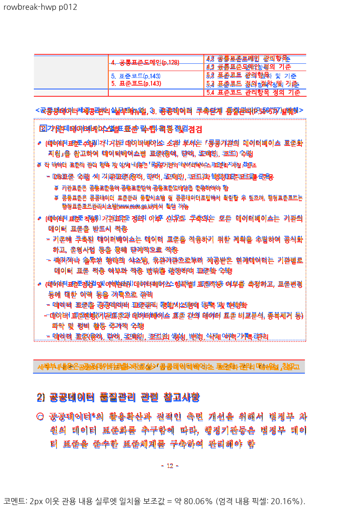

## 추가: 항공교통관제사 CBTA 도입 연구

- [등록 댓글](https://github.com/edwardkim/rhwp/issues/7445#issuecomment-5869952956), [보존 HWP](1613000-202200037-air-traffic-controller-cbta.hwp), [같은 원문의 독립 한컴 PDF204쪽](../../../../pdf/1613000-202200037-air-traffic-controller-cbta-2020.pdf), [제외와 개별 검사 검증](air6764_test_removal_validation.json).
- 현재201/기준204쪽. 선택 Native39·103·124·194·201쪽은98.12011/37.65331/23.8889/38.95167/11.45426%입니다.103쪽의 로드맵 그림24와 뒤 설명 대신 앞 내용,201쪽의 역량 표 대신 부록5 영문 평가양식이 표시되는 차이를 직접 확인했습니다. 전체204쪽/fresh WASM 비교는 미실행입니다.
- 원문12,851,712byte를 바이트 동일하게 보존하고 전용4함수와 corpus3행만 제거했습니다. 다른 문서·기대값·공차 유지, 새 함수/ignore/skip/생산 변경 없음. 기존 body partition2는 개별1PASS/239SKIP(exit0), 필수 lint·고정 base 정책도exit0입니다. 제외를 피델리티 개선으로 보고하지 않습니다.

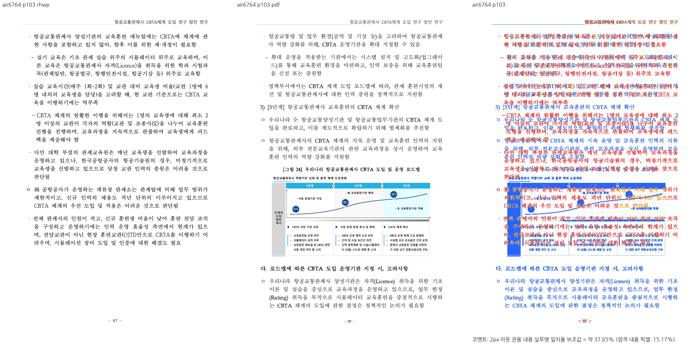


## 추가: 전기안전관리법 시행규칙 규제영향분석서70833

- [등록 댓글](https://github.com/edwardkim/rhwp/issues/7445#issuecomment-5870144757), [보존 HWP](70833-electrical-safety-rule-regulatory-analysis.hwp), [같은 원문의 독립 한컴 PDF18쪽](../../../../pdf/70833-electrical-safety-rule-regulatory-analysis-2020.pdf), [검사 제외와 유지 검증](electrical6854_test_removal_validation.json).
- 실제18/기준18쪽이나 Native5·6·10·14·18쪽37.05508/35.31196/19.83933/93.80158/20.13671%입니다.5쪽의 이전 표 반복/다음 표 소유 차이,10쪽의 규제 적정성 대신 이전 이해관계자 표와 규제목표가 표시되는 차이를 review에서 직접 확인했습니다. 전체/fresh WASM 통과를 주장하지 않습니다.
- 원문70,656byte를 바이트 동일하게 보존하고 HWP 전용2함수와 corpus2행만 제거했습니다. 춘천 인사 규칙 HWPX2함수·helper·기대값·공차 유지, 새 함수/ignore/skip/생산 변경 없음. 기존6번 단독1PASS와 유지 HWPX2PASS(집중3PASS/466SKIP,exit0), 필수 lint·고정 base 정책exit0입니다. 이관을 피델리티 개선으로 세지 않습니다.

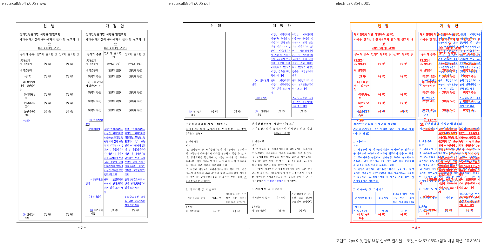


## 추가: 권익위 제도개선 권고안30269와 동일 원문 중복 등록

- [등록 댓글](https://github.com/edwardkim/rhwp/issues/7445#issuecomment-5870283939), [#6844 보존 원문](30269-anticorruption-recommendation-toc.hwp), [#6023 바이트 동일 원문](30269_reform_recommendation.hwp), [독립 한컴 PDF22쪽](../../../../pdf/30269-anticorruption-recommendation-toc-2020.pdf), [이관·동일 해시·유지 계약 검증](anticorruption6844_test_removal_validation.json).
- 현재22/기준22쪽이나 선택 Native2·5·6·22쪽100.0/68.7493/29.19654/94.66351%입니다.5쪽의 다음 장 제목이 본문 하단·쪽번호 영역에 미리 표시되고 도형/본문 위치도 어긋나는 차이를 review에서 직접 확인했습니다. 전체/fresh WASM 통과를 주장하지 않습니다.
- 두 경로는 각470,016byte/SHA-256동일이며 바이트 동일하게 보존했습니다. 렌더링 전용5함수를 제거하고 #6806 속성 getter/setter·저장0높이 복원은 유지합니다. undo 함수의 SVG 비교만 제거하고 IR 추출 자료는 보존합니다. 해당 렌더링 baseline 행은 원래 없습니다. 다른 입력·공차 유지, 새 함수/ignore/skip/생산 변경 없음. 기존7번 단독1PASS와 유지속성2PASS(집중3PASS/477SKIP,exit0), 필수 lint·고정base정책exit0입니다. 이관을 피델리티 개선으로 세지 않습니다.


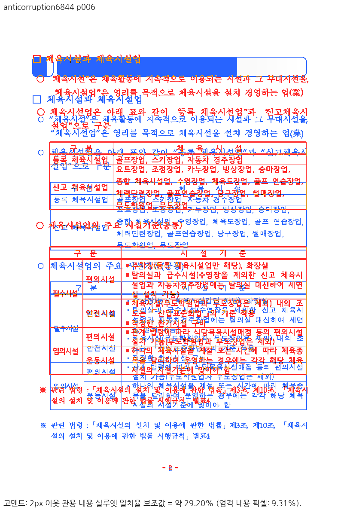

## 추가: 영어시험 `exam_eng.hwp`

- [등록 댓글](https://github.com/edwardkim/rhwp/issues/7445#issuecomment-5870452250), [보존 원문](exam_eng.hwp), [독립 한컴 PDF8쪽](../../../../pdf/exam_eng-hwp-2020.pdf), [전체 Native와 검사 제거·유지 검증](exam_eng_test_removal_validation.json). 기존2022 PDF도 보존합니다.
- 현재8/기준8쪽이나 전체 Native1~8쪽은96.02165/89.09228/68.69443/55.25926/60.04261/51.55944/48.54225/79.13315%입니다.4쪽의 문항27 표와 문단,7쪽의 지문·선택지·상자·각주와 머리 쪽번호 차이를 직접 확인했습니다. 글꼴 예외 없음, fresh WASM 미실행입니다.
- 원문3,486,208byte를 바이트 동일하게 보존하고 전용 렌더링·페이지8함수, #7061 입력1개, 렌더링 원장3행을 제거했습니다. HWP→HWPX 총쪽수 AutoNumber 파싱·직렬화와 IR진단은 유지합니다. 다른 입력·기대값·공차 유지, 새 함수/ignore/skip/생산 변경 없음. 집중 결과는 ['        FAIL [   2.427s] (17/17) rhwp::regression_suite_019 body_overflow_baseline::body_overflow_does_not_grow_partition_9', '     Summary [   2.456s] 17 tests run: 16 passed, 1 failed, 5156 skipped', '        FAIL [   2.427s] (17/17) rhwp::regression_suite_019 body_overflow_baseline::body_overflow_does_not_grow_partition_9', '     Summary [   0.183s] 1 test run: 1 passed, 215 skipped']이며 필수 lint/고정base정책 결과는 위 JSON에 기록했습니다. 원문 피델리티 해결/전체 회귀 완료로 세지 않습니다.


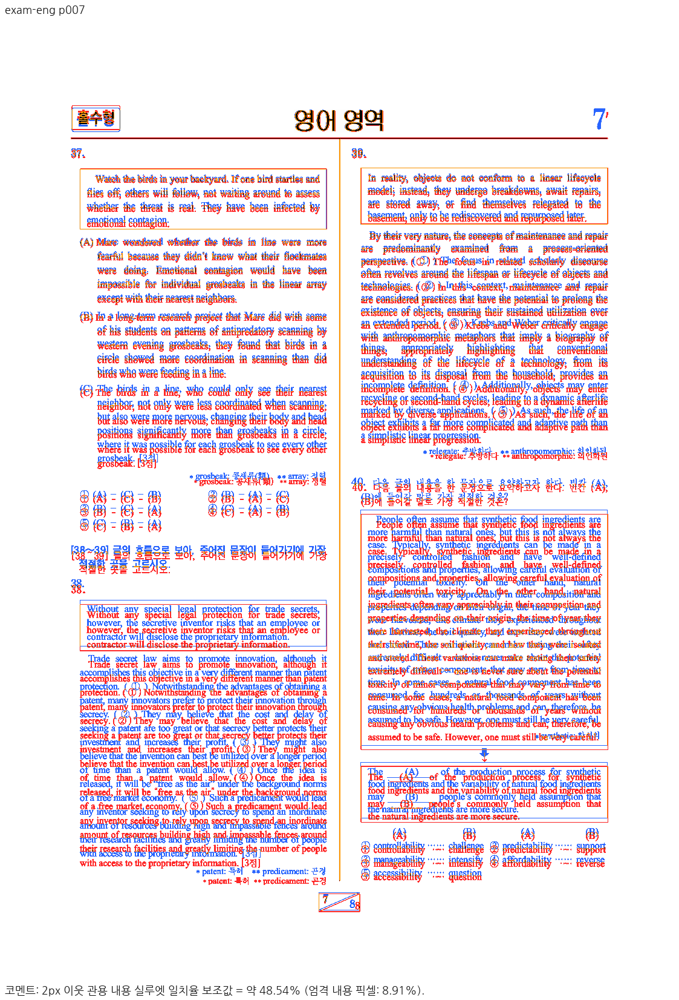

영어시험 추가 정정: CanvasKit native/browser manifest의 같은 원문1항목도 제외했습니다. 나머지121개 입력 존재와 실제 manifest 로딩 PASS입니다. 정확한 항목·커밋은 위 JSON의 `manifest_followup_correction`에 기록했습니다.

## 추가: HWP 컨트롤 API v2.4

- [등록 댓글](https://github.com/edwardkim/rhwp/issues/7445#issuecomment-5870586821), [보존 원문](hwpctl_API_v2.4.hwp), [동일 원문의 독립 한컴 PDF105쪽](../../../../pdf/hwpctl_API_v2.4-hwp-2020.pdf), [시각·제외·유지 검증](api24_test_removal_validation.json). 다른2020·2022 이름 PDF도 보존합니다.
- 현재105/기준105쪽이나 선택 Native1·28·52·60·74·75·105쪽98.99519/98.33864/99.4403/99.67137/60.06836/98.19912/97.85668%입니다.74쪽 첫 데이터행이 기준14 대신 앞쪽의13으로 시작해 표와 후속 설명이 아래로 밀리는 내용 소유 차이를 직접 확인했습니다. 전체105쪽/fresh WASM은 미실행입니다.
- 262,144byte 원문을 바이트 동일하게 보존하고 렌더링·페이지23함수, 원장4행, CanvasKit manifest1항목을 제거했습니다. 순수 #3695 개요 구조 파싱/IR과 다른 문서4함수 및 IR원장은 유지합니다. 다른 공차·기대값 유지, 새 함수/ignore/skip/생산 변경 없음. 집중 ['     Summary [   0.913s] 18 tests run: 18 passed, 1078 skipped']; 필수 lint/정책 결과는 JSON에 기록했습니다. CanvasKit 나머지120입력의 존재·실제 manifest 로딩 PASS입니다.


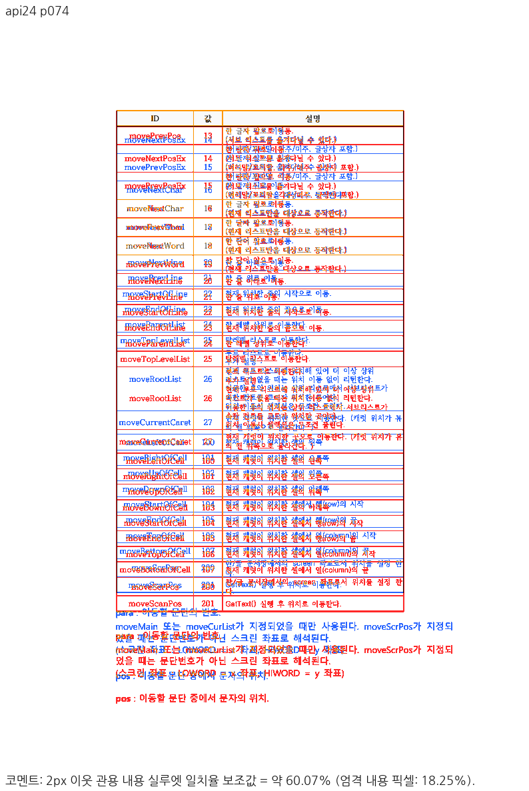

## 추가: 소상공인 중간보고서 RowBreak 표·각주 #1937

- [등록 댓글](https://github.com/edwardkim/rhwp/issues/7445#issuecomment-5870699037), [보존 원문](issue1937_rowbreak_footnote_overpagination.hwp), [독립 한컴 PDF50쪽](../../../../pdf/issue7382-regression-review/issue1937_rowbreak_footnote_overpagination-2020.pdf), [시각·제외·유지 검증](footnote1937_test_removal_validation.json).
- 현재51/기준50쪽. 선택 Native24·42·43·44·45·50쪽92.59251/53.92934/41.51422/14.87881/38.19829/28.18537%입니다.43쪽 이전 표/각주가 겹치고44쪽은 정상43쪽 본문으로 밀리는 차이를 직접 확인했습니다. 전체50/51쪽/fresh WASM 통과를 주장하지 않습니다.
- 원문147,456byte를 바이트 동일하게 보존하고 전용 페이지·각주 쪽번호2함수와 body/text 원장2행을 제거했습니다. #1133 다른 문서6함수·helper·기대값·공차 및 IR 진단은 유지합니다. CLI의90% 위치 손상본 패닉 방지는 독립 안전성 계약으로 보존 경로만 바꾸며 같은4입력을 유지합니다. 새 함수/ignore/skip/생산 변경/공차 완화 없음. 집중 ['     Summary [   1.213s] 8 tests run: 8 passed, 455 skipped']; 필수 lint/정책은 위 JSON에 정확한 exit를 기록했습니다.


## 추가: 화학제품 표시 기준 축소 HWP #6782

- [등록 댓글](https://github.com/edwardkim/rhwp/issues/7445#issuecomment-5870791302), [보존 축소본](1480000-201900042-chemical-labeling-standards.hwp), [축소본 자체의 독립 한컴 PDF103쪽](../../../../pdf/issue7382-regression-review/1480000-201900042-chemical-labeling-standards-2020.pdf), [시각·제외·유지 검증](chemical6782_test_removal_validation.json). 기존 PDF와 별도 전체 원본은 보존합니다.
- 현재103/기준103쪽이나 선택 Native76·77·78·83·103쪽60.7561/99.27598/53.67396/99.79822/99.98703%입니다.76쪽 캡션이 앞 문단과 겹치고78쪽 표 행 높이·외곽·후속 표 캡션 위치가 다른 차이를 직접 확인했습니다. 전체103쪽/fresh WASM은 미실행입니다.
- 193,536byte 축소본은 전체 원문6,521,856byte와 해시가 다른 입력입니다. 축소본만 바이트 동일하게 이관하고 렌더링·페이지/물리 배치14함수, #7048 두matrix의 축소본 입력, body 원장1행을 제거했습니다. #7048 전체 원문의3함수와 다른 원문 검사·helper·기대값·공차를 유지합니다. 새 함수/skip/ignore/생산 변경/공차 완화 없음. 집중 ['     Summary [   1.328s] 4 tests run: 4 passed, 450 skipped']; 필수 lint/정책은 위 JSON에 기록했습니다. 개별기대값오류확정이나 원문 피델리티 해결로 세지 않습니다.

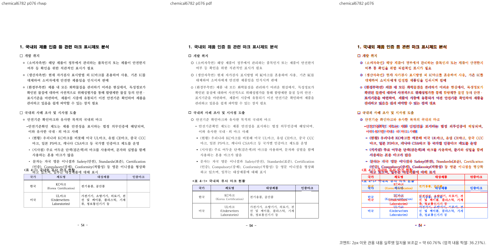

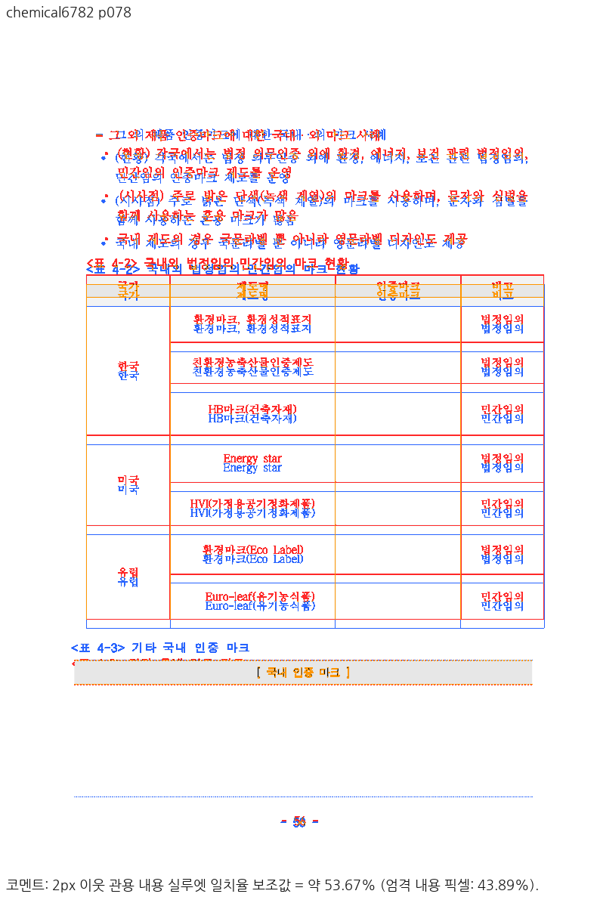

## 추가: 공개 결재문서36375752 saved-bounds HWPX

- [등록 댓글](https://github.com/edwardkim/rhwp/issues/7445#issuecomment-5870886007), [보존 HWPX](saved_bounds_cumulative_page_break.hwpx), [독립 한컴2024 PDF5쪽](../../../../samples/task1749/saved_bounds_cumulative_page_break-2024.pdf), [원문/PDF 대응·전수 비교·제외·유지 검증](savedbounds1749_test_removal_validation.json). 기존 PR#1752/계획#1811/결과#2015의 입력별 PDF 대응을 확인했습니다.
- 현재5/기준5쪽이나 전체 Native1~5쪽94.04792/98.06349/82.65886/72.63884/30.44845%입니다.4쪽 표와 후속 문단의 겹침9건·표의 페이지 소유,5쪽 이어받기와 뒤 내용 위치 차이를 직접 확인했습니다. fresh WASM은 미실행입니다.
- 51,205byte HWPX만 바이트 동일하게 보존하고 렌더링·페이지3함수와 body 원장1행을 제거했습니다. #1811 혼합 함수의 HWPX 페이지/cut 부분만 제외하고 셀52/57 저장 IR 및 HWP5쪽/3유닛컷 대조군 기대값·공차를 유지합니다. same-id 역사적IR catalogue와 배열 경계 계약도 유지합니다. IR/HWP 대조군을 HWPX fidelity 승인으로 세지 않습니다. 새 함수/ignore/skip/생산 변경/공차 완화 없음. 집중 ['     Summary [   1.181s] 4 tests run: 4 passed, 628 skipped']; 필수 lint/정책은 위 JSON에 정확히 기록했습니다.


## 추가: 한컴 공식 형식5.0 revision1.3 배포용 HWP

- [등록 댓글](https://github.com/edwardkim/rhwp/issues/7445#issuecomment-5871244705), [보존 원문](한글문서파일형식_5.0_revision1.3.hwp), [공식 PDF71쪽](../../../../pdf/한글문서파일형식_5.0_revision1.3-hancom-official.pdf), [동일 원문 해시·PDF출처·시각 비교·제외·유지 검증](format_spec13_test_removal_validation.json). 공식CDN의 HWP가 저장소 원문과 SHA-256 동일하며 PDF Creator/원문저장빌드 모두2018/10.0.0.7282입니다.
- 현재69/기준71쪽.선택Native1/15/16/48/49/50/68/69쪽은96.24622/40.68047/31.25675/38.87576/26.93028/35.3439/18.57411/0%입니다.15/49쪽 표 내용·분할과 머리말,69쪽 발행정보 페이지 소유 차이를 직접 확인했습니다.전체비교/freshWASM은 미실행입니다.
- 렌더링·페이지4함수/body·offcanvas2행만 제외, IR원본표식·프로필/왕복2함수 및 다른입력3함수 유지.원문342,528byte 불변/공식PDF830,986byte 보존, 생산변경/새 함수/skip/ignore/공차완화 없음.집중5PASS/다른입력1FAIL,필수lint·정책 통과.기존30번은pr4093입력의2건으로 pending 유지합니다.이관을피델리티 개선으로 세지 않습니다.

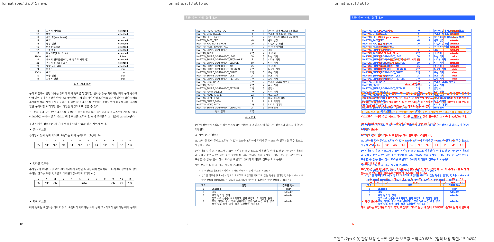


## 추가: PR#4093 개요 탐색 패널 합성 HWPX

- [등록 댓글](https://github.com/edwardkim/rhwp/issues/7445#issuecomment-5871352884), [보존 데모](outline_navigation_panel_demo.hwpx), [같은 입력의 독립 PDF3쪽](../../../../pdf/issue7382-regression-review/outline_navigation_panel_demo-2020.pdf), [입력생성·변환출처·전수비교·유지검증](outline4093_test_removal_validation.json).생성원문SHA와한컴변환job/다운로드SHA대조.
- 전체Native1/2/3쪽100/100/51.51148%,현재3/기준3쪽.3쪽표셀번호와뒤개요겹침2건·후속내용위치차이를직접확인했습니다.freshWASM 미실행.합성입력/글꼴차이로면제하지않습니다.
- 기존데모함수의쪽수/이동쪽/SVG assertion만 제외하고15개번호·제목·수준getter계약및다른최소입력SVG계약유지.검사함수추가/ignore/skip/생산/공차변경없음.생성기의데모출력도여기보존경로로변경하고재생성해시동일확인.집중 ['     Summary [   2.402s] 3 tests run: 3 passed, 447 skipped'],필수lint/정책exit0.기존30번완료이나최종37개/전체회귀완료는별도입니다.


## 추가: 가상융합산업 시행령 HWP5

- [등록 댓글](https://github.com/edwardkim/rhwp/issues/7445#issuecomment-5871489510), [보존 원문](78494-virtual-convergence-industry-decree.hwpx), [독립 한컴 PDF74쪽](../../../../pdf/78494-virtual-convergence-industry-decree-2020.pdf), [해시·출처·시각·제외·유지 검증](decree6776_test_removal_validation.json). 확장자 HWPX인 실제 HWP5이며 원문/PDF 해시가 기존 등록 manifest와 같습니다.
- 현재74/기준74쪽. Native선택1/18/19/20/62/63/64/74쪽96.29144/65.08307/59.24283/75.06816/98.18586/72.34041/93.57324/51.68936%입니다. 19쪽 그림·표/뒤 본문과63쪽 참고상자·하단쪽번호 충돌을 직접 확인했습니다. 전체 비교/fresh WASM은 미실행입니다.
- 원문576,512byte 보존, 렌더링2함수/body1행만 제외하고 등록 manifest의 경로·역할을 이관했습니다. 다른 비-TAC그림입력의 기존 음성대조1함수·기대값/helper/공차 유지, 새 함수/skip/ignore/생산 변경/허용치 완화 없음. 집중 ['     Summary [   2.611s] 2 tests run: 2 passed, 444 skipped'], 필수 lint·정책 exit0입니다. 이관을 원문 피델리티 개선으로 세지 않습니다.


## 추가: PR#4093 최소 개요·표셀 번호 합성 HWPX

- [등록 댓글](https://github.com/edwardkim/rhwp/issues/7445#issuecomment-5871582903), [보존 원문](outline_navigation_table_cell_number.hwpx), [같은입력의 독립 PDF1쪽](../../../../pdf/issue7382-regression-review/outline_navigation_table_cell_number-2020.pdf), [생성·변환 출처·전수 비교·제외·유지 검증](outline_minimal4093_test_removal_validation.json).
- Native 전체1쪽85.44776%,현재1/기준1쪽. 표셀번호와뒤3.요구사항의겹침을 직접 확인했습니다. freshWASM 미실행, 합성입력/글꼴차이로 면제하지 않았습니다.
- 기존최소입력함수의SVG번호 assertion만제외하고3개번호·제목·수준getter계약/데모15항목getter계약·기존함수이름유지. 생성기최소출력도보존경로로변경/재생성원문SHA동일확인. 새검사/생산변경/skip/ignore/공차완화 없음. 집중 ['     Summary [   0.838s] 3 tests run: 3 passed, 424 skipped'],필수lint·정책exit0. 이관을피델리티개선이나질의통과를렌더링승인으로세지않습니다.

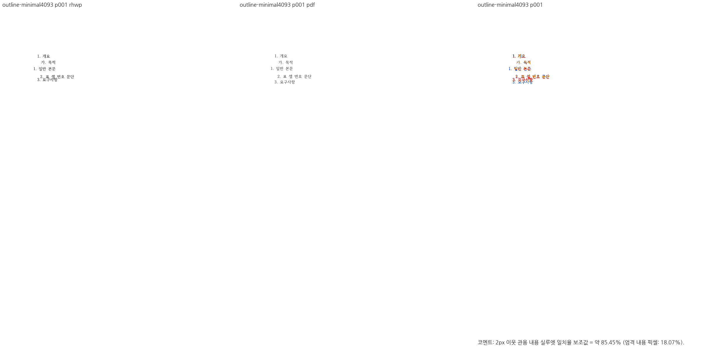

## 추가: #6782 화학제품 표시기준 연구 전체 원문

- [등록 댓글](https://github.com/edwardkim/rhwp/issues/7445#issuecomment-5871748601), [보존 원문](1480000-201900042-chemical-product-labeling-study.hwp), [독립 PDF103쪽](../../../../pdf/1480000-201900042-chemical-product-labeling-study-2020.pdf), [해시·시각·제외·검증 근거](chemical_full6782_test_removal_validation.json). 축소본과 다른6,521,856byte 원문입니다.
- 현재103/기준103쪽, 선택8쪽 Native 최저78쪽49.36129%.39쪽50.07638/76쪽61.10728%.76쪽 표·캡션/본문 겹침,78쪽 인증마크 그림 누락을 직접 확인했습니다. 전체103쪽/freshWASM 미실행입니다.
- 렌더링19함수/8파일 및 body1행 제외, 원문/PDF 보존. 기존 축소본 manifest의 남아 있던 이전 경로·역할도 수정했습니다. 다른 입력·IR 역사 목록·공차 유지. 새 검사/생산 변경/skip/ignore/허용치 완화 없음. 집중 ['     Summary [   2.687s] 1 test run: 1 passed, 223 skipped'], 필수8단계 exit0. 이관을 피델리티 개선으로 세지 않습니다.

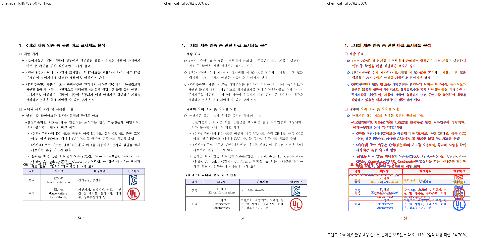

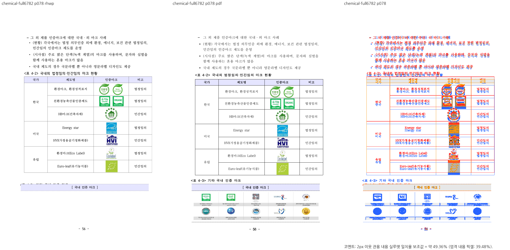

### 전체 원문 제외 범위 정정(보정105)

보정103의19개 정상검사 동반제외를 철회했습니다. 원문 samples와 body원장1행, 기존19함수/기대값을 복원했으며 ['     Summary [   3.632s] 20 tests run: 20 passed, 1920 skipped']입니다. 필수8단계exit0, 코드 `9efd1823c57b9e9417ef15cf7492269c27f2c8cb`, [복원·검증 근거](chemical_full6782_scope_correction_validation.json). #7382를 실제 막는 text-overlap 신규2건의 문서 입력만 보류합니다. 부정시각증거와 보존 원문은 유지합니다.

### 각주 쪽번호 검사는 제외 대신 전제 교정(보정107)

24쪽에는독립PDF/현재출력모두각주가없고실제25쪽에각주가있습니다.기존함수의페이지전제만교정했고기준선·공차는유지했습니다.Native/freshWASM25쪽97.33607%,집중9PASS입니다. [검사유지·독립근거·수정전후결과](../pr7382_20260926/stage107_footnote_anchor_validation.json).원문51/50쪽및뒤쪽피델리티미달의이관은유지하지만정상/교정된회귀는계속검사합니다.

### 소스 내부 정상 회귀 복원(보정108)

영어시험의기존표여백·총쪽수2함수와sample16기존혼합함수의문서스타일·쪽테두리assertion을복원했습니다.집중4PASS/필수8단계exit0.기대값·공차·생산코드유지/새함수없음.코드 `3e965ae01ce3c1e323b80342d93d76bb96063bd2`, [복원·명령·소스·입력해시](source_unit_scope_restore_validation.json). PASS를원문전체피델리티승인으로세지않습니다.

## 보정109: API·영어의 정상 원장 및 렌더러 범위 복원

[범위·실행 근거](corpus_api_eng_scope_restore_validation.json)에 따라 원본 samples 입력과 renderer2항목, 정상 text/oracle/matrix 행을 복원했습니다. 집중11PASS/필수8단계exit0이며 본문 넘침만 명시적으로 보류합니다. 이전 문서 전체 검사 제외 서술은 이 범위로 정정합니다. backend 캡처와 문서 전체 피델리티/최종 회귀 완료는 별도 미완료입니다.

## 보정110: 정상 corpus 범위 복원 완료, 실패는 개별 판정

[보류 축·22원문·복원 행·실행 근거](corpus_scope_restore_validation.json)에 따라 보정69 이후 이동 원문을 samples에도 복원했습니다. 정상 원장24행을 원래 값으로 유지하고 확인된 실패 축만 명시적으로 보류합니다. corpus/matrix86검사는63PASS/23FAIL이며23실패를 자동 이관/제거하지 않았습니다. 기존 개별15실패와 대조해 입력별로 처리합니다. 검사 복원이 문서 피델리티 개선이나 최종회귀 통과를 뜻하지 않습니다. 이전 문서 전체 검사 제외 서술은 보정105~110의 범위로 정정합니다.

## 추가: rowbreak HWPX의 실제 차단 검사만 보류

- [등록 댓글](https://github.com/edwardkim/rhwp/issues/7445#issuecomment-5872944940), [원본HWPX](../../../../samples/rowbreak-problem-pages.hwpx), [정상 한컴PDF18쪽](../../../../pdf/rowbreak-problem-pages-hwpx-2020.pdf), [전체Native18쪽·독립기대·검사범위·실행](rowbreak_hwpx_blocking_scope_validation.json).
- 전체최저9쪽20.18283%,13개쪽90%미달. 실패2함수와text의이입력만보류하고다른18함수/모든다른축은유지했습니다. 남은18함수PASS/필수8단계exit0이며원문피델리티 개선이나전체회귀완료로세지않습니다.

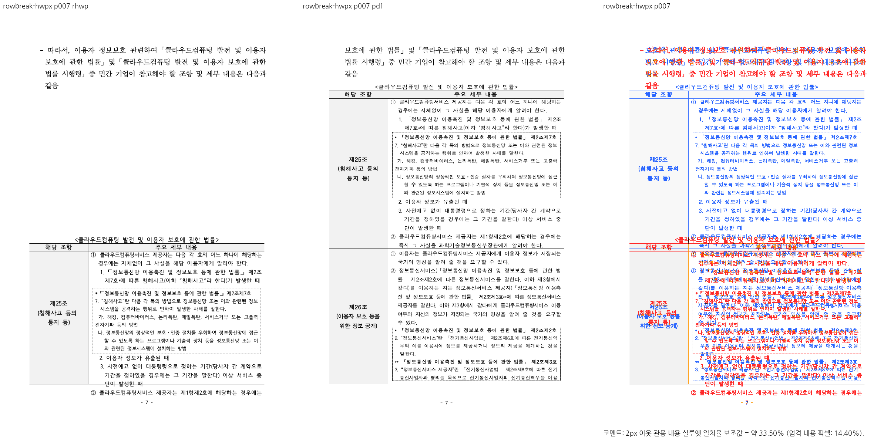

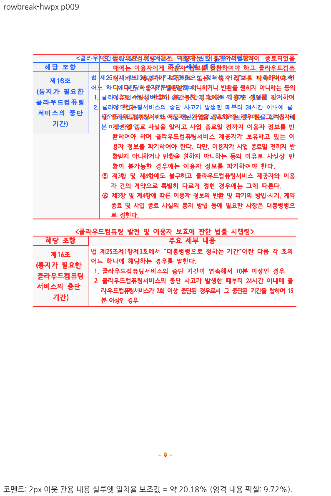

## 보정112: 정상 검사는 samples 원문을 소비

보정69 이후 복원 원문22개는 증거 사본과 동일 바이트입니다. 정상76파일/135경로를 canonical samples로 복원했고 기존 집중19개와 소스 내부4개 및 필수 lint/정책은 통과했습니다. [해시·소비 경로·검증](normal_reader_scope_restore_validation.json). 과거 증거 사본은 보존하며, 이 복원을 전체 회귀 통과로 세지 않습니다.

## 추가: 영어시험 #6030 실제 차단 한 함수만 보류

[등록·범위정정](https://github.com/edwardkim/rhwp/issues/7445#issuecomment-5870452250), [명령·증거·유지검사](exam_eng_6030_blocking_scope_validation.json). 전체8쪽최저48.54225%,영향6쪽51.55944%인동일후보에서실패한한함수만보류했습니다. 기존문서전체제외기록은현재범위가아니며다른영어시험검사·원문·PDF·정상corpus는유지합니다. 유지8개와소스내부2개PASS,필수lint/정책exit0. 원문개선/전체검증완료아닙니다.

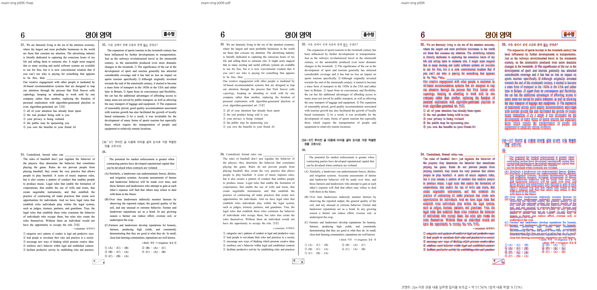

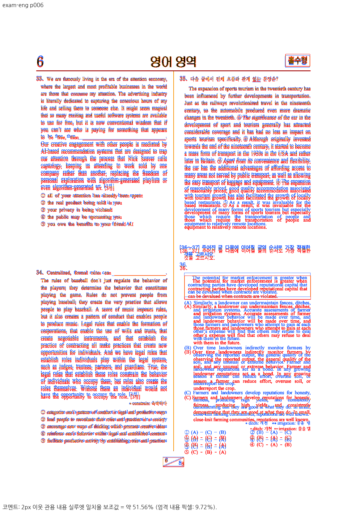

## 추가: PII의 실제 차단 한 함수와 혼합 쪽수 항목

[범위 정정 댓글](https://github.com/edwardkim/rhwp/issues/7445#issuecomment-5868672890), [독립 PDF·실패·제외 범위·명령](pii5846_blocking_scope_validation.json). #5846 한 함수와 #2097의 PII 쪽수 항목만 보류했습니다. 다른 정상 #3595 두 함수와 #2097의 다섯 입력은 유지했고3PASS입니다. 필수8단계exit0입니다. 동일 후보의 선택4쪽 최저30.63875%이며 원문/PDF를 유지합니다. cairo PDF를 독립 정답지로 사용하지 않고, 원문 개선이나 전체 회귀 통과로 보고하지 않습니다.

## 추가: 자산관리규정의 실제 실패 두 함수와 off-canvas 입력

[범위 갱신](https://github.com/edwardkim/rhwp/issues/7445#issuecomment-5868575524), [독립 PDF·실패·좁은 보류·재실행](assets6031_blocking_scope_validation.json). #6031/#6409 두 함수와 off-canvas 이 입력만 보류했습니다. 원문/PDF·다른cell/text축·모든다른문서는 유지합니다. 선택6쪽 최저25.22086%이며 전수/fresh WASM 완료가 아닙니다. 집중1PASS/1FAIL(다른2022변환본), lint·정책7단계exit0입니다. 낮은 점수를 이유로 문서의 모든 검사를 제거하지 않습니다.

## 추가: 2022 변환본의 실제 세 함수와 text/off 입력

[범위 갱신](https://github.com/edwardkim/rhwp/issues/7445#issuecomment-5869647971), [동일 원문·실패·좁은 보류·실행](sample16_2022_blocking_scope_validation.json). 실제3함수와 text/off의이입력만 보류하고 정상IR/다른버전·원문/PDF·다른축/문서는 유지했습니다. 선택5쪽 최저7.09794%이며 전수/freshWASM 완료가 아닙니다. 정상11함수PASS, text/off32분할24PASS/8FAIL, lint·정책7단계exit0입니다. 다른8실패함수는 개별 판단 대상으로 남겼습니다.

## 추가: 동일 HWP 두 이름의 실제 차단 범위

[기본원문 범위](https://github.com/edwardkim/rhwp/issues/7445#issuecomment-5868738187)·[2010이름 범위](https://github.com/edwardkim/rhwp/issues/7445#issuecomment-5869562651), [동일 바이트·독립 PDF·실패·좁은 보류·검증](sample16_aliases_blocking_scope_validation.json). 두 이름은 같은 입력이며 한컴PDF64쪽도 전체72DPI래스터가 같습니다. 실패5함수와 두 이름의text/off축만 보류하고 정상그림/목차/IR·source-unit·다른버전·원문/PDF·다른축은 유지했습니다. 정상14PASS, text/off24PASS/8FAIL, lint·정책7단계exit0입니다. 영향24쪽7.09794%이며 전수Native/freshWASM 또는 전체회귀 완료가 아닙니다.

## 추가: HWPX의 실제 실패 쪽수만 보류

[범위 갱신](https://github.com/edwardkim/rhwp/issues/7445#issuecomment-5869485533), [단독 실패·뒤 좌표 진단·동일입력 PDF·유지검사](sample16_hwpx_blocking_scope_validation.json). #6706 함수/좌표·소유 검사는 유지하고 실패 쪽수 assertion 하나만 보류했습니다. #2158 쪽수 전용 한함수만 보류했고 온새미로 및 정상 수식/따옴표/IR·다른 corpus·원문/PDF 유지. 10PASS, 필수8단계exit0입니다. 전체 피델리티 승인/전체회귀 완료는 아닙니다.

## 추가: 저장 bounds의 실제 실패 컷만 보류

[범위 갱신](https://github.com/edwardkim/rhwp/issues/7445#issuecomment-5870886007), [개별실패·정상대조·유지검사](savedbounds1749_blocking_scope_validation.json). HWPX 컷 assertion 하나만 보류하고 함수 자체/정상5쪽/host순서·HWP컷/IR52·다른2함수 및 다른축·원문/PDF는 유지했습니다. 기존3함수PASS, 필수8단계exit0입니다. 전체Native 최저30.44845%의 부정증거이며 전체피델리티 승인/전체회귀 완료는 아닙니다.

## 추가: near-top 원문의 실제 text-overlap 축만 보류

[등록 범위 갱신](https://github.com/edwardkim/rhwp/issues/7445#issuecomment-5868460165), [단독실패·부정증거·유지검사/전수분할](neartop5941_text_blocking_scope_validation.json). 실제10→19증가의text입력/10건행만보류하고정상203쪽·1쪽대조·개체높이반례 및다른축·원문/PDF는유지했습니다. 정상3PASS, text12PASS/4FAIL, lint/정책7단계exit0. 전체피델리티/전체회귀 완료아닙니다.

## 추가: 관제 원문의 실제 text-overlap 축만 보류

[등록 범위 갱신](https://github.com/edwardkim/rhwp/issues/7445#issuecomment-5869952956), [단독실패·부정증거·유지검사/전수분할](air6764_text_blocking_scope_validation.json). 실제7→11증가의text입력/7건행만보류하고정상관제4함수 및다른축·원문/PDF는유지했습니다. 정상4PASS, text13PASS/3FAIL, lint/정책7단계exit0. 전체피델리티/전체회귀 완료아닙니다.

## 추가: 사이버대학 원문의 실제 text-overlap 축

[추가등록](https://github.com/edwardkim/rhwp/issues/7445#issuecomment-5874150745), [기존 원문](../../../../samples/issue6795/1341000-201100013-cyber-university-application.hwp), [동일입력 정상한컴PDF45쪽](../../../../pdf/1341000-201100013-cyber-university-application-2020.pdf), [단독실패·새선택Native·유지검사/전수분할](cyber6795_text_blocking_scope_validation.json). 실제2→3증가의text입력/2건행만보류하고정상기존6함수 및다른축·원문/PDF를유지했습니다. 선택6쪽중9쪽98.86518%,표구간최저49.74703%이며전수Native/freshWASM미완료입니다. 정상6PASS, text15PASS/1FAIL(그분할의다른두입력미해결), lint/정책7단계exit0. 전체피델리티/전체회귀 완료아닙니다.

## 추가: 교육과정 원문의 실제 text-overlap 축

[추가등록](https://github.com/edwardkim/rhwp/issues/7445#issuecomment-5874264216), [기존원문](../../../../samples/task2287/1342000_edu_curriculum_map.hwp), [동일입력 정상한컴PDF415쪽](../../../../pdf/task2287/1342000_edu_curriculum_map-hwp-2020.pdf), [단독실패·새선택Native·유지검사/전수분할](curriculum2287_text_blocking_scope_validation.json). 실제37→90증가의text입력/37건행만보류하고기존실물/IR 및다른축·원문/PDF 유지. 선택6쪽최저68.47008%,413/415쪽,전수Native/freshWASM미완료입니다. 기존18PASS/시장별도1FAIL 및text15PASS/진안1FAIL,lint/정책7단계exit0. 전체피델리티/전체회귀 완료아닙니다.


## 진안군 신청서: 실제 차단된 text-overlap 축만 보류

[원문](../../../../samples/task2319/20544835_jinan_apt_form.hwp), [새 한컴 PDF2쪽](../../../../pdf/task2319/20544835_jinan_apt_form-hwp-2020.pdf),
[#7445 등록](https://github.com/edwardkim/rhwp/issues/7445#issuecomment-5874475817), [보정125 검증](jinan2319_text_blocking_scope_validation.json).
신규 겹침5건의 입력만 보류했고 정상2함수·다른축/원문은 유지했습니다. Native 전체2쪽 최저51.96856%, freshWASM미실행입니다.
text16분할과 정상2함수 합계18PASS이며 전체 회귀/피델리티 승인과 구분합니다.

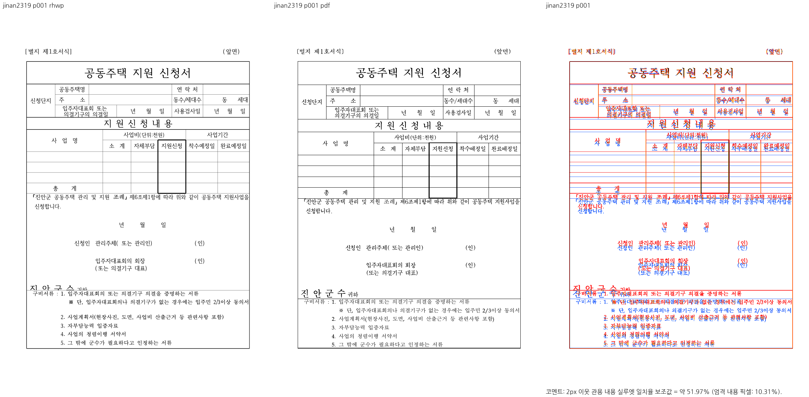
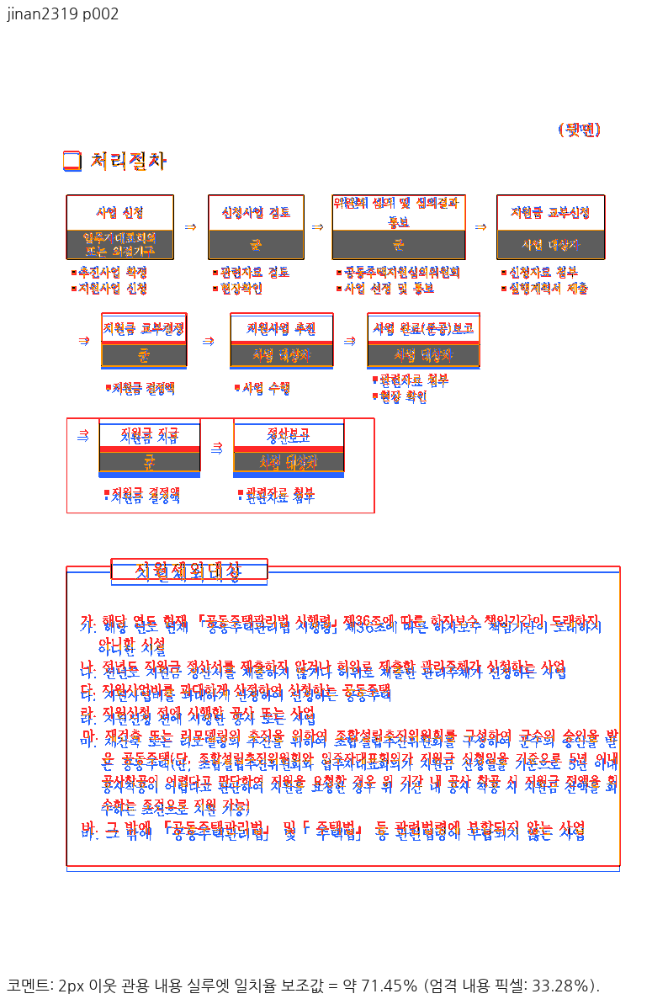


## 재활용 보도자료: 실제 차단된 off-canvas 축만 보류

[원문](../../../../samples/issue6892/156726122-recycling-press-release.hwpx), [기존 한컴 PDF](../../../../samples/issue6892/pdf/156726122-recycling-press-release-2020.pdf),
[#7445 등록](https://github.com/edwardkim/rhwp/issues/7445#issuecomment-5874555016), [보정126 검증](recycling6892_off_blocking_scope_validation.json).
신규off1건 입력만 보류했습니다. Native6/7/8쪽은99.74887/83.9489/99.94084%이며7쪽 하단그림이 누락됩니다.
앵커2함수·다른축/원문PDF는 유지했습니다. off14PASS/2FAIL +앵커1PASS/다른입력대조1FAIL이며 남은3실패를
함께 제외하지 않았습니다. 전수8쪽/freshWASM/전체회귀 승인은 미완료입니다.

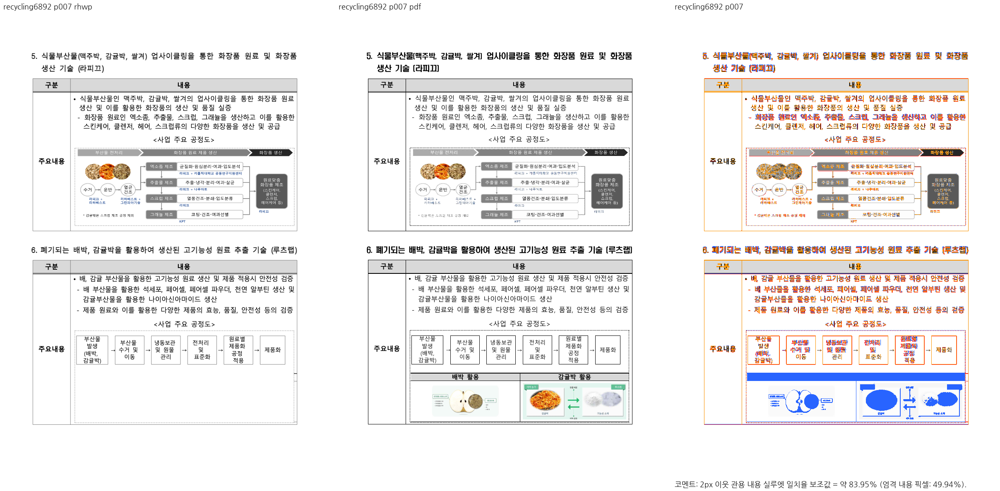
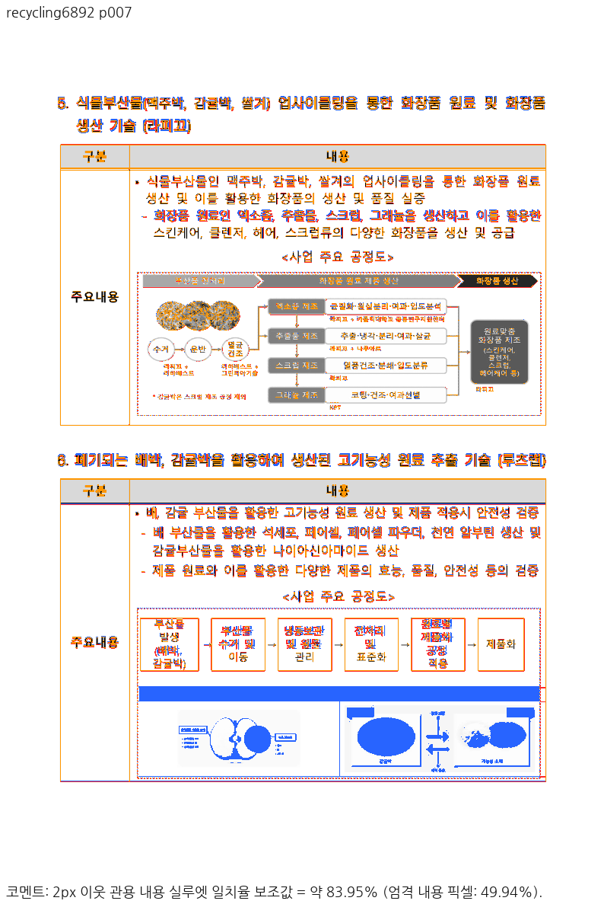


## HWP5 HWPX: 실제 차단된 off-canvas 축만 보류

[원문](../../../../samples/HWP5-nopassword-123456.hwpx), [새 한컴PDF24쪽](../../../../pdf/HWP5-nopassword-123456-hwpx-2024.pdf),
[#7445 등록](https://github.com/edwardkim/rhwp/issues/7445#issuecomment-5874791787), [보정128 검증](hwp5_off_blocking_scope_validation.json).
신규off1건 입력만 보류했습니다. 현재24/PDF24쪽이지만선택4쪽최저14쪽41.8722%이고 문단소유/글줄/종이하단이 다릅니다.
밝기·대비/왕복2함수 및다른정상함수·HWP대조군/모든다른축/원문과새PDF를 유지했습니다. off15PASS/1FAIL+정상2PASS이며
남은basic입력을동반제외하지않았습니다. 전수24쪽/freshWASM/전체회귀승인은미완료입니다.

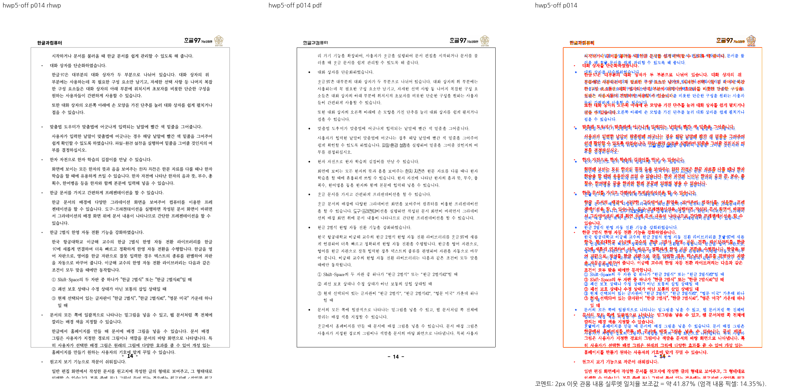
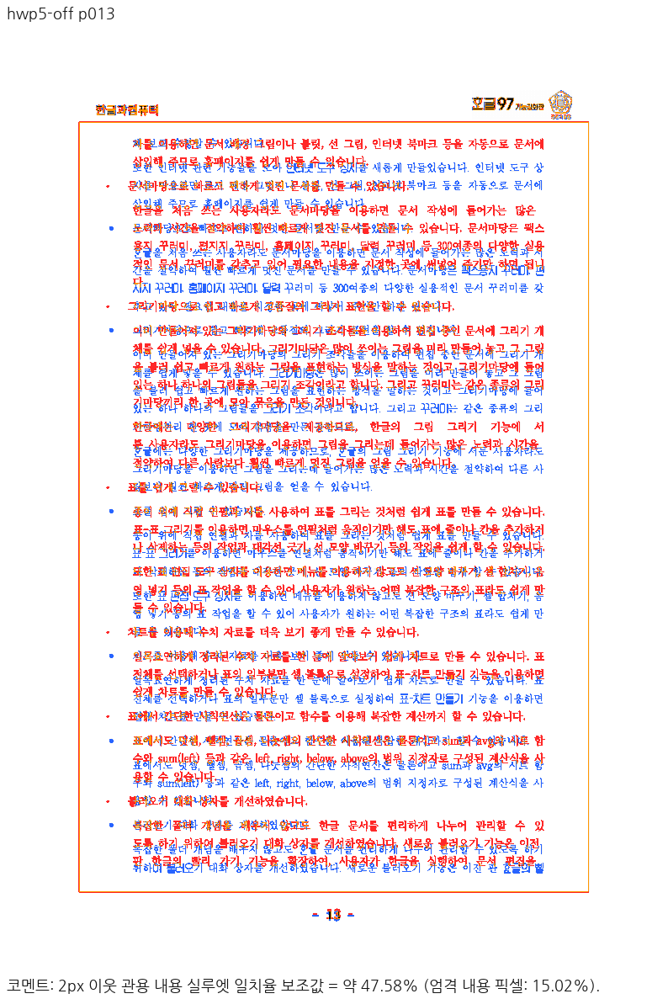


## basic2007: 실제 차단된 off-canvas·oracle 축만 보류

[원문](../../../../samples/basic/issue2007_nested_cell_pagination_42065.hwp),
[기존 한컴PDF17쪽](../../../../pdf/basic/issue2007_nested_cell_pagination_42065-hwp-2020.pdf),
[#7445 등록](https://github.com/edwardkim/rhwp/issues/7445#issuecomment-5874913489),
[보정129 검증](basic2007_blocking_scope_validation.json).
최신devel0건/17쪽 대비 후보off2건/21쪽입니다. 선택Native7쪽 최저12쪽1.04782%이며 실제 본문이 누락됩니다.
이 입력의 두 축만 보류하고 정상5함수·다른축/문서·원문PDF를 유지했습니다. off16PASS+정상5PASS,
집중전체32PASS/5FAIL이며 다른5oracle실패는 유지했습니다. 전수/freshWASM/전체회귀 승인은 미완료입니다.

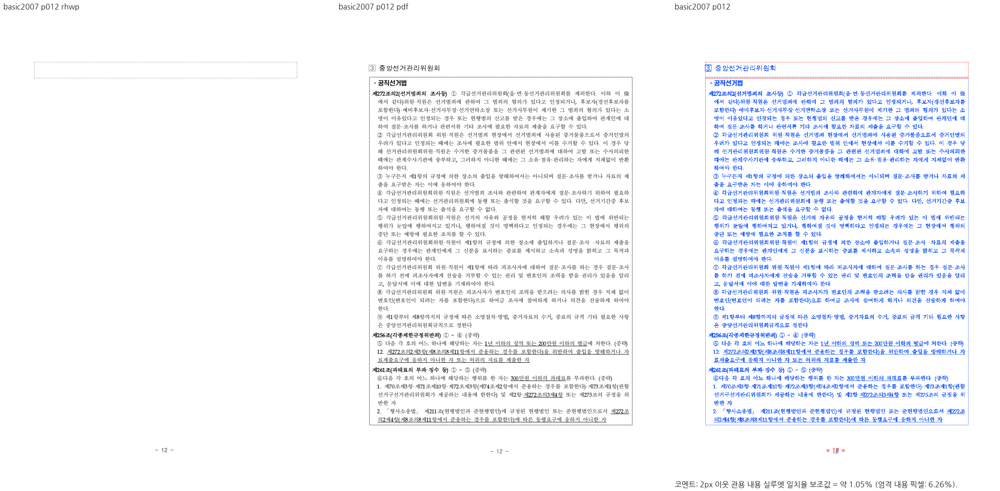
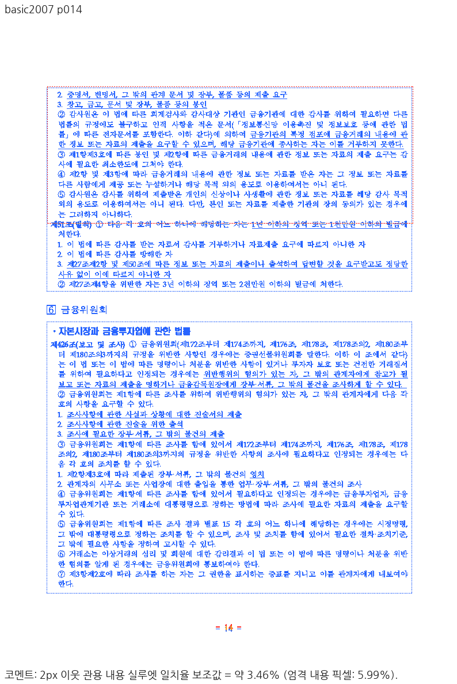


## 전직시험면제 표: 실제 차단된 쪽수만 보류

[원문](../../../../samples/task2146/21761835_jeonjik_exemption_table.hwp), [독립 한컴PDF6쪽](../../../../pdf/task2146/21761835_jeonjik_exemption_table-hwp-2020.pdf),
[#7445 등록](https://github.com/edwardkim/rhwp/issues/7445#issuecomment-5875379798), [보정131 검증](jeonjik2146_blocking_scope_validation.json).
후보7/기준6쪽이며 PDF 전체6쪽 Native 최저37.39924%입니다. 마지막 설명이 추가7쪽으로 넘어갑니다.
oracle행·#2097 입력항목·#7028/HWP #7032 선행쪽수 assertion만 보류했고 함수/머리행/대각선/빈문단/SVG와정상HWPX6쪽·다른입력/축·원문/PDF를 유지했습니다.
관련18PASS+oracle12PASS/4FAIL이며 필수lint/정책7단계exit0입니다. 다른4실패는 유지했고 최종전체/freshWASM/피델리티 승인은 미완료입니다.

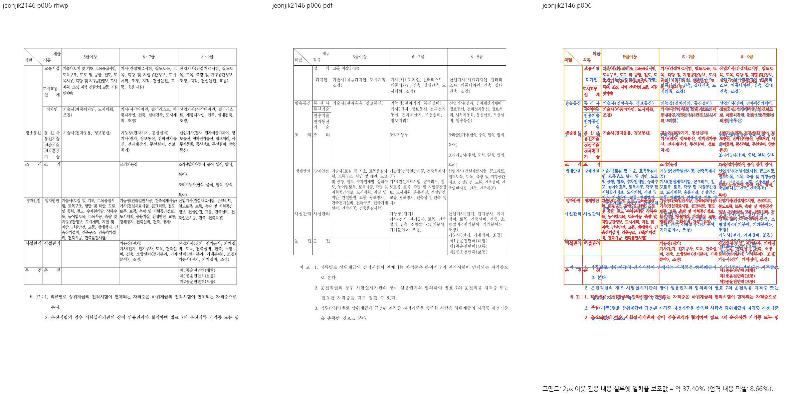
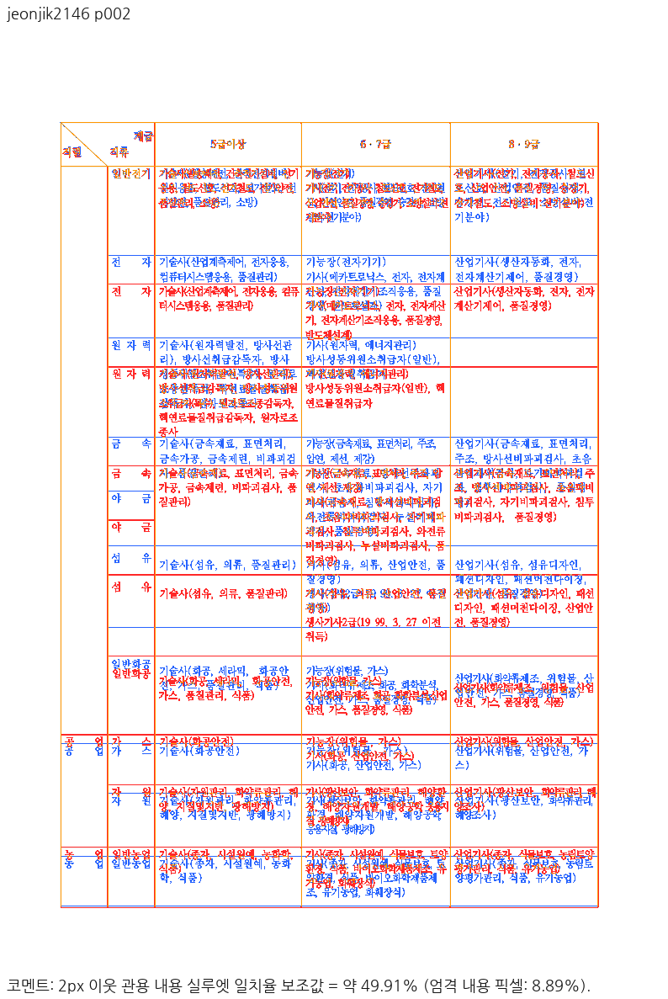
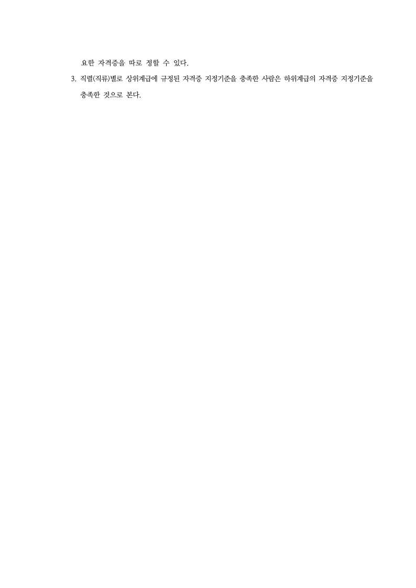


## 규제영향 중첩 표: 실제 차단된 쪽수·소속 assertion만 보류

[원문](../../../../samples/issue3637/regulatory_impact_nested_table_escape.hwpx), [독립 한컴PDF31쪽](../../../../pdf/issue3637/regulatory_impact_nested_table_escape-hwpx-2020.pdf),
[#7445 등록](https://github.com/edwardkim/rhwp/issues/7445#issuecomment-5875495573), [보정132 검증](regulatory3637_blocking_scope_validation.json).
후보32/기준31쪽이며 선택Native8쪽최저24.2785%입니다. PDF26·27쪽줄소속이후보27·28쪽으로이월됩니다.
기존함수의실패쪽수/소유assertion4개와oracle이입력행만보류했습니다. 함수·정상26쪽다음내용부재·28쪽숨은줄·넘침상한/다른입력·축·원문PDF유지.
쪽수뒤의세실패도기존Rust함수에서각각재현했고유지검사는4PASS입니다. oracle13PASS/3FAIL,lint/정책7exit0. 전31쪽/freshWASM/전체회귀·승인은미완료입니다.

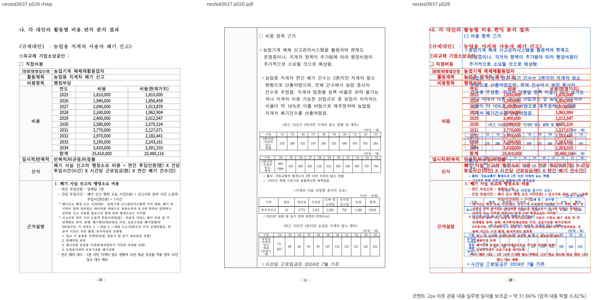
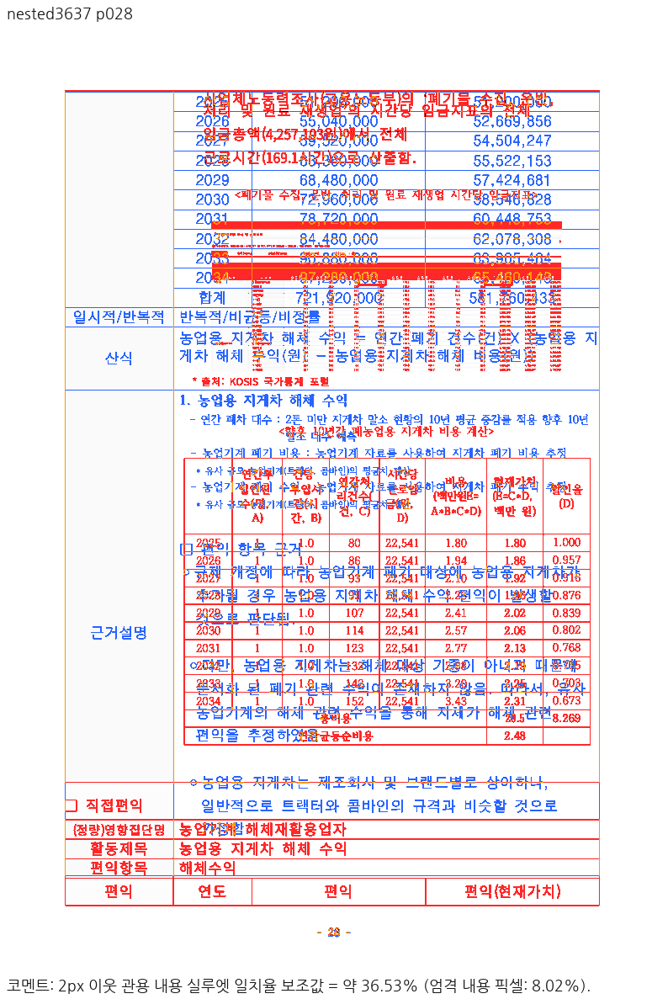
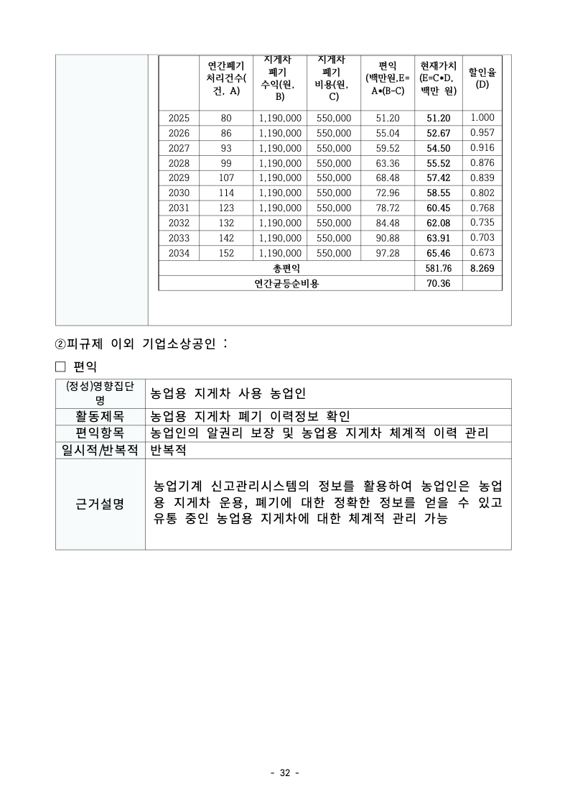


## HwpCtrl 파라미터 명세: 실제 oracle 행만 보류

[원문](../../../../samples/hwpctl_ParameterSetID_Item_v1.2.hwp), [독립 한컴PDF74쪽](../../../../pdf/hwpctl_ParameterSetID_Item_v1.2-2022.pdf),
[#7445 등록](https://github.com/edwardkim/rhwp/issues/7445#issuecomment-5875602474), [보정133 검증](parameter_control_blocking_scope_validation.json).
실제74→75쪽의oracle행한개만보류했습니다. 선택6쪽최저29.90644%이고말미표/설명이한쪽밀립니다.
정상3함수·다른입력/축/원문/PDF유지. 정상3PASS+oracle14PASS/2FAIL,lint/정책7exit0. 전74쪽/freshWASM·전체회귀/승인미완료입니다.

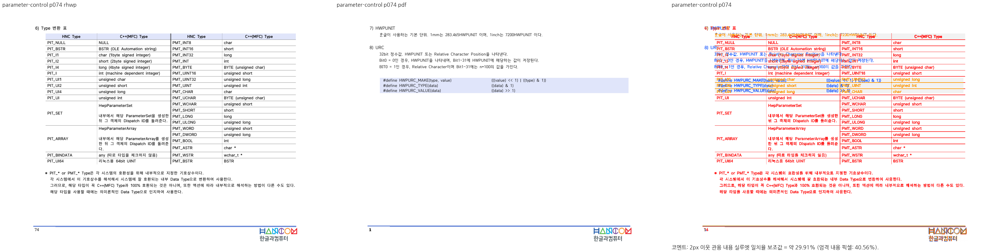
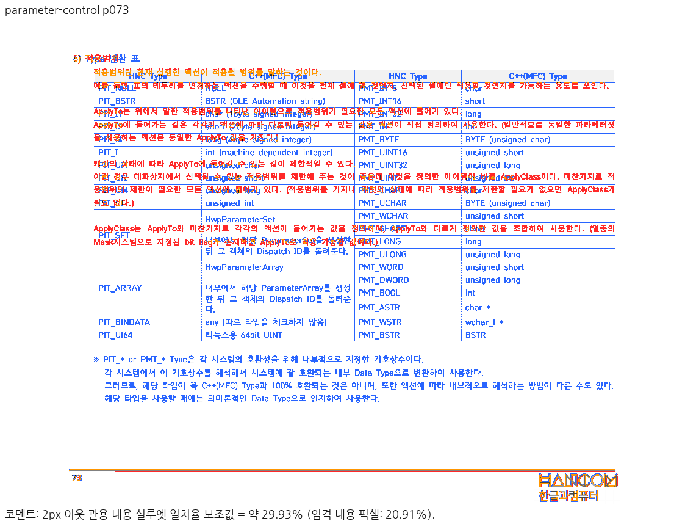
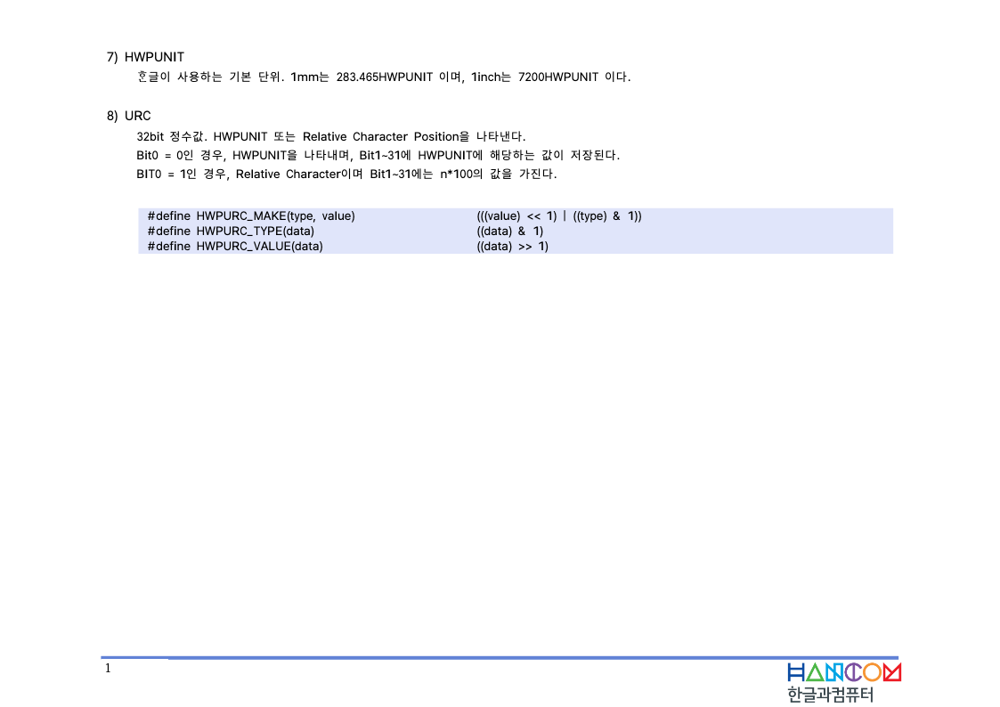


## 행정업무운영 편람 HWP: 실제 차단 범위만 보류

[원문](../../../../samples/2025%20행정업무운영%20편람%28최종%29.hwp), [독립 한컴 PDF384쪽](../../../../pdf/2025%20행정업무운영%20편람%28최종%29-hwp-2024.pdf),
[#7445 등록](https://github.com/edwardkim/rhwp/issues/7445#issuecomment-5875738025), [보정134 검증](handbook_hwp_blocking_scope_validation.json).
고정 devel의 원래 #7009·#3931 검사8개는 PASS입니다. 후보 HWP는384→383쪽, 간지313→312쪽, 본문 끝311→310쪽의 실제 assertion 실패입니다.
선택7쪽 최저6.48027%이며 부록 간지와 말미 서식/판권의 페이지 소속 차이를 직접 확인했습니다.
HWP oracle행·쪽수 전용 한 함수·실패 assertion3곳만 보류했습니다. #7009 기존 함수/정상 부록 구간, 저장 줄·분할 및 다른 입력/축·원문/PDF를 유지했습니다.
HWPX와 포맷비교3실패는 별도 판정 대상으로 남겼습니다. HWP유지6PASS+oracle15PASS/다른1FAIL을 포함한 집중21PASS/4FAIL, 필수lint/정책7exit0입니다.
전384쪽/freshWASM·전체회귀/피델리티 승인·PR준비는 미완료입니다.

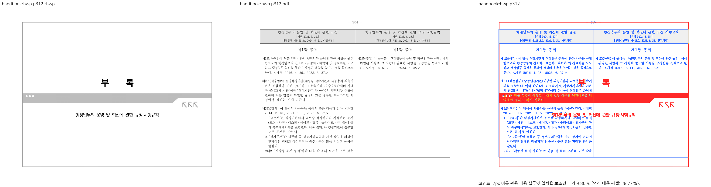
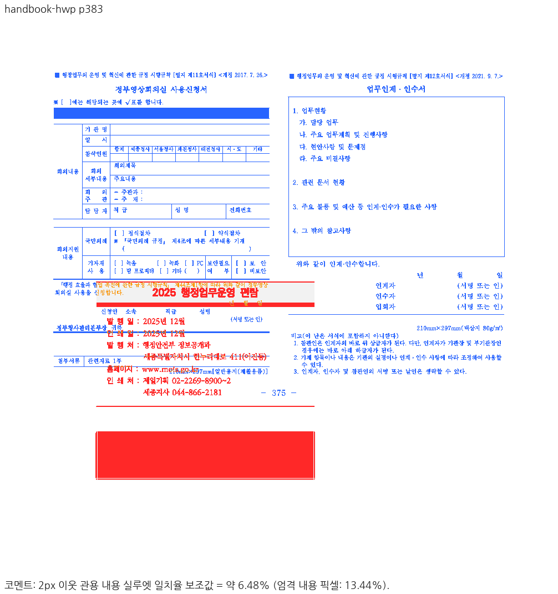
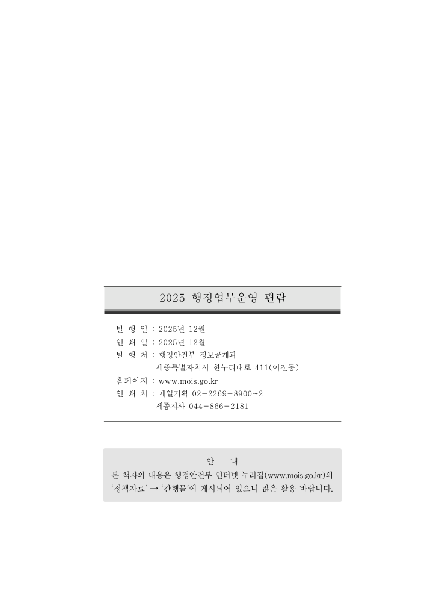


## 행정업무운영 편람 HWPX: 실제 쪽수·구조 핀만 보류

[원문](../../../../samples/2025%20행정업무운영%20편람%28최종%29.hwpx), [독립 한컴PDF384쪽](../../../../pdf/2025%20행정업무운영%20편람%28최종%29-hwpx-2024.pdf),
[#7445 등록](https://github.com/edwardkim/rhwp/issues/7445#issuecomment-5875912864), [보정135 검증](handbook_hwpx_blocking_scope_validation.json).
HWP와 별도로 선택7쪽을 비교했고 부록/말미의 물리 쪽 소속이 밀립니다. 310–312쪽0%는 한쪽만 빈 페이지인 차이입니다.
실제 쪽수·간지 assertion3곳과 포맷비대칭 전용 한 함수만 보류했습니다. 정상 부록74쪽·문답 배치·다른HWP검사와원문/PDF를 유지했습니다.
HWPX oracle는 격차가 개선되어 실제차단이 아니므로 원장행을 유지했습니다. 정상8PASS+oracle15PASS/다른1FAIL,lint/정책7exit0입니다.
전384쪽/freshWASM·다른검사군/전체회귀·피델리티 승인·PR준비는 미완료입니다.

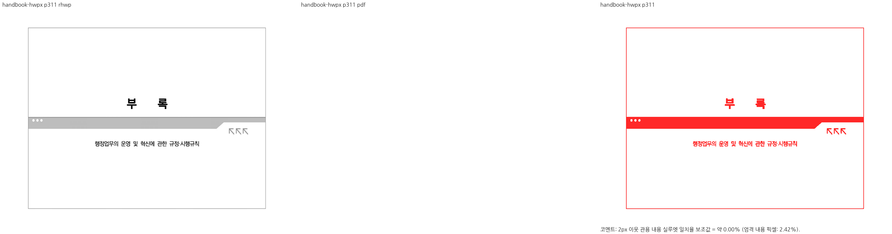
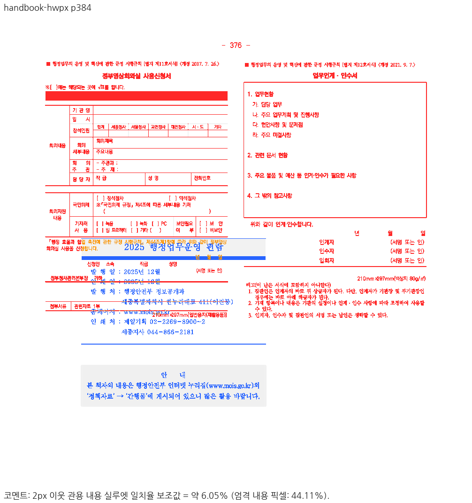
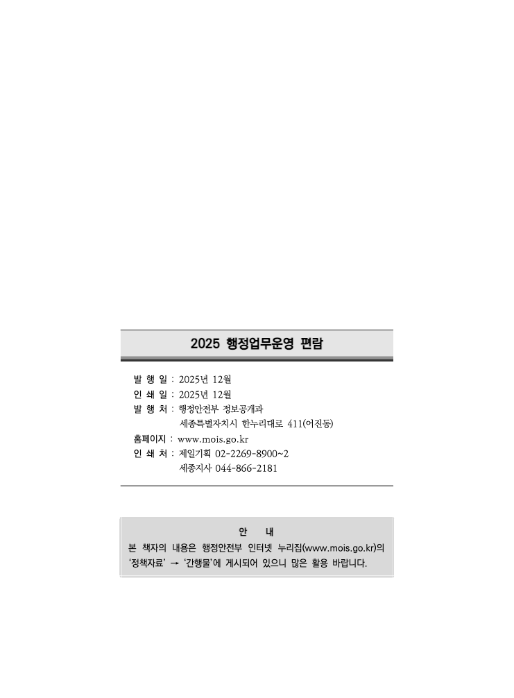


## 정책연구 HWP/HWPX: 90% 미만 문서의 실제 차단 회귀만 이관

[#7445 등록](https://github.com/edwardkim/rhwp/issues/7445#issuecomment-5876239548), [실패목록·보존범위·명령과시각증거](policy_report_blocking_scope_validation.json).
두 원문과 정상 한컴2024 PDF를 저장소에 그대로 보존했습니다. 기준215쪽/현재216쪽이며 선택 HWP6쪽 최저32.05171%, HWPX4쪽 최저31.53863%입니다.
사용자의 재지시에 따라 렌더러 개선을 중지하고 이번 변경은 모두 원복했습니다. 실제 실패118함수와 HWP oracle 한행·#4882의215쪽 전제만 제거했습니다.
기존통과20검사·왕복 쪽수등식/IR·차단하지않는HWPX oracle 및다른입력/축은 유지합니다. 유지37PASS/0FAIL, 필수lint/정책7exit0입니다.
이관은 원문 피델리티 개선·시각 gate 통과가 아닙니다. 전체문서 개선과 적절한회귀복원은 이 이슈에서 후속검토합니다. 최종 전체검증/PR준비는미완료입니다.

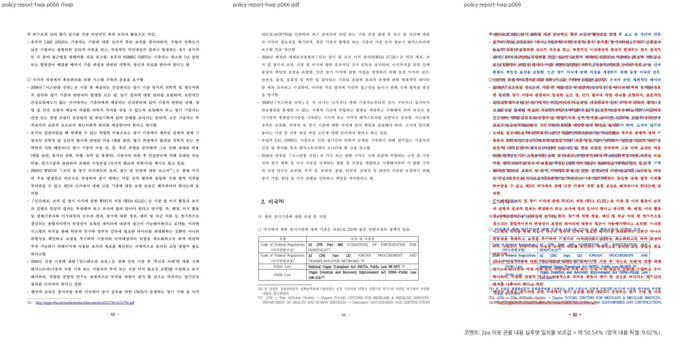
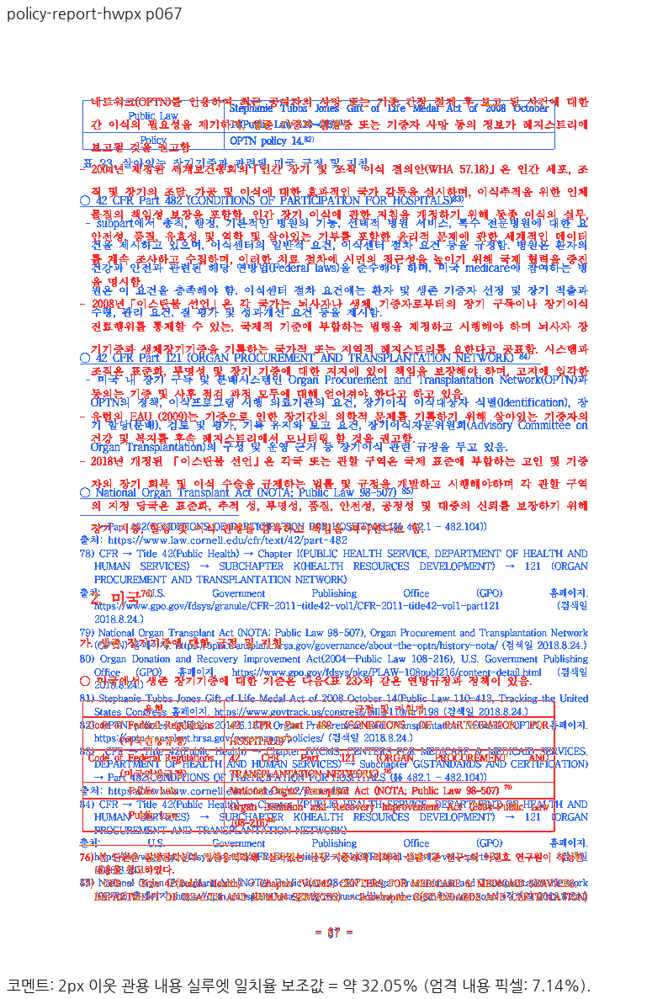


### 정책연구 HWP source 내부 검사 3개 추가

[#7445 추가](https://github.com/edwardkim/rhwp/issues/7445#issuecomment-5876621658), [보정138 검증](policy_report_source_unit_validation.json).
전체실행에서 실제실패한 source 내부3함수만 추가이관했습니다. 영향6쪽 최저18.00186%이며 물리쪽소속차이가있습니다.
원문/PDF·생산동작·다른55검사본문유지. 54PASS/0FAIL, 기존ignore1유지, 필수lint/정책7exit0입니다. 다른57전체실패와PR준비는후속검토대상입니다.

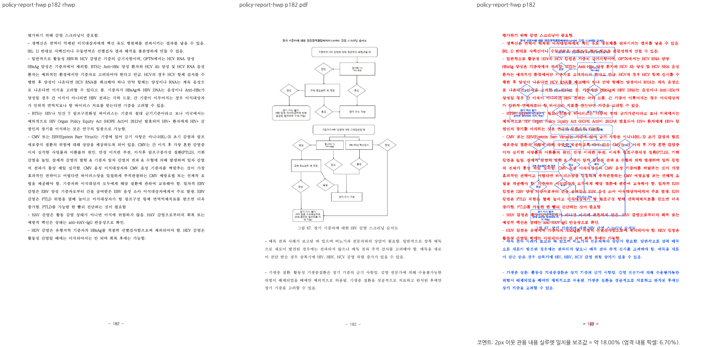
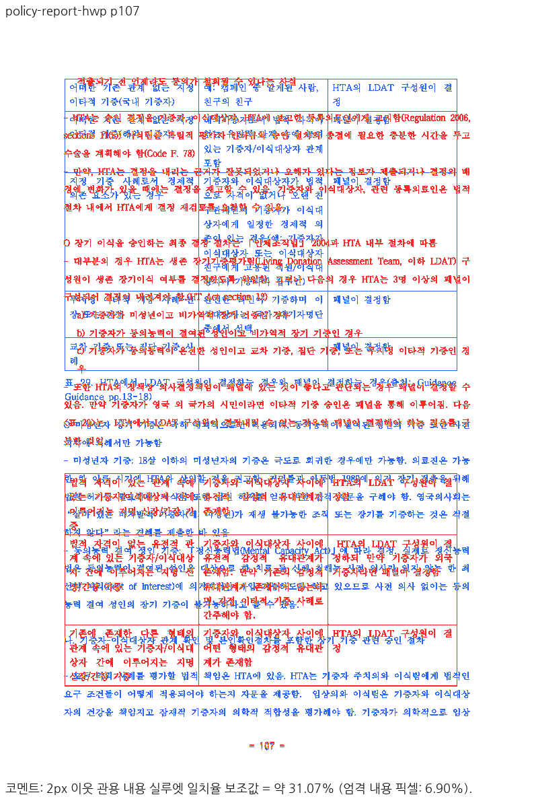


## 암호 HWPX의 쪽수 고정 — 보정139

[실패·독립 PDF·유지 범위·명령](password_page_pin_blocking_scope_validation.json). 정상 한컴 PDF는24쪽이며 이전23쪽 전제는 기준과도 다릅니다. Native 선택 최저41.87220%이므로 쪽수 고정4곳만 후속 이관했습니다. 기존11개 암호·보안 함수와 HWP3/HWP5 정상 쪽수, 원문·평문·PDF는 보존했고 최종11PASS/0FAIL 및필수lint/정책을 확인했습니다. 현재24쪽으로 기대값을 바꾸지 않았으며 문서 피델리티 개선은 후속입니다.


## basic2007: 렌더링 실패6함수와 쪽수 전제2곳 — 보정141

[개별22개 실행·제거/유지·명령](basic2007_render_tests_blocking_scope_validation.json). 보정129에서 입력 두 축만 이관한 뒤 전체 검증이 검출한 실제 차단8곳을 추가 판정했습니다. 정상17/현재21쪽·시각최저1.04782%의 렌더링6함수만 제거했고, #4252/#4272는17쪽 전제만 제외해 기능 계약을 유지했습니다. 정상14본문은 동일하며 유지16PASS/0FAIL·필수lint/정책exit0입니다. 원문/PDF·다른입력/축은 보존했습니다.


## 시장구조조사: 실제 차단 쪽수·표 소속만 — 보정142

[원문](../../../../samples/task2070/1130000-201900011_D0150004-1-002_2017년기준%20시장구조조사.hwp), [독립 한컴PDF315쪽](../../../../pdf/task2070/1130000-201900011_D0150004-1-002_2017년기준%20시장구조조사-2022.pdf), [실패·시각·범위·명령](market2070_blocking_scope_validation.json). 현재317쪽/선택6쪽 최저1.83707%이며94쪽 본문·표가 실제 기준쪽에 없습니다. 실패3함수와315쪽 전제한곳만후속이관했고,본문되감김과다른원문정상2대조군을유지해3PASS/0FAIL 및필수lint/정책을확인했습니다. 원문/PDF·다른축보존,생산보정/새함수/315→317핀갱신없음.

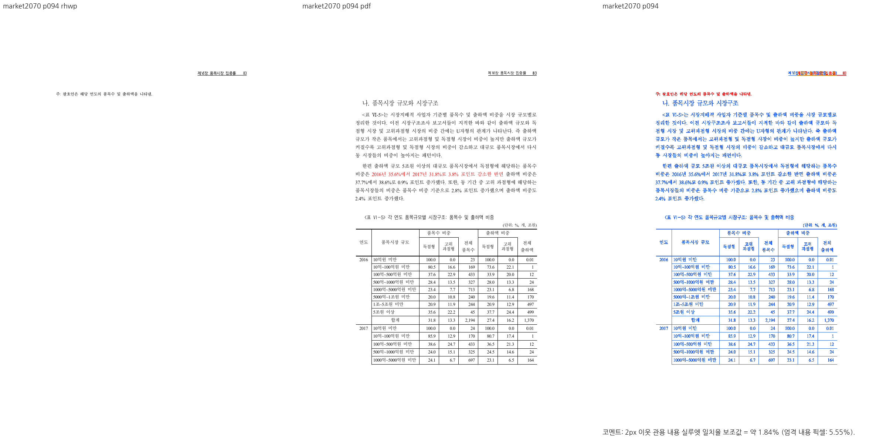
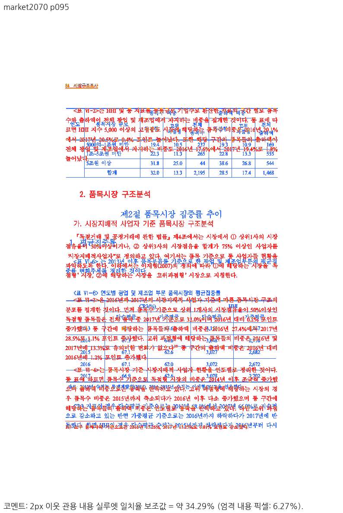


## 복학원서: 실제 실패 layer·snapshot 두 함수 — 보정143

[원문](../../../../samples/복학원서.hwp), [정상 한컴 기준1쪽](../../../../pdf/복학원서-hwp-2020.pdf), [실패·전체 시각·범위·명령](bokhak938_blocking_scope_validation.json). 현재 전체1쪽77.85291%이므로 실제 차단된 layer·snapshot 한 함수씩만 이관했습니다. 기존 정상 SVG/overlay 두 함수와 다른 snapshot·원문/PDF·기존 golden을 보존했습니다. 유지2PASS/0FAIL, 필수lint/정책 exit0이며 현재값으로 기준을 갱신하지 않았습니다. 전체 피델리티와 올바른 layer/snapshot 계약 재구축은 후속입니다.

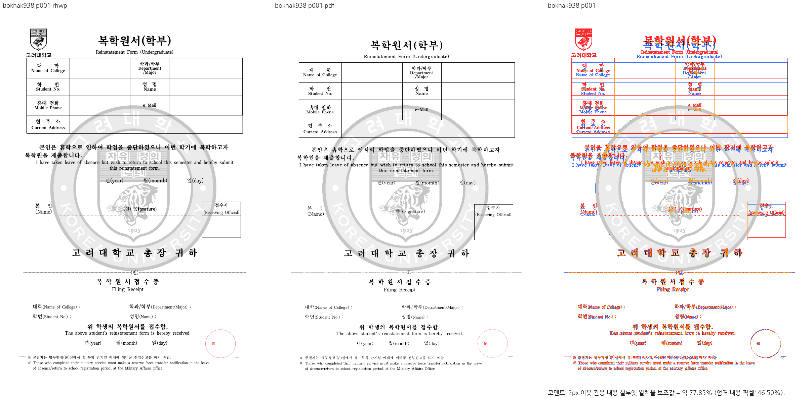
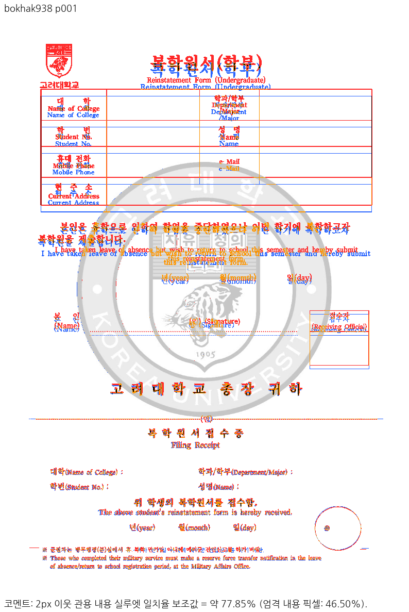


## 정책연구 HWPX: #6312 전체쪽수 전제 — 보정144

[실패·독립 시각·보존·명령](policy_caption_page_pin_blocking_scope_validation.json). 기존 그림5 검사에서 마지막215쪽 전제만 실패했습니다. 같은 원문11쪽46.45331%이므로 전제한곳만 이관했고, 그림5·공개4쪽 대조군·원문/PDF를 유지했습니다. 유지6PASS/0FAIL·필수lint/정책 통과입니다. 전체 피델리티·전체쪽수 계약 복원은 후속입니다.


## 편람 HWP: #3930 전체쪽수 전제 — 보정145

[실패·독립시각·명령](handbook_hwp_page_pin_blocking_scope_validation.json). 실제실패384쪽 전제 한곳만 이관하고 같은함수의 Q8 표제검사 및다른HWPX/바탕쪽/IR/원문/PDF는 보존했습니다. 유지1PASS/0FAIL·필수lint/정책통과이며 전체피델리티 복원은 후속입니다.


## 편람 HWPX: #5801/#3930 실제 차단 — 보정146

[실패·독립시각·제거/보존·명령](handbook_hwpx_owner_blocking_scope_validation.json). 쪽수전용1함수 및혼합함수의실패6단정만 이관했습니다. 정상3본문·저장전후13쪽tree·바탕쪽·그림IR·원문/PDF/다른축은 보존했습니다. 최종4PASS/0FAIL·필수lint/정책통과이며 정상384/현재385쪽과 부록/말미의 전체피델리티는 후속입니다.

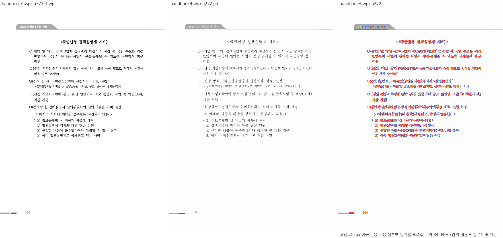
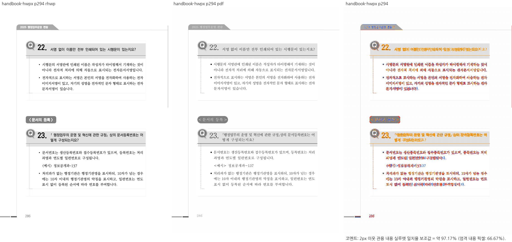
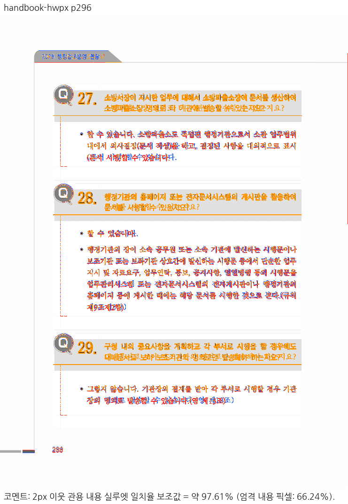


## 배포용 HWPX #7160: 실제 차단2함수 — 보정147

[원문](../../../../samples/task1768/distribution_doc.hwpx), [한컴3쪽 기준](../../../../pdf/distribution_doc-2024.pdf), [전체시각·실패·범위·명령](distribution7160_blocking_scope_validation.json). 전체Native최저60.66529%이므로실제실패두배치함수만이관했습니다. 정상4본문·원문/PDF·다른입력/축은유지4PASS/0FAIL·필수lint/정책통과입니다. 전체피델리티·두배치계약복원은후속입니다.

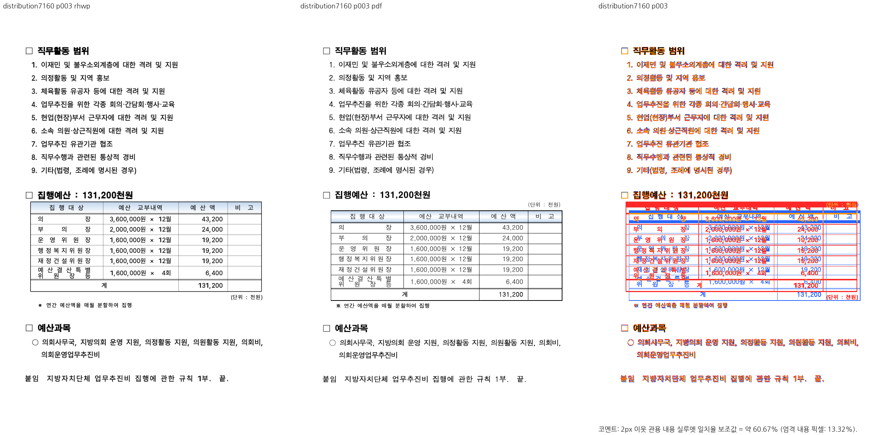
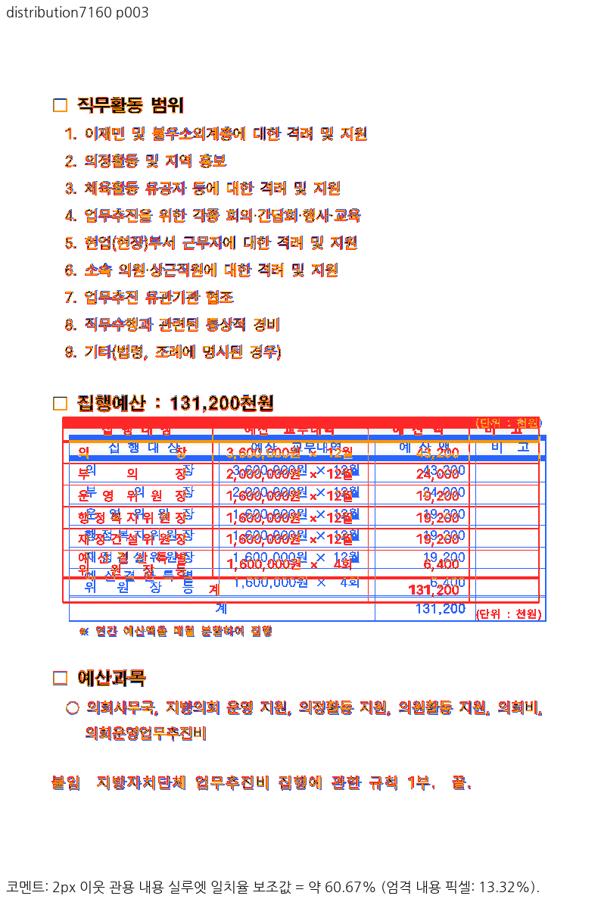


## 저슬랙 #6535: 실제 차단2함수 — 보정148

[원문](../../../../samples/issue6535/36339092_low_slack_absorb_block.hwpx), [한컴1쪽 기준](../../../../pdf/36339092_low_slack_absorb_block-2020.pdf), [시각·실패·범위·명령](low_slack6535_blocking_scope_validation.json). 정상1/현재2쪽이며별도1쪽69.33089%로서명·결재선·주소/전화블록이누락됩니다. 실제실패2함수만이관하고공통helper/다른정상2함수/원문·PDF·다른축은보존했습니다. 유지2PASS/0FAIL·필수lint/정책통과이며전체피델리티·1쪽소유계약복원은후속입니다.

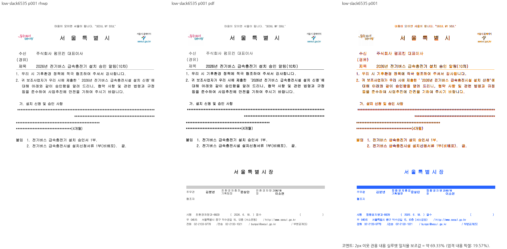
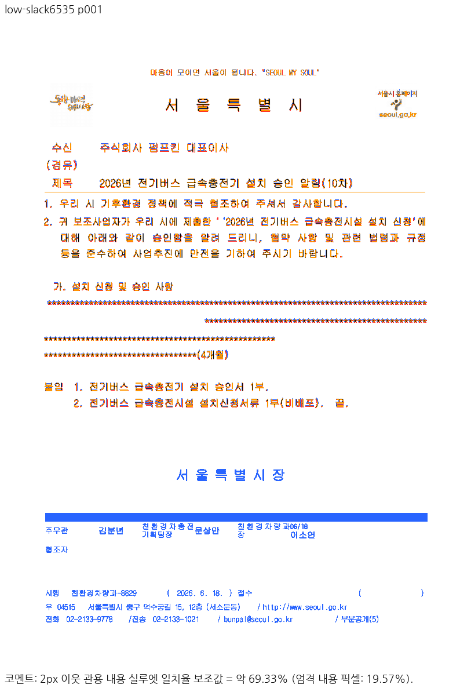


## 폰트 추적 exact-face 공개 HWP: 실제 렌더핀2곳 — 보정150

[원문](../../../../samples/143E433F503322BD33.hwp), [동일원문새한컴1쪽PDF](../../../../pdf/143E433F503322BD33-hwp-2020.pdf), [원인·시각·실패·범위·명령](fonttrace4961_blocking_scope_validation.json). 전체1쪽88.61634%이며실제counts/hash핀2곳만명시적으로이관했습니다. 폰트프로필·다른5문서·기존함수는유지했고최종6PASS/다른문서hash1FAIL이남습니다. lint/정책은exit0이나전체PASS가아닙니다. 그래프/열흐름전체피델리티와절대핀계약복원은후속입니다.

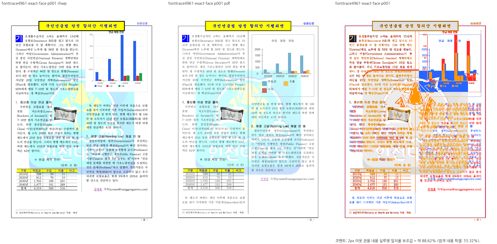
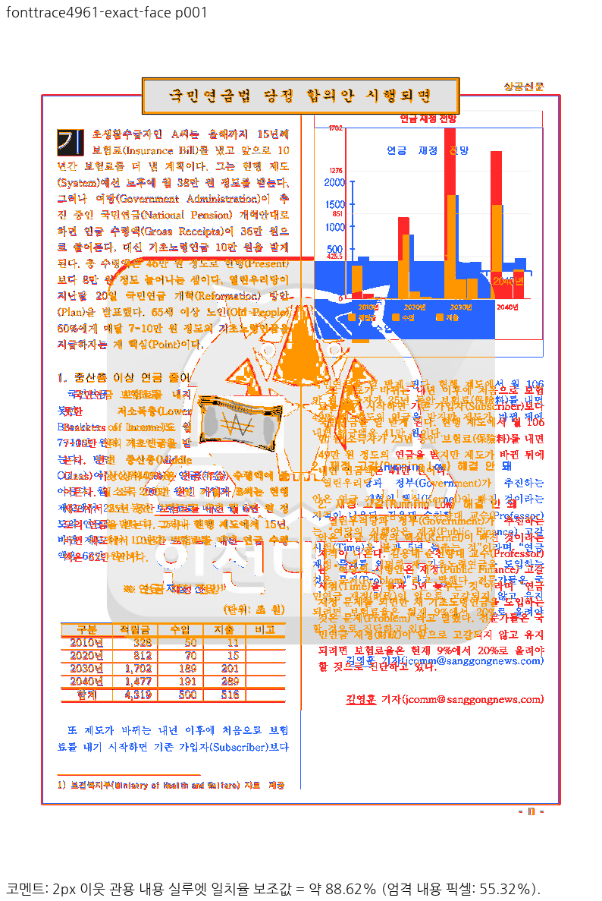


## 월간 수출입 HWP: 실패한 폰트 추적 해시만 — 보정153

[#7445 등록](https://github.com/edwardkim/rhwp/issues/7445#issuecomment-5884848639), [독립 PDF·새 전체 시각·실패·보존 범위·명령](monthly_trade_fonttrace_blocking_scope_validation.json). 정상/현재 모두19쪽이며 현재 생산 코드의 전체 Native19/19쪽은 최저73.34034%, 4/6/8/9쪽이90미만입니다. 표/뒤본문의 위치 차이를 직접 확인한 뒤 `missing-face`의 실제 실패한 `expectedLayoutHash` 한 핀만 명시적으로 이관했습니다. counts607/run136·폰트 프로필·다른5문서·기존 함수는 보존했습니다. 사용자께서 지정한 WMF 그림 복원은 유지하며 이관하지 않습니다. 집중6PASS/다른문서hash1FAIL, 필수lint/정책7exit0입니다. 문서 전체 피델리티·절대 해시 계약 복원은 후속이며 최종전체/PR준비는 미완료입니다.

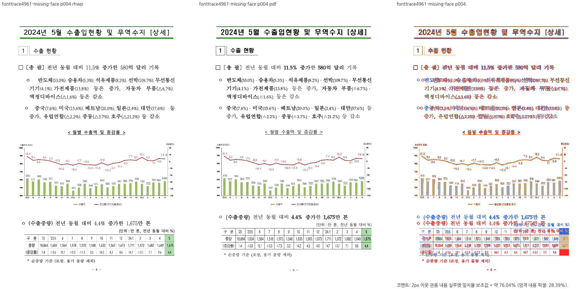
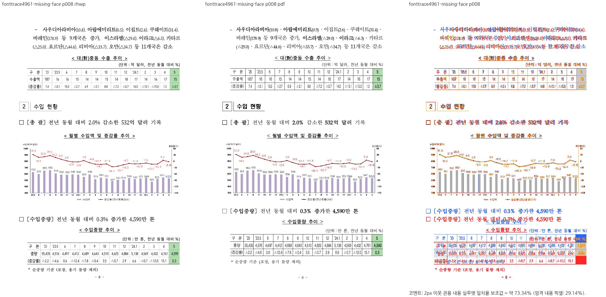
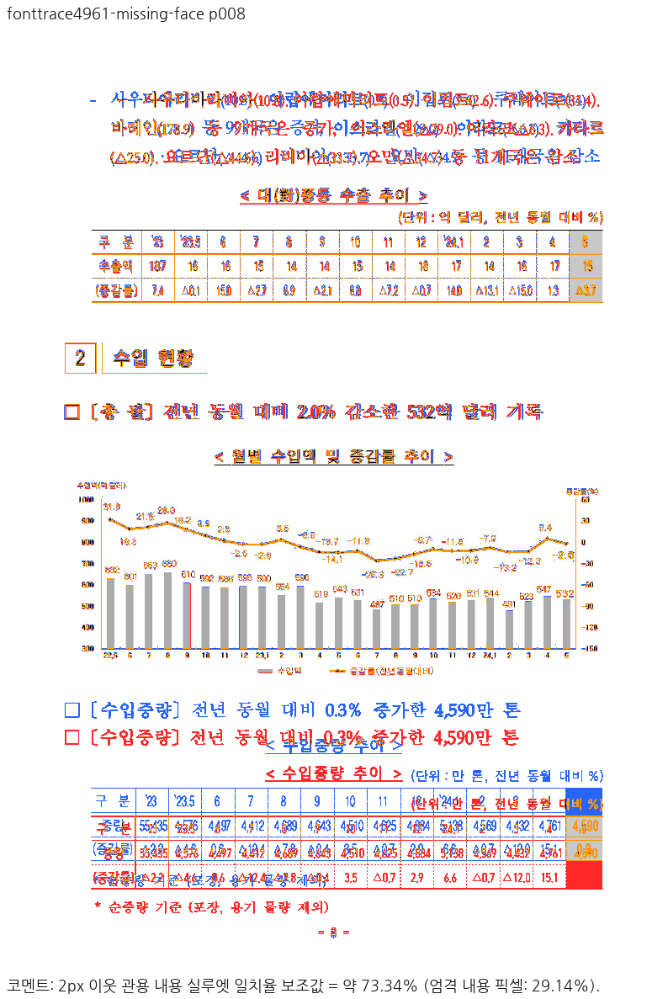


## 온새미로 HWP: 실패한 폰트 추적 해시만 — 보정154

[#7445 등록](https://github.com/edwardkim/rhwp/issues/7445#issuecomment-5885044173), [원본·기준·원인·시각·범위·명령](onsaemiro_hwp_fonttrace_blocking_scope_validation.json). 정상46/현재47쪽으로 전체 비교는 PNG 비교 전에 차단됐습니다. 별도 선택 Native/freshWASM1/2/6/46쪽에서 최저37.41779%, 6쪽43.40896%이며 보기 상자/뒤본문 위치와 단원 쪽 소속이 다릅니다. 원본의100% 상대크기 부동소수 오차/정수 절삭으로 해시 차이를 설명했으나, 사용자 지시대로 생산을 보정하지 않고 실제 실패한 HWP 해시 한 핀만 이관했습니다. counts/status·다른5입력/HWPX·프로필·기존 함수는 보존했습니다. 집중6PASS/다른HWPX hash1FAIL, 필수lint/정책7exit0입니다. 전체 문서 피델리티와 해시 계약 복원은 후속입니다.

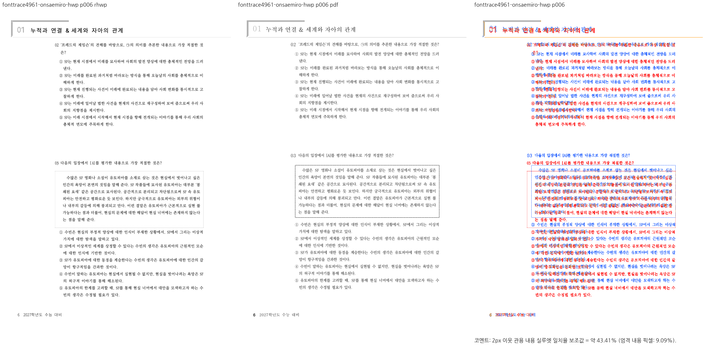
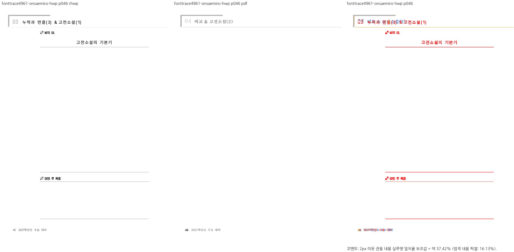


## 온새미로 HWPX: 실패한 폰트 추적 해시만 — 보정155

[#7445 등록](https://github.com/edwardkim/rhwp/issues/7445#issuecomment-5885116951), [독립 원문/기준·원인·새 시각·범위·명령](onsaemiro_hwpx_fonttrace_blocking_scope_validation.json). HWP의 시각 증거를 대신 쓰지 않고 이 HWPX의 선택1/2/6/46쪽을 Native/freshWASM으로 새 비교했습니다. 정상46/현재47쪽, 6쪽43.45823%·46쪽37.74556%이며 보기 상자/뒤본문의 배치 차이를 확인했습니다. 실패 해시 한 핀만 이관하고 생산·counts/status·다른5입력/프로필·기존 함수와 HWP/HWPX substFont 비대칭 기능 검사를 유지했습니다. 집중7PASS/0FAIL, 필수lint/정책7exit0입니다. 원문/PDF 보존, 전체 피델리티와 절대 해시 계약 복원은 후속입니다.


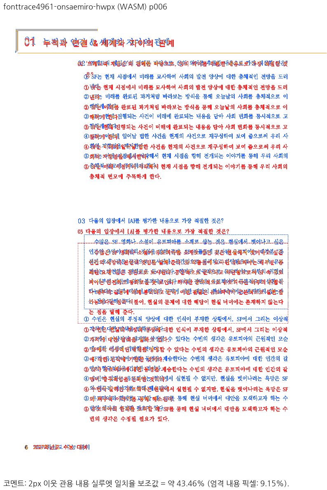


## 법률 개정 이유서 #1853: 실제 본문 넘침 입력1개 — 보정169

- [#7445 등록](https://github.com/edwardkim/rhwp/issues/7445#issuecomment-5894072744), [보존 원문](../../../../samples/issue1853_caption_precedes_body_split.hwpx), [정상 한컴2024 PDF52쪽](../../../../pdf/issue1853_caption_precedes_body_split-2024.pdf), [개별 원인·현재 실패·시각·이관 범위·명령](caption1853_blocking_scope_validation.json).
- 현재/정상 모두52쪽이지만13쪽 표의 마지막 내용이14쪽으로 넘어가 뒤 문단도 밀립니다. Native/freshWASM 선택13/14/43/44/52쪽은각62.38007/32.88144/88.03127/93.34014/96.82559%입니다. 전52쪽 PNG 통과 주장이 아닙니다.14쪽 실제 본문 줄7.9467px와44쪽 표2.3333px 초과를 확인했고, 빈 줄·글꼴 예외·공차 완화로 해소하지 않습니다.
- 실제 차단인 본문 넘침의 해당 원문1개와 baseline0행만 이관했습니다. 정상 캡션/52쪽 함수2개·기존16개본문함수·원문/PDF·다른입력/축은 유지합니다. 생산/새함수/기대값완화0, 정상2PASS·lint/정책통과입니다. 본문전수는12PASS/4FAIL이며 남은 네 입력은 별도 검토합니다. 전체 피델리티와 원장의 계약 복원은 후속입니다.

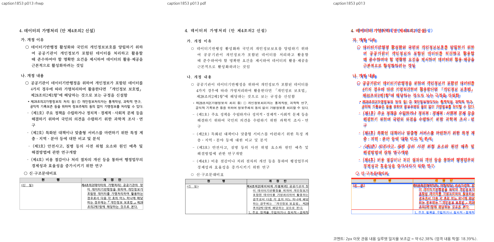
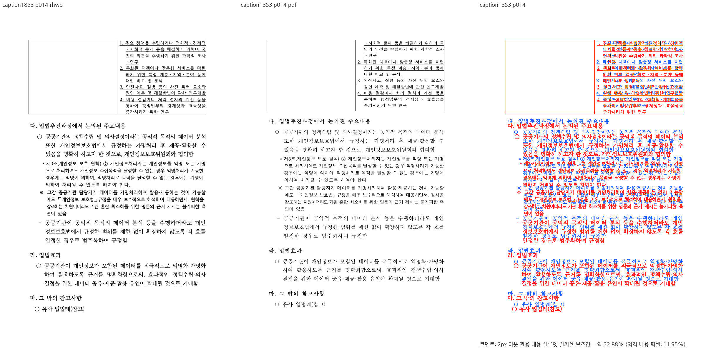
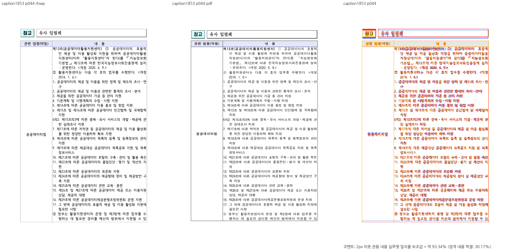
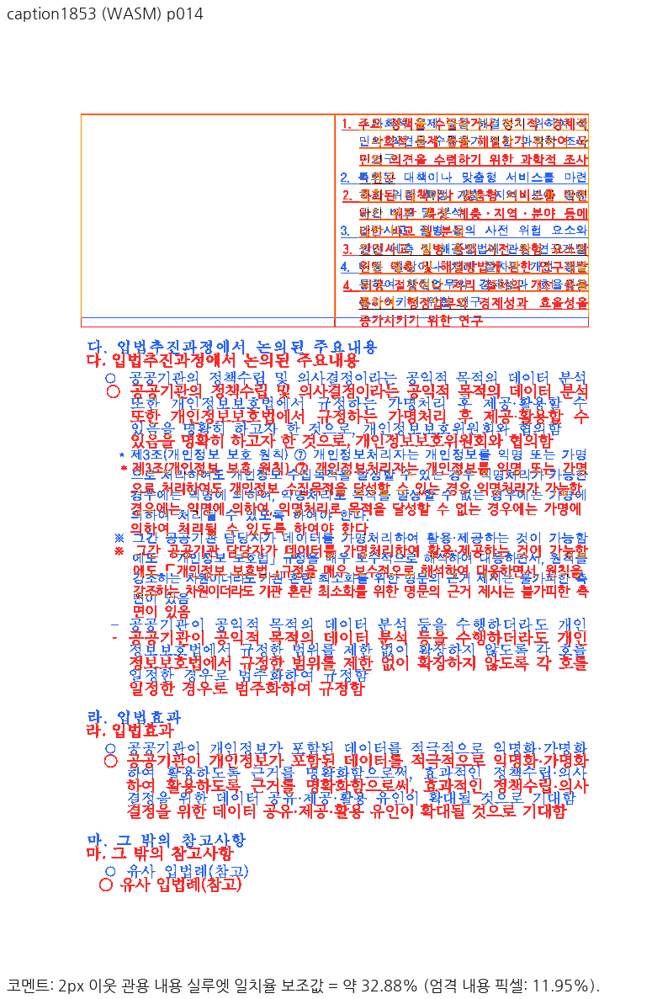

## 2026-10-03 사용자 지시: 86712 두 형식의 렌더링 회귀 이관

`samples/86712_regulatory_analysis.hwp` 및 `samples/issue1891/86712_regulatory_analysis.hwpx`를 함께 전체 피델리티 개선 범위로 이관합니다. 이번 명시 지시로 #5804/#5830/#7243/#2279 렌더링14함수와 쪽수·기하 corpus 항목을 제거합니다. 원문·PDF와 원시 파싱/저장 줄 검사는 유지합니다. 앞선 정상 검사 복원 기록보다 이번 해당 문서의 사용자 지시를 우선합니다. 전64쪽 TSV는 중단했으며 새 전쪽 검증 완료로 쓰지 않습니다. [범위와 검증](../planet6897_green_20261002/deferred_86712_body_scope.json).

## 2026-10-03 사용자 지시: #3637 규제영향분석서 렌더링 회귀 이관

`samples/issue3637/regulatory_impact_nested_table_escape.hwpx` 전31쪽 Native TSV 최저16.17029%,14쪽 미달이며15쪽 PNG에서 본문 누락을 확인했습니다. 전용 px 상한 회귀1함수 및 텍스트 겹침·용지 밖 원장2행을 제거하고 corpus 수집에서 제외합니다. 본문 넘침 제외는 유지합니다. 원문과 PDF는 보존하고, #3637의 다른 보도자료2종은 이 판정에 포함하지 않습니다. [전쪽 TSV](../planet6897_green_20261002/deferred_3637_native.tsv),[15쪽 review](../planet6897_green_20261002/deferred_3637_p15_review.png),[범위](../planet6897_green_20261002/deferred_3637_validation.json).

## 2026-10-03 양돈 소득 HWPX 전체 피델리티 이관

`samples/hwpx/156160455-social-pig-farm-income.hwpx` 동일 HWPX 직접 변환 PDF와 전11쪽 새 Native TSV 최저36.69736%,1·7쪽 미달입니다. 기존PDF 결과는 직접변환 출처 미확증으로 판정에서 제외했습니다. 현재 실패한 corpus 경로와 #6852 px 고정 회귀1함수를 제거합니다. 파싱 손상 감지 및 다른 HWP 입력 검사는 유지합니다. [전쪽 TSV](../planet6897_green_20261002/deferred_social156160455_native.tsv),[범위](../planet6897_green_20261002/deferred_social156160455_validation.json).

## 2026-10-03 pr-1674 HWP 전체 피델리티 이관

`samples/pr-1674.hwp` 전35쪽 Native TSV 최저54.09067%,9쪽미달입니다. 해당HWP 렌더링·페이지 회귀5함수·혼합1항목·원장3행을제거합니다. 미검증HWPX와다른원문검사는유지하며원문/PDF를보존합니다. [전쪽 TSV](../planet6897_green_20261002/deferred_pr1674_native.tsv),[범위](../planet6897_green_20261002/deferred_pr1674_validation.json).

## 2026-10-03 ParameterSet 74쪽 문서 전체 피델리티 이관

`samples/hwpctl_ParameterSetID_Item_v1.2.hwp` 전74쪽 Native TSV 최저44쪽22.70986%,9쪽미달입니다. 해당입력 #6656 2함수/#6307 1함수·쪽수/기하원장4행을제거하고corpus4종에서제외합니다. 원문/PDF 및 파싱자산은유지합니다. [전쪽TSV](../planet6897_green_20261002/deferred_parameterset_native.tsv),[범위](../planet6897_green_20261002/deferred_parameterset_validation.json).
