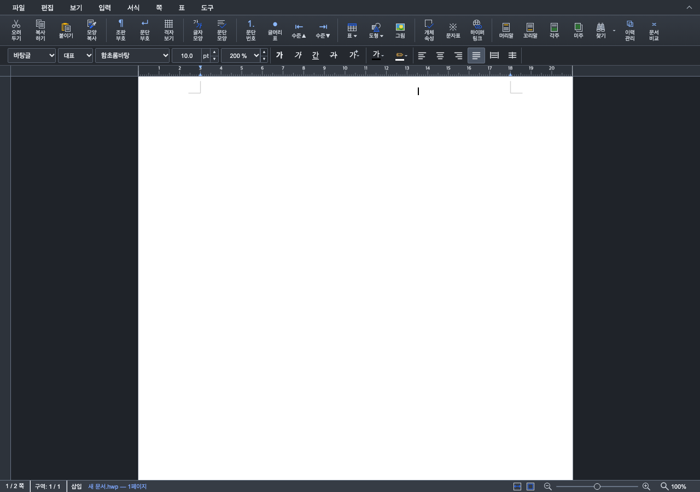
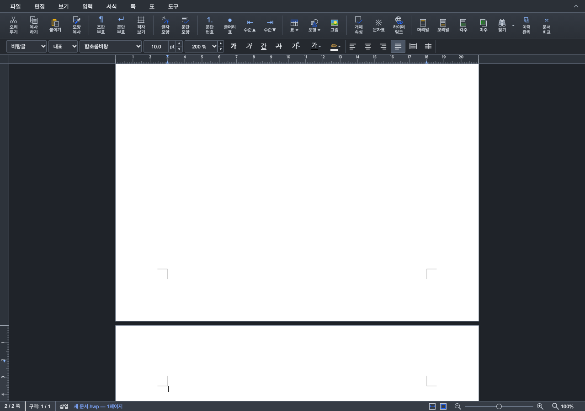
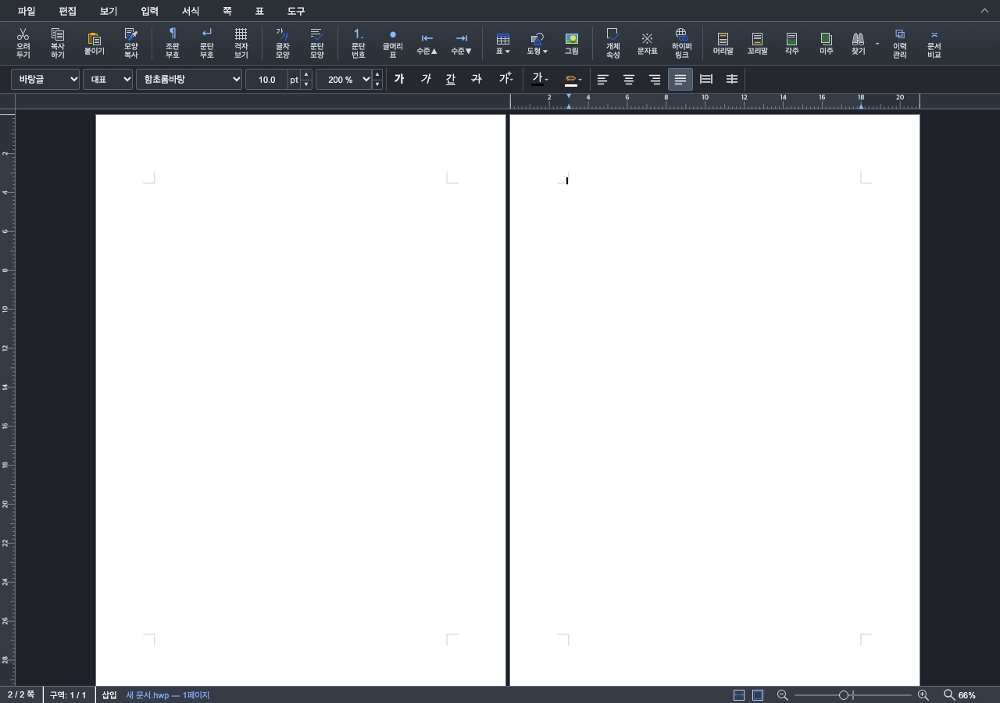

# #7486 — Studio 새 쪽 Enter 뒤 캐럿·스크롤 갱신

Issue: #7486 (참조, 자동 종료하지 않음)

## 범위와 원인

선행 PR [#7487](https://github.com/edwardkim/rhwp/pull/7487)은 `83bf0f3c840c9afc1de584c17b167610fd9caf3b`로 병합됐다. 이 최신 devel에서 `codex/studio-enter-caret-reveal`을 만들었다. 원 contributor의 본문·commit·fork branch를 보존했다. 한컴 PDF·Native/fresh WASM 대조와 Full CI에 대한 [병합 댓글](https://github.com/edwardkim/rhwp/pull/7487#issuecomment-5954170831)은 API 본문 일치 및 병합 SHA 고정 이미지 6개 로딩을 확인했다.

이 후속 변경은 본문 Enter 뒤 Studio의 DOM 캐럿과 viewport 갱신만 다룬다. 표 뒤 Enter의 문단 소유 문제는 남기므로 #7486을 닫지 않는다. Rust 조판·쪽수·높이·LineSeg·pagination flush·baseline·golden은 변경하지 않았다.

`InputHandler.executeOperation()`의 command 경로는 `SplitParagraphCommand`를 실행하고 논리 커서를 이동한 뒤 즉시 캐럿을 표시했다. `CanvasView.refreshPagesForMutation()`은 renderer 선택을 기다린 후 VirtualScroll 쪽 배치를 갱신하므로, 즉시 표시에는 이전 쪽 원점이 사용됐다. 완료 이벤트에서 다시 표시하는 `CaretLayoutReveal`은 쪽/단 나누기만 예약했고 command 경로의 본문 `splitParagraph`는 예약하지 않았다.

생산·소비 경로는 다음과 같다.

| 단계 | 실제 호출 경로 |
| --- | --- |
| 문단 생성·논리 커서 | `executeOperation(command)` → `history.execute()` → 기존 mutation effect 소비 → `cursor.moveTo()` |
| 완료 예약 | `caretLayoutReveal.requestFor(desc.command.type)` → 본문 `splitParagraph`를 허용 |
| 쪽 배치 완성 | `refreshAfterOperation()` → `afterEdit()` → `document-changed` → `CanvasView.refreshPagesForMutation()` → `refreshPages()` → `document-layout-refreshed` |
| 최종 표시 | 완료 이벤트에서 one-shot 소비 → `cursor.updateRect()` → `updateCaret()` → 기존 VirtualScroll 쪽 원점 투영·viewport reveal |
| Undo/Redo | 기존 history type 예약도 `splitParagraph`를 인정하므로 동일 완료 경계를 사용 |

문서 교체의 기존 `clear()`를 유지했다. `insertText`, `splitParagraphInCell`, `splitParagraphInHeaderFooter`, `splitParagraphInFootnote`는 이 예약 대상이 아니다. 좌표 clamp나 추가 full pagination을 넣지 않았다.

## 입력·독립 기대 계약

정식 E2E [enter-caret-reveal-issue7486.test.mjs](../../rhwp-studio/e2e/enter-caret-reveal-issue7486.test.mjs)는 코드로 A4·10pt 빈 문서를 만들고, WASM API로 줄 간격과 경계 직전 문단을 준비한다. 별도 HWP/HWPX/PDF 파일을 소비하지 않는다. 마지막 Enter·Undo·Redo는 실제 키보드 경로로 실행한다.

독립 기대 계약은 엔진의 새 쪽 owner와 논리 커서 보존, 완료된 쪽 원점에 대한 DOM 투영, viewport 안의 캐럿 표시다. 기대 화면 좌표는 변경 구현의 예약 flag에서 얻지 않고 `완료된 쪽 원점 + page-local 캐럿 좌표 × 배율`로 대조한다. 66%는 두 쪽이 같은 세로 원점·서로 다른 가로 원점을 갖는지도 검사한다. 한컴 PDF로 DOM 캐럿 좌표의 일치를 주장하지 않는다.

## 수정 전후 실행

수정 전 production 동작: 병합 기준선 `83bf0f3c840c9afc1de584c17b167610fd9caf3b`. 동일 새 E2E에서 이번 예약 두 줄만 제외해 실행했다. 설명 주석 외 runtime 차이가 기준선과 같음을 확인했다.

수정 후 source: `3f66b618c0842221981eb3353a818b696315ee53`. source 변경 없이 같은 검사를 재실행했다. 코드·입력·상태·WASM 및 이미지 SHA-256은 [validation.json](../working/assets/issue7486-studio-caret/validation.json)에 기록했다.

| 검사 | 수정 전 | 수정 후 |
| --- | --- | --- |
| 줄 간격 160% Enter41·200% Enter33·300% Enter22 × 배율 100%/66%, Enter·Undo·Redo | 69 PASS / 15 FAIL, exit 1 | 84 PASS / 0 FAIL, exit 0 |
| 100% 한 쪽 보기의 새 쪽 Enter/Redo | DOM top 132.3, 완료 원점 기대 1274.8; 스크롤 미전진 | top 1274.8, 새 쪽으로 스크롤·viewport 표시 |
| 66% 두 쪽 나란히 보기 Enter/Redo | top 87.318/left 704.844, 기대 93.918/708.144 | 기대 원점과 일치, 두 쪽 배치 유지 |
| 기존 Ctrl+Enter 쪽 나누기 E2E | 정상 대조군 | 6 PASS / 0 FAIL |
| 기존 편집 Undo 계약 E2E | 정상 대조군 | 모든 assertion PASS; object fixture의 기존 cursor lookup warning은 별도이며 본문 Enter의 근거로 쓰지 않음 |
| 전체 Studio/package 계약 테스트 | — | 1,816 PASS / 0 FAIL / 0 skipped |
| TypeScript·production bundle | — | `npx tsc --noEmit`, `npm --prefix rhwp-studio run build` exit 0 |
| E2E manifest | — | tracked 147개와 147행 일치 |

WASM은 저장소 루트에서 `CARGO_TARGET_DIR=target/pr-review scripts/wasm-pack-locked.sh --target web --out-dir pkg --dev`로 source head에서 새로 준비했다. root pkg/public의 JS·WASM SHA-256 쌍이 각각 일치했다. dev 빌드이며 release WASM 검증으로 표시하지 않는다. generated package와 public JS 동기화 diff는 제출하지 않는다.

실행 명령:

```bash
cd rhwp-studio
npx tsc --noEmit
npm test
npm run build
CHROME_PATH='/Applications/Google Chrome.app/Contents/MacOS/Google Chrome' npm run e2e:enter-caret
CHROME_PATH='/Applications/Google Chrome.app/Contents/MacOS/Google Chrome' npm run e2e:page-break-caret
CHROME_PATH='/Applications/Google Chrome.app/Contents/MacOS/Google Chrome' node e2e/run-with-vite.mjs -- node e2e/undo-contracts.test.mjs --mode=headless
```

선택한 사용자 Chrome에서도 새 문서·줄 간격 200%·100% 배율에서 33개 Enter를 UI로 입력했다. 마지막 Enter 뒤 추가 입력·배율 변경 없이 `2 / 2 쪽`, DOM top 1274.8, scrollTop 407→686, viewport 내부 표시를 확인했다. headless 6개 조합의 검증과 구분한다.

로그는 ignored `output/pr-review/studio-enter-caret-20261002/logs/`에만 보존한다. 초기 Undo runner의 경로 오류와 Chrome 검사 중 빌드 reload로 사라진 임시 문서는 결함 재현으로 세지 않았다. 작업 디렉터리와 새 문서를 바로잡은 실행 결과만 위 표에 기록했다.

## 직접 화면 판독

아래 4개는 직접 열어 확인한 실제 headless Chrome 캡처다. 100%에서 수정 전 캐럿은 이전 쪽 좌표에 남고 수정 후에는 새 쪽으로 이동한다. 66% 두 쪽 보기에서는 수정 전 작은 여백 오차와 수정 후 본문 시작 정렬을 확인했다. 후속 입력으로 보정된 캡처를 사용하지 않았다.

| 배율·배치 | 수정 전 | 수정 후 |
| --- | --- | --- |
| 100% 한 쪽 |  |  |
| 66% 두 쪽 |  |  |

문서 paint·렌더 backend는 변경되지 않아 Native/WASM 문서 Visual Sweep과 그 90% silhouette gate는 이 DOM 갱신 변경에 비해당이다. 위 캡처는 브라우저 UI 증적이며 기존 #7487의 한컴 문서 비교를 새 조판 검증으로 재인용하지 않는다. 자동 픽셀 지표·한컴 caret 비교·성능 benchmark는 미실행이다.

## 편집 계약 검토와 남은 범위

기존 `executeOperation`, `SplitParagraphCommand`, history payload와 저장 dirty 이벤트를 그대로 사용한다. 새로운 문서 mutation/snapshot·flush를 만들지 않았고 완료 예약은 한 번 소비된다. Undo/Redo의 논리 문단과 실제 새 쪽 캐럿은 6개 조합에서 확인했다. 일반 입력·셀/HF/각주 Enter의 예약 비해당과 문서 교체 clear는 unit 검사로 확인했다. IME/iOS·헤더/각주의 새 실사용 동작은 이 PR의 검증 범위에 포함하지 않는다.

조판 규칙·저장 줄 정보·분할 컷·줄 높이·기준값 변경은 비해당이다. Studio 화면 계약과 실제 검사 연결은 충족이다. PR 제출 이후 최신 CI와 타인의 리뷰·별도 merge 승인이 남는다. 본인 PR에 GitHub Approve를 제출하지 않는다.
